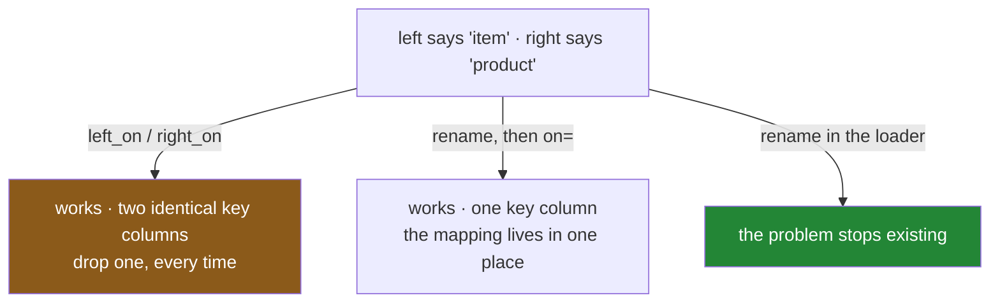

# 2.3 — When the key has two names

## One-line answer

`left_on=` and `right_on=` join two tables whose key column is spelled differently on each side — and
the result keeps **both** columns, identical and redundant, which is a tidy-up you have to do
yourself.

---

## The story

The shopping list has a column headed `item`. The price sheet, which somebody else started three
years ago, has a column headed `product`.

They contain exactly the same thing: `milk`, `bread`, `eggs`. Every value matches. Nothing about the
data is wrong.

But `merge` looks for columns the two tables share, and they share none — one says `item` and the
other says `product` — so the obvious call fails, and the error says something about no common columns
that reads like the tables have nothing to do with each other.

The fix is to say which heading on the left goes with which heading on the right. That is one extra
argument and it works immediately, and it leaves the combined sheet with two columns of item names
side by side, both saying `milk`, both saying `bread`. Somebody has to notice that and delete one.

The version most people prefer is to rename the price sheet's column first, so that from then on both
sheets say `item` and nobody has to remember the mapping again. Which of the two you do is a real
decision about where the mess lives — in every join, or once at the boundary.

---

## The idea in plain language

Three ways to join two tables whose key has different names:

**`left_on=` and `right_on=`** — say the name on each side:
`wanted.merge(prices, left_on="item", right_on="product")`. Both columns come through into the
result. They are equal on every row of an inner join, so one of them is pure redundancy and has to be
dropped, and the drop is a line you have to remember.

**Rename first** — `prices.rename(columns={"product": "item"})`, then a plain `on="item"`. The result
has one key column and no tidy-up. The rename is a decision recorded in one place, and everything
downstream sees a table whose column is called what the rest of your code calls it.

**`right_index=True`** — when the right frame's key is its *index* rather than a column. Then it is
`left_on="item", right_index=True`, and the result has one key column because the index was never a
column. This is the form to reach for when the right frame came out of a Day 31 aggregation and still
has its key in the index
([Day 31, 4.1](../../../day-31-groupby/parts/04-the-keys/4.1-the-key-became-the-index.md)) — although
`as_index=False` at the source is better than working around it here.

**Prefer the rename**, and do it in the loader
([Day 27, 5.1](../../../day-27-reading-and-writing/parts/05-the-module/5.1-the-loaders-module.md)) so
that every table in your system agrees on what the customer identifier is called. The argument is not
about typing: `left_on`/`right_on` puts the mapping at every call site, so a table joined in six
places carries the same translation six times, and the seventh place gets it wrong.

Two smaller points:

- **`left_on` and `right_on` accept lists**, for a composite key:
  `left_on=["shop", "item"], right_on=["store", "product"]`. The lists are matched **positionally**,
  so the order matters and getting it wrong joins shop against product and matches nothing.
- **`on=` is shorthand for the case where the names agree**, and it is the only one of the three that
  cannot be got subtly wrong. That is a reason to arrange for the names to agree.

---

## Why Setu needs it

- **[2.1](2.1-the-key-and-the-rows-it-pairs.md)** used `on=` because both tables happened to say
  `item`. Real tables rarely do.
- **[2.4](2.4-the-suffixes-and-the-column-on-both-sides.md)** is the same problem for the *non*-key
  columns: two tables that both have a `note`, and what pandas does about it.
- **[6.1](../06-the-module/6.1-the-joining-module.md)** puts the rename in the module, once, and
  joins on a single agreed name everywhere after that.
- **Day 42** is SQL, where the same thing is `ON a.item = b.product` and the redundancy problem does
  not arise, because you list the columns you want in the `SELECT`.
- **Day 45** is the Phase 4 gate: a joined dataset with a documented schema, which means the columns
  have agreed names.

---

## The mechanism

Two tables, same values, different headings:

```python
import pandas as pd

wanted = pd.DataFrame(
    {
        "item": pd.Series(["milk", "bread", "eggs"], dtype="str"),
        "need": [2, 1, 6],
    }
)

prices = pd.DataFrame(
    {
        "product": pd.Series(["milk", "bread", "eggs"], dtype="str"),
        "price": [1.15, 1.40, 0.32],
    }
)

print(wanted.merge(prices, left_on="item", right_on="product"))
```

**Line by line:**

- `left_on="item"` names the key column of the frame the method was called on; `right_on="product"`
  names it on the argument. **The two names are positional in meaning, not in spelling** — pandas does
  not care that they differ, only that you said which is which.
- There is no `on=` here, and passing both would raise. `on=` and the `left_on`/`right_on` pair are
  alternatives, not a set of hints to combine.
- The result has **four columns**, and two of them are the key: `item` and `product`, identical on
  every row. That is not a bug, it is pandas declining to guess which name you wanted to keep.
- The join is still an inner join, because no `how` was given
  ([2.2](2.2-the-four-hows-on-four-rows.md)). Under a left join the unmatched rows would have a value
  in `item` and a blank in `product`, which is occasionally useful and mostly confusing.

```text
    item  need product  price
0   milk     2    milk   1.15
1  bread     1   bread   1.40
2   eggs     6    eggs   0.32
```

**The tidy-up you have to do:**

```python
print(wanted.merge(prices, left_on="item", right_on="product").drop(columns="product"))
```

**Line by line:**

- `.drop(columns="product")` removes the duplicate. Which one to drop is a choice: keep the name the
  rest of your code uses, which here is `item`.
- **This line is easy to forget**, and forgetting it is not an error — it is a frame with a redundant
  column that flows downstream, doubles in width after the next join, and eventually collides with
  something.
- Under a left join, dropping `product` also throws away the only signal of which rows matched. If
  that matters, use `indicator=True` before dropping
  ([2.1](2.1-the-key-and-the-rows-it-pairs.md)).

```text
    item  need  price
0   milk     2   1.15
1  bread     1   1.40
2   eggs     6   0.32
```

**The version to actually write:**

```python
print(wanted.merge(prices.rename(columns={"product": "item"}), on="item"))
```

**Line by line:**

- `.rename(columns={...})` returns a new frame with the column renamed and leaves `prices` alone, so
  nothing else that reads `prices` is affected.
- The merge is then a plain `on="item"`: one key column in the result, no tidy-up, and the call reads
  as what it is.
- **The rename belongs further up than this.** Doing it inline means the next join has to do it again.
  Doing it in the loader means every table in the system says `item` and the problem stops existing
  ([Day 27, 5.1](../../../day-27-reading-and-writing/parts/05-the-module/5.1-the-loaders-module.md)).
- The output is identical to the drop version above, which is the point: same answer, one fewer thing
  to remember.

```text
    item  need  price
0   milk     2   1.15
1  bread     1   1.40
2   eggs     6   0.32
```

**When the right frame's key is its index:**

```python
lookup = prices.rename(columns={"product": "item"}).set_index("item")
print(wanted.merge(lookup, left_on="item", right_index=True))
```

**Line by line:**

- `.set_index("item")` moves the key into the index, which is the shape a Day 31 aggregation returns
  by default ([Day 31, 4.1](../../../day-31-groupby/parts/04-the-keys/4.1-the-key-became-the-index.md)).
- `right_index=True` says *match against the right frame's index rather than one of its columns.*
  There is a matching `left_index=True` for the other side.
- The result has **one** key column, because the index was never a column and nothing was duplicated —
  so this form does not need the tidy-up.
- It is still better to fix the source: `as_index=False` on the group-by produces a frame with the key
  as a column, and then every join is a plain `on=`.

```text
    item  need  price
0   milk     2   1.15
1  bread     1   1.40
2   eggs     6   0.32
```



---

## When it breaks

**Merging two tables with no shared column and no `left_on`:**

```text
$ uv run python -c "
import pandas as pd
wanted = pd.DataFrame({'item': ['milk', 'bread'], 'need': [2, 1]})
prices = pd.DataFrame({'product': ['milk', 'bread'], 'price': [1.15, 1.40]})
wanted.merge(prices)
"
```

```text
Traceback (most recent call last):
  File "<string>", line 4, in <module>
MergeError: No common columns to perform merge on. Merge options: left_on=None, right_on=None, left_index=False, right_index=False
```

**What it means.** A good error: it says what is missing and lists the four arguments that would fix
it. The trap is that it only appears when the two tables share **no** column at all. If they happen to
share an unrelated one — an `ingested_at`, a `source` — pandas joins on that instead, matches almost
nothing, and returns a nearly empty frame with no complaint
([2.1](2.1-the-key-and-the-rows-it-pairs.md)). The loud version is the lucky one.

**Composite keys listed in the wrong order:**

```text
$ uv run python -c "
import pandas as pd
left  = pd.DataFrame({'shop': ['main', 'main'], 'item': ['milk', 'bread'], 'need': [2, 1]})
right = pd.DataFrame({'store': ['main', 'main'], 'product': ['milk', 'bread'], 'price': [1.15, 1.40]})
right_order = left.merge(right, left_on=['shop', 'item'], right_on=['store', 'product'])
wrong_order = left.merge(right, left_on=['shop', 'item'], right_on=['product', 'store'])
print('right order:', len(right_order), 'rows')
print('wrong order:', len(wrong_order), 'rows')
"
```

```text
right order: 2 rows
wrong order: 0 rows
```

**What it means.** The two lists are matched **positionally**: the first name on the left goes with
the first on the right. Swapping them joins `shop` against `product` and `item` against `store`,
nothing matches, and the result is empty. **No error** — an empty frame is a valid frame, and the code
looks symmetrical enough that a reviewer reads past it. This is the strongest argument for renaming:
`on=["shop", "item"]` cannot be got wrong this way.

**The duplicate key column that survived into the next join:**

```text
$ uv run python -c "
import pandas as pd
wanted = pd.DataFrame({'item': ['milk'], 'need': [2]})
prices = pd.DataFrame({'product': ['milk'], 'price': [1.15]})
aisles = pd.DataFrame({'product': ['milk'], 'aisle': ['dairy']})
step1 = wanted.merge(prices, left_on='item', right_on='product')
print('after one join :', list(step1.columns))
step2 = step1.merge(aisles, on='product')
print('after two joins:', list(step2.columns))
"
```

```text
after one join : ['item', 'need', 'product', 'price']
after two joins: ['item', 'need', 'product', 'price', 'aisle']
```

**What it means.** The undropped `product` column then became the key of the second join, which
happens to work here and is entirely accidental. The frame now carries two names for the same thing
and the next person has to work out which is authoritative. **Nothing errors and nothing looks
wrong**, which is how a schema acquires `customer_id`, `cust_id` and `customerId` over three years.
Drop the duplicate at the join that created it, or rename so it never exists.

---

## In production

**What a professional writes instead of the teaching version.** The column-name mapping lives in one
place, applied at the boundary, so every join downstream is a plain `on=`:

```python
import pandas as pd

# Source column -> the name the rest of the system uses. One place, one truth.
PRICE_SHEET_COLUMNS: dict[str, str] = {
    "product": "item",
    "unit_price": "price",
    "shelf": "aisle",
}


def load_price_sheet(path: str) -> pd.DataFrame:
    """Read the price sheet and rename its columns to the system's vocabulary."""
    raw = pd.read_csv(path, dtype={"product": "str", "shelf": "str"})

    unexpected = sorted(set(PRICE_SHEET_COLUMNS) - set(raw.columns))
    if unexpected:
        raise KeyError(
            f"{path} is missing expected source columns {unexpected}; has {list(raw.columns)}"
        )

    renamed = raw.rename(columns=PRICE_SHEET_COLUMNS)
    collisions = [
        name for name in PRICE_SHEET_COLUMNS.values() if list(renamed.columns).count(name) > 1
    ]
    if collisions:
        raise ValueError(f"renaming produced duplicate columns {collisions} in {path}")
    return renamed
```

**Line by line:**

- `PRICE_SHEET_COLUMNS` is a constant with a comment saying what it is for. Six months later somebody
  will ask "what is this file's `shelf` column called in our tables", and the answer is one grep away.
- The rename happens **in the loader**, so every consumer of this table sees the system's names and no
  join anywhere needs `left_on`/`right_on`. That is the whole point of the pattern.
- The `unexpected` check runs **before** the rename, so a source that changed its own column names
  fails with a sentence naming both what was expected and what arrived — rather than silently
  producing a frame missing a column that something needs three steps later.
- `dtype=` at read time on the key column, because a key read as a number loses a leading zero and
  then matches nothing
  ([Day 27, 1.4](../../../day-27-reading-and-writing/parts/01-the-csv/1.4-dtype-at-read-time.md)).
- The `collisions` check catches the case where the source already has a column called `item` **and** a
  column called `product`: the rename would then produce two columns with the same name, which pandas
  permits and nothing downstream survives.
- `raw.rename(...)` returns a new frame rather than mutating, so a caller holding `raw` is unaffected.

**What changes at scale.** The rename itself is free — pandas swaps the column labels and copies no
data. What changes is organisational. In a system with twenty tables from six sources, the mapping
constants become a **schema registry**: one file, one entry per source, reviewed when a source
changes. The alternative — `left_on`/`right_on` at every call site — scales as the number of joins
rather than the number of sources, and the failure mode is that two joins in different files disagree
about which column is the key, so two reports built from the same data give different answers. The
larger version of the same discipline is a data contract: the producing team commits to column names
and types, and the loader validates against it rather than guessing.

**The failure mode that only appears with real data.** The two columns have the same name and hold
different things. A `code` column that is a product code in one table and a store code in the other
joins without error, matches a surprising number of rows by coincidence, and produces a plausible
table of nonsense. This is worse than a name mismatch, because a name mismatch fails loudly and this
does not. The defence is not naming: it is the row-count and match-rate checks in
[3.1](../03-the-row-count/3.1-count-the-rows-before-and-after.md), and a moment's thought about
whether a key that matches 12% of rows is a key at all.

**The review comment a senior engineer leaves.** *"`left_on='customer_id', right_on='cust_ref'`
appears in four files now, and one of them has the arguments the wrong way round. Please rename at the
loader — add it to the source's column map — so every join here is `on='customer_id'`."*

**The interview question.** *"How do you join two tables whose key columns have different names?"*
`left_on=` and `right_on=`, which takes a name for each side — and the result keeps both columns, so
one has to be dropped. The follow-up worth being ready for: *"is that what you would do?"* Usually not:
renaming at load time means every join afterwards is a plain `on=`, the mapping lives in one place
instead of at every call site, and the composite-key case cannot be got wrong by listing the names in
different orders on the two sides.

---

## Check yourself

```bash
uv run python -c "
import pandas as pd
wanted = pd.DataFrame({'item': pd.Series(['milk', 'bread', 'eggs'], dtype='str'), 'need': [2, 1, 6]})
prices = pd.DataFrame({'product': pd.Series(['milk', 'bread', 'eggs'], dtype='str'), 'price': [1.15, 1.40, 0.32]})
two_names = wanted.merge(prices, left_on='item', right_on='product')
renamed   = wanted.merge(prices.rename(columns={'product': 'item'}), on='item')
indexed   = wanted.merge(prices.rename(columns={'product': 'item'}).set_index('item'),
                         left_on='item', right_index=True)
print('left_on/right_on:', list(two_names.columns))
print('renamed         :', list(renamed.columns))
print('right_index     :', list(indexed.columns))
print()
print('same values?', renamed.equals(indexed.reset_index(drop=True)))
"
```

Three calls, three column lists, one of which is longer than the others. Say why, and say what you
would have to write to make it match.

**Answer out loud, without scrolling up:**

> Say the two arguments that join tables whose key is spelled differently, and say what the result
> contains that a plain `on=` would not. Then give the reason to rename at the loader instead, in
> terms of how many places the mapping ends up living.

---

**Next:** [2.4 — The suffixes, and the column on both sides](2.4-the-suffixes-and-the-column-on-both-sides.md).
