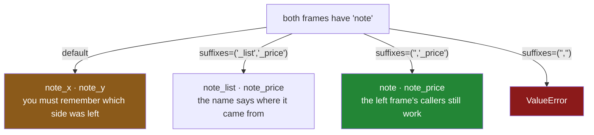

# 2.4 — The suffixes, and the column on both sides

## One-line answer

When both tables have a non-key column with the same name, `merge` keeps both and renames them `_x`
and `_y` — two of the least informative column names in the language — and `suffixes=` is how you say
what they should be called instead.

---

## The story

There is a note column on the shopping list: somebody writes *"the big one"* next to the milk, or
*"only if fresh"* next to the bread.

There is also a note column on the price sheet, and it means something completely different: *"was
£1.30 in March"*, *"discontinued"*.

Both columns are called `note`, because `note` is what you call a note.

The combined sheet comes back with `note_x` and `note_y` on it. Both are real, both are useful, and
nothing on the sheet says which is which. Somebody has to remember that the shopping list was on the
left, so `note_x` is the shopping note and `note_y` is the price history — and they have to remember
it every time they look at the sheet, because the sheet does not say.

A week later the same person builds the sheet the other way round, from the price sheet joined to the
list, and now `note_x` is the price history. Both sheets are correct. Neither can be read without
knowing how it was made.

---

## The idea in plain language

`merge` combines the columns of two tables. The key columns are merged into one
([2.1](2.1-the-key-and-the-rows-it-pairs.md)). Every other column comes through as itself — **unless
both tables have a column with that name**, in which case pandas cannot put two different things in
one column and cannot silently drop one.

So it renames them. By default the left one gets `_x` and the right one gets `_y`.

That is a reasonable default in the sense that it never loses data and never raises. It is a terrible
default in every other sense, because `note_x` says nothing about what the column contains, and
working it out requires knowing which frame was on the left — a fact that lives in the call, not in
the result.

**`suffixes=("_list", "_price")`** replaces them with something meaningful. The tuple is `(left,
right)` in that order, and the names should say **where the column came from**, not that it came
second.

Three further behaviours worth knowing:

- **One suffix can be empty.** `suffixes=("", "_price")` leaves the left column's name alone and
  renames only the right one. That is often exactly right: the left frame is the thing you are
  enriching, its `note` should stay `note`, and the incoming one becomes `note_price`.
- **Both cannot be empty.** `suffixes=("", "")` raises, because it would produce two columns with the
  same name. The real error text is below, and it is a good one.
- **The suffix is applied to *every* overlapping column**, not just the one you were thinking of. Two
  tables that share `note`, `updated_at` and `source` produce six columns from three, all suffixed.
  That is usually a sign the two tables have more in common than the join intended.

The habit worth forming: **before merging, look at what the two frames share.**
`set(left.columns) & set(right.columns)` is one line, and it tells you both what the key will be if
you forget `on=` ([2.1](2.1-the-key-and-the-rows-it-pairs.md)) and which columns are about to be
suffixed. If the answer surprises you, the merge was going to surprise you too.

---

## Why Setu needs it

- **[2.1](2.1-the-key-and-the-rows-it-pairs.md)** showed that shared columns become the key when you
  forget `on=`. This is what happens to the shared columns you *did* exclude from the key.
- **[2.3](2.3-when-the-key-has-two-names.md)** was the same problem for the key column, and had the
  same answer: fix the names at the boundary rather than at every call.
- **[6.1](../06-the-module/6.1-the-joining-module.md)** passes explicit `suffixes` in the module's
  merge helper, and refuses a merge whose overlap was not declared.
- **Day 42** is SQL, where the equivalent is being forced to write `a.note AS list_note, b.note AS
  price_note` in the `SELECT` — more typing, and no way to end up with a column called `note_y`.
- **Day 45** is the Phase 4 gate, whose deliverable has a documented schema; `note_x` is not a
  documented name.

---

## The mechanism

Two tables that share a non-key column:

```python
import pandas as pd

wanted = pd.DataFrame(
    {
        "item": pd.Series(["milk", "bread"], dtype="str"),
        "need": [2, 1],
        "note": pd.Series(["the big one", "only if fresh"], dtype="str"),
    }
)

prices = pd.DataFrame(
    {
        "item": pd.Series(["milk", "bread"], dtype="str"),
        "price": [1.15, 1.40],
        "note": pd.Series(["was 1.30 in March", "own brand"], dtype="str"),
    }
)

print("shared columns:", sorted(set(wanted.columns) & set(prices.columns)))
print()
print(wanted.merge(prices, on="item"))
```

**Line by line:**

- `sorted(set(...) & set(...))` is the one-line habit: it prints `['item', 'note']`, telling you both
  that `item` is available as a key and that `note` is about to be suffixed. **Run this before every
  unfamiliar merge.**
- `on="item"` names the key, so `note` is *not* part of it — which is what makes it an overlapping
  ordinary column rather than a second join condition.
- The result has `note_x` and `note_y`. **Both contain real data and neither name says what it is.**
- `_x` is the left frame's, `_y` is the right's, and remembering that is a fact about pandas rather
  than about your data.

```text
shared columns: ['item', 'note']

    item  need         note_x  price             note_y
0   milk     2    the big one   1.15  was 1.30 in March
1  bread     1  only if fresh   1.40          own brand
```

**Naming them:**

```python
print(wanted.merge(prices, on="item", suffixes=("_list", "_price")))
```

**Line by line:**

- `suffixes=("_list", "_price")` is a two-item tuple, **left first**. Getting the order wrong labels
  each column with the other one's origin, and nothing raises.
- The names say where the column came from — the shopping list, the price sheet — rather than which
  argument position it occupied.
- Note what has *not* changed: the values, the row count, the key column. This is purely naming, and
  it is the difference between a table somebody can read and one they have to be told about.
- The suffix includes its own underscore. `suffixes=("list", "price")` would give `notelist` and
  `noteprice`, which is legal and unpleasant.

```text
    item  need      note_list  price         note_price
0   milk     2    the big one   1.15  was 1.30 in March
1  bread     1  only if fresh   1.40          own brand
```

**Leaving the left one alone:**

```python
print(wanted.merge(prices, on="item", suffixes=("", "_price")))
```

**Line by line:**

- An empty left suffix means the left frame's `note` keeps its name. Only the incoming column is
  renamed.
- **This is usually the right shape in a pipeline.** The left frame is the thing being enriched; its
  columns are the ones the rest of your code already refers to, and renaming them breaks every caller
  for the sake of a merge.
- The right column becomes `note_price`, which says where it came from — the same naming argument as
  above, applied to only the column that needed it.

```text
    item  need           note  price         note_price
0   milk     2    the big one   1.15  was 1.30 in March
1  bread     1  only if fresh   1.40          own brand
```



---

## When it breaks

**Asking for two columns with the same name:**

```text
$ uv run python -c "
import pandas as pd
a = pd.DataFrame({'item': ['milk'], 'note': ['the big one']})
b = pd.DataFrame({'item': ['milk'], 'note': ['own brand']})
a.merge(b, on='item', suffixes=('', ''))
"
```

```text
Traceback (most recent call last):
  File "<string>", line 5, in <module>
ValueError: columns overlap but no suffix specified: Index(['note'], dtype='str')
```

**What it means.** Two empty suffixes would produce two columns called `note`, and pandas refuses.
The message is good — it names the overlapping column, which is the thing you needed to know — and it
arrives immediately. Note that pandas *permits* duplicate column names in general; it just will not
create them for you here, which is a mercy, because `frame["note"]` on a frame with two `note` columns
returns a two-column frame rather than a column.

**The suffixes in the wrong order:**

```text
$ uv run python -c "
import pandas as pd
wanted = pd.DataFrame({'item': ['milk'], 'need': [2], 'note': ['the big one']})
prices = pd.DataFrame({'item': ['milk'], 'price': [1.15], 'note': ['was 1.30 in March']})
out = wanted.merge(prices, on='item', suffixes=('_price', '_list'))
print(out.to_dict('records'))
"
```

```text
[{'item': 'milk', 'need': 2, 'note_price': 'the big one', 'price': 1.15,
  'note_list': 'was 1.30 in March'}]
```

**What it means.** The shopping note is labelled `note_price` and the price note is labelled
`note_list`. **Every value is in the wrong column, and nothing raised**, because pandas has no idea
what the words mean — it just applies the first suffix to the left frame. A frame like this survives
review easily, because the columns look deliberately named. The check is to print one row and read it,
which is the only defence there is.

**More overlap than you expected:**

```text
$ uv run python -c "
import pandas as pd
a = pd.DataFrame({'item': ['milk'], 'need': [2], 'source': ['fridge'], 'loaded_at': ['mon']})
b = pd.DataFrame({'item': ['milk'], 'price': [1.15], 'source': ['sheet'], 'loaded_at': ['tue']})
print('shared:', sorted(set(a.columns) & set(b.columns)))
print('columns out:', list(a.merge(b, on='item').columns))
"
```

```text
shared: ['item', 'loaded_at', 'source']
columns out: ['item', 'need', 'source_x', 'loaded_at_x', 'price', 'source_y', 'loaded_at_y']
```

**What it means.** Two tables that each gained a couple of pipeline metadata columns now produce four
suffixed columns from two, and the result is seven columns wide for a join of two three-column tables.
**No error.** It gets worse with each join in a chain: after three merges the frame carries
`source_x`, `source_y`, `source_x_x` and worse, because a suffixed name can itself overlap on the next
join. The fix is to drop the metadata before merging, or never to put it on both sides — and the one
line that warns you is the `set(...) & set(...)` print above.

---

## In production

**What a professional writes instead of the teaching version.** The overlap is declared, not
discovered, and the merge refuses anything it was not told about:

```python
import pandas as pd


def merge_declared(
    left: pd.DataFrame,
    right: pd.DataFrame,
    on: list[str],
    suffixes: tuple[str, str],
    expected_overlap: set[str] | None = None,
    how: str = "left",
) -> pd.DataFrame:
    """Merge, refusing any column overlap that was not declared.

    `expected_overlap` is the set of non-key columns you know appear on both sides and
    intend to keep twice. Anything else overlapping is a mistake — usually pipeline
    metadata that should have been dropped before the join.
    """
    overlap = (set(left.columns) & set(right.columns)) - set(on)
    declared = set() if expected_overlap is None else expected_overlap

    unexpected = sorted(overlap - declared)
    if unexpected:
        raise ValueError(
            f"undeclared overlapping columns {unexpected}; "
            f"drop them before merging or add them to expected_overlap"
        )

    stale = sorted(declared - overlap)
    if stale:
        raise ValueError(f"expected_overlap names columns that do not overlap: {stale}")

    if suffixes[0] == suffixes[1]:
        raise ValueError("suffixes must differ, or the merge produces duplicate column names")

    return left.merge(right, on=on, how=how, suffixes=suffixes)
```

**Line by line:**

- `overlap` subtracts the key columns, because those are merged into one and are not a problem. What
  remains is exactly the set that will be suffixed.
- `expected_overlap` makes the overlap a **declaration**. A merge that starts suffixing a new column
  because somebody added `loaded_at` to both tables now fails loudly, at the join, instead of
  producing a wider frame that something downstream half-handles.
- The `stale` check is the other direction: if a declared column stops overlapping, the declaration is
  out of date and should be removed. Configuration that quietly stops applying is how a guard becomes
  decoration.
- `suffixes: tuple[str, str]` is **required**, with no default. The whole point is that `_x` and `_y`
  are never the right answer, and a default would let them back in.
- `suffixes[0] == suffixes[1]` is checked before the merge so that the failure message is about your
  arguments rather than about pandas' internals — and it catches `("", "")` with a sentence rather
  than the library's message about overlapping columns.
- `how: str = "left"` for the guarantee argued in [2.2](2.2-the-four-hows-on-four-rows.md): the row
  count of the result is knowable in advance.
- The function does not drop anything. Deciding which of two `note` columns to keep is the caller's
  business, and a merge helper that quietly discards a column is worse than one that produces two.

**What changes at scale.** Suffixing costs nothing at run time — it is a rename of column labels. The
cost is in the schema. Every suffixed column is a column somebody downstream has to know about, and in
a pipeline with a dozen joins the accumulated `_x` columns are a real fraction of the width, all of
them carrying metadata nobody reads. Two habits keep it under control: drop pipeline metadata columns
before joining rather than after, and give every table's columns a prefix that says which table they
came from at load time — `price_note`, `list_note` — so that overlaps are impossible by construction
and no suffix is ever needed. The second is what warehouse modelling conventions are largely about,
and it makes the whole problem go away.

**The failure mode that only appears with real data.** The suffixed columns are both populated on day
one, so a downstream consumer picks `note_x` because it had the values it wanted. Then the join's
argument order is changed — someone rewrites `a.merge(b)` as `b.merge(a)` while refactoring, which
gives the same rows — and `note_x` is now the other table's note. **Every value is still valid, the
row count is unchanged, and every test that checks shapes and counts passes.** Only the meaning
inverted. That is why `_x` and `_y` are dangerous rather than merely ugly: they name a position in a
call, and positions in calls get changed.

**The review comment a senior engineer leaves.** *"This merge produces `status_x` and `status_y`.
Nobody reading the output can tell which system's status is which, and swapping the merge arguments
would silently invert them. Pass `suffixes=('', '_upstream')` — and drop `loaded_at` from the right
frame before joining, it is overlapping too and we do not need two of them."*

**The interview question.** *"What happens when two tables you are merging have a column with the same
name?"* Both are kept and renamed with `_x` and `_y` for left and right, because pandas cannot put two
different things in one column. The follow-up: *"why is that a problem?"* The names carry no meaning —
you have to know which frame was the left one — so swapping the merge's arguments silently inverts
them while every row count and shape check still passes. Pass explicit `suffixes`, ideally an empty
one for the left so the frame you are enriching keeps its own column names.

---

## Check yourself

```bash
uv run python -c "
import pandas as pd
wanted = pd.DataFrame({
    'item': pd.Series(['milk', 'bread'], dtype='str'),
    'need': [2, 1],
    'note': pd.Series(['the big one', 'only if fresh'], dtype='str'),
})
prices = pd.DataFrame({
    'item': pd.Series(['milk', 'bread'], dtype='str'),
    'price': [1.15, 1.40],
    'note': pd.Series(['was 1.30 in March', 'own brand'], dtype='str'),
})
print('shared:', sorted(set(wanted.columns) & set(prices.columns)))
print('default  :', list(wanted.merge(prices, on='item').columns))
print('named    :', list(wanted.merge(prices, on='item', suffixes=('_list', '_price')).columns))
print('left kept:', list(wanted.merge(prices, on='item', suffixes=('', '_price')).columns))
print()
swapped = prices.merge(wanted, on='item')
print('swapped default:', swapped.loc[0, 'note_x'])
print('original default:', wanted.merge(prices, on='item').loc[0, 'note_x'])
"
```

The last two lines print the same column name and different values. Say why, and say what that means
for anybody reading a table with `_x` columns in it.

**Answer out loud, without scrolling up:**

> Say what `merge` does when both frames have a non-key column with the same name, and what the two
> default names are. Then say why those defaults are dangerous rather than merely ugly, in terms of
> what happens when somebody swaps the two arguments.

---

**Next:** [3.1 — Count the rows, before and after](../03-the-row-count/3.1-count-the-rows-before-and-after.md).
