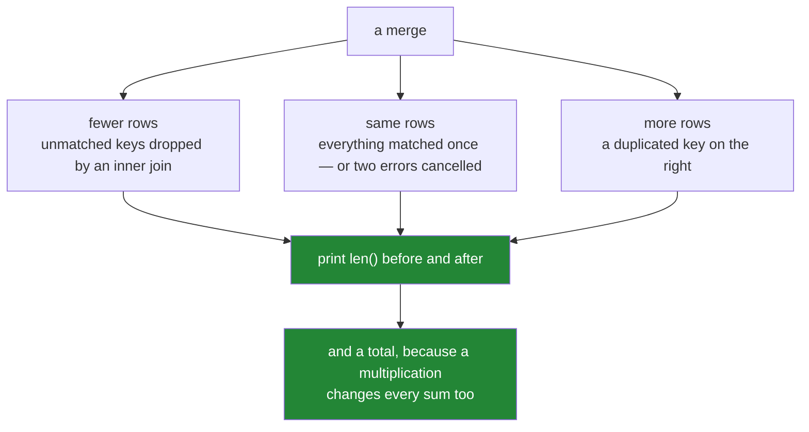

# 3.1 — Count the rows, before and after

## One-line answer

A merge can make a table smaller, larger or the same size, and which of the three happened is
invisible in the result — so the row count before and the row count after are the two numbers you
print every time, and the only ones that tell you the join did what you meant.

---

## The story

Somebody joins the shopping list to the price sheet, gets a table back, looks at it, and it is
completely fine. Four columns, sensible values, no blanks, nothing odd.

They do not count the rows, because there is nothing about the table that suggests counting.

The list had four lines. The result has three, because one item had no price
([2.1](../02-merging/2.1-the-key-and-the-rows-it-pairs.md)). Or the result has six, because one item
was priced twice and every line for it came through twice
([3.2](3.2-the-duplicate-that-multiplied-rows.md)). Or the result has four and everything is exactly
as intended.

All three of those tables look the same. They have the same columns, the same kinds of values, and the
same absence of anything alarming. Nothing in a printout of the first five rows distinguishes them,
and nothing raises.

The number that distinguishes them is the row count, and it takes one line to print — before the
merge and after it — and almost nobody does it, because the table looked fine.

---

## The idea in plain language

Every merge changes the row count in one of three directions, and each has a different cause:

- **Fewer rows than the left frame.** Some keys had no match and `how="inner"` dropped them
  ([2.2](../02-merging/2.2-the-four-hows-on-four-rows.md)). The merge acted as a filter.
- **More rows than the left frame.** Some key appeared more than once on the right, so a left row was
  paired with several right rows ([3.2](3.2-the-duplicate-that-multiplied-rows.md)). The merge acted
  as a multiplier.
- **The same.** Either everything matched exactly once, or two of the above cancelled out — which is
  the case nobody expects and which the count alone cannot distinguish.

So the check is not one number, it is a habit:

```
before = len(left)
out = left.merge(right, ...)
after = len(out)
```

and then a **statement of what you expected**. `before == after` for a left join against a unique
lookup. `after <= before` for an inner join. Anything else needs explaining before the result is used.

Two more numbers make the check diagnostic rather than merely alarming:

- **The match rate**, from `indicator=True`
  ([2.1](../02-merging/2.1-the-key-and-the-rows-it-pairs.md)). Under a left join the row count does not
  move when nothing matches — every row survives with blanks — so the count alone cannot see a broken
  lookup. The `_merge` column can.
- **A total.** Sum a numeric column before and after. If a left join has multiplied rows, the row
  count moves *and so does every total computed from the left frame's columns*, because the left
  values were copied. That second fact is what turns "the table has more rows than I expected" into
  "the revenue figure is wrong", and it is the reason to check a total as well as a count.

The habit is worth stating as a rule, because it survives every tool: **a join is the only common
operation whose output size is not determined by its inputs' sizes.** A filter can only shrink. A
group-by can only shrink. An assignment does not change the count. A join can do anything, so it is
the one that gets a check.

---

## Why Setu needs it

- **[2.2](../02-merging/2.2-the-four-hows-on-four-rows.md)** produced three, four, four and five rows
  from the same two tables. This is how you notice which one you got.
- **[3.2](3.2-the-duplicate-that-multiplied-rows.md)** is the multiplication direction in full, and
  **[3.4](3.4-the-join-that-dropped-forty-per-cent.md)** is the shrinking one.
- **[3.3](3.3-validate-and-the-merge-error.md)** is pandas' own version of this check, done before the
  merge rather than after.
- **Day 31's reconciliation** asserted that group sizes sum to the row count
  ([Day 31, 4.3](../../../day-31-groupby/parts/04-the-keys/4.3-dropna-and-the-rows-that-vanished.md)).
  This is the same discipline for the other operation that silently changes what is in a table.
- **Day 45** is the Phase 4 gate, whose deliverable is a joined dataset **with its row count
  explained** — not merely correct, but accounted for.

---

## The mechanism

An order book and a price sheet, both with a repeated key:

```python
import pandas as pd

orders = pd.DataFrame(
    {
        "order": [1, 2, 3, 4],
        "item": pd.Series(["milk", "bread", "eggs", "milk"], dtype="str"),
        "need": [2, 1, 6, 1],
    }
)

prices = pd.DataFrame(
    {
        "item": pd.Series(["milk", "milk", "bread", "eggs"], dtype="str"),
        "price": [1.15, 1.20, 1.40, 0.32],
        "from": pd.Series(["jan", "jun", "jan", "jan"], dtype="str"),
    }
)

print(orders)
print()
print(prices)
```

**Line by line:**

- `orders` has four rows and `milk` appears twice — two separate orders for milk, which is completely
  normal.
- `prices` also has `milk` twice, because the price changed in June and the sheet keeps both. **That
  is the difference that matters**: a repeated key on the *right* is what multiplies, and a repeated
  key on the left is not a problem by itself.
- Neither table is wrong. Both are the sort of table you are handed, and the trouble only appears when
  they meet.

```text
   order   item  need
0      1   milk     2
1      2  bread     1
2      3   eggs     6
3      4   milk     1

    item  price from
0   milk   1.15  jan
1   milk   1.20  jun
2  bread   1.40  jan
3   eggs   0.32  jan
```

Now the merge, with the counts printed:

```python
before = len(orders)
out = orders.merge(prices, on="item", how="left")

print(out)
print()
print("rows in :", before, "-> rows out:", len(out))
print("need in :", orders["need"].sum(), "-> need out:", out["need"].sum())
```

**Line by line:**

- `how="left"`, which is supposed to be the safe one — *keep every row of the left frame*
  ([2.2](../02-merging/2.2-the-four-hows-on-four-rows.md)). It does keep every row. It also adds some.
- `before = len(orders)` is captured **before** the merge, because after it `orders` is unchanged but
  the number you want to compare against is easy to lose in a chain of calls.
- Four rows in, **six rows out**. Each milk order matched both milk prices, so each became two rows.
- `orders["need"].sum()` is `10` and `out["need"].sum()` is `13`. **The quantities were copied.** Order
  1 asked for two milks and now appears twice, so any total of `need` counts it twice.
- That second line is the one that matters. A row count moving is suspicious; a **total** moving is a
  wrong answer, and it is the same event.

```text
   order   item  need  price from
0      1   milk     2   1.15  jan
1      1   milk     2   1.20  jun
2      2  bread     1   1.40  jan
3      3   eggs     6   0.32  jan
4      4   milk     1   1.15  jan
5      4   milk     1   1.20  jun

rows in : 4 -> rows out: 6
need in : 10 -> need out: 13
```

The one-line question that would have prevented it:

```python
print("prices duplicated on item:", int(prices.duplicated("item").sum()))
print("orders duplicated on item:", int(orders.duplicated("item").sum()))
```

**Line by line:**

- `frame.duplicated("item")` gives a mask that is `True` for every row whose key has already been seen
  ([Day 34](../../../day-34-categories-and-describe/parts/01-the-repeated-word/1.1-the-same-short-word-over-and-over.md)
  goes further into repeated values). Summing it counts the repeats.
- **`prices` has one duplicate and that is the problem.** A repeated key on the side you are joining
  *to* is what multiplies rows.
- `orders` also has one duplicate, and it is fine — two orders for milk are two orders for milk.
- Run this on the right frame before every merge. If the count is not zero, decide what a duplicate
  key means before joining: pick one, aggregate them, or add another key column so they are no longer
  duplicates.

```text
prices duplicated on item: 1
orders duplicated on item: 1
```



---

## When it breaks

**The left join whose count did not move, and whose data is gone:**

```text
$ uv run python -c "
import pandas as pd
orders = pd.DataFrame({'item': ['milk', 'bread', 'eggs'], 'need': [2, 1, 6]})
prices = pd.DataFrame({'item': ['MILK', 'BREAD', 'EGGS'], 'price': [1.15, 1.40, 0.32]})
out = orders.merge(prices, on='item', how='left', indicator=True)
print('rows in :', len(orders), '-> rows out:', len(out))
print('matched :', (out['_merge'] == 'both').sum(), 'of', len(out))
print(out[['item', 'price', '_merge']])
"
```

```text
rows in : 3 -> rows out: 3
matched : 0 of 3
    item  price     _merge
0   milk    NaN  left_only
1  bread    NaN  left_only
2   eggs    NaN  left_only
```

**What it means.** Every price is blank and every `_merge` says `left_only`, because the price sheet
capitalised its keys and matching is exact
([2.1](../02-merging/2.1-the-key-and-the-rows-it-pairs.md)). **The row count is unchanged**, so a
check that only counts rows reports success on a join that matched nothing at all. This is why
`indicator=True` belongs next to the count: under a left join the count is blind to the failure that
matters most.

**The two errors that cancelled:**

```text
$ uv run python -c "
import pandas as pd
orders = pd.DataFrame({'item': ['milk', 'bread', 'eggs'], 'need': [2, 1, 6]})
prices = pd.DataFrame({'item': ['milk', 'milk', 'tea'], 'price': [1.15, 1.20, 3.10]})
out = orders.merge(prices, on='item', how='inner')
print('rows in :', len(orders), '-> rows out:', len(out))
print(out)
"
```

```text
rows in : 3 -> rows out: 2
   item  need  price
0  milk     2   1.15
1  milk     2   1.20
```

**What it means.** Three rows in, two rows out, so a count-based check might read that as "an inner
join dropped one row, which is expected". What actually happened is that **two rows were dropped and
one was doubled**. The bread and eggs orders vanished, and the milk order became two. The count is a
single number and two effects moved it in opposite directions. That is the argument for the match
counts as well: `indicator=True` on an outer join, or the duplicate check on the right frame, tells
you which of the two things happened.

**The total nobody checked:**

```text
$ uv run python -c "
import pandas as pd
orders = pd.DataFrame({'order': [1, 2], 'item': ['milk', 'bread'], 'need': [2, 1], 'paid': [2.30, 1.40]})
prices = pd.DataFrame({'item': ['milk', 'milk', 'bread'], 'price': [1.15, 1.20, 1.40]})
out = orders.merge(prices, on='item', how='left')
print('revenue before:', orders['paid'].sum())
print('revenue after :', out['paid'].sum())
print('rows          :', len(orders), '->', len(out))
"
```

```text
revenue before: 3.6999999999999997
revenue after : 6.0
rows          : 2 -> 3
```

**What it means.** The revenue went from £3.70 to £6.00 because a price sheet had two entries for
milk. Nothing here is a merge error — the merge did exactly what a left join does — and the number
everybody in the business cares about is now sixty per cent too high. The row-count line catches it;
the revenue line makes it obvious *why it matters*, which is what gets it fixed rather than argued
about. (The `3.6999999999999997` is ordinary float representation
([Day 20, 2.3](../../../day-20-arrays-and-dtypes/parts/02-dtypes/2.3-floats-nan-and-precision.md)),
not part of the bug.)

---

## In production

**What a professional writes instead of the teaching version.** The merge is wrapped so that the
expected relationship is declared and the counts are checked without anybody remembering to:

```python
import logging

import pandas as pd

log = logging.getLogger(__name__)


def merge_checked(
    left: pd.DataFrame,
    right: pd.DataFrame,
    on: list[str],
    how: str = "left",
    expect_rows: str = "same",
    totals: list[str] | None = None,
) -> pd.DataFrame:
    """Merge and assert what the row count did. `expect_rows` is 'same', 'fewer' or 'any'."""
    before = len(left)
    sums_before = {c: float(left[c].sum()) for c in (totals or [])}

    out = left.merge(right, on=on, how=how, indicator=True)
    after = len(out)

    if expect_rows == "same" and after != before:
        raise ValueError(f"merge on {on} changed the row count: {before} -> {after}")
    if expect_rows == "fewer" and after > before:
        raise ValueError(f"merge on {on} grew the row count: {before} -> {after}")

    for column, was in sums_before.items():
        now = float(out[column].sum())
        if abs(now - was) > 1e-6:
            raise ValueError(f"merge on {on} changed sum({column}): {was:.4f} -> {now:.4f}")

    counts = {str(k): int(v) for k, v in out["_merge"].value_counts().items()}
    log.info("merge on %s (%s): %d -> %d rows, %s", on, how, before, after, counts)
    return out.drop(columns="_merge")
```

**Line by line:**

- `expect_rows: str = "same"` makes the caller state the guarantee. `"same"` is right for a left join
  against a unique lookup, `"fewer"` for a deliberate inner join, and `"any"` for a genuine
  many-to-many that the caller has thought about.
- `totals` is the second, sharper check: name the money columns, and a multiplication that changes
  them fails here rather than in a report. Comparing with a **tolerance** rather than `==`, because
  summing floats in a different order does not give bit-identical results
  ([Day 23, 2.6](../../../day-23-ufuncs-and-statistics/parts/02-statistics/2.6-float-summation-and-the-drift.md)).
- The sums are captured **before** the merge, from `left`, because that is the frame whose values must
  not be duplicated. Summing a right-hand column would legitimately change.
- `indicator=True` unconditionally, so the match counts are always logged even when the row count is
  unchanged — the blind spot from the first failure above.
- The log line carries the operation, the counts and the match breakdown in one place, so a change in
  match rate is visible in the run record before it is visible in a report.
- `out.drop(columns="_merge")` so the diagnostic does not leak into the returned schema.
- The function raises rather than warning. A merge that changed the row count when it was not supposed
  to has produced wrong numbers, and continuing means shipping them.

**What changes at scale.** The counts are free — `len()` is a constant-time attribute lookup — and the
totals cost one pass per named column, which is negligible next to the join itself. What changes is
that the counts become **metrics rather than assertions**: emitted per stage, stored, and graphed, so
that "the join's output/input ratio moved from 1.00 to 1.03 last Tuesday" is a question somebody can
ask. In a mature pipeline every stage records rows in and rows out, and the row-count ratio per stage
is one of the most productive things to alert on, because it catches key-quality problems, upstream
schema changes and duplicate-loading incidents with one number. It is also the check that transfers
unchanged to SQL, Spark and every other engine, because the failure is in the data rather than in the
tool.

**The failure mode that only appears with real data.** The lookup table is unique when the code is
written and stops being unique later. A dimension table gains history — a second row per product with
a validity date — and every join against it silently doubles. The row count check catches it on the
first run after the change, which is the whole point: the alternative is discovering it in a revenue
figure a month later, by which time the numbers have been in three reports. This is the single most
common way a data pipeline starts producing inflated totals, and it is why "did the row count change"
is the first question rather than a formality.

**The review comment a senior engineer leaves.** *"There is no row-count assertion around this merge,
and `dim_product` gained SCD-2 history last sprint — so this now returns about 1.4 rows per
transaction and the GMV figure is inflated. Please assert the count and add `sum(amount)` to the
checked totals."*

**The interview question.** *"How do you know a join did what you intended?"* Count the rows before
and after and state which direction you expected — fewer for an inner join, the same for a left join
against a unique key — and check the match rate with `indicator=True`, because a left join's row count
does not move even when nothing matches. The follow-up worth being ready for: *"why check a total as
well?"* Because a duplicated key on the right multiplies rows and copies the left frame's values, so
every sum computed from them is inflated — the row count tells you something happened and the total
tells you what it cost.

---

## Check yourself

```bash
uv run python -c "
import pandas as pd
orders = pd.DataFrame({
    'order': [1, 2, 3, 4],
    'item': pd.Series(['milk', 'bread', 'eggs', 'milk'], dtype='str'),
    'need': [2, 1, 6, 1],
})
prices = pd.DataFrame({
    'item': pd.Series(['milk', 'milk', 'bread', 'eggs'], dtype='str'),
    'price': [1.15, 1.20, 1.40, 0.32],
})
out = orders.merge(prices, on='item', how='left')
print('rows  :', len(orders), '->', len(out))
print('need  :', orders['need'].sum(), '->', out['need'].sum())
print('right duplicated on item:', int(prices.duplicated('item').sum()))
print('left  duplicated on item:', int(orders.duplicated('item').sum()))
print()
print(out)
"
```

Both frames have a duplicated `item`, and only one of the two caused the problem. Say which, and say
what the other one is.

**Answer out loud, without scrolling up:**

> Name the three directions a merge can move the row count and what causes each. Then say why the row
> count alone is not enough under a left join, and name the two things you would check alongside it.

---

**Next:** [3.2 — The duplicate that multiplied rows](3.2-the-duplicate-that-multiplied-rows.md).
