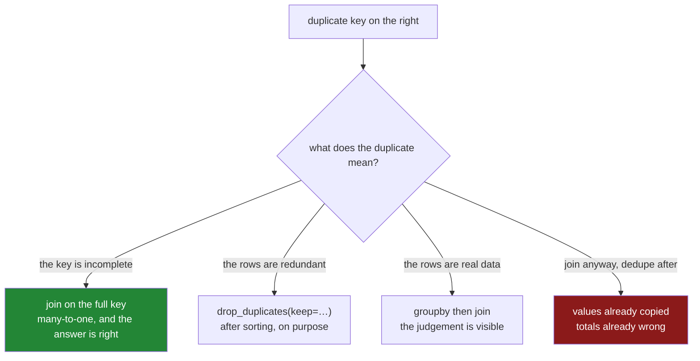

# 3.2 — The duplicate that multiplied rows

## One-line answer

A key that appears *n* times on the left and *m* times on the right produces *n × m* rows, so a
thousand-row key on each side is a million rows — and the fix is never a bigger machine, it is
deciding what the duplicate means before joining.

---

## The story

The price sheet has two rows for milk, because the price went up in June and somebody sensibly kept
both: £1.15 from January, £1.20 from June.

The order book has two rows for milk, because milk was ordered twice.

Neither of those is a mistake. Both are the obvious way to record what happened, and anybody looking
at either sheet on its own would say it was correct.

Then somebody joins them, and pandas does the only thing it can do without being told more: it pairs
**every** milk order with **every** milk price. Two orders, two prices, four rows — each order
appearing twice, with a different price each time.

The result is not wrong so much as unanswerable. The question "what did order 1 cost" now has two
answers on two rows, and the table gives no way to choose. Add up the order quantities and the milk is
counted twice. Add up the revenue and it doubles.

The mistake was not the join. It was joining on `item` when the actual key was *item and when* — and
the sheets never said so, because the person who wrote the price sheet knew the dates were part of the
key and never had to write it down.

---

## The idea in plain language

A merge pairs every row on the left with every matching row on the right. If a key appears **once** on
each side, that is one row. If it appears *n* times on the left and *m* times on the right, it is
**n × m** rows.

There are four relationship shapes and they are worth naming, because pandas uses these exact words in
its `validate` argument ([3.3](3.3-validate-and-the-merge-error.md)):

| relationship | left key | right key | rows for that key |
|---|---|---|---|
| **one-to-one** | unique | unique | 1 |
| **many-to-one** | repeated | unique | as many as the left has |
| **one-to-many** | unique | repeated | as many as the right has |
| **many-to-many** | repeated | repeated | left count × right count |

**Almost every join you actually want is many-to-one.** A transaction table joined to a product
lookup: many transactions, one product row each. A row per event joined to a table of one row per
customer. The left frame is the detail, the right is the reference, and the reference should be
unique on the key. When it is not, you get the last row of the table — and the multiplication is
**quadratic**, so a key repeated a thousand times on each side is a million rows from two thousand.

The important thing about that arithmetic is what it rules out. A many-to-many join on a
high-cardinality key does not run slowly; it runs out of memory, and it does so long before the input
is large. Two frames of a hundred thousand rows sharing one bad key can produce billions of rows.
**This is the most common cause of a pandas job dying, and the input size is never the reason.**

When you find a duplicate on the right, there are exactly three honest responses:

1. **The duplicate is the key's fault: the real key has another column.** Milk-in-January and
   milk-in-June are different things, and the key is `(item, month)`. Joining on the full key makes
   the relationship many-to-one again and the answer becomes correct rather than merely smaller.
2. **The duplicate is redundant: pick one.** `drop_duplicates(subset, keep="last")` after sorting, when
   the rows genuinely say the same thing and one is the current one. This is a decision, and the
   `keep=` argument is where you state it.
3. **The duplicate is real data: aggregate it.** If a product genuinely has several prices and you want
   one number, `groupby(key).agg(...)` first ([Day 31, 2.4](../../../day-31-groupby/parts/02-aggregating/2.4-named-aggregation.md)),
   then join the one-row-per-key result. The aggregation is where the judgement lives, and it is
   visible.

What is *not* a response is joining anyway and deduplicating afterwards. By then the left frame's
values have been copied, so `drop_duplicates` on the result throws away rows arbitrarily and any total
computed in between is already wrong.

---

## Why Setu needs it

- **[3.1](3.1-count-the-rows-before-and-after.md)** established the check. This is the failure it
  catches most often, and the one that costs the most.
- **[3.3](3.3-validate-and-the-merge-error.md)** is pandas' own guard against exactly this, and it is
  one keyword.
- **[3.4](3.4-the-join-that-dropped-forty-per-cent.md)** is the other direction — a join that loses
  rows — and the two together are why a merge always gets a check.
- **Day 31's `groupby`** is response 3: aggregating a lookup to one row per key before joining it
  ([Day 31, 2.4](../../../day-31-groupby/parts/02-aggregating/2.4-named-aggregation.md)).
- **Day 35** is where the data outgrows pandas, and this is the failure that gets there first — a bad
  key kills a job at a fraction of the size a well-keyed join would handle.

---

## The mechanism

A key repeated on both sides, deliberately small so the multiplication is countable:

```python
import pandas as pd

left = pd.DataFrame({"item": ["milk", "milk", "bread"], "order": [1, 2, 3]})
right = pd.DataFrame({"item": ["milk", "milk", "milk", "bread"], "price": [1.15, 1.20, 1.25, 1.40]})

out = left.merge(right, on="item")

print("left rows:", len(left), "right rows:", len(right), "-> out:", len(out))
print(out)
```

**Line by line:**

- `milk` appears **twice** on the left and **three times** on the right. Two times three is six rows
  for milk, plus one for bread: seven.
- Three rows and four rows produce **seven** rows. Neither input is large and neither is wrong; the
  output is bigger than both put together.
- Read the printed frame: order 1 appears three times, once per price. **The `order` column has been
  copied**, which is what makes every total computed from it wrong
  ([3.1](3.1-count-the-rows-before-and-after.md)).
- `how` is the default `inner` here, and it makes no difference — the multiplication happens under
  every `how`, because it is about matching rather than about which unmatched rows survive.

```text
left rows: 3 right rows: 4 -> out: 7
    item  order  price
0   milk      1   1.15
1   milk      1   1.20
2   milk      1   1.25
3   milk      2   1.15
4   milk      2   1.20
5   milk      2   1.25
6  bread      3   1.40
```

The arithmetic, at four sizes:

```python
for n in (2, 10, 100, 1000):
    left = pd.DataFrame({"k": ["a"] * n})
    right = pd.DataFrame({"k": ["a"] * n, "v": range(n)})
    print(f"{n:5} x {n:5} = {len(left.merge(right, on='k')):>9,} rows")
```

**Line by line:**

- Both frames have `n` rows and **one distinct key**, which is the worst case: every row matches every
  row.
- `f"{...:>9,}"` right-aligns with thousands separators, so the growth is legible as a shape rather
  than as four numbers.
- Read the column down: **4, 100, 10 000, 1 000 000.** Two thousand rows of input produce a million
  rows of output, and the next step up — ten thousand each — is a hundred million.
- This is why the failure is a memory error rather than a slow function. **pandas builds the whole
  result**, and nothing warns on the way.

```text
    2 x     2 =         4 rows
   10 x    10 =       100 rows
  100 x   100 =    10,000 rows
 1000 x  1000 = 1,000,000 rows
```

**Response 1 — the key had another column:**

```python
prices = pd.DataFrame(
    {
        "item": ["milk", "milk", "bread"],
        "price": [1.15, 1.20, 1.40],
        "from": ["jan", "jun", "jan"],
    }
)
orders = pd.DataFrame({"order": [1, 2], "item": ["milk", "milk"], "season": ["jan", "jun"]})

print(orders.merge(prices, left_on=["item", "season"], right_on=["item", "from"]))
```

**Line by line:**

- The real key is *item and period*, and once both columns are in the join the relationship is
  one-to-one: each order matches exactly one price.
- `left_on=["item", "season"], right_on=["item", "from"]` because the period column is spelled
  differently on the two sides ([2.3](../02-merging/2.3-when-the-key-has-two-names.md)). The lists are
  matched **positionally**, so `item` meets `item` and `season` meets `from`.
- **Two orders in, two rows out.** The multiplication is gone, and — the important part — the answer
  is now *right* rather than merely smaller: order 1 gets January's price and order 2 gets June's.
- This is the response to reach for first. The other two throw information away; this one uses
  information that was already there.

```text
   order  item season  price from
0      1  milk    jan   1.15  jan
1      2  milk    jun   1.20  jun
```

**Responses 2 and 3 — pick one, or aggregate:**

```python
print(prices.drop_duplicates("item", keep="last"))
print()
print(prices.groupby("item", as_index=False).agg(price=("price", "mean")))
```

**Line by line:**

- `drop_duplicates("item", keep="last")` keeps the last row for each item. **`keep=` is the decision**
  — `"last"` means "the most recent wins", which is only true if the frame is sorted so that the most
  recent is last. Sort first, deliberately
  ([Day 29, 4.1](../../../day-29-iteration-and-order/parts/04-sorting/4.1-sort-values-the-order-you-asked-for.md)).
- The index of the result keeps the original labels — `1` and `2` — which is the tell that rows were
  removed.
- The `groupby` version takes the **mean** of the two milk prices: `1.175`. That is a defensible number
  and it is an invented one, and `as_index=False` gives back a frame with `item` as a column so it can
  be merged
  ([Day 31, 4.1](../../../day-31-groupby/parts/04-the-keys/4.1-the-key-became-the-index.md)).
- Both produce **one row per item**, which is what makes the subsequent join many-to-one. Which one is
  right depends entirely on what the duplicate means, and neither is right if the answer is response 1.

```text
    item  price from
1   milk    1.2  jun
2  bread    1.4  jan

    item  price
0  bread  1.400
1   milk  1.175
```



---

## When it breaks

**Deduplicating after the join instead of before:**

```text
$ uv run python -c "
import pandas as pd
orders = pd.DataFrame({'order': [1, 2], 'item': ['milk', 'milk'], 'paid': [2.30, 1.15]})
prices = pd.DataFrame({'item': ['milk', 'milk'], 'price': [1.15, 1.20]})
out = orders.merge(prices, on='item')
print('revenue before:', orders['paid'].sum())
print('revenue joined:', out['paid'].sum())
deduped = out.drop_duplicates('order')
print('revenue deduped:', deduped['paid'].sum())
print(deduped)
"
```

```text
revenue before: 3.4499999999999997
revenue joined: 6.9
revenue deduped: 3.4499999999999997
   order  item  paid  price
0      1  milk  2.30   1.15
2      2  milk  1.15   1.15
```

**What it means.** Deduplicating afterwards restored the revenue, and look at which price survived:
`1.15` for both orders, because `drop_duplicates` keeps the **first** row it meets and the first row
happened to carry January's price. **The count is right and the prices are arbitrary.** Nothing
raised. Deduplicating after a join fixes the symptom and picks a row at random, which is worse than
the multiplication because it looks correct.

**The memory failure that is not about size:**

```text
$ uv run python -c "
import pandas as pd
n = 20_000
left  = pd.DataFrame({'k': ['a'] * n, 'x': range(n)})
right = pd.DataFrame({'k': ['a'] * n, 'y': range(n)})
print('inputs :', len(left), '+', len(right), 'rows')
print('output :', f'{len(left) * len(right):,}', 'rows')
print('roughly:', f'{len(left) * len(right) * 8 * 3 / 1e9:.1f}', 'GB for three int64 columns')
"
```

```text
inputs : 20000 + 20000 rows
output : 400,000,000 rows
roughly: 9.6 GB for three int64 columns
```

**What it means.** Forty thousand rows of input — a few hundred kilobytes — and four hundred million
rows of output, which is about ten gigabytes for three numeric columns and more once there is any
text. The frame would not fit in memory on most machines, and the merge dies partway through building
it. **No amount of looking at the input sizes predicts this**; the predictor is the key's
cardinality, and the check is one line on the right frame.

**The `validate` you did not pass:**

```text
$ uv run python -c "
import pandas as pd
orders = pd.DataFrame({'order': [1, 2], 'item': ['milk', 'bread']})
prices = pd.DataFrame({'item': ['milk', 'milk', 'bread'], 'price': [1.15, 1.20, 1.40]})
print('without validate:', len(orders.merge(prices, on='item')), 'rows from', len(orders))
orders.merge(prices, on='item', validate='many_to_one')
"
```

```text
without validate: 3 rows from 2
Traceback (most recent call last):
  File "<string>", line 6, in <module>
MergeError: Merge keys are not unique in right dataset; not a many-to-one merge

Duplicates in right:
 item
milk ...
```

**What it means.** The first line shows the silent version: two orders in, three rows out, no
complaint. The second shows what one keyword buys — a `MergeError` naming the side, the relationship
that failed, and the offending key. **This is the cheapest guard on the whole day** and it is
[3.3](3.3-validate-and-the-merge-error.md)'s subject.

---

## In production

**What a professional writes instead of the teaching version.** The duplicate is found before the
join, and the resolution is a named decision rather than a silent `drop_duplicates`:

```python
import logging

import pandas as pd

log = logging.getLogger(__name__)


def make_unique(
    lookup: pd.DataFrame,
    on: list[str],
    strategy: str,
    order_by: str | None = None,
    aggregations: dict[str, tuple[str, str]] | None = None,
) -> pd.DataFrame:
    """Collapse `lookup` to one row per key. `strategy` is 'already', 'latest' or 'aggregate'."""
    duplicates = int(lookup.duplicated(on).sum())
    if duplicates == 0:
        return lookup
    log.warning("lookup has %d duplicate rows on %s; resolving by %r", duplicates, on, strategy)

    if strategy == "already":
        offenders = lookup.loc[lookup.duplicated(on, keep=False), on].drop_duplicates().head(10)
        raise ValueError(
            f"lookup was expected to be unique on {on} but is not; "
            f"examples: {offenders.to_dict('records')}"
        )

    if strategy == "latest":
        if order_by is None:
            raise ValueError("strategy 'latest' needs order_by")
        return (
            lookup.sort_values([*on, order_by], kind="stable")
            .drop_duplicates(on, keep="last")
            .reset_index(drop=True)
        )

    if strategy == "aggregate":
        if not aggregations:
            raise ValueError("strategy 'aggregate' needs aggregations")
        return lookup.groupby(on, observed=True, dropna=False, as_index=False).agg(**aggregations)

    raise ValueError(f"unknown strategy {strategy!r}")
```

**Line by line:**

- `strategy` is **required** and has no default, so the caller states which of the three responses
  applies. A default would let the commonest wrong answer — silently keeping the first row — back in.
- `"already"` is a strategy in the sense that it asserts the lookup should not have duplicates and
  raises with examples if it does. That is the right choice for a reference table that has a
  uniqueness guarantee upstream, and it turns a data-quality regression into an immediate failure.
- The `duplicates == 0` early return means the function is free on the normal path and only does work
  when there is something to do.
- `log.warning` names the count and the strategy, so a lookup that starts having duplicates shows up
  in the run record even when the strategy handles it.
- `"latest"` **requires `order_by`** and sorts before dropping, because `keep="last"` means "last in
  the current order" and relying on the order a file happened to arrive in is not a decision
  ([Day 29, 4.1](../../../day-29-iteration-and-order/parts/04-sorting/4.1-sort-values-the-order-you-asked-for.md)).
  `kind="stable"` so ties keep their relative order and two runs agree.
- `"aggregate"` takes a named-aggregation spec, so what is being computed from the duplicates is
  written down at the call site rather than being an unexplained `mean`
  ([Day 31, 2.4](../../../day-31-groupby/parts/02-aggregating/2.4-named-aggregation.md)).
- `as_index=False` so the result is a frame with the key as a column, ready to merge
  ([Day 31, 4.1](../../../day-31-groupby/parts/04-the-keys/4.1-the-key-became-the-index.md)).
- The final `raise` on an unknown strategy, so a typo in the argument is an error rather than a silent
  return of the unchanged frame.

**What changes at scale.** The cost of a join is roughly the input size plus the **output** size, and
the output size is what a duplicated key makes unbounded. Two practical consequences. First, the check
`lookup.duplicated(on).any()` is one pass over one frame and it is always worth paying — it is orders
of magnitude cheaper than the join it protects. Second, when the join genuinely is many-to-many, it
should not be a join: aggregate one side first, or restructure so the relationship is many-to-one,
because the intermediate result is the problem and no engine makes it smaller. Spark, DuckDB and every
warehouse have exactly this failure, usually reported as "the query never finished", and the fix is
always the same — look at the key. The one thing that does change with the engine is the diagnosis:
SQL engines will show you an exploding row estimate in a query plan before you run it, which is a
genuine advantage over pandas' approach of finding out by allocating.

**The failure mode that only appears with real data.** The lookup is unique in every environment
except production. Test fixtures have one row per product; the production dimension table has history,
soft deletes, or a row per region — so the join is one-to-one in CI and many-to-one at three in the
morning. Every test passes and the first production run either produces inflated totals or dies. The
defence is that the uniqueness assumption is written into the code as `validate=` or an explicit check
([3.3](3.3-validate-and-the-merge-error.md)), so the assumption fails loudly in the place where it
stops being true rather than being encoded only in a fixture.

**The review comment a senior engineer leaves.** *"This joins `fact_sales` to `dim_customer` on
`customer_id`, and `dim_customer` is SCD-2 — one row per customer per validity period. That is a
many-to-many and it will multiply the fact table. Either join on `(customer_id, valid_from)` or filter
the dimension to current rows first, and add `validate='many_to_one'` so we find out next time."*

**The interview question.** *"What happens if the key is duplicated on both sides of a join?"* You get
the cross product for that key — *n* times *m* rows — so the output can be far larger than either
input, and the left frame's values are copied so every total computed from them is inflated. The
follow-up that shows you have debugged one: *"how do you fix it?"* Not by deduplicating afterwards,
which picks rows arbitrarily and after the damage. Work out what the duplicate means: usually the key
is incomplete and the join needs another column, otherwise pick a row deliberately with a sort and
`keep=`, or aggregate the lookup to one row per key before joining.

---

## Check yourself

```bash
uv run python -c "
import pandas as pd
left  = pd.DataFrame({'item': ['milk', 'milk', 'bread'], 'order': [1, 2, 3]})
right = pd.DataFrame({'item': ['milk', 'milk', 'milk', 'bread'], 'price': [1.15, 1.20, 1.25, 1.40]})
out = left.merge(right, on='item')
print('left', len(left), 'x right', len(right), '-> out', len(out))
print('left  duplicates on item:', int(left.duplicated('item').sum()))
print('right duplicates on item:', int(right.duplicated('item').sum()))
print('order 1 appears', (out['order'] == 1).sum(), 'times')
print()
for n in (2, 10, 100, 1000):
    a = pd.DataFrame({'k': ['a'] * n})
    b = pd.DataFrame({'k': ['a'] * n, 'v': range(n)})
    print(f'{n:5} x {n:5} = {len(a.merge(b, on=\"k\")):>9,} rows')
"
```

Three rows joined to four gave seven, which is more than either input. Say what number seven is made
of, and say what the same calculation gives for a key repeated ten thousand times on each side.

**Answer out loud, without scrolling up:**

> Say how many rows a key produces when it appears twice on the left and three times on the right, and
> name the four relationship shapes. Then give the three honest responses to finding a duplicate on
> the right, and say why deduplicating after the join is not one of them.

---

**Next:** [3.3 — `validate`, and the merge error](3.3-validate-and-the-merge-error.md).
