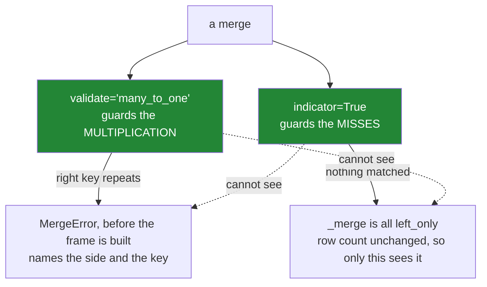

# 3.3 — `validate`, and the merge error

## One-line answer

`validate="many_to_one"` tells pandas what relationship you believe the two tables have, and it raises
a `MergeError` naming the offending key if that belief is wrong — turning the silent row
multiplication from [3.2](3.2-the-duplicate-that-multiplied-rows.md) into an immediate, specific
failure for the cost of one keyword.

---

## The story

Somebody writes the join, checks the row count, finds it is what they expected, and moves on. Good
practice, correctly applied, and it works.

Three months later a different person adds a column to the same pipeline. The join is not the thing
they are changing, so they do not look at it. The row-count check is a few lines further down and
belongs, as far as they can tell, to the block below.

Then the price sheet gains history — a second row per item, with a date — and the join starts
doubling. The check fires, eventually, in the form of an assertion nobody understands in a file
nobody was editing.

What was missing was not the check. It was that the check lived *after* the join and described a
symptom. **Nothing in the merge call said what the two tables were supposed to be to each other.**
Had the call said *one price per item*, the failure would have arrived at the line that assumed it,
with the offending item printed, and the person who broke it would have been the person who fixed it.

---

## The idea in plain language

`validate=` takes one of four strings, naming the relationship you expect between the key on the left
and the key on the right:

| `validate` | asserts | raises when |
|---|---|---|
| `"one_to_one"` | unique on **both** sides | either side repeats a key |
| `"one_to_many"` | unique on the **left** | the left repeats a key |
| `"many_to_one"` | unique on the **right** | the right repeats a key |
| `"many_to_many"` | nothing | never — it is the default behaviour, spelled out |

Read them as *left-to-right*: `"many_to_one"` means *many rows on the left, one on the right*, which
is the relationship of a detail table to a reference table and is what you want almost every time
([3.2](3.2-the-duplicate-that-multiplied-rows.md)).

Three things make this worth more than the equivalent check written by hand.

**It documents the join.** `validate="many_to_one"` in the call says *this lookup has one row per key*
to every future reader, at the place where it matters. A check three lines below says the same thing
to nobody, because it is describing the result rather than the intention.

**It fails at the right moment.** The error arrives from the merge itself, before the multiplied frame
is built, so there is no memory blow-up and the traceback points at the line that made the wrong
assumption.

**The message names the key.** Not "the row count changed" but *"Merge keys are not unique in right
dataset"* followed by the offending value. That difference is minutes against an afternoon.

What `validate` does **not** do is check that anything matched. A `many_to_one` join where nothing at
all matched passes validation happily, because uniqueness held. That is
[3.4](3.4-the-join-that-dropped-forty-per-cent.md)'s failure, and it needs `indicator=True` and a
match-rate check ([3.1](3.1-count-the-rows-before-and-after.md)). **`validate` guards the
multiplication direction only.** The two guards are complementary and you want both.

One practical note on cost: `validate` makes pandas check uniqueness on the relevant side, which is
one pass and a hash. On a large lookup that is not free, and it is negligible next to the join. There
is no version of "we left it out for performance" that survives contact with the failure it prevents.

---

## Why Setu needs it

- **[3.2](3.2-the-duplicate-that-multiplied-rows.md)** is the failure. This is the one-keyword guard
  against it.
- **[3.1](3.1-count-the-rows-before-and-after.md)** is the after-the-fact check, and the two together
  cover both directions: `validate` for the multiplication, `indicator` for the misses.
- **[6.1](../06-the-module/6.1-the-joining-module.md)** puts `validate` on every merge in the day's
  module, with the relationship as a required argument.
- **[6.2](../06-the-module/6.2-the-test-that-can-go-red.md)** tests that the guard is there, using
  `pytest.raises(MergeError)` on a deliberately duplicated fixture.
- **Day 42** is SQL, which has no `validate` — the equivalent is a `UNIQUE` constraint on the
  reference table, which is better because the database enforces it for everybody rather than one
  query at a time.

---

## The mechanism

The order book and price sheet from [3.1](3.1-count-the-rows-before-and-after.md), with `milk`
repeated on both sides:

```python
import pandas as pd

orders = pd.DataFrame(
    {
        "order": [1, 2, 3, 4],
        "item": pd.Series(["milk", "bread", "eggs", "milk"], dtype="str"),
        "need": [2, 1, 6, 1],
    }
)

prices = pd.DataFrame(
    {
        "item": pd.Series(["milk", "milk", "bread", "eggs"], dtype="str"),
        "price": [1.15, 1.20, 1.40, 0.32],
    }
)

for relationship in ("one_to_one", "one_to_many", "many_to_one", "many_to_many"):
    try:
        orders.merge(prices, on="item", how="left", validate=relationship)
        print(f"{relationship:14} ok")
    except pd.errors.MergeError as error:
        print(f"{relationship:14} MergeError: {str(error).splitlines()[0]}")
```

**Line by line:**

- The loop tries all four relationships against the same pair of frames, so the four outcomes can be
  read together.
- `pd.errors.MergeError` is the specific exception, a subclass of `ValueError`. Catching it by name
  rather than catching `ValueError` means a genuinely different error is not swallowed
  ([Day 18, 2.1](../../../day-18-exceptions/parts/02-the-hierarchy/2.1-catching-catches-subclasses.md)).
- `str(error).splitlines()[0]` prints only the first line, because the full message continues with the
  offending keys and would make the loop's output unreadable. The full text is in the next block, and
  it is the useful part.
- **Three of the four fail**, because `milk` is repeated on both sides. Only `many_to_many` passes,
  and it passes because it asserts nothing.

```text
one_to_one     MergeError: Merge keys are not unique in either left or right dataset; not a one-to-one merge.
one_to_many    MergeError: Merge keys are not unique in left dataset; not a one-to-many merge
many_to_one    MergeError: Merge keys are not unique in right dataset; not a many-to-one merge
many_to_many   ok
```

Read the three messages: each names **which side** failed. That is the diagnosis, delivered by the
library, and it is why this beats an assertion on the row count.

The full message, which is what you actually see:

```python
try:
    orders.merge(prices, on="item", how="left", validate="many_to_one")
except pd.errors.MergeError as error:
    print(error)
```

**Line by line:**

- The message has three parts: what relationship was asked for, which side broke it, and **the
  offending key values**.
- `Duplicates in right: item milk` is the line that ends the investigation. Without it you would know
  the lookup has a duplicate; with it you know it is milk, and you can go and look at the two rows.
- On a real lookup with several offenders the list is truncated, which is the right behaviour — the
  first few are enough to see the pattern.

```text
Merge keys are not unique in right dataset; not a many-to-one merge

Duplicates in right:
 item
milk ...
```

And the guard doing its job, next to the version without it:

```python
lookup = pd.DataFrame({"item": ["milk", "milk", "bread"], "price": [1.15, 1.20, 1.40]})
detail = pd.DataFrame({"order": [1, 2], "item": ["milk", "bread"]})

print(
    "without validate:", len(detail.merge(lookup, on="item", how="left")), "rows from", len(detail)
)

try:
    detail.merge(lookup, on="item", how="left", validate="many_to_one")
except pd.errors.MergeError as error:
    print("with validate   :", str(error).splitlines()[0])
```

**Line by line:**

- The first line is the silent version: two rows in, **three rows out**, no complaint, and every total
  computed from `detail` is now wrong.
- The second is the same call with one keyword added, and it refuses.
- **This is the entire argument for `validate`**, in two lines of output. The cost is thirteen
  characters; the saving is the class of bug that inflates totals.
- Note `how="left"` on both. `how` and `validate` are independent: `how` decides what happens to
  unmatched rows, `validate` decides whether the key relationship is what you said. Neither implies
  the other.

```text
without validate: 3 rows from 2
with validate   : Merge keys are not unique in right dataset; not a many-to-one merge
```



---

## When it breaks

**A `validate` that passes on a join that matched nothing:**

```text
$ uv run python -c "
import pandas as pd
detail = pd.DataFrame({'order': [1, 2], 'item': ['milk', 'bread']})
lookup = pd.DataFrame({'item': ['MILK', 'BREAD'], 'price': [1.15, 1.40]})
out = detail.merge(lookup, on='item', how='left', validate='many_to_one', indicator=True)
print('validate passed, rows:', len(out))
print('matched:', int((out['_merge'] == 'both').sum()), 'of', len(out))
print(out[['item', 'price', '_merge']])
"
```

```text
validate passed, rows: 2
matched: 0 of 2
    item  price     _merge
0   milk    NaN  left_only
1  bread    NaN  left_only
```

**What it means.** The lookup's keys are unique, so `many_to_one` holds and validation passes — and
not a single row matched, because the lookup capitalised its keys. **`validate` is not a match check.**
It guards the multiplication direction and is blind to the miss direction, which is why the
`indicator=True` column is in the same call. Two guards, two failure modes, both needed.

**`one_to_many` read backwards:**

```text
$ uv run python -c "
import pandas as pd
detail = pd.DataFrame({'order': [1, 2, 3], 'item': ['milk', 'milk', 'bread']})
lookup = pd.DataFrame({'item': ['milk', 'bread'], 'price': [1.15, 1.40]})
detail.merge(lookup, on='item', how='left', validate='one_to_many')
"
```

```text
Traceback (most recent call last):
  File "<string>", line 5, in <module>
pandas.errors.MergeError: Merge keys are not unique in left dataset; not a one-to-many merge
Duplicates in left:
 item
milk ...
```

**What it means.** This is a perfectly good many-to-one join — many orders, one price each — and
`one_to_many` was written by reading the phrase as "one lookup row to many detail rows", which is the
same relationship described from the other end. The words are **left-to-right**: the first half
describes the left frame. The error is helpful and the confusion is common, and the way to avoid it is
to say the sentence out loud with the frames named: *many orders, one price.*

**The `validate` that was quietly removed:**

```text
$ uv run python -c "
import pandas as pd
detail = pd.DataFrame({'order': [1, 2], 'item': ['milk', 'bread'], 'paid': [2.30, 1.40]})
lookup = pd.DataFrame({'item': ['milk', 'milk', 'bread'], 'price': [1.15, 1.20, 1.40]})
print('revenue in :', detail['paid'].sum())
print('rows out   :', len(detail.merge(lookup, on='item', how='left')))
print('revenue out:', detail.merge(lookup, on='item', how='left')['paid'].sum())
"
```

```text
revenue in : 3.6999999999999997
rows out   : 3
revenue out: 6.0
```

**What it means.** Somebody removed the `validate` argument — perhaps because it started failing on a
batch and removing it made the job green again. The job is now green and the revenue is £6.00 instead
of £3.70. **A guard that is removed to make a failure go away has done its job and been punished for
it**, and this is the single most common way this particular guard disappears. The fix when
`validate` starts failing is never to delete it; it is to find out why the lookup gained a duplicate
([3.2](3.2-the-duplicate-that-multiplied-rows.md)).

---

## In production

**What a professional writes instead of the teaching version.** The relationship is a required
argument, so no merge in the codebase can be written without stating one:

```python
import logging

import pandas as pd

log = logging.getLogger(__name__)

RELATIONSHIPS = frozenset({"one_to_one", "one_to_many", "many_to_one", "many_to_many"})


def join(
    detail: pd.DataFrame,
    lookup: pd.DataFrame,
    on: list[str],
    relationship: str,
    how: str = "left",
    max_unmatched: float = 0.0,
) -> pd.DataFrame:
    """Join `lookup` onto `detail`, asserting both the relationship and the match rate."""
    if relationship not in RELATIONSHIPS:
        raise ValueError(
            f"relationship must be one of {sorted(RELATIONSHIPS)}, not {relationship!r}"
        )
    if relationship == "many_to_many":
        log.warning(
            "many_to_many on %s asserts nothing and can multiply rows; is the key incomplete?", on
        )

    before = len(detail)
    out = detail.merge(lookup, on=on, how=how, validate=relationship, indicator=True)

    unmatched = out["_merge"] == "left_only"
    share = float(unmatched.mean()) if len(out) else 0.0
    if share > max_unmatched:
        examples = out.loc[unmatched, on].drop_duplicates().head(10).to_dict("records")
        raise ValueError(
            f"{int(unmatched.sum())}/{len(out)} rows ({share:.1%}) matched nothing "
            f"on {on}; examples: {examples}"
        )

    log.info("joined on %s (%s, %s): %d -> %d rows", on, how, relationship, before, len(out))
    return out.drop(columns="_merge")
```

**Line by line:**

- `relationship: str` is **positional and required**, with no default. Every call site therefore states
  the assumption, and a code search for `join(` finds every join and what each one believes.
- The membership check against `RELATIONSHIPS` catches a typo — `"many_to_1"` — with a message listing
  the valid values, rather than letting pandas raise something less specific deeper in.
- The `many_to_many` **warning** rather than a refusal. It is occasionally the right answer, and it is
  much more often a sign that the key is incomplete
  ([3.2](3.2-the-duplicate-that-multiplied-rows.md)), so it earns a line in the log that somebody will
  eventually read.
- `validate=relationship` passes the assertion to pandas, which fails **before** building the result.
- `indicator=True` in the same call, because `validate` is blind to the miss direction — the first
  failure above.
- `max_unmatched: float = 0.0` as a **share**, defaulting to zero. A lookup that is supposed to be
  complete should fail when it is not; a caller who knows some keys are legitimately absent raises it
  deliberately.
- `if len(out) else 0.0` guards against dividing by zero on an empty frame, which happens on the day a
  feed produces nothing and is otherwise a confusing traceback about a mean of an empty column.
- The error carries counts, a percentage and ten example keys, which is the difference between "the
  join failed" and "these ten product codes are not in the dimension table".

**What changes at scale.** `validate` costs one uniqueness check — a hash of the key column on the
relevant side — which is a fraction of the join it guards and is never the reason a job is slow. What
changes is where the assertion belongs. In a mature system the uniqueness of a reference table is not
asserted at every join; it is enforced **where the table is produced**, as a primary key in the
database or a test on the table's build job, so that a hundred consumers do not each re-derive the
guarantee. `validate` is then the belt to that braces: it catches the case where a consumer's
assumption about the key differs from the producer's — joining on `customer_id` against a table whose
key is really `(customer_id, valid_from)` — which is a real and common mismatch that no producer-side
constraint can see.

**The failure mode that only appears with real data.** The relationship is correct for years and
changes with a business decision. A products table gains regional pricing, so it goes from one row per
product to one row per product per region — and every join written as `many_to_one` on `product_id`
starts failing. That is the guard working exactly as designed, and the danger is the response: under
deadline pressure the argument is changed to `many_to_many` and the job goes green, silently
multiplying the fact table. **The correct response is always to fix the key**, and the reason to say
so out loud is that the wrong response is one keystroke and makes the error disappear.

**The review comment a senior engineer leaves.** *"No `validate` on this merge. It is a
`many_to_one` against `dim_product` — please say so, so that the day the dimension gains history we
get a `MergeError` here instead of a 40% revenue overstatement in the monthly pack."*

**The interview question.** *"How do you make sure a join does not duplicate rows?"* Pass
`validate="many_to_one"`, which asserts the right side's key is unique and raises a `MergeError`
naming the offending key if it is not — before the multiplied frame is built. The follow-up worth
being ready for: *"does that cover everything?"* No — `validate` only guards the multiplication
direction. A join where nothing matched passes validation, because uniqueness still holds, so you also
need `indicator=True` and a check on the unmatched share.

---

## Check yourself

```bash
uv run python -c "
import pandas as pd
orders = pd.DataFrame({'order': [1, 2, 3, 4], 'item': ['milk', 'bread', 'eggs', 'milk'], 'need': [2, 1, 6, 1]})
prices = pd.DataFrame({'item': ['milk', 'milk', 'bread', 'eggs'], 'price': [1.15, 1.20, 1.40, 0.32]})
for r in ('one_to_one', 'one_to_many', 'many_to_one', 'many_to_many'):
    try:
        n = len(orders.merge(prices, on='item', how='left', validate=r))
        print(f'{r:14} ok, {n} rows from {len(orders)}')
    except pd.errors.MergeError as e:
        print(f'{r:14} {str(e).splitlines()[0]}')
"
```

Three of the four refused and one allowed a join that turned four rows into six. Say which one
allowed it and what it asserted, and say what you would change about the data so that
`many_to_one` would pass.

**Answer out loud, without scrolling up:**

> Say which side `validate="many_to_one"` checks and what it checks about it. Then name the failure
> `validate` cannot see, and the argument you would pass in the same call to catch that one.

---

**Next:** [3.4 — The join that dropped forty per cent](3.4-the-join-that-dropped-forty-per-cent.md).
