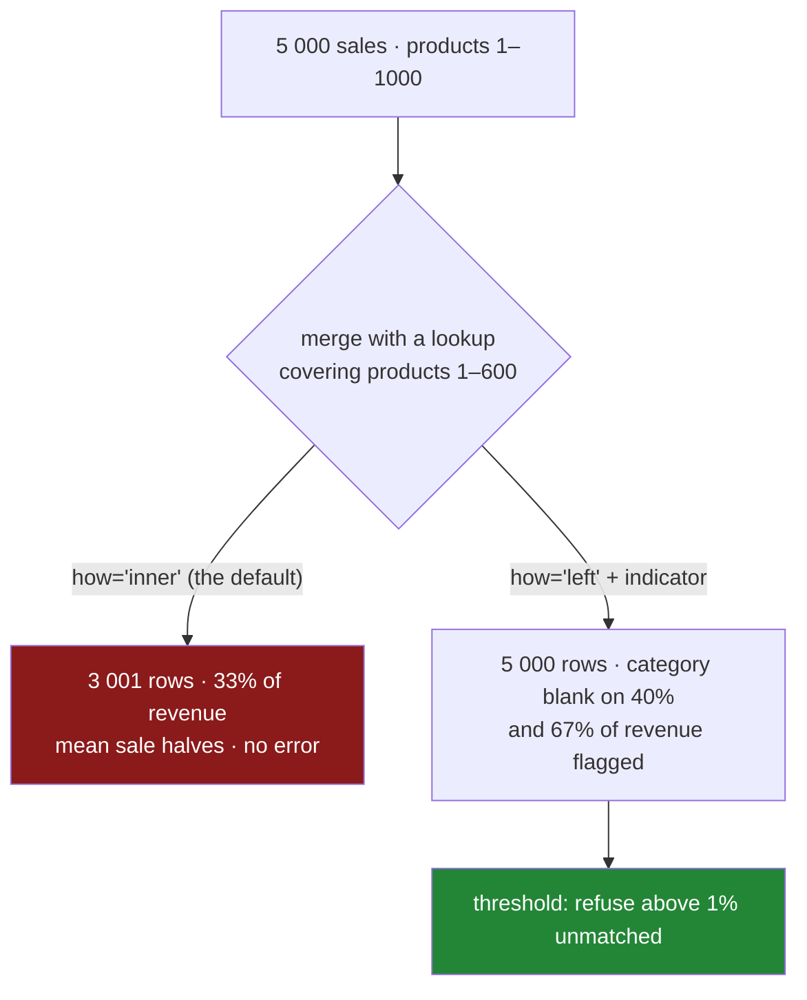

# 3.4 — The join that dropped forty per cent

## One-line answer

An inner join against an incomplete lookup silently deletes every row whose key is missing, and the
rows it deletes are almost never a random sample — so a join that loses forty per cent of the rows can
lose sixty-seven per cent of the revenue and halve the average, with no error anywhere.

---

## The story

The shop's sales file has one row per sale, with a product number on it. There is a separate file
listing what each product is, and somebody joins them so the sales can be reported by category.

The product list was exported eighteen months ago. Everything sold back then is on it. Everything
launched since is not — which is about four hundred product numbers, all of them at the high end of
the range because numbers are handed out in order.

The join is written the ordinary way, with no `how`, so it is an inner join
([2.2](../02-merging/2.2-the-four-hows-on-four-rows.md)). Every sale of a product launched in the last
eighteen months disappears.

The report comes out. It has a plausible number of rows on it, plausible categories, plausible
totals. Nothing failed, nothing warned, and nothing about the output suggests it is describing sixty
per cent of the business.

And the part that turns a data problem into a wrong decision: the missing products are the **new**
ones, which are the expensive ones, which are the ones growing. The report does not merely
under-count. It under-counts the part everybody is asking about, and it says the average sale is
half what it is.

---

## The idea in plain language

An inner join keeps only keys present on both sides, so it is **a filter whose criterion is "exists in
the lookup"**. That criterion has nothing to do with your analysis, and everything to do with how
complete somebody else's reference table happens to be.

Day 30 asked why values were missing and found that it decides what you are allowed to do about them
([Day 30, 3.1](../../../day-30-missing-data/parts/03-why-it-is-missing/3.1-three-reasons-a-line-is-blank.md)).
The same question applies here and the answer is almost always the worst one. **Rows do not fail to
match at random.** They fail to match because:

- the lookup is stale and the missing keys are the **newest** things;
- the lookup covers one region, one segment, one system, and the missing keys are everything else;
- the key is formatted differently in one source, and the missing keys are one supplier's;
- the row is genuinely new and has not been classified yet.

Every one of those makes the dropped rows a **systematic group**, so the surviving rows are a biased
sample and every summary computed from them is biased in the same direction. The measured example
below drops forty per cent of the rows and sixty-seven per cent of the money, because the unmatched
rows are the dear ones.

Three numbers make the failure visible, and only the second and third are informative:

- **The row count**, before and after ([3.1](3.1-count-the-rows-before-and-after.md)). It tells you
  *something* happened. Under a left join it does not even do that.
- **The unmatched share**, from `indicator=True`. This is the number to alert on, and the number to
  watch over time — a lookup that was ninety-eight per cent complete last quarter and is eighty per
  cent complete now has broken without anybody changing any code.
- **The unmatched share of the thing you care about** — of revenue, of volume, of customers. This is
  the number that turns "two per cent of rows did not match" into "and they are nine per cent of the
  money", which is the sentence that gets the lookup fixed.

The fix is rarely to make the join work. It is to make the failure **loud**: left join, so no row is
lost; `indicator=True`, so the misses are counted; and a threshold, so the pipeline refuses rather
than reporting on a fraction of the business.

---

## Why Setu needs it

- **[2.2](../02-merging/2.2-the-four-hows-on-four-rows.md)** named the four `how`s. This is why the
  default one is dangerous.
- **[3.1](3.1-count-the-rows-before-and-after.md)** and
  **[3.3](3.3-validate-and-the-merge-error.md)** are the two guards; this part is the failure the
  first one exists for, and the one the second one cannot see.
- **[Day 30, 3.1](../../../day-30-missing-data/parts/03-why-it-is-missing/3.1-three-reasons-a-line-is-blank.md)**
  argued that missing things are rarely a random sample. A missing *key* is the strongest case of
  that argument.
- **Day 45** is the Phase 4 gate, whose deliverable is a joined dataset — and the gate is not passed
  by a dataset that quietly excludes a segment.
- **Day 118** is evaluation, where a model trained on the rows that happened to join is a model that
  has never seen the newest products.

---

## The mechanism

Five thousand sales across a thousand products, and a lookup that only knows the first six hundred:

```python
import numpy as np
import pandas as pd

rng = np.random.default_rng(32)
n = 5000

sales = pd.DataFrame(
    {
        "product": rng.integers(1, 1001, n),
        "amount": rng.gamma(2.0, 8.0, n).round(2),
    }
)
sales["amount"] = np.where(sales["product"] > 600, sales["amount"] * 3, sales["amount"]).round(2)

lookup = pd.DataFrame({"product": np.arange(1, 601), "category": "known"})

print("sales rows :", len(sales))
print("lookup rows:", len(lookup))
```

**Line by line:**

- `rng.integers(1, 1001, n)` spreads the sales across product numbers 1 to 1000, roughly evenly.
- `np.where(sales["product"] > 600, ... * 3, ...)` makes the newer products **three times dearer**.
  That is the whole design: the rows that will not match are also the valuable ones, which is what
  turns a forty per cent row loss into a sixty-seven per cent money loss.
- The lookup covers products 1 to 600 only. It is not corrupt and it is not wrong; it is **stale**,
  which is the ordinary condition of every reference table.
- Nothing here is unusual. This is what a real pair of tables looks like eighteen months after
  somebody exported one of them.

```text
sales rows : 5000
lookup rows: 600
```

The join, written the ordinary way:

```python
inner = sales.merge(lookup, on="product")

print("after inner join:", len(inner), f"({len(inner) / len(sales):.0%})")
print()
print("revenue, all sales :", round(sales["amount"].sum(), 2))
print(
    "revenue, inner join:",
    round(inner["amount"].sum(), 2),
    f"({inner['amount'].sum() / sales['amount'].sum():.0%})",
)
print()
print("mean sale, all   :", round(sales["amount"].mean(), 2))
print("mean sale, inner :", round(inner["amount"].mean(), 2))
```

**Line by line:**

- No `how`, so this is an inner join — the shape somebody writes when they are thinking about the
  categories rather than about the join.
- **Sixty per cent of the rows survive**, which sounds survivable and is the number people quote.
- **Thirty-three per cent of the revenue survives.** The row count understates the damage by a factor
  of two, because the dropped rows were the expensive ones.
- The mean sale halves, from `28.93` to `15.88`. Every per-sale statistic computed from this table is
  wrong in the same direction, and none of them looks wrong: `15.88` is a perfectly plausible average
  sale.
- **Nothing raised.** The frame is well formed, has no blanks, and reports on a business that does
  not exist.

```text
after inner join: 3001 (60%)

revenue, all sales : 144643.58
revenue, inner join: 47652.35 (33%)

mean sale, all   : 28.93
mean sale, inner : 15.88
```

The version that makes the failure visible:

```python
left = sales.merge(lookup, on="product", how="left", indicator=True)
missed = left["_merge"] == "left_only"

print("rows        :", len(sales), "->", len(left))
print("unmatched rows   :", f"{missed.mean():.1%}")
print("unmatched revenue:", f"{left.loc[missed, 'amount'].sum() / sales['amount'].sum():.1%}")
```

**Line by line:**

- `how="left"` keeps every sale, so the row count is unchanged and **the loss becomes a column of
  blanks rather than a set of absent rows** ([2.2](../02-merging/2.2-the-four-hows-on-four-rows.md)).
  That is more honest and no more visible, which is why the next two lines exist.
- `indicator=True` adds `_merge`, and `== "left_only"` is the mask of sales that found no category
  ([2.1](../02-merging/2.1-the-key-and-the-rows-it-pairs.md)).
- `missed.mean()` is the **share** of rows unmatched — forty per cent. This is the number to alert on.
- `left.loc[missed, "amount"].sum() / sales["amount"].sum()` is the share of **revenue** unmatched —
  sixty-seven per cent. **The gap between forty and sixty-seven is the whole point of the part.**
- Two numbers, three lines of code, and the difference between a report nobody questions and a
  pipeline that refuses to produce one.

```text
rows        : 5000 -> 5000
unmatched rows   : 40.0%
unmatched revenue: 67.1%
```



---

## When it breaks

**The bias, measured directly:**

```text
$ uv run python -c "
import numpy as np, pandas as pd
rng = np.random.default_rng(32)
n = 5000
sales = pd.DataFrame({'product': rng.integers(1, 1001, n), 'amount': rng.gamma(2.0, 8.0, n).round(2)})
sales['amount'] = np.where(sales['product'] > 600, sales['amount'] * 3, sales['amount']).round(2)
lookup = pd.DataFrame({'product': np.arange(1, 601), 'category': 'known'})
left = sales.merge(lookup, on='product', how='left', indicator=True)
matched = left['_merge'] == 'both'
print('mean sale, matched  :', round(left.loc[matched, 'amount'].mean(), 2))
print('mean sale, unmatched:', round(left.loc[~matched, 'amount'].mean(), 2))
"
```

```text
mean sale, matched  : 15.88
mean sale, unmatched: 48.52
```

**What it means.** The rows that did not match have an average sale of `48.51` against `15.88` for the
rows that did — **three times higher.** That comparison is the diagnostic from
[Day 30, 3.1](../../../day-30-missing-data/parts/03-why-it-is-missing/3.1-three-reasons-a-line-is-blank.md)
applied to a join: compare the unmatched rows against the matched ones on every column you have, and
if they differ, the inner join was a biased filter rather than a tidy-up. It costs two lines and it is
the difference between "we lost some rows" and "we lost the growth".

**The left join that hid the same problem in a different place:**

```text
$ uv run python -c "
import numpy as np, pandas as pd
rng = np.random.default_rng(32)
n = 5000
sales = pd.DataFrame({'product': rng.integers(1, 1001, n), 'amount': rng.gamma(2.0, 8.0, n).round(2)})
sales['amount'] = np.where(sales['product'] > 600, sales['amount'] * 3, sales['amount']).round(2)
lookup = pd.DataFrame({'product': np.arange(1, 601), 'category': 'known'})
left = sales.merge(lookup, on='product', how='left')
print('rows in :', len(sales), '-> rows out:', len(left))
print('revenue :', round(left['amount'].sum(), 2), '(all of it)')
print()
print('by category:')
print(left.groupby('category')['amount'].sum().round(2))
print('sum of the report:', round(left.groupby('category')['amount'].sum().sum(), 2))
"
```

```text
rows in : 5000 -> rows out: 5000
revenue : 144643.58 (all of it)

by category:
category
known    47652.35
Name: amount, dtype: float64
sum of the report: 47652.35
```

**What it means.** The left join kept every row and every pound — the second line proves it — and then
the group-by dropped the rows whose category is blank, because `groupby` deletes rows with a missing
key by default
([Day 31, 4.3](../../../day-31-groupby/parts/04-the-keys/4.3-dropna-and-the-rows-that-vanished.md)).
**The same sixty-seven per cent vanished one step later**, in a different function, and the report is
identical to the inner join's. A left join moves the problem from the join to wherever the blanks are
next used; it does not solve it. What solves it is noticing the blanks.

**The threshold that was never set:**

```text
$ uv run python -c "
import numpy as np, pandas as pd
rng = np.random.default_rng(32)
for coverage in (1000, 900, 600, 300):
    n = 5000
    sales = pd.DataFrame({'product': rng.integers(1, 1001, n), 'amount': rng.gamma(2.0, 8.0, n).round(2)})
    lookup = pd.DataFrame({'product': np.arange(1, coverage + 1)})
    out = sales.merge(lookup, on='product', how='left', indicator=True)
    missed = (out['_merge'] == 'left_only')
    print(f'lookup covers {coverage:4} products -> unmatched {missed.mean():5.1%}, '
          f'inner join keeps {(~missed).sum():4} of {n}')
"
```

```text
lookup covers 1000 products -> unmatched  0.0%, inner join keeps 5000 of 5000
lookup covers  900 products -> unmatched 10.6%, inner join keeps 4468 of 5000
lookup covers  600 products -> unmatched 39.6%, inner join keeps 3020 of 5000
lookup covers  300 products -> unmatched 69.4%, inner join keeps 1530 of 5000
```

**What it means.** Read the unmatched column down: nothing, a tenth, two fifths, seven tenths. **A
lookup that degrades gradually produces a report that degrades gradually**, with no step change and no
error, so there is never a day on which anybody says "something broke today". The row counts on the
right are what a person would notice, and they only look alarming at the bottom of the table. The only
thing that turns a slow drift into an event is a threshold on the unmatched share, checked on every
run.

---

## In production

**What a professional writes instead of the teaching version.** The join keeps every row, the misses
are measured against a weight column as well as a count, and the pipeline refuses above a threshold:

```python
import logging

import pandas as pd

log = logging.getLogger(__name__)


def enrich_or_refuse(
    detail: pd.DataFrame,
    lookup: pd.DataFrame,
    on: list[str],
    weight: str,
    max_unmatched_rows: float = 0.01,
    max_unmatched_weight: float = 0.01,
) -> pd.DataFrame:
    """Left-join `lookup` onto `detail`, refusing if too much of `weight` fails to match."""
    out = detail.merge(lookup, on=on, how="left", validate="many_to_one", indicator=True)
    missed = out["_merge"] == "left_only"

    total_weight = float(detail[weight].sum())
    row_share = float(missed.mean()) if len(out) else 0.0
    weight_share = float(out.loc[missed, weight].sum() / total_weight) if total_weight else 0.0

    log.info(
        "join on %s: %.2f%% of rows and %.2f%% of %s unmatched",
        on,
        row_share * 100,
        weight_share * 100,
        weight,
    )

    if row_share > max_unmatched_rows or weight_share > max_unmatched_weight:
        examples = (
            out.loc[missed, [*on, weight]]
            .sort_values(weight, ascending=False)
            .head(10)
            .to_dict("records")
        )
        raise ValueError(
            f"join on {on} left {row_share:.1%} of rows and {weight_share:.1%} of {weight} "
            f"unmatched (limits {max_unmatched_rows:.1%} / {max_unmatched_weight:.1%}); "
            f"biggest unmatched: {examples}"
        )
    return out.drop(columns="_merge")
```

**Line by line:**

- `weight: str` is **required**. The whole finding of this part is that the row share understates the
  damage, so a function that only counts rows would reproduce the bug it exists to prevent.
- Two thresholds, both defaulting to one per cent, because they can move independently: a lookup can
  miss half a per cent of rows carrying twenty per cent of the money, and that is the case worth
  catching.
- `validate="many_to_one"` in the same call, guarding the other direction
  ([3.3](3.3-validate-and-the-merge-error.md)). One merge, both guards.
- `if total_weight else 0.0` avoids dividing by zero on an empty or all-zero batch, which is a real
  Monday morning and otherwise produces a confusing `nan > 0.01` that is `False`.
- The `log.info` runs on **every** call, so the two shares are in the run record even when they pass.
  That is what makes a slow drift visible before it crosses the threshold — the failure this part is
  about does not arrive suddenly.
- `.sort_values(weight, ascending=False).head(10)` puts the **biggest** unmatched keys in the error,
  not the first ten. When forty thousand keys are missing, the ten that carry the most money are the
  ten worth naming.
- The function raises rather than warning, because a report built on two thirds of the revenue is
  worse than no report: somebody will act on it.

**What changes at scale.** The measurement costs one extra pass over the unmatched rows and is
irrelevant next to the join. Everything that changes is organisational. **The unmatched share becomes
a service-level metric on the lookup**, owned by whoever produces it, with the consuming pipeline's
threshold as the contract. In a mature system there are three layers: the producing job asserts its
own coverage, the consuming job asserts the match rate, and a monitor graphs both so a slow decay is
visible weeks before it trips. The other scale change is that the fix moves upstream — a lookup that
is stale because it is refreshed by hand gets automated, and a lookup that is incomplete because new
keys arrive unclassified gets a default category, so that "unclassified" is a value in the report
rather than an absence from it.

**The failure mode that only appears with real data.** The join is written when the lookup is complete
and the unmatched rate is zero, so no threshold seems necessary and none is added. Coverage then
decays by a fraction of a per cent a week as new keys arrive faster than the lookup is refreshed.
There is no day on which anything breaks, which means there is no day on which anybody investigates,
and by the time somebody notices the report is describing two thirds of the business the decay has a
year of history and everybody's baseline expectations have moved with it. **A gradual failure needs a
threshold precisely because it never produces an event.**

**The review comment a senior engineer leaves.** *"Inner join against `dim_product` — that silently
drops every sale of a product added since the last dimension refresh, and those are our newest and
most expensive SKUs. Left join it, and refuse above 1% unmatched by revenue rather than by row count;
the row count badly understates this one."*

**The interview question.** *"You join two tables and the result has fewer rows than you expected.
What do you do?"* Find out which rows did not match with `indicator=True`, then compare the unmatched
rows against the matched ones on the columns you have — because the rows that fail to join are almost
never a random sample, so the survivors are a biased subset and every summary from them is biased the
same way. The follow-up worth being ready for: *"how bad is bad?"* Measure the loss in the units you
care about, not in rows: a forty per cent row loss can be a sixty-seven per cent revenue loss when the
unmatched keys are the newest and dearest products.

---

## Check yourself

```bash
uv run python -c "
import numpy as np, pandas as pd
rng = np.random.default_rng(32)
n = 5000
sales = pd.DataFrame({'product': rng.integers(1, 1001, n), 'amount': rng.gamma(2.0, 8.0, n).round(2)})
sales['amount'] = np.where(sales['product'] > 600, sales['amount'] * 3, sales['amount']).round(2)
lookup = pd.DataFrame({'product': np.arange(1, 601), 'category': 'known'})
inner = sales.merge(lookup, on='product')
left  = sales.merge(lookup, on='product', how='left', indicator=True)
missed = left['_merge'] == 'left_only'
print('rows kept    :', f'{len(inner) / len(sales):.1%}')
print('revenue kept :', f\"{inner['amount'].sum() / sales['amount'].sum():.1%}\")
print('mean, matched:', round(left.loc[~missed, 'amount'].mean(), 2))
print('mean, missed :', round(left.loc[missed, 'amount'].mean(), 2))
"
```

The first two percentages differ by more than twenty-five points. Say what causes the gap, and say
which of the two you would put in an alert.

**Answer out loud, without scrolling up:**

> Say what an inner join does to rows whose key is not in the lookup, and why those rows are usually
> not a random sample. Then name the two shares you would measure, and say why the row share is the
> less useful of the two.

---

**Next:** [4.1 — `melt`: one row per measurement](../04-wide-to-long/4.1-melt-one-row-per-measurement.md).
