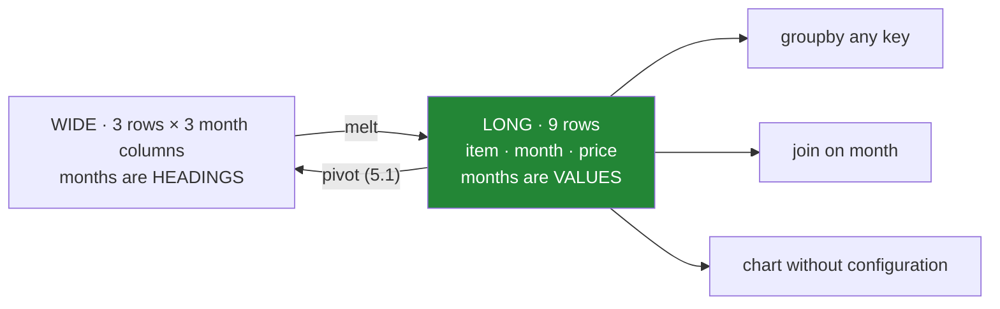

# 4.1 — `melt` — one row per measurement

## One-line answer

`melt` turns columns into rows: a table with a column per month becomes a table with a `month` column
and a `price` column, so every measurement is one row — which is the shape every tool expects and
almost no spreadsheet is in.

---

## The story

The price sheet is a grid. Down the side are the items; across the top are the months. Each cell is
what that item cost that month.

It is a perfectly good sheet. It is how anybody would write it by hand, it fits on a page, and you can
see at a glance that the bread went up in February.

Then somebody wants the average price per month. That means adding up a column — fine. Then the
average per item: adding up a row — also fine, but a different operation, done a different way, in a
different direction.

Then somebody wants to add April. That means a new column, and every piece of code that mentioned the
months by name has to be edited.

Then somebody wants to join the prices to the sales, which have one row per sale with a date on them.
And there is no way to do it, because the sales table has a `month` column and the price sheet has
the months *as column headings* — the thing you need to join on is not a column at all, it is part of
the table's shape.

The sheet is not wrong. It is in the shape a person reads, and the question is in the shape a computer
works with, and there is a single operation that converts between them.

---

## The idea in plain language

Two words, and they are worth learning because every tool uses them.

**Wide** is one row per thing, with a column per measurement: one row per item, a column per month.
Compact, readable, and the shape a spreadsheet naturally takes.

**Long** — also called **tidy** — is one row per *measurement*: item, month, price. Repetitive to read
and the shape every analytical tool expects, because the thing that varies is now a **value in a
column** rather than a column heading.

`melt` goes from wide to long. It takes the columns you name and turns them into two columns: one
holding the old column **name**, one holding the **value**. Every other column is repeated down the
rows to keep the answer identified.

The three arguments that matter:

- **`id_vars`** — the columns that identify the row and should be kept as they are. Here, `item`.
- **`var_name`** — what to call the column that holds the old headings. Default is `"variable"`, which
  is useless; always pass one.
- **`value_name`** — what to call the column that holds the values. Default is `"value"`, equally
  useless.

The reason to bother is not tidiness. It is that **long data does not need editing when a category is
added.** A new month is a new *row*, and rows are what tables are made of; nothing in your code
mentions `mar` by name, so nothing breaks. In wide data a new month is a new column, and every
function that lists the columns has to be found and changed.

The three practical consequences, which are the whole argument:

- **Grouping works in one direction.** In long form, "average per month" and "average per item" are
  the same call with a different key ([Day 31](../../../day-31-groupby/parts/01-the-split/1.1-four-lines-three-aisles.md)).
  In wide form they are a column sum and a row sum, which are different operations.
- **Joining works at all.** A long price table has a `month` column, so it can be joined to anything
  else that has one ([2.1](../02-merging/2.1-the-key-and-the-rows-it-pairs.md)).
- **Charting works without configuration.** Every plotting library wants a column for the x-axis, a
  column for the y-axis, and optionally a column to colour by — which is exactly long form
  ([Day 38](../../../day-38-seaborn/parts/01-the-tidy-input/1.1-one-row-per-observation.md) makes this
  a requirement).

The rule that survives: **store long, present wide.** Keep the data one row per measurement, and
reshape to a grid at the last moment, for a human to look at
([5.1](../05-long-to-wide/5.1-pivot-one-row-per-thing.md)).

---

## Why Setu needs it

- **[4.2](4.2-id-vars-value-vars-and-the-names-you-choose.md)** is the same operation with the
  arguments that make the result usable.
- **[5.1](../05-long-to-wide/5.1-pivot-one-row-per-thing.md)** is the inverse — long back to wide —
  for the moment somebody has to read it.
- **[2.1](../02-merging/2.1-the-key-and-the-rows-it-pairs.md)** needs a key **column**, which a wide
  table's headings are not.
- **Day 31's `groupby`** takes a key column, so the whole of yesterday assumes long data
  ([Day 31, 1.1](../../../day-31-groupby/parts/01-the-split/1.1-four-lines-three-aisles.md)).
- **Day 38** is Seaborn, which requires long input for anything with more than one series
  ([Day 38, 1.1](../../../day-38-seaborn/parts/01-the-tidy-input/1.1-one-row-per-observation.md)) —
  the day this operation stops being a preference and becomes a prerequisite.

---

## The mechanism

The price sheet as a grid — three items, three months:

```python
import pandas as pd

wide = pd.DataFrame(
    {
        "item": pd.Series(["milk", "bread", "eggs"], dtype="str"),
        "jan": [1.15, 1.40, 0.32],
        "feb": [1.15, 1.45, 0.35],
        "mar": [1.20, 1.45, 0.35],
    }
)

print(wide)
```

**Line by line:**

- One row per item, one column per month. Nine prices in a three-by-three block, plus the item names.
- **The months are column headings, not data.** That is the whole problem: there is no `month` column
  to group by, join on or plot against.
- `dtype="str"` on the item names, stated rather than inferred
  ([Day 26, 2.2](../../../day-26-frames-and-copy-on-write/parts/02-the-str-dtype/2.2-str-the-dtype-pandas-3-infers.md)).
- The price columns are all `float64`, which is only possible because every month holds the same kind
  of thing — a fact that is true here and is not true of every wide table.

```text
    item   jan   feb   mar
0   milk  1.15  1.15  1.20
1  bread  1.40  1.45  1.45
2   eggs  0.32  0.35  0.35
```

The reshape:

```python
long = wide.melt(id_vars="item", var_name="month", value_name="price")

print(long)
print()
print("shape:", wide.shape, "->", long.shape)
```

**Line by line:**

- `id_vars="item"` says *this column identifies the row; leave it alone and repeat it as needed.*
  Everything not named here is melted.
- `var_name="month"` names the column that will hold the old headings. **Without it the column is
  called `variable`**, which tells a reader nothing and has to be renamed anyway.
- `value_name="price"` likewise, instead of `value`.
- The result has **nine rows** — one per cell of the three-by-three block — and three columns. The
  shape line says `(3, 4) -> (9, 3)`: fewer columns, more rows, the same nine numbers.
- Read the order: all of January, then all of February, then all of March. `melt` goes **column by
  column**, so the rows come out grouped by the melted variable rather than by the id.
- `item` is repeated three times each, which is what makes long data verbose and is exactly what makes
  it groupable.

```text
    item month  price
0   milk   jan   1.15
1  bread   jan   1.40
2   eggs   jan   0.32
3   milk   feb   1.15
4  bread   feb   1.45
5   eggs   feb   0.35
6   milk   mar   1.20
7  bread   mar   1.45
8   eggs   mar   0.35

shape: (3, 4) -> (9, 3)
```

What the long shape buys — the same question, both ways round:

```python
print(long.groupby("month", sort=False)["price"].mean().round(3).to_dict())
print(long.groupby("item", sort=False)["price"].mean().round(3).to_dict())
```

**Line by line:**

- **The same call twice, with a different key.** In the wide frame, "average per month" is
  `wide[["jan", "feb", "mar"]].mean()` and "average per item" is `wide.mean(axis=1)` — two different
  methods with two different axis arguments, and the second one silently includes any other numeric
  column you happen to have.
- `sort=False` keeps the months in the order they were melted, which is January, February, March
  ([Day 31, 4.2](../../../day-31-groupby/parts/04-the-keys/4.2-sort-and-the-order-of-the-groups.md)).
  Sorted alphabetically they would come out February, January, March, which is why a month column of
  text is worth converting to a proper date or an ordered category.
- Nothing in either line names a month. **Add April and both lines still work** — that is the
  maintenance argument, in two lines of evidence.

```text
{'jan': 0.957, 'feb': 0.983, 'mar': 1.0}
{'milk': 1.167, 'bread': 1.433, 'eggs': 0.34}
```



---

## When it breaks

**`melt` with no `id_vars`:**

```text
$ uv run python -c "
import pandas as pd
wide = pd.DataFrame({'item': ['milk', 'bread'], 'jan': [1.15, 1.40], 'feb': [1.15, 1.45]})
print(wide.melt())
"
```

```text
  variable  value
0     item   milk
1     item  bread
2      jan   1.15
3      jan    1.4
4      feb   1.15
5      feb   1.45
```

**What it means.** With no `id_vars`, **every** column is melted, including the item names — so the
item names become values in a column headed `variable`, next to prices, and the `value` column now
holds both text and numbers. Its dtype is `object`, which is the one Day 26 spent a section arguing
against ([Day 26, 2.4](../../../day-26-frames-and-copy-on-write/parts/02-the-str-dtype/2.4-dtypes-equals-object-finds-nothing.md)).
**No error.** The frame is well formed and meaningless. `id_vars` is not optional in practice.

**The default column names, three steps later:**

```text
$ uv run python -c "
import pandas as pd
wide = pd.DataFrame({'item': ['milk', 'bread'], 'jan': [1.15, 1.40], 'feb': [1.15, 1.45]})
long = wide.melt(id_vars='item')
print(list(long.columns))
print(long.groupby('variable')['value'].mean().round(3).to_dict())
"
```

```text
['item', 'variable', 'value']
{'feb': 1.3, 'jan': 1.275}
```

**What it means.** It works, and the code that reads it says `groupby("variable")["value"]`, which
describes nothing. Six months later somebody has to open the frame to find out what a variable is and
what a value is. **Nothing raises and nothing is wrong** — it is purely that two column names were
left at their defaults, and column names are the cheapest documentation there is
([2.4](../02-merging/2.4-the-suffixes-and-the-column-on-both-sides.md) made the same argument about
`_x` and `_y`).

**Melting columns that are not the same kind of thing:**

```text
$ uv run python -c "
import pandas as pd
wide = pd.DataFrame({
    'item': ['milk', 'bread'],
    'jan': [1.15, 1.40],
    'feb': [1.15, 1.45],
    'aisle': ['dairy', 'bakery'],
})
long = wide.melt(id_vars='item', var_name='month', value_name='price')
print(long)
print()
print('price dtype:', long['price'].dtype)
"
```

```text
    item  month   price
0   milk    jan    1.15
1  bread    jan     1.4
2   milk    feb    1.15
3  bread    feb    1.45
4   milk  aisle   dairy
5  bread  aisle  bakery

price dtype: object
```

**What it means.** `aisle` was melted too, because it was not in `id_vars` and `melt` takes everything
else. A column headed `month` now contains the word `aisle`, a column headed `price` contains `dairy`,
and the `price` column's dtype is `object` — so every sum, mean and comparison downstream either fails
with a confusing type error or does something unintended
([Day 26, 2.4](../../../day-26-frames-and-copy-on-write/parts/02-the-str-dtype/2.4-dtypes-equals-object-finds-nothing.md)).
**No error at any point.** The fix is `value_vars=["jan", "feb"]`, which is
[4.2](4.2-id-vars-value-vars-and-the-names-you-choose.md), and the habit is to name **both** ends
explicitly rather than relying on "everything else".

---

## In production

**What a professional writes instead of the teaching version.** The reshape names both the identifiers
and the values, and asserts that nothing was lost:

```python
import pandas as pd


def to_long(
    wide: pd.DataFrame,
    id_vars: list[str],
    value_vars: list[str],
    var_name: str,
    value_name: str,
) -> pd.DataFrame:
    """Wide to long, with every column accounted for and the cell count checked."""
    named = set(id_vars) | set(value_vars)
    unaccounted = sorted(set(wide.columns) - named)
    if unaccounted:
        raise ValueError(
            f"columns {unaccounted} are neither id_vars nor value_vars; "
            "melt would silently include or drop them"
        )

    absent = sorted(named - set(wide.columns))
    if absent:
        raise KeyError(f"frame has no columns {absent}; has {list(wide.columns)}")

    long = wide.melt(
        id_vars=id_vars, value_vars=value_vars, var_name=var_name, value_name=value_name
    )

    expected = len(wide) * len(value_vars)
    if len(long) != expected:
        raise RuntimeError(f"melt produced {len(long)} rows, expected {expected}")
    return long
```

**Line by line:**

- Both `id_vars` and `value_vars` are **required**, with no defaults. That is the fix for the third
  failure above: `melt` melts "everything not in `id_vars`", so a column added upstream is silently
  swept in, and naming both ends closes the hole.
- The `unaccounted` check is the important one. It raises when the frame has a column that is neither —
  which is exactly what happens when somebody adds `loaded_at` to the source — and the message says
  what would have happened rather than only what is wrong.
- The `absent` check runs the other way, so a renamed column produces a sentence naming the frame's
  actual columns rather than a `KeyError` from inside pandas.
- `expected = len(wide) * len(value_vars)` is the arithmetic of a melt: every row becomes one row per
  melted column. Asserting it costs nothing and catches the case where `value_vars` overlapped
  `id_vars`, which pandas permits and which duplicates data.
- `RuntimeError` rather than `ValueError` for that last one, because it means the library did
  something unexpected rather than that the caller passed something invalid
  ([Day 18, 2.2](../../../day-18-exceptions/parts/02-the-hierarchy/2.2-which-built-in-to-raise.md)).
- The function does **not** convert the `var_name` column to a date or a category. That is a separate
  decision with its own consequences for sort order
  ([Day 31, 4.2](../../../day-31-groupby/parts/04-the-keys/4.2-sort-and-the-order-of-the-groups.md)),
  and a reshape helper that quietly retypes a column is a reshape helper nobody can predict.

**What changes at scale.** A melt produces `rows × melted columns` rows, so a wide table of a thousand
rows and five hundred columns becomes half a million rows — and the identifier columns are **copied**
into every one of them. That copying is the cost, and it is why melting a very wide frame can use far
more memory than the frame itself: a `str` identifier repeated five hundred times per row is real
bytes. Two habits follow. Convert identifier columns to `category` before melting when they repeat,
which Day 34 measures and which turns the copies into small integers. And melt only the columns you
need — `value_vars` is not merely a correctness argument, it is the difference between a
half-million-row frame and a ten-thousand-row one. Storage formats reward the long shape for the
opposite reason: Parquet compresses a repeated identifier column to almost nothing, so long data on
disk is often *smaller* than the wide equivalent even though it has more rows.

**The failure mode that only appears with real data.** The wide table gains a column that is not a
measurement — a comment field, a source system, a flag — and because it is not in `id_vars` it gets
melted. The `value` column, which was numeric, becomes `object`, and every arithmetic operation
downstream either fails with a confusing type error or silently does something else, like concatenating
strings ([Day 31, 2.1](../../../day-31-groupby/parts/02-aggregating/2.1-one-number-for-each-group.md)).
The error surfaces far from the melt, and the melt is the last place anybody looks. Naming
`value_vars` explicitly makes it impossible.

**The review comment a senior engineer leaves.** *"`melt(id_vars='customer_id')` will melt every new
column the upstream team adds, and they added `ingested_at` last week — that is why the `value` column
is now object dtype. Please pass `value_vars` explicitly, and assert that every column is either an id
or a value."*

**The interview question.** *"What is the difference between wide and long data, and why would you
convert?"* Wide is one row per entity with a column per measurement; long is one row per measurement,
with the old column headings as values in a column. You convert because long form is what group-bys,
joins and plotting libraries all take, and because adding a category becomes new rows rather than a
schema change that every piece of code has to be edited for. The follow-up worth having ready: *"when
would you go the other way?"* At the point a person reads it — a grid is easier for a human and worse
for everything else, so the rule is store long, present wide.

---

## Check yourself

```bash
uv run python -c "
import pandas as pd
wide = pd.DataFrame({
    'item': pd.Series(['milk', 'bread', 'eggs'], dtype='str'),
    'jan': [1.15, 1.40, 0.32],
    'feb': [1.15, 1.45, 0.35],
    'mar': [1.20, 1.45, 0.35],
})
long = wide.melt(id_vars='item', var_name='month', value_name='price')
print(long)
print()
print('shape :', wide.shape, '->', long.shape)
print('cells :', wide.shape[0] * (wide.shape[1] - 1), 'vs rows', len(long))
print('per month:', long.groupby('month', sort=False)['price'].mean().round(3).to_dict())
print('per item :', long.groupby('item', sort=False)['price'].mean().round(3).to_dict())
"
```

The two group-bys are the same call with one word changed. Write the equivalent pair against the
*wide* frame and say how they differ from each other.

**Answer out loud, without scrolling up:**

> Say what `melt` does to a column heading, in one sentence. Then give the maintenance reason to
> prefer long data — what happens when a new month arrives, in each of the two shapes.

---

**Next:** [4.2 — `id_vars`, `value_vars`, and the names you choose](4.2-id-vars-value-vars-and-the-names-you-choose.md).
