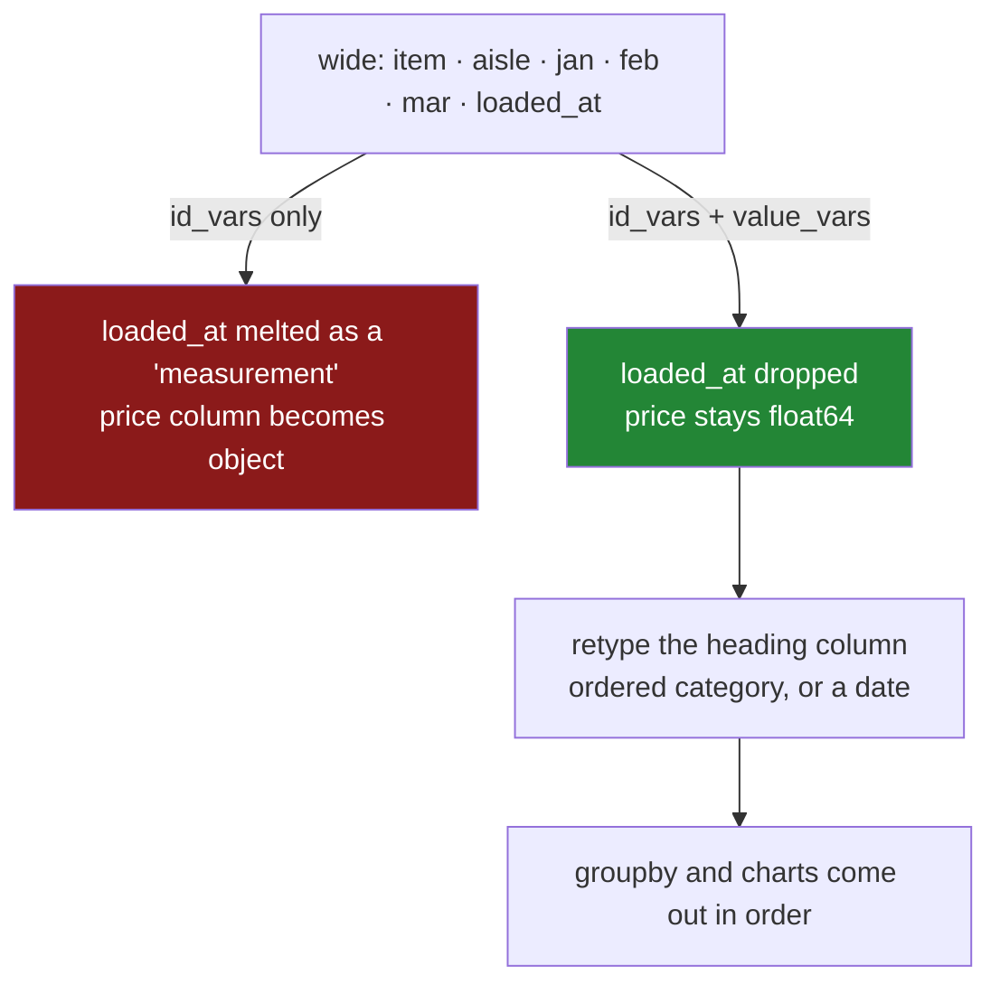

# 4.2 — `id_vars`, `value_vars`, and the names you choose

## One-line answer

Name **both** ends of a melt — the columns that identify a row and the columns that hold
measurements — because "everything not in `id_vars`" quietly includes whatever a colleague added last
week, and the column that holds the old headings is text, so `feb` sorts before `jan`.

## The story

The price sheet now has an aisle column on it, because somebody found it useful to know where things
were.

The melt was written before that column existed, and it says *keep `item`, melt everything else*. So
`aisle` is now a measurement: there is a row saying `milk`, `aisle`, `dairy`, sitting underneath the
rows saying `milk`, `jan`, `1.15`.

Nothing complains. The column headed `price` now contains the word `dairy` alongside numbers, so it
stops being a numeric column, and the average price of anything is either an error or nonsense
depending on which function meets it first.

That is the first half. The second half is quieter. The month column is text, so when somebody asks
for the average price per month, the answer comes back **February, January, March** — alphabetically —
and the line on the resulting chart goes up, down, up for reasons that have nothing to do with prices.

Both problems come from the same place: the melt described the columns by what they were *not*, and
the result's new columns were left as plain text.

---

## The idea in plain language

`melt` has two arguments for naming columns and you should use both:

- **`id_vars`** — the columns that identify a row. Kept as they are, repeated down.
- **`value_vars`** — the columns that hold measurements. Melted into `var_name` and `value_name`.

If you give only `id_vars`, `value_vars` defaults to **everything else**. That default is the problem:
it describes the measurement columns negatively, so any column added upstream joins them silently.
Naming both means the frame's columns are partitioned explicitly, and a column that is in neither list
is a column somebody has to think about — which is exactly what you want.

Then there is the new column that holds the old headings. It is **text**, always, because column names
are strings. Three consequences:

- **It sorts alphabetically.** `feb`, `jan`, `mar` — which is what `groupby` and every chart will use
  ([Day 31, 4.2](../../../day-31-groupby/parts/04-the-keys/4.2-sort-and-the-order-of-the-groups.md)).
- **It is one string per row**, repeated. On a long frame that is real memory, and Day 34's `category`
  dtype is the fix ([Day 34](../../../day-34-categories-and-describe/parts/02-the-category-dtype/2.1-two-arrays-instead-of-one.md)).
- **It has no meaning to pandas.** `jan` is not a month; it is three letters. Nothing will treat it as
  a date, compare it to another date, or resample on it until you convert it.

So after every melt there is a **retyping step**, and it is a decision rather than a formality:

- **An ordered `category`** — `pd.Categorical(long["month"], categories=MONTHS, ordered=True)` — when
  the headings are a fixed, ordered set of labels. Grouping and sorting then use your order, and the
  column costs almost nothing to store.
- **A real date** — `pd.to_datetime(...)` — when the headings are periods you will do arithmetic on.
  Day 33 covers this properly.
- **Left as text** — when the headings are genuinely unordered names.

The habit worth carrying: **a melt is not finished when the shape is right.** It is finished when the
new columns have the types the next step needs.

---

## Why Setu needs it

- **[4.1](4.1-melt-one-row-per-measurement.md)** showed the reshape and demonstrated the failure this
  part fixes: a column swept into the melt because it was not named.
- **[5.1](../05-long-to-wide/5.1-pivot-one-row-per-thing.md)** goes the other way, and the column order
  of the result is decided by exactly the ordering question raised here.
- **[6.1](../06-the-module/6.1-the-joining-module.md)** puts the month list in a constant and the
  retyping in the reshape helper, so neither is retyped at a call site.
- **Day 33** is `.dt` and resampling, which need a real date rather than a three-letter string.
- **Day 34** is the `category` dtype, which is what a melted heading column should almost always be.

---

## The mechanism

The price sheet, now with an aisle column:

```python
import pandas as pd

MONTHS = ["jan", "feb", "mar"]

wide = pd.DataFrame(
    {
        "item": pd.Series(["milk", "bread"], dtype="str"),
        "aisle": pd.Series(["dairy", "bakery"], dtype="str"),
        "jan": [1.15, 1.40],
        "feb": [1.15, 1.45],
        "mar": [1.20, 1.45],
    }
)

long = wide.melt(
    id_vars=["item", "aisle"],
    value_vars=MONTHS,
    var_name="month",
    value_name="price",
)
print(long)
```

**Line by line:**

- `MONTHS` is a **named constant**, not a literal inside the call. It is used twice — here and in the
  retyping below — and a list written twice is a list that will disagree with itself.
- `id_vars=["item", "aisle"]` names **both** identifying columns, so `aisle` is repeated down the rows
  rather than being melted into the measurements
  ([4.1](4.1-melt-one-row-per-measurement.md) showed what happens otherwise).
- `value_vars=MONTHS` names the measurement columns explicitly. **This is the line that makes the melt
  safe against a column added upstream**: a new `loaded_at` is in neither list, so it is simply
  dropped rather than silently becoming a measurement.
- Six rows: two items times three months. `aisle` appears three times per item, which is the
  repetition that long form trades for its usefulness.
- The result's `price` column is `float64`, because only float columns were melted. That is the whole
  win, and it came from one argument.

```text
    item   aisle month  price
0   milk   dairy   jan   1.15
1  bread  bakery   jan   1.40
2   milk   dairy   feb   1.15
3  bread  bakery   feb   1.45
4   milk   dairy   mar   1.20
5  bread  bakery   mar   1.45
```

Now the ordering problem, and the fix:

```python
print("as text:")
print(long.groupby("month")["price"].mean().round(3))

ordered = long.copy()
ordered["month"] = pd.Categorical(ordered["month"], categories=MONTHS, ordered=True)

print()
print("as an ordered category:")
print(ordered.groupby("month", observed=True)["price"].mean().round(3))
```

**Line by line:**

- The first `groupby` gets **February, January, March**. `month` is text, so `sort=True` sorts
  alphabetically ([Day 31, 4.2](../../../day-31-groupby/parts/04-the-keys/4.2-sort-and-the-order-of-the-groups.md)),
  and the numbers are right while the order is meaningless.
- `pd.Categorical(..., categories=MONTHS, ordered=True)` attaches the order to the column itself.
  `categories=MONTHS` is the same constant used in the melt, so the order and the selection cannot
  drift apart.
- `ordered=True` is the part that matters. A plain `category` fixes the storage and not the order; the
  `ordered` flag is what makes `jan < feb` true and what makes the group-by come out in sequence.
- `observed=True` on the group-by, because the key is now categorical and the default would emit a row
  for every declared month even in a batch that has none
  ([Day 31, 4.5](../../../day-31-groupby/parts/04-the-keys/4.5-observed-and-the-aisle-nobody-visited.md)).
- The second result reads January, February, March — the same three numbers in an order that means
  something. **Nothing about the values changed.**

```text
as text:
month
feb    1.300
jan    1.275
mar    1.325
Name: price, dtype: float64

as an ordered category:
month
jan    1.275
feb    1.300
mar    1.325
Name: price, dtype: float64
```

`value_vars` as a filter, which is its other use:

```python
print(wide.melt(id_vars=["item"], value_vars=["jan", "feb"], var_name="month", value_name="price"))
```

**Line by line:**

- Only two of the three months are named, so `mar` is **dropped** rather than melted. That is often
  what you want — melting a two-hundred-column frame when you need four columns is a needless
  half-million rows ([4.1](4.1-melt-one-row-per-measurement.md)'s production section).
- `aisle` is also gone, because it is in neither list. **Columns in neither list are silently
  discarded**, which is the one genuine risk of naming both: a measurement you forgot to list
  disappears without a word.
- That risk is why the production version below asserts that every column is accounted for. Naming
  both ends is safer than naming one, and it is not safe on its own.
- Four rows: two items times two months.

```text
    item month  price
0   milk   jan   1.15
1  bread   jan   1.40
2   milk   feb   1.15
3  bread   feb   1.45
```



---

## When it breaks

**A column named in both lists:**

```text
$ uv run python -c "
import pandas as pd
wide = pd.DataFrame({'item': ['milk', 'bread'], 'jan': [1.15, 1.40]})
print(wide.melt(id_vars=['item'], value_vars=['item', 'jan'], var_name='k', value_name='v'))
"
```

```text
    item    k     v
0   milk  jan  1.15
1  bread  jan  1.40
```

**What it means.** `item` is in both lists, and pandas resolved it by using it as an identifier and
ignoring it as a value — so the melt produced two rows instead of the four you might have expected
from two items times two named value columns. **No error and no warning.** It is not obvious from the
output that anything was ignored, and on a frame with fifty columns a duplicated name in two generated
lists is easy to produce and hard to see. The production version checks for the overlap.

**The chart that goes up, down, up:**

```text
$ uv run python -c "
import pandas as pd
MONTHS = ['jan', 'feb', 'mar', 'apr', 'may', 'jun']
wide = pd.DataFrame({'item': ['milk'], **{m: [1.0 + i * 0.05] for i, m in enumerate(MONTHS)}})
long = wide.melt(id_vars='item', value_vars=MONTHS, var_name='month', value_name='price')
print('as text  :', long.groupby('month')['price'].mean().round(2).to_dict())
print('in order :', {m: round(float(long.loc[long['month'] == m, 'price'].iloc[0]), 2) for m in MONTHS})
"
```

```text
as text  : {'apr': 1.15, 'feb': 1.05, 'jan': 1.0, 'jun': 1.25, 'mar': 1.1, 'may': 1.2}
in order : {'jan': 1.0, 'feb': 1.05, 'mar': 1.1, 'apr': 1.15, 'may': 1.2, 'jun': 1.25}
```

**What it means.** The price rises steadily every month. Grouped by the text column it comes out
`1.15, 1.05, 1.00, 1.25, 1.10, 1.20` — a jagged line with no pattern, which is what a chart would
draw. **Nothing raised**, the numbers are all correct, and the only wrong thing is the order. With six
months the damage is visible; with twelve it looks like seasonality.

**The measurement that was dropped because it was not listed:**

```text
$ uv run python -c "
import pandas as pd
wide = pd.DataFrame({'item': ['milk'], 'jan': [1.15], 'feb': [1.15], 'mar': [1.20]})
MONTHS = ['jan', 'feb']
long = wide.melt(id_vars='item', value_vars=MONTHS, var_name='month', value_name='price')
print('columns in :', list(wide.columns))
print('rows out   :', len(long), '-- expected', len(wide) * 3)
print(long)
"
```

```text
columns in : ['item', 'jan', 'feb', 'mar']
rows out   : 2 -- expected 3
   item month  price
0  milk   jan   1.15
1  milk   feb   1.15
```

**What it means.** The frame has three month columns and the melt produced two rows, because `MONTHS`
was not updated when `mar` was added. **March is simply gone**, with no error — the mirror image of
the failure in [4.1](4.1-melt-one-row-per-measurement.md), and the reason naming both lists is
necessary but not sufficient. The check that catches both directions is asserting that every column of
the frame appears in exactly one of the two lists.

---

## In production

**What a professional writes instead of the teaching version.** The two lists partition the frame, the
partition is asserted, and the heading column is retyped as part of the same step:

```python
import pandas as pd

MONTHS: list[str] = ["jan", "feb", "mar"]


def to_long(
    wide: pd.DataFrame,
    id_vars: list[str],
    value_vars: list[str],
    var_name: str,
    value_name: str,
    var_order: list[str] | None = None,
) -> pd.DataFrame:
    """Wide to long, with every column accounted for and the heading column typed."""
    both = sorted(set(id_vars) & set(value_vars))
    if both:
        raise ValueError(f"columns {both} are in both id_vars and value_vars")

    named = set(id_vars) | set(value_vars)
    absent = sorted(named - set(wide.columns))
    if absent:
        raise KeyError(f"frame has no columns {absent}; has {list(wide.columns)}")

    unaccounted = sorted(set(wide.columns) - named)
    if unaccounted:
        raise ValueError(
            f"columns {unaccounted} are neither id_vars nor value_vars; "
            "melt would drop them silently"
        )

    long = wide.melt(
        id_vars=id_vars, value_vars=value_vars, var_name=var_name, value_name=value_name
    )
    if var_order is not None:
        long[var_name] = pd.Categorical(long[var_name], categories=var_order, ordered=True)
        if long[var_name].isna().any():
            raise ValueError(f"{var_name} contains values outside var_order {var_order}")
    return long
```

**Line by line:**

- The **overlap** check first, because a column in both lists is silently resolved by pandas and is
  almost always a bug in whatever generated the lists.
- The **absent** check next, so a renamed column names the frame's actual columns rather than
  producing a `KeyError` from inside pandas.
- The **unaccounted** check is the one that earns its keep. It fires when the source gains a column,
  which is the failure in [4.1](4.1-melt-one-row-per-measurement.md), *and* when somebody forgets to
  add a month to `MONTHS`, which is the failure above. One check, both directions.
- `var_order: list[str] | None = None` makes the retyping part of the reshape rather than something a
  caller must remember. Passing `None` leaves the column as text, which is right for genuinely
  unordered headings.
- `pd.Categorical(..., ordered=True)` gives the column its meaning, and the **`isna()` check
  afterwards** is the important half: `pd.Categorical` silently turns any value not in `categories`
  into a blank, so a heading missing from `var_order` would vanish without a word. The check turns
  that into a sentence.
- The function returns the frame and does not mutate its argument, so a caller holding `wide` is
  unaffected.

**What changes at scale.** The two checks are set operations on column names and cost nothing. The
retyping is where the money is: a melted heading column repeats one of a handful of strings once per
row, so on a ten-million-row long frame it is hundreds of megabytes as `str` and a few tens as
`category` — Day 34 measures it. That is often the difference between a frame that fits and one that
does not, and it comes from one line. The other scale consideration is `value_vars` as a filter: on a
source with hundreds of measurement columns, melting only what you need is not an optimisation, it is
the difference between a long frame of ten million rows and one of five hundred million. Both of those
argue for the same thing — the reshape should be explicit about which columns matter, in both
directions.

**The failure mode that only appears with real data.** The heading column is left as text and
everything works, because the first few months happen to sort correctly — `2024-01`, `2024-02`,
`2024-03` sort fine as strings. Then the format changes, or the data crosses a year boundary written
without zero padding, and `2024-9` sorts after `2024-10`. Every chart reorders, every "latest month"
calculation picks the wrong row, and the code has not changed. **Sorting text that represents an
ordered thing works until it does not**, and the failure arrives at an arbitrary moment with no
error — which is the argument for converting to a real date or an ordered category at the reshape
rather than relying on the strings.

**The review comment a senior engineer leaves.** *"This melt passes `id_vars` and lets `value_vars`
default, so the `_ingested_at` column the platform team added is now a 'measurement' and the value
column is object dtype. Name both lists, and assert the frame's columns partition into them.
Also please make `month` an ordered category — the trend chart is currently in alphabetical order."*

**The interview question.** *"What do `id_vars` and `value_vars` do in `melt`?"* `id_vars` are the
columns kept as identifiers and repeated down the rows; `value_vars` are the columns melted into a
name column and a value column. Passing only `id_vars` means everything else is melted, so a column
added upstream silently becomes a measurement and can change the value column's dtype. The follow-up
worth being ready for: *"anything to do afterwards?"* Retype the new heading column — it is text, so
it sorts alphabetically and carries no meaning; make it an ordered category or a real date depending
on what the headings are.

---

## Check yourself

```bash
uv run python -c "
import pandas as pd
MONTHS = ['jan', 'feb', 'mar']
wide = pd.DataFrame({
    'item': pd.Series(['milk', 'bread'], dtype='str'),
    'aisle': pd.Series(['dairy', 'bakery'], dtype='str'),
    'jan': [1.15, 1.40], 'feb': [1.15, 1.45], 'mar': [1.20, 1.45],
})
long = wide.melt(id_vars=['item', 'aisle'], value_vars=MONTHS, var_name='month', value_name='price')
print(long)
print()
print('price dtype:', long['price'].dtype)
print('as text  :', long.groupby('month')['price'].mean().round(3).to_dict())
ordered = long.assign(month=pd.Categorical(long['month'], categories=MONTHS, ordered=True))
print('as ordered:', ordered.groupby('month', observed=True)['price'].mean().round(3).to_dict())
"
```

The two group-bys contain the same three numbers in different orders. Say which one you would put on a
chart, and say what one line of code produced the difference.

**Answer out loud, without scrolling up:**

> Say what `value_vars` defaults to when you leave it out, and what goes wrong as a result. Then say
> what type the column holding the old headings has, and the one thing you should do to it before
> grouping or charting.

---

**Next:** [5.1 — `pivot`: one row per thing](../05-long-to-wide/5.1-pivot-one-row-per-thing.md).
