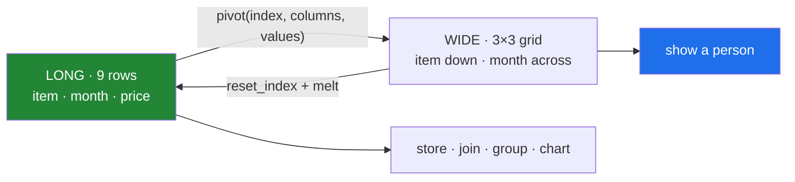

# 5.1 — `pivot` — one row per thing

## One-line answer

`pivot` is the inverse of `melt`: it turns the values of one column into column headings, so a long
table of item-month-price becomes a grid with a column per month — which is the shape a person reads
and the last thing you should do before showing it to one.

---

## The story

The prices are in long form now. Nine rows: item, month, price, one row per measurement. Every tool
is happy. Grouping works, joining works, charting works, and adding April is one more row.

Then somebody has to put it on a slide.

Nine rows of item-month-price is unreadable on a slide. Nobody can see that the bread went up in
February, because the January bread and the February bread are four rows apart and the eye cannot hold
them together. The long form is the shape a computer works with, and it is genuinely worse for the one
job a slide has.

What the slide needs is the grid the price sheet started as: items down the side, months across the
top, one number per cell. Three rows instead of nine, and the bread's increase is a step you can see
without reading.

The data has not changed. The audience has.

---

## The idea in plain language

`pivot` takes three arguments and they map exactly onto the picture:

- **`index`** — the column whose values become the **rows**. Here, `item`.
- **`columns`** — the column whose values become the **column headings**. Here, `month`.
- **`values`** — the column whose values fill the **cells**. Here, `price`.

Read the call as a sentence: *one row per item, one column per month, filled with prices.* That is the
whole operation, and it is the exact inverse of the melt in
[4.1](../04-wide-to-long/4.1-melt-one-row-per-measurement.md).

Four things follow from the shape.

**The index column becomes the index**, so the item names are row labels rather than a column — the
same thing that happens after a group-by
([Day 31, 4.1](../../../day-31-groupby/parts/04-the-keys/4.1-the-key-became-the-index.md)), with the
same consequence: `result["item"]` raises, and `reset_index()` is how you get it back.

**Cells for combinations that did not occur come out blank.** If nobody priced the eggs in March,
that cell is `NaN` — and it is not missing data, it is an absent combination. Whether it should read
as zero is a judgement, and filling it without deciding is the failure from
[Day 31, 4.4](../../../day-31-groupby/parts/04-the-keys/4.4-two-keys-and-the-multiindex.md).

**The columns come out sorted** by the values of the `columns` argument, which for text is
alphabetical — so `feb, jan, mar` unless the column is an ordered category
([4.2](../04-wide-to-long/4.2-id-vars-value-vars-and-the-names-you-choose.md)). This is the same
ordering problem as before, arriving in the column headings this time.

**Every `(index, columns)` pair must be unique.** Two rows saying "milk in January" have no single
cell to go in, and `pivot` raises rather than guessing. That is
[5.2](5.2-the-duplicate-that-makes-pivot-raise.md), and it is the difference between `pivot` and
`pivot_table`.

The rule that ties the two directions together, and is worth carrying out of this day: **store long,
present wide.** Long is the shape for computing, joining and storing — it survives a new category
without a schema change, and columnar formats compress its repeated identifiers to almost nothing.
Wide is the shape for the last step, when a person has to look at it.

---

## Why Setu needs it

- **[4.1](../04-wide-to-long/4.1-melt-one-row-per-measurement.md)** went the other way and argued for
  long form. This is the exception: the moment of presentation.
- **[5.2](5.2-the-duplicate-that-makes-pivot-raise.md)** is what happens when the pair is not unique,
  and `pivot_table` is the version that aggregates instead of raising.
- **[5.3](5.3-stack-and-unstack.md)** is the same reshape done through the index rather than through
  named columns, which is what a `groupby` on two keys hands you
  ([Day 31, 4.4](../../../day-31-groupby/parts/04-the-keys/4.4-two-keys-and-the-multiindex.md)).
- **Day 37** is chart choice, where a grid is what a heatmap and a small-multiples layout take.
- **Day 45** is the Phase 4 gate, whose stored dataset is long and whose report is wide.

---

## The mechanism

The long price table from [4.1](../04-wide-to-long/4.1-melt-one-row-per-measurement.md):

```python
import pandas as pd

long = pd.DataFrame(
    {
        "item": pd.Series(["milk", "bread", "eggs"] * 3, dtype="str"),
        "month": pd.Series(["jan"] * 3 + ["feb"] * 3 + ["mar"] * 3, dtype="str"),
        "price": [1.15, 1.40, 0.32, 1.15, 1.45, 0.35, 1.20, 1.45, 0.35],
    }
)

print(long)
print()
print("rows:", len(long))
```

**Line by line:**

- Nine rows, one per measurement — three items times three months. This is exactly what
  [4.1](../04-wide-to-long/4.1-melt-one-row-per-measurement.md)'s melt produced, rebuilt directly so
  this part stands alone.
- `["milk", "bread", "eggs"] * 3` repeats the list three times and `["jan"] * 3 + ...` repeats each
  month three times, which reproduces the melt's column-by-column order.
- Every `(item, month)` pair occurs **exactly once**. That is the precondition `pivot` requires, and
  it is worth checking before you rely on it ([5.2](5.2-the-duplicate-that-makes-pivot-raise.md)).

```text
    item month  price
0   milk   jan   1.15
1  bread   jan   1.40
2   eggs   jan   0.32
3   milk   feb   1.15
4  bread   feb   1.45
5   eggs   feb   0.35
6   milk   mar   1.20
7  bread   mar   1.45
8   eggs   mar   0.35

rows: 9
```

The pivot:

```python
grid = long.pivot(index="item", columns="month", values="price")

print(grid)
print()
print("shape:", long.shape, "->", grid.shape)
print("index name  :", grid.index.name)
print("columns name:", grid.columns.name)
```

**Line by line:**

- `index="item"` — one row per item. `columns="month"` — one column per month. `values="price"` — the
  cells. Three arguments, three parts of the picture, and they are all keyword arguments so the call
  cannot be got wrong by ordering.
- Nine rows become **three rows and three columns**: the same nine numbers, arranged as a grid.
- `grid.index.name` is `item` and `grid.columns.name` is `month`. **pandas kept the names of both
  axes**, which is why the printout has `month` above the headings and `item` above the labels — and
  is a genuinely useful thing when the grid is written to a file.
- The columns come out `feb, jan, mar` — **alphabetical**, because `month` is text
  ([4.2](../04-wide-to-long/4.2-id-vars-value-vars-and-the-names-you-choose.md)). On a slide that is
  wrong, and it is fixed by making `month` an ordered category before pivoting.
- `item` is now the index, so `grid["milk"]` would look for a *column* called `milk` and raise
  ([Day 31, 4.1](../../../day-31-groupby/parts/04-the-keys/4.1-the-key-became-the-index.md)).

```text
month   feb   jan   mar
item
bread  1.45  1.40  1.45
eggs   0.35  0.32  0.35
milk   1.15  1.15  1.20

shape: (9, 3) -> (3, 3)
index name  : item
columns name: month
```

The order fixed, which is what you actually want on a slide:

```python
MONTHS = ["jan", "feb", "mar"]

ordered = long.assign(month=pd.Categorical(long["month"], categories=MONTHS, ordered=True))
print(ordered.pivot(index="item", columns="month", values="price"))
```

**Line by line:**

- `pd.Categorical(..., categories=MONTHS, ordered=True)` attaches the intended order to the column
  before the pivot, so the column headings come out in it
  ([4.2](../04-wide-to-long/4.2-id-vars-value-vars-and-the-names-you-choose.md)).
- `.assign(...)` rather than an in-place write, so `long` is untouched and both versions can be
  printed.
- The alternative — `grid[MONTHS]` after pivoting — also works and is worse: it repeats the month list
  at a second place, and it silently drops a month that is in the data and not in your list.
- The result is the price sheet the day started from, in the order a person expects.

```text
month   jan   feb   mar
item
bread  1.40  1.45  1.45
eggs   0.32  0.35  0.35
milk   1.15  1.15  1.20
```

And the round trip, which is the check worth running once:

```python
back = (
    ordered.pivot(index="item", columns="month", values="price")
    .reset_index()
    .melt(id_vars="item", var_name="month", value_name="price")
)

print("rows:", len(long), "-> pivot -> melt ->", len(back))
print("same values?", sorted(back["price"].round(3)) == sorted(long["price"].round(3)))
```

**Line by line:**

- `.reset_index()` puts `item` back as a column, because `melt` needs it as an `id_vars`
  ([4.1](../04-wide-to-long/4.1-melt-one-row-per-measurement.md)) and it is currently the index.
- The melt reverses the pivot, so nine rows come back — **the two operations are inverses when every
  pair is unique**, which is the property worth knowing.
- `sorted(...)` on both sides, because the row *order* differs between the two paths and the values do
  not. Comparing sorted lists is the honest check; `equals` on the frames would report `False` for a
  reason that does not matter.
- `.round(3)` before comparing, because two float paths through the same numbers can differ in the last
  bit ([Day 23, 2.6](../../../day-23-ufuncs-and-statistics/parts/02-statistics/2.6-float-summation-and-the-drift.md)).

```text
rows: 9 -> pivot -> melt -> 9
same values? True
```



---

## When it breaks

**Asking for the index column after pivoting:**

```text
$ uv run python -c "
import pandas as pd
long = pd.DataFrame({
    'item': ['milk', 'bread', 'milk', 'bread'],
    'month': ['jan', 'jan', 'feb', 'feb'],
    'price': [1.15, 1.40, 1.15, 1.45],
})
grid = long.pivot(index='item', columns='month', values='price')
print(list(grid.columns))
print(grid['item'])
"
```

```text
['feb', 'jan']
Traceback (most recent call last):
  File "<string>", line 9, in <module>
KeyError: 'item'
```

**What it means.** The word `item` is printed above the row labels, and it is the **index's name**, not
a column ([Day 31, 4.1](../../../day-31-groupby/parts/04-the-keys/4.1-the-key-became-the-index.md)).
`grid["milk"]` would fail too, because `milk` is a row label rather than a column heading. The fix is
`reset_index()` if you want a column, or `grid.loc["milk"]` if you want the row.

**A combination that never happened:**

```text
$ uv run python -c "
import pandas as pd
long = pd.DataFrame({
    'item': ['milk', 'bread', 'milk'],
    'month': ['jan', 'jan', 'feb'],
    'price': [1.15, 1.40, 1.15],
})
grid = long.pivot(index='item', columns='month', values='price')
print(grid)
print()
print('cells:', grid.size, 'from', len(long), 'rows')
print('mean per month, blanks skipped:', grid.mean().round(3).to_dict())
print('mean per month, blanks as zero:', grid.fillna(0).mean().round(3).to_dict())
"
```

```text
month   feb   jan
item
bread   NaN  1.40
milk   1.15  1.15

cells: 4 from 3 rows
mean per month, blanks skipped: {'feb': 1.15, 'jan': 1.275}
mean per month, blanks as zero: {'feb': 0.575, 'jan': 1.275}
```

**What it means.** Three rows became four cells, and the fourth is a question rather than a value.
February's average is `1.15` if the blank means "we never priced the bread in February" and `0.575` if
it means "the bread was free" — a factor of two, from a cell **the pivot created**. It did not exist
in the long frame, so filling it is a claim
([Day 30, 5.1](../../../day-30-missing-data/parts/05-filling/5.1-fillna-is-a-claim.md)) and needs a
reason.

**The grid that gained a column:**

```text
$ uv run python -c "
import pandas as pd
base = pd.DataFrame({'item': ['milk', 'milk'], 'month': ['jan', 'feb'], 'price': [1.15, 1.15]})
extra = pd.concat([base, pd.DataFrame({'item': ['milk'], 'month': ['mar'], 'price': [1.20]})])
print('before:', list(base.pivot(index='item', columns='month', values='price').columns))
print('after :', list(extra.pivot(index='item', columns='month', values='price').columns))
"
```

```text
before: ['feb', 'jan']
after : ['feb', 'jan', 'mar']
```

**What it means.** One extra row in the long frame produced one extra **column** in the grid. That is
the operation working correctly and it is why the wide shape is bad for storage: anything downstream
that expected two columns now gets three, a fixed-schema file rejects it, and code that indexed
columns by position is silently wrong. **A new category is a new row in long form and a schema change
in wide form**, which is the whole argument for pivoting last.

---

## In production

**What a professional writes instead of the teaching version.** The pivot happens at the presentation
boundary, the column order is stated, and the absent cells are a decision:

```python
import pandas as pd


def to_grid(
    long: pd.DataFrame,
    index: str,
    columns: str,
    values: str,
    column_order: list[str] | None = None,
    absent: float | None = None,
) -> pd.DataFrame:
    """Long to wide, for display. `absent` says what an unobserved combination means."""
    absent_columns = sorted({index, columns, values} - set(long.columns))
    if absent_columns:
        raise KeyError(f"frame has no columns {absent_columns}; has {list(long.columns)}")

    duplicated = long.duplicated([index, columns]).sum()
    if duplicated:
        offenders = long.loc[long.duplicated([index, columns], keep=False), [index, columns]]
        raise ValueError(
            f"{duplicated} duplicate ({index}, {columns}) pairs; pivot needs one row per cell. "
            f"Examples: {offenders.drop_duplicates().head(5).to_dict('records')}"
        )

    grid = long.pivot(index=index, columns=columns, values=values)

    if column_order is not None:
        unknown = sorted(set(grid.columns) - set(column_order))
        if unknown:
            raise ValueError(f"{columns} contains values not in column_order: {unknown}")
        grid = grid.reindex(columns=column_order)

    return grid if absent is None else grid.fillna(absent)
```

**Line by line:**

- The **duplicate check comes first** and raises with examples, because `pivot`'s own message
  ([5.2](5.2-the-duplicate-that-makes-pivot-raise.md)) says the index contains duplicate entries and
  does not say which ones. Five example pairs is the difference between a diagnosis and a search.
- `column_order: list[str] | None` puts the ordering decision in the signature. Passing `None` accepts
  alphabetical, which is right when the headings are genuinely names.
- The **`unknown` check before reindexing** is the important half: `reindex(columns=...)` silently
  drops any column not in the list and silently adds an empty one for anything in the list that is not
  in the data. Without the check, a month appearing in the data and missing from the constant
  disappears from the report with no error.
- `grid.reindex(columns=column_order)` rather than `grid[column_order]`, because `reindex` is explicit
  about what it does with a missing label and the bracket form raises a `KeyError` that names only the
  first one.
- `absent: float | None = None` makes the empty-cell decision a required thought rather than a default
  ([Day 31, 4.4](../../../day-31-groupby/parts/04-the-keys/4.4-two-keys-and-the-multiindex.md)).
  `None` leaves blanks, which means "we do not know"; passing `0.0` asserts "there was none".
- The function returns a grid and does not reset the index, because the index **is** the row axis of
  the thing being displayed — a chart wants it that way, and a caller writing a CSV gets it for free
  ([Day 27, 1.7](../../../day-27-reading-and-writing/parts/01-the-csv/1.7-to-csv-and-what-it-throws-away.md)).

**What changes at scale.** A pivot builds a **dense** result: `index cardinality × columns
cardinality` cells, whether or not those combinations exist. That is the whole story. A long frame of
ten thousand rows with ten thousand distinct customers and a thousand products pivots to ten million
cells, nearly all of them blank, from ten thousand rows of actual data — and the allocation happens
before anything complains. Two rules follow, and they are the practical form of "store long, present
wide". First, check the product of the two cardinalities before pivoting anything you have not seen:
`long[index].nunique() * long[columns].nunique()` is one line and it is the number that predicts the
memory. Second, pivot at the point of display and never in storage, because columnar formats store the
long shape efficiently — a repeated identifier column compresses to almost nothing — while the wide
shape stores a rectangle of mostly-nulls and changes its schema every time a category appears.

**The failure mode that only appears with real data.** The grid is written to a file every week with a
fixed set of columns, and one week a new category appears — a new region, a new product line — so the
file gains a column. Everything that reads it by position is now off by one, everything that reads it
by name is fine until the *next* week when the category has no data and the column disappears again.
**A wide file's schema is a function of its contents**, which is exactly what a schema is not supposed
to be. The `column_order` argument above is the fix: the report's columns are decided by a constant,
not by the batch.

**The review comment a senior engineer leaves.** *"This pivots on `customer_id` before writing to
Parquet — that is 300 000 columns and the job will not survive it. Keep the long form on disk and pivot
in the dashboard query. Also pass an explicit `column_order`; last month's file gained a column when a
new region appeared and the downstream parser broke."*

**The interview question.** *"How do you turn a long table into a wide one?"* `pivot(index=...,
columns=..., values=...)` — the index column's values become rows, the columns column's values become
headings, and the values column fills the cells. The follow-up worth being ready for: *"when would you
not?"* For storage or for anything downstream: a new category becomes a new column rather than a new
row, so the schema changes with the data, and the result is dense — index cardinality times column
cardinality cells regardless of how many combinations actually occur, which is how a pivot on a
high-cardinality key runs out of memory on a small table.

---

## Check yourself

```bash
uv run python -c "
import pandas as pd
MONTHS = ['jan', 'feb', 'mar']
long = pd.DataFrame({
    'item': pd.Series(['milk', 'bread', 'eggs'] * 3, dtype='str'),
    'month': pd.Series(['jan'] * 3 + ['feb'] * 3 + ['mar'] * 3, dtype='str'),
    'price': [1.15, 1.40, 0.32, 1.15, 1.45, 0.35, 1.20, 1.45, 0.35],
})
grid = long.pivot(index='item', columns='month', values='price')
print(grid)
print()
print('shape       :', long.shape, '->', grid.shape)
print('columns     :', list(grid.columns))
ordered = long.assign(month=pd.Categorical(long['month'], categories=MONTHS, ordered=True))
print('in order    :', list(ordered.pivot(index='item', columns='month', values='price').columns))
print('cells       :', grid.size, 'from', len(long), 'rows')
"
```

The grid has exactly as many cells as the long frame had rows. Say what would have to be true of the
data for that not to be the case, and which direction the difference would go.

**Answer out loud, without scrolling up:**

> Name the three arguments to `pivot` and say which part of the resulting picture each one controls.
> Then give the rule about which shape to store and which to present, and the reason — what happens to
> each shape when a new category appears.

---

**Next:** [5.2 — The duplicate that makes `pivot` raise](5.2-the-duplicate-that-makes-pivot-raise.md).
