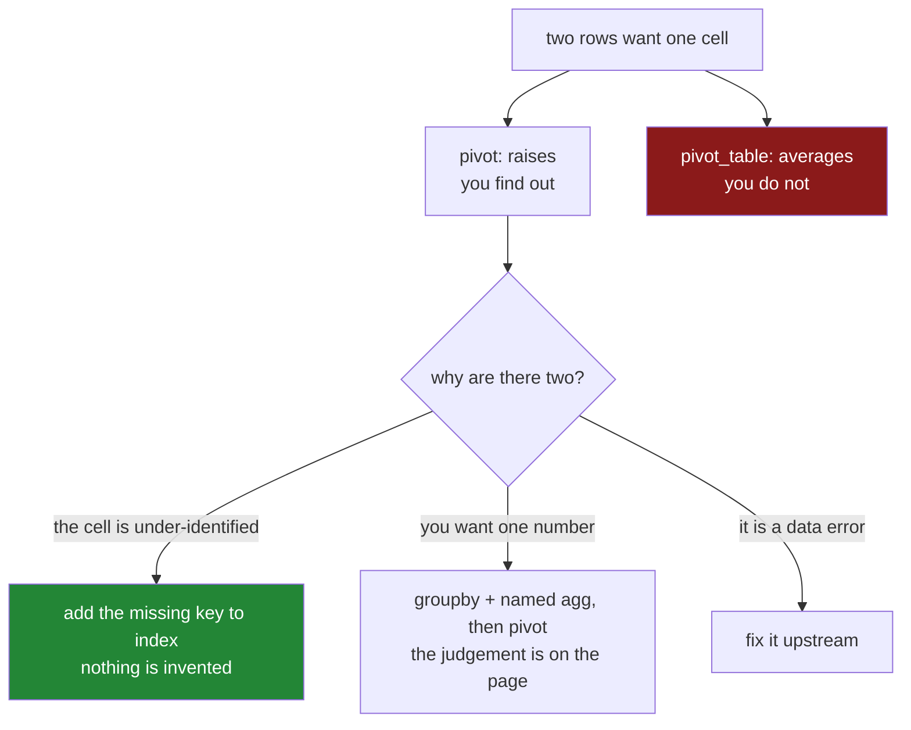

# 5.2 — The duplicate that makes `pivot` raise

## One-line answer

`pivot` needs exactly one row per cell, so two rows saying "milk in January" make it raise — and
`pivot_table` is the version that takes an `aggfunc` and combines them instead, which is more
convenient and quietly averages things you may not have meant to average.

---

## The story

The price list gets a second entry for milk in January, because the corner shop and the supermarket
charge different amounts and somebody recorded both.

The long form handles it fine. Two rows, both true, both saying which shop they came from if anybody
had thought to add that column.

Then somebody pivots it into the grid for the slide, and there is one cell for milk-in-January and two
numbers that want to go in it. pandas refuses.

The refusal is annoying and it is the right behaviour, because there is no answer. Should the cell say
£1.15, or £1.20, or the average of the two, or the cheaper one? Each of those is defensible and they
are different numbers, and nothing in the data says which the slide wants.

There is a second method that does not refuse. It takes an instruction — *average them* — and produces
a grid without complaint. Which is exactly what you want when you have decided to average, and exactly
the wrong thing when you have not noticed there was anything to average.

---

## The idea in plain language

A grid cell is identified by one row label and one column label. `pivot` maps each row of the long
frame to one cell, so **the `(index, columns)` pair must be unique**. If it is not, two rows want the
same cell and `pivot` raises rather than choosing.

`pivot_table` is the same reshape with an aggregation step built in. It takes `aggfunc` — the default
is `"mean"` — and where several rows land in one cell, it combines them.

So the two methods differ in exactly one way, and it is worth stating plainly:

| | `pivot` | `pivot_table` |
|---|---|---|
| duplicate `(index, columns)` | **raises** | aggregates with `aggfunc` |
| default `aggfunc` | none — there is no aggregation | `"mean"` |
| tells you a duplicate existed | yes, by refusing | **no** |

That last row is the whole argument. **`pivot_table` will silently average two prices that should
never have been in the same cell**, and the grid it produces looks exactly like the one you wanted.
The refusal from `pivot` is information; `pivot_table`'s convenience is the absence of it.

The practical rule: **use `pivot` by default.** If it raises, that is a question about your data, and
answering it is the work:

1. **The cell is under-identified.** Milk-in-January-at-the-corner-shop and
   milk-in-January-at-the-supermarket are different things, so the index should be `(item, shop)` and
   the grid has more rows. This is usually the right answer — the same shape as the fix in
   [3.2](../03-the-row-count/3.2-the-duplicate-that-multiplied-rows.md).
2. **You genuinely want one number.** Then aggregate deliberately: `groupby([index, columns]).agg(...)`
   with a named aggregation, then `pivot` the result
   ([Day 31, 2.4](../../../day-31-groupby/parts/02-aggregating/2.4-named-aggregation.md)). Two lines
   instead of one, and the judgement is on the page.
3. **The duplicate is a data error.** Two identical rows loaded twice. Fix it upstream, not here.

Reaching for `pivot_table` is only the same as option 2 when you have thought about it. The difference
between the two is not the output; it is whether anybody knows.

Two smaller facts about `pivot_table` worth having:

- **It drops rows whose index or column key is blank**, by default, exactly like `groupby`
  ([Day 31, 4.3](../../../day-31-groupby/parts/04-the-keys/4.3-dropna-and-the-rows-that-vanished.md)),
  and it has the same `dropna` argument.
- **`aggfunc` takes the same reduction names as `agg`**, and a list of them, which produces a two-level
  column index ([Day 31, 2.3](../../../day-31-groupby/parts/02-aggregating/2.3-agg-several-answers-at-once.md)).

---

## Why Setu needs it

- **[5.1](5.1-pivot-one-row-per-thing.md)** stated the uniqueness requirement. This is what happens
  when it does not hold.
- **[3.2](../03-the-row-count/3.2-the-duplicate-that-multiplied-rows.md)** met the same problem in a
  join: a key that is not unique because it is incomplete. Same diagnosis, same first fix.
- **[6.1](../06-the-module/6.1-the-joining-module.md)** checks for duplicates before pivoting and
  raises with examples, because `pivot`'s own message does not name them.
- **Day 31's `groupby`** is option 2, and doing the aggregation explicitly is what makes the judgement
  reviewable ([Day 31, 2.4](../../../day-31-groupby/parts/02-aggregating/2.4-named-aggregation.md)).
- **Day 45** is the Phase 4 gate, where a silently averaged cell is exactly the kind of unexplained
  number the gate exists to catch.

---

## The mechanism

The long price table with one duplicated pair:

```python
import pandas as pd

long = pd.DataFrame(
    {
        "item": pd.Series(["milk", "bread", "milk", "bread"], dtype="str"),
        "month": pd.Series(["jan", "jan", "jan", "feb"], dtype="str"),
        "price": [1.15, 1.40, 1.20, 1.45],
    }
)

print(long)
print()
print("duplicate (item, month) pairs:", int(long.duplicated(["item", "month"]).sum()))
```

**Line by line:**

- Rows 0 and 2 are both `milk`, `jan` — two prices for one cell. Nothing about either row is wrong;
  they are two real observations that the table has no column to distinguish.
- `long.duplicated(["item", "month"])` gives a mask that is `True` for the **second and later** rows of
  each repeated pair, so summing it counts the extras rather than the rows involved. One extra here.
- **Run this before every pivot.** It is the same one-line check as before a merge
  ([3.1](../03-the-row-count/3.1-count-the-rows-before-and-after.md)), and it answers the question
  `pivot` is about to ask.

```text
    item month  price
0   milk   jan   1.15
1  bread   jan   1.40
2   milk   jan   1.20
3  bread   feb   1.45

duplicate (item, month) pairs: 1
```

`pivot` refusing:

```python
try:
    long.pivot(index="item", columns="month", values="price")
except ValueError as error:
    print(type(error).__name__ + ":", error)
```

**Line by line:**

- The exception is a plain `ValueError`, and the message is *"Index contains duplicate entries, cannot
  reshape"*.
- **It says what is wrong and not which entries**, which is the one weakness of an otherwise good
  error. On four rows that is fine; on four hundred thousand it is the reason
  [6.1](../06-the-module/6.1-the-joining-module.md) checks first and raises with examples.
- The word "index" in the message means the combined `(index, columns)` pair, not the frame's row
  index — which is worth knowing, because the natural reading sends you looking at the wrong thing.

```text
ValueError: Index contains duplicate entries, cannot reshape
```

`pivot_table` not refusing:

```python
print(long.pivot_table(index="item", columns="month", values="price"))
print()
print(
    "what happened to the milk:",
    long.loc[long["item"] == "milk", "price"].tolist(),
    "-> mean",
    round(long.loc[long["item"] == "milk", "price"].mean(), 3),
)
```

**Line by line:**

- No `aggfunc`, so the default `"mean"` applies. **The two milk prices were averaged**, and the grid
  says `1.175`.
- The output is a perfectly ordinary grid. Nothing about it says a cell was computed from two rows
  rather than one, and nothing says the average was pandas' idea rather than yours.
- The second print is the diagnosis you would have to run to notice: `1.15` and `1.20` went in and
  `1.175` came out, which is a number that never appeared in the data and is not a price anybody paid.
- `bread` in February reads `1.45`, unaggregated — the mean of one value is that value, so the
  aggregation is invisible on every cell except the one it changed.

```text
month   feb    jan
item
bread  1.45  1.400
milk    NaN  1.175

what happened to the milk: [1.15, 1.2] -> mean 1.175
```

The two honest fixes:

```python
with_shop = long.assign(shop=pd.Series(["main", "main", "corner", "main"], dtype="str"))
print(with_shop.pivot(index=["item", "shop"], columns="month", values="price"))
print()
print(
    long.groupby(["item", "month"], as_index=False)
    .agg(cheapest=("price", "min"))
    .pivot(index="item", columns="month", values="cheapest")
)
```

**Line by line:**

- The first fix adds the column that distinguishes the two rows. `index=["item", "shop"]` takes a
  **list**, giving a two-level row index
  ([Day 31, 4.4](../../../day-31-groupby/parts/04-the-keys/4.4-two-keys-and-the-multiindex.md)), and
  every pair is now unique so `pivot` is happy. **Nothing was averaged and nothing was invented.**
- The second fix aggregates on purpose. `groupby([...]).agg(cheapest=("price", "min"))` says what is
  being computed **in the column's name**
  ([Day 31, 2.4](../../../day-31-groupby/parts/02-aggregating/2.4-named-aggregation.md)) — a reader of
  the grid sees `cheapest` rather than an unexplained number.
- `as_index=False` so the group-by returns the keys as columns, ready for `pivot`
  ([Day 31, 4.1](../../../day-31-groupby/parts/04-the-keys/4.1-the-key-became-the-index.md)).
- Two lines instead of one, and the judgement — *we want the cheapest* — is written down. That is the
  entire difference from `pivot_table`.

```text
month          feb   jan
item  shop
bread main    1.45  1.40
milk  corner   NaN  1.20
      main     NaN  1.15

month   feb   jan
item
bread  1.45  1.40
milk    NaN  1.15
```



---

## When it breaks

**The average nobody asked for:**

```text
$ uv run python -c "
import pandas as pd
long = pd.DataFrame({
    'item': ['milk', 'milk', 'bread'],
    'month': ['jan', 'jan', 'jan'],
    'price': [1.15, 9.99, 1.40],
})
print(long.pivot_table(index='item', columns='month', values='price'))
print()
print('the two milk rows were:', long.loc[long['item'] == 'milk', 'price'].tolist())
"
```

```text
month   jan
item
bread  1.40
milk   5.57

the two milk rows were: [1.15, 9.99]
```

**What it means.** One of the two milk rows is a typo — `9.99` for a pint of milk — and `pivot_table`
averaged it in, producing `5.57`, a price that is wrong in a way no reader of the grid can detect.
**`pivot` would have refused**, and the refusal would have sent somebody to look at the two rows,
which is where the typo is. The convenience cost a data-quality check.

**`pivot_table` dropping rows with a blank key:**

```text
$ uv run python -c "
import pandas as pd
long = pd.DataFrame({
    'item': ['milk', 'bread', 'eggs'],
    'month': ['jan', 'jan', None],
    'price': [1.15, 1.40, 0.32],
})
print(long.pivot_table(index='item', columns='month', values='price'))
print()
print('rows in :', len(long))
print('cells with a value:', int(long.pivot_table(index='item', columns='month', values='price').notna().sum().sum()))
"
```

```text
month   jan
item
bread  1.40
milk   1.15

rows in : 3
cells with a value: 2
```

**What it means.** The eggs row has no month, so it has no column to go in, and `pivot_table` drops it
— the same default as `groupby`
([Day 31, 4.3](../../../day-31-groupby/parts/04-the-keys/4.3-dropna-and-the-rows-that-vanished.md)).
Three rows in, two values out, **no error and no `eggs` row at all**. `dropna=False` keeps it, under a
`NaN` column heading which is awkward to address; filling the key with a real label before pivoting is
better, for the same reason as on Day 31.

**`aggfunc` on a column that cannot be averaged:**

```text
$ uv run python -c "
import pandas as pd
long = pd.DataFrame({
    'item': ['milk', 'milk'],
    'month': ['jan', 'jan'],
    'shop': pd.Series(['main', 'corner'], dtype='str'),
})
long.pivot_table(index='item', columns='month', values='shop', aggfunc='mean')
"
```

```text
TypeError: dtype 'str' does not support operation 'mean'
```

**What it means.** The default `aggfunc` is `"mean"` and text cannot be averaged, so pandas 3 raises —
which is the right behaviour and worth appreciating, because older pandas dropped the column and
returned an empty frame with no message at all. The fix is an `aggfunc` that makes sense for text:
`"first"` (which gives `main`, the first row's value), `"nunique"` to count how many distinct shops
sold it, or a `lambda s: ", ".join(s)` to keep both. The general lesson stands: **`pivot_table` applies
a reduction you did not choose**, and here the reduction happened to be one the dtype refuses.

---

## In production

**What a professional writes instead of the teaching version.** The duplicate check comes first and
names the offenders, and the aggregation — if there is one — is explicit:

```python
import pandas as pd


def to_grid(
    long: pd.DataFrame,
    index: list[str],
    columns: str,
    values: str,
    aggregate: tuple[str, str] | None = None,
) -> pd.DataFrame:
    """Long to wide. `aggregate` is (output_name, reduction) when a cell may hold several rows."""
    keys = [*index, columns]
    absent = sorted(set([*keys, values]) - set(long.columns))
    if absent:
        raise KeyError(f"frame has no columns {absent}; has {list(long.columns)}")

    duplicated = long.duplicated(keys)
    if duplicated.any() and aggregate is None:
        offenders = long.loc[long.duplicated(keys, keep=False), keys].drop_duplicates()
        raise ValueError(
            f"{int(duplicated.sum())} duplicate {keys} combinations and no aggregate given; "
            f"either add a key or pass one. Examples: {offenders.head(5).to_dict('records')}"
        )

    if aggregate is None:
        return long.pivot(index=index, columns=columns, values=values)

    name, how = aggregate
    reduced = long.groupby(keys, observed=True, dropna=False, as_index=False).agg(
        **{name: (values, how)}
    )
    return reduced.pivot(index=index, columns=columns, values=name)
```

**Line by line:**

- The duplicate check runs **before** the reshape and lists example combinations, because pandas'
  message says only that duplicates exist ([the mechanism above](#the-mechanism)) and finding them on
  a large frame is otherwise a search.
- `aggregate: tuple[str, str] | None = None` — the default is *no aggregation*, so the function
  behaves like `pivot` and refuses. **A caller who wants averaging has to say so**, which is the
  whole point: `pivot_table`'s default of `"mean"` is a decision made for you.
- The tuple is `(output_name, reduction)`, the same shape as a named aggregation
  ([Day 31, 2.4](../../../day-31-groupby/parts/02-aggregating/2.4-named-aggregation.md)), so the
  reduction ends up in a column name a reader of the grid can see.
- The aggregation is done with an explicit `groupby` rather than by handing `aggfunc` to
  `pivot_table`, for two reasons: `observed=True` and `dropna=False` can be set
  ([Day 31, 4.3](../../../day-31-groupby/parts/04-the-keys/4.3-dropna-and-the-rows-that-vanished.md),
  [Day 31, 4.5](../../../day-31-groupby/parts/04-the-keys/4.5-observed-and-the-aisle-nobody-visited.md)),
  and the intermediate frame can be inspected when something looks wrong.
- `index: list[str]` rather than a single string, so adding the missing key — the first and best fix —
  does not require changing the function.
- `as_index=False` on the group-by so the keys come back as columns for the pivot
  ([Day 31, 4.1](../../../day-31-groupby/parts/04-the-keys/4.1-the-key-became-the-index.md)).

**What changes at scale.** The duplicate check is one hash pass over the key columns and is far cheaper
than the reshape. The reshape itself is the expensive part, for the reason in
[5.1](5.1-pivot-one-row-per-thing.md): the result is dense, so its size is the product of the two
cardinalities regardless of how many combinations exist. `pivot_table` adds a group-by on top, so on a
large frame it is a group-by plus a reshape — which is worth knowing when a "just pivot it" step turns
out to be the slow one. The organisational change is that in a mature pipeline the aggregation and the
reshape are separate stages with the aggregated table **stored**: one row per `(index, columns)` pair,
long, with the reduction named. The grid is then built on demand by a dashboard or a query, and
everybody who asks "what does this cell mean" can read the column name of the table it came from.

**The failure mode that only appears with real data.** The pairs are unique when the code is written,
so `pivot` never raises and nobody thinks about it. Then the source starts recording a second row per
pair — a correction, a second currency, a late arrival — and `pivot` begins raising in production on a
step that has worked for a year. Under deadline the fix is to swap in `pivot_table`, which makes the
error go away and starts averaging corrections into originals. **The error was the feature**, and the
right response is the same as for `validate` in
[3.3](../03-the-row-count/3.3-validate-and-the-merge-error.md): find out why the duplicate appeared.

**The review comment a senior engineer leaves.** *"`pivot_table` here means any duplicate
`(account, month)` gets silently averaged, and we have started getting restatement rows. Use `pivot`
so it fails, or aggregate explicitly with the rule we actually want — I think it is 'latest by
`recorded_at`', which is neither a mean nor a refusal."*

**The interview question.** *"What is the difference between `pivot` and `pivot_table`?"* `pivot`
requires one row per cell and raises if the `(index, columns)` pair is duplicated; `pivot_table` takes
an `aggfunc`, defaulting to the mean, and combines the duplicates instead. The follow-up worth being
ready for: *"which would you use?"* `pivot`, because the exception is information — it tells you the
data has a distinction your grid does not — and if aggregation is genuinely wanted, doing it with an
explicit group-by puts the reduction in a column name where a reader can see it.

---

## Check yourself

```bash
uv run python -c "
import pandas as pd
long = pd.DataFrame({
    'item': pd.Series(['milk', 'bread', 'milk', 'bread'], dtype='str'),
    'month': pd.Series(['jan', 'jan', 'jan', 'feb'], dtype='str'),
    'price': [1.15, 1.40, 1.20, 1.45],
})
print('duplicate pairs:', int(long.duplicated(['item', 'month']).sum()))
try:
    long.pivot(index='item', columns='month', values='price')
except ValueError as e:
    print('pivot        :', e)
print()
print('pivot_table  :')
print(long.pivot_table(index='item', columns='month', values='price'))
print()
print('deliberate min:')
print(long.groupby(['item', 'month'], as_index=False).agg(cheapest=('price', 'min'))
          .pivot(index='item', columns='month', values='cheapest'))
"
```

Two of the three grids contain a number for milk in January and they are different numbers. Say what
each one is and where it came from, and say which of the two a reader of the grid could work out for
themselves.

**Answer out loud, without scrolling up:**

> Say what `pivot` requires of the `(index, columns)` pair and what it does when that does not hold.
> Then say what `pivot_table` does instead, and give the reason the refusal is more useful than the
> convenience.

---

**Next:** [5.3 — `stack` and `unstack`](5.3-stack-and-unstack.md).
