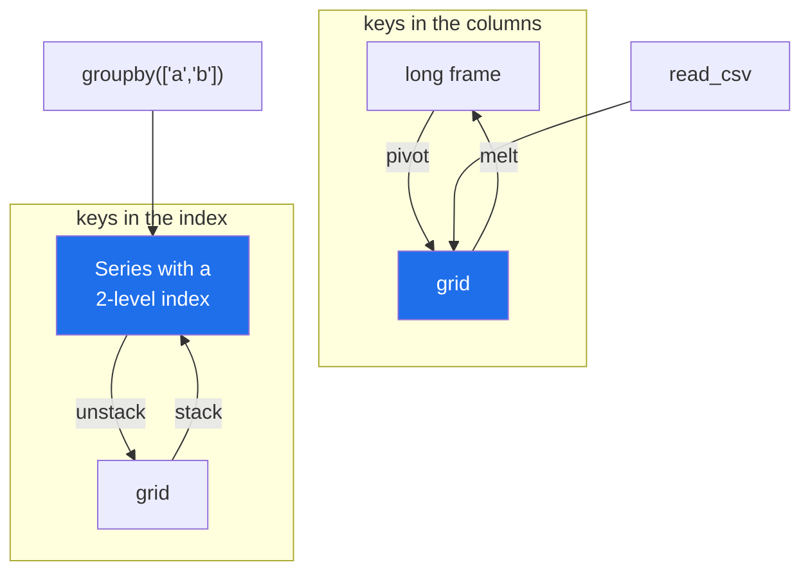

# 5.3 — `stack` and `unstack`

## One-line answer

`stack` and `unstack` are `melt` and `pivot` done through the **index** instead of through named
columns — `unstack` moves an index level up into the column headings and `stack` moves column headings
down into the index — which is why they are the natural pair for anything a group-by handed you.

---

## The story

Yesterday's group-by produced a total per shop per aisle, and it came back as a list: one line per
pair, with the two keys folded into the row labels
([Day 31, 4.4](../../../day-31-groupby/parts/04-the-keys/4.4-two-keys-and-the-multiindex.md)).

Somebody wants it as a grid — shops down, aisles across — and the tools from
[5.1](5.1-pivot-one-row-per-thing.md) do not quite fit. `pivot` takes column names, and the shop and
the aisle are not columns; they are levels of the row label. So the obvious move is `reset_index()`
first, turning them back into columns, and then `pivot` them straight back into a grid — two
operations that undo each other, with the real reshape in the middle.

There is a method that does it in one step, and the reason it exists is that this situation is
extremely common: nearly everything that produces a two-key result produces it with the keys in the
index.

---

## The idea in plain language

Two methods, and they are mirror images:

- **`unstack()`** takes the **innermost index level** and turns its values into **column headings**.
  Long becomes wide. It is `pivot` for data whose keys are already in the index.
- **`stack()`** takes the **column headings** and turns them into an inner **index level**. Wide
  becomes long. It is `melt` for data whose identifiers are already in the index.

Everything else about them follows from that one sentence. `unstack()` with no arguments moves the
last level; `unstack("shop")` moves the level you name; `unstack(0)` moves it by position. The same
for `stack` in the other direction.

The relationship to the pair you already know is worth stating exactly, because it is the thing that
makes all four make sense at once:

| | keys in **columns** | keys in the **index** |
|---|---|---|
| long → wide | `pivot(index=, columns=, values=)` | `unstack(level)` |
| wide → long | `melt(id_vars=, value_vars=)` | `stack()` |

They are the same two operations, twice, differing only in where the keys currently live. Which pair
you reach for is decided by what the previous step handed you: a `groupby` with two keys gives you the
index form ([Day 31, 4.4](../../../day-31-groupby/parts/04-the-keys/4.4-two-keys-and-the-multiindex.md)),
and a table read from a file gives you the column form.

Three behaviours to hold onto:

- **`unstack` creates blanks.** Every combination of the remaining index and the moved level gets a
  cell, so combinations that never occurred come out as `NaN` — the same created-cell question as in
  [5.1](5.1-pivot-one-row-per-thing.md).
- **`stack` keeps them.** In pandas 3 a blank cell becomes a row with a blank value, so a round trip
  through `unstack().stack()` comes back **longer** than it went in — five pairs become six rows, one
  of them empty. Older pandas dropped blanks and had a `dropna` argument; passing it now raises, with a
  message saying the new implementation does not introduce rows of NA. If you want the original length
  back, `dropna()` on the result is the explicit way.
- **So they are inverses only up to those created blanks and to sorting.** `df.stack().unstack()`
  gives you the frame back with its columns sorted, which is worth knowing before using the round trip
  as a test.

There is one more reason to know `stack`, and it is the one that comes up in real work: a frame with a
two-level column index — the thing `agg` produces when a column gets two reductions
([Day 31, 2.3](../../../day-31-groupby/parts/02-aggregating/2.3-agg-several-answers-at-once.md)) — can
be flattened by stacking a level, which is often tidier than renaming the columns by hand.

---

## Why Setu needs it

- **[5.1](5.1-pivot-one-row-per-thing.md)** and
  **[4.1](../04-wide-to-long/4.1-melt-one-row-per-measurement.md)** are the column-based pair. These
  are the index-based pair, and knowing all four is knowing one idea.
- **[Day 31, 4.4](../../../day-31-groupby/parts/04-the-keys/4.4-two-keys-and-the-multiindex.md)**
  produced a two-level index and used `unstack()` without explaining it. This is the explanation.
- **[6.1](../06-the-module/6.1-the-joining-module.md)** uses `pivot` rather than `unstack` in the
  module, for a reason this part makes clear: named arguments beat positional levels.
- **Day 33** resamples time series, which produces exactly this shape — a value per entity per
  period, keyed in the index.
- **Day 39** builds the correlation heatmap, whose input is a square grid and whose natural source is
  a stacked long form.

---

## The mechanism

The two-key group-by result from yesterday, in its natural shape:

```python
import pandas as pd

shop = pd.DataFrame(
    {
        "shop": pd.Series(["main", "main", "corner", "main", "corner"], dtype="str"),
        "aisle": pd.Series(["dairy", "bakery", "dairy", "dry", "dry"], dtype="str"),
        "spend": [2.30, 1.40, 1.92, 2.05, 3.10],
    }
)

totals = shop.groupby(["shop", "aisle"])["spend"].sum()
print(totals)
print()
print("index levels:", totals.index.nlevels, totals.index.names)
```

**Line by line:**

- `groupby(["shop", "aisle"])` gives one row per observed pair, with **both keys in a two-level
  index** ([Day 31, 4.4](../../../day-31-groupby/parts/04-the-keys/4.4-two-keys-and-the-multiindex.md)).
- Five pairs occur out of a possible six — `corner/bakery` never happened — so the result has five
  rows.
- `nlevels` is `2` and `names` carries both key names. Those names are what `unstack` will use as the
  column axis's name.
- This is a **Series**, not a frame, because one column was aggregated. `unstack` on a Series produces
  a frame, which is the shape change worth watching.

```text
shop    aisle
corner  dairy     1.92
        dry       3.10
main    bakery    1.40
        dairy     2.30
        dry       2.05
Name: spend, dtype: float64

index levels: 2 ['shop', 'aisle']
```

`unstack` — the inner level goes up:

```python
grid = totals.unstack()
print(grid)
print()
print("type:", type(grid).__name__)
print("index name  :", grid.index.name)
print("columns name:", grid.columns.name)
```

**Line by line:**

- `unstack()` with no argument moves the **innermost** level, which is `aisle` — the second name in the
  list passed to `groupby`. The outer level, `shop`, stays as the rows.
- A **Series became a frame**: five rows with a two-level index became two rows and three columns. That
  is the same shape change `pivot` makes, done in one word.
- `grid.columns.name` is `aisle`, carried up from the index level's name. It is what puts `aisle` above
  the headings in the printout, and it survives into a CSV.
- The `corner/bakery` cell is `NaN`, because that pair never occurred. **`unstack` created it** — the
  Series had five values and the grid has six cells
  ([5.1](5.1-pivot-one-row-per-thing.md)).
- `totals.unstack("shop")` would move the other level instead, giving aisles down and shops across.
  Naming the level rather than relying on "innermost" is worth the extra word.

```text
aisle   bakery  dairy   dry
shop
corner     NaN   1.92  3.10
main       1.4   2.30  2.05

type: DataFrame
index name  : shop
columns name: aisle
```

`stack` — the headings come back down:

```python
back = grid.stack()
print(back)
print()
print("rows:", len(totals), "-> unstack -> stack ->", len(back))
```

**Line by line:**

- `stack()` moves the columns into an inner index level, turning the frame back into a Series with a
  two-level index.
- **Six rows, not the five that went in.** `unstack` created the `corner/bakery` cell and `stack`
  brought it back down as a row with a blank value — so the round trip is *not* length-preserving, and
  the extra row records a combination that never happened.
- `back.dropna()` gives the original five. That is the explicit way to say "absent combinations are not
  observations"; there is no `dropna` argument on `stack` in pandas 3, and passing one raises.
- The level order is preserved: `shop` outer, `aisle` inner, because `stack` puts the columns
  **innermost**.

```text
shop    aisle
corner  bakery     NaN
        dairy     1.92
        dry       3.10
main    bakery    1.40
        dairy     2.30
        dry       2.05
dtype: float64

rows: 5 -> unstack -> stack -> 6
```

The same result through the column-based pair, for comparison:

```python
tidy = totals.reset_index()
print(tidy.pivot(index="shop", columns="aisle", values="spend"))
```

**Line by line:**

- `.reset_index()` turns both index levels into columns, giving a tidy frame of `shop`, `aisle`,
  `spend` ([Day 31, 4.1](../../../day-31-groupby/parts/04-the-keys/4.1-the-key-became-the-index.md)).
- `pivot` then names all three explicitly, and produces **an identical grid**.
- Two lines instead of one, and every argument named. **That is the trade**: `unstack()` is shorter and
  depends on which level happens to be innermost; `pivot` is longer and says what it is doing.
- In code you keep, prefer the second. In an interactive session, `unstack()` is one word and you can
  see the result immediately.

```text
aisle   bakery  dairy   dry
shop
corner     NaN   1.92  3.10
main       1.4   2.30  2.05
```



---

## When it breaks

**`unstack` on the wrong level:**

```text
$ uv run python -c "
import pandas as pd
shop = pd.DataFrame({
    'shop': ['main', 'main', 'corner'],
    'aisle': ['dairy', 'bakery', 'dairy'],
    'spend': [2.30, 1.40, 1.92],
})
totals = shop.groupby(['shop', 'aisle'])['spend'].sum()
print('unstack()       ->', list(totals.unstack().columns))
print('unstack(0)      ->', list(totals.unstack(0).columns))
print(\"unstack('shop') ->\", list(totals.unstack('shop').columns))
"
```

```text
unstack()       -> ['bakery', 'dairy']
unstack(0)      -> ['corner', 'main']
unstack('shop') -> ['corner', 'main']
```

**What it means.** `unstack()` and `unstack(0)` produce **transposed grids** — one has aisles across
the top and the other has shops — and neither raises. On a two-level index the difference is obvious
in the output; on a three-level index from a three-key group-by it is not, and `unstack(1)` picks the
middle level, which is rarely what anybody means. **Name the level**: `unstack("shop")` is
self-documenting and does not change meaning when somebody reorders the `groupby` keys.

**The `dropna` argument that no longer exists:**

```text
$ uv run python -c "
import pandas as pd
grid = pd.DataFrame(
    {'jan': [1.15, None], 'feb': [1.20, 1.45]},
    index=pd.Index(['milk', 'bread'], name='item'),
)
print('cells   :', grid.size)
print('stack() :', len(grid.stack()))
grid.stack(dropna=False)
"
```

```text
cells   : 4
stack() : 4
Traceback (most recent call last):
  File "<string>", line 9, in <module>
ValueError: dropna must be unspecified as the new implementation does not introduce rows of NA values. This argument will be removed in a future version of pandas.
```

**What it means.** Four cells go in and four rows come out — pandas 3's `stack` keeps the blank, so
the length is preserved and `dropna` has nothing left to do. Older pandas dropped blanks by default,
so code written against it produced *three* rows here, and any length check carried over from that era
is now wrong in the other direction. The error message is unusually explicit about why the argument is
gone, which is worth reading rather than working around: if you want the blanks removed, `dropna()` on
the result says so.

**Stacking a two-level column index:**

```text
$ uv run python -c "
import pandas as pd
shop = pd.DataFrame({
    'aisle': ['dairy', 'dairy', 'dry'],
    'spend': [2.30, 1.92, 2.05],
    'need': [2, 6, 1],
})
wide = shop.groupby('aisle').agg({'spend': ['sum', 'mean'], 'need': ['sum']})
print(wide)
print()
print('columns:', list(wide.columns))
print()
print(wide.stack())
"
```

```text
      spend       need
        sum  mean  sum
aisle
dairy  4.22  2.11    8
dry    2.05  2.05    1

columns: [('spend', 'sum'), ('spend', 'mean'), ('need', 'sum')]

            spend  need
aisle
dairy sum    4.22   8.0
      mean   2.11   NaN
dry   sum    2.05   1.0
      mean   2.05   NaN
```

**What it means.** The two-level column index from `agg`
([Day 31, 2.3](../../../day-31-groupby/parts/02-aggregating/2.3-agg-several-answers-at-once.md))
became a two-level *row* index, and the awkward `result[("spend", "sum")]` indexing went away —
`stacked.loc[("dairy", "sum")]` reads better. **The cost is in the `need` column**: no mean was asked
for, so the reshape invented a `(dairy, mean)` cell for it and filled it with a blank. `need`'s
integer dtype became float to hold it
([Day 30, 1.5](../../../day-30-missing-data/parts/01-what-missing-means/1.5-one-dtype-one-kind-of-blank.md)).
It is a real technique and it is not free, and named aggregation
([Day 31, 2.4](../../../day-31-groupby/parts/02-aggregating/2.4-named-aggregation.md)) avoids the
whole situation by never producing the two-level header in the first place.

---

## In production

**What a professional writes instead of the teaching version.** They mostly do not use `stack` and
`unstack` in code they keep, and the reason is worth stating precisely:

```python
import pandas as pd


def widen(long: pd.DataFrame, index: list[str], columns: str, values: str) -> pd.DataFrame:
    """Long to wide. Named arguments, so the shape does not depend on level order."""
    return long.pivot(index=index, columns=columns, values=values)


def widen_from_index(totals: pd.Series, level: str) -> pd.DataFrame:
    """Unstack one named level of a MultiIndex Series. Named, never positional."""
    if level not in (totals.index.names or []):
        raise KeyError(f"index has no level {level!r}; levels are {list(totals.index.names)}")
    return totals.unstack(level)


def lengthen(grid: pd.DataFrame, keep_blanks: bool) -> pd.Series:
    """Wide to long from a grid. `keep_blanks` is required: the two reshapes disagree."""
    return grid.stack(dropna=not keep_blanks)
```

**Line by line:**

- `widen` uses `pivot` rather than `unstack`, because **named arguments survive a refactor and level
  positions do not**. Somebody reordering the keys in an upstream `groupby` changes which level is
  innermost, and `unstack()` silently transposes the result; `pivot(index=..., columns=...)` does not
  move.
- `widen_from_index` exists for the case where the data genuinely arrives with the keys in the index,
  and it **requires the level by name**, with a check that names the available levels. That check turns
  a confusing transposed grid into a sentence.
- `totals.index.names or []` guards the case of a single-level index, where `names` can be `[None]` and
  the membership test would otherwise be comparing against nothing useful.
- `lengthen` makes `keep_blanks` a **required** argument, because `stack` drops blanks and `melt` keeps
  them, and a function that silently picks one convention is a function whose row count nobody can
  predict.
- None of the three does anything clever. Their whole value is that the ambiguous parts of the API —
  which level, which blank convention — become arguments a caller has to answer.

**What changes at scale.** All four reshapes have the same cost story as
[5.1](5.1-pivot-one-row-per-thing.md): going wide builds a **dense** result whose size is the product
of the two cardinalities, and going long builds one row per non-blank cell. `unstack` on a level with
high cardinality is the same memory failure as `pivot` on a high-cardinality column, and it arrives
more easily because `unstack()` is one word with no arguments to make you think. The practical
production position is the one the module takes: **keep data long, reshape at the display boundary, and
when you do reshape, name what you are doing.** The one place `stack` earns its keep in real code is
flattening a `MultiIndex` on columns after an aggregation — and even there, named aggregation
([Day 31, 2.4](../../../day-31-groupby/parts/02-aggregating/2.4-named-aggregation.md)) is the better
fix, because it prevents the two-level header rather than repairing it.

**The failure mode that only appears with real data.** A `groupby` gains a third key — somebody adds
`region` to the grouping — and every `unstack()` downstream now moves a different level, because the
innermost one changed. The grids transpose, the column headings become region names instead of aisle
names, and **nothing raises**, because a grid is a grid. Charts redraw with the wrong axis, files gain
unexpected columns, and the diff is enormous. This is the same class of bug as indexing by position
rather than by name, and it is why the module's helpers take level *names*.

**The review comment a senior engineer leaves.** *"`totals.unstack()` after a two-key group-by — that
moves whichever level happens to be innermost. When we add `region` to the group-by next sprint this
silently produces a different grid. Use `unstack('aisle')`, or better, `reset_index()` and `pivot` with
named arguments."*

**The interview question.** *"What is the difference between `pivot` and `unstack`?"* They do the same
reshape — long to wide — but `pivot` names the columns that hold the keys, while `unstack` moves a
level of the index. So you use `pivot` when the keys are columns and `unstack` when a group-by has
already put them in the index. The follow-up worth having ready: *"and `stack` versus `melt`?"* The
same pair in the other direction, with one behavioural difference that matters: `stack` drops blank
cells by default and `melt` keeps them, so the two produce different row counts on a grid with holes.

---

## Check yourself

```bash
uv run python -c "
import pandas as pd
shop = pd.DataFrame({
    'shop': pd.Series(['main', 'main', 'corner', 'main', 'corner'], dtype='str'),
    'aisle': pd.Series(['dairy', 'bakery', 'dairy', 'dry', 'dry'], dtype='str'),
    'spend': [2.30, 1.40, 1.92, 2.05, 3.10],
})
totals = shop.groupby(['shop', 'aisle'])['spend'].sum()
print('pairs        :', len(totals))
print('unstack cells:', totals.unstack().size)
print('back by stack:', len(totals.unstack().stack()))
print('after dropna :', len(totals.unstack().stack().dropna()))
print()
print(totals.unstack())
print()
print('by aisle instead:')
print(totals.unstack('shop'))
"
```

Five pairs became six cells and then six rows. Say what the sixth row is, why it exists, and what one
call brings the count back to five.

**Answer out loud, without scrolling up:**

> Say which direction `unstack` moves data and which axis it moves it to. Then place all four reshapes
> in one sentence — `melt`, `pivot`, `stack`, `unstack` — by saying what distinguishes each pair from
> the other.

---

**Next:** [6.1 — `src/setu/joining.py`, the day's module](../06-the-module/6.1-the-joining-module.md).
