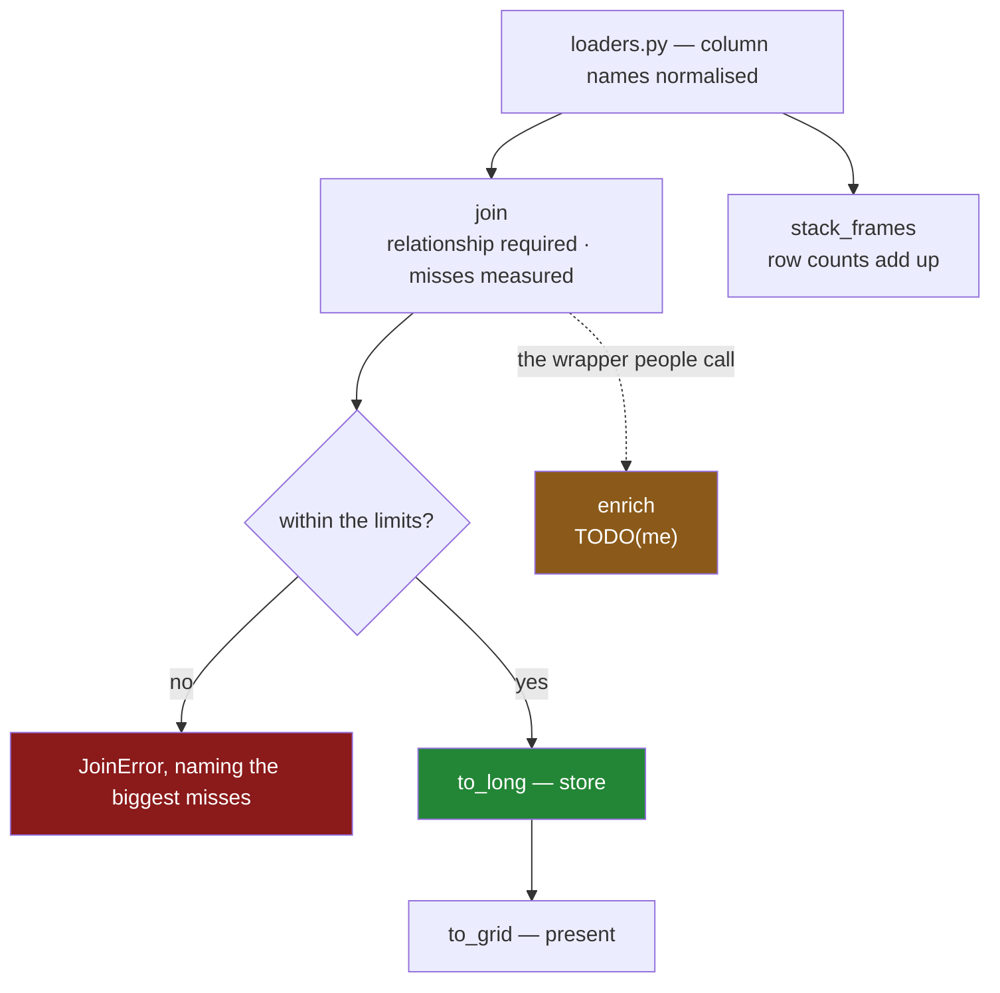

# 6.1 — `src/setu/joining.py`: the day's module

## One-line answer

The day's module keeps three promises — **every join states its relationship**, **every join reports
what did not match**, and **every reshape names both ends** — and where a promise cannot be kept by
the code it is kept by a check that refuses.

---

## The story

By the end of the day the flat has a set of habits. Name the key. Say the relationship. Count the rows.
Measure the misses in money, not in rows. Name both ends of a melt.

Habits are private, and the next person to open this file has not had the day.

`validate="many_to_one"` looks like clutter, and deleting it makes a failing job green. `how="left"`
looks more cautious than necessary when every key matches today. `indicator=True` produces a column
that has to be dropped, so somebody removes both. `value_vars` looks redundant next to `id_vars`.

Every one of those edits passes review, keeps the tests green, and undoes an afternoon — and three of
the four make a *currently failing* thing pass, which is the most dangerous kind of edit there is.

So the habits go into one file, with the reasons attached, and where the code cannot enforce a rule a
check refuses instead.

---

## The idea in plain language

`src/setu/joining.py` holds the day's operations. Each one carries a decision the day argued for:

| the function | the rule it keeps | how it keeps it |
|---|---|---|
| `JoinError` | a join failure is its own kind | one exception, imported by callers ([3.3](../03-the-row-count/3.3-validate-and-the-merge-error.md)) |
| `join` | the relationship is stated | `validate` is a required argument ([3.3](../03-the-row-count/3.3-validate-and-the-merge-error.md)) |
| `join` | the misses are measured in money | `indicator=True` plus a weight column ([3.4](../03-the-row-count/3.4-the-join-that-dropped-forty-per-cent.md)) |
| `stack_frames` | a concat does not invent rows | row counts add up ([1.1](../01-stacking/1.1-two-lists-one-under-the-other.md)) |
| `to_long` | both ends of a melt are named | the columns must partition ([4.2](../04-wide-to-long/4.2-id-vars-value-vars-and-the-names-you-choose.md)) |
| `to_grid` | a duplicate cell is a question | checks first, names the offenders ([5.2](../05-long-to-wide/5.2-the-duplicate-that-makes-pivot-raise.md)) |
| `enrich` | the lookup is unique | **not yet** — it trusts the caller; yours to fix ([3.2](../03-the-row-count/3.2-the-duplicate-that-multiplied-rows.md)) |

Three of those are worth calling out.

**`join` requires `relationship` positionally.** There is no default, so no join in the codebase can be
written without stating what the two tables are to each other. A search for `join(` finds every join
and what each one believes, which is a thing a codebase should be able to tell you
([3.3](../03-the-row-count/3.3-validate-and-the-merge-error.md)).

**`join` measures unmatched rows against a weight column, not just a count.** Forty per cent of rows
can be sixty-seven per cent of the money
([3.4](../03-the-row-count/3.4-the-join-that-dropped-forty-per-cent.md)), so a function that only
counted rows would reproduce the bug it exists to prevent.

**`enrich` is deliberately incomplete.** It is the convenience wrapper people actually call, and as
written it passes `how="left"` and nothing else — no `validate`, no indicator — so a lookup that gains
a duplicate silently multiplies the rows and inflates every total. It is left that way on purpose,
*When it breaks* measures the damage, and the build brief asks you to fix it.

The module builds on the days before it. It imports `SelectionError` from Day 28 and `GroupingError`
from Day 31 rather than inventing a seventh exception meaning "this frame is not what I expected", and
it assumes the frame arrived through Day 27's loader with its column names already normalised
([2.3](../02-merging/2.3-when-the-key-has-two-names.md)), so no join in it uses `left_on`/`right_on`.

---

## Why Setu needs it

- **[6.2](6.2-the-test-that-can-go-red.md)** tests every promise on this page, and finds one that no
  test can defend.
- **Section 2** argued about keys, **section 3** about row counts, **sections 4 and 5** about shape.
  This is where all three stop being advice.
- **Day 26–31's modules** own what a shopping list is, how it arrives, how it is selected from,
  ordered, completed and summarised. This owns how tables are **combined and reshaped**.
- **Day 33** joins on dates, which is this module with a harder key.
- **Day 45** is the Phase 4 gate, whose deliverable is *a clean, typed, joined dataset* — the word
  "joined" is this module.

---

## The mechanism

The head of the file, and the join that carries the day:

```python
"""Combine and reshape the flat's tables — without losing a row or inventing one."""

from __future__ import annotations

import logging

import pandas as pd

from setu.grouping import GroupingError
from setu.select import SelectionError

log = logging.getLogger(__name__)

RELATIONSHIPS = frozenset({"one_to_one", "one_to_many", "many_to_one", "many_to_many"})
MAX_UNMATCHED = 0.01


class JoinError(ValueError):
    """A join did not pair the rows it promised, or lost more than it was allowed to."""


def join(
    detail: pd.DataFrame,
    lookup: pd.DataFrame,
    on: list[str],
    relationship: str,
    weight: str | None = None,
    how: str = "left",
    max_unmatched: float = MAX_UNMATCHED,
) -> pd.DataFrame:
    """Join `lookup` onto `detail`, asserting the relationship and the match rate."""
    if relationship not in RELATIONSHIPS:
        raise JoinError(
            f"relationship must be one of {sorted(RELATIONSHIPS)}, not {relationship!r}"
        )
    for name, frame in (("detail", detail), ("lookup", lookup)):
        absent = sorted(set(on) - set(frame.columns))
        if absent:
            raise SelectionError(f"{name} has no key columns {absent}; has {list(frame.columns)}")

    before = len(detail)
    out = detail.merge(lookup, on=on, how=how, validate=relationship, indicator=True)

    missed = out["_merge"] == "left_only"
    row_share = float(missed.mean()) if len(out) else 0.0
    weight_share = 0.0
    if weight is not None:
        total = float(detail[weight].sum())
        weight_share = float(out.loc[missed, weight].sum() / total) if total else 0.0

    log.info(
        "join on %s (%s, %s): %d -> %d rows, %.2f%% unmatched, %.2f%% of %s",
        on,
        how,
        relationship,
        before,
        len(out),
        row_share * 100,
        weight_share * 100,
        weight,
    )

    if max(row_share, weight_share) > max_unmatched:
        columns = [*on, weight] if weight else on
        examples = (
            out.loc[missed, columns]
            .sort_values(weight, ascending=False)
            .head(10)
            .to_dict("records")
            if weight
            else out.loc[missed, on].drop_duplicates().head(10).to_dict("records")
        )
        raise JoinError(
            f"join on {on} left {row_share:.1%} of rows and {weight_share:.1%} of "
            f"{weight} unmatched (limit {max_unmatched:.1%}); biggest: {examples}"
        )
    return out.drop(columns="_merge")
```

**Line by line:**

- `RELATIONSHIPS` and `MAX_UNMATCHED` are module constants: the two policy decisions on this page,
  readable without opening a function.
- Two exceptions are **imported**, not redefined, so an `except SelectionError` written on Day 28 still
  catches a bad frame here
  ([Day 18, 2.1](../../../day-18-exceptions/parts/02-the-hierarchy/2.1-catching-catches-subclasses.md)).
- `JoinError` is genuinely different: both frames are fine and the **pairing** did not do what it said.
- `relationship: str` is **required and third**, before every optional argument, so it cannot be
  forgotten and cannot be passed by accident
  ([3.3](../03-the-row-count/3.3-validate-and-the-merge-error.md)).
- The key check runs on **both** frames and names which one failed, because "no column `product_id`"
  is half an answer when two tables are involved.
- `how: str = "left"` — the default is the one with a guarantee
  ([2.2](../02-merging/2.2-the-four-hows-on-four-rows.md)).
- `weight: str | None` is optional and the log line reports it either way, because a caller who has no
  money column should still get the row share.
- `if len(out) else 0.0` and `if total else 0.0` guard the empty-batch case, which is a real Monday
  and otherwise produces a `nan` that compares `False` against every threshold and silently passes.
- `max(row_share, weight_share)` so **either** signal trips the limit. A lookup missing half a per cent
  of rows carrying twenty per cent of the money is the case worth catching
  ([3.4](../03-the-row-count/3.4-the-join-that-dropped-forty-per-cent.md)).
- The examples are sorted by weight when there is one, so the error names the **biggest** unmatched
  keys rather than the first ten.
- `log.info` runs on every call, so a slow decay in match rate is in the record before it crosses the
  threshold.

The two reshapes, each naming both ends:

```python
def to_long(
    wide: pd.DataFrame,
    id_vars: list[str],
    value_vars: list[str],
    var_name: str,
    value_name: str,
    var_order: list[str] | None = None,
) -> pd.DataFrame:
    """Wide to long. Every column must be an id or a value; the heading column is typed."""
    overlap = sorted(set(id_vars) & set(value_vars))
    if overlap:
        raise GroupingError(f"columns {overlap} are in both id_vars and value_vars")

    named = set(id_vars) | set(value_vars)
    unaccounted = sorted(set(wide.columns) - named)
    if unaccounted:
        raise GroupingError(f"columns {unaccounted} are neither id_vars nor value_vars")

    long = wide.melt(
        id_vars=id_vars, value_vars=value_vars, var_name=var_name, value_name=value_name
    )
    if var_order is not None:
        long[var_name] = pd.Categorical(long[var_name], categories=var_order, ordered=True)
        if long[var_name].isna().any():
            raise GroupingError(f"{var_name} has values outside var_order {var_order}")
    return long


def to_grid(
    long: pd.DataFrame,
    index: list[str],
    columns: str,
    values: str,
    column_order: list[str] | None = None,
    absent: float | None = None,
) -> pd.DataFrame:
    """Long to wide, for display. `absent` says what an unobserved combination means."""
    keys = [*index, columns]
    duplicated = long.duplicated(keys)
    if duplicated.any():
        offenders = long.loc[long.duplicated(keys, keep=False), keys].drop_duplicates()
        raise GroupingError(
            f"{int(duplicated.sum())} duplicate {keys} combinations; aggregate first. "
            f"Examples: {offenders.head(5).to_dict('records')}"
        )

    grid = long.pivot(index=index, columns=columns, values=values)
    if column_order is not None:
        unknown = sorted(set(grid.columns) - set(column_order))
        if unknown:
            raise GroupingError(f"{columns} has values not in column_order: {unknown}")
        grid = grid.reindex(columns=column_order)
    return grid if absent is None else grid.fillna(absent)
```

**Line by line:**

- `to_long` requires **both** `id_vars` and `value_vars`, and the `unaccounted` check makes the two
  lists a partition of the frame's columns. That catches a column added upstream *and* a measurement
  column somebody forgot to list — both failures from
  [4.2](../04-wide-to-long/4.2-id-vars-value-vars-and-the-names-you-choose.md), one check.
- `var_order` makes the retyping part of the reshape, and the `isna()` check afterwards is the half
  that matters: `pd.Categorical` turns unknown values into blanks silently, so a heading missing from
  the list would vanish without a word.
- `to_grid` checks for duplicates **before** pivoting and lists example combinations, because pandas'
  own message says only that duplicates exist
  ([5.2](../05-long-to-wide/5.2-the-duplicate-that-makes-pivot-raise.md)).
- It **has no `aggfunc`**. Aggregating is Day 31's job and belongs in an explicit `groupby` where the
  reduction ends up in a column name; a reshape helper that quietly averages is the thing
  [5.2](../05-long-to-wide/5.2-the-duplicate-that-makes-pivot-raise.md) argued against.
- `column_order` with the `unknown` check, because `reindex` silently drops columns not in the list and
  adds empty ones for names not in the data.
- `absent: float | None = None` makes the empty-cell meaning a required thought
  ([5.1](../05-long-to-wide/5.1-pivot-one-row-per-thing.md)).
- `pivot` rather than `unstack` in both, for the reason in
  [5.3](../05-long-to-wide/5.3-stack-and-unstack.md): named arguments survive somebody reordering the
  keys upstream and level positions do not.

And the deliberately unfinished one:

```python
def enrich(detail: pd.DataFrame, lookup: pd.DataFrame, on: list[str]) -> pd.DataFrame:
    """Attach the lookup's columns to every detail row.

    TODO(me): this is the convenience wrapper everybody calls, and it guarantees nothing.
      1. No `validate`, so a duplicated lookup key multiplies rows and inflates every total.
      2. No `indicator`, so a lookup that matches nothing is invisible — a left join's row
         count does not move.
      3. No row-count assertion, so neither failure is caught downstream either.
    Make it call `join` with a relationship the caller must supply, and say in the docstring
    what the row count of the result is guaranteed to be.
    """
    return detail.merge(lookup, on=on, how="left")
```

**Line by line:**

- `detail.merge(lookup, on=on, how="left")` is the line most people write, and it is correct about the
  only thing it promises: no row of `detail` is dropped
  ([2.2](../02-merging/2.2-the-four-hows-on-four-rows.md)).
- What it does **not** promise is the row *count*, because a duplicated key on the right multiplies
  ([3.2](../03-the-row-count/3.2-the-duplicate-that-multiplied-rows.md)) — which is exactly the trap
  "I used a left join so nothing was lost" walks into.
- The docstring names all three faults rather than saying "improve this", so the task is checkable: the
  fixed version delegates to `join`, takes a relationship, and states its row-count guarantee.
- Leaving it broken is deliberate. The test that catches it is one you write, and a test that fails on
  the day you write it is the only kind you can trust
  ([6.2](6.2-the-test-that-can-go-red.md)).



---

## When it breaks

**The unfinished `enrich`, measured:**

```text
$ uv run python -c "
import pandas as pd
def enrich(detail, lookup, on):
    return detail.merge(lookup, on=on, how='left')
detail = pd.DataFrame({'order': [1, 2], 'item': ['milk', 'bread'], 'paid': [2.30, 1.40]})
lookup = pd.DataFrame({'item': ['milk', 'milk', 'bread'], 'price': [1.15, 1.20, 1.40]})
out = enrich(detail, lookup, ['item'])
print('rows   :', len(detail), '->', len(out))
print('revenue:', round(detail['paid'].sum(), 2), '->', round(out['paid'].sum(), 2))
"
```

```text
rows   : 2 -> 3
revenue: 3.7 -> 6.0
```

**What it means.** Two rows in, three rows out, and the revenue went from £3.70 to £6.00 — because the
lookup has two prices for milk and a left join pairs the order with both
([3.2](../03-the-row-count/3.2-the-duplicate-that-multiplied-rows.md)). **Nothing raised.** This is
the `TODO(me)`, and the fix is to delegate to `join`, which would have refused with
`validate="many_to_one"`.

**`join` refusing on the match rate:**

```text
$ uv run python -c "
import pandas as pd
class JoinError(ValueError): pass
detail = pd.DataFrame({'item': ['milk', 'bread'], 'paid': [2.30, 1.40]})
lookup = pd.DataFrame({'item': ['MILK', 'BREAD'], 'price': [1.15, 1.40]})
out = detail.merge(lookup, on='item', how='left', validate='many_to_one', indicator=True)
missed = out['_merge'] == 'left_only'
share = float(missed.mean())
if share > 0.01:
    raise JoinError(f'join left {share:.1%} of rows unmatched (limit 1.0%)')
"
```

```text
Traceback (most recent call last):
  File "<string>", line 9, in <module>
JoinError: join left 100.0% of rows unmatched (limit 1.0%)
```

**What it means.** `validate="many_to_one"` passed — the lookup's keys are unique — and **not one row
matched**, because the lookup capitalised its keys. The row count did not move either, because a left
join keeps every row. Only the indicator saw it. This is why the module's `join` carries both guards:
they are blind to different things
([3.3](../03-the-row-count/3.3-validate-and-the-merge-error.md)).

**`to_grid` naming the duplicate:**

```text
$ uv run python -c "
import pandas as pd
class GroupingError(ValueError): pass
long = pd.DataFrame({
    'item': ['milk', 'milk', 'bread'],
    'month': ['jan', 'jan', 'jan'],
    'price': [1.15, 1.20, 1.40],
})
keys = ['item', 'month']
dup = long.duplicated(keys)
if dup.any():
    offenders = long.loc[long.duplicated(keys, keep=False), keys].drop_duplicates()
    raise GroupingError(
        f'{int(dup.sum())} duplicate {keys} combinations; aggregate first. '
        f'Examples: {offenders.head(5).to_dict(\"records\")}'
    )
"
```

```text
Traceback (most recent call last):
  File "<string>", line 13, in <module>
GroupingError: 1 duplicate ['item', 'month'] combinations; aggregate first. Examples: [{'item': 'milk', 'month': 'jan'}]
```

**What it means.** pandas' own message for this is *"Index contains duplicate entries, cannot
reshape"*, which is true and does not say **which** entries
([5.2](../05-long-to-wide/5.2-the-duplicate-that-makes-pivot-raise.md)). On a frame with four hundred
thousand rows, naming the offending combination is the difference between a diagnosis and a search.
The check costs one pass over the key columns.

---

## In production

**What a professional changes about a module like this.** Three things, none of them about pandas.

**The thresholds leave the code.** `MAX_UNMATCHED` starts as a constant and becomes a per-source
configuration, because the acceptable miss rate for a product dimension and for an optional enrichment
table are different numbers, and the people who know them are not the people who edit this file. The
intermediate step, and a good one, is to keep it as a constant and have the test assert its value, so a
change to policy shows up as a deliberate test edit in a diff.

**The match rate becomes a metric, not just a threshold.** Raising is right for a batch job and useless
for a dashboard that has to render something. In a mature pipeline every join emits `rows_in`,
`rows_out`, `unmatched_rows`, `unmatched_weight` as structured events, so a slow decay is visible
weeks before it trips ([3.4](../03-the-row-count/3.4-the-join-that-dropped-forty-per-cent.md)). The
counts are already computed; only the emission changes.

**The lookup's uniqueness moves upstream.** `validate="many_to_one"` is a per-consumer assertion, and
the same guarantee belongs on the table that produces the lookup — a primary key in the database, or a
test on its build job. `validate` then becomes the belt to that braces, catching the case where a
consumer's idea of the key differs from the producer's.

**What changes at scale.** `join` is a hash join and its cost is the inputs plus the output; the guards
add one uniqueness pass and one mask, both negligible. The operation that would actually hurt is
`to_grid` on a high-cardinality key, which builds a dense grid whose size is the product of the two
cardinalities ([5.1](../05-long-to-wide/5.1-pivot-one-row-per-thing.md)) — that is where a job runs
out of memory, and the guard worth adding is a check on the product before reshaping. Past a few
million rows the whole module is `JOIN`, `UNPIVOT` and `PIVOT` in SQL, and Day 35's DuckDB runs them
without building the intermediates. **The design does not change; the executor does** — and the guards
transfer unchanged, because the failures are in the data rather than in the tool.

**The failure mode that only appears with real data.** A module like this is written when every lookup
is complete and unique. Then a dimension table gains history, a source starts capitalising its keys,
and a new region appears — and three guards fire at once in three different jobs. Every one of them is
correct, and together they look like the module is broken. The production shape is that the guards
report into one place with counts, so that "the product lookup is 4% incomplete and gained duplicate
keys on Tuesday" is one legible line rather than three unrelated incidents.

**The review comment a senior engineer leaves.** *"`enrich` is called in six places and passes nothing
but `how='left'`, so none of those joins is guarded. Please make it delegate to `join` with a required
relationship — and while you are there, `to_grid` ought to read its column order from a constant rather
than accepting whatever the batch produced."*

**The interview question.** *"How would you structure the joining code in a pipeline?"* Every join
states the relationship it expects and asserts it, every join reports what did not match — measured
against a weight column, not just a row count, because the unmatched rows are usually the unusual ones
— and reshapes name both ends so a column added upstream cannot change the output's dtype or schema.
The follow-up worth being ready for: *"what do you do when a guard starts failing?"* Find out why. The
one thing not to do is remove it, which is the single most common way this class of bug reaches
production.

---

## Check yourself

```bash
uv run python -c "
import pandas as pd
detail = pd.DataFrame({'order': [1, 2], 'item': ['milk', 'bread'], 'paid': [2.30, 1.40]})
lookup = pd.DataFrame({'item': ['milk', 'milk', 'bread'], 'price': [1.15, 1.20, 1.40]})
loose = detail.merge(lookup, on='item', how='left')
print('unguarded rows   :', len(detail), '->', len(loose))
print('unguarded revenue:', round(detail['paid'].sum(), 2), '->', round(loose['paid'].sum(), 2))
try:
    detail.merge(lookup, on='item', how='left', validate='many_to_one')
except pd.errors.MergeError as e:
    print('guarded          :', str(e).splitlines()[0])
"
```

Then open `src/setu/joining.py` and read `enrich`'s docstring. Say which of its three listed faults
would show up on the flat's own data, and which one would take a year to notice.

**Answer out loud, without scrolling up:**

> Name the three promises this module makes. Then say why `join` measures the unmatched share against
> a weight column as well as a row count, and what would be missed by counting rows alone.

---

**Next:** [6.2 — `tests/test_joining.py`, the test that can go red](6.2-the-test-that-can-go-red.md).
