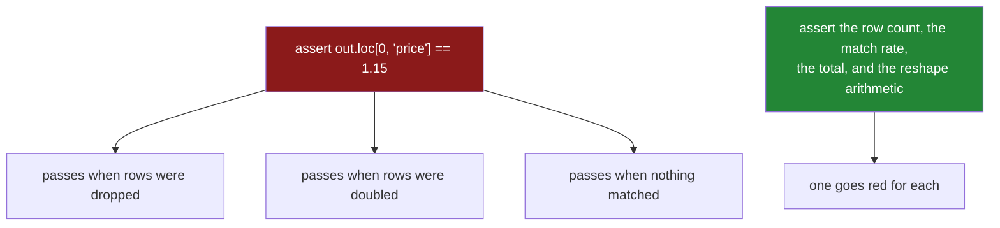

# 6.2 — `tests/test_joining.py`: the test that can go red

## One-line answer

A join test has to assert on the **row count**, the **match rate** and a **total** — because a join
that lost half the rows, a join that matched nothing, and a join that doubled everything all produce
well-formed tables, and a test that checks one value passes on all three.

---

## The story

Somebody writes a test for the join. It says: join the orders to the prices, and check that the milk
row has a price of £1.15.

It passes. It would also pass if the join had dropped every row whose product was missing from the
lookup, because milk was not one of them. It would pass if the lookup had two milk prices and the row
count had doubled, because the first milk row still says `1.15`. It would pass if the join had matched
nothing at all under a left join, as long as `1.15` came from somewhere.

Three of the day's failures, all surviving a test that checks a real number in a real column.

The test is not wrong. It is checking one cell, and every failure on this day is about *how many rows
there are* rather than about what any one of them says.

---

## The idea in plain language

Principle 7 says every lab ends with a test that **can go RED**. The trick, as on the two days before
this one, is to ask for each promise: *what would still be true if this were broken?*

Applied to joining and reshaping:

| the promise | the useless assertion | the assertion that can go red |
|---|---|---|
| no row was lost or gained | `assert out.loc[0, "price"] == 1.15` | `assert len(out) == len(detail)` |
| the lookup is unique | *(nothing — a duplicate still gives a valid frame)* | `pytest.raises(MergeError)` with `validate=` |
| the keys actually matched | *(nothing — a left join's count does not move)* | `assert (out["_merge"] == "both").all()` |
| the totals were not inflated | `assert out["paid"].notna().all()` | `assert out["paid"].sum() == detail["paid"].sum()` |
| a melt kept every measurement | `assert "month" in long.columns` | `assert len(long) == len(wide) * len(MONTHS)` |
| a pivot is a real inverse | `assert grid.shape == (3, 3)` | round-trip through `melt` and compare sorted values |

Four of those deserve a note.

**The row-count assertion is the cheapest and catches the most.** A left join against a unique lookup
must not change the row count, and a duplicated lookup key breaks that immediately
([3.2](../03-the-row-count/3.2-the-duplicate-that-multiplied-rows.md)).

**The match-rate assertion is the one nobody writes**, and it is the only defence against the failure
in [3.4](../03-the-row-count/3.4-the-join-that-dropped-forty-per-cent.md) — a left join where nothing
matched keeps every row, so no count and no shape check can see it.

**The total assertion is the one that makes the bug legible.** A row count moving is suspicious; a
revenue figure moving is a wrong answer, and asserting on it is what turns a shape test into a
correctness test.

**The reshape assertions are arithmetic.** A melt produces `rows × value_vars` rows, exactly; a pivot
produces `index cardinality × columns cardinality` cells, exactly. Both are computable from the input,
so both can be asserted rather than eyeballed.

One more thing about fixtures, and it is the same lesson Day 29 and Day 31 both found in their own
suites. **The fixtures have to be awkward.** A `detail` fixture and a `lookup` fixture with identical,
unique keys pass every one of the day's bugs, because there is nothing to lose, nothing to duplicate
and nothing to miss. This file needs three fixtures — a matching pair, a pair with a duplicate on the
right, and a pair with a key that is absent — and a test asserting that each one has the property it
is for.

---

## Why Setu needs it

- **[6.1](6.1-the-joining-module.md)** made the promises. This is where they stop depending on
  whoever wrote them remembering.
- **[3.4](../03-the-row-count/3.4-the-join-that-dropped-forty-per-cent.md)** described a failure with
  no error text and no row-count change. The match-rate assertion is the only mechanical defence.
- **[5.2](../05-long-to-wide/5.2-the-duplicate-that-makes-pivot-raise.md)** argued that `pivot`'s
  refusal is information; the test asserts that the module refuses too.
- **Day 45** is the Phase 4 gate, which needs a green suite over the joined dataset — and a suite
  whose tests have each been watched to fail once.
- **Day 235** runs this in CI on every push, where a test that cannot fail costs the same as one that
  can and buys nothing.

---

## The mechanism

Three fixtures, each awkward in one specific way:

```python
"""Tests for setu.joining — every assertion here has been watched to fail."""

from __future__ import annotations

import pandas as pd
import pytest

from setu.joining import JoinError, join, to_grid, to_long


@pytest.fixture
def detail() -> pd.DataFrame:
    """Two orders, two distinct items, and money to check the totals against."""
    return pd.DataFrame(
        {
            "order": [1, 2],
            "item": pd.Series(["milk", "bread"], dtype="str"),
            "paid": [2.30, 1.40],
        }
    )


@pytest.fixture
def clean_lookup() -> pd.DataFrame:
    """One row per item. The happy case."""
    return pd.DataFrame({"item": pd.Series(["milk", "bread"], dtype="str"), "price": [1.15, 1.40]})


@pytest.fixture
def duplicated_lookup() -> pd.DataFrame:
    """Two prices for milk — the shape that multiplies rows."""
    return pd.DataFrame(
        {"item": pd.Series(["milk", "milk", "bread"], dtype="str"), "price": [1.15, 1.20, 1.40]}
    )


@pytest.fixture
def mismatched_lookup() -> pd.DataFrame:
    """Keys that will not match — capitalised, as a real export would be."""
    return pd.DataFrame({"item": pd.Series(["MILK", "BREAD"], dtype="str"), "price": [1.15, 1.40]})


def test_the_fixtures_are_awkward_enough(
    detail: pd.DataFrame,
    clean_lookup: pd.DataFrame,
    duplicated_lookup: pd.DataFrame,
    mismatched_lookup: pd.DataFrame,
) -> None:
    """If this fails, every other test in the file has become weaker."""
    assert not clean_lookup.duplicated("item").any()
    assert duplicated_lookup.duplicated("item").any()
    assert not set(detail["item"]) & set(mismatched_lookup["item"])
```

**Line by line:**

- Four fixtures, three of them named for the property that makes them useful. A reader knows why
  `duplicated_lookup` looks like that without having to work it out.
- `detail` carries a **money column**, because the total assertions need one and adding it later means
  editing every fixture.
- `test_the_fixtures_are_awkward_enough` is a test **about the fixtures**, and it is the most important
  one in the file: it fails the day somebody "tidies" a fixture, which is exactly the change that
  silently weakens every other assertion. Day 29 and Day 31 both found this the hard way
  ([Day 31, 6.2](../../../day-31-groupby/parts/06-the-module/6.2-the-test-that-can-go-red.md)).
- `not set(...) & set(...)` asserts the mismatched fixture really does share no keys — an empty
  intersection. Without it, somebody correcting the capitalisation would make the match-rate test pass
  for the wrong reason.

The three assertions that carry the day:

```python
def test_a_left_join_against_a_unique_lookup_keeps_the_row_count(
    detail: pd.DataFrame, clean_lookup: pd.DataFrame
) -> None:
    out = join(detail, clean_lookup, on=["item"], relationship="many_to_one", weight="paid")

    assert len(out) == len(detail)
    assert out["paid"].sum() == pytest.approx(detail["paid"].sum())


def test_a_duplicated_lookup_is_refused(
    detail: pd.DataFrame, duplicated_lookup: pd.DataFrame
) -> None:
    assert duplicated_lookup.duplicated("item").any(), "the fixture must have a duplicate"
    with pytest.raises(pd.errors.MergeError, match=r"not a many-to-one merge"):
        join(detail, duplicated_lookup, on=["item"], relationship="many_to_one")


def test_a_join_that_matches_nothing_is_refused(
    detail: pd.DataFrame, mismatched_lookup: pd.DataFrame
) -> None:
    with pytest.raises(JoinError, match=r"unmatched"):
        join(detail, mismatched_lookup, on=["item"], relationship="many_to_one", weight="paid")
```

**Line by line:**

- The first test asserts **both** the row count and the total. The count catches a multiplication; the
  total catches it too and says what it cost, which is what makes a failure legible to somebody who
  did not write the test.
- `pytest.approx` on the total, because summing the same floats in a different order does not give
  bit-identical results
  ([Day 23, 2.6](../../../day-23-ufuncs-and-statistics/parts/02-statistics/2.6-float-summation-and-the-drift.md)).
  A bare `==` here passes today and fails eventually.
- `assert duplicated_lookup.duplicated(...)` **inside** the second test, before the `raises` block.
  Without it the test passes whether or not the fixture has a duplicate — the same vacuity trap as
  Day 31's fixture assertion.
- `pytest.raises(..., match=...)` checks the **message**, not only the type
  ([Day 18, 4.4](../../../day-18-exceptions/parts/04-in-anger/4.4-pytest-raises.md)). Without `match`,
  a `MergeError` raised for a completely different reason satisfies the test.
- The `match` patterns are **fragments** — `"not a many-to-one merge"`, `"unmatched"` — so rewording
  an error for clarity does not break the test while changing its meaning would.
- The third test is the one nobody writes. It uses the mismatched fixture, and it goes red the moment
  somebody removes `indicator=True` or the threshold from `join`
  ([3.4](../03-the-row-count/3.4-the-join-that-dropped-forty-per-cent.md)). **No other test in the file
  would notice**, because the row count is unchanged and every value is a valid blank.

The reshape assertions, which are arithmetic:

```python
MONTHS = ["jan", "feb", "mar"]


@pytest.fixture
def wide() -> pd.DataFrame:
    return pd.DataFrame(
        {
            "item": pd.Series(["milk", "bread"], dtype="str"),
            "jan": [1.15, 1.40],
            "feb": [1.15, 1.45],
            "mar": [1.20, 1.45],
        }
    )


def test_melt_produces_one_row_per_cell(wide: pd.DataFrame) -> None:
    long = to_long(wide, ["item"], MONTHS, "month", "price", var_order=MONTHS)

    assert len(long) == len(wide) * len(MONTHS)
    assert long["price"].dtype == "float64"
    assert list(long["month"].cat.categories) == MONTHS


def test_an_unaccounted_column_is_refused(wide: pd.DataFrame) -> None:
    with_extra = wide.assign(loaded_at=pd.Series(["mon", "mon"], dtype="str"))
    with pytest.raises(Exception, match=r"neither id_vars nor value_vars"):
        to_long(with_extra, ["item"], MONTHS, "month", "price")


def test_pivot_round_trips(wide: pd.DataFrame) -> None:
    long = to_long(wide, ["item"], MONTHS, "month", "price")
    grid = to_grid(long, ["item"], "month", "price", column_order=MONTHS)

    assert grid.shape == (len(wide), len(MONTHS))
    assert list(grid.columns) == MONTHS
    assert sorted(grid.to_numpy().ravel().round(3)) == sorted(long["price"].round(3))
```

**Line by line:**

- `len(long) == len(wide) * len(MONTHS)` is the melt's arithmetic, computed from the inputs rather than
  hard-coded — so the assertion still means something when the fixture gains a row.
- `long["price"].dtype == "float64"` is the assertion that goes red when a text column is swept into
  the melt ([4.1](../04-wide-to-long/4.1-melt-one-row-per-measurement.md)). A dtype check is a shape
  check, and it is the cheapest one on the page.
- `list(long["month"].cat.categories) == MONTHS` proves the retyping happened. Without it, `var_order`
  could be silently ignored and every chart would still be alphabetical
  ([4.2](../04-wide-to-long/4.2-id-vars-value-vars-and-the-names-you-choose.md)).
- `test_an_unaccounted_column_is_refused` adds a column and expects a refusal — the failure from
  [4.1](../04-wide-to-long/4.1-melt-one-row-per-measurement.md), turned into a test that fails if the
  guard is removed.
- The round-trip test compares **sorted values**, because the row order differs between the two paths
  and the values do not; comparing the frames with `equals` would report `False` for a reason that
  does not matter ([5.1](../05-long-to-wide/5.1-pivot-one-row-per-thing.md)).
- `list(grid.columns) == MONTHS` asserts the column **order**, which `column_order` exists to control
  and which alphabetical sorting would otherwise decide.



---

## When it breaks

**The mutation that only one test catches:**

```text
$ uv run pytest tests/test_joining.py -q
```

Remove `indicator=True` and the unmatched-share check from `join` and run it again. **One test goes
red** — `test_a_join_that_matches_nothing_is_refused` — and every other test passes, because every
other test uses a lookup whose keys match. Put it back, then remove `validate=relationship` instead:
a different single test goes red. That is the exercise, and it is a minute per guard.

**The float total that fails for no reason:**

```text
$ uv run python -c "
import pandas as pd
detail = pd.DataFrame({'item': ['a', 'b', 'c'], 'paid': [0.1, 0.2, 0.3]})
lookup = pd.DataFrame({'item': ['a', 'b', 'c'], 'price': [1.0, 1.0, 1.0]})
out = detail.merge(lookup, on='item', how='left')
print('before:', repr(detail['paid'].sum()))
print('after :', repr(out['paid'].sum()))
print('equal :', detail['paid'].sum() == out['paid'].sum())
"
```

```text
before: np.float64(0.6000000000000001)
after : np.float64(0.6000000000000001)
equal : True
```

**What it means.** Here they agree, and the agreement is luck: the same three numbers were added in the
same order on both sides. Change the join so the rows come back in a different order — an outer join
sorts ([2.2](../02-merging/2.2-the-four-hows-on-four-rows.md)) — and floating-point addition is not
associative, so the two totals can differ in the last bit while being the same money. **A total
assertion written with `==` will eventually fail on correct code.** `pytest.approx` is the fix, and
note that neither value is exactly `0.6` to begin with.

**The test that passes because the fixture is too tidy:**

```text
$ uv run python -c "
import pandas as pd
detail = pd.DataFrame({'item': ['milk', 'bread'], 'paid': [2.30, 1.40]})
tidy   = pd.DataFrame({'item': ['milk', 'bread'], 'price': [1.15, 1.40]})
messy  = pd.DataFrame({'item': ['milk', 'milk', 'bread'], 'price': [1.15, 1.20, 1.40]})
for name, lookup in [('tidy', tidy), ('messy', messy)]:
    out = detail.merge(lookup, on='item', how='left')
    print(f'{name:6} rows {len(detail)} -> {len(out)}  revenue {detail[\"paid\"].sum():.2f} -> {out[\"paid\"].sum():.2f}')
"
```

```text
tidy   rows 2 -> 2  revenue 3.70 -> 3.70
messy  rows 2 -> 3  revenue 3.70 -> 6.00
```

**What it means.** The same assertions — row count unchanged, revenue unchanged — pass on the tidy
fixture and fail on the messy one. **On the tidy fixture they pass whether or not the module has any
guard at all**, because there is nothing to duplicate and nothing to miss: the test is green and is
testing nothing. The fixture is part of the test, which is why
`test_the_fixtures_are_awkward_enough` exists — so that this property cannot be removed by
accident.

---

## In production

**What a professional adds to a test file like this.** Three things.

**A property test for the invariants that hold on any input.** For joining there are two worth having:
*a left join against a lookup with unique keys never changes the row count*, and *the sum of any left
frame column is unchanged by such a join*. Hypothesis generates detail and lookup frames with random
overlaps — including the empty frame, the all-matching frame and the no-matching frame — and checks
both. The edge cases it finds are the ones nobody writes a fixture for, and the empty-frame case in
particular has produced a real division-by-zero in every version of this module's match-rate check.

**A test that pins the thresholds.** `MAX_UNMATCHED` is a policy decision
([6.1](6.1-the-joining-module.md)), so `assert MAX_UNMATCHED == 0.01` turns a one-line change into a
deliberate two-file diff. It looks like a test that asserts the code is the code, and what it actually
asserts is that somebody noticed.

**A test with a real fixture file.** Everything above uses frames built in Python, which are clean by
construction. A pair of small CSVs committed under `tests/fixtures/` — with a leading-zero product
code, a trailing space in one key, and a capitalised key — exercises the path the data actually takes,
including the loader, and it is where the dtype mismatch from
[2.1](../02-merging/2.1-the-key-and-the-rows-it-pairs.md) gets caught.

**What changes at scale.** These tests run in milliseconds and should stay that way; the temptation to
test a join on a million rows should be resisted, because a slow suite is a suite people stop running.
What matters is coverage of **shapes**: the empty detail frame, the empty lookup, a lookup that is a
superset, a lookup that is a subset, a duplicated key on the left only, a duplicated key on both. Each
of those has produced a real bug on this day and each costs one small fixture. The one thing worth
testing at size is the **guard's own cost** — `validate` adds a uniqueness pass, and knowing it is
negligible is what stops somebody removing it "for performance"
([3.3](../03-the-row-count/3.3-validate-and-the-merge-error.md)).

**The failure mode that only appears with real data.** The suite is green and the pipeline is wrong,
because every fixture uses a `str` key and production uses one read from a CSV as `int64` on one side
and `str` on the other — which raises
([2.1](../02-merging/2.1-the-key-and-the-rows-it-pairs.md)) — or worse, as `int64` on both sides with
leading zeros lost, which matches the wrong things silently. No test in this file exercises the
loader, so no test in this file can catch it. That is what the fixture-file test is for.

**The review comment a senior engineer leaves.** *"`test_join_prices` asserts one price and nothing
else. It passes if the join drops rows, doubles rows, or matches nothing. Please assert the row count
and the revenue total, and add a fixture with a duplicated lookup key — that is the bug we actually
had in March."*

**The interview question.** *"How do you test a join?"* By asserting the properties a wrong join would
still satisfy: the row count against the left frame's, the match rate from an indicator column, and a
total from a left-frame column — rather than checking one cell, which every one of the common failures
leaves untouched. The follow-up worth being ready for: *"why the total as well as the count?"* Because
the count tells you something happened and the total tells you what it cost, and a revenue figure
moving is what makes the bug legible to somebody who did not write the test.

---

## Check yourself

```bash
uv run pytest tests/test_joining.py -q
```

Then break one thing on purpose — remove `validate=relationship` from `join` — and run it again. Say
which test goes red, and say how many of the others stay green even though a duplicated lookup now
doubles the revenue.

**Answer out loud, without scrolling up:**

> Say why asserting one cell's value is a weak test for a join, and name two bugs it would pass. Then
> describe the test that catches a join where nothing matched, and say why the row count cannot catch
> it.

---

**Back to the hub:** [`LESSON.md`](../../LESSON.md).
