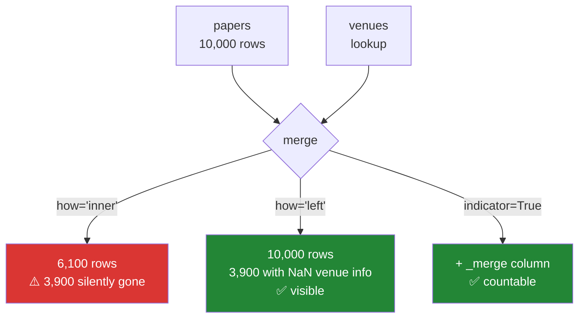

# Day 32 — Merge, join, concat, pivot, melt

**Phase 4 · Module 4** · IDs: **PD-09** (merge, join, concat), **PD-10** (pivot, melt, stack)

> **Yesterday:** `groupby`, and the group statistic that leaks.
> **Today:** combining frames — and the failure that has silently deleted more data than any other
> operation in this library: **an inner join that dropped 40% of your rows and told you nothing.**
> **Tomorrow:** the `.str` and `.dt` accessors.

```bash
./m start 32 && ./m scaffold 32
```

**Time:** 110 minutes. **Request budget:** 0 model calls.

---

## §1 The story

You have 10 000 papers and a lookup table of venue metadata. You merge them. You get 6 100 rows back
and carry on, because 6 100 rows still looks like a lot of data.

The 3 900 that vanished had venue names with different capitalisation. Nothing warned you. `merge`
did exactly what an inner join means: keep only what matches.



So the rule for this project, and it costs nothing:

> **Every merge records its row count before and after, and every merge passes
> `validate=` and `indicator=True` until you have proven the relationship.**

`validate="many_to_one"` makes pandas *raise* if the right-hand key is not unique — which catches the
other silent disaster: a **row explosion**. Merge 10 000 papers against a venue table with a duplicated
key and you get 14 000 rows, every duplicate silently multiplied. Sums are now wrong. Means are now
wrong. And 14 000 still looks like a lot of data.

The second half is **reshaping** — wide to long and back. It sounds cosmetic and is not: nearly every
plotting function on Day 38 and every model on Day 92 wants **long/tidy** data (one observation per
row), while humans and spreadsheets want **wide**. `melt` and `pivot` are the two directions, and they
are exact inverses when you set them up correctly.

---

## §2 Setup — run this

```bash
mkdir -p days/day-32/lab
touch days/day-32/lab/combining.py
```

`src/setu/frames.py` grows today. No new packages.

---

## §3 PD-09 — combining

`days/day-32/lab/combining.py`:

```python
"""PD-09 / PD-10: joining frames without losing rows, and reshaping between layouts."""

from __future__ import annotations

import numpy as np
import pandas as pd


def papers() -> pd.DataFrame:
    return pd.DataFrame({
        "paper_id": ["p1", "p2", "p3", "p4"],
        "venue": ["acl", "icml", "ACL", "unknown"],
        "cites": [100, 50, 200, 10],
    })


def venues() -> pd.DataFrame:
    return pd.DataFrame({
        "venue": ["acl", "icml", "neurips"],
        "field": ["NLP", "ML", "ML"],
    })


def the_silent_loss() -> None:
    left, right = papers(), venues()
    inner = left.merge(right, on="venue", how="inner")
    print(f"\n{len(left)=} -> {len(inner)=}   <- 2 rows gone. No warning.")
    print(f"{inner['paper_id'].tolist()=}")
    print("  'ACL' != 'acl' and 'unknown' has no row. Both vanish silently.")

    outer = left.merge(right, on="venue", how="left", indicator=True)
    print(f"\n{outer['_merge'].value_counts().to_dict()=}")
    print(f"{outer.loc[outer['_merge'] == 'left_only', 'paper_id'].tolist()=}")
    print("  ^ indicator=True turns the loss into a countable column.")


def the_row_explosion() -> None:
    left = papers()
    duplicated = pd.concat([venues(), venues().iloc[[0]]], ignore_index=True)
    print(f"\n{duplicated['venue'].tolist()=}   <- 'acl' appears twice")

    exploded = left.merge(duplicated, on="venue", how="left")
    print(f"{len(left)=} -> {len(exploded)=}   <- MORE rows than we started with")
    print(f"{exploded['cites'].sum()=} vs {left['cites'].sum()=}   <- the sum is now wrong")

    try:
        left.merge(duplicated, on="venue", how="left", validate="many_to_one")
    except Exception as exc:
        print(f"\n  validate='many_to_one' -> {type(exc).__name__}: {exc}")
    print("  ^ this is why every merge in src/setu/ passes validate=.")


def join_types() -> None:
    left, right = papers(), venues()
    for how in ("inner", "left", "right", "outer"):
        merged = left.merge(right, on="venue", how=how)
        print(f"  how={how!r:<8} -> {len(merged)} rows")
    print("\n  left  : keep every left row (the default you usually want)")
    print("  inner : keep only matches (the default pandas gives you)")
    print("  outer : keep everything from both sides")


def keys_and_suffixes() -> None:
    left = pd.DataFrame({"pid": ["p1"], "n": [1]})
    right = pd.DataFrame({"paper_id": ["p1"], "n": [99]})

    merged = left.merge(right, left_on="pid", right_on="paper_id", how="left")
    print(f"\n{merged.columns.tolist()=}   <- differently-named keys")
    print(f"{merged.filter(like='n_').to_dict('records')=}   <- clashing columns get _x/_y")

    named = left.merge(right, left_on="pid", right_on="paper_id",
                       how="left", suffixes=("_left", "_right"))
    print(f"{named.columns.tolist()=}   <- always name your suffixes")


def dtype_mismatches_match_nothing() -> None:
    left = pd.DataFrame({"k": [1, 2], "a": ["x", "y"]})
    right = pd.DataFrame({"k": ["1", "2"], "b": ["p", "q"]})
    print(f"\n{left['k'].dtype=} {right['k'].dtype=}")
    merged = left.merge(right, on="k", how="left")
    print(f"{merged['b'].isna().sum()=}   <- everything is NaN: int never equals str")
    print("  ^ Day 27's dtype declaration, and why it matters two weeks later.")


def concat_versus_merge() -> None:
    a = pd.DataFrame({"x": [1, 2]}, index=["r1", "r2"])
    b = pd.DataFrame({"x": [3]}, index=["r3"])
    print(f"\n{pd.concat([a, b]).index.tolist()=}   <- stack ROWS")
    print(f"{pd.concat([a, b], ignore_index=True).index.tolist()=}")

    c = pd.DataFrame({"y": [9, 8]}, index=["r1", "r2"])
    print(f"{pd.concat([a, c], axis=1).columns.tolist()=}   <- stack COLUMNS, aligning on index")

    d = pd.DataFrame({"y": [9]}, index=["r9"])
    print(f"\n{pd.concat([a, d], axis=1).isna().sum().sum()=}   <- non-matching index -> NaN")
    print("  ^ concat(axis=1) aligns by index (Day 28). merge aligns by KEY COLUMN.")

    e = pd.DataFrame({"x": [5], "z": [1]})
    print(f"\n{pd.concat([a, e]).columns.tolist()=}   <- mismatched columns are unioned")
    print(f"{pd.concat([a, e]).isna().sum().sum()=}   <- with NaN filled in. Check this.")
```

**Line by line:**

- `the_silent_loss` — 4 rows in, 2 out. Two causes in one example: a **case mismatch** (`ACL` vs `acl`)
  and a **genuine non-match** (`unknown`). Real data has both, constantly.
- `indicator=True` — adds a `_merge` column with values `both`, `left_only`, `right_only`. One
  `value_counts()` on it turns an invisible loss into a number you can put in a decision record.
  **Merge with `how="left"` and an indicator first; switch to `inner` only once you know what you are
  dropping and why.**
- `the_row_explosion` — the mirror-image disaster. A duplicated right key multiplies the left rows,
  and `left.merge(...)` comes back **larger**. The `cites` sum is now inflated, and every aggregate
  downstream is wrong. This is worse than the silent loss, because more data looks like success.
- `validate="many_to_one"` — pandas checks the relationship and **raises** if it does not hold. The
  options are `one_to_one`, `one_to_many`, `many_to_one`, `many_to_many`. Passing it costs one keyword
  and turns a silent corruption into an exception at the line that caused it.
- Join types — `how="inner"` is pandas' **default**, and it is the dangerous one. `how="left"` is
  almost always what you actually mean: keep my rows, add what you can.
- `suffixes=("_left", "_right")` — when both frames have a column of the same name, pandas appends
  `_x` and `_y`. Six months later nobody knows which was which. **Always name them.**
- `dtype_mismatches_match_nothing` — an `int64` key and a `str` key match **nothing**, and the result
  is all NaN with no error. This is Day 27's "declare your dtypes" bill arriving two weeks late.
- `pd.concat([a, b])` stacks rows; `axis=1` stacks columns and **aligns on the index** (Day 28), so
  non-matching labels give NaN. `merge` aligns on a **key column**. Choosing the wrong one is a common
  confusion: if the frames share an index, `concat(axis=1)`; if they share a column, `merge`.
- `pd.concat` with mismatched columns unions them and fills NaN. **Check `isna().sum().sum()` after
  every concat** — a typo'd column name in one of ten files produces a half-empty column instead of an
  error.

---

## §4 PD-10 — reshaping

Add to the same file:

```python
def wide_and_long() -> None:
    wide = pd.DataFrame({
        "venue": ["acl", "icml"],
        "y2019": [100, 50],
        "y2020": [150, 80],
        "y2021": [200, 120],
    })
    print(f"\nwide:\n{wide.to_string(index=False)}")

    long = wide.melt(id_vars="venue", var_name="year", value_name="cites")
    print(f"\nlong ({len(long)} rows):\n{long.to_string(index=False)}")
    print("  ^ melt: one OBSERVATION per row. This is 'tidy'.")

    back = long.pivot(index="venue", columns="year", values="cites").reset_index()
    back.columns.name = None
    print(f"\nback to wide:\n{back.to_string(index=False)}")
    print(f"{back.equals(wide)=}   <- exact inverse")


def pivot_versus_pivot_table() -> None:
    long = pd.DataFrame({
        "venue": ["acl", "acl", "icml"],
        "year": ["y2019", "y2019", "y2020"],
        "cites": [100, 300, 50],
    })
    try:
        long.pivot(index="venue", columns="year", values="cites")
    except ValueError as exc:
        print(f"\n  pivot with duplicates -> {exc}")

    table = long.pivot_table(index="venue", columns="year", values="cites", aggfunc="mean")
    print(f"\n{table.to_dict()=}")
    print("  ^ pivot REFUSES duplicates; pivot_table AGGREGATES them.")
    print("    pivot raising is a feature: duplicates usually mean a key you forgot.")

    counted = long.pivot_table(index="venue", columns="year", values="cites",
                               aggfunc="count", fill_value=0)
    print(f"{counted.to_dict()=}   <- fill_value for the empty cells")


def crosstab_and_stack() -> None:
    df = pd.DataFrame({
        "venue": ["acl", "acl", "icml", "icml"],
        "tier": ["high", "low", "high", "high"],
    })
    print(f"\n{pd.crosstab(df['venue'], df['tier']).to_dict()=}")
    print(f"{pd.crosstab(df['venue'], df['tier'], normalize='index').round(2).to_dict()=}")
    print("  ^ crosstab is pivot_table for counts. Day 73's chi-square test starts here.")

    wide = pd.DataFrame({"a": [1, 2], "b": [3, 4]}, index=["r1", "r2"])
    stacked = wide.stack()
    print(f"\n{stacked.to_dict()=}   <- a Series with a MultiIndex")
    print(f"{stacked.unstack().equals(wide)=}   <- and back")


def why_long_wins() -> None:
    print("\n  Long/tidy data is what these want:")
    for consumer in (
        "seaborn: hue=, col=, style= all take a COLUMN name (Day 38)",
        "groupby: one grouping key per column (Day 31)",
        "scikit-learn: one row per observation (Day 92)",
        "databases: normalised tables (Day 42)",
    ):
        print(f"    - {consumer}")
    print("\n  Wide is for humans and spreadsheets. Reshape at the boundary, not in between.")


if __name__ == "__main__":
    the_silent_loss()
    the_row_explosion()
    join_types()
    keys_and_suffixes()
    dtype_mismatches_match_nothing()
    concat_versus_merge()
    wide_and_long()
    pivot_versus_pivot_table()
    crosstab_and_stack()
    why_long_wins()
```

**Line by line:**

- `wide.melt(id_vars="venue", var_name="year", value_name="cites")` — **wide to long.** `id_vars` are
  the columns that stay as identifiers; everything else becomes two columns, one holding the old
  column *name* and one holding the *value*. Six cells become six rows.
- `long.pivot(index=, columns=, values=)` — **long to wide**, the exact inverse. `back.equals(wide)` is
  `True`, which is the property worth knowing: these round-trip.
- `back.columns.name = None` — `pivot` leaves the columns index named after the `columns` argument.
  Cosmetic, but it is why a round-trip comparison fails if you forget it.
- `pivot` with duplicate index/column pairs **raises** — and that is correct behaviour. Duplicates mean
  either your data has a key you have not accounted for, or you wanted an aggregate. Pandas refuses to
  guess.
- `pivot_table(..., aggfunc="mean")` — the aggregating version. Use it deliberately, not as a way to
  make the error go away.
- `fill_value=0` — empty cells become 0 rather than NaN. Right for counts, **wrong for measurements**:
  a venue with no papers in 2020 had zero papers, but its mean citation count is unknown, not zero.
- `pd.crosstab` — a frequency table, and `normalize='index'` gives row proportions. This is where
  Day 73's chi-square test of independence begins; you are building its input three phases early.
- `stack()` / `unstack()` — move a column level into the index and back. The result of `stack` is a
  Series with a MultiIndex, which is powerful and awkward in equal measure.

---

## §5 Build brief

Extend `src/setu/frames.py`:

```python
def safe_merge(left, right, *, on=None, left_on=None, right_on=None,
               how: str = "left", validate: str, suffixes=("_left", "_right")):
    """TODO(me): merge with the row-count accounting made mandatory.

    - `validate` is REQUIRED (no default) - the caller must state the relationship
    - always pass indicator=True internally
    - return (merged_without_indicator, report) where report is a dict:
      {'n_left','n_right','n_out','n_both','n_left_only','n_right_only','pct_matched'}
    - raise DataError if the key dtypes differ on the two sides (they would match nothing)
    - raise DataError if how='left' and n_out > n_left (a row explosion slipped through)
    """
    raise NotImplementedError


def assert_merge_kept_everything(report: dict, *, max_unmatched_pct: float = 0.0) -> None:
    """TODO(me): raise DataError if more than max_unmatched_pct of left rows failed to match.

    The message must give the count AND the percentage. Default 0.0 means
    "I expect a perfect match" - the caller must opt in to losing rows.
    """
    raise NotImplementedError


def to_long(frame, *, id_vars: list[str], var_name: str, value_name: str) -> pd.DataFrame:
    """TODO(me): melt, with validation.

    - raise DataError if any id_var is missing
    - raise DataError if there are no value columns left after removing id_vars
    - drop rows where the value is missing? NO - keep them; that is data. Document why.
    """
    raise NotImplementedError


def to_wide(frame, *, index: str, columns: str, values: str) -> pd.DataFrame:
    """TODO(me): pivot, with a readable error on duplicates.

    - catch pandas' duplicate-entry ValueError and re-raise as DataError naming
      HOW MANY duplicate (index, columns) pairs there were and showing up to 3
    - flatten the columns index name so the result round-trips with to_long
    """
    raise NotImplementedError
```

- `validate` having **no default** is the day's design decision: you cannot call `safe_merge` without
  stating what relationship you believe holds. A keyword you are forced to type is a keyword you think
  about.
- Returning `(merged, report)` rather than just the frame is the same move as Day 31's
  `(series, n_unseen)`: **make the thing you would otherwise ignore impossible to ignore.**
- `to_wide` improving the duplicate error matters because pandas' message tells you duplicates exist
  but not how many or which — and on a 200 000-row frame that is the difference between a two-minute
  fix and an hour.

---

## §6 The eval that must be able to fail

Add to `tests/test_frames.py`:

```python
from setu.frames import assert_merge_kept_everything, safe_merge, to_long, to_wide


@pytest.fixture
def left_frame() -> pd.DataFrame:
    return pd.DataFrame({"venue": ["acl", "icml", "ACL", "unknown"], "cites": [100, 50, 200, 10]})


@pytest.fixture
def right_frame() -> pd.DataFrame:
    return pd.DataFrame({"venue": ["acl", "icml", "neurips"], "field": ["NLP", "ML", "ML"]})


def test_merge_reports_the_row_accounting(left_frame, right_frame):
    _, report = safe_merge(left_frame, right_frame, on="venue", validate="many_to_one")
    assert report["n_left"] == 4
    assert report["n_both"] == 2
    assert report["n_left_only"] == 2
    assert report["pct_matched"] == pytest.approx(50.0)


def test_merge_keeps_every_left_row_by_default(left_frame, right_frame):
    merged, _ = safe_merge(left_frame, right_frame, on="venue", validate="many_to_one")
    assert len(merged) == 4, "how='left' must not drop rows"


def test_merge_strips_the_indicator_column(left_frame, right_frame):
    merged, _ = safe_merge(left_frame, right_frame, on="venue", validate="many_to_one")
    assert "_merge" not in merged.columns


def test_merge_raises_on_a_row_explosion(left_frame, right_frame):
    duplicated = pd.concat([right_frame, right_frame.iloc[[0]]], ignore_index=True)
    with pytest.raises(DataError):
        safe_merge(left_frame, duplicated, on="venue", validate="many_to_one")


def test_merge_rejects_mismatched_key_dtypes():
    left = pd.DataFrame({"k": [1, 2], "a": ["x", "y"]})
    right = pd.DataFrame({"k": ["1", "2"], "b": ["p", "q"]})
    with pytest.raises(DataError):
        safe_merge(left, right, on="k", validate="one_to_one")


def test_merge_requires_validate(left_frame, right_frame):
    with pytest.raises(TypeError):
        safe_merge(left_frame, right_frame, on="venue")  # type: ignore[call-arg]


def test_assert_kept_everything_passes_on_a_full_match():
    assert_merge_kept_everything({"n_left": 10, "n_left_only": 0, "pct_matched": 100.0})


def test_assert_kept_everything_fails_by_default():
    with pytest.raises(DataError) as info:
        assert_merge_kept_everything({"n_left": 10, "n_left_only": 3, "pct_matched": 70.0})
    message = str(info.value)
    assert "3" in message and "30" in message


def test_assert_kept_everything_allows_an_explicit_tolerance():
    assert_merge_kept_everything(
        {"n_left": 10, "n_left_only": 1, "pct_matched": 90.0}, max_unmatched_pct=10.0
    )


def test_long_wide_round_trip():
    wide = pd.DataFrame({"venue": ["acl", "icml"], "y2019": [100, 50], "y2020": [150, 80]})
    long = to_long(wide, id_vars=["venue"], var_name="year", value_name="cites")
    assert len(long) == 4
    back = to_wide(long, index="venue", columns="year", values="cites")
    assert back.reset_index().equals(wide) or set(back.columns) == {"y2019", "y2020"}


def test_long_keeps_missing_values():
    wide = pd.DataFrame({"v": ["a"], "y1": [np.nan], "y2": [1.0]})
    long = to_long(wide, id_vars=["v"], var_name="y", value_name="n")
    assert len(long) == 2, "a missing value is data; melt must not drop the row"


def test_long_rejects_a_missing_id_var():
    with pytest.raises(DataError):
        to_long(pd.DataFrame({"a": [1]}), id_vars=["nope"], var_name="v", value_name="n")


def test_long_rejects_having_no_value_columns():
    with pytest.raises(DataError):
        to_long(pd.DataFrame({"a": [1]}), id_vars=["a"], var_name="v", value_name="n")


def test_wide_reports_how_many_duplicates():
    long = pd.DataFrame({
        "v": ["a", "a", "b", "b"],
        "y": ["y1", "y1", "y2", "y2"],
        "n": [1, 2, 3, 4],
    })
    with pytest.raises(DataError) as info:
        to_wide(long, index="v", columns="y", values="n")
    assert "2" in str(info.value), "the error must say how many duplicate pairs there were"
```

**Line by line:**

- `test_merge_reports_the_row_accounting` — **the day's real assessment.** Four left rows, two matches.
  The report makes the 50% loss a number rather than something you would have to notice. An
  implementation returning only the merged frame cannot pass.
- `test_merge_requires_validate` expecting a **`TypeError`** — that is Python refusing the call because
  `validate` is a required keyword-only argument (Day 10's `*`). The test asserts the *signature*, not
  the body.
- `test_merge_raises_on_a_row_explosion` — the duplicated right key. `validate="many_to_one"` should
  catch it; the assertion is that your wrapper surfaces it as a `DataError` rather than letting
  pandas' `MergeError` escape.
- `test_merge_rejects_mismatched_key_dtypes` — the int-versus-string key. Pandas would happily return
  all-NaN; refusing is better, and the check is two lines.
- `test_assert_kept_everything_fails_by_default` — the default tolerance is **zero**. Losing rows must
  be an explicit, typed-out decision (`max_unmatched_pct=10.0`), which then appears in code review.
- `test_long_keeps_missing_values` — `melt` has no `dropna` behaviour you should add. A missing value
  in 2019 is the fact that 2019 has no measurement, and dropping it silently changes your denominators
  on Day 89.
- `test_wide_reports_how_many_duplicates` — two duplicate pairs. Pandas' own message does not tell you
  how many; yours must.

```bash
uv run python -m pytest tests/test_frames.py -v
```

---

## §7 Request budget

| Resource | Spent today |
|---|---|
| LLM calls | **0** |

---

## §8 Traps

- **`how="inner"` by default.** Pandas' default silently drops non-matches. Use `left` + indicator first.
- **No `validate=`.** A duplicated key on one side multiplies your rows and inflates every sum.
- **Mismatched key dtypes.** `1` never equals `"1"`. All NaN, no error.
- **Case and whitespace in string keys.** `"ACL"` != `"acl"`. Normalise before joining.
- **Default `_x` / `_y` suffixes.** Unreadable in six months. Name them.
- **`concat` with a typo'd column.** Unions the columns and fills NaN instead of raising.
- **`concat(axis=1)` when you meant `merge`.** One aligns on index, the other on a key column.
- **`pivot_table` used to silence `pivot`'s duplicate error.** The error was telling you something.
- **`fill_value=0` on measurements.** Missing is not zero.
- **Reshaping in the middle of a pipeline.** Convert at the boundary; keep the middle long.
- **Not recording the before/after row counts.** Principle 9: how many rows did that step cost?

---

## §9 Verify before you code

Written **2026-08-21**:

- <https://pandas.pydata.org/docs/user_guide/merging.html> — join types, `validate`, `indicator`.
- <https://pandas.pydata.org/docs/reference/api/pandas.DataFrame.merge.html> — the `validate` options.
- <https://pandas.pydata.org/docs/user_guide/reshaping.html> — `melt`, `pivot`, `pivot_table`, `stack`.
- <https://pandas.pydata.org/docs/reference/api/pandas.crosstab.html> — the `normalize` options.

---

## §10 Say it in an interview

> "Merges are where data disappears quietly. The default is an inner join, so non-matches vanish and
> six thousand rows still looks like a lot of data — I've seen forty percent lost to nothing more than
> capitalisation in a key. So my merge wrapper makes `validate=` a required keyword, always passes
> `indicator=True`, and returns a row-accounting report alongside the frame: how many matched, how many
> were left-only, what percentage. And there's an assertion whose default tolerance is zero, so losing
> rows has to be typed out explicitly and shows up in review. The mirror-image failure is worse: a
> duplicated key on the right multiplies your rows, and *more* data looks like success while every sum
> downstream is wrong."

---

## §11 Done when

Tick [`CHECKLIST.md`](CHECKLIST.md), then `./m check && ./m done 32`.
