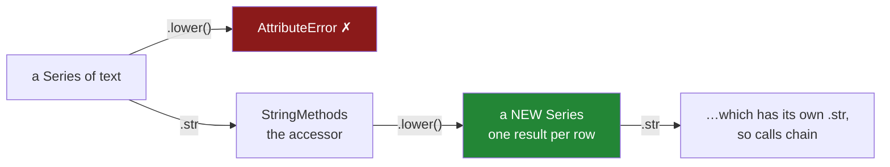

# 1.1 — The column that has no `.lower()`

## One-line answer

A column of text is not a piece of text, so it has none of the text methods; the methods live one
step away, behind `.str`, which runs the ordinary Python string method on every value and hands you
back a **new** column.

---

## The story

Four people share a flat, and they take turns doing the shopping. Whoever goes types what they
bought into the shared file on their phone, along with what it cost and when they paid.

One of them types `Milk`. One types `milk` and, because the phone keyboard puts a space after a
word, ends up with `milk ` — the space is there, it just does not show. One has caps lock on and
types `MILK`. One types `milk`.

At the end of the month somebody wants a simple answer: how much did we spend on milk? So they open
the file and ask for everything to be put in small letters first, because that would obviously fix
it.

And the thing they type — the thing anybody would type — does not work. It does not give a wrong
answer, and it does not quietly do nothing. It stops, and says the column does not have that.

Which is confusing, because every single value in the column plainly does.

---

## The idea in plain language

Here are the two things that are easy to mix up.

A **string** is one piece of text — the four characters `Milk`. Python gives a string a long list of
things it can do to itself. `"Milk".lower()` gives back `"milk"`; `"milk ".strip()` gives back
`"milk"`. Those are **string methods**, and they were the whole subject of
[Day 7, 2.1](../../../day-07-strings/parts/02-methods/2.1-normalising-strip-and-case.md).

A **column** is a different thing. It is a Series — a labelled sequence of values, introduced in
[Day 26, 1.1](../../../day-26-frames-and-copy-on-write/parts/01-the-two-objects/1.1-a-column-with-labels.md).
It holds eight strings. It is not itself a string, any more than a box of nails is a nail.

So when you ask a column to lower-case itself, the question does not quite make sense, and pandas
says so. The column has no `.lower()`. What you actually wanted was *"lower-case each of the values
inside"*, which is a different request and needs a different way of asking.

That way of asking is called an **accessor**. An accessor is a small doorway hanging off the column,
holding a set of methods that only make sense for one kind of data. You reach it by name. Text lives
behind `.str`. Timestamps live behind `.dt`, which is the second half of this day and starts at
[4.3](../04-the-dt-accessor/4.3-the-fields-inside-a-timestamp.md). Categories live behind `.cat`.

Once you are through the doorway, the method names are the ones you already know, because they are
deliberately the same: `.str.lower()`, `.str.strip()`, `.str.replace()`, `.str.split()`. The
accessor's job is to take the method you named and apply it to **every value, one at a time**, which
is what **elementwise** means. Eight values in, eight results out, in the same order, keeping the
same index labels.

Two properties of that follow, and both of them matter more than they look.

**It gives back a new column.** Nothing in the original changes. This is the same rule that governs
every pandas operation since Copy-on-Write became the only mode
([Day 26, 3.1](../../../day-26-frames-and-copy-on-write/parts/03-copy-on-write/3.1-every-result-behaves-like-a-copy.md)):
you get a result, and it is yours to keep or throw away. A line that calls `.str.lower()` and does
not assign the answer anywhere has done nothing at all.

**It can be chained.** Because the result is another text column, it has a `.str` of its own. So
`.str.strip().str.lower()` is two passes: trim every value, then lower-case every trimmed value.
That two-step is the whole fix for the flat's four spellings of milk, and it is
[2.1](../02-cleaning-names/2.1-four-spellings-of-milk.md).

One last piece of vocabulary, because it explains the error message. `.str` is not a method you
call — it is an attribute you read. `receipts["item"].str` on its own is an object that exists,
sitting there waiting for you to name a method on it. That is why the failure says *attribute*.

---

## Why Setu needs it

- **[1.2](1.2-the-blank-that-came-back-blank.md)** asks what happens when one of the values is not
  text at all, because a blank in a text column changes the answer's type.
- **[2.1](../02-cleaning-names/2.1-four-spellings-of-milk.md)** is the flat's actual bug, fixed with
  two chained accessor calls.
- **[2.4](../02-cleaning-names/2.4-the-mismatch-that-costs-rows.md)** shows what the four spellings
  cost when the receipts meet a price list — six of eight rows do not match.
- **Day 34** builds a data-quality report, and "how many distinct values does this text column have"
  is the first line of it. That number is wrong until the text has been normalised.
- **Day 111**'s text preprocessing for a model, and **Day 162**'s document chunker, both begin with
  exactly this operation on far more rows. The habit of doing it once, at the boundary, with a
  vectorised call rather than a loop, starts here.

---

## The mechanism

Here is the flat's file. Eight receipts, four items, four people typing.

```python
import pandas as pd

receipts = pd.DataFrame(
    {
        "item": ["Milk", "milk ", "MILK", "milk", "Bread", "bread ", "Eggs", "rice"],
        "paid_at": [
            "2026-03-01 08:12:30",
            "2026-03-04 19:40:05",
            "2026-03-08 11:05:00",
            "2026-03-11 18:22:47",
            "2026-03-02 09:31:12",
            "2026-03-09 17:58:40",
            "2026-03-05 12:04:19",
            "2026-03-10 20:11:03",
        ],
        "price": [1.15, 1.15, 1.20, 1.20, 1.40, 1.40, 2.30, 3.05],
    }
)
print(receipts)
print()
print(receipts.dtypes)
```

**Line by line:**

- `"item"` holds **four** real items typed **eight** ways. `"milk "` and `"bread "` carry a trailing
  space, which will not be visible in any printout — that is the entire problem, and it is why the
  bug survives a careful reading of the file.
- `"paid_at"` is written as text on purpose. It arrives from a file as text, and turning it into a
  real timestamp is a decision somebody has to make; that is [4.2](../04-the-dt-accessor/4.2-to-datetime-format-and-errors.md).
- `"price"` is the only column that arrives ready to compute with.
- `print(receipts.dtypes)` because the **dtype** — the one type every value in a column shares
  ([Day 26, 1.4](../../../day-26-frames-and-copy-on-write/parts/01-the-two-objects/1.4-one-dtype-per-column.md))
  — decides which accessor a column is allowed to use. Read it before doing anything else.

```text
     item              paid_at  price
0    Milk  2026-03-01 08:12:30   1.15
1   milk   2026-03-04 19:40:05   1.15
2    MILK  2026-03-08 11:05:00   1.20
3    milk  2026-03-11 18:22:47   1.20
4   Bread  2026-03-02 09:31:12   1.40
5  bread   2026-03-09 17:58:40   1.40
6    Eggs  2026-03-05 12:04:19   2.30
7    rice  2026-03-10 20:11:03   3.05

item           str
paid_at        str
price      float64
dtype: object
```

Two text columns and one number column. Note that `item` reports `str`, not `object` — that is the
dtype pandas 3.0 infers for text, and [1.3](1.3-the-dtype-under-the-text.md) is about what it buys.

Now the doorway itself.

```python
print(type(receipts["item"].str))
print()
print(receipts["item"].str.lower().tolist())
print()
print(receipts["item"].tolist())
```

**Line by line:**

- `receipts["item"].str` with no method after it is a complete expression. It evaluates to an
  object, and printing its type shows what kind: `StringMethods`. That object is the accessor.
- `.str.lower()` runs Python's own `str.lower` on each of the eight values. Same order, same
  labels, eight results.
- `.tolist()` is here so the printout is compact enough to compare on one line
  ([Day 26, 1.5](../../../day-26-frames-and-copy-on-write/parts/01-the-two-objects/1.5-reading-a-frame-before-you-touch-it.md)).
  It is a reading tool, not something to leave in a pipeline.
- The **third** print is the one that matters. It reads the original column *after* the lower-casing,
  and the original is untouched. `.str.lower()` returned a new column and threw nothing away.

```text
<class 'pandas.core.strings.accessor.StringMethods'>

['milk', 'milk ', 'milk', 'milk', 'bread', 'bread ', 'eggs', 'rice']

['Milk', 'milk ', 'MILK', 'milk', 'Bread', 'bread ', 'Eggs', 'rice']
```

**Look at the second line closely.** `Milk`, `MILK` and `milk` have all become `milk`, and there are
now three of them that are identical. But position 1 is still `'milk '` with its space, and it is
still a different value from `'milk'`. Lower-casing fixed three of the four spellings and left the
fourth exactly as broken as it was. That is [2.1](../02-cleaning-names/2.1-four-spellings-of-milk.md)'s
whole subject.

Four more accessor calls, to show the shape of the family:

```python
print(receipts["item"].str.len().tolist())
print(receipts["item"].str.upper().tolist())
print(receipts["item"].str[:4].tolist())
print(receipts["item"].str.strip().str.lower().tolist())
```

**Line by line:**

- `.str.len()` returns a **number** per value. An accessor method does not have to give back text;
  it gives back whatever the underlying string method gives back, one per row.
- `.str.upper()` is the mirror of `lower`, and it is worth running once to see that `'milk '` becomes
  `'MILK '` — the space survives every case change there is.
- `.str[:4]` is slicing, spelled through the accessor. `receipts["item"][:4]` would slice the
  **column** and give you the first four rows; `receipts["item"].str[:4]` slices each **value** and
  gives you eight shortened strings. One `.str` is the difference between two completely different
  operations, and this is the single most confusable line on the page.
- The last line **chains**: `.str.strip()` returns a text column, so it has a `.str` of its own to
  call `.lower()` on. Read left to right — trim, then lower-case.

```text
[4, 5, 4, 4, 5, 6, 4, 4]
['MILK', 'MILK ', 'MILK', 'MILK', 'BREAD', 'BREAD ', 'EGGS', 'RICE']
['Milk', 'milk', 'MILK', 'milk', 'Brea', 'brea', 'Eggs', 'rice']
['milk', 'milk', 'milk', 'milk', 'bread', 'bread', 'eggs', 'rice']
```

**The first line is the invisible bug made visible.** Row 0 is 4 characters and row 1 is 5, for two
values that print identically once you ignore case. `.str.len()` is the cheapest way to prove a
trailing space exists, and it is worth reaching for the moment two values *look* the same and do not
*behave* the same.

The last line is the whole of section 2 in one expression: four spellings collapsed to `milk`, twice.

Where the methods live:



---

## When it breaks

**The method that is not there:**

```text
$ uv run python -c "
import pandas as pd
item = pd.Series(['Milk', 'milk ', 'MILK', 'milk'], name='item')
item.lower()
"
Traceback (most recent call last):
  File "<string>", line 4, in <module>
  File "...\pandas\core\generic.py", line 6194, in __getattr__
    return object.__getattribute__(self, name)
           ^^^^^^^^^^^^^^^^^^^^^^^^^^^^^^^^^^^
AttributeError: 'Series' object has no attribute 'lower'
```

**What it means.** Exactly what it says: the Series has no `lower`. It is not a warning about types
or about text; it is Python failing to find a name. The fix is one word — put `.str` in front:
`item.str.lower()`.

**Why the message is so plain.** Look at the frame in the traceback: `__getattr__` in `generic.py`.
Every pandas object routes an unknown attribute name there, and it turns column names into
attributes — which is why `receipts.price` works. `lower` is not a column in this Series, so the
lookup falls through to the ordinary Python error. pandas never gets far enough to guess that you
meant string handling.

**The accessor on a column that is not text:**

```text
$ uv run python -c "
import pandas as pd
price = pd.Series([1.15, 1.40], name='price')
price.str.strip()
"
AttributeError: Can only use .str accessor with string values, not floating
```

**What it means.** This one *is* pandas talking, and it is checking the dtype before it does
anything. The accessor refuses to open on a `float64` column.

**The smallest fix is almost never `astype("str")`.** If a column of prices is arriving as text and
needs trimming, the real problem is upstream at the read, and the answer is `dtype=` at read time
([Day 27, 1.4](../../../day-27-reading-and-writing/parts/01-the-csv/1.4-dtype-at-read-time.md)). If
a column of numbers is being turned into text so it can be trimmed, ask what the trimming is for.
Casting a number to text to run a string method on it, and then casting back, is how a currency
column silently loses a decimal place.

**The line that did nothing:**

```text
$ uv run python -c "
import pandas as pd
item = pd.Series(['Milk', 'milk ', 'MILK', 'milk'], name='item')
item.str.strip().str.lower()
print(item.tolist())
"
['Milk', 'milk ', 'MILK', 'milk']
```

**Nothing raised, and nothing changed.** The accessor built a cleaned column and then dropped it on
the floor, because the result was never assigned. This is the same class of mistake as calling
`sort_values` without assigning it
([Day 29, 4.1](../../../day-29-iteration-and-order/parts/04-sorting/4.1-sort-values-the-order-you-asked-for.md)),
and it is more dangerous here, because the *next* line usually looks like it worked.

The fix is `item = item.str.strip().str.lower()`, or `receipts["item"] = ...` for a frame column.
Note that `receipts["item"].str.strip()` followed by a separate write is two statements, and the
single-step `receipts["item"] = receipts["item"].str.strip().str.lower()` is one — which is what
[Day 26, 4.3](../../../day-26-frames-and-copy-on-write/parts/04-chained-assignment/4.3-loc-the-single-step.md)
means by a single step.

---

## In production

**What a professional writes instead of the teaching version.** Not `.str.lower()` sprinkled through
a pipeline, but one named function that owns the definition of "the same item", called once, at the
boundary where the data arrives:

```python
import pandas as pd


def normalise_item(items: pd.Series) -> pd.Series:
    """Trim and lower-case an item column, so two spellings of one thing become one key."""
    if items.dtype != "str":
        raise TypeError(f"{items.name!r} is {items.dtype}, not str; normalise text only")
    return items.str.strip().str.lower()
```

**Line by line:**

- The **name** is the point. `normalise_item` is a place to hang the answer to "what counts as the
  same item", and every later question — the join key, the group key, the report row — reads from
  that one answer instead of re-deciding it.
- `items.dtype != "str"` **checks before it acts**, so the failure names the caller's column rather
  than surfacing from three frames down inside pandas. `items.name` puts the column's name in the
  message, which is the difference between a five-second fix and a ten-minute hunt.
- `raise TypeError` and not a silent `astype("str")`. A price column arriving here is a bug
  somewhere else, and quietly casting it hides that bug for another month.
- The return is one chained expression with no intermediate variable, because there is nothing to
  name in between — a half-trimmed column is not a thing anyone wants a handle on.
- The docstring says *"so two spellings of one thing become one key"*, which is the **reason**. A
  reviewer who knows the reason can tell whether removing the `.str.strip()` is safe. One who only
  sees the mechanism cannot.

**What degrades at scale.** The accessor is a loop written in compiled code — one pass over the
column, one Python-level call. That is roughly the same relationship as the vectorised expression in
[Day 29, 2.1](../../../day-29-iteration-and-order/parts/02-vectorised/2.1-one-operation-every-row.md):
correct either way, hundreds of times apart in cost. The measured version of that gap, on a million
rows, is [1.3](1.3-the-dtype-under-the-text.md).

The real scaling failure is not speed, though. It is **normalising more than once**. A pipeline that
calls `.str.strip().str.lower()` in four places has four definitions of the item key, and the day one
of them gains a `.str.replace("-", " ")` the other three quietly disagree with it. The join still
runs. The row count is what changes.

**The failure that only appears with real data.** A catalogue of product titles was normalised with
`.str.lower()` in the loader and `.str.strip().str.lower()` in the reporting job. For eighteen months
the two agreed, because the supplier's feed had no leading or trailing spaces. Then the supplier
changed export tools, every title arrived with a trailing space, and the two code paths began
producing different keys for the same product. The dashboard's totals were correct. The loader's
deduplication had stopped working, so the row count doubled, and nobody looked at the row count.

**The review comment a senior engineer leaves.** *"`df['item'].str.lower()` here and
`.str.strip().str.lower()` in the loader — pick one and put it in a function both call. And add the
dtype check: this silently does the wrong thing the first time somebody hands it an `object` column
from a JSON read."*

**The interview question.** *"Why does `df['name'].lower()` fail when `df['name'].str.lower()`
works?"* Because the Series is a container of strings, not a string, so it has no string methods of
its own; `.str` is an accessor that applies the scalar method elementwise and returns a new Series.
Then the follow-up that separates people who have used it from people who have read about it:
**what is the difference between `s[:4]` and `s.str[:4]`?** The first slices the column and gives you
four rows. The second slices every value and gives you the whole column, shortened. Both are legal,
neither warns, and picking the wrong one is a bug that survives review because the line looks right.

---

## Check yourself

```bash
uv run python -c "
import pandas as pd
item = pd.Series(['Milk', 'milk ', 'MILK', 'milk'], name='item')
print('lengths      :', item.str.len().tolist())
print('lowered      :', item.str.lower().tolist())
print('distinct     :', item.str.lower().nunique())
print('trimmed too  :', item.str.strip().str.lower().nunique())
print('original     :', item.tolist())
print('sliced rows  :', item[:2].tolist())
print('sliced values:', item.str[:2].tolist())
"
```

Four values that all name the same thing. Say why `lowered` still has two distinct values in it, and
say which of the last two lines slices the column and which slices the text.

**Answer out loud, without scrolling up:**

> Why does a column of text have no `.lower()` method, and what does `.str` actually do when you put
> it in front? Then say what `.str.lower()` returns, and what happens to the column you called it on.

---

**Next:** [1.2 — The blank that came back blank](1.2-the-blank-that-came-back-blank.md).
