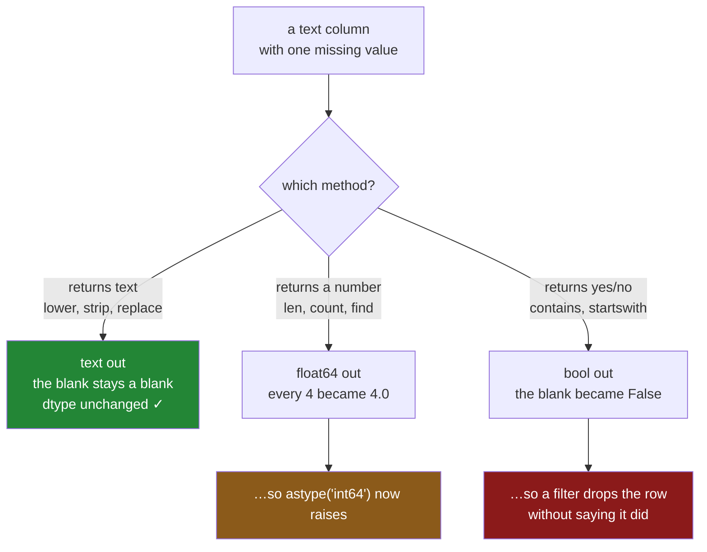

# 1.2 — The blank that came back blank

## One-line answer

A `.str` method never raises on a missing value: it copies the missing value straight through to the
result, which is kind at the row level and expensive at the column level, because one blank is enough
to turn a column of whole numbers into a column of decimals.

---

## The story

The flat's shopping file has one line where somebody was interrupted. The price is there, the time is
there, and where the item should be there is nothing at all — they got as far as the amount, put the
phone down, and never came back to it.

Nobody notices, because one blank line in a month of shopping is not the sort of thing anybody reads
the file to find.

Later, somebody is trying to work out which of the four spellings of milk are the ones with a stray
space on the end, so they ask for the length of every item name. The lengths come back. Seven of them
are whole numbers, like lengths are, and one of them is blank, which is fair enough.

Then they try to use those lengths for something — anything — and the numbers have all quietly grown
a decimal point. Four has become four point zero. Nothing failed, nothing warned, and a column that
was obviously a count of characters is now a column of decimals.

---

## The idea in plain language

A **missing value** is pandas' way of writing "there is no value here". It is not an empty piece of
text and it is not zero; it is the absence of an answer.
[Day 26, 2.5](../../../day-26-frames-and-copy-on-write/parts/02-the-str-dtype/2.5-the-missing-value-in-a-text-column.md)
is where the two flavours pandas uses — `NaN` and `pd.NA` — were introduced. Day 30 is where missing
data becomes a subject in its own right. Here we need only one fact about it: it can sit inside a
text column, and the accessor has to decide what to do when it meets one.

The decision pandas made is called **propagation**. The accessor does not raise, does not skip the
row, and does not invent a value. It puts a missing value in the output at the same position. Six
values in, six results out, and the third one is still missing. The shape of the result always
matches the shape of the input, so the answer still lines up with the frame it came from.

That is the right choice, and it has a consequence people do not expect.

`.str.len()` should give back whole numbers, because a character count is a whole number. But a
column has **one dtype for all its values**
([Day 26, 1.4](../../../day-26-frames-and-copy-on-write/parts/01-the-two-objects/1.4-one-dtype-per-column.md)),
and the ordinary whole-number dtype — `int64` — has no way to write "missing". There is no integer
that means "not there". So pandas picks the nearest type that *can* hold a missing value, which is
`float64`, the decimal one, because decimals have `NaN` built in. Every length in the column becomes
a decimal so that one of them can be absent.

One blank changed the type of the whole column. That is the sentence to remember.

The same thing happens in a smaller way for methods that answer yes or no. `.str.contains("il")` on
a `str` column gives back a plain `bool` column, and the missing row is reported as **`False`** —
not because the answer is no, but because the column has nowhere to put "unknown". You can override
that with `na=True`, and you should think about which one you mean, because "this row does not
contain milk" and "we do not know what this row contains" are different facts that a filter will
treat identically.

Two words for the rest of this part. **Empty** means the text is there and has no characters in it:
`""`, length zero. **Missing** means there is no text at all: length unknown. They look the same when
printed and they behave completely differently, and telling them apart is most of the work of
cleaning a text column.

---

## Why Setu needs it

- **[2.3](../02-cleaning-names/2.3-contains-startswith-and-the-mask.md)** builds filters out of
  `.str.contains`, and a filter that silently reads "unknown" as "no" is how rows disappear from a
  report without anybody choosing to drop them.
- **[7.1](../07-the-module/7.1-the-textdate-module.md)**'s `normalise_item` has to decide whether a
  blank item name is acceptable input or a reason to refuse, and that decision needs this part.
- **Day 30** is missing data as its own subject: where a blank comes from, and why filling it before
  the split is a leak. This part is the narrow version of it — what a `.str` call does when it meets
  one.
- **Day 34**'s `describe()` report counts non-missing values per column. Reading that report requires
  knowing that `count` is not `len`.
- **Day 111**'s text features and **Day 162**'s chunker both run over documents scraped from the
  web, where a missing body field is routine rather than exceptional. A pipeline that crashes on one
  is worse than a pipeline that propagates.

---

## The mechanism

The flat's item column, with the interrupted row in it — and, next to it, a genuinely empty one, so
the two can be told apart.

```python
import pandas as pd

item = pd.Series(["Milk", "milk ", None, "MILK", "", "milk"], name="item")
print(item)
print()
print("dtype     :", item.dtype)
print("isna      :", item.isna().tolist())
```

**Line by line:**

- `None` in the list is how you write "nothing here" when building a Series by hand. pandas converts
  it into its own missing marker on the way in; you will see it print as `NaN`.
- `""` at position 4 is the **empty** string — a real value that happens to have no characters.
- `item.dtype` is printed because the whole behaviour below depends on which text dtype this is.
  With no dtype given, pandas 3.0 infers `str` ([1.3](1.3-the-dtype-under-the-text.md)).
- `.isna()` is the only reliable way to tell the blank from the empty string, because the printout
  cannot. It answers per row: is this one missing?

```text
0     Milk
1    milk 
2      NaN
3     MILK
4         
5     milk
Name: item, dtype: str

dtype     : str
isna      : [False, False, True, False, False, False]
```

**Rows 2 and 4 print almost the same and are nothing alike.** Row 2 shows `NaN` and `isna` says
`True`. Row 4 shows blank space and `isna` says `False` — there is a value there, it is just empty.

Now ask for the lengths.

```python
print(item.str.len())
print()
print("len dtype :", item.str.len().dtype)
```

**Line by line:**

- `.str.len()` runs Python's `len` on each value. It is the cheapest way to see a trailing space,
  which is why it is the method people reach for first when two values look identical
  ([1.1](1.1-the-column-that-has-no-lower.md)).
- Printing the **dtype** separately, because the surprise is in the type and not in the values, and a
  printed `4.0` is easy to read past.

```text
0    4.0
1    5.0
2    NaN
3    4.0
4    0.0
5    4.0
Name: item, dtype: float64

len dtype : float64
```

**`4.0`, not `4`.** Every length is a decimal, and the column's dtype is `float64`. There is no
integer that means "missing", so holding one `NaN` cost the column its integer type. Note also that
row 4 — the empty string — got a perfectly ordinary `0.0`. Empty has a length. Missing does not.

Two methods that return text, and one that returns a yes-or-no:

```python
print(item.str.lower().tolist())
print(item.str.strip().tolist())
print()
print(item.str.contains("il"))
```

**Line by line:**

- `.str.lower()` and `.str.strip()` both give back text columns, and text can hold a missing value
  directly, so nothing about the dtype changes. The blank comes out as a blank in position 2.
- `.str.contains("il")` asks a yes-or-no question of every row. It is printed in full rather than as
  a list, so the dtype line at the bottom is visible.

```text
['milk', 'milk ', nan, 'milk', '', 'milk']
['Milk', 'milk', nan, 'MILK', '', 'milk']

0     True
1     True
2    False
3    False
4    False
5     True
Name: item, dtype: bool
```

**Position 2 is `False`, and that is a decision pandas made on your behalf.** The row does not
contain `il` because the row does not contain anything, and `bool` has no third value for "unknown".
Position 3 is also `False`, for a completely different reason: `MILK` really does not contain the
lower-case `il`. The result cannot tell you which `False` is which.

And what that costs the moment you total anything:

```python
print("total length  :", item.str.len().sum())
print("rows          :", len(item))
print("counted       :", item.str.len().count())
```

**Line by line:**

- `.sum()` **skips** missing values by default, so the total is the total of five numbers, not six.
  It comes out as `17.0` rather than `17` because the column is `float64`.
- `len(item)` is the number of rows, blank included: 6.
- `.count()` is the number of **non-missing** values: 5. The gap between the last two lines is the
  number of blanks, and comparing them is the fastest audit there is.

```text
total length  : 17.0
rows          : 6
counted       : 5
```

**Three numbers, and the mean of that column is `17 / 5`, not `17 / 6`.** Whether that is right
depends entirely on whether a missing item name means "no name" or "name we failed to record", and
pandas cannot know which. You can.

How one blank travels:



---

## When it breaks

**Turning the lengths back into whole numbers:**

```text
$ uv run python -c "
import pandas as pd
item = pd.Series(['Milk', 'milk ', None, 'MILK', '', 'milk'], name='item')
item.str.len().astype('int64')
"
IntCastingNaNError: Cannot convert non-finite values (NA or inf) to integer.Replace or remove
non-finite values or cast to an integer typethat supports these values (e.g. 'Int64')
```

**What it means.** The obvious repair — "it should be an integer, so cast it to one" — is refused,
and correctly. The `NaN` in position 2 has no integer to become. (The missing spaces in
`integer typethat` are in pandas' own message; they are not a transcription slip.)

**The smallest fix depends on what the blank means.** If a missing item name should count as a
zero-length name, `item.fillna("")` **before** the `.str.len()` gives you a real `int64` column. If
it should not, `astype("Int64")` — capital I — is the nullable integer dtype the error is pointing
at, and it keeps the missing value while giving you whole numbers. Choosing `fillna` because it makes
the error go away is how a blank turns into a fact.

**The filter that dropped a row nobody chose to drop:**

```text
$ uv run python -c "
import pandas as pd
item = pd.Series(['Milk', 'milk ', None, 'MILK', '', 'milk'], name='item')
print('rows in      :', len(item))
print('is milk      :', item.str.lower().str.contains('milk', na=False).sum())
print('is not milk  :', (~item.str.lower().str.contains('milk', na=False)).sum())
"
rows in      : 6
is milk      : 4
is not milk  : 2
```

**Nothing raised, and the two halves add up.** Four rows are milk and two are not — except that the
two "not milk" rows are the missing one and the empty one, and neither of those is a statement about
milk. Split a frame in two on a text condition and every row the condition could not answer lands on
the same side, silently.

The fix is to make the third case visible rather than to pick a side for it:
`item.isna().sum()` alongside the two counts, or a three-way split with `np.select` and a
`default="unknown"`
([Day 29, 2.2](../../../day-29-iteration-and-order/parts/02-vectorised/2.2-the-three-ways-to-write-a-condition.md)).

**The other text dtype, which answers differently:**

```text
$ uv run python -c "
import pandas as pd
item = pd.Series(['Milk', 'milk ', None, 'MILK', '', 'milk'], name='item').astype('string')
print('dtype    :', item.dtype)
print('len      :', item.str.len().tolist(), item.str.len().dtype)
print('contains :', item.str.contains('il').tolist(), item.str.contains('il').dtype)
"
dtype    : string
len      : [4, 5, <NA>, 4, 0, 4] Int64
contains : [True, True, <NA>, False, False, True] boolean
```

**Same data, same calls, different answers.** `string` is the NA-flavoured text dtype: its missing
marker is `pd.NA`, and it propagates into **nullable** result types — `Int64` rather than `float64`,
`boolean` rather than `bool`. The lengths stayed whole numbers, and `contains` kept a third answer
for "unknown" instead of flattening it to `False`.

That is arguably the more honest behaviour, and it is not the default. `str` is what pandas 3.0
infers ([1.3](1.3-the-dtype-under-the-text.md)), so it is what you will get from `read_csv` unless
you ask for something else. **The lesson is not "use `string`" — it is that "what does this column
do with a blank?" has two answers, and the dtype decides which one you got.**

---

## In production

**What a professional writes instead of the teaching version.** Blanks are counted at the boundary
and named in the message, so that a decision gets made once instead of being inherited by every later
line:

```python
import pandas as pd


def item_lengths(items: pd.Series, *, blanks: str = "keep") -> pd.Series:
    """Character count per item name. `blanks` says what a missing name is worth."""
    missing = int(items.isna().sum())
    if blanks == "reject" and missing:
        raise ValueError(f"{items.name!r} has {missing} missing values of {len(items)}")
    if blanks == "empty":
        return items.fillna("").str.len().astype("int64")
    return items.str.len().astype("Int64")
```

**Line by line:**

- `items.isna().sum()` runs **first**, before any work, so the count is available whichever branch is
  taken. It is one pass and it is the number every later argument is about.
- `int(...)` around it because `.sum()` on a boolean column returns a NumPy integer, and an f-string
  formats that with a `np.int64(...)` wrapper in some contexts. Casting keeps the message readable.
- `blanks` is **keyword-only** — the `*` in the signature — because `item_lengths(names, "empty")`
  at a call site tells a reader nothing, and `blanks="empty"` tells them everything.
- `"reject"` raises with **both** numbers, missing and total. "Three missing" is an alarm; "three
  missing out of four" is a different alarm from "three missing out of nine hundred thousand".
- `"empty"` is the branch that says a missing name counts as a name of length zero, and it says so in
  code that a reviewer can argue with. `.astype("int64")` afterwards is safe **because** the `fillna`
  came first, and it is there to assert that: if a blank ever survives, this line raises rather than
  returning decimals.
- The default branch returns `Int64` — the nullable integer — so the caller gets whole numbers *and*
  keeps the blank. This is the answer that throws nothing away, which is why it is the default.

**What degrades at scale.** Not speed — `isna().sum()` is one cheap pass. What degrades is
**attention**. On six rows a blank is visible in the printout. On nine hundred thousand rows nobody
sees it, and the first symptom is a dtype: a column that was `int64` last week is `float64` this
week, which nothing warns about and which then propagates into every file written from it. Parquet
stores the type
([Day 27, 3.2](../../../day-27-reading-and-writing/parts/03-parquet/3.2-the-round-trip-that-keeps-dtypes.md)),
so the change survives the round trip and shows up in a different service.

**The failure that only appears with real data.** A support-ticket pipeline flagged urgent tickets
with `body.str.contains("urgent", case=False)`. About one ticket in two thousand arrived with an
empty body, from a mobile client that submitted on the first tap. Those tickets became `False` — not
urgent — and were routed to the slow queue. The team found it eleven months later, when somebody
noticed that the tickets in the slow queue with no body were disproportionately the ones that were
later escalated. **No error was ever raised, and no test ever failed**, because every test fixture
had a body.

**The review comment a senior engineer leaves.** *"`.str.contains(...)` here without `na=` — say
what a missing value should count as, in the call, so the next reader does not have to look up which
text dtype this column is. And this returns `float64` because of the blanks; if the caller needs
integers, use `Int64` rather than casting after a `fillna` you have not justified."*

**The interview question.** *"What does a `.str` method do with a `NaN`?"* It propagates it — no
exception, no dropped row, a missing value in the same position. Then the part that shows you have
used it: **say what the result's dtype becomes.** For a text-returning method, unchanged. For
`.str.len()` on the default `str` dtype, `float64`, because `int64` cannot represent missing — so one
blank turns a column of counts into a column of decimals and `astype("int64")` then raises
`IntCastingNaNError`. For a predicate like `contains`, plain `bool` with the blank rendered as
`False`, which is a silent answer to a question the data did not answer. The `string` dtype
propagates into `Int64` and `boolean` instead and keeps the third state, which is why "which text
dtype is this?" is a real question and not pedantry.

---

## Check yourself

```bash
uv run python -c "
import pandas as pd
item = pd.Series(['Milk', 'milk ', None, 'MILK', '', 'milk'], name='item')
print('rows        :', len(item))
print('counted     :', item.str.len().count())
print('empty       :', (item.str.len() == 0).sum())
print('missing     :', item.isna().sum())
print('len dtype   :', item.str.len().dtype)
print('contains    :', item.str.contains('il').tolist())
print('with na=True:', item.str.contains('il', na=True).tolist())
"
```

Two rows in that column look blank when printed and only one of them is missing. Say which line above
tells them apart, and say why `len dtype` is not `int64`.

**Answer out loud, without scrolling up:**

> A `.str` method meets a missing value. Say what it does with it, and then say what happens to the
> dtype of the result for a method that returns a number and for a method that returns yes or no.

---

**Next:** [1.3 — The dtype under the text, measured](1.3-the-dtype-under-the-text.md).
