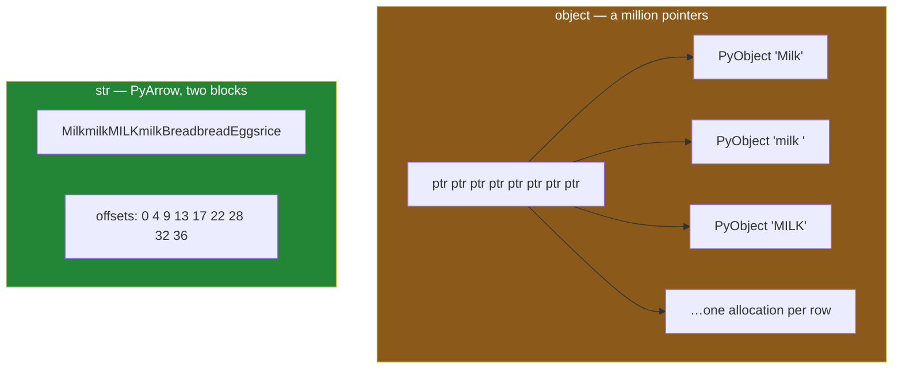

# 1.3 — The dtype under the text, measured

## One-line answer

pandas 3.0 stores text in a PyArrow-backed `str` dtype rather than as a column of pointers to Python
objects, which on a million item names is about four times less memory and four to six times faster
per `.str` call — and it is why every tutorial that finds text columns with `dtypes == "object"` now
finds none.

---

## The story

The flat's shopping file has grown. It is not eight lines any more: two people moved in, everybody
kept typing, and three years later there are about a million lines in it.

Somebody decides to finally fix the milk problem — trim the stray spaces, put everything in small
letters, and count the items properly. They write the two-step fix, run it, and it comes back
immediately. Fine.

Then they mention it to a friend who did the same clean-up on the same size of file a couple of years
ago, and the friend says: really? Mine took long enough that I went and made tea.

Nothing in the two-step fix changed. What changed is underneath it — how the file's words are being
held in memory while the work happens. And the tell is one word in a printout that most people never
read: the column used to say `object`, and now it says `str`.

---

## The idea in plain language

A column of numbers is easy to store. A million eight-byte numbers go in a single block of memory,
one after another, and a program that wants the four hundredth one can jump straight to it — this is
what [Day 20, 1.3](../../../day-20-arrays-and-dtypes/parts/01-the-block/1.3-one-block-and-strides.md)
means by an array.

Text does not fit that shape, because pieces of text have different lengths. There is no "jump
straight to the four hundredth" when each one might be four characters or four hundred.

For most of pandas' life the answer was to give up on the block. A text column was an array of
**pointers**: a million slots, each holding a memory address, and at each address a separate Python
string object with its own header, its own reference count and its own allocation. That dtype was
called `object`, and the name is literal — the column held Python objects rather than values. It
worked, and it cost. Every `.str.lower()` had to follow a million pointers, call a Python method a
million times, and allocate a million new objects.

**pandas 3.0 changed the default.** Text now goes into a `str` dtype whose storage is PyArrow — a
library for holding columns of data in a compact, language-neutral layout. Instead of a million
pointers, the column is two blocks: one long block with every character laid end to end, and one
block of **offsets** saying where each value starts. The eight thousand characters of the flat's item
names sit in one place, and the row boundaries are a second, much smaller array of numbers.

Two things follow, and both are measurable rather than a matter of opinion.

**It is smaller,** because a short string no longer carries a Python object's overhead — roughly
fifty bytes of it — around with it. Short values, which is what most real text columns are full of,
gain the most.

**It is faster,** because the operation can run over the character block in compiled code instead of
walking a chain of pointers into the Python interpreter.

There is a third consequence, and it is the one that breaks other people's code. For years, "find
the text columns in this frame" was written as `df.dtypes == "object"`, because text was the main
thing `object` was used for. In pandas 3.0 that expression finds **nothing** on a frame of text and
numbers, because no column is `object` any more. Code written that way does not crash. It quietly
does nothing, which is worse.
[Day 26, 2.4](../../../day-26-frames-and-copy-on-write/parts/02-the-str-dtype/2.4-dtypes-equals-object-finds-nothing.md)
is where that trap was first met; this part is the measurement behind it.

One clarification, because the names collide. `str` here is a **pandas dtype**, written in quotes as
`dtype="str"`. It is not Python's built-in `str` type, and it is not the old `astype(str)` idiom that
produced an `object` column. The full description prints as `<StringDtype(na_value=nan)>`, and its
`.storage` attribute says `pyarrow`.
[Day 26, 2.3](../../../day-26-frames-and-copy-on-write/parts/02-the-str-dtype/2.3-the-storage-behind-it.md)
is the storage in detail; here we only need to see the effect of it.

---

## Why Setu needs it

- **[2.4](../02-cleaning-names/2.4-the-mismatch-that-costs-rows.md)** normalises a whole column
  before a join. On a real catalogue that is the expensive line in the pipeline, and this part is
  what makes it affordable.
- **[7.1](../07-the-module/7.1-the-textdate-module.md)**'s `normalise_item` refuses any column whose
  dtype is not `str` — a check that only makes sense once you know what the alternatives are.
- **Day 34** builds a data-quality report over every column, and "which columns are text" is the
  first question it asks. Written the old way, it reports that the frame has no text in it.
- **Day 35** benchmarks pandas against Polars and DuckDB, both of which use the same Arrow layout.
  Half of the gap that benchmark used to show was pandas' `object` strings, and this part is why that
  half has closed.
- **Day 162**'s document store holds tens of thousands of chunks of text at once. Four times the
  memory is the difference between a corpus that fits on a laptop and one that does not.

---

## The mechanism

First, what the dtype actually is. The eight-row file again:

```python
import pandas as pd

receipts = pd.DataFrame(
    {
        "item": ["Milk", "milk ", "MILK", "milk", "Bread", "bread ", "Eggs", "rice"],
        "price": [1.15, 1.15, 1.20, 1.20, 1.40, 1.40, 2.30, 3.05],
    }
)
print(receipts.dtypes)
print()
print("dtype object   :", receipts["item"].dtype)
print("repr           :", repr(receipts["item"].dtype))
print("storage        :", receipts["item"].dtype.storage)
print("na_value       :", repr(receipts["item"].dtype.na_value))
print("== 'str'       :", receipts["item"].dtype == "str")
print("== 'object'    :", receipts["item"].dtype == "object")
```

**Line by line:**

- No `dtype=` anywhere. This is **inference** — pandas looking at a list of Python strings and
  choosing what to store them as. The choice it makes is the subject of the printout.
- `print(dtype)` gives the short name and `repr(dtype)` gives the full one. They differ, and only the
  full one tells you which missing-value flavour you have
  ([1.2](1.2-the-blank-that-came-back-blank.md)).
- `.storage` is the attribute that answers "PyArrow or not". It is worth checking once on a new
  machine, because a pandas installed without PyArrow falls back to a Python-object storage under the
  same `str` name — same behaviour, none of the speed.
- The last two lines are the compatibility trap stated as an experiment rather than a claim. Run them
  rather than believing them.

```text
item         str
price    float64
dtype: object

dtype object   : str
repr           : <StringDtype(na_value=nan)>
storage        : pyarrow
na_value       : nan
== 'str'       : True
== 'object'    : False
```

**`dtype: object` on the third line is about the `dtypes` Series itself, not about the `item`
column.** `receipts.dtypes` is a little Series whose *values* are dtype descriptions, and a Series of
descriptions is held as objects. It is an unfortunate coincidence of printing, and it is the reason
people glance at that output and conclude their text is still `object`. The line that answers the
question is the one that says `item  str`.

So the old way of finding text columns finds nothing:

```python
print("text columns, the old way :", list(receipts.dtypes[receipts.dtypes == "object"].index))
print("text columns, the new way :", list(receipts.select_dtypes("str").columns))
```

**Line by line:**

- `receipts.dtypes == "object"` builds a mask over the *columns*
  ([Day 28, 2.1](../../../day-28-selection-and-alignment/parts/02-masks/2.1-a-comparison-makes-a-column.md)),
  and `[...]` then keeps the ones that matched. It is a perfectly good idiom that has stopped
  matching anything.
- `.index` because the mask indexes the `dtypes` Series, whose labels are the column names.
- `select_dtypes("str")` is the replacement, and it is better than a fixed comparison for the same
  reason `isin` beats a chain of `==`
  ([Day 28, 2.4](../../../day-28-selection-and-alignment/parts/02-masks/2.4-isin-between-and-the-readable-ones.md)):
  it asks the question by name rather than by spelling.

```text
text columns, the old way : []
text columns, the new way : ['item']
```

**An empty list, no error, no warning.** A cleaning loop written around the first line runs to
completion and cleans nothing.

Now the measurement. The plan's named example is string operations on a million titles, so build a
million rows of the flat's eight spellings and run the same work through both storages:

```python
import time

import numpy as np
import pandas as pd

rng = np.random.default_rng(33)
n = 1_000_000
spellings = np.array(["Milk", "milk ", "MILK", "milk", "Bread", "bread ", "Eggs", "rice"])
raw = spellings[rng.integers(0, len(spellings), n)]

arrow = pd.Series(raw, dtype="str", name="item")
legacy = pd.Series(raw, dtype="object", name="item")

print(f"rows            {n:>12,}")
print(f"str    memory   {arrow.memory_usage(deep=True) / 1e6:>9.2f} MB")
print(f"object memory   {legacy.memory_usage(deep=True) / 1e6:>9.2f} MB")
print()


def best(call, reps=5):
    times = []
    for _ in range(reps):
        start = time.perf_counter()
        call()
        times.append(time.perf_counter() - start)
    return min(times) * 1000


print(f"{'operation':<14}{'str (ms)':>10}{'object (ms)':>13}{'speed-up':>10}")
for label, on_arrow, on_legacy in [
    ("strip", lambda: arrow.str.strip(), lambda: legacy.str.strip()),
    ("lower", lambda: arrow.str.lower(), lambda: legacy.str.lower()),
    ("contains", lambda: arrow.str.contains("ilk"), lambda: legacy.str.contains("ilk")),
    (
        "strip + lower",
        lambda: arrow.str.strip().str.lower(),
        lambda: legacy.str.strip().str.lower(),
    ),
]:
    quick, slow = best(on_arrow), best(on_legacy)
    print(f"{label:<14}{quick:>10.1f}{slow:>13.1f}{slow / quick:>9.1f}x")
```

**Line by line:**

- `np.random.default_rng(33)` — the day number as the seed, so this frame is the same on every
  machine and on every run (Principle 4).
- `spellings[rng.integers(...)]` builds the million rows by **indexing an array with an array of
  positions**, which is fancy indexing from
  [Day 21, 4.1](../../../day-21-indexing-and-views/parts/04-fancy-indexing/4.1-a-list-of-positions.md).
  It is one vectorised call rather than a million-turn loop, which matters because the setup would
  otherwise dominate the thing being measured.
- Both Series are built from the **same** `raw` array, so the only difference between them is the
  dtype. Building one from a list and one from an array would be measuring two things at once.
- `dtype="object"` is stated explicitly. It is not what pandas 3.0 would choose; it is the old
  behaviour, asked for on purpose so it can be compared with.
- `memory_usage(deep=True)` — **`deep` is the whole point.** Without it the `object` column reports
  only its array of pointers, about 8 MB, and not the million Python strings the pointers lead to.
  Shallow memory on an `object` column is one of the most misleading numbers pandas will give you.
- `min(times)` rather than the mean, for the reason
  [Day 29, 3.1](../../../day-29-iteration-and-order/parts/03-the-measurement/3.1-what-a-million-rows-is-for.md)
  gives: the fastest run is the one with the least interference from everything else on the machine,
  and a benchmark is trying to measure the code, not the laptop's mood.
- `contains("ilk")` and not `contains("milk")`, so the substring search cannot be short-circuited by
  a first-character mismatch on most rows. Benchmarks that accidentally pick the easy case report the
  wrong ratio.
- The fourth row **chains** two calls, because that is what the real fix looks like
  ([2.1](../02-cleaning-names/2.1-four-spellings-of-milk.md)) and because two passes over the column
  is where the constant costs stop hiding the real work.

```text
rows               1,000,000
str    memory       12.50 MB
object memory       53.50 MB

operation       str (ms)  object (ms)  speed-up
strip               46.6        263.1      5.6x
lower               49.6        209.0      4.2x
contains           164.3        651.2      4.0x
strip + lower       71.6        287.8      4.0x
```

**Four times the memory and four to six times the time, for identical results.** Your milliseconds
will not be these milliseconds — this was one laptop doing whatever else it was doing. **The ratios
are the finding; the absolute numbers are not.**

The memory line is the one worth sitting with. 12.5 MB against 53.5 MB, for a million values that
average about four and a half characters. The characters themselves are about 4.5 MB of the 12.5;
almost everything above that in the `object` column is Python object overhead, paid once per row.

Two layouts for the same eight values:



---

## When it breaks

**The cleaning loop that cleaned nothing:**

```text
$ uv run python -c "
import pandas as pd
receipts = pd.DataFrame(
    {'item': ['Milk', 'milk ', 'MILK'], 'aisle': ['03 ', '03', '07 '], 'price': [1.15, 1.15, 1.2]}
)
for column in receipts.columns:
    if receipts[column].dtype == 'object':
        receipts[column] = receipts[column].str.strip()
print(receipts['aisle'].tolist())
print(receipts.dtypes.to_dict())
"
['03 ', '03', '07 ']
{'item': <StringDtype(na_value=nan)>, 'aisle': <StringDtype(na_value=nan)>,
 'price': dtype('float64')}
```

**Nothing raised, nothing was cleaned, and the trailing spaces are still there.** The loop ran three
times, the condition was `False` three times, and the frame came out exactly as it went in. This is
the single most common way a pandas-2-era script fails on pandas 3.0, and it fails **green**: the
tests pass, the job succeeds, and the data is dirty.

The smallest fix is `receipts.select_dtypes("str").columns` in place of the dtype comparison. If you
must keep a comparison, `dtype == "str"` is the pandas 3.0 spelling — but a script that has to work
on both versions should ask `pd.api.types.is_string_dtype(...)`, which is true for both storages.

**The accessor that opens on the wrong column:**

```text
$ uv run python -c "
import pandas as pd
mixed = pd.Series(['03', 7, None], name='aisle')
print('dtype    :', mixed.dtype)
print('stripped :', mixed.str.strip().tolist())
"
dtype    : object
stripped : ['03', nan, None]
```

**The `7` became a missing value.** A column holding both text and a number cannot be a `str` column,
so pandas falls back to `object` — and `.str` on an `object` column is permitted, applies to whatever
values happen to be strings, and returns `NaN` for the ones that are not. **No error.** An aisle
number typed without quotes in a JSON file
([Day 27, 2.1](../../../day-27-reading-and-writing/parts/02-json/2.1-nested-by-nature.md)) is enough
to trigger this, and the row it eats is exactly the one you would want to know about.

The fix is at the read, not here: `dtype={"aisle": "str"}` in `read_csv`
([Day 27, 1.4](../../../day-27-reading-and-writing/parts/01-the-csv/1.4-dtype-at-read-time.md)), or
an assertion on the dtype before any `.str` work begins — which is what
[7.1](../07-the-module/7.1-the-textdate-module.md) does.

**The memory number that was not the memory:**

```text
$ uv run python -c "
import numpy as np
import pandas as pd
rng = np.random.default_rng(33)
spellings = np.array(['Milk', 'milk ', 'MILK', 'milk'])
legacy = pd.Series(spellings[rng.integers(0, 4, 1_000_000)], dtype='object')
print('shallow :', legacy.memory_usage(deep=False) / 1e6, 'MB')
print('deep    :', legacy.memory_usage(deep=True) / 1e6, 'MB')
"
shallow : 8.000132 MB
deep    : 53.250443 MB
```

**8 MB or 53 MB, from the same column, depending on one argument.** The shallow number counts the
pointer array and stops there. On a `str` column the two numbers are much closer together, because
there is nothing hiding behind a pointer — which is another way of saying that `object` columns are
the reason `deep=True` exists.

---

## In production

**What a professional writes instead of the teaching version.** Text columns are named and typed at
the boundary, not discovered later by scanning dtypes:

```python
import pandas as pd

RECEIPT_SCHEMA: dict[str, str] = {"item": "str", "aisle": "str", "price": "float64"}


def read_receipts(path: str) -> pd.DataFrame:
    """Read the receipts file with every column's dtype stated, so nothing is inferred."""
    frame = pd.read_csv(path, dtype=RECEIPT_SCHEMA)
    wrong = {name: str(frame[name].dtype) for name, want in RECEIPT_SCHEMA.items() if frame[name].dtype != want}
    if wrong:
        raise TypeError(f"receipts arrived with the wrong dtypes: {wrong}")
    return frame
```

**Line by line:**

- `RECEIPT_SCHEMA` is a **constant at module level**, so the answer to "what shape is this file"
  lives in one place and a reviewer can read it without reading the reader.
- `"aisle": "str"` is the line that stops an aisle called `03` from arriving as the number 3
  ([Day 27, 1.3](../../../day-27-reading-and-writing/parts/01-the-csv/1.3-when-the-guess-is-wrong.md)).
  Stating the dtype is cheaper than repairing the column afterwards, and it cannot be forgotten.
- The dict comprehension collects **every** mismatch rather than raising on the first, so one run
  tells you everything that is wrong with the file.
- `str(frame[name].dtype)` because a dtype object formats awkwardly inside an f-string, and an error
  message is read by a person under time pressure.
- `raise TypeError` and not a warning. A warning in a nightly job is a line in a log nobody opens.
- Note what is **not** here: no `astype` afterwards, no dtype-scanning loop. Every column got its
  type at the moment it was created, which is the only moment where it is free.

**What degrades at scale.** The ratios above hold; the absolutes do not. Two effects change the
picture on real data.

**Long values narrow the gap.** The per-row Python object overhead is roughly fixed, so it dominates
when values are short and is amortised when they are long. A column of four-character item names
gains four times the memory; a column of thousand-character product descriptions gains far less. The
memory win is largest exactly where people assume it is smallest.

**Repeated values change the answer entirely.** A million rows drawn from eight distinct spellings is
not really a million pieces of text; it is eight, repeated. For that shape the right dtype is
`category`, which stores the eight once and a million small integer codes — and that is **Day 34**.
Measure before choosing: `category` is a large win on low-cardinality columns and a loss on
high-cardinality ones.

**The failure that only appears with real data.** A pipeline upgraded from pandas 2 to pandas 3 and
kept a "tidy every text column" step written as `df.dtypes == "object"`. It ran green for six weeks.
The frame's join keys stopped being trimmed, so a supplier whose export added a trailing space
started producing unmatched rows — about four per cent of them — which fell out of the report as
zeroes rather than as errors. **The upgrade was reviewed, tested and monitored.** What nobody had was
a test asserting that the tidy step actually changed something, and a step that silently does nothing
passes every test that only checks the output is well-formed.

**The review comment a senior engineer leaves.** *"`dtypes == 'object'` finds no text columns on
pandas 3 — this loop is a no-op now. Use `select_dtypes('str')`, and add an assertion that the
normalised column differs from the raw one on the fixture, so a no-op cannot pass again."*

**The interview question.** *"What changed about string storage in pandas 3.0, and how would you
know?"* Text infers to a PyArrow-backed `str` dtype instead of `object`: one character block plus an
offsets array, rather than a pointer per row into separate Python string objects. You would know from
`df.dtypes` saying `str`, and from `dtype.storage` saying `pyarrow`. Then the part that shows you
have actually migrated something: **the breaking change is not performance, it is `== "object"`.**
Every `select_dtypes(include="object")` and every `dtypes == "object"` that used to mean "the text
columns" now matches nothing, silently, and code written that way keeps running while doing no work.
And the number worth quoting: about four times less memory and four to six times faster per `.str`
call on a million short values — measured, because the ratio depends on how long the values are.

---

## Check yourself

```bash
uv run python -c "
import numpy as np
import pandas as pd
rng = np.random.default_rng(33)
spellings = np.array(['Milk', 'milk ', 'MILK', 'milk', 'Bread', 'bread ', 'Eggs', 'rice'])
raw = spellings[rng.integers(0, 8, 200_000)]
arrow = pd.Series(raw, dtype='str')
legacy = pd.Series(raw, dtype='object')
print('str    dtype   :', arrow.dtype, '| storage:', arrow.dtype.storage)
print('object dtype   :', legacy.dtype)
print('str    memory  :', round(arrow.memory_usage(deep=True) / 1e6, 2), 'MB')
print('object memory  :', round(legacy.memory_usage(deep=True) / 1e6, 2), 'MB')
print('same answers?  :', arrow.str.strip().str.lower().equals(legacy.str.strip().str.lower().astype('str')))
print('found by ==obj :', (pd.DataFrame({'item': arrow}).dtypes == 'object').sum())
"
```

Two columns holding the identical two hundred thousand values, in two layouts. Say which line proves
the results are the same, and say what the last line would have printed on pandas 2.

**Answer out loud, without scrolling up:**

> What is physically different about how pandas 3.0 holds a text column, compared with the `object`
> columns it used to use? Then name the one expression that used to find every text column in a frame
> and now finds none, and say why that failure is more dangerous than an exception.

---

**Next:** [2.1 — Four spellings of milk](../02-cleaning-names/2.1-four-spellings-of-milk.md).
