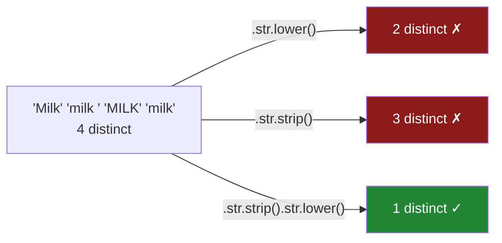

# 2.1 — Four spellings of milk

## One-line answer

`.str.strip().str.lower()` is the whole fix for the flat's item column, and it takes **both** steps:
lower-casing alone gets eight spellings down to six, trimming alone gets them down to seven, and only
the two together get them down to the four items that were actually bought.

---

## The story

It is the end of the month and the flat wants a number. Four people, one shared file, one question:
what did we spend on milk?

Somebody opens the file and does the obvious thing first. Put everything in small letters, they
think, and then count. `Milk` and `MILK` and `milk` are plainly the same word once you stop shouting.

So they do that, and they ask for a count of each item. And the answer that comes back has two lines
in it that say `milk`. Not one line saying `milk 4`. Two separate lines, one saying `milk 3` and one
saying `milk 1`, sitting one under the other, spelled identically, counted apart. Which is not a thing
a list of words is supposed to be able to do.

They read the two lines again. They are the same. Then somebody leans over and says: is there a space
on the end of that one?

There is. One of the phones puts a space after a word when you tap the suggestion bar, and it has
been doing that quietly for months. The space does not print, it does not show in a spreadsheet, and
it makes `milk ` a different word from `milk` in every count anyone will ever run on that file.

---

## The idea in plain language

Four people typed four things and meant one thing. What you want is a rule that turns all four
versions into the same version, so that anything that counts, groups or matches can treat them as one.

That rule has a name: **normalising**. To normalise a value is to put it in one agreed shape, chosen
in advance, so that two values that mean the same thing end up written the same way. It is not about
making the text prettier. It is about making equality work.

Equality is what is quietly broken here. Counting distinct items is equality. Grouping by item — the
subject of
[Day 31, 1.1](../../../day-31-groupby/parts/01-the-split/1.1-four-lines-three-aisles.md) — is
equality. Joining to a price list, which is [2.4](2.4-the-mismatch-that-costs-rows.md), is equality.
And `"milk"` is not equal to `"milk "`, because a string is a sequence of characters and those two
sequences have different lengths
([Day 07, 1.1](../../../day-07-strings/parts/01-text/1.1-a-string-is-code-points.md)).

The flat's file has two separate things wrong with it, which is why one fix is not enough:

- **Case.** `Milk`, `MILK` and `milk` differ in which characters were used. Lower-casing puts every
  letter in its small form, so all three become `milk`.
- **Padding.** `milk ` has an extra character on the end that nobody typed on purpose. Trimming
  removes whitespace from both ends — where **whitespace** means the invisible characters: the
  ordinary space, the tab, the newline.

These are independent problems, so each fix leaves the other alone. Lower-casing `milk ` gives back
`milk ` — still with its space. Trimming `MILK` gives back `MILK` — still shouting. You need both,
and the pandas spelling for "both" is to chain them:

`items.str.strip().str.lower()`

`.str` is the accessor introduced in [1.1](../01-the-str-accessor/1.1-the-column-that-has-no-lower.md) —
the doorway that takes an ordinary Python string method and runs it on every value in the column,
returning a new column. `.str.strip()` returns a text column, so that result has a `.str` of its own,
and `.str.lower()` runs on it. Read it left to right: trim everything, then lower-case everything.

Two more words, and then the mechanism.

**`value_counts()`** asks a column "how many of each distinct value are you holding?" and gives back
one row per distinct value, largest first. **`nunique()`** asks for just the number of distinct
values. Between them they check a normalisation: after the fix, how many different things does this
column think it has? Run them before and after, every time. A normalisation you did not measure is a
normalisation you hope happened.

One more method, for later. **`.str.casefold()`** is a more aggressive lower-case. For plain English
letters it does exactly what `.lower()` does. Outside them it does more, and §*The mechanism* shows
the case where the difference decides whether two spellings match.

---

## Why Setu needs it

- **[2.3](2.3-contains-startswith-and-the-mask.md)** filters this column, and every filter there
  assumes it has already been through this one: a filter for `"milk"` on the raw column finds one row
  out of four.
- **[2.4](2.4-the-mismatch-that-costs-rows.md)** joins the receipts to the flat's price sheet and
  measures what the four spellings cost: two rows out of eight survive the join before this fix, and all
  eight after it.
- **[Day 32, 2.1](../../../day-32-joining-and-reshaping/parts/02-merging/2.1-the-key-and-the-rows-it-pairs.md)**
  defined a join key as the column two frames are matched on. This part is how a text column becomes
  one.
- **Day 34** turns item names into a `category` dtype, which stores one copy of each distinct value.
  Doing that before normalising stores eight copies of four items.
- **Day 111**'s text preprocessing and **Day 162**'s document chunker both start with a normalisation
  step on far more rows. The habit that starts here is: normalise once, at the boundary, and measure.

---

## The mechanism

Here is the flat's file again, and the count that started the argument.

```python
import pandas as pd

receipts = pd.DataFrame(
    {
        "item": ["Milk", "milk ", "MILK", "milk", "Bread", "bread ", "Eggs", "rice"],
        "price": [1.15, 1.15, 1.20, 1.20, 1.40, 1.40, 2.30, 3.05],
    }
)
print(receipts["item"].value_counts())
print()
print("nunique:", receipts["item"].nunique())
```

**Line by line:**

- The frame is the one from [1.1](../01-the-str-accessor/1.1-the-column-that-has-no-lower.md) with
  the `paid_at` column left off, because nothing here needs it: eight receipts, four real items, four
  people typing. `"milk "` and `"bread "` carry a trailing space that no printout will show.
- `value_counts()` is called on the **column**, not the frame, because the question is about one
  column's values. On a frame it would count distinct whole rows, a different question.
- `nunique()` is the same information collapsed to one number, which is the form a test can assert on.
- Both are read **before** anything changes. The before number is what makes the after number mean
  something.

```text
item
Milk      1
milk      1
MILK      1
milk      1
Bread     1
bread     1
Eggs      1
rice      1
Name: count, dtype: int64

nunique: 8
```

Eight rows, eight distinct values, every count `1`. Look at rows two and four of that printout: they
both read `milk`, and pandas has counted them separately. That is the trailing space, and this
printout is the closest you will get to seeing it.

Now the two half-fixes, side by side, so it is clear that neither one is enough.

```python
print("lower only:")
print(receipts["item"].str.lower().value_counts())
print("nunique:", receipts["item"].str.lower().nunique())
print()
print("strip only:")
print(receipts["item"].str.strip().value_counts())
print("nunique:", receipts["item"].str.strip().nunique())
```

**Line by line:**

- `.str.lower()` runs Python's `str.lower` on every value. It changes which letters are used and
  nothing else, so it cannot touch a space.
- `.str.strip()` runs Python's `str.strip` on every value, removing whitespace from **both** ends. It
  changes the length and nothing else, so it cannot touch a capital letter.
- Each is printed with `value_counts()` and then with `nunique()`, because the count table shows you
  *which* values are still apart and the number shows you *how many* are.
- Neither line assigns anything, so the column is still exactly as it arrived.

```text
lower only:
item
milk      3
milk      1
bread     1
bread     1
eggs      1
rice      1
Name: count, dtype: int64
nunique: 6

strip only:
item
milk     2
Milk     1
MILK     1
Bread    1
bread    1
Eggs     1
rice     1
Name: count, dtype: int64
nunique: 7
```

Eight became six, or eight became seven. Both are progress and neither is right. The `lower only`
table is the printout from the story: two lines reading `milk`, counted `3` and `1`.

Both fixes, chained:

```python
clean_items = receipts["item"].str.strip().str.lower()
print(clean_items.value_counts())
print("nunique:", clean_items.nunique())
print("dtype  :", clean_items.dtype)
```

**Line by line:**

- `.str.strip().str.lower()` is two full passes over the column, in that order. The order does not
  change the answer here, but see §*In production* for why one order is measurably cheaper.
- The result is **assigned** to `clean_items`. `.str` methods never change the column they are called
  on ([Day 26, 3.1](../../../day-26-frames-and-copy-on-write/parts/03-copy-on-write/3.1-every-result-behaves-like-a-copy.md)),
  so a line that calls them and assigns nothing has done nothing.
- `dtype` is printed because the result is still text: `str`, the dtype pandas 3.0 infers for text
  ([Day 26, 2.2](../../../day-26-frames-and-copy-on-write/parts/02-the-str-dtype/2.2-str-the-dtype-pandas-3-infers.md)),
  so the new column has a `.str` of its own and can be normalised further.

```text
item
milk     4
bread    2
eggs     1
rice     1
Name: count, dtype: int64
nunique: 4
dtype  : str
```

Four items: four milks, two breads, one eggs, one rice. Eight to four is this part.

Now the number the flat actually wanted:

```python
raw_total = receipts.groupby("item")["price"].sum()
clean_total = receipts.assign(item=clean_items).groupby("item")["price"].sum()
print(raw_total)
print()
print(clean_total)
```

**Line by line:**

- `groupby("item")["price"].sum()` splits the rows by item and adds the prices in each group — the
  split-apply-combine from
  [Day 31, 2.1](../../../day-31-groupby/parts/02-aggregating/2.1-one-number-for-each-group.md).
  Grouping is equality, so it is exactly the operation the four spellings break.
- `receipts.assign(item=clean_items)` returns a **new** frame with `item` replaced, rather than
  `receipts["item"] = ...`, so the original is still there to compare against.
- The two `sum()` calls are identical. Only the column underneath them differs, which is the point:
  nothing about the reporting code changed, and the answer did.

```text
item
Bread     1.40
Eggs      2.30
MILK      1.20
Milk      1.15
bread     1.40
milk      1.20
milk      1.15
rice      3.05
Name: price, dtype: float64

item
bread    2.80
eggs     2.30
milk     4.70
rice     3.05
Name: price, dtype: float64
```

The first table has eight rows and is unusable: milk appears three times, spelled three ways, and no
line answers "what did we spend on milk". The second has four rows and says `4.70`.

One detail about trimming that decides whether this fix holds up on a real file:

```python
padded = pd.Series(["  milk  ", "milk\t", "milk\n", "milk\u00a0", "milk"], name="item")
print("in    :", [repr(v) for v in padded])
print("strip :", [repr(v) for v in padded.str.strip()])
print("strip nunique:", padded.str.strip().nunique())
```

**Line by line:**

- `"milk\t"` and `"milk\n"` are a tab and a newline — the invisible characters a copy-and-paste out
  of a spreadsheet leaves behind ([Day 07, 1.3](../../../day-07-strings/parts/01-text/1.3-escapes-and-raw-strings.md)).
- `"milk\u00a0"` is a **non-breaking space**, the character a web page uses to stop a line wrapping.
  It is not the ordinary space, and it is the one that gets blamed on the database.
- `repr(v)` is used rather than printing the value, because printing a trailing tab shows you
  nothing. `repr` writes the escapes out, which is the only way to see what is there.
- `.str.strip()` takes both ends. `.str.lstrip()` and `.str.rstrip()` take one end each, and neither
  is what you want on an item name.

```text
in    : ["'  milk  '", "'milk\\t'", "'milk\\n'", "'milk\\xa0'", "'milk'"]
strip : ["'milk'", "'milk'", "'milk'", "'milk'", "'milk'"]
strip nunique: 1
```

`.str.strip()` with no argument removed all four, non-breaking space included, because Python's
`str.strip` uses the full Unicode definition of whitespace rather than just the space bar. Five
spellings, one value.

Finally, `casefold`, and the one case where it is not the same as `lower`:

```python
bread = pd.Series(["Weissbrot", "Weißbrot", "weissbrot"], name="item")
print("lower   :", bread.str.lower().tolist())
print("casefold:", bread.str.casefold().tolist())
print("lower    nunique:", bread.str.lower().nunique())
print("casefold nunique:", bread.str.casefold().nunique())
```

**Line by line:**

- One of the flat shops at a bakery whose loaves are labelled in German, and `Weißbrot` — white
  bread — gets typed sometimes with the `ß` and sometimes as `ss`, because not every phone keyboard
  offers that character.
- `.str.lower()` maps each letter to its lower-case form. `ß` is already lower-case, so it stays `ß`,
  and `weißbrot` is still a different value from `weissbrot`.
- `.str.casefold()` applies Unicode case folding, a stronger rule designed for comparing two strings.
  Under it `ß` folds to `ss`, and the two spellings become one value.
- The two `nunique()` calls are the check: `2` against `1`. Which characters exist in your data is a
  fact about your data, not about the method, so measure rather than assume.

```text
lower   : ['weissbrot', 'weißbrot', 'weissbrot']
casefold: ['weissbrot', 'weissbrot', 'weissbrot']
lower    nunique: 2
casefold nunique: 1
```

The rule that follows: use `.str.lower()` when the result is **shown to a person**, and
`.str.casefold()` when it is **compared or joined**. Every ASCII column behaves identically under
both, which is exactly why the difference is only ever discovered in production.



---

## When it breaks

**The argument that turned `milk` into nothing:**

```text
$ uv run python -c "
import pandas as pd
item = pd.Series(['Milk', 'milk ', 'MILK', 'milk'], name='item')
print(item.str.strip('milk').tolist())
"
['M', ' ', 'MILK', '']
```

**Nothing raised, and the data is destroyed.** `str.strip` with an argument does not remove that
*substring*. It treats the argument as a **set of characters** and keeps chewing off both ends while
the character it finds is in that set. `'milk'` is made entirely of characters in `"milk"`, so all
four are eaten and an empty string comes back. `'MILK'` survives untouched because the capitals are
different characters. This is Python's own `str.strip`, reached through the accessor. People write it
because they wanted "remove the word milk", and the method for that is
`.str.replace("milk", "", regex=False)`, which is [2.2](2.2-replace-and-the-regex-default.md). The
smallest fix here is to pass no argument at all.

**The parentheses that were left out:**

```text
$ uv run python -c "
import pandas as pd
item = pd.Series(['Milk', 'milk ', 'MILK', 'milk'], name='item')
print(item.str.strip.str.lower())
"
Traceback (most recent call last):
  File "<string>", line 4, in <module>
AttributeError: 'function' object has no attribute 'str'
```

**What it means.** `item.str.strip` without `()` is the method itself — a function object, sitting
there uncalled. Functions do not have a `.str`, so the next step fails. The message names the type
rather than the column, which is why it looks unrelated to text at first read. The fix is two
characters.

**The number that became a blank:**

```text
$ uv run python -c "
import pandas as pd
mixed = pd.Series(['Milk', 2, 'MILK'], dtype=object, name='item')
print(mixed.str.strip().tolist())
print(mixed.str.strip().str.lower().nunique())
"
['Milk', nan, 'MILK']
1
```

**Nothing raised, and a row disappeared.** In a column whose dtype is `object` — the old container
for anything at all, described in
[Day 26, 2.1](../../../day-26-frames-and-copy-on-write/parts/02-the-str-dtype/2.1-text-used-to-be-object.md) —
the value `2` is a genuine integer, not the text `"2"`. A string method has no meaning on it, so the
accessor writes a missing value into that position instead of raising. The distinct count then comes
back as `1`, because `nunique()` does not count missing values, and a whole item has been silently
deleted from every downstream report.

The smallest fix is not `astype("str")`. It is to find out why the column is `object` at all: in
pandas 3.0 text read from a file arrives as `str`, so an `object` column usually means the frame was
built from mixed Python data, and the place to fix it is where it was built or read
([Day 27, 1.4](../../../day-27-reading-and-writing/parts/01-the-csv/1.4-dtype-at-read-time.md)).

---

## In production

**What a professional writes instead of the teaching version.** Not `.str.strip().str.lower()`
scattered through a pipeline, but one function that owns the definition of "the same item", with the
measurement that proves it worked:

```python
import pandas as pd


def normalise_item(frame: pd.DataFrame, column: str = "item") -> pd.DataFrame:
    """Return a copy of frame with `column` trimmed and case-folded into a join key."""
    if frame[column].dtype != "str":
        raise TypeError(f"{column!r} is {frame[column].dtype}, not str; normalise text only")
    cleaned = frame[column].str.strip().str.casefold()
    print(f"{column}: {frame[column].nunique()} distinct -> {cleaned.nunique()}")
    return frame.assign(**{column: cleaned})
```

**Line by line:**

- The dtype check comes **first**, before any `.str` call, so an `object` column raises here, naming
  the column, instead of silently turning a stray integer into a blank three frames later. That is
  the failure from §*When it breaks*, caught at the door. `raise TypeError` and not a quiet
  `astype("str")`, because a column in the wrong dtype is a bug upstream.
- The distinct count is printed on both sides of the change, in the same call. A normalisation with
  no distinct-count either side of it is a claim, not a result. A run where the two numbers are equal
  is a suspicion worth chasing, not an error, so it prints rather than raises.
- `.str.casefold()` and not `.str.lower()`, because the output of this function is a **key** — its
  only job is to be compared — and folding is the rule built for comparison. The ASCII columns behave
  identically, so nothing about today's data changes; the German bakery in a year's time does.
- `frame.assign(**{column: cleaned})` builds a new frame rather than writing into the caller's. The
  dictionary unpacking is there because `column` is a variable — `assign(column=cleaned)` would
  create a column literally named `column`.

**What degrades at scale.** The accessor is a loop written in compiled code, so the fix stays cheap as
the file grows. On a million rows drawn from the flat's eight spellings with `np.random.default_rng(33)`:

```text
distinct before: 8
strip then lower (chained)             36.6 ms
lower then strip (chained)             41.3 ms
map with a python lambda              273.5 ms
lower only                             20.1 ms
distinct after: 4
```

**Line by line:**

- `strip then lower` beats `lower then strip` by about four milliseconds on the same million rows,
  consistently: trimming first hands the lower-caser shorter strings. The effect is small and free,
  so write the fast order.
- `map with a python lambda` does identical work one value at a time in Python and costs roughly
  **seven times** as much — the same gap
  [Day 29, 2.1](../../../day-29-iteration-and-order/parts/02-vectorised/2.1-one-operation-every-row.md)
  measured for arithmetic, and the reason `.str` exists.
- `lower only` is the cheapest and is also wrong. The correct answer costs about seventeen
  milliseconds more per million rows than the wrong one.
- `distinct before: 8` and `distinct after: 4` are the assertion, and at a million rows they are all
  you can look at.

The real scaling failure is not speed. It is **normalising in more than one place**. A pipeline that
writes `.str.strip().str.lower()` in the loader and again in the report has two definitions of the
item key. They agree today. The day one of them gains a `.str.casefold()`, they stop agreeing, and
nothing raises — the join still runs, the report still renders, and the row count is the only thing
that moves.

**The failure that only appears with real data.** A product catalogue was normalised with
`.str.strip().str.lower()` and joined nightly against a supplier feed normalised the same way. It
worked for two years. Then one supplier switched to an export tool that wrote accented names in
**decomposed** form — the `é` stored as a plain `e` followed by a separate combining accent, rather
than as one character. The two forms print identically, have different lengths, and are not equal.
`strip` and `lower` both leave them alone, because it is neither a case problem nor a padding
problem. Part of the catalogue stopped matching, and because the join was a left join the rows
survived with empty prices rather than vanishing. The fix is a third step,
`unicodedata.normalize("NFC", ...)`, which is
[Day 07, 4.2](../../../day-07-strings/parts/04-normalising/4.2-unicode-normalisation.md). "Clean the
text" is a policy with more than two clauses in it, and it belongs in one named function.

**The review comment a senior engineer leaves.** *"You lower-case here and strip-then-lower in the
loader. Those are two keys with the same name. Put it in `normalise_item`, call it at the read
boundary, and assert the distinct count after it — nothing in this file would notice if the strip
stopped working."*

**The interview question.** *"You lower-case a column of product names and the distinct count barely
drops. What do you check next?"* The length: `.str.len().value_counts()` on the values that ought to
be identical, which exposes padding no printout will show. Then the follow-up: **what is the
difference between `.str.lower()` and `.str.casefold()`, and which one belongs on a join key?**
`casefold` is the stronger, comparison-oriented fold — `ß` becomes `ss` under it and stays `ß` under
`lower` — so a key gets `casefold` and anything shown to a human gets `lower`. On an ASCII-only
column they are indistinguishable, which is precisely why the wrong one survives every test you have.

---

## Check yourself

```bash
uv run python -c "
import pandas as pd
item = pd.Series(['Milk', 'milk ', 'MILK', 'milk', 'Bread', 'bread ', 'Eggs', 'rice'])
print('raw        :', item.nunique())
print('lower only :', item.str.lower().nunique())
print('strip only :', item.str.strip().nunique())
print('both       :', item.str.strip().str.lower().nunique())
print('lengths    :', item.str.len().tolist())
print('bad strip  :', item.str.strip('milk').tolist())
"
```

Four numbers that read 8, 6, 7, 4. Say which two rows the `lengths` line proves are different, and
what `bad strip` did to the fourth value and why.

**Answer out loud, without scrolling up:**

> Why does lower-casing the flat's item column leave two lines in `value_counts()` that both read
> `milk`? Then say what `.str.strip()` removes when you give it no argument, and what it removes when
> you give it one.

---

**Next:** [2.2 — replace, and the pattern you did not know you wrote](2.2-replace-and-the-regex-default.md).
