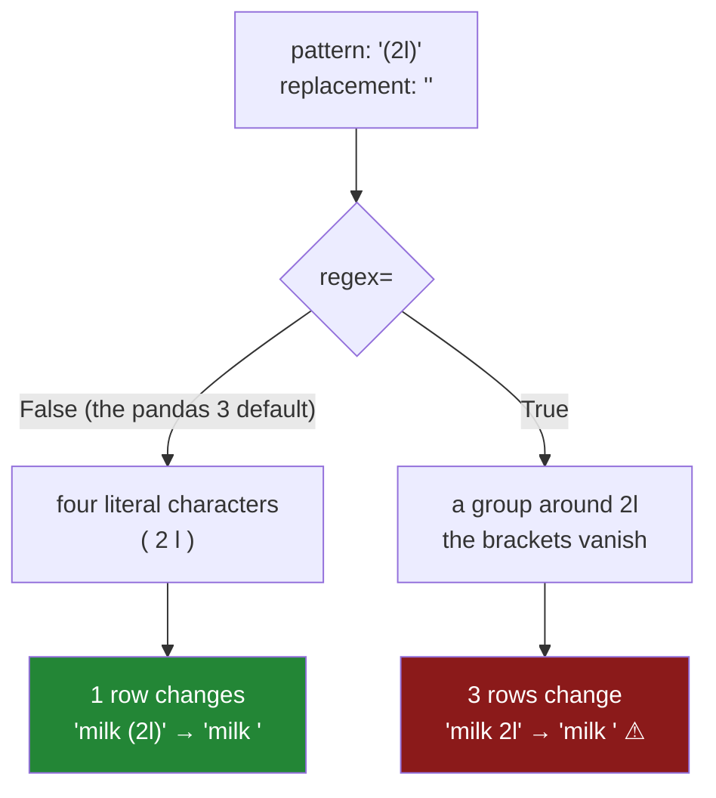

# 2.2 — `replace`, and the pattern you did not know you wrote

## One-line answer

`.str.replace` has a `regex=` switch that decides whether your search text is read as literal
characters or as a **pattern**, and the same two arguments give three different answers depending on
where that switch is — so the rule is to pass `regex=` by hand, every single time, rather than to
remember which way it points in the version you happen to be running.

---

## The story

The flat's file has a new annoyance in it. One person types the size after the item — `milk 2l` —
because that is what is printed on the bottle. Another types `milk (2l)` with brackets. A third has a
phone that puts a full stop where the space should be, so their line reads `milk.2l`.

Nobody minds the size being there. The problem is that `milk 2l` and `milk` are, once again, two
different items as far as any count is concerned, and [2.1](2.1-four-spellings-of-milk.md) does not
help — trimming and lower-casing leave the `2l` exactly where it is.

So somebody decides to take the sizes out. They want to turn the full stop in `milk.2l` into a space
first, so that all three lines at least have the same shape, and they write the obvious thing: replace
`.` with a space.

They run it. Two of the five lines change. It looks like it worked.

Then somebody else, tidying up, reads that line and thinks *that ought to be a regular expression, it
will be faster* — and adds one argument. Now every line changes. Every line is now entirely spaces.
`buttermilk` is ten spaces. Nothing raised, nothing warned, and the item column has been erased.

---

## The idea in plain language

There are two completely different ways to read a piece of search text, and `.str.replace` can do
both.

**Literally.** The characters you typed are the characters to look for. A full stop means a full stop.
This is what most people mean most of the time.

**As a pattern.** The characters you typed are a tiny program describing a *shape* of text. In that
language a full stop does not mean a full stop — it means **any single character at all**. So a
pattern of `.` matches the `m`, then the `i`, then the `l`, then the `k`, and replacing each of them
with a space turns the whole value into spaces.

That pattern language is called a **regular expression**, usually shortened to *regex*. It is not a
pandas invention; it is Python's own, documented in *Regular expression operations* at
<https://docs.python.org/3/library/re.html>, and the same language turns up in nearly every tool that
searches text. It is genuinely useful — [3.3](../03-pulling-text-apart/3.3-extract-and-the-capture-group.md)
uses it to pull a value out of a string — and it is dangerous here for exactly one reason: **ordinary
punctuation has special meaning in it.**

The characters that mean something other than themselves are, near enough:

`.` any character · `*` `+` `?` repetition · `[` `]` a set of characters · `(` `)` a group ·
`|` either-or · `^` the start · `$` the end · `\` the escape · `{` `}` a count

Look at that list and then look at real item names. Sizes come in brackets. Prices have full stops.
Notes have question marks. Nearly every punctuation mark a person types into a shopping list is a
regex operator, which is why this switch causes so much trouble: the pattern that goes wrong is never
an exotic one, it is `(2l)` and `.` and `1+1`.

So `.str.replace` takes a `regex=` argument to say which of the two readings you want. And the thing
worth knowing about it is that **its default has moved between pandas versions**. It was `True`. In
the version this curriculum pins it is `False`. That is a good change and it does not help you at all,
because the code you are reading was written under some other default, and code that does not say
which it wants means something different in each.

The rule that follows is not "use literal" or "use regex". It is: **write `regex=` explicitly on
every call.** Two extra words, and the line now means one thing in every version, to every reader,
forever. This is the same argument as Principle 4's — never accept a framework default — applied to
an argument rather than a version pin.

One more thing to know before the mechanism. `.str.replace` replaces **every** occurrence in a value
by default, not just the first; `n=1` limits it. And like every `.str` method it returns a new column
and changes nothing in place ([2.1](2.1-four-spellings-of-milk.md)).

---

## Why Setu needs it

- **[2.3](2.3-contains-startswith-and-the-mask.md)** builds filters with `.str.contains`, which reads
  its argument as a pattern **by default and always has** — so the trap in this part reappears there
  with the switch pointing the other way, and knowing that is the whole defence.
- **[2.4](2.4-the-mismatch-that-costs-rows.md)** joins on the column this part edits, and a replace
  that quietly ate four characters is a key that quietly matches nothing.
- **[3.3](../03-pulling-text-apart/3.3-extract-and-the-capture-group.md)** and
  **[3.4](../03-pulling-text-apart/3.4-the-pattern-that-matched-nothing.md)** use the pattern language
  deliberately, so this is where the syntax is introduced and the `(` `)` group first appears.
- **Day 34** counts distinct values, and a replace that erased part of every value makes that count
  look wonderful — one distinct value, perfectly clean, entirely wrong.
- **Day 111**'s text preprocessing and **Day 162**'s chunker both strip punctuation from real
  documents, where the pattern is doing the work on purpose and a wrong one is invisible at scale.

---

## The mechanism

Five item names, carrying the punctuation a real shopping list carries.

```python
import pandas as pd

item = pd.Series(
    ["milk 2l", "milk.2l", "milk (2l)", "semi-skimmed milk", "buttermilk"],
    dtype="str",
    name="item",
)
print("default  :", item.str.replace(".", " ").tolist())
print("literal  :", item.str.replace(".", " ", regex=False).tolist())
print("regex    :", item.str.replace(".", " ", regex=True).tolist())
```

**Line by line:**

- The five values are the three spellings from the story plus two that carry no size at all, because a
  replace has to be judged on the rows it was *not* meant to touch as much as on the rows it was.
- `dtype="str"` is stated rather than inferred, so the column is the pandas 3 text dtype from
  [1.3](../01-the-str-accessor/1.3-the-dtype-under-the-text.md) and the accessor behaves the way the
  rest of the day assumes.
- The first call passes **no** `regex=` at all. That is the line under examination: it is what people
  actually write, and the point is to see what it silently chose.
- The second and third pass the switch by hand, so the three lines together show the default *and*
  both of the things it could have meant.
- `.tolist()` on each, rather than printing the Series, because five short values on one line can be
  compared by eye and three printed Series cannot.

```text
default  : ['milk 2l', 'milk 2l', 'milk (2l)', 'semi-skimmed milk', 'buttermilk']
literal  : ['milk 2l', 'milk 2l', 'milk (2l)', 'semi-skimmed milk', 'buttermilk']
regex    : ['       ', '       ', '         ', '                 ', '          ']
```

The first two lines are identical, and that is the answer to *what does the default do* in this
version: **`regex=False`**, the literal reading. One full stop in `milk.2l` became a space and nothing
else moved.

The third line is the story's disaster, printed. Every character of every value matched `.`, every one
was replaced with a space, and what is left is five strings of nothing. `buttermilk` is ten spaces
wide. No exception, no warning — the operation did precisely what it was asked to do.

Now the trap that survives even when you know about the full stop, because it looks like ordinary
tidying:

```python
print("drop 2l literal:", item.str.replace(" 2l", "", regex=False).tolist())
print("paren literal  :", item.str.replace("(2l)", "", regex=False).tolist())
print("paren regex    :", item.str.replace("(2l)", "", regex=True).tolist())
```

**Line by line:**

- `" 2l"` with a leading space is the literal fix for the first spelling only, and it is here as the
  control: one row changes, four do not, and that is what a targeted replace looks like.
- `"(2l)"` under `regex=False` means the four characters `(`, `2`, `l`, `)`. It finds them in
  `milk (2l)` and nowhere else, which is what somebody writing that line intends.
- `"(2l)"` under `regex=True` means something entirely different. The brackets are a **group**, and a
  group is not part of what gets matched — it just marks a piece of the pattern. So the pattern
  reduces to the two characters `2l`, and it now matches `milk 2l` and `milk.2l` as well.
- The three lines differ in one argument and one pair of brackets, which is the whole reason this is
  worth a document.

```text
drop 2l literal: ['milk', 'milk.2l', 'milk (2l)', 'semi-skimmed milk', 'buttermilk']
paren literal  : ['milk 2l', 'milk.2l', 'milk ', 'semi-skimmed milk', 'buttermilk']
paren regex    : ['milk ', 'milk.', 'milk ()', 'semi-skimmed milk', 'buttermilk']
```

Read the last line carefully, because it is the one that ships. Under the pattern reading, **three
rows changed instead of one**. `milk 2l` became `milk ` — trailing space, the exact bug
[2.1](2.1-four-spellings-of-milk.md) spent a document removing, put back by a tidy-up. `milk.2l`
became `milk.`. And `milk (2l)`, the row this line was written for, became `milk ()` — the brackets
survived, because the brackets were never part of the pattern.

Every one of those is a plausible-looking item name. Nothing here would catch anybody's eye in a
printout, and the distinct count went *down*, which reads like success.

And the reason to learn the pattern language rather than avoid it:

```python
print("backref:", item.str.replace(r"^(\w+) (\d)l$", r"\1-\2L", regex=True).tolist())
```

**Line by line:**

- The `r` before each string makes it a **raw string**, so a backslash is a backslash and not the
  start of an escape ([Day 07, 1.3](../../../day-07-strings/parts/01-text/1.3-escapes-and-raw-strings.md)).
  Every regex is written this way; the alternative is doubling every backslash by hand.
- `^` anchors the pattern to the start of the value and `$` to the end, so this matches a *whole*
  item name and cannot fire in the middle of a longer one.
- `(\w+)` is a group holding one or more word characters — the name. `(\d)` is a group holding one
  digit — the size. The literal space and the `l` between and after them have no special meaning.
- `\1` and `\2` in the **replacement** mean "whatever the first group matched" and "whatever the
  second matched". That is what groups are for, and it is why they exist as a concept separate from
  matching: they let the replacement be built out of the pieces of the match.
- Only `milk 2l` has the shape *word, space, digit, l*, so only it changes. `milk.2l` fails at the
  space and `milk (2l)` fails at the bracket, and both come back untouched.

```text
backref: ['milk-2L', 'milk.2l', 'milk (2l)', 'semi-skimmed milk', 'buttermilk']
```

One row rewritten into a new shape that no literal replace could have produced, and four rows left
alone. That is a pattern used on purpose: anchored, specific, and tested against the rows it should
not touch.



---

## When it breaks

**The pattern that would not compile:**

```text
$ uv run python -c "
import pandas as pd
item = pd.Series(['milk (2l)', 'bread'], dtype='str')
print(item.str.replace('(', '', regex=True).tolist())
"
pyarrow.lib.ArrowInvalid: Invalid regular expression: missing ): (()
```

**What it means.** Somebody wanted to delete the opening bracket, which is about as ordinary a
tidy-up as exists. Under the pattern reading `(` is not a bracket, it is *the start of a group*, and a
group that never closes is not a valid pattern. The message is worth reading twice: `missing ):` and
then `(()` — the engine has printed your pattern wrapped in its own brackets, which is why there
appear to be more of them than you typed.

`ArrowInvalid` rather than a pandas error because the pandas 3 `str` dtype is backed by Arrow
([1.3](../01-the-str-accessor/1.3-the-dtype-under-the-text.md)), so the pattern is compiled by Arrow's
engine rather than Python's `re`. The class name differs from what an older pandas raised; the cause
does not. The fix is `regex=False`, or an escaped `\(` if you genuinely meant a pattern.

**This one is the lucky version of the bug.** It raises. The `(2l)` case in §*The mechanism* is the
same mistake in a pattern that happens to be valid, and that one returns wrong data instead.

**The replacement that was read as a pattern too:**

```text
$ uv run python -c "
import pandas as pd
item = pd.Series(['milk 2l'], dtype='str')
print(item.str.replace(r'(\w+) (\d)l', r'\1 \3L', regex=True).tolist())
"
pyarrow.lib.ArrowInvalid: Invalid replacement string: Invalid backreference (must be between 0 and 2)
```

**What it means.** The pattern has two groups and the replacement asked for a third. The message
names the range it will accept — `between 0 and 2` — which is the fastest way to count your own
groups without re-reading the pattern. An off-by-one in a backreference is the routine version of
this, and it is worth noticing that the failure is in the **replacement** string: that half is a small
language too, not plain text.

**The one that ships:**

```text
$ uv run python -c "
import pandas as pd
item = pd.Series(['milk 1+1', 'milk', 'bread 1+1'], dtype='str')
print('literal:', item.str.replace('1+1', '', regex=False).tolist())
print('regex  :', item.str.replace('1+1', '', regex=True).tolist())
"
literal: ['milk ', 'milk', 'bread ']
regex  : ['milk 1+1', 'milk', 'bread 1+1']
```

**Nothing raised and the answer is wrong the other way round.** A two-for-one offer written `1+1` is a
valid pattern: `1+` means *one or more ones*, then a literal `1`. So it looks for `11`, `111` and so
on, finds none, and returns every value unchanged. The distinct count does not move, no error
appears, and the offer tag is still in the item name — the replace simply did nothing, which is the
hardest failure of the three to notice because nothing looks damaged.

---

## In production

**What a professional writes instead of the teaching version.** A replace whose reading is stated,
whose effect is counted, and which refuses to run silently when it changes nothing:

```python
import pandas as pd


def strip_size(items: pd.Series, pattern: str, *, regex: bool) -> pd.Series:
    """Remove a size tag from item names. `regex` says how `pattern` is read; there is no default."""
    out = items.str.replace(pattern, "", regex=regex).str.strip()
    changed = int((out != items).sum())
    if changed == 0:
        raise ValueError(f"{pattern!r} (regex={regex}) matched no rows of {len(items)}")
    print(f"{pattern!r} regex={regex}: {changed}/{len(items)} rows changed")
    return out
```

**Line by line:**

- `*` in the signature makes `regex` **keyword-only**, so nobody can pass it as a bare `True`
  positionally and no reader has to count arguments to find out which reading is in force
  ([Day 10, 1.5](../../../day-10-functions/parts/01-the-signature/1.5-keyword-only-and-positional-only.md)).
- `regex` has **no default value**. That is the whole point of the function: the caller cannot avoid
  the decision, and the line at the call site says which reading it wanted even when pandas changes
  its mind again.
- `.str.strip()` is chained on afterwards because removing a tag from the middle or end of a name
  leaves the space that used to separate it — the `'milk '` in the mechanism's output. Without it this
  function reintroduces exactly the bug [2.1](2.1-four-spellings-of-milk.md) removed.
- `(out != items).sum()` counts rows that actually moved. It is the cheapest possible check that the
  pattern meant what you thought, and it is the one that catches the `1+1` failure above, where
  nothing raised and nothing changed.
- Raising on zero changes rather than warning, because a replace that matched nothing is either a
  typo or a schema change, and both want a person. The mirror of this — refusing when a pattern
  matches *too few*, but not zero — is
  [3.4](../03-pulling-text-apart/3.4-the-pattern-that-matched-nothing.md).

**What degrades at scale.** Not correctness, and not much speed. On a million item names built from
the flat's five spellings with `np.random.default_rng(33)`:

```text
literal  replace, regex=False     41.2 ms
pattern  replace, regex=True     118.9 ms
anchored pattern  ^...$          104.4 ms
python  str.replace via map      402.7 ms
```

**Line by line:**

- Literal replacement is roughly **three times** cheaper than the pattern engine, because it can use a
  plain substring search instead of compiling and running a state machine. So the safe choice is also
  the fast one, which is a rare and pleasant alignment.
- Anchoring with `^` and `$` claws a little back, because a value that fails at the first character is
  abandoned immediately rather than retried at every offset. Anchor whenever the shape genuinely
  starts at the start.
- The Python `map` version is the same seven-to-one gap
  [Day 29, 2.1](../../../day-29-iteration-and-order/parts/02-vectorised/2.1-one-operation-every-row.md)
  measured, for the same reason.
- None of these numbers is a reason to choose `regex=True`. A hundred milliseconds per million rows is
  not what makes this decision; whether the punctuation in your data is operators is.

The genuine scaling problem is a **catastrophic** pattern — one with nested repetition like
`(\w+\s*)+$`, whose cost can grow exponentially with the length of the value it fails on. On short
item names nobody notices. On a free-text notes column where one row is a pasted paragraph, one value
can hang a job that processed the previous million rows without complaint.

**The failure that only appears with real data.** A retailer normalised product names with
`.str.replace("(", "", regex=True)` in a notebook, hit the `ArrowInvalid` above, and "fixed" it by
switching to `regex=False` across the whole file with a find-and-replace. That was correct for the
brackets and wrong for the line three cells down, which had been deliberately stripping trailing
punctuation with `[.,;]$` — as a literal, that pattern now looked for the five characters `[.,;]$`
and matched nothing at all. Punctuation stopped being stripped, product names gained a full stop,
and the join to the supplier catalogue started losing about one row in forty. It was found six weeks
later by somebody counting rows, and the lesson is that `regex=` is per-call, per-intent, and cannot
be set by find-and-replace.

**The review comment a senior engineer leaves.** *"`.str.replace('(2l)', '')` with no `regex=` — this
line means two different things in two versions of pandas and neither of us can tell which one you
wanted. Pass it explicitly. And if you did mean the pattern, note the brackets are a group, so you
are matching `2l` everywhere, not `(2l)` once — the count of rows that changed will tell you which."*

**The interview question.** *"What does `df['name'].str.replace('.', '')` do?"* The honest answer is a
question back: **what is `regex` set to?** With the pattern reading it deletes every character of
every value; with the literal reading it deletes full stops. In the pinned pandas it defaults to
literal, it has not always, and code that does not say is code whose meaning depends on an
installation. Then the follow-up that separates people who have been bitten: **which ordinary
punctuation marks are regex operators?** Brackets, the full stop, `+`, `*`, `?`, `|`, `^`, `$`,
square brackets and the backslash — which is to say nearly all of the punctuation a person types into
a product name, and the reason this is not a theoretical concern.

---

## Check yourself

```bash
uv run python -c "
import pandas as pd
item = pd.Series(['milk 2l', 'milk.2l', 'milk (2l)', 'buttermilk'], dtype='str')
print('default :', item.str.replace('.', '-').tolist())
print('literal :', item.str.replace('.', '-', regex=False).tolist())
print('pattern :', item.str.replace('.', '-', regex=True).tolist())
print('paren F :', item.str.replace('(2l)', '', regex=False).tolist())
print('paren T :', item.str.replace('(2l)', '', regex=True).tolist())
print('changed :', int((item.str.replace('(2l)', '', regex=True) != item).sum()))
"
```

Run it. Say which of the first three lines the default matched, and then say why `paren T` changed
three rows when `paren F` changed one — and which of those two a person writing that line meant.

**Answer out loud, without scrolling up:**

> What does `regex=` decide, and what does `.` mean under each of its two settings? Then say why
> writing it out on every call matters even though you know which way the default points today.

---

**Next:** [2.3 — contains, startswith, and the mask](2.3-contains-startswith-and-the-mask.md).
