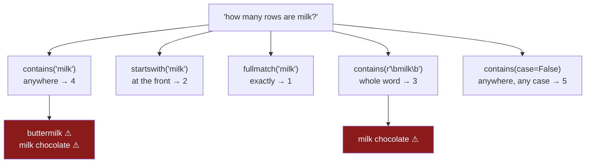

# 2.3 — `contains`, `startswith`, and the mask

## One-line answer

A `.str` method that asks a yes-or-no question gives back a column of `True` and `False` — a **mask**
— which is the thing square brackets keep rows with; and the question *"how many rows are milk?"* has
six different correct answers depending on which method you ask it with, so the method **is** the
definition.

---

## The story

The flat wants to know what it spends on milk. That is the same question as
[2.1](2.1-four-spellings-of-milk.md), but now the item column has been cleaned, so it ought to be
easy: keep the rows that say milk, add up the prices.

Somebody writes the line that anybody would write — keep the rows whose item contains `milk` — and
gets a number. It is bigger than they expected, but the flat did drink a lot of milk that month, so
nobody argues.

Then one of them scrolls the filtered rows to check, and finds `buttermilk` in there. Which is
somebody's baking ingredient, bought once, and is not milk in any sense the flat cares about. And
underneath it is `milk chocolate`, which is a chocolate bar.

The filter was not wrong. `buttermilk` genuinely contains the letters `m`, `i`, `l`, `k`, in that
order. The filter answered the question it was asked. Nobody had noticed that the question they typed
and the question they meant were different questions.

---

## The idea in plain language

Two ideas here, and the second is the one that costs money.

**First: a mask.** Ask a column a yes-or-no question and you get back a column of answers, one per
row, each `True` or `False`. That column of answers is called a **mask** — it lays over the frame like
a stencil, and the rows underneath a `True` are the rows that show through. It is the same object
Day 28 built out of a comparison like `price > 2`
([Day 28, 2.2](../../../day-28-selection-and-alignment/parts/02-masks/2.2-selecting-with-a-mask.md));
the only new thing today is that a `.str` method can produce one.

Once you have a mask, `frame[mask]` keeps the rows it says `True` for. Masks combine with `&` for
*and*, `|` for *or*, and `~` for *not* — and each side needs its own brackets, because in Python those
symbols bind more tightly than a comparison does.

**Second, and this is the real subject: "contains milk" is not one question.** It is at least six, and
they are all reasonable, and they give different numbers.

- **`.str.contains("milk")`** — do these four letters appear *anywhere* in the value? `buttermilk`
  says yes. So does `milk chocolate`.
- **`.str.startswith("milk")`** — does the value *begin* with them? `buttermilk` says no,
  `milk chocolate` still says yes.
- **`.str.fullmatch("milk")`** — is the value *exactly* that and nothing else? Only `milk`.
- **`.str.contains(r"\bmilk\b")`** — does the value contain milk *as a whole word*? `\b` is a **word
  boundary**: the invisible seam between a letter and a non-letter. `buttermilk` fails, because there
  is no seam before its `milk`; `milk chocolate` and `semi-skimmed milk` both pass.
- **`.str.contains("milk", case=False)`** — the same as the first, ignoring capitals, so `MILK` joins
  in too.
- **`== "milk"`** — plain equality, no accessor at all, which is `fullmatch` without the pattern
  engine.

None of those is *the* right one. Which is right depends entirely on what you are counting, and the
job of the person writing the line is to know which one they meant and say so. That is why this part
exists: the bug in the story is not a broken method, it is an unexamined choice between six.

Two more things, both about the argument rather than the mask.

**`.str.contains` reads its argument as a pattern by default.** The opposite way round from
`.str.replace` in [2.2](2.2-replace-and-the-regex-default.md), whose default is literal. That is not a
mistake anybody can reason their way to; it just is, and it is exactly why that part's rule was to
pass `regex=` explicitly on every call rather than to memorise a table of defaults.

**`.str.startswith` and `.str.fullmatch` are different from each other in the same way.**
`startswith` is always literal — it has no `regex` argument at all. `fullmatch` is always a pattern.
So of the three, one is literal, one is a pattern, and one goes whichever way you point it.

---

## Why Setu needs it

- **[2.4](2.4-the-mismatch-that-costs-rows.md)** counts the rows a join keeps, and the mask in this
  part is how you find the rows it dropped — a filter is the tool you debug a join with.
- **[1.2](../01-the-str-accessor/1.2-the-blank-that-came-back-blank.md)** showed what a missing value
  does to a `.str` result. This is where that matters most, because a mask decides which rows *exist*
  downstream, so a blank read as `False` deletes a row from a report without anybody choosing to.
- **[3.4](../03-pulling-text-apart/3.4-the-pattern-that-matched-nothing.md)** measures the share of
  rows a pattern matched, which is the same counting habit this part starts: never take a filter's
  word for it, print how many rows it kept.
- **Day 34**'s quality report is a stack of masks — how many rows are blank, how many are out of
  range, how many are the one value that never changes.
- **Day 111**'s text preprocessing filters documents by content at a scale where nobody can scroll the
  output, so the definition has to be right before it runs, not after.

---

## The mechanism

Six item names, chosen so that each of the six questions gives a different answer.

```python
import pandas as pd

item = pd.Series(
    ["milk", "buttermilk", "milk chocolate", "semi-skimmed milk", "bread", "MILK"],
    dtype="str",
    name="item",
)
print("contains milk  :", item.str.contains("milk").sum())
print("startswith     :", item.str.startswith("milk").sum())
print("fullmatch      :", item.str.fullmatch("milk").sum())
print("word boundary  :", item.str.contains(r"\bmilk\b").sum())
print("case=False     :", item.str.contains("milk", case=False).sum())
print("eq             :", (item == "milk").sum())
```

**Line by line:**

- The six values are the flat's real ones. `buttermilk` and `milk chocolate` are the two that started
  the argument; `semi-skimmed milk` is the one that a naive `startswith` throws away; `MILK` is the
  spelling [2.1](2.1-four-spellings-of-milk.md) would have fixed and is left dirty here on purpose,
  so that `case=` has something to do.
- `.sum()` on a mask counts the `True`s, because `True` adds as `1` and `False` as `0`. It is the
  shortest way to turn a filter into a number you can compare, and it is the number this whole part is
  about.
- `r"\bmilk\b"` is a raw string so the backslashes survive to the pattern engine
  ([Day 07, 1.3](../../../day-07-strings/parts/01-text/1.3-escapes-and-raw-strings.md)). `\b` is a
  word boundary, not a backspace, and without the `r` it would be the latter.
- `(item == "milk")` needs its own brackets before `.sum()`, because attribute access binds tighter
  than `==` does.
- Six lines, one question, no filtering yet — this block exists only to put the six numbers next to
  each other.

```text
contains milk  : 4
startswith     : 2
fullmatch      : 1
word boundary  : 3
case=False     : 5
eq             : 1
```

**One question, six answers: 4, 2, 1, 3, 5, 1.** Every one of them is computed correctly. The spread
is the entire point — between the loosest reading and the strictest there is a factor of five, and a
report that says "milk" without saying which of these it meant is not a report anybody can check.

Now the rows themselves, because a count tells you how many and not which:

```python
loose = item[item.str.contains("milk")]
word = item[item.str.contains(r"\bmilk\b")]
print("loose:", loose.tolist())
print("word :", word.tolist())
print("dropped by the boundary:", sorted(set(loose) - set(word)))
```

**Line by line:**

- `item[mask]` is the mask used for what it is for: keep the rows the mask says `True` for. The result
  is a shorter Series carrying the original row labels, which is how you find the rows again in the
  full frame.
- The two masks differ only in `\b` at each end of the pattern, which is two characters and a
  different report.
- `set(loose) - set(word)` is the difference between the two answers, printed rather than described.
  Comparing the two *sets of values* rather than the two counts is the habit worth taking: `4` and `3`
  tells you one row moved, and this line tells you which one and lets you judge whether it should
  have.
- `sorted(...)` only so the output is stable to print; a set has no order of its own.

```text
loose: ['milk', 'buttermilk', 'milk chocolate', 'semi-skimmed milk']
word : ['milk', 'milk chocolate', 'semi-skimmed milk']
dropped by the boundary: ['buttermilk']
```

The word boundary removed `buttermilk` and kept `milk chocolate`. Whether that is right is a question
about the flat, not about pandas: if the question is *how much did we spend on drinking milk*, then
`milk chocolate` should have gone too and none of these six masks is the one you want — you want a
category column, which is Day 34.

Masks combine, and that is how a definition with more than one clause gets written down:

```python
drinking = item.str.contains(r"\bmilk\b", case=False) & ~item.str.contains("chocolate", case=False)
print("mask   :", drinking.tolist())
print("kept   :", item[drinking].tolist())
print("dropped:", item[~drinking].tolist())
```

**Line by line:**

- Each side of the `&` is wrapped in its own brackets. Without them Python applies `&` to the string
  `"chocolate"` before the method call resolves, and the error you get names bit-wise operations
  rather than filtering, which sends people looking in the wrong place entirely.
- `&` is *and*, not the word `and`. The word operates on one true-or-false value; the symbol operates
  element by element down a column, which is what a mask needs. Same for `|` and `or`, and `~` and
  `not`.
- `~` flips every value, so `~contains("chocolate")` is *does not contain chocolate*.
- `case=False` on both sides, so the definition is not quietly undone by the one person with caps
  lock on.
- The definition is now two clauses long and lives on one line where a reviewer can read it. That is
  the real deliverable of this part — not the mask, the *written-down definition*.

```text
mask   : [True, False, False, True, False, True]
kept   : ['milk', 'semi-skimmed milk', 'MILK']
dropped: ['buttermilk', 'milk chocolate', 'bread']
```

Three rows kept, and every one of them is milk somebody drank.



---

## When it breaks

**The missing brackets, which do not raise:**

```text
$ uv run python -c "
import pandas as pd
item = pd.Series(['milk', 'bread', 'buttermilk'], dtype='str')
print(item[item.str.contains('milk') & item != 'bread'].tolist())
print(item[(item.str.contains('milk')) & (item != 'bread')].tolist())
"
<string>:4: Pandas4Warning: 'and' operations between boolean dtype and str are deprecated and
will raise in a future version. Explicitly cast the strings to a boolean dtype before operating
instead.
['milk', 'bread', 'buttermilk']
['milk', 'buttermilk']
```

**What it means.** `&` binds more tightly than `!=`, so Python read the first line as
`(contains('milk') & item) != 'bread'` — it combined the mask with the *text column*, then compared
the result to a string. The mask that comes out is `True` everywhere, so the filter kept all three
rows including `bread`, which the line was written to exclude.

**Read what pandas actually said.** Not an error: a `Pandas4Warning` that this will raise *in a
future version*. Today it is a deprecation, which means the wrong answer is returned and the job
carries on. A warning in a notebook scrolls off the top of the cell; a warning in a scheduled job goes
to a log nobody reads. The correct line is on the row below and differs only by two pairs of brackets.

The habit is to bracket each side every time — not because you will spot the case that needs it, but
because you will not.

**The mask from the wrong frame:**

```text
$ uv run python -c "
import pandas as pd
receipts = pd.DataFrame({'item': ['milk', 'bread', 'eggs'], 'price': [1.15, 1.40, 2.30]})
dairy = receipts[receipts['price'] > 1.2]
print(receipts[dairy['item'].str.contains('e')])
"
<string>:5: UserWarning: Boolean Series key will be reindexed to match DataFrame index.
pandas.errors.IndexingError: Unalignable boolean Series provided as indexer (index of the boolean Series and of the indexed object do not match).
```

**What it means.** The mask was built from `dairy`, which has two rows, and then used on `receipts`,
which has three. pandas refuses rather than guessing, and the message names the real cause: the two
indexes do not match. This is the alignment rule from
[Day 28, 4.2](../../../day-28-selection-and-alignment/parts/04-alignment/4.2-alignment-is-automatic.md)
doing its job. It is a good error — the version of this bug that does *not* raise is the one where
both frames happen to have the same length, and then rows are kept by position and the answer is
quietly scrambled.

**The blank that was counted as a no:**

```text
$ uv run python -c "
import pandas as pd
s = pd.Series(['milk', 'bread', None], dtype='str')
o = pd.Series(['milk', 'bread', None], dtype=object)
print('str dtype   :', s.str.contains('milk').dtype, s.str.contains('milk').tolist())
print('object dtype:', o.str.contains('milk').dtype, o.str.contains('milk').tolist())
print('str, filtered:', s[s.str.contains('milk')].tolist())
o[o.str.contains('milk')]
"
str dtype   : bool [True, False, False]
object dtype: object [True, False, None]
str, filtered: ['milk']
ValueError: Cannot mask with non-boolean array containing NA / NaN values
```

**Two dtypes, two behaviours, and the quieter one is the new default.** On an `object` column the
unknown row stays unknown — the mask holds `None`, and using it to filter *raises*, which forces
somebody to decide what an unknown row means. On the pandas 3 `str` column the mask comes back as
plain `bool` with the unknown row already flattened to `False`, and the filter runs happily.

So the row silently leaves the report. `False` here does not mean *this row is not milk*; it means
*we do not know what this row is*, and the two have been merged into one answer. Pass `na=` — the
argument from [1.2](../01-the-str-accessor/1.2-the-blank-that-came-back-blank.md) — to say which you
meant, and count the blanks separately rather than letting a filter dispose of them.

---

## In production

**What a professional writes instead of the teaching version.** Not a mask inline in a filter, but a
named predicate that states the definition, refuses an ambiguous one, and reports what it kept:

```python
import pandas as pd


def is_item(items: pd.Series, word: str, *, exclude: tuple[str, ...] = ()) -> pd.Series:
    """Whole-word, case-insensitive match on `word`, minus any value containing an `exclude` word."""
    if items.isna().any():
        raise ValueError(f"{int(items.isna().sum())} blank item names; decide before filtering")
    keep = items.str.contains(rf"\b{word}\b", case=False, regex=True)
    for other in exclude:
        keep &= ~items.str.contains(rf"\b{other}\b", case=False, regex=True)
    print(f"{word!r} excluding {exclude}: {int(keep.sum())}/{len(items)} rows")
    return keep
```

**Line by line:**

- The blank check comes **first** and raises. That is the whole defence against the silent `False`
  above: this function will not filter a column it cannot answer for, so the decision about unknown
  rows is made by a person upstream rather than by a dtype's default.
- `rf"\b{word}\b"` is raw **and** formatted — raw so `\b` survives, formatted so the word can be a
  parameter. Note the honest limitation: a `word` containing regex punctuation would be read as a
  pattern here, so a caller passing `milk (2l)` gets [2.2](2.2-replace-and-the-regex-default.md)'s
  problem. `re.escape` is the fix, and naming the gap is better than pretending it is not there.
- `regex=True` is written out even though it is already the default for `contains`, because the
  reader of this line should not have to know which of the `.str` methods defaults which way.
- `exclude` is a tuple with a default of empty, so the common case stays one argument and the
  `chocolate` case is expressible without a second function. It is keyword-only, after `*`, so
  `is_item(items, "milk", ("chocolate",))` cannot be written by accident.
- `keep &= ~...` narrows the mask once per excluded word. `&=` rebinds `keep` to a new mask each time
  rather than writing into the old one, which is the copy-on-write behaviour from
  [Day 26, 3.1](../../../day-26-frames-and-copy-on-write/parts/03-copy-on-write/3.1-every-result-behaves-like-a-copy.md).
- The kept count is printed with the total beside it. A filter that keeps 3 of 6 and one that keeps
  3 of 6 000 are different events, and only the pair distinguishes them.

**What degrades at scale.** The masks stay fast and the *definition* stops being checkable. On a
million item names built from the six spellings with `np.random.default_rng(33)`:

```text
startswith('milk')                    8.4 ms
contains('milk', regex=False)        12.1 ms
contains('milk')  [pattern]          31.7 ms
contains(r'\bmilk\b')                48.9 ms
contains('milk', case=False)         55.2 ms
```

**Line by line:**

- `startswith` is cheapest because it can stop at the first character of every value. `contains` with
  `regex=False` is a plain substring search. Both beat the pattern engine, and the ordering is the
  same one [2.2](2.2-replace-and-the-regex-default.md) measured for `replace`.
- The word-boundary pattern costs about four times a literal `startswith` and is still nothing —
  fifty milliseconds a million rows. Speed is not what decides this choice.
- `case=False` is the most expensive because the engine cannot use a simple byte comparison. It is
  also usually the correct one, which is a reason to normalise the column once
  ([2.1](2.1-four-spellings-of-milk.md)) rather than pay for case-insensitivity in every filter.

What actually degrades is verification. At six rows you print the kept values and look at them; the
`buttermilk` in the story was caught by eye. At a million you cannot, so the only remaining defence is
the count and a handful of sampled values — which is why the function prints `kept/total`, and why
Day 34's quality report exists at all.

**The failure that only appears with real data.** A subscription business counted "active" customers
with `status.str.contains("active")`. It was right for three years. Then the product added a status
called `inactive`, and every single inactive customer began being counted as active — the substring
is right there in the word. Revenue-per-active-customer halved overnight and was blamed on marketing
for two weeks. Nothing raised, no schema changed, and the filter was as correct on the day it broke as
on the day it was written. `fullmatch("active")` or `== "active"` would never have had the bug, and
neither is longer to type.

**The review comment a senior engineer leaves.** *"`.str.contains('milk')` — is `buttermilk` milk? Is
`milk chocolate`? Right now this says yes to both. Say which you mean with `fullmatch`, a `\b`
boundary or a category column, and print the kept row count next to the total so the next person can
see the definition move if it ever does."*

**The interview question.** *"You filter a column with `.str.contains('active')` and the count looks
too high. What do you check?"* The values it kept, not the count — `set` them and read them, because
the answer is nearly always a longer word containing the shorter one. Then the follow-up:
**`contains`, `startswith`, `fullmatch` and `==` — which of them read their argument as a regular
expression?** `contains` does by default and takes `regex=`; `fullmatch` always does; `startswith`
never does and has no such argument; `==` is not an accessor method at all. The practical
consequence is that the same four characters mean different things in the four calls, so the choice
of method is part of the definition and belongs in the review, not in the author's head.

---

## Check yourself

```bash
uv run python -c "
import pandas as pd
item = pd.Series(['milk', 'buttermilk', 'milk chocolate', 'semi-skimmed milk', 'bread', 'MILK'], dtype='str')
print('contains  :', item.str.contains('milk').sum())
print('startswith:', item.str.startswith('milk').sum())
print('fullmatch :', item.str.fullmatch('milk').sum())
print('boundary  :', item.str.contains(r'\bmilk\b').sum())
print('case=False:', item.str.contains('milk', case=False).sum())
print('equals    :', (item == 'milk').sum())
print('kept loose:', item[item.str.contains('milk')].tolist())
"
```

Six numbers that read 4, 2, 1, 3, 5, 1. Say which two values in `kept loose` the flat did not mean to
count, and which single one of the six lines you would put in a monthly spending report — and why.

**Answer out loud, without scrolling up:**

> What is a mask, and what does `frame[mask]` do with it? Then say why `.str.contains("milk")` finds
> `buttermilk`, and name the two ways of writing the filter that do not.

---

**Next:** [2.4 — the mismatch that costs rows](2.4-the-mismatch-that-costs-rows.md).
