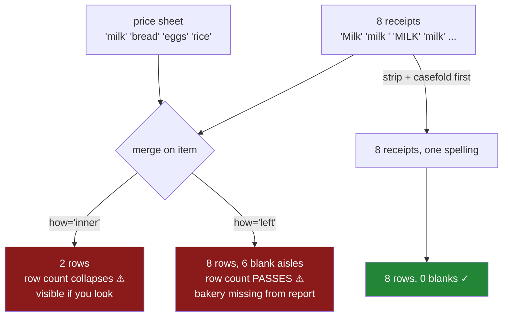

# 2.4 — The mismatch that costs rows

## One-line answer

An unnormalised text key does not make a join fail, it makes a join **succeed on fewer rows**: the
flat's eight receipts match two, and the money that goes missing is not the same share as the rows
that go missing, because the rows that fail to match were never a random sample of the rows.

---

## The story

The flat has a second file now. Somebody typed up a little price sheet — four items, and which aisle
each one is in — so that the monthly total can be broken down into dairy, bakery and dry goods
instead of being one lump.

Joining the two files is the obvious move, and it runs. No error. A table comes out with the aisle
attached to each receipt, and somebody adds up the spend per aisle and puts the three numbers in the
flat's group chat.

Dairy: one pound twenty.

Which is wrong by an amount anybody living there can feel. They bought milk four times. One person
looks at the chat and says *that is not even one bottle*.

The join did not fail. It matched the receipts whose item was spelled exactly the way the price sheet
spelled it — which was one of the four milks — and quietly left the other three out. The row count of
the answer was never compared to the row count of the receipts, because why would you check a join
that did not raise.

---

## The idea in plain language

A join matches rows by **equality on a key** ([Day 32, 2.1](../../../day-32-joining-and-reshaping/parts/02-merging/2.1-the-key-and-the-rows-it-pairs.md)).
That is the entire mechanism, and it is why [2.1](2.1-four-spellings-of-milk.md) mattered: `Milk`,
`milk `, `MILK` and `milk` are four different values, so three of them match nothing in a price sheet
that says `milk`.

What makes this a *production* subject rather than a beginner's mistake is three things that combine
badly.

**First, it is silent.** No exception, no warning. A join that matches nothing at all still returns a
frame — an empty one, with all the right column names. There is nothing to catch.

**Second, the way you write the join decides which symptom you get, and the safer-looking spelling
hides it better.**

- An **inner** join keeps only matched rows, so the row count collapses. That is visible if you look
  at it, and invisible if you do not.
- A **left** join keeps every receipt and fills the price-sheet columns with blanks where nothing
  matched. The row count is *unchanged* — eight in, eight out — so the check everybody has been
  trained to run comes back perfect. The damage has moved into a column instead of the row count, and
  it only shows up when something groups by that column and the unmatched rows fall out of the
  grouping.

That second case is the one worth being frightened of, because Day 32 spent a whole section teaching
you to count rows before and after
([Day 32, 3.1](../../../day-32-joining-and-reshaping/parts/03-the-row-count/3.1-count-the-rows-before-and-after.md)),
and here is a bug that walks straight past that check.

**Third, and least intuitive: the money you lose is not the share of the rows you lose.** People
assume that if a quarter of rows fail to match, roughly a quarter of the value goes with them. That
would be true if the failures were random. They are not, ever. A key fails to match for a *reason* —
one person's phone adds a space, one supplier's export tool uses different capitals, one country's
branch writes dates the other way round — and that reason is a property of a **source**, and sources
differ systematically in what they are worth. In the flat, the person with caps lock on is also the
one who does the big weekly shop. So losing their rows costs far more than their share of the rows.

The defence is not "be careful". It is: normalise at the boundary, and then **assert** something the
join cannot quietly break — a row count, a match rate, or a total. An assertion that would have to be
deleted for the bug to ship.

---

## Why Setu needs it

- **[2.1](2.1-four-spellings-of-milk.md)** wrote the fix. This part is the argument for why it is
  worth doing at the boundary rather than wherever somebody notices.
- **[3.4](../03-pulling-text-apart/3.4-the-pattern-that-matched-nothing.md)** does the same thing for
  a pattern instead of a key: measure the share that matched, refuse to continue below a floor.
- **[7.1](../07-the-module/7.1-the-textdate-module.md)**'s `clean_key` is deliberately left broken —
  it lower-cases and does not strip — so the bug in this part is reproducible in the day's own module
  until you fix it.
- **[Day 32, 3.4](../../../day-32-joining-and-reshaping/parts/03-the-row-count/3.4-the-join-that-dropped-forty-per-cent.md)**
  is this failure without the text cause. This part supplies the cause that produces it most often.
- **Day 34** turns keys into categories, and two frames whose categories were built from differently
  spelled columns join to nothing at all — the same bug with a new dtype on top.
- **Phase 6**'s feature joins and **Day 111**'s monitoring both attach a table to a table on a
  string key. The habit that has to survive from here is: a join is not done when it runs, it is done
  when the match rate has been asserted.

---

## The mechanism

The flat's eight receipts, and the little price sheet somebody typed up.

```python
import pandas as pd

receipts = pd.DataFrame(
    {
        "item": ["Milk", "milk ", "MILK", "milk", "Bread", "bread ", "Eggs", "rice"],
        "price": [1.15, 1.15, 1.20, 1.20, 1.40, 1.40, 2.30, 3.05],
    }
).astype({"item": "str"})
sheet = pd.DataFrame(
    {"item": ["milk", "bread", "eggs", "rice"], "aisle": ["dairy", "bakery", "dairy", "dry"]}
).astype({"item": "str"})

inner = receipts.merge(sheet, on="item", how="inner")
print("receipts:", len(receipts), " matched:", len(inner))
print("money   :", round(receipts["price"].sum(), 2), "->", round(inner["price"].sum(), 2))
print(inner)
```

**Line by line:**

- The receipts are the same eight from [2.1](2.1-four-spellings-of-milk.md), still dirty. The price
  sheet is clean, because somebody typed it once, carefully — which is exactly the realistic
  asymmetry: the reference table is tidy and the transaction table is not.
- `.astype({"item": "str"})` on both, so the key columns are the same dtype on both sides. A join
  across mismatched dtypes is a separate failure and is not what this part is about.
- `how="inner"` is written out rather than left to default, because the whole subject of this part is
  that `how` decides which symptom you get, so it should never be implicit
  ([Day 32, 2.2](../../../day-32-joining-and-reshaping/parts/02-merging/2.2-the-four-hows-on-four-rows.md)).
- The row counts and the money totals are printed **on both sides of the join**, in the same
  statement. That pairing is the entire defence, and it is two lines.

```text
receipts: 8  matched: 2
money   : 12.85 -> 4.25
   item  price  aisle
0  milk   1.20  dairy
1  rice   3.05    dry
```

**Eight receipts in, two out.** Six rows were dropped and nothing said so. The only reason `milk`
survived at all is that one of the four flatmates happens to type it the way the price sheet does,
and `rice` survived because nobody ever shouted it.

Look at the money line as well: `12.85` became `4.25`. Two of eight rows is **25%**, and the money
kept is **33%** — already not the same fraction, on eight rows.

Now the same bug wearing the disguise that beats the row-count check:

```python
left = receipts.merge(sheet, on="item", how="left")
print("rows in:", len(receipts), " rows out:", len(left))
print("unmatched rows:", int(left["aisle"].isna().sum()))
print("money with no aisle:", round(left.loc[left["aisle"].isna(), "price"].sum(), 2))
print()
print(left.groupby("aisle")["price"].sum())
```

**Line by line:**

- `how="left"` keeps every left-hand row whatever happens, filling the right-hand columns with blanks
  where nothing matched. It is the join people reach for precisely *because* it feels safe.
- `len(receipts)` against `len(left)` is the row-count check from Day 32, run honestly — and it will
  pass.
- `left["aisle"].isna().sum()` is the check that actually works here: count the rows where the
  right-hand side arrived empty. On a left join this is the match rate, and it is the number that
  should have been asserted.
- `left.loc[mask, "price"].sum()` totals the money attached to those unmatched rows — the size of the
  hole, in the unit the flat cares about, rather than in rows.
- The `groupby` at the end is the report from the story
  ([Day 31, 2.1](../../../day-31-groupby/parts/02-aggregating/2.1-one-number-for-each-group.md)),
  reproduced exactly so the wrong number can be seen being produced.

```text
rows in: 8  rows out: 8
unmatched rows: 6
money with no aisle: 8.6

aisle
dairy    1.20
dry      3.05
Name: price, dtype: float64
```

**Eight in, eight out.** The row-count check passes perfectly. And six of those eight rows carry no
aisle, £8.60 of £12.85 has no home, and the aisle report — the thing anybody actually reads — shows
£1.20 of dairy and no bakery line at all. Bread simply is not in the report. Not zero: **absent**,
because `groupby` drops the blank key ([Day 31, 4.5](../../../day-31-groupby/parts/04-the-keys/4.5-observed-and-the-aisle-nobody-visited.md)),
so the missing category leaves no gap where a reader might notice it.

That is the number that went in the group chat.

The fix, and what it is worth:

```python
clean = receipts.assign(item=receipts["item"].str.strip().str.casefold())
fixed = clean.merge(sheet, on="item", how="left")
print("unmatched after normalising:", int(fixed["aisle"].isna().sum()))
print("money placed:", round(fixed.loc[fixed["aisle"].notna(), "price"].sum(), 2))
print()
print(fixed.groupby("aisle")["price"].sum())
```

**Line by line:**

- `.str.strip().str.casefold()` is [2.1](2.1-four-spellings-of-milk.md)'s two-step fix, applied to the
  **key column only** and only on the receipts side, because the price sheet is already in the agreed
  shape. In a real pipeline both sides go through the same function, which is the point of
  [7.1](../07-the-module/7.1-the-textdate-module.md)'s `normalise_item`.
- `.assign(...)` returns a new frame, so `receipts` is untouched and the before-and-after comparison
  is still available in the same session.
- The same two checks are re-run rather than assumed. A fix you did not measure is a fix you hope
  happened.

```text
unmatched after normalising: 0
money placed: 12.85

aisle
bakery    2.80
dairy     7.00
dry       3.05
Name: price, dtype: float64
```

Zero unmatched, all £12.85 placed, and three aisles instead of two. Dairy is `7.00` — not `1.20` —
because it is now the four milks *and* the eggs, which the price sheet also files under dairy. And
bakery exists at all, where before there was no such line.

The reported dairy spend was out by a factor of nearly six, from a trailing space and a caps lock.



---

## When it breaks

**The join that matched nothing at all, and still returned a frame:**

```text
$ uv run python -c "
import pandas as pd
a = pd.DataFrame({'item': pd.Series(['Milk ', 'Bread '], dtype='str'), 'price': [1.15, 1.40]})
b = pd.DataFrame({'item': pd.Series(['milk', 'bread'], dtype='str'), 'aisle': ['dairy', 'bakery']})
out = a.merge(b, on='item')
print(out)
print('rows:', len(out), 'columns:', list(out.columns))
print('total:', out['price'].sum())
"
Empty DataFrame
Columns: [item, price, aisle]
Index: []
rows: 0 columns: ['item', 'price', 'aisle']
total: 0.0
```

**Nothing raised and every downstream check passes.** The columns are all present and correctly
named, so a schema check is happy. The dtypes are right. `sum()` of nothing is `0.0`, so a total is
produced and it is a number. A dashboard built on this shows zero, and zero is a plausible reading on
a quiet day. The only thing that ever catches this is a row count or a match rate, asserted.

**The `validate=` that does not check what you want:**

```text
$ uv run python -c "
import pandas as pd
a = pd.DataFrame({'item': pd.Series(['Milk ', 'MILK'], dtype='str'), 'price': [1.15, 1.20]})
b = pd.DataFrame({'item': pd.Series(['milk'], dtype='str'), 'aisle': ['dairy']})
print(a.merge(b, on='item', how='left', validate='many_to_one'))
"
    item  price aisle
0  Milk    1.15   NaN
1   MILK   1.20   NaN
```

**What it means.** `validate="many_to_one"` is the guard from
[Day 32, 3.3](../../../day-32-joining-and-reshaping/parts/03-the-row-count/3.3-validate-and-the-merge-error.md),
and it passed. It is worth understanding why: `validate` checks the **shape** of the relationship —
that the right-hand key is unique — and says nothing whatever about how many rows found a partner.
Zero matches is a perfectly valid many-to-one join. So `validate` protects against row *multiplication*
and offers no protection at all against row *loss*. They are different bugs and they need different
assertions.

**The one that survives normalising:**

```text
$ uv run python -c "
import pandas as pd
a = pd.DataFrame({'item': pd.Series(['cafe latte'], dtype='str'), 'price': [2.40]})
b = pd.DataFrame({'item': pd.Series(['café latte'], dtype='str'), 'aisle': ['drinks']})
print('look identical:', a['item'][0], '|', b['item'][0])
print('equal?', a['item'][0] == b['item'][0])
print('lengths:', len(a['item'][0]), len(b['item'][0]))
print('rows matched:', len(a.merge(b, on='item')))
"
look identical: cafe latte | café latte
equal? False
lengths: 10 11
rows matched: 0
```

**Two strings that print almost identically and are not equal.** The right-hand `é` is stored
**decomposed** — a plain `e` followed by a separate combining accent — so the value is eleven
characters where the other is ten. `strip` does not help; `casefold` does not help; neither is a case
or padding problem. The lengths are the tell, and the fix is Unicode normalisation
([Day 07, 4.2](../../../day-07-strings/parts/04-normalising/4.2-unicode-normalisation.md)). This is
the failure that gets blamed on the database for a fortnight.

---

## In production

**What a professional writes instead of the teaching version.** The join and its assertion are one
function, so that the check cannot be forgotten and cannot be separated from the thing it checks:

```python
import pandas as pd


def attach(
    left: pd.DataFrame, right: pd.DataFrame, key: str, *, min_match: float = 0.99
) -> pd.DataFrame:
    """Left-join `right` onto `left` on `key`, refusing to return a badly matched result."""
    added = [c for c in right.columns if c != key]
    out = left.merge(right, on=key, how="left", validate="many_to_one")
    if len(out) != len(left):
        raise ValueError(
            f"{key}: {len(left)} rows in, {len(out)} out; the right side is not unique"
        )
    matched = out[added[0]].notna()
    rate = float(matched.mean())
    if rate < min_match:
        lost = out.loc[~matched, key].value_counts().head(5)
        raise ValueError(f"{key}: matched {rate:.1%} (< {min_match:.0%}); worst keys:\n{lost}")
    return out
```

**Line by line:**

- `how="left"` and `validate="many_to_one"` together fix the row count at the top: every left row
  survives and none can be duplicated. That turns the join into an operation with exactly one
  remaining failure mode — non-matching — which this function can then measure.
- The `len(out) != len(left)` check is kept even though `validate` should make it impossible, because
  it costs nothing and it is the assertion that catches a future edit changing `how`.
- `out[added[0]].notna()` uses a column that **only the right side has** as the match indicator. That
  matters: testing the key column itself would be useless, since on a left join the key is present on
  every row whether it matched or not.
- `rate` is a **share**, not a count, because the alerting threshold that survives a growing table is
  a proportion. The count moves every day; the rate does not.
- `min_match` defaults to `0.99` rather than `1.0`. A real reference table is usually a little behind
  reality, and a function that raises on a single new product will be switched off within a week —
  and a check somebody has switched off protects nothing.
- The error message prints the **five worst unmatched keys**, not just the rate. That is the
  difference between an alert somebody can act on and an alert somebody mutes: `MILK` and `milk ` in
  that list name the bug immediately.

**What degrades at scale.** Not the join. What degrades is your ability to notice. Five hundred
thousand receipts, generated with `np.random.default_rng(33)`, where each of the four flatmates always
types the same way and the one with caps lock does the big weekly shop:

```text
rows kept : 124694 of 500000  = 24.9%
money kept: 249209.37 of 2062855.50 = 12.1%
merge, dirty key                       0.053 s
merge, after strip + casefold          0.059 s
```

**Line by line:**

- **24.9% of the rows and 12.1% of the money.** The row loss and the money loss differ by a factor of
  two, and this is the whole reason "we only dropped a quarter of the rows" is never a defence. The
  rows that failed belong to the person who spends the most, because the spelling and the spending
  are properties of the same flatmate.
- The correlation is not a trick of this example. It is the normal case: keys fail per-source, and
  sources differ in size, region and value. A random-loss model would have predicted the money loss at
  25% and been wrong by half.
- The two timings differ by **six milliseconds on half a million rows**. Normalising the key costs
  essentially nothing, which removes the last argument for not doing it at the boundary.
- At this size nobody scrolls the output. `24.9%` and `12.1%` are computed numbers or they are not
  known at all, which is why the assertion has to be code rather than a habit of looking.

**The failure that only appears with real data.** A company joined transactions to a customer table on
an email address. It ran for four years. Then a partner integration started sending addresses with
the original capitalisation instead of lower-cased, and about eleven per cent of transactions stopped
matching. The join was a left join, so the row count never moved and no alert fired. The transactions
kept flowing into the warehouse with a null customer segment, and the segment report silently dropped
them, because a `groupby` on a null key produces no group. Revenue attribution was wrong for five
weeks. It was found when a salesperson asked why a named account showed no purchases — a human
noticing an absence, which is the most expensive possible monitoring system.

**The review comment a senior engineer leaves.** *"Left join on a raw text key with no match-rate
check. The row count will not move when this breaks — that is the failure mode of a left join — so
please assert the share of rows that got a non-null value from the right side, and print the top
unmatched keys in the message. Also normalise both sides through the same function; two call sites
with `.str.lower()` written out is two definitions of the key that will diverge."*

**The interview question.** *"Your join returns the right number of rows but a downstream total is too
low. Where do you look?"* At the columns that came from the right-hand side, counting nulls — a left
join preserves the row count by construction, so the row count is the one thing that cannot tell you
anything. Then the follow-up that finds out whether you have run one of these in anger: **if 25% of
rows fail to match, how much of the value have you lost?** Unknown, and assuming 25% is the mistake —
key failures are systematic, not random. They cluster by source, region or partner, and those
clusters differ in value, so the money loss has to be measured separately from the row loss. In the
measurement above it was twice as bad.

---

## Check yourself

```bash
uv run python -c "
import pandas as pd
receipts = pd.DataFrame({'item': ['Milk', 'milk ', 'MILK', 'milk', 'Bread', 'bread ', 'Eggs', 'rice'],
                         'price': [1.15, 1.15, 1.20, 1.20, 1.40, 1.40, 2.30, 3.05]}).astype({'item': 'str'})
sheet = pd.DataFrame({'item': ['milk', 'bread', 'eggs', 'rice'],
                      'aisle': ['dairy', 'bakery', 'dairy', 'dry']}).astype({'item': 'str'})
inner = receipts.merge(sheet, on='item', how='inner')
left = receipts.merge(sheet, on='item', how='left')
print('inner rows:', len(inner), ' left rows:', len(left), ' receipts:', len(receipts))
print('left unmatched:', int(left['aisle'].isna().sum()))
print(left.groupby('aisle')['price'].sum())
clean = receipts.assign(item=receipts['item'].str.strip().str.casefold())
print('after normalising, unmatched:', int(clean.merge(sheet, on='item', how='left')['aisle'].isna().sum()))
"
```

Run it. The left join returns eight rows from eight rows. Say why that number proves nothing here,
which single number you would have asserted instead, and which aisle is missing from the report
entirely rather than showing a zero.

**Answer out loud, without scrolling up:**

> Why does a left join hide a key mismatch that an inner join makes obvious? Then say why losing a
> quarter of your rows does not mean losing a quarter of your money.

---

**Next:** [3.1 — split, and the list that ended up in a cell](../03-pulling-text-apart/3.1-split-and-the-list-in-a-cell.md).
