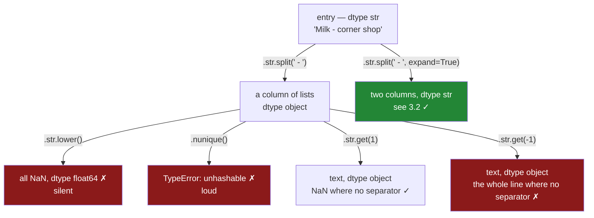

# 3.1 — `split`, and the list that ended up in a cell

## One-line answer

`.str.split()` cuts every value into pieces and hands back **one column whose values are Python
lists**, which looks like progress and is actually a dead end: the column's dtype is `object`, the
`.str` methods stop working on it without saying so, and the only way back out is to pull a piece by
position.

---

## The story

The flat has four people and one shared shopping file. For a year they typed only what they bought.
Then somebody started adding where they bought it, in the same box, after a dash — `Milk - corner
shop`. Everybody copied the habit, and nobody agreed on anything beyond the dash.

So the file now has `Milk - corner shop`, and `milk  - corner shop`, and `MILK - Corner Shop`. It has
one line where the phone's keyboard turned the little dash into a long one, so it reads `bread —
bakery`. And it has one line where somebody was in a hurry and typed `eggs`, with no shop at all.

At the end of the month one of them wants a new answer: how much did we spend at the corner shop? The
plan is obvious. Cut every line at the dash, keep the second half, and count.

They cut every line at the dash, and the printout looks right — every line comes back in two halves,
exactly the halves you would have written down by hand. So they do the next obvious thing and put the
shop names in small letters, because `Corner Shop` and `corner shop` are the same shop.

And eight shop names come back blank. Not an error. Not a warning. Eight empty results, from a column
that had eight perfectly good pieces of text in it a moment ago.

---

## The idea in plain language

Two words have to be pinned down before any of this makes sense, and they are both easy to nod at
without really separating them.

A **list** is a Python container: an ordered box holding several things at once, written with square
brackets, like `["Milk", "corner shop"]`
([Day 4, 2.1](../../../day-04-objects/parts/02-containers/2.1-the-four-containers.md)). One list is
one value in exactly the way one number is one value.

A **column** in pandas is a Series: a labelled sequence of values, one per row, all sharing a single
**dtype** — the one type the whole column commits to
([Day 26, 1.4](../../../day-26-frames-and-copy-on-write/parts/01-the-two-objects/1.4-one-dtype-per-column.md)).

Now the thing that goes wrong. Cutting text into pieces is called **splitting**, and it is the same
operation Python's own `str.split` performs on one piece of text
([Day 7, 2.2](../../../day-07-strings/parts/02-methods/2.2-split-and-join.md)). `"Milk - corner
shop".split(" - ")` gives back `["Milk", "corner shop"]` — one string in, one **list** out.

The `.str` accessor, the doorway to the text methods on a column
([1.1](../01-the-str-accessor/1.1-the-column-that-has-no-lower.md)), then does what it always does:
it runs that method on every value and collects the answers in order. Eight strings in, eight answers
out — but each answer is a list, so what comes back is a column of eight lists.

There is no dtype in pandas for "a column of lists". Text is `str`, numbers are `float64` or `int64`,
and anything pandas cannot describe more precisely falls back to **`object`** — the dtype that means
"pointers to arbitrary Python things, and I promise nothing about them"
([Day 26, 2.1](../../../day-26-frames-and-copy-on-write/parts/02-the-str-dtype/2.1-text-used-to-be-object.md)).

That is the trap, and it has three teeth.

**The `.str` accessor still opens.** A list supports indexing, so pandas lets `.str` through and lets
you write `pieces.str[0]` for "the first item of each list". That is genuinely useful, and it is the
reason the whole thing looks like it worked.

**But the text methods return blanks.** `pieces.str.lower()` does not raise. A list has no `.lower`,
so pandas produces a missing value for that row — for every row — and the answer is a column of
nothing. The failure is silent, which is why the story ends in confusion rather than a traceback.

**And some ordinary column operations now raise instead.** Counting distinct values needs each value
to be **hashable** — usable as a dictionary key — and a list is deliberately not
([Day 4, 2.5](../../../day-04-objects/parts/02-containers/2.5-hashability.md)). So `nunique()` stops
working on a column that had no trouble with it before the split.

The way out is to take the piece you want and get back to plain text as fast as possible. `.str[0]`
and `.str.get(1)` do that. What they do on the rows that had no dash at all is the more interesting
half of this document.

---

## Why Setu needs it

- **[3.2](3.2-expand-and-the-columns-you-get.md)** is the fix: `expand=True` turns the same split
  into real columns and skips the list stage. This part exists so you know what you are skipping.
- **[3.3](3.3-extract-and-the-capture-group.md)** is the other route out — naming the piece you want
  with a pattern instead of counting positions.
- **[3.4](3.4-the-pattern-that-matched-nothing.md)** is what happens when the separator changes and
  nobody notices, which is the failure that starts here on the `bread — bakery` row.
- **Day 34** builds a data-quality report. "How many distinct values does this column have" is one of
  its first lines, and on a list column that line raises rather than answering.
- **Day 162**'s document chunker splits long text into passages and has to decide whether the pieces
  stay together or become rows. Same decision, a hundred thousand documents instead of eight lines.

---

## The mechanism

The flat's file, with the shop typed into the same box:

```python
import pandas as pd

receipts = pd.DataFrame(
    {
        "entry": [
            "Milk - corner shop",
            "milk  - corner shop",
            "MILK - Corner Shop",
            "milk - market",
            "Bread - bakery",
            "bread — bakery",
            "eggs",
            "rice - market",
        ],
        "paid_at": [
            "2026-03-01 08:12:30",
            "2026-03-04 19:40:05",
            "2026-03-08 11:05:00",
            "2026-03-11 18:22:47",
            "2026-03-02 09:31:12",
            "2026-03-09 17:58:40",
            "2026-03-05 12:04:19",
            "2026-03-10 20:11:03",
        ],
        "price": [1.15, 1.15, 1.20, 1.20, 1.40, 1.40, 2.30, 3.05],
    }
)
print(receipts["entry"].tolist())
print(receipts.dtypes)
```

**Line by line:**

- `"entry"` replaces the `item` column of
  [1.1](../01-the-str-accessor/1.1-the-column-that-has-no-lower.md). Same eight receipts, same prices,
  same times, with the shop typed into the same box after a dash.
- Row 1 is `"milk  - corner shop"` with **two** spaces before the dash. That is the trailing space
  from [2.1](../02-cleaning-names/2.1-four-spellings-of-milk.md), still there, now sitting in the
  middle of a longer string where it is even harder to see.
- Row 5 is `"bread — bakery"` with a long dash. Phone keyboards replace `-` surrounded by spaces with
  a longer character, and nobody types it on purpose. It looks like the other rows in a printout.
- Row 6 is `"eggs"` with no shop and no dash at all. Somebody was in a hurry.
- `.tolist()` puts the eight values on one line so the two-space row and the long-dash row are
  actually visible
  ([Day 26, 1.5](../../../day-26-frames-and-copy-on-write/parts/01-the-two-objects/1.5-reading-a-frame-before-you-touch-it.md)).
- `print(receipts.dtypes)` first, always. The dtype decides which accessor a column may use, and it
  is about to change under us.

```text
['Milk - corner shop', 'milk  - corner shop', 'MILK - Corner Shop', 'milk - market', 'Bread - bakery', 'bread — bakery', 'eggs', 'rice - market']
entry          str
paid_at        str
price      float64
dtype: object
```

`entry` is `str`, the PyArrow-backed text dtype pandas 3.0 infers
([1.3](../01-the-str-accessor/1.3-the-dtype-under-the-text.md)). Remember it. Now the split.

```python
pieces = receipts["entry"].str.split(" - ")
print(pieces)
print()
print("dtype        :", pieces.dtype)
print("one cell     :", type(pieces.iloc[0]), pieces.iloc[0])
print("the long dash:", pieces.iloc[5])
print("the bare item:", pieces.iloc[6])
```

**Line by line:**

- `.str.split(" - ")` cuts on the three characters *space, hyphen, space*. Cutting on the bare `"-"`
  would leave `"Milk "` and `" corner shop"` with the spaces still attached, so the separator
  deliberately includes them.
- The result is assigned to `pieces`. It has to be: `.str.split` returns a new column and changes
  nothing in `receipts`, which is the copy-on-write rule governing every pandas result
  ([Day 26, 3.1](../../../day-26-frames-and-copy-on-write/parts/03-copy-on-write/3.1-every-result-behaves-like-a-copy.md)).
- `pieces.dtype` gets its own line because it is the whole point of the block. The input was `str`;
  watch what comes out.
- `type(pieces.iloc[0])` asks what one cell actually holds. `.iloc` selects by position rather than by
  label ([Day 28, 1.3](../../../day-28-selection-and-alignment/parts/01-label-and-position/1.3-iloc-by-position.md)).
- Rows 5 and 6 are printed separately because the separator was not found in either, and what `split`
  does with them is the thing to look at.

```text
0     [Milk, corner shop]
1    [milk , corner shop]
2     [MILK, Corner Shop]
3          [milk, market]
4         [Bread, bakery]
5        [bread — bakery]
6                  [eggs]
7          [rice, market]
Name: entry, dtype: object

dtype        : object
one cell     : <class 'list'> ['Milk', 'corner shop']
the long dash: ['bread — bakery']
the bare item: ['eggs']
```

**Three things happened at once, and only one of them was asked for.**

The dtype went from `str` to `object`: the column no longer holds text, it holds pointers to eight
separate Python list objects.

The rows with no separator did **not** fail and did **not** become blank. They came back as lists of
length one, holding the whole original string. `split` never raises when the separator is absent — if
there is nothing to cut, the answer is one piece, and one piece is still a list.

And row 1 kept its trailing space. `['milk ', 'corner shop']` — the space that has followed this file
since [2.1](../02-cleaning-names/2.1-four-spellings-of-milk.md) is inside the first piece, because
splitting on `" - "` consumed only one of the two spaces.

Now the failure from the story:

```python
print("lower on the lists :", pieces.str.lower().tolist())
print("its dtype          :", pieces.str.lower().dtype)
print("len on the lists   :", pieces.str.len().tolist())
print("len on the original:", receipts["entry"].str.len().tolist())
```

**Line by line:**

- `pieces.str.lower()` is the line from the story. `.str` opens on an `object` column without
  complaint, because pandas cannot know in advance what the objects are.
- Its dtype is printed because the answer is not text and the dtype is the giveaway.
- `pieces.str.len()` looks like the character-count call from
  [1.1](../01-the-str-accessor/1.1-the-column-that-has-no-lower.md), and it is not. `len()` of a list
  is the number of items in the list.
- The last line runs the same call on the **original** text column, so the two printouts sit next to
  each other and the difference is impossible to miss.

```text
lower on the lists : [nan, nan, nan, nan, nan, nan, nan, nan]
its dtype          : float64
len on the lists   : [2, 2, 2, 2, 2, 1, 1, 2]
len on the original: [18, 19, 18, 13, 14, 14, 4, 13]
```

**Eight `nan`s, and a `float64` column.** `nan` is the floating-point Not-a-Number value pandas uses
to mean "missing" ([Day 30, 1.2](../../../day-30-missing-data/parts/01-what-missing-means/1.2-nan-the-number-not-equal-to-itself.md)).
A list has no `.lower` method, so pandas puts a missing value in that row rather than raising — and
since every row is a list, every row is missing, and a column of nothing but `nan` is a column of
floats. That is the story's blank shop names, explained. Nothing failed loudly because, from pandas'
point of view, nothing failed at all.

**And `.str.len()` quietly changed its meaning.** `[2, 2, 2, 2, 2, 1, 1, 2]` is the number of pieces
per row; `[18, 19, 18, 13, 14, 14, 4, 13]` is the number of characters per row. The same expression,
spelled identically, answers two different questions depending on what is in the column. The piece
count is genuinely useful — [3.2](3.2-expand-and-the-columns-you-get.md) uses it as a schema check —
but reaching for it by accident, thinking you asked for string lengths, is how a validation rule ends
up testing nothing.

The way out is to take a piece:

```python
print("first piece :", pieces.str[0].tolist())
print("second piece:", pieces.str.get(1).tolist())
print("last piece  :", pieces.str.get(-1).tolist())
print("dtype of the first piece:", pieces.str[0].dtype)
```

**Line by line:**

- `pieces.str[0]` reads item `0` out of each list. On an `object` column of lists, `.str[...]` is
  indexing into the value, not into the column — the same one-character difference that
  [1.1](../01-the-str-accessor/1.1-the-column-that-has-no-lower.md) called the most confusable line on
  the page.
- `pieces.str.get(1)` is the spelled-out form of `pieces.str[1]`. They do the same thing; `get` is the
  version worth writing down, because `[1]` next to a column name looks far too much like selecting a
  row.
- `.str.get(-1)` asks for the **last** piece. This is the line to look at hardest.
- The dtype of the extracted piece is printed because it is not the dtype you started with.

```text
first piece : ['Milk', 'milk ', 'MILK', 'milk', 'Bread', 'bread — bakery', 'eggs', 'rice']
second piece: ['corner shop', 'corner shop', 'Corner Shop', 'market', 'bakery', nan, nan, 'market']
last piece  : ['corner shop', 'corner shop', 'Corner Shop', 'market', 'bakery', 'bread — bakery', 'eggs', 'market']
dtype of the first piece: object
```

**`get(1)` is honest and `get(-1)` is not.** Where the separator was missing, `get(1)` asks for an
item that does not exist and pandas answers `nan` — which is true, because there is no second piece.
`get(-1)` asks for the last item, and on a one-item list the last item is the *only* item, which is
the whole original string. So the shop column now claims that `bread — bakery` is a shop and that
`eggs` is a shop. That is a wrong answer with no blank in it, in a column that a blank-count check
([Day 30, 2.2](../../../day-30-missing-data/parts/02-finding-it/2.2-counting-the-blanks.md)) would
pass.

**And the dtype is `object`, not `str`.** Pulling a piece out of a list column gets text back, but not
the PyArrow-backed `str` dtype the column started with. Everything
[1.3](../01-the-str-accessor/1.3-the-dtype-under-the-text.md) measured is undone by one round trip
through a list.

Where the column goes:



---

## When it breaks

**The one that raises:**

```text
$ uv run python -c "
import pandas as pd
entry = pd.Series(['Milk - corner shop', 'bread — bakery', 'eggs'], name='entry')
pieces = entry.str.split(' - ')
pieces.nunique()
"
Traceback (most recent call last):
  File "<string>", line 6, in <module>
  File "...\pandas\core\base.py", line 1198, in nunique
    uniqs = self.unique()
            ^^^^^^^^^^^^^
  File "...\pandas\core\series.py", line 2228, in unique
    return super().unique()
           ^^^^^^^^^^^^^^^^
  File "...\pandas\core\base.py", line 1159, in unique
    result = algorithms.unique1d(values)  # type: ignore[assignment]
             ^^^^^^^^^^^^^^^^^^^^^^^^^^^
  File "...\pandas\core\algorithms.py", line 433, in unique
    return unique_with_mask(values)
           ^^^^^^^^^^^^^^^^^^^^^^^^
  File "...\pandas\core\algorithms.py", line 476, in unique_with_mask
    uniques = table.unique(values)
              ^^^^^^^^^^^^^^^^^^^^
  File "pandas/_libs/hashtable_class_helper.pxi", line 7840, in pandas._libs.hashtable.PyObjectHashTable.unique
  File "pandas/_libs/hashtable_class_helper.pxi", line 7783, in pandas._libs.hashtable.PyObjectHashTable._unique
TypeError: unhashable type: 'list'
```

**What it means.** Counting distinct values works by putting each value into a hash table, and a hash
table needs every value to be hashable. Lists are deliberately unhashable, because a list can change
after you put it in the table and the table would then be wrong
([Day 4, 2.5](../../../day-04-objects/parts/02-containers/2.5-hashability.md)). The frames in the
traceback spell out the route: `nunique` → `unique` → `PyObjectHashTable`.

**The smallest fix** is not to make the list hashable. It is to stop having a list column: take the
piece first, then count. `pieces.str.get(1).nunique()` answers in one line.

**The one that does not raise, which is worse:**

```text
$ uv run python -c "
import pandas as pd
entry = pd.Series(['Milk - corner shop', 'bread — bakery', 'eggs'], name='entry')
pieces = entry.str.split(' - ')
print(pieces.str.lower())
"
0   NaN
1   NaN
2   NaN
Name: entry, dtype: float64
```

**What it means.** Exit code zero. No warning. A column of missing values, typed as floats, sitting
where shop names should be. Every downstream count is now zero, every group-by has no groups, and the
report says the flat spent nothing at the corner shop.

**Why pandas does not raise here.** `.str` methods propagate missing values instead of failing
([1.2](../01-the-str-accessor/1.2-the-blank-that-came-back-blank.md)), and on an `object` column
pandas treats "this value does not support the method" the same way it treats "this value is
missing". That is defensible on a mixed column with a handful of odd rows. It is a disaster when
*every* row is odd, because the mechanism meant to tolerate a few bad values tolerates all of them.

**How you catch it.** Look at the dtype of the result. Text in, text out — so a `.str` method that
returns `float64` has done nothing at all. `entry.str.lower().dtype` is `str`;
`entry.str.split(' - ').str.lower().dtype` is `float64`. That one habit catches this whole class of
bug on sight.

---

## In production

**What a professional writes instead of the teaching version.** They do not write this at all. A list
column is a stage nobody wants to reach, so the split goes straight to columns with `expand=True`
([3.2](3.2-expand-and-the-columns-you-get.md)) or the field is named with a pattern
([3.3](3.3-extract-and-the-capture-group.md)). Where a many-valued cell is genuinely the truth — a
tags field, a list of authors — it goes into its own table with one row per item, because a
many-valued cell is a relational schema nobody has written down yet.

The one time the list form earns its place is as a **check**:
`values.str.split(sep).str.len().value_counts().sort_index()` uses the accidental meaning of
`.str.len()` on purpose, and answers "how many pieces does this field actually have". On the flat's
file plus one line reading `tea - corner shop - refill`, that profile is `1 → 2 rows, 2 → 6 rows,
3 → 1 row`. Three numbers, and the whole schema problem is in them; it is
[3.2](3.2-expand-and-the-columns-you-get.md)'s subject.

**What degrades at scale.** The list column is not just inelegant; it is measurably expensive. On a
million entries built with a seeded generator from four items and three shops:

| Step | Time | dtype | Memory |
|---|---|---|---|
| the `entry` column itself | — | `str` | 22.9 MB |
| `.str.split(" - ")` | 2.665 s | `object` | **96.0 MB** |
| then `.str[1]` | 0.875 s | `object` | 56.7 MB |
| `.str.split(" - ", expand=True)` | 3.309 s | `str`, `str` | **27.9 MB** for both columns |

**Four times the memory to hold the same characters,** because a million Python lists holding two
million separate Python strings is a million-and-then-some object headers, and none of that existed
while the text was one PyArrow buffer
([1.3](../01-the-str-accessor/1.3-the-dtype-under-the-text.md)). The two-step route costs 3.540 s
against `expand=True`'s 3.309 s, so it is not even faster, and it holds 96 MB live instead of 28 MB.

What hurts on a big job is that **peak**, not the total. A list column materialises in full before the
next line runs, so a machine that comfortably holds the input and the output can still fail on the
intermediate — and the traceback names the line after the split, not the split.

**The failure that only appears with real data.** A catalogue loader split a `"brand | model"` field
with `.str.split(" | ").str.get(-1)`. `-1` was chosen over `1` because it "handles the case where
there is no brand". It did handle it — by putting the whole string, brand included, into the model
column. About one row in eight hundred had no brand, and those rows produced model names nobody
recognised, so they never matched the reference catalogue and were dropped from the report as unknown
models. The only visible symptom was a slowly growing "unknown model" bucket that everybody had
learned to ignore.

**The review comment a senior engineer leaves.** *"`.str.split(...)` with no `expand=` leaves an
`object` column of lists in the frame — a peak-memory hazard, and it makes `nunique` raise later. Use
`expand=True` and name the columns. And `get(-1)` is not 'the last piece', it is 'the whole line when
the separator is missing' — use `get(1)` so the bad rows come back as `NaN` where the blank-count
check can see them."*

**The interview question.** *"What dtype do you get back from `Series.str.split()`, and why does it
matter?"* `object`, because the values are Python lists and pandas has no list dtype — which means the
text methods silently return `NaN` instead of raising, hash-based operations like `nunique` and
`drop_duplicates` behave differently from each other, and the memory footprint is several times the
original column. Then the follow-up that separates people who have used it from people who have read
about it: **on a row with no separator, what is the difference between `.str.get(1)` and
`.str.get(-1)`?** `get(1)` returns `NaN`, which is true and visible to a null check. `get(-1)` returns
the entire unsplit line, which is false and invisible to every check you have.

---

## Check yourself

```bash
uv run python -c "
import pandas as pd
entry = pd.Series(['Milk - corner shop', 'bread — bakery', 'eggs'], name='entry')
pieces = entry.str.split(' - ')
print('entry dtype :', entry.dtype)
print('pieces dtype:', pieces.dtype)
print('pieces      :', pieces.tolist())
print('str.len     :', pieces.str.len().tolist())
print('str.lower   :', pieces.str.lower().tolist())
print('get(1)      :', pieces.str.get(1).tolist())
print('get(-1)     :', pieces.str.get(-1).tolist())
"
```

Three lines of text go in. Say why `str.len` reports `[2, 1, 1]` rather than character counts, and
say which of the last two lines you would let into a pipeline.

**Answer out loud, without scrolling up:**

> What is in one cell of the column that `.str.split()` returns, and what dtype does that make the
> column? Then say what `.str.lower()` does to that column, and why it does not raise.

---

**Next:** [3.2 — `expand`, and the columns you get](3.2-expand-and-the-columns-you-get.md).
