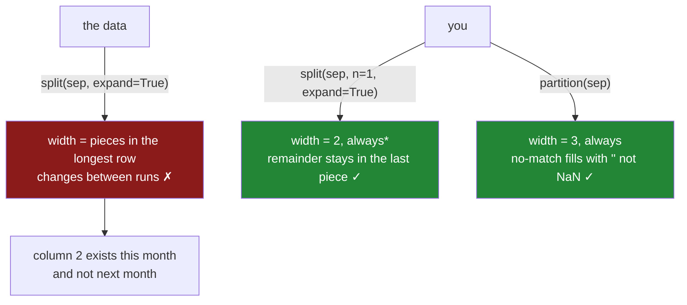

# 3.2 — `expand`, and the columns you get

## One-line answer

`expand=True` turns each piece into its own column and gives you back real text columns instead of a
column of lists — but **you do not choose how many columns you get**: the data does, one column per
piece in the longest row, so a single unusual line silently changes the shape of your table.

---

## The story

The flat's shopping file now has the shop typed in after a dash, and somebody has decided to sort it
out properly: one column for the item, one column for the shop. Two columns, named, done. It works
first time. Everybody is pleased.

A month later one of them buys tea, and the corner shop lets you bring the tin back to be refilled,
which feels worth writing down. So the line reads `tea - corner shop - refill`. One line, out of
several hundred.

The next time the monthly report is run, it stops with an error about columns not being the same
length as the key. Nobody changed the code. Nobody changed the file format. Somebody just wrote a
slightly longer note about tea.

And the confusing part is what happens when they try it again on a different month. That month has no
tea in it, so the same code runs perfectly. The bug is not in the code and it is not in any one line
of the file. It is in the fact that nobody ever decided how many columns this field has — the file
decided, freshly, every time the code ran.

---

## The idea in plain language

[3.1](3.1-split-and-the-list-in-a-cell.md) showed what `.str.split()` returns on its own: one column
whose values are Python **lists** — ordered boxes holding several things at once — with a dtype of
`object`, which is pandas' label for "arbitrary Python things, and I promise nothing about them".
Almost nothing useful works on that column.

`expand` is the argument that fixes it. `expand=True` tells `split` not to build lists at all, but to
lay the pieces out sideways: piece one goes in the first column, piece two in the second, and so on.
What comes back is not a Series any more. It is a **DataFrame** — a table of columns
([Day 26, 1.3](../../../day-26-frames-and-copy-on-write/parts/01-the-two-objects/1.3-a-table-of-columns.md)) —
and each of its columns is ordinary text with the `str` dtype, so every `.str` method works again.

Now the part that catches people. A table has a fixed number of columns. The rows do not agree on how
many pieces they have — some lines have one, most have two, the tea line has three. So pandas has to
pick a width, and the rule it uses is simple and completely out of your hands: **the width is the
piece count of the longest row.** Every row that has fewer pieces gets a missing value in the columns
it did not fill.

That is why the same code produced two columns in March and three in April. Nothing was configured
wrongly. The width was never configured at all.

There are two ways to take the decision back.

**`n=` caps the number of cuts.** `n=1` means "cut at most once", so there are at most two pieces and
therefore at most two columns, and anything after the first separator stays attached to the second
piece. The tea line becomes `tea` and `corner shop - refill`. That may or may not be the answer you
want, but it is *an* answer, and it is the same answer every month.

**`.str.partition()` fixes the width at three.** It cuts at the first separator only and gives back
three columns every time: what came before, the separator itself, and what came after. It never
varies, and where the separator is absent it fills with an **empty string** rather than a missing
value — which is a different thing, and the difference matters for every blank-count check you run
([Day 30, 2.3](../../../day-30-missing-data/parts/02-finding-it/2.3-the-blank-that-was-not-blank.md)).

The rule underneath all of this is worth saying plainly, because it outlives pandas: **a split whose
piece count varies is a schema you do not control.** If the number of columns can change when the
data changes, then the shape of your table is an output of the input rather than a promise you made,
and every consumer downstream is holding a promise you never gave them.

---

## Why Setu needs it

- **[3.3](3.3-extract-and-the-capture-group.md)** is the other route: name the pieces with a pattern,
  and the column count comes from the pattern rather than from the data. That is the version that
  survives contact with a real file, and this part is why.
- **[3.4](3.4-the-pattern-that-matched-nothing.md)** is what happens when a shape check is missing
  entirely, and the answer comes back blank instead of wrong.
- **[7.1](../07-the-module/7.1-the-textdate-module.md)** turns the shape rule into a function with the
  check built in.
- **Day 27, 1.7** wrote a frame back out to CSV. A frame whose column count depends on this month's
  data writes a different header this month, and the reader on the other side breaks
  ([Day 27, 1.7](../../../day-27-reading-and-writing/parts/01-the-csv/1.7-to-csv-and-what-it-throws-away.md)).
- **Day 162**'s chunker and **Day 111**'s feature builder both turn one text field into several
  columns. A pipeline whose column set moves between runs cannot be trained on, because the model was
  fitted on a set of features that no longer exists.

---

## The mechanism

The same file as [3.1](3.1-split-and-the-list-in-a-cell.md) — the flat's eight receipts with the shop
typed into the same box:

```python
import pandas as pd

entry = pd.Series(
    [
        "Milk - corner shop",
        "milk  - corner shop",
        "MILK - Corner Shop",
        "milk - market",
        "Bread - bakery",
        "bread — bakery",
        "eggs",
        "rice - market",
    ],
    name="entry",
)
wide = entry.str.split(" - ", expand=True)
print(wide)
print()
print(wide.dtypes)
print("shape       :", wide.shape)
print("column names:", list(wide.columns))
print("col 1 blanks:", wide[1].isna().tolist())
```

**Line by line:**

- The column is pulled out of the frame as a standalone Series so that the printouts are short. It is
  the identical `entry` column of [3.1](3.1-split-and-the-list-in-a-cell.md) — same two-space row,
  same long-dash row, same bare `eggs`.
- `expand=True` is the only change from [3.1](3.1-split-and-the-list-in-a-cell.md)'s call. Everything
  else about the split is the same: same separator, same cuts, same pieces.
- `print(wide.dtypes)` because that is the whole gain. In [3.1](3.1-split-and-the-list-in-a-cell.md)
  the result was one `object` column; here it should be text again.
- `wide.shape` is `(rows, columns)`. The column half of it is the number this document is about.
- `list(wide.columns)` because the columns have names, and the names are not what most people expect
  the first time.
- `.isna()` asks which values are missing
  ([Day 30, 2.1](../../../day-30-missing-data/parts/02-finding-it/2.1-isna-and-notna.md)). The two
  rows with no separator are the ones to watch.

```text
                0            1
0            Milk  corner shop
1           milk   corner shop
2            MILK  Corner Shop
3            milk       market
4           Bread       bakery
5  bread — bakery          NaN
6            eggs          NaN
7            rice       market

0    str
1    str
dtype: object
shape       : (8, 2)
column names: [0, 1]
col 1 blanks: [False, False, False, False, False, True, True, False]
```

**Both columns are `str`, which is the whole point.** The PyArrow-backed text dtype survived the
split ([1.3](../01-the-str-accessor/1.3-the-dtype-under-the-text.md)), so `.str.strip()`,
`.str.lower()` and `nunique()` all work on these columns, and none of them worked on
[3.1](3.1-split-and-the-list-in-a-cell.md)'s list column.

**The column names are the integers `0` and `1`,** not `item` and `shop`. `split` has no idea what the
pieces mean, so it numbers them. Anything that reads `wide["item"]` will raise a `KeyError` until you
rename, and renaming is a step people forget because the printout looks so much like a finished table.

**And the missing pieces are `NaN`, in a `str` column.** Row 5 and row 6 had nothing after the
separator, so there is nothing to put in the second column, and pandas puts a missing value there.
This is the honest answer — the same honesty `.str.get(1)` gave in
[3.1](3.1-split-and-the-list-in-a-cell.md) — and it is visible to every blank-count check you own.

Now the tea line:

```python
entry_april = pd.concat(
    [entry, pd.Series(["tea - corner shop - refill"], name="entry")],
    ignore_index=True,
)
print(entry_april.str.split(" - ", expand=True))
print("shape:", entry_april.str.split(" - ", expand=True).shape)
```

**Line by line:**

- `pd.concat` stacks the new line under the existing eight
  ([Day 32, 1.1](../../../day-32-joining-and-reshaping/parts/01-stacking/1.1-two-lists-one-under-the-other.md)).
  One extra row, nothing else changed.
- `ignore_index=True` renumbers the rows `0..8` instead of keeping the original labels, so the new row
  is row `8` and not a second row `0`.
- The split call is character-for-character the same call as the block above. That is the point: the
  code did not change.

```text
                0            1       2
0            Milk  corner shop     NaN
1           milk   corner shop     NaN
2            MILK  Corner Shop     NaN
3            milk       market     NaN
4           Bread       bakery     NaN
5  bread — bakery          NaN     NaN
6            eggs          NaN     NaN
7            rice       market     NaN
8             tea  corner shop  refill
```

**One row changed the shape of the table.** Eight rows out of nine have nothing to put in column `2`,
and they all get a missing value so that the ninth row can have a home. The width is `3` because the
longest row has three pieces, and that is the only rule in play.

Two ways to take the width back:

```python
print("n=1")
print(entry_april.str.split(" - ", n=1, expand=True))
print()
print("rsplit n=1")
print(entry_april.str.rsplit(" - ", n=1, expand=True))
```

**Line by line:**

- `n=1` is a cap on the number of **cuts**, not on the number of pieces. One cut makes two pieces, so
  the frame is two columns wide no matter what the data does.
- Everything after the first separator stays in the second piece, so the tea row's shop reads
  `corner shop - refill`. That is a decision, not an accident: it says the field is *item, then
  everything else*.
- `rsplit` is the same operation counted from the right. `rsplit(" - ", n=1)` cuts at the **last**
  separator, so the tea row splits into `tea - corner shop` and `refill` instead.
- Which of the two is right depends entirely on which end of the field is the reliable one. Here the
  item is the reliable end, so `split` with `n=1` is the correct call and `rsplit` is the wrong one —
  and neither of them will ever tell you which you picked.

```text
n=1
                0                     1
0            Milk           corner shop
1           milk            corner shop
2            MILK           Corner Shop
3            milk                market
4           Bread                bakery
5  bread — bakery                   NaN
6            eggs                   NaN
7            rice                market
8             tea  corner shop - refill

rsplit n=1
                   0            1
0               Milk  corner shop
1              milk   corner shop
2               MILK  Corner Shop
3               milk       market
4              Bread       bakery
5     bread — bakery          NaN
6               eggs          NaN
7               rice       market
8  tea - corner shop       refill
```

And the third option, which fixes the width at three by construction:

```python
parts = entry.str.partition(" - ")
print(parts)
print()
print("shape:", parts.shape)
print("col 2 missing:", parts[2].isna().tolist())
print("col 2 empty  :", (parts[2] == "").tolist())
print("col 1 values :", [repr(v) for v in parts[1]])
```

**Line by line:**

- `.str.partition(sep)` cuts at the **first** occurrence of the separator and always returns three
  columns: before, the separator itself, after. There is no `n=` and no way to get four columns.
- The separator is column `1`, which looks like waste until you need it: it is how you tell a row that
  had a separator from a row that did not, without guessing.
- `.isna()` and `== ""` are both printed on column `2` because they disagree, and the disagreement is
  the point.
- `repr(v)` is used on column `1` so that `' - '` and `''` are distinguishable. Printed bare they look
  like a space and like nothing, which is the same thing to a reader's eye.

```text
                0    1            2
0            Milk   -   corner shop
1           milk    -   corner shop
2            MILK   -   Corner Shop
3            milk   -        market
4           Bread   -        bakery
5  bread — bakery
6            eggs
7            rice   -        market

shape: (8, 3)
col 2 missing: [False, False, False, False, False, False, False, False]
col 2 empty  : [False, False, False, False, False, True, True, False]
col 1 values : ["' - '", "' - '", "' - '", "' - '", "' - '", "''", "''", "' - '"]
```

**Nothing is missing, and two rows are empty.** `partition` never produces `NaN`; where there was no
separator it writes `''`. So `isna().sum()` on the shop column reports zero blanks, and the two rows
with no shop sail straight past a null check that would have caught them under `split`. If you use
`partition`, the check you need is `(col == "").sum()`, and it has to be written on purpose.

The width, and who decides it:



The asterisk on "always" is the subject of the next section.

---

## When it breaks

**The error from the story:**

```text
$ uv run python -c "
import pandas as pd
receipts = pd.DataFrame({'entry': ['Milk - corner shop', 'tea - corner shop - refill']})
receipts[['item', 'shop']] = receipts['entry'].str.split(' - ', expand=True)
"
Traceback (most recent call last):
  File "<string>", line 4, in <module>
  File "...\pandas\core\frame.py", line 4660, in __setitem__
    self._setitem_array(key, value)
  File "...\pandas\core\frame.py", line 4699, in _setitem_array
    check_key_length(self.columns, key, value)
  File "...\pandas\core\indexers\utils.py", line 392, in check_key_length
    raise ValueError("Columns must be same length as key")
ValueError: Columns must be same length as key
```

**What it means.** You named two columns on the left and handed over three on the right. `key` is the
list `['item', 'shop']`; `Columns` is the width of the frame that `expand=True` produced. They are two
and three, so the assignment refuses.

**This is the good failure.** It is loud, it is immediate, and it names the real problem. The version
that hurts is the same code with three names on the left, written by somebody who saw three columns
once: it works this month, and next month a file with no tea in it produces two columns and the same
error appears with the numbers the other way round.

**The smallest fix** is `n=1`, which pins the width to two before the assignment ever sees it:
`receipts[["item", "shop"]] = receipts["entry"].str.split(" - ", n=1, expand=True)`.

**The failure `n=1` does not prevent:**

```text
$ uv run python -c "
import pandas as pd
entry = pd.Series(['eggs', 'rice'], name='entry')
wide = entry.str.split(' - ', n=1, expand=True)
print(wide.shape)
print(wide[1])
"
(2, 1)
Traceback (most recent call last):
  File "<string>", line 6, in <module>
  File "...\pandas\core\frame.py", line 4378, in __getitem__
    indexer = self.columns.get_loc(key)
              ^^^^^^^^^^^^^^^^^^^^^^^^^
  File "...\pandas\core\indexes\range.py", line 523, in get_loc
    raise KeyError(key) from err
KeyError: 1
```

**What it means.** `n=1` caps the width at two; it does not guarantee two. If **no** row contains the
separator there is nothing to cut anywhere, every row has exactly one piece, and the frame comes back
one column wide. Column `1` does not exist, so asking for it is a `KeyError`.

This is the shape of the failure that arrives when an upstream export changes its separator — which
is [3.4](3.4-the-pattern-that-matched-nothing.md)'s whole subject. Here it raises, because a missing
column raises. There it will not raise at all.

**The smallest fix** is to stop assuming and start checking. `wide.shape[1] == 2` is one line, it runs
in no measurable time, and it turns a `KeyError` three functions downstream into a failure at the
place where the assumption was made.

---

## In production

**What a professional writes instead of the teaching version.** Three things change: the width is
pinned, the width is checked, and the columns are named in the same expression that creates them.

```python
import pandas as pd


def split_two(values: pd.Series, sep: str, left: str, right: str) -> pd.DataFrame:
    """Split each value once and return exactly two named columns, or raise saying why not."""
    if values.dtype != "str":
        raise TypeError(f"{values.name!r} is {values.dtype}, not str")
    out = values.str.split(sep, n=1, expand=True)
    if out.shape[1] != 2:
        found = int(out.shape[1])
        raise ValueError(f"{values.name!r} split into {found} column(s) on {sep!r}, expected 2")
    return out.set_axis([left, right], axis="columns")
```

**Line by line:**

- The dtype check is first, so the failure names the caller's column rather than surfacing from inside
  pandas ([1.1](../01-the-str-accessor/1.1-the-column-that-has-no-lower.md)).
- `n=1` pins the width from above. Without it this function's own shape check would start failing the
  day somebody writes a longer note, which is exactly the fragility it exists to remove.
- `out.shape[1] != 2` pins it from below. That is the `KeyError` case: a file where nothing matched
  the separator. Both bounds are needed, and each catches a different real event.
- The message carries `values.name`, the width actually found, and the separator that was tried
  (`sep!r` so a space-hyphen-space is visible as `' - '`). Those three facts are the entire diagnosis.
- `set_axis([left, right], axis="columns")` renames in the same expression that produced the frame, so
  there is never a moment when a frame with columns `0` and `1` exists for somebody to use by
  accident.
- The function returns a new frame and mutates nothing, which is the copy-on-write habit from
  [Day 26, 3.1](../../../day-26-frames-and-copy-on-write/parts/03-copy-on-write/3.1-every-result-behaves-like-a-copy.md).

**What degrades at scale.** Not the speed. On a million entries built with a seeded generator from
four items and three shops, `.str.split(" - ", expand=True)` took 3.309 s and produced two `str`
columns holding 27.9 MB — against 96.0 MB for the list column of
[3.1](3.1-split-and-the-list-in-a-cell.md), for the same characters. `expand=True` is the cheaper
route as well as the more useful one.

What degrades is the **stability of the shape**, and it degrades exactly when you start processing in
batches. Split the flat's file into two chunks and run the same call on each:

| Batch | Rows | Columns from `expand=True` | Columns with `n=1` |
|---|---|---|---|
| first four rows | 4 | `[0, 1]` | `[0, 1]` |
| the rest, plus the tea line | 5 | `[0, 1, 2]` | `[0, 1]` |

Two chunks of one file, two different schemas. Chunked reading is the normal way to handle a file that
does not fit in memory
([Day 27, 5.2](../../../day-27-reading-and-writing/parts/05-the-module/5.2-the-file-that-does-not-fit.md)),
and a per-chunk `expand=True` means the chunks no longer agree on their own columns. Concatenating
them then produces a `2` column that is missing for the first several million rows — not because
anything was missing, but because those chunks never had a third piece to put there.

**The failure that only appears with real data.** An address field was split on `", "` with
`expand=True` into house, street, town and postcode — four columns, checked against a sample export
and correct. In production, one address in about four thousand carried a flat number, which made five
pieces. The daily job wrote Parquet with a five-column schema on the days a flat number appeared and
four columns on the days it did not. The downstream reader used schema inference on the first file it
found, so the column set flipped depending on which day it read, and postcodes appeared in the town
column for a whole quarter before anybody looked. Nobody had done anything wrong on any single day.

**The review comment a senior engineer leaves.** *"`expand=True` with no `n=` means this frame's
column count is decided by the widest row in whatever batch happens to arrive — pin it with `n=` and
assert the shape, or use `.str.extract` with named groups so the columns come from the pattern. Also,
these columns are called `0` and `1` right now; name them here, not three functions later."*

**The interview question.** *"What decides how many columns `Series.str.split(sep, expand=True)`
returns?"* The data — specifically the piece count of the longest value in that Series — which means
the same code returns a different shape on different inputs. Then the follow-up that separates people
who have used it from people who have read about it: **if you pass `n=1`, are you guaranteed two
columns?** No. `n=1` caps the width at two but does not guarantee it: on data where no value contains
the separator you get a single column, and the `KeyError` shows up wherever the second column is first
read rather than where the split happened. That is why the shape assertion has to be written as well
as the `n=`.

---

## Check yourself

```bash
uv run python -c "
import pandas as pd
entry = pd.Series(['Milk - corner shop', 'bread — bakery', 'eggs', 'tea - corner shop - refill'])
print('expand   :', entry.str.split(' - ', expand=True).shape)
print('n=1      :', entry.str.split(' - ', n=1, expand=True).shape)
print('rsplit   :', entry.str.rsplit(' - ', n=1, expand=True).shape)
print('partition:', entry.str.partition(' - ').shape)
print()
print(entry.str.split(' - ', n=1, expand=True))
print()
print('split col 1 missing    :', entry.str.split(' - ', n=1, expand=True)[1].isna().sum())
print('partition col 2 missing:', entry.str.partition(' - ')[2].isna().sum())
print('partition col 2 empty  :', (entry.str.partition(' - ')[2] == '').sum())
"
```

Four lines of text, four widths. Say why the last two numbers disagree, and say which of them a
blank-count check on your table would have found.

**Answer out loud, without scrolling up:**

> What decides the number of columns `expand=True` gives you back? Then say what `n=1` guarantees and
> what it does not, and what `partition` puts in a row that had no separator.

---

**Next:** [3.3 — `extract`, and the capture group](3.3-extract-and-the-capture-group.md).
