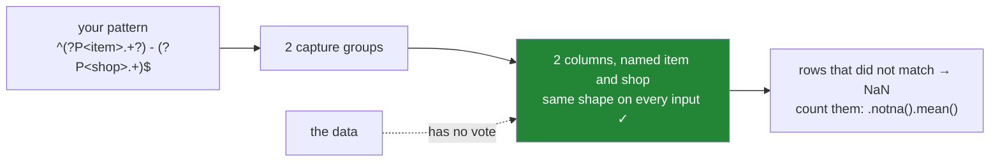

# 3.3 — `extract`, and the capture group

## One-line answer

`.str.extract` takes a description of what a line looks like, with brackets around the part you want
to keep, and returns one column per bracketed part — so the number and the names of the columns come
from **your description** rather than from the widest row in the file.

---

## The story

The flat has now tried twice to get the shop out of the shopping file, and both attempts have been
undone by the same thing: they were counting.

The first attempt cut every line at the dash and kept the second piece. That broke on the line where
somebody typed only `eggs`, because there is no second piece. The second attempt cut once and kept
two columns, which was steadier, but it broke again the month somebody wrote `tea - corner shop -
refill`, because "the second piece" and "the shop" had stopped being the same thing.

One of them, getting tired of this, says the obvious thing out loud. *We keep telling it where to cut.
Why don't we just tell it what a line looks like?*

Which is how anybody would explain the file to a person. A line is an item, then a dash with a space
either side, then a shop. The shop is the bit after the dash. You would never say "the shop is the
second piece" to a friend, because that is not what you mean — it is just what you happened to type
last time.

---

## The idea in plain language

To describe what a line looks like you need a way of writing the description down. That way of writing
is called a **regular expression** — usually shortened to *regex*, and sometimes just called a
*pattern*.

A regular expression is a small language for describing the shape of a piece of text. Most characters
in it stand for themselves: the pattern `bakery` describes the six letters `bakery`. A handful of
characters mean something else, and four of them carry this whole document:

- `.` means *any one character*.
- `+` means *one or more of the thing before it*, so `.+` means "one or more characters, of any kind".
- `^` means *the start of the value* and `$` means *the end of it*, so a pattern with both must
  describe the whole line rather than a piece of it.
- `(` and `)` mark a **capture group**: the part of the description whose matching text you want
  handed back to you.

The exact meaning of every one of these characters is fixed by the Python standard library's
regular-expression module — *re — Regular expression operations*, the Python 3 standard library
reference, checked 2026-09-08, <https://docs.python.org/3/library/re.html> — which is the page to
keep open, because pandas hands your pattern to that module unchanged.

The capture group is the idea worth slowing down for. A pattern has two jobs, and the brackets are how
you separate them. `^.+? - (.+)$` says: the line starts, there is some text, then a space-dash-space,
then **the bit I want**, then the line ends. The whole pattern has to match, but only the bracketed
part comes back. That is why the parentheses are not decoration and not grouping-for-readability —
they are the answer to "which piece?".

`Series.str.extract(pattern)` runs that description against every value and gives you back **one
column per capture group**. Two groups, two columns. Nine hundred rows or nine, the answer is two
columns, because the pattern says two and the data does not get a vote. That is the entire difference
from [3.2](3.2-expand-and-the-columns-you-get.md), where the width came from the widest row.

Two more pieces of vocabulary and the mechanism will read cleanly.

**A named group** is written `(?P<shop>.+)`. It behaves exactly like `(.+)` except that the resulting
column is called `shop` instead of `1`. That is the version you keep, and it is worth being firm about
why: a pattern with three unnamed groups produces columns `0`, `1` and `2`, and six months later
nobody can tell you which is which without re-reading the regex character by character.

**A non-capturing group** is written `(?:...)`. It groups part of the pattern without keeping it, for
the times you need brackets to hold a piece of the description together but do not want a column out
of it.

And one behaviour that is not vocabulary but bites immediately: `+` is **greedy**. `.+` takes as much
text as it possibly can and only gives characters back if the rest of the pattern cannot otherwise
match. Writing `.+?` instead makes it **lazy** — it takes as little as it can. On a line with one dash
the two behave identically. On a line with two dashes they give different answers, and neither of them
warns you.

---

## Why Setu needs it

- **[3.4](3.4-the-pattern-that-matched-nothing.md)** is the failure this tool makes possible: a
  pattern that matches nothing returns a full column of blanks and no error at all. You cannot read
  that part until you can read a pattern, which is this one.
- **[7.1](../07-the-module/7.1-the-textdate-module.md)** wraps `.str.extract` in a function that
  refuses to return a column that mostly failed to match.
- **[4.2](../04-the-dt-accessor/4.2-to-datetime-format-and-errors.md)** does the same job for
  timestamps with `format=`, which is a description of what a date looks like. The two arguments are
  the same idea: say the shape, do not count the pieces.
- **Day 34**'s data-quality report pulls structured fields out of free text — an order id, a unit, a
  country code — and every one of those is a named group.
- **Day 162**'s document loader has to find headings and section numbers inside raw text before it can
  chunk it, and **Day 111** builds model features out of product titles. Both are this call, on
  hundreds of thousands of rows.
- [Day 7, 4.3](../../../day-07-strings/parts/04-normalising/4.3-methods-before-regex.md) argued that a
  string method beats a regex when a string method will do, and that argument still holds. A regex is
  the right tool here precisely because "the bit after the first dash, when there is one" is not a
  method.

---

## The mechanism

The same eight receipts as [3.1](3.1-split-and-the-list-in-a-cell.md) and
[3.2](3.2-expand-and-the-columns-you-get.md):

```python
import pandas as pd

entry = pd.Series(
    [
        "Milk - corner shop",
        "milk  - corner shop",
        "MILK - Corner Shop",
        "milk - market",
        "Bread - bakery",
        "bread — bakery",
        "eggs",
        "rice - market",
    ],
    name="entry",
)
frame_out = entry.str.extract(r" - (.+)$")
series_out = entry.str.extract(r" - (.+)$", expand=False)
print(frame_out)
print("columns:", list(frame_out.columns))
print()
print(series_out.tolist())
print("type :", type(series_out).__name__)
print("dtype:", series_out.dtype)
print("name :", series_out.name)
```

**Line by line:**

- `r" - (.+)$"` is a **raw string** — the `r` prefix stops Python treating backslashes as escapes
  ([Day 7, 1.3](../../../day-07-strings/parts/01-text/1.3-escapes-and-raw-strings.md)). There is no
  backslash in this particular pattern, but every regex gets one eventually, and the habit of writing
  `r"..."` for patterns costs nothing and saves an evening.
- The pattern reads: a space, a hyphen, a space, then **keep** one or more characters, then the end of
  the value. It does not start with `^`, so it is allowed to match part-way through the line, which is
  what lets it find the dash wherever it is.
- `.str.extract(...)` with no `expand=` returns a **DataFrame**, even for one group. That is the
  default, and it surprises people who expected a column.
- `expand=False` asks for a Series instead, and it is honoured only when the pattern has exactly one
  group.
- `series_out.name` is printed because it is not what you would guess.

```text
             0
0  corner shop
1  corner shop
2  Corner Shop
3       market
4       bakery
5          NaN
6          NaN
7       market
columns: [0]

['corner shop', 'corner shop', 'Corner Shop', 'market', 'bakery', nan, nan, 'market']
type : Series
dtype: str
name : entry
```

**The dtype is `str`, and the non-matching rows are `NaN`.** Rows 5 and 6 — the long dash and the bare
`eggs` — do not contain a space-hyphen-space anywhere, so the pattern does not match and pandas writes
a missing value. That is the same honest answer `expand=True` gave in
[3.2](3.2-expand-and-the-columns-you-get.md), and it is visible to a blank count
([Day 30, 2.1](../../../day-30-missing-data/parts/02-finding-it/2.1-isna-and-notna.md)).

**The Series is called `entry`, not `shop`.** With `expand=False` the group's identity is thrown away
and the result inherits the *input* column's name. So the one-group shortcut costs you exactly the
thing you were trying to gain. Naming the group fixes it:

```python
both = entry.str.extract(r"^(?P<item>.+?) - (?P<shop>.+)$")
print(both)
print()
print(both.dtypes)
print("shop matched:", both["shop"].notna().mean())
print()
print(entry.str.extract(r"^(?:.+?) - (?P<shop>.+)$").head(3))
```

**Line by line:**

- `^` and `$` now anchor both ends, so the pattern must describe the **whole** value. An anchored
  pattern is a stronger claim than an unanchored one: it fails on a line that has extra text around
  the part you expected, instead of quietly matching the middle of it.
- `(?P<item>.+?)` is a named group called `item`, holding one or more characters, **lazily** — as few
  as it can get away with. Lazy is deliberate here and the next block shows why.
- ` - ` between the two groups is the separator, written literally.
- `(?P<shop>.+)` is a named group called `shop`, greedy, taking everything to the end of the line.
- Two groups means two columns, and because they are named the columns are called `item` and `shop`.
  Nothing needs renaming afterwards, which is the whole reason to prefer this over
  [3.2](3.2-expand-and-the-columns-you-get.md)'s `set_axis`.
- `.notna().mean()` is the **match rate** — the share of rows the pattern actually matched. It is one
  short expression and it is the single most useful number on this page;
  [3.4](3.4-the-pattern-that-matched-nothing.md) is about what happens when nobody computes it.
- The last line replaces the first group with `(?:.+?)`, a non-capturing group. Same match, same rows,
  but only one column comes back.

```text
    item         shop
0   Milk  corner shop
1  milk   corner shop
2   MILK  Corner Shop
3   milk       market
4  Bread       bakery
5    NaN          NaN
6    NaN          NaN
7   rice       market

item    str
shop    str
dtype: object

shop matched: 0.75

          shop
0  corner shop
1  corner shop
2  Corner Shop
```

**Two named columns, and a match rate of 0.75.** Six of the eight lines matched; the long-dash line
and the bare `eggs` did not. Note that row 1's item is still `milk ` with its trailing space — the
pattern was asked for "everything before the separator" and that is what it gave. Extracting a field
and normalising a field are two different jobs, and the normalising one is
[2.1](../02-cleaning-names/2.1-four-spellings-of-milk.md).

Now the greedy trap, on the tea line:

```python
tea = pd.Series(["tea - corner shop - refill", "Milk - corner shop", "eggs"], name="entry")
print("lazy   .+?")
print(tea.str.extract(r"^(?P<item>.+?) - (?P<shop>.+)$"))
print()
print("greedy .+")
print(tea.str.extract(r"^(?P<item>.+) - (?P<shop>.+)$"))
```

**Line by line:**

- The two patterns differ by **one character**: `.+?` in the first group against `.+` in the second
  pattern. Everything else is identical.
- The lazy `.+?` takes as little as it can, so it stops at the *first* separator and the rest of the
  line goes to `shop`.
- The greedy `.+` takes as much as it can, so it runs to the end and then backs up only far enough to
  let the rest of the pattern match — which lands it on the *last* separator.
- The `eggs` row is in both frames so that the no-match answer stays visible next to the two different
  match answers.

```text
lazy   .+?
   item                  shop
0   tea  corner shop - refill
1  Milk           corner shop
2   NaN                   NaN

greedy .+
                item         shop
0  tea - corner shop       refill
1               Milk  corner shop
2                NaN          NaN
```

**One character, two different tables, no warning.** Lazy is `split(n=1)` and greedy is `rsplit(n=1)`
from [3.2](3.2-expand-and-the-columns-you-get.md) — the same choice, spelled differently. The rows
that only ever contain one separator agree under both, which is exactly why this bug reaches
production: it is invisible until the day a value contains two.

Finally, the version that finds every match rather than the first:

```python
print(entry.str.extractall(r" - (?P<shop>.+)$"))
print()
print("index names:", entry.str.extractall(r" - (?P<shop>.+)$").index.names)
print("rows in    :", len(entry))
print("rows out   :", len(entry.str.extractall(r" - (?P<shop>.+)$")))
```

**Line by line:**

- `.str.extractall` returns one row per **match**, not one row per input row. A value with three
  matches contributes three rows; a value with none contributes nothing at all.
- The result's index has two levels: the original row label, and a second level called `match`
  numbering the matches within that row from `0`.
- `index.names` is printed because the first level keeps its original name — here `None`, since the
  input index was the default range — and the second is always `match`.
- The two row counts are printed side by side because they are not equal, and that inequality is the
  thing to remember about this method.

```text
                shop
  match
0 0      corner shop
1 0      corner shop
2 0      Corner Shop
3 0           market
4 0           bakery
7 0           market

index names: [None, 'match']
rows in    : 8
rows out   : 6
```

**Eight rows in, six rows out.** Rows 5 and 6 have vanished — not blank, *gone*. `extractall` is the
right tool when a value genuinely holds several things (every hashtag in a message, every id in a log
line), and it is the wrong tool for a field with one value per row, because it silently changes your
row count. `extract` keeps eight rows and marks two of them missing; `extractall` keeps six rows and
tells you nothing.

Where the columns come from:



---

## When it breaks

**Brackets you forgot:**

```text
$ uv run python -c "
import pandas as pd
entry = pd.Series(['Milk - corner shop', 'eggs'])
entry.str.extract(r' - .+$')
"
Traceback (most recent call last):
  File "<string>", line 4, in <module>
  File "...\pandas\core\strings\accessor.py", line 142, in wrapper
    return func(self, *args, **kwargs)
           ^^^^^^^^^^^^^^^^^^^^^^^^^^^
  File "...\pandas\core\strings\accessor.py", line 3422, in extract
    raise ValueError("pattern contains no capture groups")
ValueError: pattern contains no capture groups
```

**What it means.** The pattern describes the line but never says which part to keep, so there is
nothing for `extract` to return. This is a good error: it is raised before any work happens and it
names the exact omission. The fix is a pair of brackets around the piece you want, ideally a named
pair: `r" - (?P<shop>.+)$"`.

**Brackets you did not close:**

```text
$ uv run python -c "
import pandas as pd
entry = pd.Series(['Milk - corner shop', 'eggs'])
entry.str.extract(r'^(?P<item>.+? - (?P<shop>.+)$')
"
Traceback (most recent call last):
  File "<string>", line 4, in <module>
  File "...\pandas\core\strings\accessor.py", line 142, in wrapper
    return func(self, *args, **kwargs)
           ^^^^^^^^^^^^^^^^^^^^^^^^^^^
  File "...\pandas\core\strings\accessor.py", line 3420, in extract
    regex = re.compile(pat, flags=flags)
            ^^^^^^^^^^^^^^^^^^^^^^^^^^^^
  ... five more frames, all inside Python's own re module ...
  File "...\Lib\re\_parser.py", line 864, in _parse
    raise source.error("missing ), unterminated subpattern",
re.error: missing ), unterminated subpattern at position 1
```

**What it means.** The closing bracket of the `item` group is missing, so the pattern is not a valid
description of anything. Notice where the traceback goes: pandas gets exactly one line in, at
`re.compile`, and everything after that is Python's own `re` module. pandas hands your pattern
straight to `re`, so a broken pattern is a Python error rather than a pandas one, and `position 1`
counts characters into the **pattern**, not into your data.

**The argument that is quietly ignored:**

```text
$ uv run python -c "
import pandas as pd
entry = pd.Series(['Milk - corner shop', 'eggs'])
out = entry.str.extract(r'^(?P<item>.+?) - (?P<shop>.+)$', expand=False)
print(type(out).__name__)
print(out)
"
DataFrame
   item         shop
0  Milk  corner shop
1   NaN          NaN
```

**Nothing raised, and `expand=False` did nothing.** With more than one capture group there is no
single column to return, so pandas returns a DataFrame regardless of what you asked for. If your next
line calls a Series method on that result — `.str.lower()`, say — it fails somewhere else entirely,
with a message about the DataFrame that never mentions `expand`.

**The smallest fix is to stop passing `expand=False` at all.** Let `extract` return a frame, name your
groups, and select the column you want by its name: `out["shop"]`. That is one more character than
`expand=False` and it behaves identically whether the pattern has one group or five.

---

## In production

**What a professional writes instead of the teaching version.** The pattern becomes a named constant
at module level, with named groups, and it is used in exactly one place:

```python
import pandas as pd

ENTRY_PATTERN = r"^(?P<item>.+?) - (?P<shop>.+)$"


def parse_entry(values: pd.Series) -> pd.DataFrame:
    """Split a free-text entry into item and shop, marking the lines that did not parse."""
    if values.dtype != "str":
        raise TypeError(f"{values.name!r} is {values.dtype}, not str")
    return values.str.extract(ENTRY_PATTERN)
```

**Line by line:**

- `ENTRY_PATTERN` is a module constant because a regex written inline is a regex that gets copied.
  Two copies drift, and the day one of them learns about the long dash and the other does not, two
  parts of the same pipeline disagree about what a shop is.
- The name says what the pattern parses, not what it contains. `ENTRY_PATTERN` survives a rewrite of
  the regex; `DASH_SPLIT_RE` does not.
- Named groups mean the returned frame arrives with real column names, so there is no rename step and
  no window in which a frame with columns `0` and `1` exists.
- The dtype check is first, for the reason it always is: the failure should name the caller's column
  ([1.1](../01-the-str-accessor/1.1-the-column-that-has-no-lower.md)).
- **This function is not finished.** It returns a column of blanks without complaint when the pattern
  stops matching, and adding the check that fixes that is
  [3.4](3.4-the-pattern-that-matched-nothing.md).

**What degrades at scale.** Less than you would guess. On a million entries built with a seeded
generator from four items and three shops:

| Call | Time | Columns out |
|---|---|---|
| `.str.extract(ENTRY_PATTERN)`, two named groups | 1.593 s | `item`, `shop` |
| `.str.split(" - ", expand=True)` | 2.568 s | `0`, `1` |

**The pattern is faster than the split**, which is the opposite of what most people expect from
"regex is slow". Both run the per-value work in compiled code; `extract` walks each value once with a
compiled pattern, while `split` builds intermediate structures before laying them out sideways.

The regex cost that does bite is a pattern that backtracks. `.+` is greedy, so on a long value it
first swallows the whole thing and then walks backwards looking for the separator. On the flat's short
lines that is invisible. On a description field of several thousand characters, a pattern with two
greedy `.+` groups around a separator does far more work per row than one with `[^-]+` — which cannot
overshoot in the first place, because it is defined as "characters that are not a hyphen". If a regex
is unexpectedly slow, the greedy wildcards are the first thing to look at.

**The failure that only appears with real data.** A log parser pulled a request id out of lines with
`^(?P<ts>.+) (?P<level>\w+) (?P<msg>.+)$`. It was correct for two years. Then a service started
emitting messages that themselves contained a timestamp, and the greedy `.+` on `ts` ran past the real
timestamp to the one inside the message. Every field shifted one token to the right. The rows still
looked plausible — a timestamp, a level, a message — so no null check fired and no schema check fired,
and the dashboard's error rate dropped to almost zero because `level` now held the wrong word. The fix
was one character: `.+` became `.+?`.

**The review comment a senior engineer leaves.** *"Unnamed groups here, so this frame has columns `0`
and `1` and the next reader has to parse the regex to find out which is which — use `(?P<item>…)` and
`(?P<shop>…)`. And `.+` on the first group is greedy: on a value with two separators it silently keeps
the wrong half. Make it `.+?` and say in the docstring which end of the field you are trusting."*

**The interview question.** *"What does `Series.str.extract` return, and what decides its shape?"* A
DataFrame with one column per capture group in the pattern — so the shape is decided by the pattern
and not by the data, which is the reason to prefer it over `split(expand=True)` on a field whose piece
count varies. Then the follow-up that separates people who have used it from people who have read
about it: **what is the difference between `extract` and `extractall` on a frame you are about to
join?** `extract` returns one row per input row, marking the non-matching ones `NaN`, so the row count
is preserved and the misses are countable. `extractall` returns one row per match on a two-level
index, so rows with no match disappear and rows with several are duplicated — and a join against that
result silently changes the row count of whatever it touches
([Day 32, 3.1](../../../day-32-joining-and-reshaping/parts/03-the-row-count/3.1-count-the-rows-before-and-after.md)).

---

## Check yourself

```bash
uv run python -c "
import pandas as pd
entry = pd.Series(['Milk - corner shop', 'bread — bakery', 'eggs', 'tea - corner shop - refill'])
print(entry.str.extract(r'^(?P<item>.+?) - (?P<shop>.+)\$'))
print()
print(entry.str.extract(r'^(?P<item>.+) - (?P<shop>.+)\$'))
print()
print('match rate :', entry.str.extract(r'^(?P<item>.+?) - (?P<shop>.+)\$')['shop'].notna().mean())
print('extract    :', len(entry.str.extract(r' - (?P<shop>.+)\$')))
print('extractall :', len(entry.str.extractall(r' - (?P<shop>.+)\$')))
"
```

Four lines of text. Say which row is the only one where the two patterns disagree, and say why the
last two numbers are different.

**Answer out loud, without scrolling up:**

> What decides how many columns `.str.extract` returns, and what are those columns called? Then say
> what happens to a row the pattern does not match, and why that answer is better than the one
> `extractall` gives.

---

**Next:** [3.4 — The pattern that matched nothing](3.4-the-pattern-that-matched-nothing.md).
