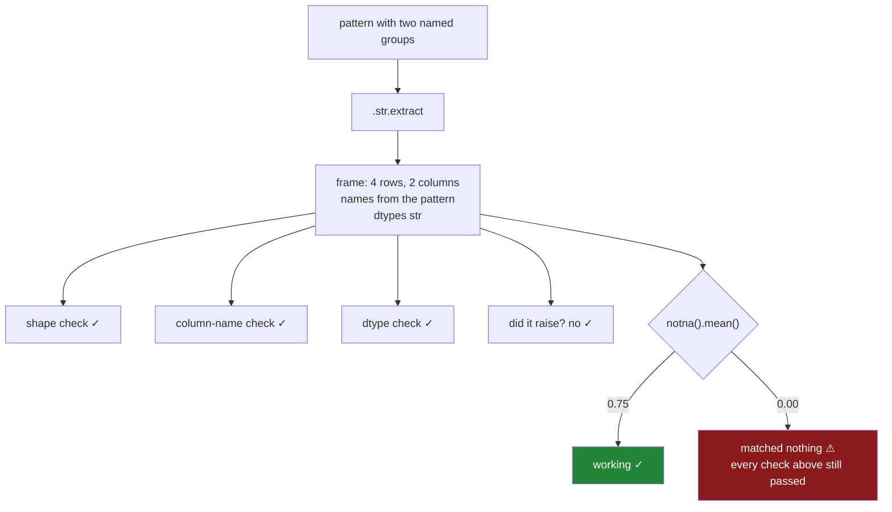

# 3.4 — The pattern that matched nothing

## One-line answer

A pattern that matches no row does not raise: `.str.extract` returns a frame with the right number of
rows, the right column names and the right dtypes, entirely full of blanks — so the only check that
can tell success from total failure is the **share of rows that matched**, asserted against a floor.

---

## The story

The flat's shop column works. [3.3](3.3-extract-and-the-capture-group.md) got there: a pattern with
two named brackets, three of the four lines matched, and the one that did not is the line that
genuinely has no shop in it.

Then the month rolls over and somebody buys a new phone.

The new phone's notes app is helpful. When you type a dash with spaces around it, it tidies it into a
proper dash — the longer one a printer would use. It looks better. It is, by any reasonable standard,
an improvement.

Every line that person writes now reads `bread — bakery` with the long dash, and the pattern is
looking for the short one.

Nothing breaks. The script runs on the first of the month like it always does. The shop column is
still there, still called `shop`, still exactly as many rows as there are receipts. The monthly
summary is generated and mailed round, and where it used to say which shop the flat spends most at,
it now says nothing at all — not zero, not an error, just a section with no rows under the heading.

Nobody mentions it. It is the section nobody reads. Four months later somebody wants to know whether
the corner shop is worth it, opens the report, and finds that the answer has not been computed since
February.

---

## The idea in plain language

Every check most people run on a frame asks about its **shape**, and a failed extract has a perfect
shape.

Go through them. Did it return a frame? Yes. Does it have the right number of rows? Yes — one per
input row, always, because `.str.extract` returns one row per input row whether it matched or not.
Does it have the columns you asked for, with the names from your brackets? Yes — the column names come
from the *pattern*, not from the data, so they exist even when nothing matched. Are the dtypes right?
Yes. Did anything raise? No.

The only thing that changed is the **contents**, and the contents are missing values, which are not an
error condition — they are a legitimate value that means "not known"
([Day 30, 1.2](../../../day-30-missing-data/parts/01-what-missing-means/1.2-nan-the-number-not-equal-to-itself.md)).

And missing values are *quiet by design*. `groupby` drops them, so a report grouped by a blank column
has no rows rather than a row saying "unknown". `nunique()` does not count them, so a distinct count
comes back as `0`. `mean()` skips them. Every one of those behaviours is correct and useful in
isolation, and together they mean a totally failed extract produces an empty report instead of a loud
one.

So the single number that separates *worked* from *did nothing at all* is:

**the share of rows the pattern matched.**

`out["shop"].notna().mean()` — the proportion of non-blank values, between `0.0` and `1.0`. It is one
line, it is cheap, and it is the only thing in this document that would have caught the new phone.

Three points about using it, because a check that is wrong is worse than no check.

**Use a share, not a count.** A count that is "about right" today is meaningless next year when the
file has ten times the rows. A share holds its meaning as the data grows, which is the same argument
[2.4](../02-cleaning-names/2.4-the-mismatch-that-costs-rows.md) made about join match rates.

**Do not set the floor at 1.0.** Real text has genuine exceptions — the flat's `eggs` line has no
shop and never will. A check that demands every row match will fire on day one, and a check that
fires when nothing is wrong gets switched off. Set the floor just below what you actually observe,
and treat a drop as an event.

**The floor is a policy, so it belongs where policy lives.** `MIN_MATCH_RATE` as a module constant,
not a number buried in a call. That way changing it is a visible edit in a diff, which is the only
defence against the failure at the end of this part.

---

## Why Setu needs it

- **[3.3](3.3-extract-and-the-capture-group.md)** built the pattern. This part is the assertion
  without which that pattern is unmonitored, and it is the reason `extract_field` exists at all.
- **[7.1](../07-the-module/7.1-the-textdate-module.md)** implements `extract_field` with exactly this
  check, and **[7.2](../07-the-module/7.2-the-test-that-can-go-red.md)** writes the test the hub calls
  "the one nobody writes".
- **[2.4](../02-cleaning-names/2.4-the-mismatch-that-costs-rows.md)** is the same failure with a join
  instead of a pattern: a silent operation whose only symptom is a share you did not measure.
- **[4.2](../04-the-dt-accessor/4.2-to-datetime-format-and-errors.md)** meets it again as
  `errors="coerce"`, which turns every unparseable timestamp into a blank — the identical trade of a
  loud failure for a quiet one.
- **Day 34**'s quality report is built on the idea this part introduces: a column's usefulness is a
  number, and it is checked rather than assumed.
- **Day 111**'s monitoring and **Day 162**'s document parsing both extract fields from text that
  changes upstream without warning. Match rate is the metric that notices, and this is where it
  starts.

---

## The mechanism

The flat's four entries, and two patterns that differ by one character.

```python
import pandas as pd

entry = pd.Series(
    ["Milk - corner shop", "bread - bakery", "eggs", "tea - corner shop - refill"],
    dtype="str",
    name="entry",
)
good = entry.str.extract(r"^(?P<item>.+?) - (?P<shop>.+)$")
bad = entry.str.extract(r"^(?P<item>.+?) : (?P<shop>.+)$")
print(good)
print("shape:", good.shape, " match rate:", good["shop"].notna().mean())
print()
print(bad)
print("shape:", bad.shape, " match rate:", bad["shop"].notna().mean())
```

**Line by line:**

- The pattern is [3.3](3.3-extract-and-the-capture-group.md)'s, unchanged: `.+?` is the non-greedy
  item, `(?P<shop>.+)` is the named group that takes everything after the separator, and `^` and `$`
  anchor it to the whole value.
- The two patterns differ **only** in the separator — a dash against a colon. That is deliberately the
  smallest possible change, because the real-world version of this is a dash becoming a longer dash,
  which is smaller still and invisible in a diff.
- `bad` stands in for the new phone. Nothing about it is malformed; it is a perfectly good pattern
  that this data happens never to satisfy.
- `.shape` and the match rate are printed for both, side by side. The whole argument of this part is
  that one of those two numbers moves and the other does not.

```text
    item                  shop
0   Milk           corner shop
1  bread                bakery
2    NaN                   NaN
3    tea  corner shop - refill
shape: (4, 2)  match rate: 0.75

  item shop
0  NaN  NaN
1  NaN  NaN
2  NaN  NaN
3  NaN  NaN
shape: (4, 2)  match rate: 0.0
```

**Both frames are `(4, 2)`.** Same rows, same columns, same names — and `item` and `shop` are named
in the *pattern*, so they would exist even if the input had been a column of empty strings.

`0.75` against `0.0` is the only difference any check can see. One pattern found three shops; the
other found none; and every structural assertion you might write passes identically for both.

Now what the downstream report does with the failed one, which is the part that makes it invisible:

```python
print("groupby on the failed extract:")
print(bad.groupby("shop").size())
print()
print("nunique :", bad["shop"].nunique())
print("isna    :", bad["shop"].isna().sum(), "of", len(bad))
print("dtypes match good:", list(bad.dtypes) == list(good.dtypes))
print("columns match good:", list(bad.columns) == list(good.columns))
```

**Line by line:**

- `groupby("shop").size()` is the monthly summary from the story — how many receipts per shop — run
  against the failed column.
- `nunique()` is the check somebody might write instead, and it is worth seeing that it does not save
  you: it counts distinct values and ignores blanks, so total failure reads as `0`.
- `isna().sum()` is the *inverse* of the match rate, printed as a count with the total beside it, which
  is the form that goes in an error message.
- The last two lines are the structural checks, run explicitly, to show them passing on the broken
  frame. That is not a rhetorical flourish — it is why a schema test in CI would have stayed green
  through all four months.

```text
groupby on the failed extract:
Series([], dtype: int64)

nunique : 0
isna    : 4 of 4
dtypes match good: True
columns match good: True
```

`Series([], dtype: int64)` — **an empty result, printed without complaint.** That is the section of
the report with nothing under the heading. `groupby` drops missing keys
([Day 31, 4.5](../../../day-31-groupby/parts/04-the-keys/4.5-observed-and-the-aisle-nobody-visited.md)),
so a column that is entirely missing produces no groups at all, and an empty table renders as an
empty table rather than as a failure.

And the two structural checks both say `True` on the frame that contains nothing.

The check that works:

```python
MIN_MATCH_RATE = 0.7


def shop_of(entries: pd.Series, pattern: str) -> pd.Series:
    """Pull the shop out of each entry, refusing a pattern that matched too few rows."""
    out = entries.str.extract(pattern)
    rate = float(out["shop"].notna().mean())
    if rate < MIN_MATCH_RATE:
        raise ValueError(f"match rate {rate:.1%} below {MIN_MATCH_RATE:.0%} for {pattern!r}")
    return out["shop"]


print("good:", shop_of(entry, r"^(?P<item>.+?) - (?P<shop>.+)$").tolist())
try:
    shop_of(entry, r"^(?P<item>.+?) : (?P<shop>.+)$")
except ValueError as e:
    print("bad :", e)
```

**Line by line:**

- `MIN_MATCH_RATE = 0.7` is a module-level constant, above the function. It is `0.7` and not `1.0`
  because the `eggs` row legitimately has no shop, so the honest ceiling on this data is `0.75` and a
  floor above that would fire every single run.
- `float(...)` around the mean because `notna().mean()` returns a NumPy scalar; converting it makes
  the value an ordinary Python float, which formats predictably and compares without surprises.
- The message carries **the rate, the floor and the pattern**. All three are needed: the rate says how
  bad, the floor says what was expected, and the pattern is the thing somebody has to go and look at.
  An error saying "extraction failed" would send a person to read the whole script.
- `raise` rather than `warn`. A warning here is the same as no check — the four months in the story
  are what a warning in a scheduled job looks like.
- The `try` block is in the teaching code only, to show both outcomes in one run. Real calling code
  lets it propagate and fail the job.

```text
good: ['corner shop', 'bakery', nan, 'corner shop - refill']
bad : match rate 0.0% below 70% for '^(?P<item>.+?) : (?P<shop>.+)$'
```

Nine lines, and the story cannot happen.



---

## When it breaks

**The pattern with no brackets, which is the one that does raise:**

```text
$ uv run python -c "
import pandas as pd
e = pd.Series(['Milk - corner shop', 'eggs'], dtype='str')
print(e.str.extract(r'^.+ - .+$'))
"
ValueError: pattern contains no capture groups
```

**What it means.** `.str.extract` returns a column per **capture group**, so a pattern with none
describes no output at all. It is a good error and it is worth noticing how narrow it is: pandas
checks that your pattern *could* produce columns, and never checks whether it *did* produce values.
The structural mistake raises; the empirical one does not.

**The group you forgot to name:**

```text
$ uv run python -c "
import pandas as pd
e = pd.Series(['Milk - corner shop', 'eggs'], dtype='str')
out = e.str.extract(r'^(.+) - (.+)$')
print(out)
print('columns:', list(out.columns))
print(out['shop'])
"
       0            1
0   Milk  corner shop
1    NaN          NaN
columns: [0, 1]
KeyError: 'shop'
```

**What it means.** Unnamed groups produce columns called `0` and `1` — integers, not strings. The
`KeyError` arrives later, wherever somebody first asks for the name they assumed. This one is
harmless because it is loud, but it explains why [3.3](3.3-extract-and-the-capture-group.md) insisted
on `(?P<name>...)`: a named group makes the column name part of the pattern, so the two cannot drift
apart.

**The floor that was quietly lowered:**

```text
$ uv run python -c "
import pandas as pd
entry = pd.Series(['Milk - corner shop', 'bread - bakery', 'eggs', 'tea - shop'], dtype='str')
for floor in (0.99, 0.7, 0.1):
    rate = entry.str.extract(r'^(?P<item>.+?) - (?P<shop>.+)\$')['shop'].notna().mean()
    print(f'floor {floor}: rate {rate:.2f} -> {\"raise\" if rate < floor else \"pass\"}')
"
floor 0.99: rate 0.75 -> raise
floor 0.7: rate 0.75 -> pass
floor 0.1: rate 0.75 -> pass
```

**Nothing raised, and this is the failure no test can catch.** The check is present, the code is
correct, and the number that decides whether it protects anything is a constant somebody can change
in one character. Drop the floor to `0.1` and a pattern finding a tenth of its rows sails through —
every test still green, every function still working exactly as documented.

That is the mutation the hub names in §5, and its defences are not tests of behaviour: they are a test
that asserts the **constant's value**, and a review culture that reads a threshold change as a policy
change rather than as tuning.

---

## In production

**What a professional writes instead of the teaching version.** The general form, which is
[7.1](../07-the-module/7.1-the-textdate-module.md)'s `extract_field` — one field, one named group, one
floor, and an error a person can act on at three in the morning:

```python
import pandas as pd

MIN_MATCH_RATE = 0.99


class TextDateError(ValueError):
    """A text or time column arrived in a state this module refuses to work on."""


def extract_field(
    series: pd.Series, pattern: str, name: str, *, min_match_rate: float = MIN_MATCH_RATE
) -> pd.Series:
    """Extract one named group from `series`, refusing a pattern that matched too few rows."""
    out = series.str.extract(pattern)
    if name not in out.columns:
        raise TextDateError(f"{pattern!r} has no group named {name!r}; got {list(out.columns)}")
    field = out[name]
    rate = float(field.notna().mean())
    if rate < min_match_rate:
        missed = series[field.isna()].head(3).tolist()
        raise TextDateError(
            f"{name}: match rate {rate:.1%} below {min_match_rate:.1%}; "
            f"{int(field.isna().sum())} of {len(series)} unmatched, e.g. {missed}"
        )
    return field
```

**Line by line:**

- The group-name check runs **before** the rate check and prints the columns it did get. That converts
  the `KeyError: 'shop'` above into a message naming both what you asked for and what the pattern
  actually produced, which is the difference between a minute and an hour.
- `min_match_rate` is keyword-only and defaults to the module constant rather than to a literal, so
  there is exactly one place the policy is written down and a call site can still override it for a
  column that is genuinely sparse.
- `field.notna().mean()` and not `len(field.dropna()) / len(field)`. Same number, and the first cannot
  divide by zero on an empty input.
- **`missed` is the part that matters operationally.** Three unmatched values, in the message. A rate
  tells you something broke; three examples tell you *what* — one look at `bread — bakery` with the
  long dash and the cause is obvious. Without them somebody has to reproduce the failure locally
  against production data, which is slow and often not allowed.
- `.head(3)` and not all of them, because an error message that dumps half a million rows into a log
  is its own outage.
- `TextDateError` subclasses `ValueError`, so existing `except ValueError` handlers still catch it
  while new code can be specific — the exception family the day's module shares with Day 28's
  `SelectionError`, Day 31's `GroupingError` and Day 32's `JoinError`.

**What degrades at scale.** Not the check. Five hundred thousand entries drawn from the flat's four
shapes with `np.random.default_rng(33)`:

```text
extract, two named groups         0.571 s   match rate 0.750
extract, one named group          0.423 s   match rate 0.750
extract, pattern matches nothing  0.406 s   match rate 0.000
notna().mean() on the result      0.542 s
```

**Line by line:**

- The failing pattern is the **cheapest of the three**, because a pattern that fails at the separator
  abandons each value early. Failure is faster than success, so a job that quietly stopped extracting
  anything also got quicker — and "the nightly job is running faster than it used to" is not something
  anybody investigates.
- The match-rate check costs about as much as the extract itself, and the pair still runs in about a
  second on half a million rows. There is no performance argument against checking.
- Each group adds real work — roughly 150 ms for the second one here — so extract the fields you need
  rather than every field the line contains.

The thing that genuinely degrades is the **floor**. On four rows, `0.75` is a fact you can see. On
five hundred thousand rows from a dozen upstream sources, the observed rate drifts as the mix of
sources changes, and a fixed floor eventually either fires constantly or protects nothing. What
mature systems do is record the rate as a **metric** every run and alert on the change rather than on
the level — a rate that drops from `0.99` to `0.91` overnight is an incident even though `0.91` is
comfortably above any floor anybody would have written.

**The failure that only appears with real data.** A logistics company parsed tracking codes out of
carrier emails with a regular expression and a `0.95` floor. It held for two years. Then a carrier
began sending the code inside an HTML table instead of in the body text, for about four per cent of
shipments — so the rate went to `0.96` and the check stayed green while one carrier's shipments
stopped being tracked entirely. The floor was global; the failure was per-carrier. The fix was to
compute the match rate **grouped by source** and alert on the worst group rather than on the average,
because an average over a healthy majority hides a total failure in a minority. That is the same
lesson [2.4](../02-cleaning-names/2.4-the-mismatch-that-costs-rows.md) taught about money: the rows
that fail are never a random sample.

**The review comment a senior engineer leaves.** *"`.str.extract` with no check on the result. If the
upstream format changes by one character this returns a full column of nulls, every shape assertion
in the test suite passes, and the report renders empty instead of failing. Assert the match rate
against a named constant, put three unmatched examples in the error, and log the rate every run so we
can see it move before it falls through the floor."*

**The interview question.** *"Your extraction job ran successfully and the report is empty. Walk me
through it."* Empty rather than wrong points at a column of nulls, and the fastest way to confirm is
`notna().mean()` on the extracted field — if it is `0.0`, the pattern stopped matching, and nothing
raised because a pattern that matches nothing returns a correctly shaped frame full of missing values.
Then the follow-up: **why did none of your tests catch it?** Because tests written against a fixture
assert shape, names and dtypes, and all three are properties of the pattern rather than of the data —
they are identical for a working extract and a completely failed one. The only assertion that
distinguishes them is empirical: the share of rows that matched, checked against a floor, on real
input.

---

## Check yourself

```bash
uv run python -c "
import pandas as pd
entry = pd.Series(['Milk - corner shop', 'bread - bakery', 'eggs', 'tea - corner shop - refill'], dtype='str')
good = entry.str.extract(r'^(?P<item>.+?) - (?P<shop>.+)\$')
bad  = entry.str.extract(r'^(?P<item>.+?) : (?P<shop>.+)\$')
print('shapes  :', good.shape, bad.shape)
print('columns :', list(good.columns) == list(bad.columns))
print('dtypes  :', list(good.dtypes) == list(bad.dtypes))
print('rates   :', good['shop'].notna().mean(), bad['shop'].notna().mean())
print('grouped :')
print(bad.groupby('shop').size())
print('nunique :', bad['shop'].nunique())
"
```

Three checks say the two frames are the same and one says they could not be more different. Say which
one, and say why `groupby` printed an empty table rather than a row saying "unknown".

**Answer out loud, without scrolling up:**

> Name three checks that pass identically on a working extract and on one that matched nothing. Then
> say which single number tells them apart, and why its floor should not be `1.0`.

---

**Next:** [4.1 — Text that looks like a date is not a date](../04-the-dt-accessor/4.1-text-that-looks-like-a-date.md).
