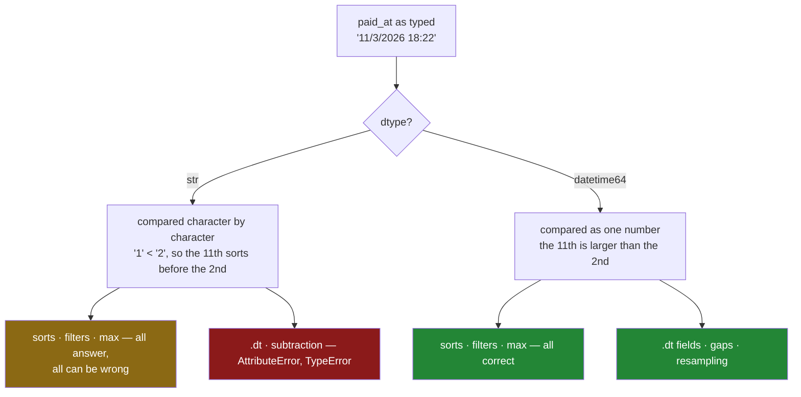

# 4.1 — Text that looks like a date is not a date

## One-line answer

A column of date-shaped text is still a column of text: it orders itself character by character
rather than by time, it cannot be subtracted, and it has no `.dt` — so any answer it gives you about
*when* is being carried entirely by the shape of the string, and it stops being true the day the
shape changes.

---

## The story

Four people share a flat and take turns doing the shopping. Whoever goes types what they bought into
the shared file on their phone, with the price and when they paid.

At the end of the month one of them wants a small, harmless thing: the last three shops, so they can
work out whose turn it is next. The file has a column with the date and time in it, so they sort by
that column and read off the bottom three lines.

They get eggs on the 5th, milk on the 8th, bread on the 9th.

That is wrong, and it is wrong in a way nobody looking at the screen would catch. The last three
shops were bread on the 9th, rice on the 10th and milk on the 11th. The 10th and the 11th are in the
file. They are just not at the bottom, because they were sorted into the middle — between the 1st and
the 2nd.

Nothing raised. Nothing printed a warning. The sort did exactly what it was asked to do. It was asked
the wrong question, and the reason is that the column of dates was never a column of dates.

---

## The idea in plain language

Two things are being confused, and they look identical on screen.

The first is a **string**: one piece of text, a run of characters. `"11/3/2026 18:22"` is fifteen
characters. To a computer it is fifteen characters and nothing more. It does not know that `11` means
a day, that `3` means March, or that March comes after February.

The second is a **timestamp**: a single number that counts how far a moment is from a fixed instant
everybody agrees on. That is all a timestamp is — one number. Everything you might want to know from
it (the year, the hour, the day of the week) is worked out from that number when you ask, and
[4.3](4.3-the-fields-inside-a-timestamp.md) is about exactly that. Because it is a number, ordering
it means comparing numbers, and subtracting two of them gives you a gap.

Now the part that causes the flat's bug. When you put two strings in order, the rule is
**lexicographic**: compare the first character of each, and if they differ, that decides it; if they
are the same, move to the second character; and so on. It is how a dictionary is ordered.

Lexicographic order asks nothing about meaning. `"11/3/2026"` and `"2/3/2026"` are compared at their
first character: `1` against `2`. `1` comes before `2`, so the 11th of March sorts *before* the 2nd of
March. That is not a bug in the sort. That is the sort working correctly on the thing it was given.

Sometimes lexicographic order and time order agree. If every date is written as year, then month, then
day, with the bigger unit first and every field padded to a fixed width — `2026-03-01`, `2026-03-11` —
then comparing character by character happens to give the right answer, because the characters are in
the same order of importance as the units of time. That is a deliberate property of that written
format, and [4.2](4.2-to-datetime-format-and-errors.md) names the standard that specifies it. It is
not a property of text in general, and it is not something you get to rely on.

Two more terms, because they explain the error messages further down.

A **dtype** is the one type every value in a column shares. It was
[Day 26, 1.4](../../../day-26-frames-and-copy-on-write/parts/01-the-two-objects/1.4-one-dtype-per-column.md),
and it is the thing that decides what a column is allowed to do. A column whose dtype is `str` holds
text and offers text operations. A column whose dtype is `datetime64` holds timestamps and offers
time operations. Neither one offers the other's.

An **accessor** is a small doorway hanging off a column, holding the methods that only make sense for
one kind of data. You met the text one, `.str`, in
[1.1](../01-the-str-accessor/1.1-the-column-that-has-no-lower.md). The time one is `.dt`, and it opens
only on a column whose dtype is a timestamp dtype. On a text column it refuses, by name, before it
does anything.

So the flat's file has a column that a person reads as dates and pandas reads as text. Every question
that happens to work — sorting, filtering with `>`, taking the maximum — works by accident of spelling.
Every question that needs arithmetic does not work at all.

---

## Why Setu needs it

- **[4.2](4.2-to-datetime-format-and-errors.md)** is the fix: one call that turns the text into
  timestamps, and the arguments you have to pass so that it does not guess.
- **[4.3](4.3-the-fields-inside-a-timestamp.md)** shows what the timestamp gives you once you have it,
  and none of it is reachable while the column is text.
- **[5.1](../05-arithmetic-on-time/5.1-subtracting-two-timestamps.md)** subtracts two timestamps to get
  the gap between two shops. On text, that is the `TypeError` in *When it breaks* below.
- **[6.1](../06-resampling/6.1-the-index-that-has-to-be-time.md)** needs a time index before it can
  group by week at all, so this parse is the gate that section stands behind.
- **Day 34** builds a data-quality report over this frame. "Which columns are dates that are still
  text" is one of the rows that report exists to print.
- **Day 111** and every cohort day after it start with the same operation on far more rows. The habit
  of parsing once, at the boundary where the file is read, starts here.

---

## The mechanism

Here is the flat's file, exactly as it arrives.

```python
import pandas as pd

receipts = pd.DataFrame(
    {
        "item": ["Milk", "milk ", "MILK", "milk", "Bread", "bread ", "Eggs", "rice"],
        "paid_at": [
            "2026-03-01 08:12:30",
            "2026-03-04 19:40:05",
            "2026-03-08 11:05:00",
            "2026-03-11 18:22:47",
            "2026-03-02 09:31:12",
            "2026-03-09 17:58:40",
            "2026-03-05 12:04:19",
            "2026-03-10 20:11:03",
        ],
        "price": [1.15, 1.15, 1.20, 1.20, 1.40, 1.40, 2.30, 3.05],
    }
)
print(receipts.dtypes)
print()
print(receipts.sort_values("paid_at")["paid_at"].tolist())
```

**Line by line:**

- `"paid_at"` is a list of Python strings. Nothing here says "date". A **DataFrame** — the table of
  columns from
  [Day 26, 1.3](../../../day-26-frames-and-copy-on-write/parts/01-the-two-objects/1.3-a-table-of-columns.md)
  — stores what it is handed, and what it was handed is text.
- `receipts.dtypes` is the first thing to read, before any question about the data. It is the only
  place the difference between text and time is visible, because the printed values look the same
  either way.
- `sort_values("paid_at")` puts the rows in order of that column
  ([Day 29, 4.1](../../../day-29-iteration-and-order/parts/04-sorting/4.1-sort-values-the-order-you-asked-for.md)).
  It returns a new frame; the original is untouched.
- `.tolist()` is only so the output fits on one line. It is a reading tool, not a pipeline step.

```text
item           str
paid_at        str
price      float64
dtype: object

['2026-03-01 08:12:30', '2026-03-02 09:31:12', '2026-03-04 19:40:05', '2026-03-05 12:04:19', '2026-03-08 11:05:00', '2026-03-09 17:58:40', '2026-03-10 20:11:03', '2026-03-11 18:22:47']
```

`paid_at` is `str` — the dtype pandas 3.0 gives text
([Day 26, 2.2](../../../day-26-frames-and-copy-on-write/parts/02-the-str-dtype/2.2-str-the-dtype-pandas-3-infers.md)).
And the sort came out **right**: 1st, 2nd, 4th, 5th, 8th, 9th, 10th, 11th.

That correct answer is the dangerous part. It is correct because of how these particular strings are
spelled, not because pandas understood them.

Now the same eight receipts, typed by the flatmate whose phone writes the date the way people say it
out loud.

```python
import pandas as pd

uk = pd.DataFrame(
    {
        "item": ["milk", "milk", "milk", "milk", "bread", "bread", "eggs", "rice"],
        "paid_at": [
            "1/3/2026 08:12",
            "4/3/2026 19:40",
            "8/3/2026 11:05",
            "11/3/2026 18:22",
            "2/3/2026 09:31",
            "9/3/2026 17:58",
            "5/3/2026 12:04",
            "10/3/2026 20:11",
        ],
        "price": [1.15, 1.15, 1.20, 1.20, 1.40, 1.40, 2.30, 3.05],
    }
)
print(uk.sort_values("paid_at")["paid_at"].tolist())
print()
print("latest shop  :", uk["paid_at"].max())
print("earliest shop:", uk["paid_at"].min())
print()
print(uk.sort_values("paid_at").tail(3)[["item", "paid_at", "price"]].to_string(index=False))
```

**Line by line:**

- Same eight shops, same eight prices, same month. Only the spelling of `paid_at` changed: day, then
  month, then year, with no padding on the day.
- `.max()` on a text column is legal and returns a string. It is the lexicographically largest value,
  not the latest moment — pandas has no way to know you meant the latest moment.
- `.tail(3)` after the sort is exactly what the flatmate in the story did: sort, then read the bottom
  three lines.
- `to_string(index=False)` prints the three rows without the index labels, so what you are comparing
  is the dates and nothing else.

```text
['1/3/2026 08:12', '10/3/2026 20:11', '11/3/2026 18:22', '2/3/2026 09:31', '4/3/2026 19:40', '5/3/2026 12:04', '8/3/2026 11:05', '9/3/2026 17:58']

latest shop  : 9/3/2026 17:58
earliest shop: 1/3/2026 08:12

 item        paid_at  price
 eggs 5/3/2026 12:04    2.3
 milk 8/3/2026 11:05    1.2
bread 9/3/2026 17:58    1.4
```

**Read the first line slowly.** The 10th and the 11th are sorted second and third, immediately after
the 1st, because `'1'` `'0'` and `'1'` `'1'` both begin with `'1'`. The 2nd of March is fourth.

`latest shop` says the 9th. The last shop was on the 11th, and it is sitting in position three of a
sorted column, which is the single most convincing wrong answer in this document — a sorted list looks
like proof.

And the flat's report of the last three shops is the wrong three rows, in the wrong order, with the
wrong total.

Here is the same eight rows once the column is a timestamp, so that you can see the answer the flat
actually wanted.

```python
import pandas as pd

real = pd.to_datetime(uk["paid_at"], format="%d/%m/%Y %H:%M")
print(real.dtype)
print()
print(uk.assign(t=real).sort_values("t")["paid_at"].tolist())
print()
print("latest shop:", real.max())
print("span       :", real.max() - real.min())
print()
print(
    uk.assign(t=real).sort_values("t").tail(3)[["item", "paid_at", "price"]].to_string(index=False)
)
```

**Line by line:**

- `pd.to_datetime` is the whole of [4.2](4.2-to-datetime-format-and-errors.md); here it is only being
  used so you can see the contrast. `format="%d/%m/%Y %H:%M"` spells out how the flat's phone writes a
  date: day, slash, month, slash, four-digit year, space, hour, colon, minute.
- `assign(t=real)` adds the parsed column as a new column named `t` on a **new** frame, leaving
  `uk` alone. That is the copy-on-write rule from
  [Day 26, 3.1](../../../day-26-frames-and-copy-on-write/parts/03-copy-on-write/3.1-every-result-behaves-like-a-copy.md):
  a result is yours, and the thing you called it on does not change.
- `sort_values("t")` now sorts by number, so the order is time order, and the printed `paid_at`
  strings come along for the ride.
- `real.max() - real.min()` is the line that could not even be written before. Subtracting two
  timestamps is legal because they are numbers; subtracting two strings is not.

```text
datetime64[us]

['1/3/2026 08:12', '2/3/2026 09:31', '4/3/2026 19:40', '5/3/2026 12:04', '8/3/2026 11:05', '9/3/2026 17:58', '10/3/2026 20:11', '11/3/2026 18:22']

latest shop: 2026-03-11 18:22:00
span       : 10 days 10:10:00

 item         paid_at  price
bread  9/3/2026 17:58   1.40
 rice 10/3/2026 20:11   3.05
 milk 11/3/2026 18:22   1.20
```

Bread, rice, milk — the answer from the story. The dtype is `datetime64[us]`, and what the `[us]`
means is [4.4](4.4-the-resolution-pandas-3-picks.md).

The whole difference, drawn:



The left branch is the one that hurts. A wrong answer with no error is worse than an error, because
the error stops the report and the wrong answer ships it.

---

## When it breaks

**Subtracting two of them:**

```text
$ uv run python -c "
import pandas as pd
s = pd.Series(['2026-03-01 08:12:30', '2026-03-11 18:22:47', '2026-03-05 12:04:19'], name='paid_at')
print(repr(s.max()), repr(s.min()))
print(s.max() - s.min())
"
'2026-03-11 18:22:47' '2026-03-01 08:12:30'
Traceback (most recent call last):
  File "<string>", line 5, in <module>
TypeError: unsupported operand type(s) for -: 'str' and 'str'
```

**What it means.** Note the order of the output: the first line printed fine. `.max()` and `.min()`
worked, and returned strings. Only the subtraction failed, and it failed in plain Python, not in
pandas — `str` minus `str` has no meaning, so there is no method to call.

This is the honest error of the three, because it stops. The `.max()` on the line above it is the
dishonest one: it answered, and on the flat's day-first file it answered wrongly.

**The smallest fix** is not to reach for `.str` and start slicing the year out of the string. It is to
parse the column once, at the point where the file is read, which is
[4.2](4.2-to-datetime-format-and-errors.md).

**Asking for a field:**

```text
$ uv run python -c "
import pandas as pd
s = pd.Series(['2026-03-01 08:12:30', '2026-03-11 18:22:47'], name='paid_at')
s.dt.year
"
Traceback (most recent call last):
  File "<string>", line 4, in <module>
  File "...\pandas\core\generic.py", line 6194, in __getattr__
    return object.__getattribute__(self, name)
           ^^^^^^^^^^^^^^^^^^^^^^^^^^^^^^^^^^^
  File "...\pandas\core\accessor.py", line 230, in __get__
    return self._accessor(obj)
           ^^^^^^^^^^^^^^^^^^^
  File "...\pandas\core\indexes\accessors.py", line 698, in __new__
    raise AttributeError("Can only use .dt accessor with datetimelike values")
AttributeError: Can only use .dt accessor with datetimelike values. Did you mean: 'at'?
```

**What it means.** pandas checked the dtype before it did anything and refused to open the doorway.
"Datetimelike" is its word for the family of time dtypes: timestamps, gaps between timestamps, and
periods. `str` is not in that family.

**The `Did you mean: 'at'?` is Python being unhelpful.** `.at` selects a single cell by label and has
nothing to do with time. Python appends that suggestion by string similarity. Ignore it.

Compare this with the `.str` failure in
[1.1](../01-the-str-accessor/1.1-the-column-that-has-no-lower.md): `Can only use .str accessor with
string values, not floating`. Same shape of message, same cause. An accessor is a promise about the
dtype, and it checks the promise up front.

**The one that does not break, and should have:**

```text
$ uv run python -c "
import pandas as pd
s = pd.Series(['1/3/2026', '11/3/2026', '2/3/2026', '10/3/2026'], name='paid_at')
print(s[s > '5/3/2026'].tolist())
"
[]
```

**Nothing raised, and the answer is empty.** "Every shop after the 5th of March" returns nothing, on a
file that contains the 10th and the 11th. Every one of those strings starts with `'1'` or `'2'`, and
both sort below `'5'`. This is the mask that matched nothing from
[Day 28, 2.5](../../../day-28-selection-and-alignment/parts/02-masks/2.5-the-mask-that-matched-nothing.md),
arriving by a new route: the comparison is valid, the mask is a real boolean column, and it is all
`False`.

An empty result from a date filter on a text column is the single loudest signal that the parse never
happened. Check the dtype before you check the query.

---

## In production

**What a professional writes instead.** Not a parse buried in the middle of an analysis, but a parse
at the boundary — in the function that reads the file, before any other code sees the frame:

```python
import pandas as pd

TIME_FORMAT = "%Y-%m-%d %H:%M:%S"


def read_receipts(path: str) -> pd.DataFrame:
    """Read the flat's file with paid_at already a timestamp, so nothing downstream can sort text."""
    frame = pd.read_csv(path, dtype={"item": "str"})
    frame["paid_at"] = pd.to_datetime(frame["paid_at"], format=TIME_FORMAT)
    return frame
```

**Line by line:**

- `TIME_FORMAT` is a module-level constant rather than a string typed at each call site, because the
  format is a fact about the source file. When the flat's phone changes how it writes a date, exactly
  one line in the repository has to change.
- `pd.read_csv(..., dtype={"item": "str"})` states the text column's type at read time rather than
  correcting it afterwards, which is
  [Day 27, 1.4](../../../day-27-reading-and-writing/parts/01-the-csv/1.4-dtype-at-read-time.md).
- The parse is on the very next line, inside the reader. There is no moment in this program's life
  where a caller holds a frame whose `paid_at` is text, so there is no moment where a caller can sort
  it by accident.
- `format=` is passed and not left out. Why that is not optional is
  [4.2](4.2-to-datetime-format-and-errors.md), and it is the single most common review comment on
  time-handling code.
- The docstring says what the function *guarantees*, not what it does. A reviewer can check the
  guarantee. "Reads a CSV" cannot be checked against anything.

pandas has a shorter spelling — `pd.read_csv(path, parse_dates=["paid_at"])`, which is
[Day 27, 1.5](../../../day-27-reading-and-writing/parts/01-the-csv/1.5-parse-dates-and-the-date-that-stayed-text.md).
It gives you no place to put an explicit format, so on the flat's day-first file it is the wrong tool.

**What degrades at scale.** Text dates are not just wrong-answer-prone; they are expensive. One
million receipts, the same moments stored both ways:

```python
import time

import numpy as np
import pandas as pd

rng = np.random.default_rng(33)
n = 1_000_000
base = pd.Timestamp("2026-03-01 08:12:30")
stamps = pd.Series(base + pd.to_timedelta(rng.integers(0, 86400 * 365, size=n), unit="s"))
text = stamps.dt.strftime("%Y-%m-%d %H:%M:%S")

print("text  :", text.dtype, f"{text.memory_usage(deep=True) / 1e6:7.1f} MB")
print("stamps:", stamps.dtype, f"{stamps.memory_usage(deep=True) / 1e6:7.1f} MB")

for label, series, cut in (
    ("text ", text, "2026-06-01 00:00:00"),
    ("stamp", stamps, pd.Timestamp("2026-06-01")),
):
    (series >= cut).sum()
    t0 = time.perf_counter()
    (series >= cut).sum()
    t1 = time.perf_counter()
    series.sort_values()
    t2 = time.perf_counter()
    print(f"{label}  filter {t1 - t0:6.3f} s   sort {t2 - t1:6.3f} s")
```

**Line by line:**

- `np.random.default_rng(33)` is a seeded generator, so this measurement is the same every time it is
  run. Never a bare default — that is Principle 4, and it is why the numbers below can be checked.
- `base + pd.to_timedelta(..., unit="s")` scatters a million moments across a year by adding a random
  number of seconds to one starting timestamp.
- `.dt.strftime(...)` renders those same moments back into text, so the two columns hold *identical*
  information and differ only in how it is stored. Any difference measured is caused by the storage
  and by nothing else.
- `memory_usage(deep=True)` follows the pointers into the actual character data rather than counting
  the column's own bookkeeping; what that flag really counts is
  [Day 34, 1.2](../../../day-34-categories-and-describe/parts/01-the-repeated-word/1.2-what-memory-usage-actually-counts.md).
- Each operation is run **once before it is timed**, because the first call pays for imports and
  allocation that the second does not. A benchmark that times a cold call is measuring start-up, which
  is [Day 29, 3.1](../../../day-29-iteration-and-order/parts/03-the-measurement/3.1-what-a-million-rows-is-for.md)'s
  whole point.

```text
text  : str       27.0 MB
stamps: datetime64[us]     8.0 MB
text   filter  0.032 s   sort  2.200 s
stamp  filter  0.006 s   sort  0.246 s
```

Three and a bit times the memory, five times the filter, nearly nine times the sort — and the sort is
the operation the flat actually ran. On this ISO-shaped text the answers still agree; both filters
keep 748 944 rows. On the day-first spelling they would not.

**The failure that only appears with real data.** A reporting job read a supplier's daily export and
filtered it with `df[df["ordered_at"] >= "2024-01-01"]`. The export was ISO-shaped, so this worked
perfectly for two years — the column was text the whole time, and nobody noticed, because
lexicographic order and time order agreed on every single row.

Then the supplier moved to a new export tool that wrote `01/01/2024`. The job did not fail. It did not
warn. The filter began returning a subset chosen by first character, the daily row counts moved by a
few per cent, and the anomaly detector downstream flagged it as a change in customer behaviour. It
took a week to find, and what found it was somebody printing `df.dtypes`.

**The review comment a senior engineer leaves.** *"`paid_at` is still `str` here — the sort on line 40
is lexicographic and it only agrees with time order because this file happens to be ISO. Parse it in
the reader with an explicit `format=`, and assert the dtype after, so a format change from the source
breaks the load instead of quietly reordering the report."*

**The interview question.** *"You sort a DataFrame by a date column and the order is wrong. What do
you check first?"* The dtype. If it is `str`, the sort was lexicographic, and it will look right for
ISO-shaped strings and be wrong for any other spelling. Then the follow-up that separates people who
have shipped this from people who have read about it: **why is a text date filter that returns zero
rows more useful than one that returns the wrong rows?** Because zero rows is visible. A filter that
returns eighty per cent of the rows it should have returned looks exactly like a normal week.

---

## Check yourself

```bash
uv run python -c "
import pandas as pd
uk = pd.Series(['1/3/2026', '11/3/2026', '2/3/2026', '10/3/2026', '5/3/2026'], name='paid_at')
print('dtype        :', uk.dtype)
print('sorted       :', uk.sort_values().tolist())
print('max          :', uk.max())
print('after the 5th:', uk[uk > '5/3/2026'].tolist())
real = pd.to_datetime(uk, format='%d/%m/%Y')
print('parsed dtype :', real.dtype)
print('parsed sorted:', real.sort_values().dt.strftime('%d/%m/%Y').tolist())
print('parsed max   :', real.max())
"
```

Five dates, one month. Say why `max` and `parsed max` disagree, and why `after the 5th` is empty on a
list that contains the 10th and the 11th.

**Answer out loud, without scrolling up:**

> What does pandas actually compare when it sorts a column whose dtype is `str`, and why does that
> give the right answer for `2026-03-11` and the wrong answer for `11/3/2026`? Then say which of
> `sort_values`, `.max()`, `>` and `-` raise on a text date column, and why the ones that do not raise
> are the more dangerous ones.

---

**Next:** [4.2 — to_datetime, format, and errors](4.2-to-datetime-format-and-errors.md).
