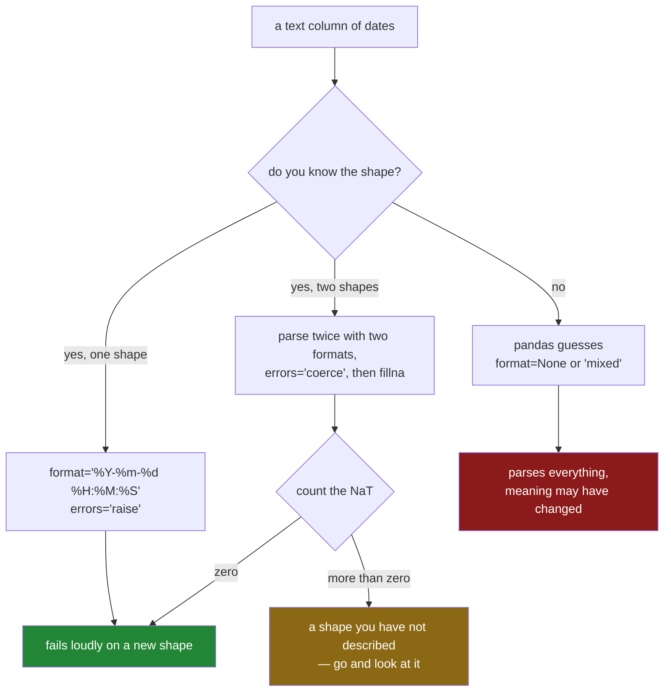

# 4.2 — `to_datetime`, `format`, and `errors`

## One-line answer

`pd.to_datetime` turns a column of text into a column of timestamps, and the two arguments that
decide whether it is trustworthy are `format=`, which stops it guessing what the digits mean, and
`errors=`, which decides whether a value it cannot read stops the program or quietly becomes a blank.

---

## The story

The flat's shared shopping file has been going for a month. Somebody finally sits down to turn the
`paid_at` column into real dates, because [4.1](4.1-text-that-looks-like-a-date.md) showed that
sorting it as text put the 11th of March between the 1st and the 2nd.

One line does it. They run it. Every date comes out right.

They run it again next month, on a file that now has a few lines typed while one flatmate's phone was
set up differently — `08/03/2026 11:05` instead of `2026-03-08 11:05:00`. This time it stops, with a
long message about formats.

So they do what everybody does: they look for the argument that makes the message go away. There is
one. They add it. Nothing stops any more, the file parses, and it is three weeks before anybody
notices that the 1st of March has become the 3rd of January and the month's totals are landing in the
wrong weeks.

Nobody typed anything wrong. Nobody's code was broken. The setting that made the error go away was
also a setting that changed what the numbers meant.

---

## The idea in plain language

`pd.to_datetime` is a function that takes text and gives back timestamps. A **timestamp** is one
number counting from a fixed instant, which is [4.1](4.1-text-that-looks-like-a-date.md); the column
it hands back has a time dtype, so all the time operations open on it.

To do that it has to answer one question for every value: *which digits are the day, which are the
month, and which are the year?* That question has no single answer. `08/03/2026` is the 8th of March
in most of the world and the 3rd of August in the United States, and the characters cannot tell you
which. Somebody has to.

There are two ways to answer it, and only one of them is safe.

**Guessing.** If you do not say, pandas looks at the values and works out a pattern. It is good at
this. It is also making a decision on your behalf, from the data it happened to be given today, and
that decision can come out differently tomorrow when the first row is different.

**Telling it.** You pass `format=`, a small template that spells out the shape of every value:
`"%Y-%m-%d %H:%M:%S"` means four-digit year, hyphen, month, hyphen, day, space, hour, colon, minute,
colon, second. These `%` codes are the ones Python's own `strptime` uses. Now pandas is not guessing;
it is checking. If a value does not match the template, that is a fact about your data, and you want
to hear about it.

One written format explains why the flat's *original* file worked at all. *Date and time —
Representations for information interchange — Part 1: Basic rules* (ISO 8601-1:2019,
<https://www.iso.org/standard/70907.html>) fixes a way of writing a moment as year-month-day with the
largest unit first and every field padded to a fixed width, which is why `2026-03-11` both reads
unambiguously and sorts correctly as text. pandas recognises that shape and has a fast route for it.

Then there is what to do with a value that does not parse. That is `errors=`, and it has exactly two
settings in pandas 3:

- `errors="raise"` — the default. One bad value stops everything, with a message naming the value.
- `errors="coerce"` — a bad value becomes `NaT`, which is the missing marker for time columns, the
  time-shaped sibling of the `NaN` from
  [Day 30, 1.2](../../../day-30-missing-data/parts/01-what-missing-means/1.2-nan-the-number-not-equal-to-itself.md).
  Nothing stops. The column parses. You get a column with holes in it.

`coerce` is not the safe option and `raise` is not the paranoid one. They are two different policies,
and the difference is *who finds out*. `raise` tells you now, loudly, at the boundary. `coerce` tells
you only if you go and count the `NaT`s afterwards — and if you do not count them, it tells nobody.

Which brings us to the sentence this whole part exists for: **`coerce` without a count is not error
handling, it is error hiding.** Coercing is a perfectly good choice, as long as the very next line
measures how many values it swallowed and decides whether that number is acceptable.

---

## Why Setu needs it

- **[4.3](4.3-the-fields-inside-a-timestamp.md)** reads the year, the hour and the day name out of the
  column this call produces. None of it exists until this call has run.
- **[4.4](4.4-the-resolution-pandas-3-picks.md)** is about the dtype this call chooses — `datetime64`
  with a unit attached — and why in pandas 3 the unit is not what it was in pandas 2.
- **[6.1](../06-resampling/6.1-the-index-that-has-to-be-time.md)** cannot build a time index without a
  parsed column, so every resampling answer in section 6 stands on this one line.
- **[7.1](../07-the-module/7.1-the-textdate-module.md)** turns this into `parse_time`, with the format
  as a module constant and the parse-failure count surfaced rather than swallowed.
- **Day 34**'s data-quality report has a "share of values that failed to parse" row, and it is this
  number.

---

## The mechanism

Start with the flat's original file, the one that is ISO-shaped.

```python
import pandas as pd

paid_at = pd.Series(
    [
        "2026-03-01 08:12:30",
        "2026-03-04 19:40:05",
        "2026-03-08 11:05:00",
        "2026-03-11 18:22:47",
        "2026-03-02 09:31:12",
        "2026-03-09 17:58:40",
        "2026-03-05 12:04:19",
        "2026-03-10 20:11:03",
    ],
    name="paid_at",
)

t = pd.to_datetime(paid_at, format="%Y-%m-%d %H:%M:%S")
print(t.dtype)
print(t.head(3).tolist())
print("span:", t.max() - t.min(), type(t.max() - t.min()))
```

**Line by line:**

- `pd.to_datetime` is a **function on the pandas module**, not a method on the Series. There is no
  `paid_at.to_datetime()`. `.astype("datetime64[us]")` does exist, but it takes no format, so it is
  the wrong tool here.
- `format="%Y-%m-%d %H:%M:%S"` is the template. `%Y` is a four-digit year, `%m` a two-digit month,
  `%d` a two-digit day, `%H` the hour on a twenty-four-hour clock, `%M` minutes, `%S` seconds. Every literal character
  between them — the hyphens, the space, the colons — must appear in the value exactly.
- The result is a **new** Series. `paid_at` is still text afterwards, which is copy-on-write
  ([Day 26, 3.1](../../../day-26-frames-and-copy-on-write/parts/03-copy-on-write/3.1-every-result-behaves-like-a-copy.md)).
  A `pd.to_datetime(...)` on its own line, assigned to nothing, has done nothing.
- `t.max() - t.min()` is the subtraction that raised a `TypeError` on the text column in
  [4.1](4.1-text-that-looks-like-a-date.md). It works now, and it gives a `Timedelta` rather than a
  number. That object is [5.2](../05-arithmetic-on-time/5.2-timedelta-and-its-units.md).

```text
datetime64[us]
[Timestamp('2026-03-01 08:12:30'), Timestamp('2026-03-04 19:40:05'), Timestamp('2026-03-08 11:05:00')]
span: 10 days 10:10:17 <class 'pandas.Timedelta'>
```

Now the file with the one line from the other phone in it, parsed with the same format.

```python
import pandas as pd

mixed = pd.Series(
    ["2026-03-01 08:12:30", "08/03/2026 11:05", "2026-03-05 12:04:19"], name="paid_at"
)

coerced = pd.to_datetime(mixed, format="%Y-%m-%d %H:%M:%S", errors="coerce")
print(coerced.tolist())
print("dtype  :", coerced.dtype)
print("failed :", coerced.isna().sum(), "of", len(coerced))
print("rate   :", f"{coerced.notna().mean():.1%}")
```

**Line by line:**

- With `errors="raise"` — the default, so what you get by leaving the argument off — this stops. The
  message is in *When it breaks* below, and it is worth reading before you reach for `coerce`.
- `errors="coerce"` replaces the value it could not read with `NaT`. `NaT` stands for "not a time".
  It prints as `NaT`, it is what `isna()` finds, and it behaves like `NaN` in an arithmetic column:
  it spreads.
- `coerced.isna().sum()` counts the failures. `isna()` is the only way to see a blank
  ([Day 30, 2.1](../../../day-30-missing-data/parts/02-finding-it/2.1-isna-and-notna.md)); comparing
  against `NaT` with `==` returns `False` even for `NaT` itself, exactly as it does for `NaN`.
- `coerced.notna().mean()` is the **match rate** — the share of values that parsed. A boolean column
  averaged gives the proportion that are `True`, which is the same trick the extraction check uses in
  [3.4](../03-pulling-text-apart/3.4-the-pattern-that-matched-nothing.md). This line is the one that
  turns `coerce` from hiding into handling.

```text
[Timestamp('2026-03-01 08:12:30'), NaT, Timestamp('2026-03-05 12:04:19')]
dtype  : datetime64[us]
failed : 1 of 3
rate   : 66.7%
```

One value in three failed, and you know that only because the third line counted.

Now the mistake from the story. The reader hits the format error, goes looking for the setting that
makes it go away, and finds `format="mixed"`, which parses each value on its own terms. Since the
values are day-first, they add `dayfirst=True` too.

```python
import pandas as pd

mixed = pd.Series(
    ["2026-03-01 08:12:30", "08/03/2026 11:05", "2026-03-05 12:04:19"], name="paid_at"
)

print(pd.to_datetime(mixed, format="mixed", dayfirst=True).tolist())
```

**Line by line:**

- `format="mixed"` tells pandas to infer a format **per value** rather than once for the column. It is
  the slowest route and the least predictable one, because two rows of the same file can now be read
  by two different rules.
- `dayfirst=True` says that when a value is ambiguous, the first number is the day. It is a hint for
  the guesser, and it applies to every value the guesser looks at.
- The trap is that `dayfirst=True` is applied to values that were **never ambiguous**. Read the
  output before reading the next paragraph.

```text
[Timestamp('2026-01-03 08:12:30'), Timestamp('2026-03-08 11:05:00'), Timestamp('2026-05-03 12:04:19')]
```

`2026-03-01` came back as **2026-01-03**. The 1st of March became the 3rd of January. `2026-03-05`
became the 3rd of May. The one row that actually needed `dayfirst` — `08/03/2026` — is the only one
that came out right.

Nothing raised. The dtype is correct. The column is full. Every single ISO-shaped date in the file has
had its month and day swapped, and the only way to notice is to look at the values.

This is the whole argument for `format=`. A template describes the data. `dayfirst` describes a
preference, and a preference gets applied to rows that did not need it.

What to do instead, when a column genuinely has two shapes in it: parse it twice, with two explicit
formats, and combine.

```python
import pandas as pd

mixed = pd.Series(
    ["2026-03-01 08:12:30", "08/03/2026 11:05", "2026-03-05 12:04:19"], name="paid_at"
)

iso = pd.to_datetime(mixed, format="%Y-%m-%d %H:%M:%S", errors="coerce")
uk = pd.to_datetime(mixed, format="%d/%m/%Y %H:%M", errors="coerce")
combined = iso.fillna(uk)

print(combined.tolist())
print("still unparsed:", combined.isna().sum())
```

**Line by line:**

- Two passes, each with a template that describes one real shape, each with `errors="coerce"` so that
  a value belonging to the other shape becomes `NaT` instead of stopping the pass.
- `iso.fillna(uk)` takes the ISO answer where there is one and falls back to the day-first answer
  where the ISO pass left a hole. `fillna` with another Series aligns on the index and fills label by
  label — it is a claim about the data
  ([Day 30, 5.1](../../../day-30-missing-data/parts/05-filling/5.1-fillna-is-a-claim.md)), and the
  claim here is "these two formats are the only two this source produces".
- `combined.isna().sum()` is not optional. Anything still `NaT` matched neither template, so a third
  shape has appeared and the claim above has stopped being true.

```text
[Timestamp('2026-03-01 08:12:30'), Timestamp('2026-03-08 11:05:00'), Timestamp('2026-03-05 12:04:19')]
still unparsed: 0
```

All three correct, including the 1st of March, which the `mixed`/`dayfirst` route silently ruined.

The decision, drawn:



---

## When it breaks

**The value that does not match the format:**

```text
$ uv run python -c "
import pandas as pd
s = pd.Series(['2026-03-01 08:12:30', '08/03/2026 11:05', '2026-03-05 12:04:19'])
pd.to_datetime(s, format='%Y-%m-%d %H:%M:%S')
"
Traceback (most recent call last):
  File "<string>", line 4, in <module>
  File "...\pandas\core\tools\datetimes.py", line 1040, in to_datetime
    values = convert_listlike(arg._values, format)
  File "...\pandas\core\tools\datetimes.py", line 435, in _convert_listlike_datetimes
    return _array_strptime_with_fallback(arg, name, utc, format, exact, errors)
  File "...\pandas\core\tools\datetimes.py", line 470, in _array_strptime_with_fallback
    result, tz_out = array_strptime(arg, fmt, exact=exact, errors=errors, utc=utc)
  File "pandas/_libs/tslibs/strptime.pyx", line 617, in pandas._libs.tslibs.strptime._parse_with_format
ValueError: time data "08/03/2026 11:05" doesn't match format "%Y-%m-%d %H:%M:%S". You might want to try:
    - passing `format` if your strings have a consistent format;
    - passing `format='ISO8601'` if your strings are all ISO8601 but not necessarily in exactly the same format;
    - passing `format='mixed'`, and the format will be inferred for each element individually. You might want to use `dayfirst` alongside this.
```

**What it means.** It names the offending value, in quotes, and the format it was checked against.
That is a good error — it hands you the row to go and look at.

**The three suggestions are not a menu to pick from.** The message is generic; it is printed whether
or not the suggestions apply. Here, only the *first* one is right, and you already did it. Reaching
for the third — `format='mixed'` plus `dayfirst` — is the story at the top of this document.

**The smallest fix** is to look at the value it named, decide whether it is a second legitimate shape
or a typo, and then either parse twice with two explicit formats or fix the source.

**The setting that no longer exists:**

```text
$ uv run python -c "
import pandas as pd
s = pd.Series(['2026-03-01 08:12:30', '08/03/2026 11:05'])
pd.to_datetime(s, format='%Y-%m-%d %H:%M:%S', errors='ignore')
"
Traceback (most recent call last):
  File "<string>", line 4, in <module>
  File "...\pandas\core\tools\datetimes.py", line 1040, in to_datetime
    values = convert_listlike(arg._values, format)
  File "...\pandas\core\tools\datetimes.py", line 470, in _array_strptime_with_fallback
    result, tz_out = array_strptime(arg, fmt, exact=exact, errors=errors, utc=utc)
  File "pandas/_libs/tslibs/strptime.pyx", line 387, in pandas._libs.tslibs.strptime.array_strptime
AssertionError
```

**A bare `AssertionError` with no message at all.** This is what you get for `errors="ignore"`, which
existed in pandas 1 and was the setting that returned the original text unchanged when a parse failed.
It is gone. The internal code now asserts that `errors` is one of `raise` or `coerce`, and a failed
`assert` in compiled code has nothing to say.

**What it means, in practice.** If you copy a `to_datetime` call out of an older code base and it dies
on a line with no explanation, look at `errors=` first. `raise` and `coerce` are the only two values.

**The guess that changed shape:**

```text
$ uv run python -c "
import pandas as pd
print(pd.to_datetime(pd.Series(['08/03/2026', '09/03/2026'])).tolist())
print(pd.to_datetime(pd.Series(['13/03/2026', '09/03/2026'])).tolist())
"
<string>:4: UserWarning: Parsing dates in %d/%m/%Y format when dayfirst=False (the default) was specified. Pass `dayfirst=True` or specify a format to silence this warning.
[Timestamp('2026-08-03 00:00:00'), Timestamp('2026-09-03 00:00:00')]
[Timestamp('2026-03-13 00:00:00'), Timestamp('2026-03-09 00:00:00')]
```

**Nothing raised, and the same column was read two different ways.** In the first list every value
could be month-first, so pandas read it month-first: the 8th of March became the 3rd of August. In the
second list the first value has a 13 in it, which cannot be a month, so pandas read the whole column
day-first and got it right.

**Only the second one warned.** The `UserWarning` fires when pandas is forced away from its default
guess, which means the case that was read *wrongly* — the first one — produced no warning at all, and
the case that was read *correctly* produced one. A warning here is not a signal that something went
wrong; it is a signal that the guesser noticed itself guessing.

The data did not change. One row changed, and the meaning of every other row changed with it. This is
why "it worked when I tested it" is not evidence about a `to_datetime` call with no `format=`.

---

## In production

**What a professional writes instead of the teaching version.** A named function, with the format as a
constant, a floor on the match rate, and a failure that stops the load:

```python
import pandas as pd

TIME_FORMAT = "%Y-%m-%d %H:%M:%S"
MIN_PARSE_RATE = 0.99


def parse_time(frame: pd.DataFrame, column: str, fmt: str = TIME_FORMAT) -> pd.DataFrame:
    """Return a new frame with `column` parsed to timestamps, refusing a poor match rate."""
    parsed = pd.to_datetime(frame[column], format=fmt, errors="coerce")
    rate = parsed.notna().mean()
    if rate < MIN_PARSE_RATE:
        bad = frame.loc[parsed.isna(), column].head(3).tolist()
        raise ValueError(f"{column!r}: only {rate:.1%} parsed with {fmt!r}; first failures: {bad}")
    return frame.assign(**{column: parsed})
```

**Line by line:**

- `TIME_FORMAT` and `MIN_PARSE_RATE` are module constants because they are **policy**, not detail. The
  format is a fact about the source; the rate is a decision about how much silent loss is acceptable.
  Both belong somewhere a reviewer finds them in one search.
- `errors="coerce"` is deliberate, because the function wants to see *all* the failures before
  deciding, not stop on the first. With `raise` you learn about one bad row; with `coerce` plus a
  count you learn that four per cent of the file is bad, which is a different conversation.
- `parsed.notna().mean()` is compared against a floor rather than against zero. One failure in a
  million is normal; one in twenty is a format change upstream.
- `frame.loc[parsed.isna(), column].head(3).tolist()` puts three real offending values **into the
  error message**. An exception that says "parse failed" costs an hour; one that says
  `first failures: ['08/03/2026 11:05']` costs a minute.
- `frame.assign(**{column: parsed})` returns a new frame instead of writing into the caller's. The
  `**{...}` spelling is needed because the column name is a variable — `assign(column=parsed)` would
  create a column literally called `column`.
- The docstring states the **guarantee**: a frame comes back parsed, or nothing comes back.

**What degrades at scale.** The format you pass changes how much work the parse is. Half a million
values, the same moments spelled two ways:

```python
import time

import numpy as np
import pandas as pd

rng = np.random.default_rng(33)
n = 500_000
stamps = pd.Timestamp("2026-03-01 08:12:30") + pd.to_timedelta(
    rng.integers(0, 86400 * 90, size=n), unit="s"
)
iso = pd.Series(stamps.strftime("%Y-%m-%d %H:%M:%S"))
uk = pd.Series(stamps.strftime("%d/%m/%Y %H:%M:%S"))


def best_of(label, fn, runs=5):
    times = []
    for _ in range(runs):
        t0 = time.perf_counter()
        fn()
        times.append(time.perf_counter() - t0)
    print(f"{label:<26} {min(times):6.3f} s")


best_of("iso, no format", lambda: pd.to_datetime(iso))
best_of("iso, format= given", lambda: pd.to_datetime(iso, format="%Y-%m-%d %H:%M:%S"))
best_of("iso, format='ISO8601'", lambda: pd.to_datetime(iso, format="ISO8601"))
best_of("iso, format='mixed'", lambda: pd.to_datetime(iso, format="mixed"))
best_of("day-first, format= given", lambda: pd.to_datetime(uk, format="%d/%m/%Y %H:%M:%S"))
```

**Line by line:**

- `np.random.default_rng(33)` seeds the generator, so this measurement repeats. Never a bare default.
- `stamps.strftime(...)` renders one set of moments into two spellings, so the only thing that differs
  between the runs is the format, not the data.
- `min(times)` over five runs, not the average. Anything else running on the machine can only make a
  run *slower*, never faster, so the fastest of several runs is the closest you get to the cost of the
  work itself — the measuring discipline from
  [Day 29, 3.1](../../../day-29-iteration-and-order/parts/03-the-measurement/3.1-what-a-million-rows-is-for.md).
  Run this on a busy laptop and every number moves; the *ratios* are what to read.
- `format="ISO8601"` is included to show it is not a slow fallback: it accepts any ISO-shaped value,
  including ones with and without a time part in the same column, and still takes the fast route.

```text
iso, no format              0.522 s
iso, format= given          0.475 s
iso, format='ISO8601'       0.407 s
iso, format='mixed'         0.672 s
day-first, format= given    2.259 s
```

The four ISO routes are within noise of each other, because pandas recognises the shape and hands it
to compiled code that already knows where each field sits — passing the format costs nothing. The
day-first format is **four to five times slower** than any of them, because there is no fast path for
it: every value goes through general template matching, one at a time.

That is the practical argument for storing timestamps as ISO text in any file you control. It is not
only unambiguous and correctly sortable as text; it is several times cheaper to read back.

**The failure that only appears with real data.** A daily load parsed an order timestamp with no
`format=`. For fourteen months every file happened to contain a day-of-month above twelve near the
top, so pandas inferred day-first and got it right. Then a quiet public holiday produced a file whose
orders all fell between the 3rd and the 9th. pandas inferred month-first for that file alone, and one
day of orders landed in seven different months. The row count was correct, the total was correct, and
the monthly report for the next quarter was not.

**The review comment a senior engineer leaves.** *"`pd.to_datetime(df['paid_at'])` with no `format=`.
That is an inference over today's data, and it will silently change meaning the day a file arrives
with no unambiguous rows. Pass the format, use `errors='coerce'`, and assert the non-null share — a
parse rate of 96 per cent should fail the load, not populate the dashboard."*

**The interview question.** *"What is wrong with `pd.to_datetime(col)`?"* It infers the format from the
data, so the same code can read the same column two different ways on two different days, and it never
tells you which it chose. Then the follow-up that finds out whether you have run this in anger:
**when is `errors='coerce'` the right answer, and what must go on the line after it?** It is right when
you need to see every bad value rather than the first one — and the next line must count the `NaT`s
and compare that count against a threshold, because a `coerce` whose result nobody measures has turned
a loud failure into a silent one.

---

## Check yourself

```bash
uv run python -c "
import pandas as pd
s = pd.Series(['2026-03-01 08:12:30', '08/03/2026 11:05', '2026-03-05 12:04:19'])
print('guessed  :', pd.to_datetime(s, format='mixed', dayfirst=True).tolist())
iso = pd.to_datetime(s, format='%Y-%m-%d %H:%M:%S', errors='coerce')
uk  = pd.to_datetime(s, format='%d/%m/%Y %H:%M', errors='coerce')
print('iso pass :', iso.tolist())
print('uk pass  :', uk.tolist())
print('combined :', iso.fillna(uk).tolist())
print('rate     :', f'{iso.fillna(uk).notna().mean():.0%}')
"
```

Three values, two real formats. Say what happened to the 1st of March on the `guessed` line, and say
which line of this command you would delete last if you had to make it shorter.

**Answer out loud, without scrolling up:**

> Why does passing `format=` make a parse *more* likely to fail, and why is that the point? Then say
> what `errors='coerce'` actually does to a value it cannot read, and what single line has to follow
> it before the parse can be called handled rather than hidden.

---

**Next:** [4.3 — The fields inside a timestamp](4.3-the-fields-inside-a-timestamp.md).
