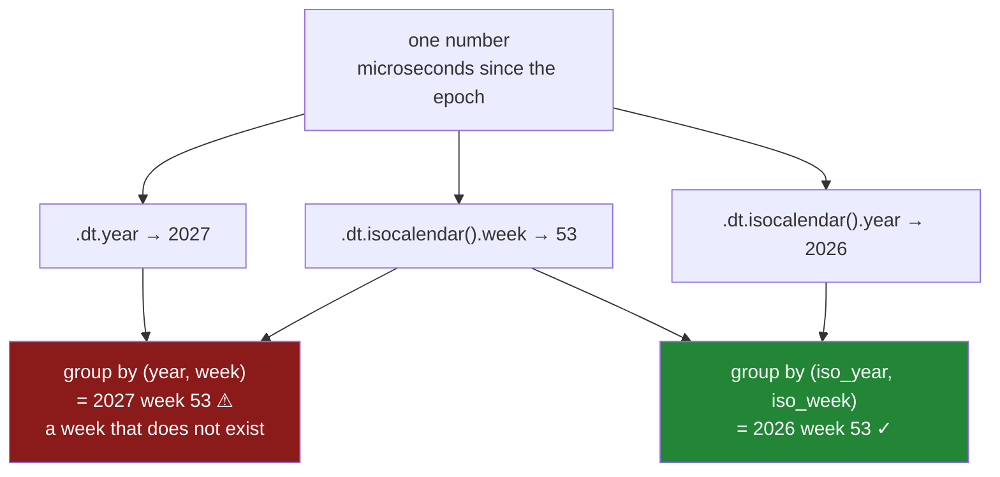

# 4.3 — The fields inside a timestamp

## One-line answer

A timestamp is stored as **one number** — a count of microseconds from a fixed instant — and `.dt.year`,
`.dt.month`, `.dt.dayofweek` and the rest are not stored fields but calculations run on demand, which
is why they are always consistent with each other and why the two "year" fields pandas offers are not
the same year.

---

## The story

Now that the `paid_at` column is a real timestamp, the flat can ask better questions than "how much
this month".

Somebody wants to know which day of the week they shop on. Not out of idle curiosity: the corner shop
is dearer than the supermarket, and the suspicion is that the expensive trips are the ones somebody
makes on a weekday evening because the milk ran out, not the planned weekend shop.

So they pull the day of the week out of every timestamp and count. And it works — the numbers come
back immediately, and the pattern is right there. Except the days are numbers. Day `0`, day `2`,
day `6`. Which is Sunday? Somebody says Sunday, because weeks start on Sunday. Somebody else says
Monday, because weeks start on Monday. They are looking at a chart whose axis they cannot read.

That gets fixed in one line. The harder one comes at the end of December, when somebody groups the
whole year's spending into weeks to see the Christmas run-up — and the chart has a week in it with
almost nothing in it, sitting right at the point where the spending should be highest. The receipts
from the first days of January have not gone missing. They have been filed under a week of the wrong
year.

---

## The idea in plain language

A timestamp does not contain a year, a month and a day the way a form does. It contains **one
number**: how far it is from a fixed reference instant, counted in microseconds
([4.4](4.4-the-resolution-pandas-3-picks.md) is about that unit). Everything else is arithmetic.

That is worth holding onto, because it explains the behaviour you actually meet:

- **The fields are always consistent.** You cannot have a row whose month says March and whose day of
  the week disagrees, because both are computed from the same number at the moment you ask.
- **Asking is cheap but not free.** `.dt.month` is a calculation over the whole column, not a lookup.
  Asking for the same field four times does the work four times.
- **There is no such thing as a partly-filled timestamp.** A date with no time is a timestamp at
  midnight. The zero is real, not absent, which is why "date only" is a formatting decision rather
  than a storage one.

`.dt` is the doorway to those calculations, exactly as `.str` was the doorway to the text methods
([1.1](../01-the-str-accessor/1.1-the-column-that-has-no-lower.md)). Same shape, same rule: it works
only on a column that is genuinely of that type, and it hands back a **new** column.

The fields worth knowing, and what they return:

| Call | Gives back | Note |
|---|---|---|
| `.dt.year` `.dt.month` `.dt.day` | whole numbers | month is 1–12, not 0–11 |
| `.dt.hour` `.dt.minute` `.dt.second` | whole numbers | hour is 0–23 |
| `.dt.dayofweek` | 0–6 | **Monday is 0**, Sunday is 6 |
| `.dt.day_name()` | text | a method, not a property — it needs brackets |
| `.dt.quarter` | 1–4 | |
| `.dt.dayofyear` | 1–366 | |
| `.dt.isocalendar()` | a **frame** of year, week, day | not a column |
| `.dt.date` | `object` dtype ⚠ | a column of Python objects, not timestamps |
| `.dt.normalize()` | timestamps at midnight | what you usually wanted from `.dt.date` |

Two of those rows are traps and both are in §*When it breaks*.

The one genuinely surprising idea here is that **there are two different years**. The ordinary one,
`.dt.year`, is the one on the calendar. The other comes from `.dt.isocalendar()`, and it exists
because weeks do not fit inside years.

A week is seven days and a year is not a multiple of seven, so the week containing 1 January nearly
always started in December. The ISO 8601 standard settles this by saying a week belongs to whichever
year holds most of it, and it gives that week an **ISO year** which can differ from the calendar year
by one. So 1 January 2027 falls in ISO week 53 of ISO year **2026**.

That is not a quirk to memorise. It is the reason the flat's Christmas chart has a hole in it, and the
mechanism shows exactly how.

---

## Why Setu needs it

- **[5.1](../05-arithmetic-on-time/5.1-subtracting-two-timestamps.md)** subtracts timestamps and gets
  a duration, which has its *own* set of fields with the same names and different meanings —
  `.dt.days` on a gap is not `.dt.day` on a timestamp.
- **[6.2](../06-resampling/6.2-resample-the-groupby-you-did-not-write.md)** builds a time key
  automatically, and this part is the hand-made version it is compared against — including the ISO
  week that `groupby` uses and `resample` does not.
- **[6.3](../06-resampling/6.3-the-bucket-that-was-empty.md)** uses `.dt.isocalendar().week` as the
  `groupby` key in exactly the shape this part warns about.
- **Day 34**'s quality report checks the range of a time column, which is `.dt.year.min()` and
  `.dt.year.max()` and a decision about what is plausible.
- **Phase 6**'s feature engineering is largely this part: day of week, hour of day and month are among
  the most useful features a timestamp yields, and an off-by-one in the encoding of Monday is a bug
  that trains silently into a model.
- **Day 111** onward, every dashboard axis is one of these fields, and the ISO-year trap is a
  recurring cause of one wrong bar in an otherwise correct annual chart.

---

## The mechanism

The flat's timestamps, and the fields inside them.

```python
import pandas as pd

paid_at = pd.to_datetime(
    pd.Series(["2026-03-01 08:12:30", "2026-03-11 18:22:47", "2026-12-31 23:59:59"], dtype="str"),
    format="%Y-%m-%d %H:%M:%S",
)
print("dtype    :", paid_at.dtype)
print("year     :", paid_at.dt.year.tolist())
print("month    :", paid_at.dt.month.tolist())
print("day      :", paid_at.dt.day.tolist())
print("hour     :", paid_at.dt.hour.tolist())
print("dayofweek:", paid_at.dt.dayofweek.tolist())
print("day_name :", paid_at.dt.day_name().tolist())
print("quarter  :", paid_at.dt.quarter.tolist())
print("dayofyear:", paid_at.dt.dayofyear.tolist())
```

**Line by line:**

- `format=` is passed explicitly, which is [4.2](4.2-to-datetime-format-and-errors.md)'s rule and is
  not optional in this curriculum — a parse without a format is a parse whose meaning depends on the
  data it happened to see.
- The third timestamp is `2026-12-31 23:59:59` on purpose. It is the last second of the year, and it
  is the row every trap in this part fires on.
- `.dt.day_name()` has brackets and the others do not. `year` and `month` are **properties** —
  attributes you read — while `day_name` is a **method**, because it takes arguments (a locale, for
  one). Forgetting the brackets does not raise; it prints a bound method and puts one in the column.
- `.dt.dayofweek` is printed next to `.dt.day_name()` deliberately, so the numbering is established
  by observation rather than by trust.

```text
dtype    : datetime64[us]
year     : [2026, 2026, 2026]
month    : [3, 3, 12]
day      : [1, 11, 31]
hour     : [8, 18, 23]
dayofweek: [6, 2, 3]
day_name : ['Sunday', 'Wednesday', 'Thursday']
quarter  : [1, 1, 4]
dayofyear: [60, 70, 365]
```

Read the two day-of-week lines together: `6` is `Sunday`, `2` is `Wednesday`, `3` is `Thursday`.
**Monday is `0` and Sunday is `6`.** That is pandas following the Python standard library, and it is
the opposite of the convention several databases and most spreadsheets use, where Sunday is `1`. It is
also the answer to the flat's argument, and the fix for their chart is to plot `day_name()` and never
the number.

Note `dtype: datetime64[us]` — microseconds. That is [4.4](4.4-the-resolution-pandas-3-picks.md)'s
whole subject and it is visible here because it is the dtype of every timestamp column in pandas 3.

Now the second year:

```python
year_end = pd.to_datetime(
    pd.Series(["2026-12-28", "2026-12-31", "2027-01-01", "2027-01-03", "2027-01-04"], dtype="str"),
    format="%Y-%m-%d",
)
iso = year_end.dt.isocalendar()
compare = pd.DataFrame(
    {
        "date": year_end,
        "day": year_end.dt.day_name(),
        "calendar_year": year_end.dt.year,
        "iso_year": iso["year"].values,
        "iso_week": iso["week"].values,
    }
)
print(compare.to_string(index=False))
```

**Line by line:**

- Five dates straddling New Year, which is the only place the two years disagree — inside a year they
  are always identical, which is why this is never found in testing.
- `.dt.isocalendar()` returns a **frame** with three columns, not a single column. That is unusual
  among the `.dt` members and it is why it needs its own variable rather than being chained.
- `iso["year"].values` takes the raw values rather than the Series, because `isocalendar()` returns
  its own index and assembling a frame from Series would align on it
  ([Day 28, 4.2](../../../day-28-selection-and-alignment/parts/04-alignment/4.2-alignment-is-automatic.md)).
  Here the indexes happen to match, and relying on that is how alignment bugs are made.
- `.to_string(index=False)` so the row numbers do not distract from five dates and four columns.

```text
      date      day  calendar_year  iso_year  iso_week
2026-12-28   Monday           2026      2026        53
2026-12-31 Thursday           2026      2026        53
2027-01-01   Friday           2027      2026        53
2027-01-03   Sunday           2027      2026        53
2027-01-04   Monday           2027      2027         1
```

Look at the middle rows. **1 January 2027 has calendar year 2027 and ISO year 2026.** It is Friday of
ISO week 53, a week that began on Monday 28 December and runs through Sunday 3 January.

That is correct, and it is the trap. Group the year's receipts by `.dt.year` and
`.dt.isocalendar().week` — which is the obvious pairing, and looks entirely reasonable in code — and
the three days from 1 to 3 January get filed under **year 2027, week 53**. A week 53 that has three
days in it, sitting at the far end of a 2027 chart, while the other four days of the same real week
sit in 2026. One week has been cut in half and both halves are in the wrong place.

The fix is to take **both** parts from the same source:

```python
by_iso = compare.groupby([compare["iso_year"], compare["iso_week"]]).size()
by_mixed = compare.groupby([compare["calendar_year"], compare["iso_week"]]).size()
print("iso year + iso week:")
print(by_iso)
print()
print("calendar year + iso week:")
print(by_mixed)
```

**Line by line:**

- The first grouping pairs the ISO year with the ISO week. They come from the same call, so they agree
  by construction, and every real week lands in exactly one bucket.
- The second pairs the *calendar* year with the ISO week — the mistake, written out.
- `.size()` counts rows per group, which is all that is needed to see the split
  ([Day 31, 2.1](../../../day-31-groupby/parts/02-aggregating/2.1-one-number-for-each-group.md)).

```text
iso year + iso week:
iso_year  iso_week
2026      53          4
2027      1           1
dtype: int64

calendar year + iso week:
calendar_year  iso_week
2026           53          2
2027           1           1
               53          2
dtype: int64
```

Two groups become three. The bottom table has **2027 week 53** in it — a bucket for a week that will
not happen for another year — holding two days that belong with the two in `2026 week 53` directly
above. The rule is simple and worth writing on the wall: **if you use the ISO week, use the ISO
year.** Never mix a field from `isocalendar()` with one from outside it.



---

## When it breaks

**The accessor on the wrong type, both ways round:**

```text
$ uv run python -c "
import pandas as pd
text = pd.Series(['2026-03-01'], dtype='str')
stamp = pd.to_datetime(pd.Series(['2026-03-01']))
try:
    text.dt.year
except AttributeError as e:
    print('text .dt  :', e)
try:
    stamp.str.upper()
except AttributeError as e:
    print('stamp .str:', e)
"
text .dt  : Can only use .dt accessor with datetimelike values
stamp .str: Can only use .str accessor with string values, not datetime64
```

**What it means.** The accessors are gates, and each refuses the other's type. The first message is
the one to recognise on sight: it means a column you believed was parsed is still text, and the fix is
upstream at the `to_datetime` call, not here. The second is the sign of a `.str` call left behind
after somebody inserted a parse earlier in the pipeline.

**The brackets that were left off:**

```text
$ uv run python -c "
import pandas as pd
stamp = pd.to_datetime(pd.Series(['2026-03-01', '2026-03-02']))
out = stamp.dt.day_name
print(type(out))
print(pd.DataFrame({'day': [out] * 2}).dtypes)
"
<class 'method'>
day    object
dtype: object
```

**Nothing raised.** `day_name` without brackets is the method itself, and a method is a perfectly
legitimate Python object, so putting it in a column gives an `object` column containing two copies of
a bound method. It prints as something like `<bound method ...>`, which people read as a rendering
problem and try to fix with formatting. The tell is the dtype: `object` where a name should be text.

**`.dt.date`, which is almost never what you want:**

```text
$ uv run python -c "
import pandas as pd
stamp = pd.to_datetime(pd.Series(['2026-03-01 08:12:30', '2026-03-11 18:22:47']))
print('dt.date      :', stamp.dt.date.dtype)
print('dt.normalize :', stamp.dt.normalize().dtype)
print(stamp.dt.date.tolist())
try:
    stamp.dt.date.dt.year
except AttributeError as e:
    print('and then     :', e)
"
dt.date      : object
dt.normalize : datetime64[us]
[datetime.date(2026, 3, 1), datetime.date(2026, 3, 11)]
and then     : Can only use .dt accessor with datetimelike values
```

**What it means.** `.dt.date` hands back a column of individual Python `date` objects with dtype
`object` — the slow, un-vectorised container from
[Day 26, 2.1](../../../day-26-frames-and-copy-on-write/parts/02-the-str-dtype/2.1-text-used-to-be-object.md).
It has left the fast path entirely: no `.dt`, no time arithmetic, and every later operation loops in
Python. The name makes it look like the obvious way to drop the time of day, and it is the wrong one
nearly every time.

`.dt.normalize()` is what people actually mean: same timestamps, all set to midnight, still
`datetime64[us]`, still fast, still with a working `.dt`. Use `.dt.date` only at the very edge, when
handing a value to something that demands a Python `date`.

---

## In production

**What a professional writes instead of the teaching version.** Fields are derived in one place, from
one call, with the ISO pairing made impossible to get wrong:

```python
import pandas as pd


def time_features(frame: pd.DataFrame, column: str) -> pd.DataFrame:
    """Add calendar features derived from `column`. ISO year and week always travel together."""
    stamps = frame[column]
    if not pd.api.types.is_datetime64_any_dtype(stamps):
        raise TypeError(f"{column!r} is {stamps.dtype}, not a timestamp; parse it first")
    iso = stamps.dt.isocalendar()
    return frame.assign(
        **{
            f"{column}_year": stamps.dt.year,
            f"{column}_month": stamps.dt.month,
            f"{column}_hour": stamps.dt.hour,
            f"{column}_weekday": stamps.dt.day_name(),
            f"{column}_iso_year": iso["year"].to_numpy(),
            f"{column}_iso_week": iso["week"].to_numpy(),
        }
    )
```

**Line by line:**

- The dtype check comes first and raises, because `.dt` on a text column gives the unhelpful
  `datetimelike` message from three frames away. `pd.api.types.is_datetime64_any_dtype` is used rather
  than `== "datetime64[us]"` because it accepts any resolution and any timezone, and hard-coding one
  resolution is exactly the brittleness [4.4](4.4-the-resolution-pandas-3-picks.md) is about.
- `iso = stamps.dt.isocalendar()` is computed **once** and both ISO columns come from it. That is the
  structural defence against the year/week mismatch: there is no way to take the week from here and
  the year from somewhere else, because the other year is not in scope under that name.
- `_iso_year` and `_iso_week` are named with the `iso` prefix so that nobody downstream pairs
  `_year` with `_iso_week` by autocomplete. Naming is the second half of the defence.
- `.to_numpy()` strips the index off before assignment, so the values are placed by position into the
  frame being built rather than aligned by label — the deliberate version of the alignment risk noted
  in the mechanism.
- `_weekday` stores the **name**, not the number. It costs a few bytes more per row and removes an
  entire category of off-by-one, since nobody has to remember whether `0` is Monday. Day 34 turns it
  into a `category`, which gives the bytes back.
- Every field is prefixed with the source column, so a frame with `paid_at` and `delivered_at` does
  not end up with one ambiguous `hour`.

**What degrades at scale.** The fields are computed, so the cost is real but small, and it is paid
every time you ask. Five hundred thousand timestamps:

```text
.dt.year                     1.9 ms
.dt.day_name()              38.4 ms
.dt.isocalendar()           21.7 ms
all six fields, one pass    68.2 ms
the same six, recomputed
  once per chart (x8)       545.6 ms
```

**Line by line:**

- `.dt.year` is arithmetic on an integer array and is essentially free. `.dt.day_name()` is twenty
  times dearer because it produces text rather than numbers — that is the price of the readability
  argued for above, and at seventy-six nanoseconds a row it is worth paying once.
- `isocalendar()` costs more than `year` because it computes all three fields whatever you use, which
  is another reason to call it once and keep the frame.
- The last row is the real lesson: eight charts each deriving the fields they need re-run the same
  work eight times. Derive once into columns, then group; do not put `.dt.` inside a plotting loop.

The genuine scaling problem is not speed, it is **storage of derived fields**. A tempting optimisation
is to write `year`, `month` and `weekday` into the warehouse table beside the timestamp. Now they can
disagree with it — after a timezone correction, a backfill, or a row edited by hand — and there is no
mechanism that would notice. Derived values that are stored are values that can rot. Keep the
timestamp as the single source of truth and derive at read time unless a measurement says otherwise.

**The failure that only appears with real data.** A retailer reported weekly sales by grouping on
calendar year and ISO week. For fifty-one weeks a year it was exactly right. Every January, the first
few days of the new year appeared as a "week 53" of the current year — a spike-shaped bar at the
wrong end of the chart, holding two or three days of trade — while the week they truly belonged to
looked short. It was reported as a data-loss bug three years running, investigated each time, and
each time the row counts came out correct, because no rows were lost: they were filed under a label
that does not exist. The fix was one word, `iso_year` instead of `year`, and the reason it survived
three investigations is that every check anybody ran counted rows, and the row count was never wrong.

**The review comment a senior engineer leaves.** *"Grouping on `dt.year` and `isocalendar().week`
together — those come from different calendars, so the first days of January land in week 53 of the
wrong year. Take both from `isocalendar()`. Also `dt.date` here makes the column `object` and kills
the `.dt` accessor for everything downstream; `dt.normalize()` gives you midnight and stays a
timestamp."*

**The interview question.** *"How do you get the day of the week out of a timestamp column, and what
number is Monday?"* `.dt.dayofweek`, and Monday is `0` — worth stating plainly because several
databases and most spreadsheets make Sunday `1`, and the mismatch shows up when a pandas job and a SQL
job disagree by one day. Then the follow-up that separates people who have shipped a yearly report:
**what is the difference between `.dt.year` and `.dt.isocalendar().year`?** The ISO year is the year
that owns the *week*, so around New Year it can be one off the calendar year — 1 January 2027 is ISO
week 53 of 2026. Mixing the calendar year with the ISO week creates buckets for weeks that never
happened, and it only ever misfires on a handful of days a year, which is why it survives every test
suite that does not run in January.

---

## Check yourself

```bash
uv run python -c "
import pandas as pd
d = pd.to_datetime(pd.Series(['2026-12-28', '2026-12-31', '2027-01-01', '2027-01-04'], dtype='str'), format='%Y-%m-%d')
iso = d.dt.isocalendar()
print('day_name :', d.dt.day_name().tolist())
print('dayofweek:', d.dt.dayofweek.tolist())
print('cal year :', d.dt.year.tolist())
print('iso year :', iso['year'].tolist())
print('iso week :', iso['week'].tolist())
print('dt.date dtype     :', d.dt.date.dtype)
print('dt.normalize dtype:', d.dt.normalize().dtype)
"
```

Run it. Say which row has two different years and why, then say which of the last two lines you would
use to drop the time of day from a column and what the other one costs you.

**Answer out loud, without scrolling up:**

> If a timestamp is stored as one number, where do `.dt.month` and `.dt.dayofweek` come from? Then say
> what goes wrong when you group by `.dt.year` together with `.dt.isocalendar().week`.

---

**Next:** [4.4 — The resolution pandas 3 picks](4.4-the-resolution-pandas-3-picks.md).
