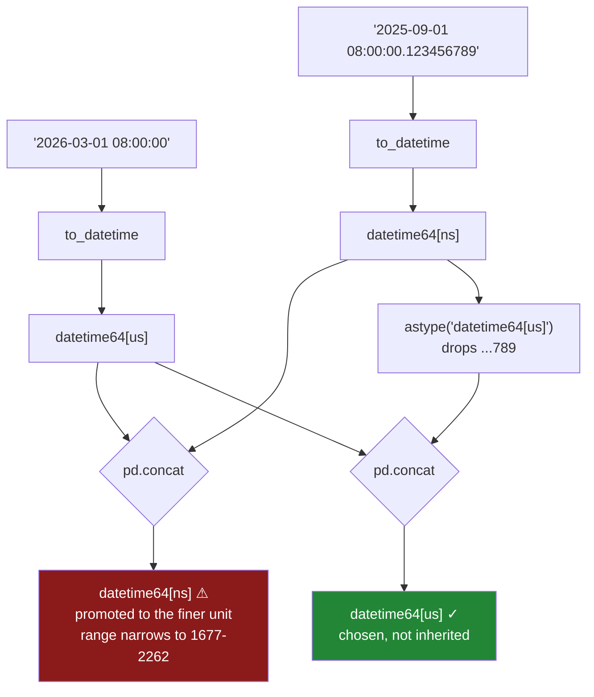

# 4.4 — The resolution pandas 3 picks

## One-line answer

A timestamp column carries a **unit** as part of its dtype — `datetime64[us]` is microseconds — and
pandas 3 chooses it from the input rather than always using nanoseconds, so two files parsed the same
way can produce two different dtypes that mostly behave identically until they meet.

---

## The story

The flat's file works. `paid_at` parses, the fields come out, the weekly totals are right.

Somewhere near the top of the little script there is a safety check somebody added months ago, after
an afternoon lost to a column that turned out to be text. It asks whether `paid_at` is really a
timestamp column before doing anything else, and if it is not, it stops and says so. It has earned
its keep twice.

Then the laptop gets a new version of pandas, along with everything else, on one of those updates
nobody reads.

Nothing announces itself. The script runs. The totals come out. The safety check does not complain.

What has happened is that the check is asking whether the column's type is exactly the words
`datetime64[ns]`, and columns are not called that any more — this one is `datetime64[us]`. So the
check compares two pieces of text, finds they differ, and takes the branch for *this is not a
timestamp*, which was written on the assumption that it would never be reached and therefore does
nothing much at all.

The guard is still there. It still runs every time. It has stopped guarding anything, and there is
no message anywhere that says so.

---

## The idea in plain language

Go back to [4.3](4.3-the-fields-inside-a-timestamp.md): a timestamp is one number, counting from a
fixed instant. To read that number you need to know **what it counts** — seconds, milliseconds,
microseconds, nanoseconds. That choice is the **resolution**, and it is not metadata off to the side.
It is part of the dtype, printed right there in the brackets: `datetime64[us]`.

The four you will meet are `[s]` seconds, `[ms]` milliseconds, `[us]` microseconds and `[ns]`
nanoseconds.

**What changed in pandas 3.** Older pandas had exactly one resolution: nanoseconds, always, whatever
you gave it. That was simple and it had a hard edge — a 64-bit count of nanoseconds only spans about
585 years, so the representable range ran from **1677 to 2262**. Dates outside it could not be stored
at all, which is a real problem for birth dates, historical records and long-dated financial
instruments.

pandas 3 supports several resolutions and **infers** one from what it parses. Plain dates and
second-level times give microseconds. Text carrying nanosecond digits gives nanoseconds. Microseconds
comfortably cover the year 1 to the year 294 000, so the range problem is gone.

That is a genuine improvement and it introduces exactly one new hazard: **the dtype is now a function
of the data.** Two files that look the same to a person can produce two different dtypes, and code
that assumed one resolution now sees another.

What actually goes wrong, in order of how often you meet it:

- **A comparison of dtypes fails.** `df["paid_at"].dtype == "datetime64[ns]"` was a fair test for
  years. It is now false for most columns, and any branch built on it takes the wrong path.
- **`concat` of two resolutions promotes to the finer one.** Stacking a `[us]` column and a `[ns]`
  column gives `[ns]`, quietly. Nothing is lost, and the column's unit is now decided by whichever
  file had the most decimal places — which also narrows the representable range back to 1677–2262,
  and that *can* raise, on a value that was perfectly legal a moment earlier.
- **A round trip through a file changes it.** Parquet stores its own unit. Write microseconds, read
  back whatever the file says, and a column's dtype can change without anybody editing a line.
- **Converting to `[ns]` can now raise.** Data that microseconds hold comfortably does not fit in
  nanoseconds, and the error appears at the conversion, far from the parse.

The defence is short: **assert the resolution where you parse**, do not compare dtypes with `==`, and
convert deliberately at boundaries rather than letting each file decide.

---

## Why Setu needs it

- **[4.2](4.2-to-datetime-format-and-errors.md)** is where the parse happens, and it is the only
  sensible place to pin the resolution — one call, one assertion, every column that enters the system.
- **[4.3](4.3-the-fields-inside-a-timestamp.md)**'s `is_datetime64_any_dtype` check is written the way
  it is precisely because of this part: a check for one specific unit is a check that breaks.
- **[5.2](../05-arithmetic-on-time/5.2-timedelta-and-its-units.md)** works on durations, which carry
  a resolution of their own inherited from the timestamps they came from.
- **[7.1](../07-the-module/7.1-the-textdate-module.md)**'s `parse_time` asserts the resolution, and
  that assertion exists because of this part rather than as decoration.
- **[Day 27, 3.2](../../../day-27-reading-and-writing/parts/03-parquet/3.2-the-round-trip-that-keeps-dtypes.md)**
  promised Parquet keeps dtypes. This is the one dtype where "keeps" needs reading carefully.
- **Day 35** compares pandas against Polars and DuckDB, all three of which have their own default
  time units, and a benchmark that compares `[ns]` work against `[us]` work is not comparing like
  with like.

---

## The mechanism

What pandas 3 actually chooses, given the same call and different text.

```python
import pandas as pd

seconds = pd.to_datetime(pd.Series(["2026-03-01 08:12:30"], dtype="str"))
nanos = pd.to_datetime(pd.Series(["2026-03-01 08:12:30.123456789"], dtype="str"))
dates = pd.to_datetime(pd.Series(["2026-03-01"], dtype="str"))
print("second precision    :", seconds.dtype)
print("nanosecond precision:", nanos.dtype)
print("date only           :", dates.dtype)
print("date_range          :", pd.date_range("2026-01-01", periods=3, freq="D").dtype)
```

**Line by line:**

- Three calls to `to_datetime`, identical apart from the text. Nothing here asks for a resolution, so
  whatever comes back is what pandas inferred.
- The second value carries nine digits after the decimal point — nanosecond precision — which is what
  a machine-generated log or a market data feed looks like, and is the realistic way a `[ns]` column
  gets into a pipeline that is otherwise `[us]`.
- `date_range` is included because generated timestamps are as common as parsed ones, and it is worth
  confirming they agree.

```text
second precision    : datetime64[us]
nanosecond precision: datetime64[ns]
date only           : datetime64[us]
date_range          : datetime64[us]
```

**Microseconds by default, nanoseconds when the data demands it.** The rule is not "pandas 3 uses
microseconds"; it is "pandas 3 uses the coarsest unit that does not lose information, with
microseconds as the floor". One file with sub-microsecond timestamps in it produces a different dtype
from its neighbour, and neither parse did anything wrong.

Now what the wider range buys, and what it costs at the boundary:

```python
far = pd.to_datetime(pd.Series(["1500-06-01", "2500-01-01"], dtype="str"), format="%Y-%m-%d")
print("far dates:", far.dtype)
print(far.tolist())
print("ns bounds:", pd.Timestamp.min, "->", pd.Timestamp.max)
```

**Line by line:**

- `1500` and `2500` are both outside the old nanosecond range, and both parse without complaint. In
  pandas 2 this raised, and the workaround was `PeriodIndex` or storing the date as text.
- `pd.Timestamp.min` and `.max` still report the **nanosecond** bounds, because they describe the
  limits of a `Timestamp` at the finest resolution. Reading them as "the range pandas supports" is now
  wrong, and that is worth knowing before you use them in a validation check.

```text
far dates: datetime64[us]
[Timestamp('1500-06-01 00:00:00'), Timestamp('2500-01-01 00:00:00')]
ns bounds: 1677-09-21 00:12:43.145224193 -> 2262-04-11 23:47:16.854775807
```

Sixteenth-century and twenty-sixth-century dates in an ordinary timestamp column. That is the win, and
it is the reason not to convert everything back to nanoseconds out of habit.

And what happens when two resolutions meet:

```python
new = pd.to_datetime(pd.Series(["2026-03-01 08:00:00"], dtype="str"))
old = pd.to_datetime(pd.Series(["2025-09-01 08:00:00.123456789"], dtype="str"))
stacked = pd.concat([new, old], ignore_index=True)
print("new     :", new.dtype)
print("old     :", old.dtype)
print("stacked :", stacked.dtype)
print("rows    :", len(stacked))
```

**Line by line:**

- The two Series are two files: this year's, parsed to microseconds, and an old spreadsheet export
  that wrote sub-microsecond digits and so parsed to nanoseconds.
- `pd.concat` with `ignore_index=True` stacks them and renumbers, which is
  [Day 32, 1.1](../../../day-32-joining-and-reshaping/parts/01-stacking/1.1-two-lists-one-under-the-other.md)'s
  ordinary append.
- `len(stacked)` is printed because the row count is correct, and the row count is the check people
  run. It proves nothing about the dtype.

```text
new     : datetime64[us]
old     : datetime64[ns]
stacked : datetime64[ns]
rows    : 2
```

**The result is `[ns]`, and neither input asked for that.** pandas promoted to the finer of the two
units, which is the sensible choice — going the other way would throw away the `...789` without being
told to.

So nothing is lost and nothing raises. What has changed is that a column which was `[us]` everywhere
else in the pipeline is now `[ns]` here, because of the contents of a file somebody appended. The
dtype has become a property of the data rather than a decision, and everything in §*When it breaks*
follows from that.

Making it a decision instead is one call, before the stack:

```python
unified = pd.concat([new, old.astype("datetime64[us]")], ignore_index=True)
print("unified   :", unified.dtype)
print("kept      :", unified.tolist())
print("truncated :", old.iloc[0], "->", old.astype("datetime64[us]").iloc[0])
```

**Line by line:**

- `.astype("datetime64[us]")` states the target unit rather than letting the pair negotiate one.
  Converting the finer column to the coarser is the direction that always fits in range — the
  opposite direction is what raises in §*When it breaks*.
- It is applied to `old` **before** the concat, so the whole column arrives at the stack already in
  the system's unit and the result cannot depend on what the other side happened to be.
- The last line prints the value before and after so the **loss is visible**. This conversion is
  lossy: it drops everything finer than a microsecond, silently and without rounding. That is
  obviously right for a shopping list and would be catastrophic for a market data feed, and the choice
  belongs to whoever knows which one they have.

```text
unified   : datetime64[us]
kept      : [Timestamp('2026-03-01 08:00:00'), Timestamp('2025-09-01 08:00:00.123456')]
truncated : 2025-09-01 08:00:00.123456789 -> 2025-09-01 08:00:00.123456
```

One dtype, chosen rather than inherited, and `...789` is gone from the end of the old timestamp —
reported here only because the code asked.



---

## When it breaks

**The dtype comparison from the story:**

```text
$ uv run python -c "
import pandas as pd
paid = pd.to_datetime(pd.Series(['2026-03-01 08:12:30'], dtype='str'))
print('dtype                  :', paid.dtype)
print('== datetime64[ns]      :', paid.dtype == 'datetime64[ns]')
print('== datetime64[us]      :', paid.dtype == 'datetime64[us]')
print('is_datetime64_any_dtype:', pd.api.types.is_datetime64_any_dtype(paid))
"
dtype                  : datetime64[us]
== datetime64[ns]      : False
== datetime64[us]      : True
is_datetime64_any_dtype: True
```

**Nothing raised, and the guard silently inverted.** The `[ns]` comparison is the one that broke on
upgrade: every clause written as `if df[c].dtype == "datetime64[ns]"` started taking the else branch
on every column, without a word.

Writing `[us]` instead makes the line true today and is not the fix — it is the same bug rescheduled
for the first file that arrives with nanosecond digits, which will parse to `[ns]` and fail the check
again. `pd.api.types.is_datetime64_any_dtype` asks the question people actually mean — *is this a
timestamp column at all* — and is true for every resolution and every timezone.

**The concat that raises, from two columns that were both fine:**

```text
$ uv run python -c "
import pandas as pd
old = pd.to_datetime(pd.Series(['1500-06-01 00:00:00'], dtype='str'), format='%Y-%m-%d %H:%M:%S')
fine = pd.to_datetime(pd.Series(['2026-03-01 08:00:00.123456789'], dtype='str'))
print('old :', old.dtype, old.iloc[0])
print('fine:', fine.dtype)
pd.concat([old, fine], ignore_index=True)
"
old : datetime64[us] 1500-06-01 00:00:00
fine: datetime64[ns]
pandas.errors.OutOfBoundsDatetime: Out of bounds nanosecond timestamp: 1500-06-01 00:00:00
```

**Read what this is.** Two valid timestamp columns. A plain `concat`. And it fails — on a value that
was legal in its own column a line earlier, and is still legal, and has not been touched.

The promotion to the finer unit is what did it: `[ns]` cannot represent 1500, so widening the
precision *narrowed* the range and the historical row fell off the end. The message names the value,
which is the only reason this is findable at all. Nothing about the traceback mentions `concat`
choosing a resolution, so the natural reading is "the old data is corrupt" rather than "the append
changed the unit".

Converting the finer column down to `[us]` before the stack — the fix in §*The mechanism* — makes it
impossible.

**The conversion that no longer fits:**

```text
$ uv run python -c "
import pandas as pd
old = pd.to_datetime(pd.Series(['1500-06-01'], dtype='str'), format='%Y-%m-%d')
print('as us:', old.dtype, old.iloc[0])
print(old.astype('datetime64[ns]'))
"
as us: datetime64[us] 1500-06-01 00:00:00
pandas.errors.OutOfBoundsDatetime: Out of bounds nanosecond timestamp: 1500-06-01 00:00:00
```

**What it means.** The value is perfectly valid at microsecond resolution and cannot exist at
nanosecond resolution, because 1500 is before 1677. This is the error that arrives when somebody
"fixes" a dtype mismatch by converting everything to `[ns]` — it works on all the test data and fails
on the one historical record in production. The message names the offending value, which is the fast
way to find out that your date range is wider than you assumed.

**The round trip that changed the dtype:**

```text
$ uv run python -c "
import pandas as pd
df = pd.DataFrame({'paid_at': pd.to_datetime(pd.Series(['2026-03-01 08:12:30.123456789'], dtype='str'))})
print('before write:', df['paid_at'].dtype)
df.to_parquet('/tmp/t.parquet')
print('after read  :', pd.read_parquet('/tmp/t.parquet')['paid_at'].dtype)
"
before write: datetime64[ns]
after read  : datetime64[ns]
```

**This one passes, and it is here because the passing case is the misleading one.** Parquet stores the
unit, so a faithful round trip is normal — which is exactly why people conclude the dtype is stable
and stop checking. It is stable *for a given file*. The instability is **between** files: a Parquet
file written by an older pandas, by Spark, or by an exporter configured for milliseconds comes back
with that unit, and it lands in a `concat` with the columns above. Assert the resolution after
reading, not because reading is unreliable, but because the file decides and you did not write it.

---

## In production

**What a professional writes instead of the teaching version.** The resolution is pinned once, at the
parse, and asserted rather than assumed — this is [7.1](../07-the-module/7.1-the-textdate-module.md)'s
`parse_time` with the reasoning attached:

```python
import numpy as np
import pandas as pd

TIME_UNIT = "us"


def time_unit(dtype) -> str:
    """The resolution of a timestamp dtype, tz-aware or not: 's', 'ms', 'us' or 'ns'."""
    unit = getattr(dtype, "unit", None)
    return unit if unit is not None else np.datetime_data(dtype)[0]


def parse_time(
    frame: pd.DataFrame, column: str, fmt: str, *, unit: str = TIME_UNIT
) -> pd.DataFrame:
    """Parse `column` to timestamps at a stated resolution. Failures raise; the unit is asserted."""
    parsed = pd.to_datetime(frame[column], format=fmt, errors="raise")
    if time_unit(parsed.dtype) != unit:
        parsed = parsed.astype(f"datetime64[{unit}]")
    if not pd.api.types.is_datetime64_any_dtype(parsed) or time_unit(parsed.dtype) != unit:
        raise TypeError(f"{column!r} is {parsed.dtype}, expected datetime64[{unit}]")
    return frame.assign(**{column: parsed})
```

**Line by line:**

- `TIME_UNIT = "us"` is a module constant, so the system has **one** resolution and changing it is a
  visible edit rather than a per-file accident. Microseconds because it is the pandas 3 floor, it
  covers any date a business will hold, and it is what Parquet and most databases store.
- `time_unit` exists because **there is no single attribute that works.** A naive column's dtype is
  NumPy's `datetime64[us]`, which has no `.unit`; a timezone-aware column's dtype is pandas'
  `DatetimeTZDtype`, which does. Asking for `.unit` directly gets
  `AttributeError: 'numpy.dtypes.DateTime64DType' object has no attribute 'unit'` on the commoner of
  the two, so the helper tries the attribute and falls back to `np.datetime_data`, which reads the
  unit out of any NumPy datetime dtype.
- Reading the *unit* rather than comparing whole dtypes is the point: a check against
  `"datetime64[us]"` is false the moment a column is tz-aware, because then the dtype prints as
  `datetime64[us, UTC]` — same resolution, different string.
- The `astype` is **conditional**, so a column already at the target unit is not copied for nothing.
- The check is repeated **after** the conversion. That looks redundant and is not: it is the assertion
  that survives somebody later editing the conversion branch, and it costs one comparison per call.
- `errors="raise"` is stated rather than left to default, keeping [4.2](4.2-to-datetime-format-and-errors.md)'s
  rule visible at this call site — a coerced parse would produce blanks whose resolution question
  never arises because the values are gone.
- Note what this function does **not** do: it never converts to `[ns]`. There is no case where
  narrowing the supported date range helps, and the `OutOfBoundsDatetime` above is what trying costs.

**What degrades at scale.** Not the arithmetic — a microsecond count and a nanosecond count are both
64-bit integers, so the columns are the same size and the same speed. What degrades is **agreement
across a system**:

```text
50 files parsed independently, each choosing its own unit
  files inferring [us]                47
  files inferring [ns]                 3
  concat of all 50             datetime64[ns]   <- decided by 3 files
  concat after astype('[us]')  datetime64[us]   <- decided by you
  representable range, [ns]        1677 - 2262
  representable range, [us]     year 1 - 294247
memory, 5 000 000 timestamps
  datetime64[us]                    40.0 MB
  datetime64[ns]                    40.0 MB
```

**Line by line:**

- Three files out of fifty is the realistic shape: one exporter, one region, one legacy job emits the
  odd unit and forty-seven agree. The minority is small enough that nobody notices — and large enough
  to decide the dtype of the combined column, because promotion goes to the finer unit whatever the
  proportions.
- So the resolution of your warehouse column is set by whichever upstream system has the most decimal
  places, which is not a design decision anybody made.
- The two range lines are the consequence that bites. Landing on `[ns]` silently reimposes the
  1677–2262 window on data that had no such limit, and the failure appears later, on one historical
  row, as the `OutOfBoundsDatetime` above.
- The two dtypes cost exactly the same memory, which removes any performance argument from the choice.
  Choose on range and on agreement, not on speed.

**The failure that only appears with real data.** A team upgraded to pandas 3 and every test passed.
Three weeks later a nightly archive job began failing with `OutOfBoundsDatetime` on a date in 1911.
Nothing in the job had changed, and the 1911 row had been sitting in the table for years, parsing
cleanly every night as `datetime64[us]`.

What had changed was a single upstream service, which after an unrelated logging change started
emitting nanosecond precision. That file now parsed to `[ns]`, and the nightly `concat` promoted the
whole stacked column to `[ns]` — which cannot represent 1911, so the historical row that had been fine
for years became unrepresentable. The traceback pointed at the old row, so three days went into
investigating "corrupt legacy data" before anybody looked at the unit of the *new* file.

The test suite used a fixture with second-level timestamps, so every column in every test was `[us]`
and the mixed-resolution case had never been constructed. The fix was `parse_time` above, plus one
test that concatenates two deliberately different resolutions and asserts the result is still
`datetime64[us]`.

**The review comment a senior engineer leaves.** *"`dtype == 'datetime64[ns]'` — that is false for
almost every column in pandas 3, so this branch never runs any more. Use
`pd.api.types.is_datetime64_any_dtype` for the question you are asking, and note you cannot just read
`dtype.unit`: that attribute only exists on the tz-aware dtype, so use a helper. And please pin the
unit at the parse — one upstream file with extra decimal places will promote the whole concat to `ns`
and put the 1677 floor back under data that does not fit it."*

**The interview question.** *"You upgraded to pandas 3 and a timestamp column now says
`datetime64[us]` instead of `[ns]`. Does it matter?"* Usually not for the arithmetic — same size, same
speed, wider date range, and every `.dt` field is identical. It matters at three places: dtype
comparisons written against `[ns]` silently stop matching and take the wrong branch, a `concat` of two
resolutions promotes to the finer one — so one file with extra decimal places can put the 1677 floor
back under a column that did not have it, and raise on a historical row that was legal a line earlier
— and a file format can hand you back a third unit on read. Then the follow-up: **why did pandas make
this change?** Because nanoseconds in a 64-bit
integer only span 1677 to 2262, so any date outside that window — a birth date, a historical record, a
long-dated bond — could not be represented at all. Microseconds move the limit far past anything a
business will ever store, at no cost in memory or speed.

---

## Check yourself

```bash
uv run python -c "
import numpy as np, pandas as pd
a = pd.to_datetime(pd.Series(['2026-03-01 08:12:30'], dtype='str'))
b = pd.to_datetime(pd.Series(['2025-09-01 08:00:00.123456789'], dtype='str'))
old = pd.to_datetime(pd.Series(['1500-06-01 00:00:00'], dtype='str'), format='%Y-%m-%d %H:%M:%S')
print('a         :', a.dtype)
print('b         :', b.dtype)
print('concat    :', pd.concat([a, b], ignore_index=True).dtype)
print('fixed     :', pd.concat([a, b.astype('datetime64[us]')], ignore_index=True).dtype)
print('== ns     :', a.dtype == 'datetime64[ns]')
print('any_dtype :', pd.api.types.is_datetime64_any_dtype(a))
print('unit      :', np.datetime_data(a.dtype)[0])
print('truncated :', b.iloc[0], '->', b.astype('datetime64[us]').iloc[0])
try:
    pd.concat([old, b], ignore_index=True)
except Exception as e:
    print('old+b     :', type(e).__name__, e)
"
```

Run it. Two timestamp columns stack into a third resolution nobody asked for — say which one wins and
why. Then explain why the last line raises on a value that parsed perfectly two lines earlier, and
say which of the two dtype checks belongs in a guard clause.

**Answer out loud, without scrolling up:**

> What does the `us` in `datetime64[us]` mean, and why does pandas 3 choose it instead of `ns`? Then
> say what unit you get when a `[us]` column and a `[ns]` column are stacked, and what that does to
> the range of dates the column can hold.

---

**Next:** [4.5 — Naive, aware, and the hour that moved](4.5-naive-aware-and-the-hour-that-moved.md).
