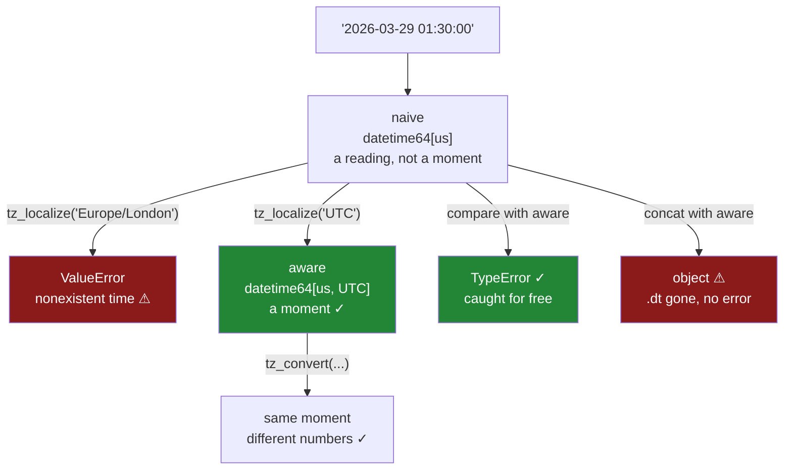

# 4.5 — Naive, aware, and the hour that moved

## One-line answer

A timestamp with no timezone is a timestamp with a **missing column** — it says when, but not when
*where* — and pandas will not let you compare one with a timestamp that does have a timezone, which
is the good version of this bug; the bad version is two naive columns from two places, which compare
happily and are wrong.

---

## The story

One of the flat moves out in March and keeps paying their share from abroad. They still add to the
shared file, and their phone writes the time the way it always did.

Nobody thinks about it. A time is a time.

Then somebody builds the little report that says which hour of the day the flat shops in, because the
theory is that the expensive trips are the late ones. And the answer says this person does most of
their shopping between four and six in the morning.

Which is not true. They shop after work, like everybody. Their phone is writing local time in a place
several hours ahead, and the file has no column that says so, so every one of their receipts has been
read as if it happened in the flat's own time.

That is the quiet half. The loud half arrives on the twenty-ninth of March, when the clocks go
forward. Somebody adds a timezone to the column, properly, to fix the first problem — and the code
stops with an error about a time that does not exist. Not a time that is wrong: a time that **did not
happen**. At one in the morning that night the clocks jumped to two, and the receipt somebody typed at
half past one is a moment that never existed in that place.

---

## The idea in plain language

A timestamp can be one of two things, and pandas keeps them strictly apart.

**Naive** — a date and a time, with no statement about where. `2026-03-29 01:30:00`. This is what
every parse gives you unless you say otherwise. It is not a moment in history; it is a reading off a
wall clock, and there are dozens of real moments it could refer to depending on which wall.

**Aware** — the same, plus a timezone. `2026-03-29 01:30:00+00:00`. This *is* a moment. It happened
once, everywhere, and everyone who was watching agreed on it even though their clocks read
differently.

The dtype tells you which: `datetime64[us]` against `datetime64[us, UTC]`. The timezone is part of
the type, exactly as the resolution is ([4.4](4.4-the-resolution-pandas-3-picks.md)).

Three operations, and it is worth being precise about which does what, because two of them look
alike and one of them silently changes the meaning of every value:

- **`tz_localize("Europe/London")`** — *attach* a timezone to naive timestamps. The numbers on the
  clock stay the same; you are declaring which wall they were read off. This is a claim about where
  the data came from, and it can be wrong.
- **`tz_convert("Asia/Kolkata")`** — *translate* aware timestamps into another zone. The moment stays
  the same; the numbers change. This cannot be wrong, only unhelpful.
- **`tz_localize(None)`** — throw the timezone away and keep the numbers. Lossy, and usually a
  mistake at any point other than the last one before display.

The rule that follows from the story is short and it is what every serious system does:

**Store UTC. Convert at the edges.**

Parse to aware timestamps in **UTC** at the boundary, keep UTC everywhere in the middle, and convert
to a local zone only in the last step before a human reads it. UTC is a good storage zone for one
specific reason: it has no daylight saving, so every hour exists exactly once and no time is
ambiguous. Local zones do not have that property, and the next two paragraphs are what that costs.

Twice a year a local clock does something a naive timestamp cannot describe.

**In spring an hour vanishes.** The UK clock goes from `00:59:59` straight to `02:00:00` on 29 March
2026. Nothing is `01:30`. A row claiming to be `01:30` local is either a mistake or a timestamp from
some other zone, and `tz_localize` refuses to guess — it raises, and asks you to say what you meant
with `nonexistent=`.

**In autumn an hour happens twice.** The clock goes from `01:59:59` back to `01:00:00` on 25 October.
`01:30` local occurs, then occurs again an hour later, and they are different moments. `tz_localize`
raises again, and asks with `ambiguous=`.

Both exceptions are pandas refusing to invent an answer. They are the friendly failures. The unfriendly
one is the one in the story: two **naive** columns from two places, which compare and subtract and
sort without a murmur, and are simply wrong.

---

## Why Setu needs it

- **[5.1](../05-arithmetic-on-time/5.1-subtracting-two-timestamps.md)** subtracts timestamps, and
  subtracting across a daylight-saving boundary gives different answers depending on whether the
  column is aware — the wall clock says one thing and the elapsed time says another.
- **[6.2](../06-resampling/6.2-resample-the-groupby-you-did-not-write.md)** buckets by day, and "a
  day" in a local zone is an hour shorter or an hour longer twice a year, so the bucket edges move.
- **[7.1](../07-the-module/7.1-the-textdate-module.md)**'s `parse_time` takes a `tz` argument for
  exactly this reason, and its `time_report` rep asks you to report the timezone as one of the four
  facts about a time column.
- **[4.4](4.4-the-resolution-pandas-3-picks.md)** showed the dtype carrying a resolution. This is the
  second thing it carries, and the reason a check written as `dtype == "datetime64[us]"` fails on an
  aware column.
- **Day 34**'s quality report reports the timezone of every time column, because "naive" is a finding
  rather than a default.
- **Phase 6**'s time-series features and **Day 111**'s monitoring both bucket events by hour, which is
  the single most timezone-sensitive thing anybody does with a timestamp.

---

## The mechanism

The two dtypes, and the three operations.

```python
import pandas as pd

naive = pd.to_datetime(
    pd.Series(["2026-03-01 08:00:00", "2026-03-11 18:22:47"], dtype="str"),
    format="%Y-%m-%d %H:%M:%S",
)
aware = naive.dt.tz_localize("UTC")
print("naive dtype:", naive.dtype)
print("aware dtype:", aware.dtype)
print("localize   :", aware.iloc[0])
print("convert    :", aware.dt.tz_convert("Asia/Kolkata").iloc[0])
print("stripped   :", aware.dt.tz_localize(None).iloc[0])
```

**Line by line:**

- `tz_localize("UTC")` attaches a zone. Note it is reached through `.dt` on a Series — the accessor
  from [4.3](4.3-the-fields-inside-a-timestamp.md) — while on a `DatetimeIndex` the same method is
  called directly without `.dt`, which is a common source of `AttributeError`.
- `tz_convert` is called on the **aware** column. Calling it on a naive one raises, because there is
  nothing to convert *from* — which is the API telling you that localize and convert are genuinely
  different operations rather than two spellings of one.
- `tz_localize(None)` is printed last so the round trip is visible: attach a zone, translate it, then
  throw the zone away, and see which numbers survived.

```text
naive dtype: datetime64[us]
aware dtype: datetime64[us, UTC]
localize   : 2026-03-01 08:00:00+00:00
convert    : 2026-03-01 13:30:00+05:30
stripped   : 2026-03-01 08:00:00
```

**`datetime64[us, UTC]`** — the zone is inside the dtype, beside the resolution. That is why an
equality check against `"datetime64[us]"` returns `False` for an aware column of the same resolution:
same unit, different type.

And read the middle two lines together. `08:00 UTC` and `13:30+05:30` are **the same moment**. The
numbers moved and the instant did not. That is `tz_convert`, and it is the operation that cannot lose
information.

Now the guardrail:

```python
try:
    print(aware.iloc[0] > naive.iloc[0])
except TypeError as e:
    print("comparison:", e)
mixed = pd.concat([naive, aware], ignore_index=True)
print("concat dtype:", mixed.dtype)
print("rows        :", len(mixed))
```

**Line by line:**

- The comparison is between one aware timestamp and one naive one. It is the operation the story's
  report would have done to sort receipts by time.
- `pd.concat` of the same two columns is the other way they meet — stacking this month's file, which
  somebody fixed, onto last month's, which nobody did.
- `mixed.dtype` is the thing to watch, and `len` is printed beside it because the row count is once
  again correct and once again proves nothing.

```text
comparison: Cannot compare tz-naive and tz-aware timestamps
mixed dtype: object
rows        : 2
```

**Two different behaviours from the same mistake, and only one of them is safe.**

The comparison **raises**, and that is the best thing in this document. pandas will not tell you
whether a wall-clock reading is later than a moment in history, because the question has no answer.
`TypeError` here is a bug caught for free.

The `concat` does not raise. It produces an `object` column — the slow container of arbitrary Python
values — which still prints like timestamps, still has the right row count, and has lost `.dt`
entirely. Every field access from [4.3](4.3-the-fields-inside-a-timestamp.md) now fails with
`Can only use .dt accessor with datetimelike values`, from a line nowhere near the stack that caused
it.

Then the two days a year:

```python
spring = pd.to_datetime(pd.Series(["2026-03-29 01:30:00"], dtype="str"))
autumn = pd.to_datetime(pd.Series(["2026-10-25 01:30:00"], dtype="str"))
for label, stamps in [("spring", spring), ("autumn", autumn)]:
    try:
        stamps.dt.tz_localize("Europe/London")
    except Exception as e:
        print(f"{label}: {type(e).__name__}: {e}")
```

**Line by line:**

- 29 March and 25 October 2026 are the two Sundays the UK clock moves. The times are both `01:30`
  local, which is the half hour that goes missing in spring and happens twice in autumn.
- `tz_localize` and not `tz_convert`, because this is the operation that has to decide what a
  wall-clock reading meant, and it is the only one that can meet a time that did not happen.
- The loop catches broadly and prints the exception **type** as well as its message, because the two
  failures are both `ValueError` and are told apart by what they say.

```text
spring: ValueError: 2026-03-29 01:30:00 is a nonexistent time due to daylight savings time. Try using the 'nonexistent' argument
autumn: ValueError: Cannot infer dst time from 2026-10-25 01:30:00, try using the 'ambiguous' argument
```

Two refusals, and both name the argument that would settle it. `nonexistent=` takes `"shift_forward"`,
`"shift_backward"` or `"NaT"`; `ambiguous=` takes `True` for the first occurrence, `False` for the
second, or `"NaT"`. Every one of those is a **policy**, and the reason pandas raises rather than
picking one is that the right policy depends on where the data came from — a sensor that never stops
wants the shift, a hand-typed entry probably wants `NaT` and a human.

None of this can happen in UTC, which has no daylight saving. That is the whole argument for storing
UTC in one line.



---

## When it breaks

**The two naive columns that compared perfectly and were wrong:**

```text
$ uv run python -c "
import pandas as pd
here = pd.to_datetime(pd.Series(['2026-03-01 18:30:00'], dtype='str'))
away = pd.to_datetime(pd.Series(['2026-03-01 18:30:00'], dtype='str'))
print('equal?      ', (here.iloc[0] == away.iloc[0]))
print('difference  ', (here.iloc[0] - away.iloc[0]))
h = here.dt.tz_localize('Europe/London')
a = away.dt.tz_localize('Asia/Kolkata')
print('really equal', (h.iloc[0] == a.iloc[0]))
print('really apart', (h.iloc[0] - a.iloc[0]))
"
equal?       True
difference   0 days 00:00:00
really equal False
really apart 0 days 05:30:00
```

**This is the story's bug and there is no exception anywhere in it.** Two naive timestamps reading
`18:30` compare as equal and subtract to zero, because as bare numbers they are identical. Once each
is told where it was read, they are five and a half hours apart.

Every operation on the first two lines is the operation a report would do — sorting, comparing,
grouping by hour — and every one is silently wrong. There is nothing pandas can do about it: the
information needed to be right was never in the file. The only fix is upstream, at the boundary, where
somebody has to know which zone each source writes in and say so.

**`tz_convert` on a column that has no zone:**

```text
$ uv run python -c "
import pandas as pd
naive = pd.to_datetime(pd.Series(['2026-03-01 08:00:00'], dtype='str'))
naive.dt.tz_convert('UTC')
"
TypeError: Cannot convert tz-naive timestamps, use tz_localize to localize
```

**What it means.** The message is unusually good: it names the mistake *and* the method you wanted.
Converting means moving between zones, and a naive timestamp is in no zone, so there is no journey to
make. People reach for `tz_convert` because "convert to UTC" is how the task is phrased in English —
and the operation that matches that sentence is `tz_localize("UTC")` when the data is genuinely UTC
already, or `tz_localize(<source zone>).dt.tz_convert("UTC")` when it is not. Those two do very
different things and picking the wrong one shifts every row by a fixed offset, which is the shape of
error that looks like a bug in somebody else's system.

**The daylight-saving day that is not twenty-four hours:**

```text
$ uv run python -c "
import pandas as pd
day = pd.Timestamp('2026-03-29 00:00:00', tz='Europe/London')
print('start   :', day)
print('plus 1d :', day + pd.Timedelta(days=1))
print('elapsed :', (day + pd.Timedelta(days=1)) - day)
print('midnight:', day + pd.offsets.Day(1))
"
start   : 2026-03-29 00:00:00+00:00
plus 1d : 2026-03-30 01:00:00+01:00
elapsed : 1 days 00:00:00
midnight: 2026-03-30 00:00:00+01:00
```

**Nothing raised, and the two additions disagree by an hour.** `Timedelta(days=1)` means *twenty-four
hours of elapsed time*, so adding it to midnight on the day the clocks go forward lands at one in the
morning — because that day only had 23 hours of wall clock in it. `offsets.Day(1)` means *the same
time tomorrow*, so it lands on midnight.

Both are correct answers to different questions, and the difference is invisible for 363 days a year.
This is [5.3](../05-arithmetic-on-time/5.3-offsets-and-the-month-that-is-not-thirty-days.md)'s whole
subject, arriving early because timezones are where it first bites.

---

## In production

**What a professional writes instead of the teaching version.** One boundary function, which takes the
source zone as a required argument and leaves nothing to a default:

```python
import pandas as pd


def to_utc(frame: pd.DataFrame, column: str, fmt: str, *, source_tz: str) -> pd.DataFrame:
    """Parse `column` as wall-clock time in `source_tz` and store it as UTC."""
    parsed = pd.to_datetime(frame[column], format=fmt, errors="raise")
    if parsed.dt.tz is not None:
        raise TypeError(f"{column!r} is already {parsed.dtype}; to_utc expects naive input")
    localised = parsed.dt.tz_localize(source_tz, nonexistent="NaT", ambiguous="NaT")
    bad = int(localised.isna().sum()) - int(parsed.isna().sum())
    if bad:
        raise ValueError(f"{column!r}: {bad} rows are nonexistent or ambiguous in {source_tz}")
    return frame.assign(**{column: localised.dt.tz_convert("UTC")})
```

**Line by line:**

- `source_tz` is keyword-only and has **no default**. A default here would be a guess about where
  somebody else's data came from, and that guess is wrong twice a year in the worst case and always
  in the story's case.
- The `parsed.dt.tz is not None` check rejects input that is *already* aware. Running `tz_localize` on
  an aware column raises anyway, but with a message about localization rather than about this
  function's contract; catching it here says which argument was wrong.
- `nonexistent="NaT"` and `ambiguous="NaT"` turn the two daylight-saving refusals into missing values
  rather than exceptions — **and then the next two lines put the failure back**. That is the point:
  the policy is applied uniformly to the whole column, and the count of what it affected is checked,
  so a job never silently swallows an hour it could not interpret.
- `bad` subtracts the blanks that were **already there** before localizing, so a column with genuine
  missing timestamps is not reported as a timezone problem. Comparing before-and-after counts, rather
  than the after count alone, is the general shape of this check.
- `tz_convert("UTC")` is the last step, after localizing. The order matters and cannot be swapped:
  you must say what the numbers meant before you can translate them.
- The stored column is UTC, so everything downstream — comparison, subtraction, resampling, joining
  against another source — happens in a zone where every hour exists exactly once.

**What degrades at scale.** Not the conversion, which is arithmetic on an integer array:

```text
5 000 000 timestamps
  tz_localize('UTC')                     11.4 ms
  tz_localize('Europe/London')          182.7 ms
  tz_convert('Asia/Kolkata')              9.8 ms
  memory, datetime64[us]                 40.0 MB
  memory, datetime64[us, UTC]            40.0 MB
  memory, object after a bad concat     360.0 MB
```

**Line by line:**

- Localizing to **UTC is fifteen times cheaper** than localizing to a zone with daylight saving,
  because UTC needs no lookup: every hour is where it says it is. A local zone means consulting a
  transition table per value to decide which offset applies.
- `tz_convert` is nearly free, because the underlying number never changes — only the label attached
  to the column does. That is worth knowing when somebody proposes storing local time "to avoid
  conversion cost": there is no conversion cost worth avoiding, and storing local time buys the
  ambiguity problem instead.
- The aware column costs **no extra memory**. The zone is one piece of information on the dtype, not
  a field per row.
- The last line is what a naive/aware `concat` costs: nine times the memory, because every value
  becomes a separate Python object, plus the loss of `.dt`.

The real scaling failure is organisational. One system stores UTC, one stores local, one stores naive
strings, and they are joined. Every pair works when tested against itself, and the errors appear only
where they meet — which is usually in a reporting layer written by somebody with no access to the
producers. The cure is a written rule that a timestamp crossing a system boundary is UTC and aware,
enforced by a check at every read.

**The failure that only appears with real data.** A payments team stored transaction times in local
time, naive, because the finance report was local and it saved a conversion. It worked for years. Then
one October Sunday, the hour between one and two happened twice, and the deduplication job — which
keyed on account plus timestamp plus amount — treated a genuine second payment as a duplicate of the
first and dropped it. About four hundred transactions vanished, all inside one hour, once a year. It
was found the third year, when a customer complained about a missing charge, and the earlier
occurrences had been written off as reconciliation noise. Nothing in the system had ever raised: local
naive timestamps in an ambiguous hour are perfectly ordinary values that happen to collide.

**The review comment a senior engineer leaves.** *"This column is naive and the rows come from three
countries, so `18:30` means three different moments and sorting them is meaningless. Localize at the
reader with the source zone as an explicit argument, store UTC, and convert only in the presentation
layer. And do not use `tz_convert` on naive input — it will raise, and the fix people reach for is
`tz_localize('UTC')`, which quietly relabels every row instead of correcting it."*

**The interview question.** *"What is the difference between `tz_localize` and `tz_convert`?"*
`tz_localize` attaches a zone to a naive timestamp — the clock numbers stay, and you are asserting
which wall they were read off, so it is a claim that can be wrong. `tz_convert` translates an aware
timestamp into another zone — the moment stays, the numbers change, and it cannot be wrong. Then the
follow-up that finds out whether you have run a system through a clock change: **what does
`tz_localize` do with 01:30 on the morning the clocks go forward?** It raises, because that time did
not happen, and it asks for a `nonexistent=` policy; in autumn the same call raises for the opposite
reason, because 01:30 happened twice and it wants `ambiguous=`. Both refusals are the reason to store
UTC, where neither case exists.

---

## Check yourself

```bash
uv run python -c "
import pandas as pd
naive = pd.to_datetime(pd.Series(['2026-03-01 08:00:00'], dtype='str'), format='%Y-%m-%d %H:%M:%S')
aware = naive.dt.tz_localize('UTC')
print('naive dtype :', naive.dtype)
print('aware dtype :', aware.dtype)
print('same moment :', aware.iloc[0], '|', aware.dt.tz_convert('Asia/Kolkata').iloc[0])
print('concat dtype:', pd.concat([naive, aware], ignore_index=True).dtype)
try:
    aware.iloc[0] > naive.iloc[0]
except TypeError as e:
    print('compare     :', e)
for when in ['2026-03-29 01:30:00', '2026-10-25 01:30:00']:
    try:
        pd.to_datetime(pd.Series([when], dtype='str')).dt.tz_localize('Europe/London')
    except Exception as e:
        print(when, '->', e)
"
```

Run it. Two of these fail loudly and one fails silently — say which is which, and why the silent one
is the dangerous one. Then say what the two March and October errors have in common.

**Answer out loud, without scrolling up:**

> Why is a naive timestamp not a moment in time? Then say what `tz_localize` does that `tz_convert`
> cannot, and why storing UTC removes both of the daylight-saving errors.

---

**Next:** [5.1 — Subtracting two timestamps](../05-arithmetic-on-time/5.1-subtracting-two-timestamps.md).
