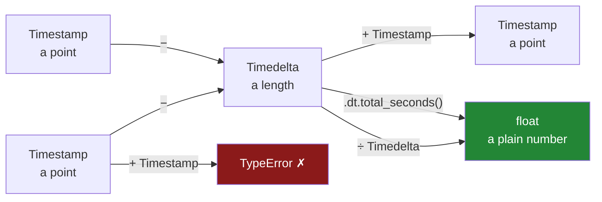

# 5.1 — Subtracting two timestamps

## One-line answer

Take one timestamp away from another and you do not get a number — you get a **duration**, a value
of its own type called `Timedelta`, and `.dt.total_seconds()` or `.dt.days` is how you turn that
duration into a number you can average, plot or put in a report.

---

## The story

Four people share a flat and take turns doing the shopping. Whoever goes types what they bought into
the shared file on their phone, with the price and the moment they paid.

By the middle of March the file has eight lines in it, and somebody asks a fair question at the
kitchen table: *how often does anybody actually go?* Not who goes most — how long the flat tends to
leave it between one shop and the next, because they keep running out of milk and nobody can say
whether that is bad luck or a real pattern.

So one of them sorts the file by when things were paid for, and takes the moment of one shop away
from the moment of the shop before it. That is the right idea, and it is exactly the sum you would
do on paper.

What comes back is not what they expected. It is not `1.05`, and it is not `25`. It prints as
`1 days 01:18:42`, which is clearly correct and clearly not a number.

---

## The idea in plain language

There are two different kinds of value hiding in this question, and the whole of section 5 turns on
telling them apart.

A **timestamp** is a *point*: a specific moment, `2026-03-01 08:12:30`. That is what
[4.2](../04-the-dt-accessor/4.2-to-datetime-format-and-errors.md) built out of the flat's text, and
what [4.3](../04-the-dt-accessor/4.3-the-fields-inside-a-timestamp.md) took apart into a year, a
month and an hour of the day. In pandas a single one is a `Timestamp`, and a column of them has the
dtype `datetime64[us]` — the "us" is microseconds, and that choice is
[4.4](../04-the-dt-accessor/4.4-the-resolution-pandas-3-picks.md)'s subject.

A **duration** is a *length*: how much time sits between two points. It has no position on the
calendar. "One day, one hour, eighteen minutes and forty-two seconds" is a duration, and it does not
say which day. In pandas a single one is a `Timedelta`, and a column of them has the dtype
`timedelta64[us]`.

Those are two genuinely different things, and pandas keeps them apart on purpose. The rules that
follow are the rules of a ruler, not the rules of arithmetic:

- **point − point = length.** Two moments have a gap between them. This is what the flat wanted.
- **point + length = point.** Start somewhere, move along by an amount, land somewhere else.
- **length + length = length.** Two gaps, laid end to end.
- **length ÷ length = a plain number.** "How many of these fit in that" — this is how you get `2.96`
  out of a gap of nearly three days.
- **point + point = nothing at all.** Not a hard sum, a meaningless one, in the way that adding two
  street addresses is meaningless. pandas refuses rather than guessing.

A **dtype** is the one type every value in a column shares
([Day 26, 1.4](../../../day-26-frames-and-copy-on-write/parts/01-the-two-objects/1.4-one-dtype-per-column.md)).
Because `timedelta64[us]` is its own dtype, a duration column knows it holds durations, and its
accessor is `.dt` — the same doorway as timestamps, described in
[1.1](../01-the-str-accessor/1.1-the-column-that-has-no-lower.md), holding a different set of
methods. An **accessor** is a small doorway hanging off a column, holding methods that only make
sense for one kind of data.

Two `.dt` methods on a duration column matter more than the rest, and they answer different
questions.

`.dt.total_seconds()` gives the **whole** duration expressed in seconds, as an ordinary decimal
number. A gap of one day and a bit becomes `91122.0`. Nothing is thrown away; the unit has simply
changed. That number is a `float64` and behaves like any other number column.

`.dt.days` gives the **days component** — the number in front of the word `days` in the printout. It
is one field of the value, not the value converted. A gap of two days and twenty-three hours has a
`.dt.days` of `2`, because the rest lives in a different field. That is not rounding and it is not a
bug; it is reading one part of a value and calling it the whole. It is also the most common way a
report about time comes out wrong, and [5.2](5.2-timedelta-and-its-units.md) is about exactly that.

---

## Why Setu needs it

- **[5.2](5.2-timedelta-and-its-units.md)** takes the `Timedelta` apart properly — how you build one
  from scratch, what its components are, and why comparing against one is safer than comparing
  against a count of days.
- **[5.3](5.3-offsets-and-the-month-that-is-not-thirty-days.md)** shows the one kind of "add time"
  that a `Timedelta` cannot express, because a month is not a fixed length.
- **[6.5](../06-resampling/6.5-rolling-is-not-resample.md)** compares a window that moves with each
  row against one bucket per week. The spacing between rows — which is what this part measures — is
  what decides whether either answer means anything.
- **Day 34** builds a data-quality report whose first lines include the span between the oldest and
  newest row. That span is a `Timedelta`.
- **Day 111**'s feature engineering leans on this constantly: *time since the previous event* is
  `sort_values`, then `.diff()`, then `.dt.total_seconds()`.

---

## The mechanism

Here is the flat's file, parsed and sorted so the shops are in the order they happened.

```python
import pandas as pd

receipts = pd.DataFrame(
    {
        "item": ["Milk", "milk ", "MILK", "milk", "Bread", "bread ", "Eggs", "rice"],
        "paid_at": [
            "2026-03-01 08:12:30",
            "2026-03-04 19:40:05",
            "2026-03-08 11:05:00",
            "2026-03-11 18:22:47",
            "2026-03-02 09:31:12",
            "2026-03-09 17:58:40",
            "2026-03-05 12:04:19",
            "2026-03-10 20:11:03",
        ],
        "price": [1.15, 1.15, 1.20, 1.20, 1.40, 1.40, 2.30, 3.05],
    }
)
receipts["paid_at"] = pd.to_datetime(receipts["paid_at"], format="%Y-%m-%d %H:%M:%S")
trips = receipts.sort_values("paid_at").reset_index(drop=True)
print(trips.dtypes)

span = trips.loc[7, "paid_at"] - trips.loc[0, "paid_at"]
print()
print("span           :", span)
print("type           :", type(span))
print("span in seconds:", span.total_seconds())
print("span.days      :", span.days)
```

**Line by line:**

- `pd.to_datetime(..., format="%Y-%m-%d %H:%M:%S")` turns the text into real timestamps, with the
  shape of the text spelled out rather than guessed. Passing `format=` explicitly is the rule from
  [4.2](../04-the-dt-accessor/4.2-to-datetime-format-and-errors.md), and without it a subtraction
  further down either raises or, worse, silently reads the day as the month.
- `sort_values("paid_at")` puts the rows in the order the shops happened. The file was typed in the
  order people remembered to type it, not the order they paid, and every gap on this page is
  meaningless until the rows are ordered
  ([Day 29, 4.1](../../../day-29-iteration-and-order/parts/04-sorting/4.1-sort-values-the-order-you-asked-for.md)).
- `reset_index(drop=True)` throws away the old row labels and numbers the sorted rows from zero, so
  that "row 4" below means the fifth shop
  ([Day 31, 4.1](../../../day-31-groupby/parts/04-the-keys/4.1-the-key-became-the-index.md)).
- `print(trips.dtypes)` before anything else, because the dtype is what decides whether the next
  line is a subtraction or an error.
- `trips.loc[7, "paid_at"]` selects one row by label and one column by name, so it returns a single
  value rather than a column
  ([Day 28, 1.4](../../../day-28-selection-and-alignment/parts/01-label-and-position/1.4-rows-and-columns-at-once.md)).
  That value is a `Timestamp`, and the subtraction on that line is the whole idea of this part.
- `type(span)` is printed because the *type* is the lesson. A reader who only sees
  `10 days 10:10:17` will assume it is a formatted string, and be surprised when it does arithmetic.
- `span.total_seconds()` on a single `Timedelta` is a plain method call. On a **column** of
  durations the same idea is spelled `.dt.total_seconds()`, because the accessor is what runs a
  single-value method over every row.
- `span.days` sits next to it so the two can be compared on one screen. They answer different
  questions, and the next block makes that painful.

```text
item                  str
paid_at    datetime64[us]
price             float64
dtype: object

span           : 10 days 10:10:17
type           : <class 'pandas.Timedelta'>
span in seconds: 900617.0
span.days      : 10
```

Ten days and a ten-hour tail between the first shop and the last. `span.days` says `10`, having
quietly dropped the tail.

Now every gap, not just the outer one.

```python
gap = trips["paid_at"].diff()

report = pd.DataFrame(
    {
        "paid_at": trips["paid_at"],
        "gap": gap,
        "gap_seconds": gap.dt.total_seconds(),
        "gap_days_attr": gap.dt.days,
    }
)
print(report.to_string())
print()
print("gap dtype    :", gap.dtype)
print("gap_days_attr:", report["gap_days_attr"].dtype)
```

**Line by line:**

- `.diff()` subtracts each row from the one before it, in a single pass over the column. It is the
  vectorised form of the loop nobody should write
  ([Day 29, 2.1](../../../day-29-iteration-and-order/parts/02-vectorised/2.1-one-operation-every-row.md)),
  and it works for the same reason the two-value subtraction above worked.
- Row 0 has no row before it, so its gap is `NaT` — "not a time", the blank that belongs to
  timestamp and duration columns the way `NaN` belongs to numbers
  ([Day 30, 1.2](../../../day-30-missing-data/parts/01-what-missing-means/1.2-nan-the-number-not-equal-to-itself.md)).
  It is a real absence, not a zero: there genuinely was no previous shop.
- `gap.dt.total_seconds()` needs the `.dt` in front because `gap` is a column, not one value. Once
  it hands back a number, it is just a number: divide it by `3600` for hours, and no accessor is
  involved.
- `gap.dt.days` sits in the same table on purpose, so you can read across a row and see
  `2 days 23:00:41` next to a `gap_days_attr` of `2.0`.
- `.to_string()` prints every row instead of collapsing the middle, and the interesting row here is
  in the middle.

```text
              paid_at             gap  gap_seconds  gap_days_attr
0 2026-03-01 08:12:30             NaT          NaN            NaN
1 2026-03-02 09:31:12 1 days 01:18:42      91122.0            1.0
2 2026-03-04 19:40:05 2 days 10:08:53     209333.0            2.0
3 2026-03-05 12:04:19 0 days 16:24:14      59054.0            0.0
4 2026-03-08 11:05:00 2 days 23:00:41     255641.0            2.0
5 2026-03-09 17:58:40 1 days 06:53:40     111220.0            1.0
6 2026-03-10 20:11:03 1 days 02:12:23      94343.0            1.0
7 2026-03-11 18:22:47 0 days 22:11:44      79904.0            0.0

gap dtype    : timedelta64[us]
gap_days_attr: float64
```

**Read row 4.** The real gap is two days and twenty-three hours, near enough three days.
`gap_days_attr` says `2.0`. If the flat's rule is "somebody should go at least every three days",
row 4 breaks the rule by an hour and `gap_days_attr` says it did not.

**And notice the dtype of `gap_days_attr`: `float64`, not `int64`.** A day count is a whole number,
so why is it a float? Because row 0 is `NaT`, and a plain integer column has no value that means
"missing", so pandas widens the whole column to float to hold the blank
([Day 28, 4.3](../../../day-28-selection-and-alignment/parts/04-alignment/4.3-the-nan-that-changed-the-dtype.md)).
Drop the blank first and `.dt.days` comes back as `int64`.

Durations aggregate as durations, which is the payoff for having their own type.

```python
print("mean gap        :", gap.mean())
print("total           :", gap.sum())
print("first + mean gap:", trips["paid_at"].min() + gap.mean())
print("each gap in days:", (gap / pd.Timedelta(days=1)).round(3).tolist())
```

**Line by line:**

- `gap.mean()` averages durations and gives back a duration. It skips the `NaT`, so it averages
  seven gaps and not eight.
- `gap.sum()` comes to `10 days 10:10:17`, the same value as `span` above — a check that nothing
  was lost on the way.
- `trips["paid_at"].min() + gap.mean()` is *point + length = point*: start at the first shop, step
  forward by the typical gap, land on the day the next shop is due.
- `gap / pd.Timedelta(days=1)` is *length ÷ length*, so it gives plain floats, and it is the best
  answer to "the gap in days, as a decimal". It says the unit out loud, so no reader has to work out
  whether `86400` was seconds or something else.

```text
mean gap        : 1 days 11:44:19.571428
total           : 10 days 10:10:17
first + mean gap: 2026-03-02 19:56:49.571428
each gap in days: [nan, 1.055, 2.423, 0.683, 2.959, 1.287, 1.092, 0.925]
```

The last line is the honest version of the `gap_days_attr` column. Row 4 is `2.959`, not `2.0`.

The type algebra, drawn:



---

## When it breaks

**Adding two moments together:**

```text
$ uv run python -c "
import pandas as pd
a = pd.Timestamp('2026-03-01 08:12:30')
b = pd.Timestamp('2026-03-11 18:22:47')
print(a + b)
"
Traceback (most recent call last):
  File "<string>", line 5, in <module>
TypeError: unsupported operand type(s) for +: 'Timestamp' and 'Timestamp'
```

**What it means.** There is no such thing as the sum of two moments, so `Timestamp` does not define
`+` against another `Timestamp` and Python's own message is the right one. The fix is to ask a
question that has an answer: the midpoint of the two is `a + (b - a) / 2`, which is *point +
length*.

**The same mistake on a whole column** gives a longer traceback and a different message:

```text
$ uv run python -c "
import pandas as pd
s = pd.to_datetime(pd.Series(['2026-03-01 08:12:30','2026-03-11 18:22:47']), format='%Y-%m-%d %H:%M:%S')
print(s + s)
"
  File "...\pandas\core\arrays\datetimelike.py", line 1155, in _add_datetime_arraylike
    raise TypeError(
TypeError: cannot add DatetimeArray and DatetimeArray
```

**What it means.** The same refusal, said by pandas rather than by Python, because a column has its
own `__add__`. `DatetimeArray` is the storage behind a `datetime64[us]` column, and pandas went all
the way down to that layer before refusing: it never tried to be helpful by converting to numbers.

The reduction follows the operator. `s.sum()` on that same column raises
`TypeError: 'DatetimeArray' with dtype datetime64[us] does not support operation 'sum'`, because a
sum is repeated addition. `s.mean()`, by contrast, **is** allowed and returns
`2026-03-06 20:38:12` — the average of some points is a point. That asymmetry catches anyone who
writes a generic `df.sum()` over every column of a report.

**Asking a timestamp column for a duration method:**

```text
$ uv run python -c "
import pandas as pd
s = pd.to_datetime(pd.Series(['2026-03-01 08:12:30','2026-03-11 18:22:47']), format='%Y-%m-%d %H:%M:%S')
print(s.dt.total_seconds())
"
AttributeError: 'DatetimeProperties' object has no attribute 'total_seconds'
```

**What it means.** `.dt` opens onto a different set of methods depending on what the column holds.
On a timestamp column it is `DatetimeProperties`, which has `.year` and `.hour` and no
`total_seconds`, because a moment has no length. On a duration column the same `.dt` is
`TimedeltaProperties`, which has `total_seconds` and no `.year`. The class name in the error tells
you which one you are actually holding, and it is the fastest way to discover that a subtraction you
thought you did never happened.

**Comparing a duration against a bare number:**

```text
$ uv run python -c "
import pandas as pd
g = pd.Timedelta('2 days 23:00:41')
print(g > 3)
"
TypeError: '>' not supported between instances of 'Timedelta' and 'int'
```

**What it means.** `3` of what? pandas will not choose a unit for you. This refusal is a gift: the
version that silently succeeds is `g.dt.days > 3`, and that one is wrong for row 4 of the table
above without saying a word. Write the unit down — `g > pd.Timedelta(days=3)` — and
[5.2](5.2-timedelta-and-its-units.md) is where that habit is argued for properly.

---

## In production

**What a professional writes instead of the teaching version.** Not `.diff()` inline in a pipeline,
but a function that owns the two decisions this operation hides — what order the rows are in, and
what unit the answer is in:

```python
import pandas as pd


def gap_seconds(frame: pd.DataFrame, time_column: str) -> pd.Series:
    """Seconds between each row and the previous one, in time order. First row is NaN."""
    times = frame[time_column]
    if times.dtype.kind != "M":
        raise TypeError(f"{time_column!r} is {times.dtype}, not a timestamp column")
    return times.sort_values().diff().dt.total_seconds()
```

**Line by line:**

- The **name** carries the unit. `gap_seconds` cannot be misread; a function called `gap` can be,
  and is, by the person who plots it against a threshold measured in days.
- `times.dtype.kind != "M"` is the check that the column really is timestamps. `kind` is a
  one-letter summary of a dtype, and `"M"` is the letter for datetime. It stays `"M"` for
  `datetime64[us]`, for `datetime64[ns]`, and for a timezone-aware `datetime64[us, UTC]`
  ([4.5](../04-the-dt-accessor/4.5-naive-aware-and-the-hour-that-moved.md)) — verified by printing
  it. Writing `dtype == "datetime64[us]"` instead would reject a perfectly good nanosecond column,
  and the resolution is not this function's business
  ([4.4](../04-the-dt-accessor/4.4-the-resolution-pandas-3-picks.md)).
- `raise TypeError` rather than a quiet `pd.to_datetime(times)`. A text column arriving here is a
  bug at the read boundary, and parsing it in passing hides that bug behind a guessed format. On a
  text column the message reads `'t' is str, not a timestamp column`.
- `sort_values()` is **inside** the function, not left to the caller. `.diff()` on unsorted rows
  returns numbers rather than an error, and negative gaps in a report are the classic symptom of a
  sort somebody removed for speed.
- The docstring says the first row is `NaN`, because a caller who does `.mean()` on the result needs
  to know whether the count is `n` or `n - 1`.

**What degrades at ten million rows.** Nothing, if you write it this way — and a great deal if you
do not. On a million-row column of timestamps, measured here:

```python
import time

import numpy as np
import pandas as pd

rng = np.random.default_rng(33)
offsets = np.sort(rng.integers(0, 400 * 86400, 1_000_000))
paid_at = pd.Series(pd.Timestamp("2026-01-01") + pd.to_timedelta(offsets, unit="s"))

t0 = time.perf_counter()
gap = paid_at.diff()
print("diff() over 1,000,000 rows:", round(time.perf_counter() - t0, 4), "s ->", gap.dtype)

small = paid_at.head(100_000).tolist()
t0 = time.perf_counter()
manual = [(small[i] - small[i - 1]).total_seconds() for i in range(1, len(small))]
print("python loop over 100,000  :", round(time.perf_counter() - t0, 4), "s")

t0 = time.perf_counter()
_ = paid_at.head(100_000).diff().dt.total_seconds()
print("pandas over the same rows :", round(time.perf_counter() - t0, 4), "s")
```

**Line by line:**

- `np.random.default_rng(33)` is a seeded generator, so this measurement reproduces. A bare
  `np.random` default is banned across Setu for exactly that reason.
- `np.sort` means the timestamps arrive in order, so the timing measures `.diff()` and not a sort.
- `time.perf_counter()` around a single call is a rough measurement, not a benchmark. The rigorous
  version is `timeit` with the minimum of several runs
  ([Day 25, 4.2](../../../day-25-copy-view-and-the-gate/parts/04-the-benchmark/4.2-timeit-honestly.md));
  the gap here is large enough that the rough version tells the truth.
- `.tolist()` before the loop is deliberate. It converts once, so the Python loop is timed doing
  subtraction rather than a hundred thousand pandas element lookups. The loop is handed its best
  case, and it still loses.

```text
diff() over 1,000,000 rows: 0.0439 s -> timedelta64[us]
python loop over 100,000  : 0.7471 s
pandas over the same rows : 0.005 s
```

The loop is about a hundred and fifty times slower on a tenth of the data, which is the same ratio
measured in
[Day 29, 3.3](../../../day-29-iteration-and-order/parts/03-the-measurement/3.3-the-number-and-where-it-stops-mattering.md).
It holds here because a duration column is stored as plain 64-bit integers of microseconds:
subtracting two of them is subtracting two integers, over the whole column, in one pass of compiled
code.

**The failure that only appears with real data.** A team stored "time since the customer's previous
order" as `.dt.days`. It worked for two years, because their orders were weeks apart. Then a
subscription product launched, orders started arriving within the same day, and a third of the
column became `0`. Nothing raised. The model retrained on it and the feature became useless, because
`0` now meant both "just now" and "almost a full day ago". The fix was one word — `total_seconds`
instead of `days` — and the reason it took a quarter to find is that the wrong version had no error
and no missing values.

**The review comment a senior engineer leaves.** *"`df['gap'] = df['t'].diff()` — where is the sort?
This frame comes out of a merge, so its row order is whatever the join produced
([Day 32, 2.1](../../../day-32-joining-and-reshaping/parts/02-merging/2.1-the-key-and-the-rows-it-pairs.md)),
and half these gaps go negative the first time the upstream query changes. Sort inside the function,
and name the column `gap_seconds`."*

**The interview question.** *"You subtract two datetime columns in pandas. What comes back, and how
do you get a number out of it?"* A `Timedelta` column with dtype `timedelta64[us]`;
`.dt.total_seconds()` for the whole value as a float, or division by an explicit `pd.Timedelta` when
you want a named unit. Then the follow-up that separates people who have used it from people who
have read about it: **what is the difference between `.dt.days` and `.dt.total_seconds() / 86400`?**
The first reads one component and throws the rest away, so row 4's gap comes back as `2`. The second
converts the whole value and comes back as `2.959`. Both are legal, neither warns.

---

## Check yourself

```bash
uv run python -c "
import pandas as pd
t = pd.to_datetime(pd.Series([
    '2026-03-05 12:04:19', '2026-03-08 11:05:00', '2026-03-09 17:58:40',
]), format='%Y-%m-%d %H:%M:%S')
gap = t.diff()
print('gap          :', gap.dropna().tolist())
print('dtype        :', gap.dtype)
print('dt.days      :', gap.dt.days.tolist())
print('total_seconds:', gap.dt.total_seconds().tolist())
print('exact days   :', (gap / pd.Timedelta(days=1)).round(3).tolist())
print('mean         :', gap.mean())
"
```

Two gaps, one of them very close to three days. Say which printed line tells you that, and which one
hides it.

**Answer out loud, without scrolling up:**

> A timestamp take away a timestamp gives you what, exactly — and what type is it? Then say why
> `paid_at + paid_at` raises, and name the two different ways to turn the result of a subtraction
> into an ordinary number.

---

**Next:** [5.2 — Timedelta, and the units you have to name](5.2-timedelta-and-its-units.md).
