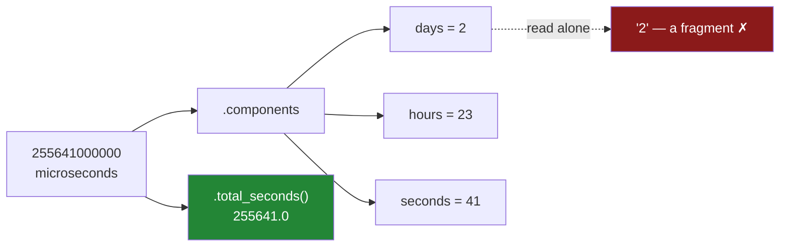

# 5.2 — Timedelta, and the units you have to name

## One-line answer

A `Timedelta` is one whole count of time with no unit attached to the outside of it, so every way of
building one and every way of comparing against one has to say the unit out loud — and `.days` is a
field you read off the value, not the value converted, which is why a report built on `.dt.days`
under-counts and never says so.

---

## The story

The flat has a rule now, agreed at the kitchen table after they ran out of milk twice in one week:
somebody goes to the shop at least every two days. Nobody wrote it down anywhere except on a sticky
note on the fridge.

At the end of March one of them wants to know whether the rule actually held. The file already has
the gap between each shop and the one before it, sitting in a column, printing things like
`2 days 23:00:41`. So they write the obvious check: is the gap bigger than two?

That does not run at all. It stops with a complaint about comparing two different kinds of thing.

So they try the other obvious thing. The column has a `.days` on it, and `.days` gives a plain
number, and a plain number can be compared to two. They write that instead. It runs. It prints a
tidy little table. And the answer it prints — nobody broke the rule, not once — is wrong. Twice that
month, the flat went nearly three days without anybody going, and this check says both of those
trips were fine.

The version that raised was the version telling the truth.

---

## The idea in plain language

A `Timedelta` is stored as **one whole number**, and nothing else: a count of the smallest tick it
uses. That was [5.1](5.1-subtracting-two-timestamps.md)'s duration — the *length* between two
moments, with no position on the calendar. What that part left out is what the number is a count
*of*.

The tick is called the **resolution**. In pandas 3 a duration made from a subtraction has the dtype
`timedelta64[us]`, and the `us` means microseconds, so the value `2 days 23:00:41` is really the
single integer `255641000000`. That default is the same one
[4.4](../04-the-dt-accessor/4.4-the-resolution-pandas-3-picks.md) explains for timestamps, and it
matters here for the same reason: the tick decides the range and the precision, and two columns with
different ticks do not always behave the same.

Everything else you see is a **view** of that one number, computed when you ask for it. That is the
single idea of this part, and two consequences follow from it.

**Building one always names a unit.** You cannot hand pandas a bare `3` and get a duration, because
three of nothing is not a length. Every constructor makes you say it, in one of three ways: inside a
string (`"3 days"`), as a keyword (`days=3`), or with an explicit `unit=` next to the number. The
string form reads best in a review; the keyword form is the one to reach for when the number is a
variable.

**Reading one back gives you a choice of two different questions.** `total_seconds()` converts the
whole value into a decimal count of seconds — nothing is discarded, the unit has just changed.
`.days`, `.seconds` and `.microseconds` are **components**: the numbers that appear in the printed
form `2 days 23:00:41`, split up. They are not the value in different units. They are three parts of
one value, and each one on its own is a fragment.

That distinction is where the flat's check went wrong. `.days` on `2 days 23:00:41` is `2`, and the
twenty-three hours are not rounded away — they are simply somewhere else, in `.seconds`. So
`.days > 2` asks *"is the day-component bigger than two"*, which is a different question from *"is
this duration longer than two days"*, and the two questions disagree on exactly the values a rule
about "at least every two days" is meant to catch.

The safe habit is short: **compare a duration against a duration.** Build `pd.Timedelta("2 days")`
and compare against that. It reads like the rule on the fridge, it cannot silently truncate, and if
you get the type wrong it raises instead of lying.

---

## Why Setu needs it

- **[5.3](5.3-offsets-and-the-month-that-is-not-thirty-days.md)** meets the one length you cannot
  build this way. `pd.Timedelta(months=1)` raises, and the reason it raises is the whole of that
  part.
- **[6.3](../06-resampling/6.3-the-bucket-that-was-empty.md)** and
  **[6.5](../06-resampling/6.5-rolling-is-not-resample.md)** both take a frequency string —
  `"W"`, `"7D"` — and those strings are read by the same unit parser used here.
- **[7.1](../07-the-module/7.1-the-textdate-module.md)** puts the day's rules in a module, and the
  thresholds it holds are `Timedelta` constants rather than numbers, for the reason this part gives.
- **Day 34**'s data-quality report has a "how stale is this table" line. Stale by what is exactly
  this question, and a threshold typed as `24` is a bug waiting for the first table sampled by the
  hour.
- **Day 111**'s feature engineering builds windows — spend in the last seven days, orders in the
  last thirty — and every one of those windows is a `Timedelta` compared against a gap.

---

## The mechanism

Three ways to build the same duration, and one thing they have in common.

```python
import pandas as pd

for how in ["2 days 23:00:41", "3 days", "71 hours", "1h30min"]:
    d = pd.Timedelta(how)
    print(f"pd.Timedelta({how!r:<19}) -> {d!s:<17} total_seconds={d.total_seconds()}")

print("pd.Timedelta(days=2, hours=23, seconds=41) ->", pd.Timedelta(days=2, hours=23, seconds=41))
print("pd.Timedelta(3, unit='D')                  ->", pd.Timedelta(3, unit="D"))
print("pd.Timedelta(90, unit='m')                 ->", pd.Timedelta(90, unit="m"))
```

**Line by line:**

- The **string form** is a small language, not a fixed format. It reads a number followed by a unit
  word, as many times as you like, and it also reads the printed form of a duration straight back
  in. That last property is why `pd.Timedelta("2 days 23:00:41")` works: it is round-tripping its own
  output.
- `"1h30min"` shows the compact spelling, with no spaces. It is the same parser.
- The **keyword form** takes `weeks`, `days`, `hours`, `minutes`, `seconds`, `milliseconds`,
  `microseconds` and `nanoseconds`. Reach for it when a number is coming from a variable, because
  `pd.Timedelta(days=n)` needs no string building and cannot be mistyped into a value that parses
  into something else.
- `unit="D"` is the third form. `unit=` is a single letter or short word, and the letters are **not**
  case-insensitive in the way people assume: `"D"` is days and `"m"` is minutes, while `"M"` is
  rejected outright — see [When it breaks](#when-it-breaks).
- Every one of the three says the unit. There is no fourth form that lets you skip it, and that is
  deliberate.

```text
pd.Timedelta('2 days 23:00:41'  ) -> 2 days 23:00:41   total_seconds=255641.0
pd.Timedelta('3 days'           ) -> 3 days 00:00:00   total_seconds=259200.0
pd.Timedelta('71 hours'         ) -> 2 days 23:00:00   total_seconds=255600.0
pd.Timedelta('1h30min'          ) -> 0 days 01:30:00   total_seconds=5400.0
pd.Timedelta(days=2, hours=23, seconds=41) -> 2 days 23:00:41
pd.Timedelta(3, unit='D')                  -> 3 days 00:00:00
pd.Timedelta(90, unit='m')                 -> 0 days 01:30:00
```

Look at the third row. Seventy-one hours came back printed as `2 days 23:00:00`. Nothing was
converted or rounded — the same integer is simply being displayed in days, hours, minutes and
seconds, because that is how a duration prints. A count of hours *is* a count of days plus a
remainder; they were never two different values.

Now take one apart.

```python
g = pd.Timedelta("2 days 23:00:41")

print("g                :", g)
print("g.days           :", g.days)
print("g.seconds        :", g.seconds)
print("g.total_seconds():", g.total_seconds())
print("g.components     :", g.components)
print("g.unit           :", g.unit)

back = pd.Timedelta("-1 days +01:00:00")
print()
print("back                :", back)
print("back.days           :", back.days)
print("back.total_seconds():", back.total_seconds())
```

**Line by line:**

- `g.days` is `2`, and `g.seconds` is `82841`. Add those up as a length and you get the whole value
  back. Read either one alone and you have a fragment.
- `g.seconds` is **not** the total number of seconds, which is the single nastiest name in this API.
  It is the seconds *left over* after the days are taken out, so it is always between zero and
  `86399`. The one that means what it says is `total_seconds()`, with the word `total` in it.
- `g.components` prints all seven fields at once, which is the fastest way to convince yourself that
  the components are a decomposition and not a set of conversions.
- `g.unit` reports the resolution — the tick this value counts in. `us` is microseconds, the pandas
  3 default from [4.4](../04-the-dt-accessor/4.4-the-resolution-pandas-3-picks.md).
- `back` is a **negative** duration, which is what you get from a `.diff()` on rows that were not
  sorted. Its components follow Python's own `timedelta` rule: the day field goes down to the next
  whole day and the seconds field counts forward from there. So `-1 days +01:00:00` is minus
  twenty-three hours, and `back.days` is `-1` — a number one further from zero than the value it
  came from. Filtering on `.dt.days` over a column with any negative gap in it goes wrong in the
  opposite direction from the positive case.

```text
g                : 2 days 23:00:41
g.days           : 2
g.seconds        : 82841
g.total_seconds(): 255641.0
g.components     : Components(days=2, hours=23, minutes=0, seconds=41, milliseconds=0, microseconds=0, nanoseconds=0)
g.unit           : us

back                : -1 days +01:00:00
back.days           : -1
back.total_seconds(): -82800.0
```

One number, and the views of it:



Now the flat's actual check, written both ways on the real file.

```python
paid_at = pd.to_datetime(
    pd.Series(
        [
            "2026-03-01 08:12:30",
            "2026-03-02 09:31:12",
            "2026-03-04 19:40:05",
            "2026-03-05 12:04:19",
            "2026-03-08 11:05:00",
            "2026-03-09 17:58:40",
            "2026-03-10 20:11:03",
            "2026-03-11 18:22:47",
        ],
        name="paid_at",
    ),
    format="%Y-%m-%d %H:%M:%S",
)
gap = paid_at.diff()
two_days = pd.Timedelta("2 days")

check = pd.DataFrame(
    {
        "gap": gap,
        "dt_days": gap.dt.days,
        "days_by_dt": gap.dt.days > 2,
        "days_by_timedelta": gap > two_days,
    }
)
print(check.to_string())
print()
print("gaps over two days, counted with .dt.days   :", int((gap.dt.days > 2).sum()))
print("gaps over two days, counted with a Timedelta:", int((gap > two_days).sum()))
```

**Line by line:**

- `two_days` is given a **name** rather than being written inline. A threshold with a name can be
  moved to a module constant, printed in a log line, and changed in one place
  ([7.1](../07-the-module/7.1-the-textdate-module.md) does exactly that).
- `gap > two_days` compares a duration column against a duration. pandas checks the dtypes, finds
  both are `timedelta64`, and does the comparison on the underlying integers. No unit is guessed
  anywhere in that sentence.
- `gap.dt.days > 2` compares a **component** against a plain integer. It is legal, because
  `gap.dt.days` is a float column and `2` is a number. Nothing about the line looks wrong.
- `.sum()` on a boolean column counts the `True` values, because `True` is `1`
  ([Day 28, 2.2](../../../day-28-selection-and-alignment/parts/02-masks/2.2-selecting-with-a-mask.md)).
  `int(...)` is only there to stop it printing as `np.int64`.

```text
              gap  dt_days  days_by_dt  days_by_timedelta
0             NaT      NaN       False              False
1 1 days 01:18:42      1.0       False              False
2 2 days 10:08:53      2.0       False               True
3 0 days 16:24:14      0.0       False              False
4 2 days 23:00:41      2.0       False               True
5 1 days 06:53:40      1.0       False              False
6 1 days 02:12:23      1.0       False              False
7 0 days 22:11:44      0.0       False              False

gaps over two days, counted with .dt.days   : 0
gaps over two days, counted with a Timedelta: 2
```

**Zero against two.** Rows 2 and 4 are both longer than two days — one by ten hours, one by
twenty-three — and the `.dt.days` version misses both, because their day component is exactly `2`
and `2 > 2` is false. The check did not fail loudly, produce a warning, or leave a blank. It printed
a clean table full of `False` and told the flat their rule was never broken.

The same truncation quietly bends every average built on it.

```python
print("mean gap, as a duration:", gap.mean())
print("mean gap, in days      :", round(gap.mean() / pd.Timedelta(days=1), 4))
print("mean of gap.dt.days    :", gap.dt.days.mean())
```

**Line by line:**

- `gap.mean()` averages the durations themselves, so nothing is lost before the average is taken.
- `gap.mean() / pd.Timedelta(days=1)` turns that answer into days at the very end, with the unit
  named in the code. Converting *after* aggregating is the correct order.
- `gap.dt.days.mean()` truncates every value first and then averages the truncated numbers.
  Truncating before aggregating is the wrong order, and it can only ever bias downwards.

```text
mean gap, as a duration: 1 days 11:44:19.571428
mean gap, in days      : 1.4891
mean of gap.dt.days    : 1.0
```

`1.0` against `1.4891`. A third of the answer went missing, and every row that produced it looked
perfectly reasonable on its own.

---

## When it breaks

**The construction that gives you nonsense instead of an error:**

```text
$ uv run python -c "
import pandas as pd
print(pd.to_timedelta(pd.Series([1.0, 2.5])))
"
0   0 days 00:00:00.000000001
1   0 days 00:00:00.000000002
dtype: timedelta64[ns]
```

**What it means.** `pd.to_timedelta` on a column of numbers with no `unit=` falls back to
nanoseconds, so `1.0` became one nanosecond and `2.5` became two. Nobody who writes this line means
nanoseconds; they mean days, or hours, and they left the unit out because the numbers "obviously"
were days. There is no error and no warning, and a downstream comparison against
`pd.Timedelta("2 days")` will simply return `False` for every row forever. The fix is
`pd.to_timedelta(series, unit="h")` — always pass `unit=`, exactly as you always pass `format=` to
`pd.to_datetime` ([4.2](../04-the-dt-accessor/4.2-to-datetime-format-and-errors.md)).

**The unit that used to work:**

```text
$ uv run python -c "
import pandas as pd
print(pd.Timedelta(3, unit='M'))
"
Traceback (most recent call last):
  File "<string>", line 3, in <module>
  File "pandas/_libs/tslibs/timedeltas.pyx", line 917, in pandas._libs.tslibs.timedeltas.disallow_ambiguous_unit
ValueError: Units 'M', 'Y', and 'y' are no longer supported, as they do not represent unambiguous timedelta values durations.
```

**What it means.** This is the most useful error message in the whole of pandas' time handling, and
it is worth reading twice. A month is not a length. Three months from the first of February is not
the same number of days as three months from the first of June, so there is no integer of
microseconds that means "three months", and pandas refuses to invent one. Older versions accepted
`unit="M"` and silently used an average month, which is where a great many billing bugs came from.
What you actually want is a calendar offset, and that is
[5.3](5.3-offsets-and-the-month-that-is-not-thirty-days.md).

The string form refuses for the same reason, with a blunter message:

```text
$ uv run python -c "
import pandas as pd
print(pd.Timedelta('3 months'))
"
ValueError: invalid unit abbreviation: months
```

**The keyword that is not there:**

```text
$ uv run python -c "
import pandas as pd
print(pd.Timedelta(months=1))
"
ValueError: cannot construct a Timedelta from the passed arguments, allowed keywords are [weeks, days, hours, minutes, seconds, milliseconds, microseconds, nanoseconds]
```

**What it means.** The message lists the entire vocabulary of fixed lengths, and `weeks` is the
largest one on it. Everything on that list is a fixed multiple of a second. Everything above it —
months, quarters, years — depends on which month you started in, and so lives in a different type
altogether.

---

## In production

**What a professional writes instead of the teaching version.** Thresholds as named `Timedelta`
constants at the top of the module, never as numbers:

```python
import pandas as pd

MAX_SHOP_GAP = pd.Timedelta(days=2)
STALE_AFTER = pd.Timedelta(hours=6)


def late_trips(gaps: pd.Series, limit: pd.Timedelta = MAX_SHOP_GAP) -> pd.Series:
    """Boolean column: True where the gap since the previous trip exceeded `limit`."""
    if gaps.dtype.kind != "m":
        raise TypeError(f"expected a duration column, got {gaps.dtype}")
    return gaps > limit
```

**Line by line:**

- `MAX_SHOP_GAP` and `STALE_AFTER` are `Timedelta` objects, not the numbers `2` and `6`. A number in
  a config file has to be read together with a comment saying what unit it is in, and that comment
  is the first thing to go stale. A `Timedelta` carries the unit inside the value.
- `limit: pd.Timedelta = MAX_SHOP_GAP` makes the default visible in the signature, so a caller who
  wants a different rule passes a `Timedelta` and cannot pass a bare number by accident — the
  comparison inside would raise if they did.
- `gaps.dtype.kind != "m"` checks that the column really holds durations. `"m"` is the one-letter
  code for timedelta, the sibling of the `"M"` used for datetimes in
  [5.1](5.1-subtracting-two-timestamps.md). The two letters differing only in case is a genuine
  trap; the check is worth a test of its own.
- `gaps > limit` and never `gaps.dt.days > limit.days`. The whole point of holding the threshold as
  a duration is that the comparison then needs no conversion on either side.

**What changes at ten million rows — and it is not speed.** It is the **resolution**. pandas picks
the coarsest tick that can represent your values exactly, and that means two calls which look
identical can produce two different dtypes:

```python
import pandas as pd

whole = pd.to_timedelta(pd.Series([1.0, 2.0]), unit="h")
part = pd.to_timedelta(pd.Series([1.0, 2.5]), unit="h")
from_diff = pd.to_timedelta(pd.Series(["2 days 23:00:41"]))

print("whole hours    :", whole.dtype)
print("fractional     :", part.dtype)
print("parsed text    :", from_diff.dtype)
print("mixed addition :", (from_diff + pd.Timedelta("1 day")).dtype)
```

**Line by line:**

- `whole` holds one and two hours, both of which are a whole number of seconds, so pandas stores
  them as `timedelta64[s]`.
- `part` holds two and a half hours. That is still a whole number of seconds, but the input carried
  a fraction, so pandas falls back to `timedelta64[ns]`. Two lines apart, same function, same
  `unit=`, different dtype. This is the kind of thing to **print rather than assume**.
- `from_diff` parses text and lands on `timedelta64[us]`, matching what a subtraction produces.
- The last line adds two durations of different ticks. pandas resolves that by keeping the finer of
  the two, which is why a mixed frame usually works — right up until the point where it does not.

```text
whole hours    : timedelta64[s]
fractional     : timedelta64[ns]
parsed text    : timedelta64[us]
mixed addition : timedelta64[us]
```

**The failure that only appears with real data.** Nanoseconds run out. A `timedelta64[ns]` column
tops out at `106751 days 23:47:16.854775807`, which is about two hundred and ninety years, and a
`.sum()` over enough rows walks straight into it:

```text
$ uv run python -c "
import pandas as pd
s = pd.to_timedelta(pd.Series(['100000 days']*30)).astype('timedelta64[ns]')
print(s.sum())
"
ValueError: overflow in timedelta operation
```

The same sum at the pandas 3 default of microseconds returns `3000000 days 00:00:00` without
complaint, because the coarser tick buys a thousand times the range. A pipeline that reads a Parquet
file written by an older job, gets nanoseconds back, and sums a duration column over a large table
fails here and nowhere else — link this to
[4.4](../04-the-dt-accessor/4.4-the-resolution-pandas-3-picks.md), which is the same story on the
timestamp side.

**The review comment a senior engineer leaves.** *"`if gap.dt.days > 2` — that is the day component,
not the duration. A gap of `2 days 23:00:41` passes this check. Compare against
`pd.Timedelta(days=2)` and delete `.dt.days` from the file. Same for the `.dt.days.mean()` in the
report: truncate after you aggregate, never before."*

**The interview question.** *"What does `.days` return on a `Timedelta`, and when is it the wrong
thing to use?"* It returns the day component of the decomposed value, not the duration converted to
days, so it truncates towards negative infinity and loses everything below a day. It is wrong in any
comparison or average, and the fix is to compare durations against durations. Then the follow-up:
**why does `pd.Timedelta(3, unit="M")` raise when `pd.Timedelta(3, unit="D")` does not?** Because a
day is a fixed count of seconds and a month is not, so there is no integer that means "one month".
That answer is the door into [5.3](5.3-offsets-and-the-month-that-is-not-thirty-days.md).

---

## Check yourself

```bash
uv run python -c "
import pandas as pd
g = pd.Timedelta('2 days 23:00:41')
print('days         :', g.days)
print('seconds      :', g.seconds)
print('total_seconds:', g.total_seconds())
print('components   :', g.components)
print('> 2 days     :', g > pd.Timedelta(days=2))
print('.days > 2    :', g.days > 2)
print('unit         :', g.unit)
print('no-unit trap :', pd.to_timedelta(pd.Series([1.0, 2.5])).tolist())
"
```

The last two printed comparisons disagree about the same value. Say which one answers the question
"is this longer than two days", and say what `seconds` is counting if it is not the total.

**Answer out loud, without scrolling up:**

> A `Timedelta` is one number counting what? Then name the three ways to build one, say what they
> all have in common, and explain why `.days` on a gap of two days and twenty-three hours is `2`.

---

**Next:** [5.3 — Offsets, and the month that is not thirty days](5.3-offsets-and-the-month-that-is-not-thirty-days.md).
