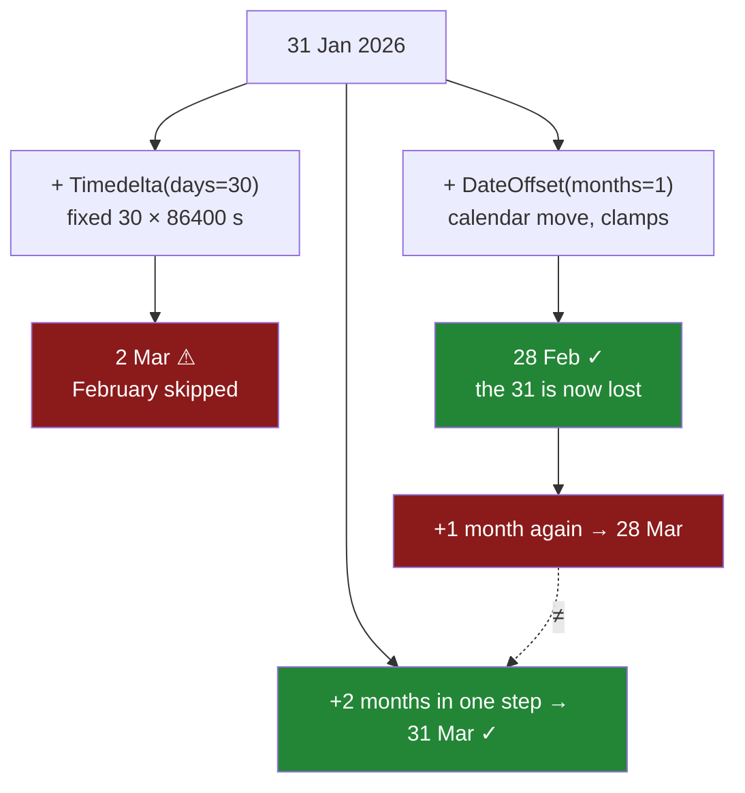

# 5.3 — Offsets, and the month that is not thirty days

## One-line answer

`Timedelta` measures **elapsed time** and every unit it has is a fixed length, so it has no "month";
`DateOffset` and the `offsets` family move you around the **calendar** instead, which is why
`31 January + one month` is `28 February` and why adding a month twice does not equal adding two
months.

---

## The story

The flat has a rule about the bills. Whoever pays the internet gets paid back by the end of the
following month, and somebody decides to put that in the file so it stops being an argument.

They write the obvious thing. Take the date the bill was paid, add a month, and that is the deadline.
There is no "add a month", so they add thirty days, because a month is about thirty days and this is
a shared flat, not a bank.

The January bill is paid on the thirty-first. Thirty days later is the second of March.

February has been skipped. Not shortened — skipped. The deadline for the January bill lands in March,
after the February bill has already been paid, and the little table of who owes what now has two
bills sitting in the same window and one month with nothing in it at all.

Somebody fixes it by adding a month properly. The January deadline becomes the twenty-eighth of
February, which is right. And then, months later, somebody else notices something odder: a bill that
was moved forward a month and then moved back a month has not returned to where it started. It went
from the thirty-first to the twenty-eighth and came back to the twenty-eighth. Three days have gone,
and nothing did anything wrong.

---

## The idea in plain language

There are two completely different things people mean by "adding time", and pandas gives them two
different objects because they genuinely disagree.

**Elapsed time.** A duration measured by a stopwatch. `Timedelta` is this, and it is what
[5.1](5.1-subtracting-two-timestamps.md) and [5.2](5.2-timedelta-and-its-units.md) were about. Every
unit it accepts has a **fixed length**: a day is 86 400 seconds, an hour is 3 600, a week is seven
fixed days. That is exactly why `Timedelta` has **no month and no year** — those are not fixed
lengths. February is 28 or 29 days; a month is 28, 29, 30 or 31.

**Calendar movement.** "The same date next month." This is not a duration at all; it is a rule for
moving a pointer around a calendar. `pd.DateOffset` and the `pd.offsets` family are this, and they
know about months, quarters, years, month ends and business days.

The distinction is not academic. Two of the flat's questions look identical in English and are
different questions:

- *Thirty days after the bill* — a duration. `Timedelta(days=30)`. The answer is a fixed distance away
  whatever month it is.
- *The same date next month* — a calendar move. `DateOffset(months=1)`. The answer is a different
  distance away depending on the month.

Now the part that surprises people, and it is the reason this is a `production` document rather than
a footnote.

**Calendar arithmetic clamps, and clamping loses information.** There is no 31 February. So
`31 January + one month` has to land somewhere, and pandas lands it on the last valid day of the
target month: `28 February`. That is the only sensible choice and every date library makes it.

But once you have clamped, the original day-of-month is gone. Which means:

- **It is not reversible.** Add a month, subtract a month, and `31 January` comes back as
  `28 January`. Three days have quietly disappeared.
- **It is not associative.** Add one month twice and you get `28 March`. Add two months in one step
  and you get `31 March`. Same words, different answers, because the intermediate clamp threw away
  the `31`.

Neither of those is a bug, in pandas or anywhere else. They are consequences of months having
different lengths, and they are unavoidable. What they mean in practice is a rule worth writing down:

**Compute every date from the original, in one step. Never iterate.** A loop that adds one month at a
time to build a schedule will drift for any start date after the twenty-eighth, and it will drift
silently.

One more distinction inside the offsets themselves, because it catches people:

- **`DateOffset(months=1)`** keeps the day of the month, clamping when it must. `15 Jan → 15 Feb`.
- **`offsets.MonthEnd(1)`** moves to the *end* of a month, whatever day you started on.
  `15 Jan → 31 Jan`. It is not "add a month"; it is "go to a month end".

Those two are frequently swapped by mistake, and on a date that is already a month end they give the
same answer — which is exactly the date most people test with.

---

## Why Setu needs it

- **[5.2](5.2-timedelta-and-its-units.md)** established that a `Timedelta` has fixed units. This part
  is why that limitation exists rather than being an oversight.
- **[4.5](../04-the-dt-accessor/4.5-naive-aware-and-the-hour-that-moved.md)** met the same split a day
  earlier in the year: `Timedelta(days=1)` is 24 elapsed hours and `offsets.Day(1)` is "tomorrow, same
  clock time", and across a daylight-saving change they differ by an hour.
- **[6.2](../06-resampling/6.2-resample-the-groupby-you-did-not-write.md)** takes a frequency string
  like `"ME"` or `"QE"`, and those strings **are** offsets — so every bucket edge in a resample is
  built by the machinery in this part.
- **[6.4](../06-resampling/6.4-label-closed-and-the-edge.md)** decides which side of a bucket edge a
  row belongs to, and the edges are month ends produced by exactly these rules.
- **Day 34**'s quality report checks that a date column's range is plausible, and "one month of data"
  is a claim that needs a calendar rather than a subtraction.
- **Phase 6**'s lag features and any month-over-month metric are this arithmetic. A model trained with
  a schedule built by iterating `+1 month` learns from dates that drifted.

---

## The mechanism

The flat's January bill, and the two ways of moving it forward.

```python
import pandas as pd

jan31 = pd.Timestamp("2026-01-31")
print("start                  :", jan31.date())
print("+ Timedelta(days=30)   :", (jan31 + pd.Timedelta(days=30)).date())
print("+ DateOffset(months=1) :", (jan31 + pd.DateOffset(months=1)).date())
print("+ offsets.MonthEnd(1)  :", (jan31 + pd.offsets.MonthEnd(1)).date())
print("+ offsets.MonthBegin(1):", (jan31 + pd.offsets.MonthBegin(1)).date())
```

**Line by line:**

- `pd.Timestamp` builds a single timestamp rather than a column, because the argument here is about
  one date and a Series would put a printing problem between you and it. Everything shown works
  identically on a column.
- `.date()` on each result strips the `00:00:00` that would otherwise take up half the line. It
  produces a Python `date` object, which is fine for printing and is the thing
  [4.3](../04-the-dt-accessor/4.3-the-fields-inside-a-timestamp.md) warned against keeping in a column.
- The four additions are the four things somebody might mean by "next month", written out so they can
  be compared rather than argued about.
- `MonthBegin` is included because it is the one people forget exists, and it is usually what a
  billing period actually wants.

```text
start                  : 2026-01-31
+ Timedelta(days=30)   : 2026-03-02
+ DateOffset(months=1) : 2026-02-28
+ offsets.MonthEnd(1)  : 2026-02-28
+ offsets.MonthBegin(1): 2026-02-01
```

**Four answers, three of them different, and the first one is in the wrong month.** `2026-03-02` is
the story: thirty days from the thirty-first of January steps clean over February. There is nothing
wrong with the arithmetic — it is exactly thirty days — it is just not what "next month" means.

Note that `DateOffset(months=1)` and `MonthEnd(1)` agree here, both giving `28 February`. That
agreement is a coincidence of the start date, and the next block shows it breaking.

```python
mid = pd.Timestamp("2026-01-15")
print("from the 15th:")
print("  DateOffset(months=1):", (mid + pd.DateOffset(months=1)).date())
print("  offsets.MonthEnd(1) :", (mid + pd.offsets.MonthEnd(1)).date())
print()
for start in ["2026-01-31", "2026-02-28", "2026-03-31", "2026-04-30"]:
    t = pd.Timestamp(start)
    print(
        f"{start}  +30d -> {(t + pd.Timedelta(days=30)).date()}"
        f"   +1 month -> {(t + pd.DateOffset(months=1)).date()}"
    )
```

**Line by line:**

- The fifteenth of January is a date that is **not** a month end, which is the only way to see that
  `DateOffset` and `MonthEnd` are different operations. On the thirty-first they agree; on the
  fifteenth they do not.
- The loop walks four consecutive month ends, which is the shape of a real billing schedule, and puts
  the duration answer next to the calendar answer for each.
- The f-string is split across two lines purely so the output columns line up; it is one string.

```text
from the 15th:
  DateOffset(months=1): 2026-02-15
  offsets.MonthEnd(1) : 2026-01-31

2026-01-31  +30d -> 2026-03-02   +1 month -> 2026-02-28
2026-02-28  +30d -> 2026-03-30   +1 month -> 2026-03-28
2026-03-31  +30d -> 2026-04-30   +1 month -> 2026-04-30
2026-04-30  +30d -> 2026-05-30   +1 month -> 2026-05-30
```

From the fifteenth, `DateOffset` gives `15 February` — the same date next month — and `MonthEnd`
gives `31 January`, which is **earlier in the same month**, because the next month end from the
fifteenth is the end of January. That is the swap that ships: it looks right on month-end test data
and moves a mid-month date to the wrong side of the boundary.

The four-row table is worth reading down both columns. The two methods agree on `2026-03-31` and
disagree everywhere else, and the disagreements are between one and three days — small enough to look
like an off-by-one in someone else's code rather than a difference in meaning.

Now the two properties that make iteration unsafe:

```python
t = pd.Timestamp("2026-01-31")
one_then_one = t + pd.DateOffset(months=1) + pd.DateOffset(months=1)
two_at_once = t + pd.DateOffset(months=2)
there_and_back = t + pd.DateOffset(months=1) - pd.DateOffset(months=1)
print("start           :", t.date())
print("+1m then +1m    :", one_then_one.date())
print("+2m in one step :", two_at_once.date())
print("+1m then -1m    :", there_and_back.date())
print("same?           :", one_then_one == two_at_once)
```

**Line by line:**

- `one_then_one` is what a loop does: apply the offset, keep the result, apply it again. It is how
  anybody builds a twelve-month schedule without thinking about it.
- `two_at_once` asks for the same destination in a single move, computed from the original date.
- `there_and_back` is the flat's second puzzle — forward a month, then back a month.
- The comparison at the end is printed rather than described, because the answer is the whole point
  and nobody believes it until they see `False`.

```text
start           : 2026-01-31
+1m then +1m    : 2026-03-28
+2m in one step : 2026-03-31
+1m then -1m    : 2026-01-28
same?           : False
```

**Adding one month twice is not adding two months.** The first path stops at `28 February`, which no
longer remembers it was ever a `31`, so the second step moves the `28` to March. The second path
never lands in February at all and keeps the `31`.

And `+1m then -1m` returns `28 January`, three days from where it started. The operation has no
inverse, because the clamp destroyed the information needed to undo it.

Neither of these is avoidable, and that is the important part. Any correct calendar library behaves
this way, because the alternative — remembering that a date "was really the 31st" — makes other things
worse. What you do about it is not fix it; it is **never iterate**. Build every date in a schedule
from the one original date, with `months=n`, and both problems disappear because there is no
intermediate value to clamp.



---

## When it breaks

**The month `Timedelta` does not have:**

```text
$ uv run python -c "
import pandas as pd
print(pd.Timedelta(days=30))
print(pd.Timedelta(weeks=1))
print(pd.Timedelta(months=1))
"
30 days 00:00:00
7 days 00:00:00
ValueError: cannot construct a Timedelta from the passed arguments, allowed keywords are [weeks, days, hours, minutes, seconds, milliseconds, microseconds, nanoseconds]
```

**What it means.** This is the API refusing to lie, and the message is a documentation page in one
line: it lists every unit a duration is allowed to have. Read the list and note what is **not** in it —
no `months`, no `years`. A `Timedelta` is a fixed count of nanoseconds, and neither of those is a fixed
count of anything.

`weeks` is in the list because a week is always seven days, everywhere, with no exceptions. That is
the test for membership.

The error is worth meeting once, because it is the moment the two concepts separate — and because the
workaround people reach for the second they hit it is `Timedelta(days=30)`, which is the story's bug.

**The offset applied inside a loop:**

```text
$ uv run python -c "
import pandas as pd
cursor = pd.Timestamp('2026-01-31')
looped = []
for _ in range(4):
    cursor = cursor + pd.DateOffset(months=1)
    looped.append(cursor.date())
start = pd.Timestamp('2026-01-31')
direct = [(start + pd.DateOffset(months=n)).date() for n in range(1, 5)]
print('looped:', looped)
print('direct:', direct)
"
looped: [datetime.date(2026, 2, 28), datetime.date(2026, 3, 28), datetime.date(2026, 4, 28), datetime.date(2026, 5, 28)]
direct: [datetime.date(2026, 2, 28), datetime.date(2026, 3, 31), datetime.date(2026, 4, 30), datetime.date(2026, 5, 31)]
```

**Nothing raised, and the two schedules diverge from the second entry onward.** The looped version
clamps once in February and then carries the `28` forever — every later month is a month-end payment
sitting three days early. The direct version recomputes from the original each time and gives the
month end each month, which is what "the last day of each month" means.

This is the single most common real form of the bug, because looping is the natural way to write a
schedule and the divergence only appears for start dates after the twenty-eighth — which is one day in
ten, and never the day somebody picks for a test fixture.

**The offset that was not "add a month":**

```text
$ uv run python -c "
import pandas as pd
for d in ['2026-01-15', '2026-01-31']:
    t = pd.Timestamp(d)
    print(d, '  MonthEnd:', (t + pd.offsets.MonthEnd(1)).date(), '  DateOffset:', (t + pd.DateOffset(months=1)).date())
"
2026-01-15   MonthEnd: 2026-01-31   DateOffset: 2026-02-15
2026-01-31   MonthEnd: 2026-02-28   DateOffset: 2026-02-28
```

**Read the two rows together.** On `2026-01-31` the two agree exactly, and on `2026-01-15` they land
in different months. A test suite whose fixture dates are month ends — which is overwhelmingly likely
for anything about billing periods — cannot tell these two apart, and the substitution passes review
because on the data everyone looked at it is correct.

---

## In production

**What a professional writes instead of the teaching version.** A schedule builder that computes every
date from the original, names which meaning of "monthly" it implements, and refuses the ambiguous
case:

```python
import pandas as pd


def due_dates(start: pd.Timestamp, periods: int, *, rule: str) -> pd.DatetimeIndex:
    """Payment dates after `start`. `rule` says what 'monthly' means here; there is no default."""
    offsets = {
        "same_day": lambda n: pd.DateOffset(months=n),
        "month_end": lambda n: pd.offsets.MonthEnd(n),
        "thirty_days": lambda n: pd.Timedelta(days=30 * n),
    }
    if rule not in offsets:
        raise ValueError(f"rule={rule!r}; choose one of {sorted(offsets)}")
    step = offsets[rule]
    return pd.DatetimeIndex([start + step(n) for n in range(1, periods + 1)])
```

**Line by line:**

- `rule` is keyword-only and has **no default**. "Monthly" is three different schedules and the caller
  is the only one who knows which the contract says, so the function makes them write it down at the
  call site where a reviewer can read it.
- `"thirty_days"` is offered rather than hidden, because sometimes it genuinely is the rule — interest
  conventions and trial periods really are counted in days. The bug in the story was not using it; it
  was using it while meaning something else.
- `step(n)` is computed from **`n`**, and every date is `start + step(n)`. `start` is never reassigned.
  That single decision removes both the clamping drift and the associativity problem, because there is
  no intermediate date to clamp.
- `range(1, periods + 1)` starts at one, so the first due date is one period after the start rather
  than the start itself. Off-by-one here is the other classic in billing code, and writing the range
  explicitly is cheaper than a comment explaining it.
- The list comprehension is wrapped in `pd.DatetimeIndex` so the result is a proper time index that
  can be used directly with `resample` and `reindex` rather than a list of loose timestamps.

**What degrades at scale.** Two hundred thousand timestamps:

```text
+ pd.Timedelta(days=30)      0.002 s
+ pd.offsets.MonthEnd(1)     0.011 s
+ pd.DateOffset(months=1)    0.011 s
```

**Line by line:**

- `Timedelta` is roughly **five times** cheaper, because adding a fixed number of nanoseconds to an
  integer array is one vectorised operation. The calendar offsets have to consult month lengths, so
  they do more work per value.
- Eleven milliseconds for two hundred thousand rows is not a reason to choose the wrong one. Both are
  cheap enough that correctness decides.
- The number to be wary of is not in this table: a **custom** offset, such as `CustomBusinessDay` with
  a holiday calendar, can be one to two orders of magnitude slower than these, because it falls back
  to per-value Python. If a business-day offset appears in a hot loop, materialise the calendar once
  and join against it instead.

The genuine scaling problem is again not speed. It is that **the clamping bug is invisible in
aggregate**. A monthly revenue report built from a drifting schedule is wrong by a day or three on
some rows, so the monthly totals are very slightly wrong in a way no total will ever look odd. Nobody
audits a number that is 0.1% off. It surfaces years later during a reconciliation, when somebody has
to explain why two systems disagree by a rounding error every month.

**The failure that only appears with real data.** A subscription platform generated renewal dates by
looping `+ DateOffset(months=1)` from the sign-up date. Customers who signed up on the 29th, 30th or
31st — about one in ten — had their renewal clamped to the 28th in the first February and then billed
on the 28th of every month forever after, three days earlier than their contract said. It was not
noticed for two years, because each individual charge was correct in amount and only the date was
wrong, and the affected accounts were a minority whose anniversary quietly moved. The fix was one
line — compute from the sign-up date with `months=n` instead of iterating — and a migration to repair
the drifted anniversaries, which was much harder than the fix because the original day of month had
not been stored anywhere.

**The review comment a senior engineer leaves.** *"You are adding `Timedelta(days=30)` and calling it
a month — for a January bill that lands in March. Use `DateOffset(months=1)` if it means the same date
next month, or `MonthEnd` if it means the end of the month, and say which in the parameter name. Also,
this is in a loop: recompute each date from the start with `months=n`, otherwise anything after the
28th clamps once in February and stays clamped for the rest of the schedule."*

**The interview question.** *"What is `Timestamp('2026-01-31') + DateOffset(months=1)`?"* `28 February
2026`, clamped, because there is no 31 February. Then the follow-up that separates people who have
maintained a billing system: **is that operation reversible, and is adding a month twice the same as
adding two months?** No to both. Subtracting a month afterwards gives 28 January, not 31 January, and
`+1 month` twice gives 28 March where `+2 months` gives 31 March — because the intermediate clamp
throws away the original day of the month. The practical rule is to compute every date in a schedule
from the original date in a single step and never to iterate, which makes both problems structurally
impossible rather than merely unlikely.

---

## Check yourself

```bash
uv run python -c "
import pandas as pd
t = pd.Timestamp('2026-01-31')
print('start        :', t.date())
print('+30 days     :', (t + pd.Timedelta(days=30)).date())
print('+1 month     :', (t + pd.DateOffset(months=1)).date())
print('+1m +1m      :', (t + pd.DateOffset(months=1) + pd.DateOffset(months=1)).date())
print('+2m one step :', (t + pd.DateOffset(months=2)).date())
print('+1m then -1m :', (t + pd.DateOffset(months=1) - pd.DateOffset(months=1)).date())
mid = pd.Timestamp('2026-01-15')
print('15th MonthEnd:', (mid + pd.offsets.MonthEnd(1)).date())
print('15th +1 month:', (mid + pd.DateOffset(months=1)).date())
try:
    pd.Timedelta(months=1)
except ValueError as e:
    print('Timedelta    :', e)
"
```

Run it. Two lines that should be equal are not — say which pair and what was lost between them. Then
say which month the `+30 days` answer lands in, and why `MonthEnd` moved the fifteenth *backwards*.

**Answer out loud, without scrolling up:**

> Why does `Timedelta` have a `weeks` argument but no `months` argument? Then say what
> `31 January + one month` gives, and why adding a month twice does not equal adding two months.

---

**Next:** [6.1 — The index that has to be time](../06-resampling/6.1-the-index-that-has-to-be-time.md).
