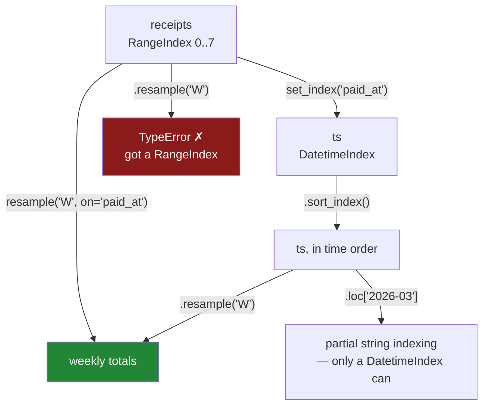

# 6.1 — The index that has to be time

## One-line answer

Grouping a table by time only works when the table is **filed** by time — the row's label has to be
the timestamp itself — so the first move is always `set_index("paid_at")`, and asking without doing
that gives you a refusal, not a wrong answer.

---

## The story

The four people in the flat have been typing their shopping into the shared file for a month now.
Whoever goes to the shop types the item, the price, and when they paid.

Somebody wants to know what the flat spends each week. Not each month, and not in total — each week,
so they can see whether the last two weeks were worse than the first two.

They look at the file. The lines are there, but they are in the order somebody typed them, which is
roughly the order people went shopping and not exactly. There is nothing in the file that says which
week a line belongs to. Nobody wrote a week down. Nobody would.

So they do the obvious thing: they ask the tool for a weekly total. And the tool says no. Not
"here's a wrong number" and not "which week do you mean" — it just refuses, and the refusal talks
about something called an index, which nobody typed into the file either.

---

## The idea in plain language

Every table in pandas has one extra column that is not really a column. It is the **index**: the
label on each row. When you build a table from scratch and say nothing about it, pandas invents the
labels `0, 1, 2, 3, …` and calls that a `RangeIndex`. That is the subject of
[Day 26, 1.2](../../../day-26-frames-and-copy-on-write/parts/01-the-two-objects/1.2-the-index-is-not-a-row-number.md),
and the point made there is worth repeating: those numbers are **labels**, not positions. They
happen to look like positions because nothing has replaced them yet.

You can replace them. `set_index("paid_at")` says: stop labelling these rows `0, 1, 2` and label
them by the value in the `paid_at` column instead. The column leaves the table and becomes the
label. When the values you moved in are timestamps, the index you get is not a plain `Index` — it is
a **`DatetimeIndex`**, which knows its labels are moments in time and can answer questions about
them.

That is the whole requirement. Grouping by time is a thing pandas will do **only** for a table whose
labels are time. The reason is not fussiness. It is that a weekly total needs pandas to invent the
weeks — 1 March to 8 March, 8 March to 15 March, and so on — and to invent them it has to know the
first moment, the last moment, and where each row sits between them. A `RangeIndex` of `0, 1, 2`
cannot answer any of those. It has no first moment; it has a first *label*, and the label is a
number nobody attached any meaning to.

A **timestamp**, in case the word has drifted since
[4.1](../04-the-dt-accessor/4.1-text-that-looks-like-a-date.md), is one exact moment stored as one
number. `pd.to_datetime` turns text into one
([4.2](../04-the-dt-accessor/4.2-to-datetime-format-and-errors.md)), and in pandas 3 that number
counts microseconds ([4.4](../04-the-dt-accessor/4.4-the-resolution-pandas-3-picks.md)).

Filing the rows by time buys three things, and only the third one is what this section is about.

**You can ask for a stretch of time by name.** `ts.loc["2026-03"]` gives you every row in March, and
`ts.loc["2026-03-04":"2026-03-08"]` the rows between two dates. This is called **partial string
indexing**: you hand `.loc` a piece of a date and pandas works out which rows it covers.

**The rows have an order that means something.** Sorting a `DatetimeIndex` sorts by moment, which is
what `sort_index()` does here ([Day 29, 4.4](../../../day-29-iteration-and-order/parts/04-sorting/4.4-sort-index-and-the-cost-of-order.md)).
Sorting a text index sorts by character, which is only the same thing by luck of the format — the
trap [4.1](../04-the-dt-accessor/4.1-text-that-looks-like-a-date.md) opens with.

**You can resample.** `resample` is the method that groups rows into buckets of time, and it is
[6.2](6.2-resample-the-groupby-you-did-not-write.md)'s subject. It will not even start without a
`DatetimeIndex`, and the error it raises is most people's first meeting with this rule.

There is a second way to say it, worth knowing because you will read code that uses it. `resample`
takes an `on=` argument: `receipts.resample("W", on="paid_at")` means "use this column as if it were
the index, just for this call". It gives exactly the same answer, gives none of the other two
benefits, and [In production](#in-production) measures what it costs.

---

## Why Setu needs it

- **[6.2](6.2-resample-the-groupby-you-did-not-write.md)** is the weekly total the flat actually
  wanted, and it opens on the index this part sets.
- **[6.3](6.3-the-bucket-that-was-empty.md)** turns on the fact that a `DatetimeIndex` knows its own
  first and last moment, which is how pandas knows there was a week with nothing in it.
- **[6.5](6.5-rolling-is-not-resample.md)** shows the one operation that raises a *different* error
  on an unsorted time index, so sorting stops being optional there.
- **[7.1](../07-the-module/7.1-the-textdate-module.md)**'s `by_period` function takes the time column
  by name and sets the index itself, so no caller has to remember this.
- **Day 34**'s data-quality report answers "rows per day", and every such line is a resample. **Day
  45** and the rest of Phase 6 build time-series features, where "the index is the clock" stops
  being a rule you follow and becomes the shape of everything you write.

---

## The mechanism

Here is the flat's file, with `paid_at` already turned into real timestamps — that happened in
[4.2](../04-the-dt-accessor/4.2-to-datetime-format-and-errors.md) — and the item names already
cleaned, which happened in [2.1](../02-cleaning-names/2.1-four-spellings-of-milk.md). Eight receipts.

```python
import pandas as pd

receipts = pd.DataFrame(
    {
        "item": ["milk", "milk", "milk", "milk", "bread", "bread", "eggs", "rice"],
        "paid_at": [
            "2026-03-01 08:12:30",
            "2026-03-04 19:40:05",
            "2026-03-08 11:05:00",
            "2026-03-11 18:22:47",
            "2026-03-02 09:31:12",
            "2026-03-09 17:58:40",
            "2026-03-05 12:04:19",
            "2026-03-10 20:11:03",
        ],
        "price": [1.15, 1.15, 1.20, 1.20, 1.40, 1.40, 2.30, 3.05],
    }
)
receipts["paid_at"] = pd.to_datetime(receipts["paid_at"], format="%Y-%m-%d %H:%M:%S")
print(receipts.index)
print(receipts.dtypes)
```

**Line by line:**

- The rows are in the order the four of them typed, grouped by person rather than by date: row 0 is
  1 March and row 4 is 2 March. That is what a shared file looks like, and it is why `sort_index()`
  appears two blocks below rather than never.
- `pd.to_datetime(..., format=...)` spells the format out rather than guessing — the reason is
  [4.2](../04-the-dt-accessor/4.2-to-datetime-format-and-errors.md), and the habit is Principle 4.
- `print(receipts.index)` is the line that matters here. Before deciding whether a table can be
  grouped by time you have to look at what its rows are labelled with, and almost nobody does.

```text
RangeIndex(start=0, stop=8, step=1)
item                  str
paid_at    datetime64[us]
price             float64
dtype: object
```

The `paid_at` **column** is a proper timestamp column — `datetime64[us]`, microsecond resolution, as
[4.4](../04-the-dt-accessor/4.4-the-resolution-pandas-3-picks.md) explains. The **index** is still
`RangeIndex(start=0, stop=8, step=1)`. Having a time column and being filed by time are two
different states, and this is the whole confusion in one printout.

Now move the column into the index.

```python
ts = receipts.set_index("paid_at").sort_index()
print(ts)
print()
print(type(ts.index).__name__)
print(ts.index.dtype, "|", ts.index.name, "|", ts.index.freq)
print("sorted:", ts.index.is_monotonic_increasing, "| unique:", ts.index.is_unique)
```

**Line by line:**

- `set_index("paid_at")` takes the named column out of the table and makes it the row label. Three
  columns become two. Nothing is lost — `reset_index()` puts it back whenever you want it back.
- `.sort_index()` puts the rows in time order. `set_index` on its own does **not** sort; it only
  relabels. Resampling works either way, and [In production](#in-production) measures why you sort
  anyway.
- The result is assigned to a **new name**, `ts`. `set_index` returns a new frame and changes
  nothing in `receipts` — the copy-on-write rule from
  [Day 26, 3.1](../../../day-26-frames-and-copy-on-write/parts/03-copy-on-write/3.1-every-result-behaves-like-a-copy.md).
  A line that calls `set_index` and assigns nowhere has done nothing.
- `type(ts.index).__name__` prints the *kind* of index, not its contents. This is the single check
  that decides whether the next line will work.
- `ts.index.freq` asks whether the index knows it has a regular spacing. Real receipts do not, so
  this prints `None`; an index built by `pd.date_range` does, and prints `<Day>`. Read it once so
  that `None` here never looks like a fault.
- `is_monotonic_increasing` and `is_unique` are the two questions a time index gets asked most often
  and the two that most code forgets to ask.

```text
                      item  price
paid_at
2026-03-01 08:12:30   milk   1.15
2026-03-02 09:31:12  bread   1.40
2026-03-04 19:40:05   milk   1.15
2026-03-05 12:04:19   eggs   2.30
2026-03-08 11:05:00   milk   1.20
2026-03-09 17:58:40  bread   1.40
2026-03-10 20:11:03   rice   3.05
2026-03-11 18:22:47   milk   1.20

DatetimeIndex
datetime64[us] | paid_at | None
sorted: True | unique: True
```

The index is a `DatetimeIndex`, it kept the column's name `paid_at`, and it kept the column's dtype
`datetime64[us]`. Moving a column into the index does not change what it holds; it changes what it
is *for*.

Now the three things the new index buys, in order.

```python
print(ts.loc["2026-03-08"])
print()
print(ts.loc["2026-03-04":"2026-03-08"])
```

**Line by line:**

- `ts.loc["2026-03-08"]` hands `.loc` a **string**, not a timestamp, and gets back every row inside
  that day. On any other index this would be a lookup for a label spelled `"2026-03-08"`, and there
  is no such label — every label carries a wall-clock time too. A `DatetimeIndex` reads the string
  as a **range**. That is partial string indexing.
- `ts.loc["2026-03-04":"2026-03-08"]` is the slice form of the same idea. Note that the end is
  **included** — `.loc` slices are inclusive of their end label, which is
  [Day 28, 1.5](../../../day-28-selection-and-alignment/parts/01-label-and-position/1.5-the-slice-that-includes-its-end.md)
  — so the 8 March receipt is in the answer.
- `.loc` and not `[]`, because `.loc` always means "by label" and never quietly means "by position"
  ([Day 28, 1.2](../../../day-28-selection-and-alignment/parts/01-label-and-position/1.2-loc-by-label.md)).

```text
                     item  price
paid_at
2026-03-08 11:05:00  milk    1.2

                     item  price
paid_at
2026-03-04 19:40:05   milk   1.15
2026-03-05 12:04:19   eggs   2.30
2026-03-08 11:05:00   milk   1.20
```

And now the weekly total, which is the thing the flat actually asked for.

```python
print(ts.resample("W")["price"].sum())
print()
print(receipts.resample("W", on="paid_at")["price"].sum())
```

**Line by line:**

- `ts.resample("W")` is legal because `ts.index` is a `DatetimeIndex`. `"W"` is the **frequency
  alias** for a week; which aliases pandas 3 accepts is [6.2](6.2-resample-the-groupby-you-did-not-write.md)'s
  subject, and the answer is more surprising than it sounds.
- `["price"]` picks the column **before** the aggregation, exactly as after a `groupby`
  ([Day 31, 2.1](../../../day-31-groupby/parts/02-aggregating/2.1-one-number-for-each-group.md)).
  Leaving it out asks pandas to sum `item` too; [6.2](6.2-resample-the-groupby-you-did-not-write.md)
  shows what it does with that.
- The second call uses `receipts`, the **original** frame with its `RangeIndex`, and passes
  `on="paid_at"`. That names the column to bucket by without moving it into the index.
- Both print the same three numbers. `on=` is not a different calculation; it is a different way of
  pointing at the same column.

```text
paid_at
2026-03-01    1.15
2026-03-08    6.05
2026-03-15    5.65
Freq: W-SUN, Name: price, dtype: float64

paid_at
2026-03-01    1.15
2026-03-08    6.05
2026-03-15    5.65
Freq: W-SUN, Name: price, dtype: float64
```

Three weekly totals, and a `Freq: W-SUN` line at the bottom — the result carries a `DatetimeIndex`
that *does* know its spacing, unlike the input. Why the first week holds one lonely receipt of
`1.15` is [6.4](6.4-label-closed-and-the-edge.md), and it is not an accident.

Where the two paths meet:



---

## When it breaks

**The refusal the flat actually met.** Resampling a frame that has a perfectly good timestamp
column, but has not been filed by it:

```text
$ uv run python -c "
import pandas as pd
r = pd.DataFrame({'item':['milk','bread'],'paid_at':pd.to_datetime(['2026-03-01','2026-03-02']),'price':[1.15,1.40]})
r.resample('W')['price'].sum()
"
Traceback (most recent call last):
  File "<string>", line 4, in <module>
  File "...\pandas\core\generic.py", line 9411, in resample
    return get_resampler(
           ^^^^^^^^^^^^^^
  File "...\pandas\core\resample.py", line 2335, in get_resampler
    return tg._get_resampler(obj)
           ^^^^^^^^^^^^^^^^^^^^^^
  File "...\pandas\core\resample.py", line 2541, in _get_resampler
    raise TypeError(
TypeError: Only valid with DatetimeIndex, TimedeltaIndex or PeriodIndex, but got an instance of 'RangeIndex'
```

**What it means.** pandas looked at the index and found `RangeIndex`, which is the default index it
made up when nobody supplied one. It is not complaining about the `paid_at` column — it never looked
at the `paid_at` column. The smallest fix is `r.set_index('paid_at').resample('W')`, or
`r.resample('W', on='paid_at')` if you would rather not move it.

**The one that looks like it should have worked.** The column *was* moved into the index — but it
was never parsed, so what moved in was text:

```text
$ uv run python -c "
import pandas as pd
r = pd.DataFrame({'paid_at':['2026-03-01','2026-03-02'],'price':[1.15,1.40]}).set_index('paid_at')
print(type(r.index))
r.resample('W')['price'].sum()
"
<class 'pandas.Index'>
TypeError: Only valid with DatetimeIndex, TimedeltaIndex or PeriodIndex, but got an instance of 'Index'
```

**What it means.** `set_index` did its job. A column of text moved into the index becomes a plain
`Index`, not a `DatetimeIndex`. The word `'Index'` rather than `'RangeIndex'` is the only clue, and
it is easy to read past. The fix is upstream: `pd.to_datetime` **before** `set_index`, or
`parse_dates=` at read time
([Day 27, 1.5](../../../day-27-reading-and-writing/parts/01-the-csv/1.5-parse-dates-and-the-date-that-stayed-text.md)).

The same table fails a second way, with no resampling in sight: `r.loc['2026-03']` on that text
index raises `KeyError: '2026-03'`. It looks for a label spelled exactly `2026-03`, does not find
one, and stops. Partial string indexing is a `DatetimeIndex` feature, not a string feature.

**The typo in `on=`:**

```text
$ uv run python -c "
import pandas as pd
r = pd.DataFrame({'paid_at':pd.to_datetime(['2026-03-01']),'price':[1.15]})
r.resample('W', on='when')['price'].sum()
"
KeyError: 'when'
```

A plain `KeyError` with the name you asked for. `on=` names a column, so a name that is not a column
fails the same way `r['when']` would.

**The accessor that is not on an index.** After `set_index`, the habit from
[4.3](../04-the-dt-accessor/4.3-the-fields-inside-a-timestamp.md) stops working:

```text
$ uv run python -c "
import pandas as pd
ts = pd.DataFrame({'price':[1.15]}, index=pd.to_datetime(['2026-03-01']))
ts.index.dt.day_name()
"
AttributeError: 'DatetimeIndex' object has no attribute 'dt'
```

**What it means.** `.dt` is the accessor that hangs off a **Series** of timestamps. A `DatetimeIndex`
is not a Series; it holds the timestamp fields directly, so drop the `.dt` and write
`ts.index.day_name()`. It is the mirror of
[1.1](../01-the-str-accessor/1.1-the-column-that-has-no-lower.md): an accessor reaches *into* a
container, and an index that already is the thing needs no doorway.

---

## In production

**What a professional writes instead of the teaching version.** Not `set_index` scattered through a
notebook, but one function that owns the move and refuses to do it on a column that is not time:

```python
import pandas as pd


def as_time_indexed(frame: pd.DataFrame, column: str) -> pd.DataFrame:
    """Return frame filed and sorted by `column`, so it can be resampled and sliced by date."""
    if column not in frame.columns:
        raise KeyError(f"{column!r} is not a column of this frame; have {list(frame.columns)}")
    if not pd.api.types.is_datetime64_any_dtype(frame[column]):
        raise TypeError(f"{column!r} is {frame[column].dtype}, not a timestamp; parse it first")
    return frame.set_index(column).sort_index()
```

**Line by line:**

- The column check comes **first**, so a typo is answered with the list of columns that do exist. A
  bare `KeyError: 'when'` sends you looking in the wrong file.
- `pd.api.types.is_datetime64_any_dtype` is the supported way to ask "is this a timestamp column",
  and `_any_` matters: it says yes for `datetime64[us]`, for `datetime64[ns]`, and for a
  timezone-aware column, so the function does not break when somebody upstream chooses a different
  resolution ([4.4](../04-the-dt-accessor/4.4-the-resolution-pandas-3-picks.md)) or localises the
  column ([4.5](../04-the-dt-accessor/4.5-naive-aware-and-the-hour-that-moved.md)).
- Comparing `frame[column].dtype == "datetime64[us]"` instead would raise on perfectly good data the
  day somebody hands you nanoseconds.
- `raise TypeError` rather than a quiet `pd.to_datetime` rescue. Parsing needs a `format=` and a
  decision about values that do not match, and neither decision belongs here
  ([4.2](../04-the-dt-accessor/4.2-to-datetime-format-and-errors.md)).
- `.sort_index()` is inside the function, not left to the caller, because the caller will forget and
  the cost of forgetting is measured below.
- The return is a new frame; `frame` is untouched. Every function in
  [7.1](../07-the-module/7.1-the-textdate-module.md) has this property, and it is what lets a caller
  run the same pipeline twice without the second run seeing the first one's edits.

**What degrades at scale.** Five million receipts over five years, one `float64` price column,
timings taken as the best of three runs with a seeded generator:

| What | Best of three |
|---|---|
| `resample("D")` on a **sorted** `DatetimeIndex` | `0.151 s` |
| `resample("D")` on an **unsorted** `DatetimeIndex` | `6.216 s` |
| `groupby(paid_at.dt.normalize())` | `0.446 s` |
| `groupby(paid_at.dt.date)` | `4.731 s` |

Three things are worth taking from that table.

**Sorting is not optional at scale.** The unsorted index gives the *same answer* — comparing the two
results returns `True` — but it is roughly forty times slower, because pandas must establish the
order before it can cut the buckets, and it redoes that on every call. Sort once at the boundary and
every later resample is cheap.

**`.dt.date` is a trap.** It returns Python `date` objects, which live in an `object` column, and
grouping on an `object` column drops out of compiled code into per-row Python. `.dt.normalize()`
gives the same daily grouping, stays a timestamp column, and is ten times faster. Same `object`-dtype
tax that
[Day 26, 2.1](../../../day-26-frames-and-copy-on-write/parts/02-the-str-dtype/2.1-text-used-to-be-object.md)
measures for text.

**`on=` is convenience, not a shortcut.** On the same rows, `resample("D", on="paid_at")` took
`5.58 s` against `0.151 s`, because it does the index work inside every call instead of once. It is
right for a one-off question; a pipeline that asks three time questions should set the index once.

**The failure that only appears with real data.** Two receipts can share a timestamp — a loader that
re-ran, or two phone clocks rounded to the second — and the index stops being unique. Nothing
raises. `resample` adds them together, and `is_unique` quietly returns `False`. It surfaces much
later, when a `.loc` lookup for one moment returns a frame instead of a row, or when a merge on the
index multiplies rows
([Day 32, 3.2](../../../day-32-joining-and-reshaping/parts/03-the-row-count/3.2-the-duplicate-that-multiplied-rows.md)).
The defence is one `frame.index.is_unique` assertion where the index is set, not where the symptom
appears.

**The review comment a senior engineer leaves.** *"`set_index('paid_at')` with no `sort_index()`, and
four resamples below it. Right answer, and it pays for the sort four times — sort once here. This
frame comes from a JSON read, so assert the dtype before you set it, or the first file with a null
timestamp gives you an `object` index and a `TypeError` far downstream."*

**The interview question.** *"You have a DataFrame with a `timestamp` column and you want a daily
total. What has to be true before `resample` will run, and what are your two ways of making it
true?"* The index has to be a `DatetimeIndex`, `TimedeltaIndex` or `PeriodIndex`; you either
`set_index` the parsed timestamp column, or pass `on=` to point at it for one call. Then the
follow-up that separates the people who have run this on real data: **does the index have to be
sorted?** No — the answer is identical either way — but on five million rows the unsorted version is
about forty times slower, and `rolling` with a time-based window
([6.5](6.5-rolling-is-not-resample.md)) refuses outright rather than sorting for you.

---

## Check yourself

```bash
uv run python -c "
import pandas as pd
r = pd.DataFrame({
    'item': ['milk', 'bread', 'milk', 'eggs'],
    'paid_at': ['2026-03-01 08:12:30', '2026-03-02 09:31:12', '2026-03-04 19:40:05', '2026-03-05 12:04:19'],
    'price': [1.15, 1.40, 1.15, 2.30],
})
print('index before  :', type(r.index).__name__)
r['paid_at'] = pd.to_datetime(r['paid_at'], format='%Y-%m-%d %H:%M:%S')
ts = r.set_index('paid_at').sort_index()
print('index after   :', type(ts.index).__name__, ts.index.dtype)
print('sorted        :', ts.index.is_monotonic_increasing)
print('March 4 only  :', ts.loc['2026-03-04']['price'].tolist())
print('weekly        :', ts.resample('W')['price'].sum().tolist())
print('same via on=  :', r.resample('W', on='paid_at')['price'].sum().tolist())
print('original index:', type(r.index).__name__)
"
```

Run it, then delete the `pd.to_datetime` line and run it again. Say which printed line fails first
and what its message names.

**Answer out loud, without scrolling up:**

> What is the difference between a frame that *has* a timestamp column and a frame that is *indexed*
> by one, and why does only one of them let you resample? Then say what `set_index` returns, and
> what happens to the frame you called it on.

---

**Next:** [6.2 — resample, the group-by you did not have to write](6.2-resample-the-groupby-you-did-not-write.md).
