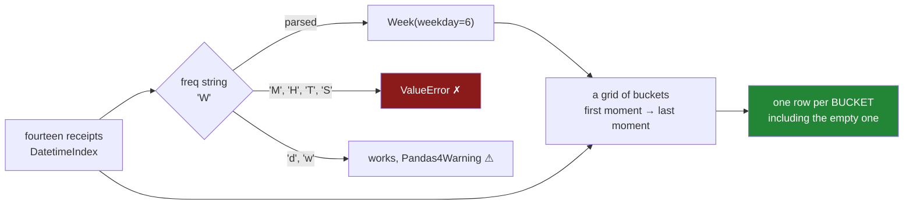

# 6.2 — resample, the group-by you did not have to write

## One-line answer

`resample` is a group-by whose key is not in your data: pandas manufactures the bucket each row
belongs to from a short frequency string, and in pandas 3 several of the single-letter strings
people have typed for years are now a hard `ValueError`.

---

## The story

The flat's file now covers the whole of March. Fourteen shops, four people, four things they keep
buying.

Somebody wants a weekly total. The obvious way to get one is to go down the list, write "week 1"
next to the first few lines, "week 2" next to the next few, and so on, and then add up each set.
Anybody can do that with fourteen lines and a pen.

The trouble is the pen. Where does week 1 stop? Whoever holds the pen decides, silently, and the
next person to do it decides differently. And by the time the file has a thousand lines nobody is
holding a pen at all.

So they ask the tool. And the tool wants one thing from them: the word for how long a bucket is.
Not the buckets themselves — just the word. They type the letter they have seen in a hundred
examples online. It stops, and it tells them that letter is no longer allowed.

---

## The idea in plain language

**Grouping** is the operation from [Day 31, 1.1](../../../day-31-groupby/parts/01-the-split/1.1-four-lines-three-aisles.md):
split the rows into piles by some key, work out one number per pile, and glue the answers back
together. The key there was a column that already existed — the aisle, the item, the shop.

Time is different. Nobody types a week number into a shopping file, and if they did it would be
wrong within a month. The key "which week is this" is not in the data and never will be. It has to
be **manufactured** from the timestamp, and the recipe for manufacturing it is what `resample`
wants from you.

That recipe is a **frequency alias**: a very short string that names the length of one bucket.
`"D"` is a day, `"W"` is a week, `"ME"` is a month end, `"h"` is an hour. You can put a number in
front — `"7D"` is seven days, `"2W"` is a fortnight — and some of them take a suffix that says where
the bucket ends, so `"W-MON"` cuts weeks at Monday instead of Sunday.

Given the alias, pandas does three things. It looks at the first and last moment in the index. It
lays a grid of buckets over that whole span. Then it drops each row into the bucket it falls in, and
runs your aggregation over each bucket. The result has one row per **bucket**, not one row per
group that had data — which is a real difference, and it is [6.3](6.3-the-bucket-that-was-empty.md).

Two things follow from "it is a group-by underneath".

**It is lazy in exactly the same way.** `ts.resample("W")` on its own computes nothing. It gives
back a resampler object holding the plan, and no number is produced until you name an aggregation —
`.sum()`, `.mean()`, `.count()`. That is the same shape as the `GroupBy` object in
[Day 31, 1.2](../../../day-31-groupby/parts/01-the-split/1.2-the-object-that-computed-nothing.md).

**There is a longer way to write it, and the two agree.** `pd.Grouper(freq="W")` is a grouping key
you can hand to an ordinary `groupby`. `ts.groupby(pd.Grouper(freq="W")).sum()` and
`ts.resample("W").sum()` produce the same table. `resample` is the shorthand. `Grouper` is what you
reach for when the week is only *one* of the keys — week **and** item, which an ordinary `groupby`
can do and `resample` on its own cannot.

Now the part that catches everybody. pandas 2 accepted `"M"` for month end and `"H"` for hour, and
warned that they were going away. **In pandas 3.0.5 they are gone.** They raise, they do not warn,
and every tutorial written before the change now contains code that stops on the first line. The
alias survey in [The mechanism](#the-mechanism) runs them all so you can read the real messages
rather than trust a memory.

---

## Why Setu needs it

- **[6.3](6.3-the-bucket-that-was-empty.md)** turns on the phrase "one row per bucket, not one row
  per group that had data", which is the one real difference from `groupby`.
- **[6.4](6.4-label-closed-and-the-edge.md)** takes the same `"W"` and shows that the alias alone
  does not fully determine the answer.
- **[7.1](../07-the-module/7.1-the-textdate-module.md)**'s `by_period` takes `freq` as a parameter,
  so the alias becomes a value the caller passes rather than a string buried in a function.
- **Day 34**'s data-quality report counts rows per day; **Day 45** and Phase 6 build lag and window
  features where the frequency string is the first line of every notebook.
- **Day 111** onwards, model monitoring is a resample: predictions per day, error per week. The
  alias migration in this part is what stops a monitoring job from dying on a pandas upgrade.

---

## The mechanism

The flat's file for the whole of March, already parsed and cleaned, already filed by time as
[6.1](6.1-the-index-that-has-to-be-time.md) showed. Fourteen receipts.

```python
import pandas as pd

rows = [
    ("2026-03-01 08:12:30", "milk", 1.15),
    ("2026-03-02 09:31:12", "bread", 1.40),
    ("2026-03-04 19:40:05", "milk", 1.15),
    ("2026-03-05 12:04:19", "eggs", 2.30),
    ("2026-03-08 11:05:00", "milk", 1.20),
    ("2026-03-09 17:58:40", "bread", 1.40),
    ("2026-03-10 20:11:03", "rice", 3.05),
    ("2026-03-11 18:22:47", "milk", 1.20),
    ("2026-03-13 08:47:55", "bread", 1.40),
    ("2026-03-14 10:19:02", "eggs", 2.30),
    ("2026-03-24 16:30:11", "milk", 1.25),
    ("2026-03-25 19:05:44", "bread", 1.45),
    ("2026-03-28 09:22:36", "eggs", 2.40),
    ("2026-03-31 18:40:09", "milk", 1.25),
]
march = pd.DataFrame(rows, columns=["paid_at", "item", "price"])
march["paid_at"] = pd.to_datetime(march["paid_at"], format="%Y-%m-%d %H:%M:%S")
march = march.set_index("paid_at")

print(march.resample("W"))
print()
print(march.resample("W")["price"].sum())
```

**Line by line:**

- A list of tuples, one per receipt, rather than a dict of columns. Both build the same frame;
  this shape is easier to read a *row* out of, and a shared file is something people read row by
  row. `columns=` supplies the names, in the order the tuples are written.
- The dates run from 1 March to 31 March, and there is a stretch in the middle — the whole of 16 to
  22 March — where nobody shopped. That gap is deliberate and it is [6.3](6.3-the-bucket-that-was-empty.md)'s
  entire subject. Read it now so it is not a surprise later.
- The prices drift up through the month: milk at `1.15`, then `1.20`, then `1.25`. Real prices do
  that, and it means `.mean()` has something to say and not just `.sum()`.
- `pd.to_datetime` then `set_index`, in that order, for the reason
  [6.1](6.1-the-index-that-has-to-be-time.md) gives: a text column moved into the index is a plain
  `Index` and `resample` refuses it.
- `print(march.resample("W"))` with **no aggregation** prints the plan. It is worth doing once,
  because it lists every default this call is quietly relying on, and three of those defaults are
  [6.4](6.4-label-closed-and-the-edge.md)'s subject.

```text
DatetimeIndexResampler [freq=<Week: weekday=6>, closed=right, label=right, convention=start, origin=start_day]

paid_at
2026-03-01    1.15
2026-03-08    6.05
2026-03-15    9.35
2026-03-22    0.00
2026-03-29    5.10
2026-04-05    1.25
Freq: W-SUN, Name: price, dtype: float64
```

`"W"` expanded into `<Week: weekday=6>` — weeks ending on Sunday, because weekday 6 is Sunday when
Monday is 0 ([4.3](../04-the-dt-accessor/4.3-the-fields-inside-a-timestamp.md)). And there is the
`0.00` for the week nobody shopped, which no `groupby` would ever have produced.

Now the same answer written the long way, so you can see it is the same thing.

```python
by_resample = march.resample("W")["price"].sum()
by_grouper = march.groupby(pd.Grouper(freq="W"))["price"].sum()
print(by_grouper)
print()
print("identical:", by_resample.equals(by_grouper))
print()
print(march.groupby([pd.Grouper(freq="W"), "item"])["price"].sum())
```

**Line by line:**

- `pd.Grouper(freq="W")` builds a grouping key out of nothing but a frequency. Handed to `groupby`,
  it does exactly what `resample` does: manufacture the week from the index and split on it.
- `.equals(...)` compares values, dtype and index rather than identity, so it is the honest way to
  ask "same table?" — `==` would give you a column of booleans and no answer about the index.
- The last line is the reason `Grouper` exists at all. `resample` groups by time and nothing else.
  A list of keys — the manufactured week **and** the ordinary `item` column — is an ordinary
  `groupby` with two keys, which is
  [Day 31, 4.4](../../../day-31-groupby/parts/04-the-keys/4.4-two-keys-and-the-multiindex.md), and it
  gives you a MultiIndex of week and item.

```text
paid_at
2026-03-01    1.15
2026-03-08    6.05
2026-03-15    9.35
2026-03-22    0.00
2026-03-29    5.10
2026-04-05    1.25
Freq: W-SUN, Name: price, dtype: float64

identical: True

paid_at     item
2026-03-01  milk     1.15
2026-03-08  bread    1.40
            eggs     2.30
            milk     2.35
2026-03-15  bread    2.80
            eggs     2.30
            milk     1.20
            rice     3.05
2026-03-29  bread    1.45
            eggs     2.40
            milk     1.25
2026-04-05  milk     1.25
Name: price, dtype: float64
```

Look at what the two-key version dropped: **the week of 22 March is not there at all.** `resample`
invented an empty bucket; `groupby` with a list of keys did not. Same data, same frequency, two
different row counts, and that is [6.3](6.3-the-bucket-that-was-empty.md).

### The aliases pandas 3.0.5 actually accepts

Do not take this from memory or from an old answer online. Run it.

```python
import warnings

for alias in ["D", "W", "ME", "MS", "QE", "YE", "h", "min", "s", "M", "Y", "Q", "H", "T", "S", "d"]:
    with warnings.catch_warnings(record=True) as caught:
        warnings.simplefilter("always")
        try:
            out = march["price"].resample(alias).sum()
            note = caught[0].message if caught else ""
            print(f"{alias!r:6} ok    rows={len(out):<8} freq={out.index.freqstr!r:9} {note}")
        except ValueError as err:
            print(f"{alias!r:6} ValueError: {err}")
```

**Line by line:**

- `warnings.catch_warnings(record=True)` collects warnings instead of printing them, so a warning
  and a success can be reported on one line. Without it a `FutureWarning` prints once and then never
  again, and a survey like this silently under-reports.
- `warnings.simplefilter("always")` switches off the "show each warning once" rule for the same
  reason. This pair is the standard way to *test* deprecation behaviour rather than to hide it.
- `try` catches `ValueError` and nothing else, on purpose. A rejected alias raises `ValueError`; if
  something else came out, this loop would let it through rather than swallowing a real bug.
- `out.index.freqstr` is the frequency pandas *settled on*, which is not always what you typed:
  `"W"` becomes `"W-SUN"` and `"YE"` becomes `"YE-DEC"`. Reading it back is how you check that the
  alias meant what you thought.
- `len(out)` is printed because the row count is the fastest sanity check there is. Fourteen
  receipts resampled to `"s"` gives millions of rows, and seeing that number here is cheaper than
  discovering it in a notebook.

```text
'D'    ok    rows=31       freq='D'
'W'    ok    rows=6        freq='W-SUN'
'ME'   ok    rows=1        freq='ME'
'MS'   ok    rows=1        freq='MS'
'QE'   ok    rows=1        freq='QE-DEC'
'YE'   ok    rows=1        freq='YE-DEC'
'h'    ok    rows=731      freq='h'
'min'  ok    rows=43829    freq='min'
's'    ok    rows=2629660  freq='s'
'M'    ValueError: Invalid frequency: M. Failed to parse with error message: ValueError("'M' is no longer supported for offsets. Please use 'ME' instead.")
'Y'    ValueError: Invalid frequency: Y. Failed to parse with error message: ValueError("'Y' is no longer supported for offsets. Please use 'YE' instead.")
'Q'    ValueError: Invalid frequency: Q. Failed to parse with error message: ValueError("'Q' is no longer supported for offsets. Please use 'QE' instead.")
'H'    ValueError: Invalid frequency: H. Failed to parse with error message: ValueError("Invalid frequency: H. Failed to parse with error message: KeyError('H'). Did you mean h?") Did you mean h?
'T'    ValueError: Invalid frequency: T. Failed to parse with error message: ValueError("Invalid frequency: T. Failed to parse with error message: KeyError('T'). Did you mean min?") Did you mean min?
'S'    ValueError: Invalid frequency: S. Failed to parse with error message: ValueError("Invalid frequency: S. Failed to parse with error message: KeyError('S'). Did you mean s?") Did you mean s?
'd'    ok    rows=31       freq='D'       'd' is deprecated and will be removed in a future version, please use 'D' instead.
```

Read that carefully, because there are **three** different behaviours in it and only one of them is
what people expect.

`"M"`, `"Y"` and `"Q"` raise with a rename: the alias still exists, but it now has to be spelled
`"ME"`, `"YE"` or `"QE"`, because pandas separated *month end* from *month start* (`"MS"`) and made
you say which you meant. `"M"` used to mean month **end**, which is not what most people assumed.

`"H"`, `"T"` and `"S"` raise with a case or spelling change: hours are `"h"`, minutes are `"min"`,
seconds are `"s"`. The message even offers the replacement — *Did you mean h?* — which is unusually
kind for a parser.

`"d"` is the third behaviour and the dangerous one. It **works**, and warns. The warning is a
`Pandas4Warning`, which means it will be an error in the next major version, and it is the kind of
warning a scheduled job writes to a log nobody reads. Frequency aliases in pandas 3 are
case-sensitive in a way they never used to be, and lower-case `"d"` and `"w"` are the two survivors
of that.

Where a bucket comes from:



---

## When it breaks

**The alias from every tutorial written before pandas 3:**

```text
$ uv run python -c "
import pandas as pd
idx = pd.to_datetime(['2026-03-01 08:12:30','2026-03-11 18:22:47'])
s = pd.Series([1.15, 1.20], index=idx)
s.resample('M').sum()
"
Traceback (most recent call last):
  File "pandas/_libs/tslibs/offsets.pyx", line 6338, in pandas._libs.tslibs.offsets.to_offset
  File "pandas/_libs/tslibs/offsets.pyx", line 6205, in pandas._libs.tslibs.offsets._validate_to_offset_alias
ValueError: 'M' is no longer supported for offsets. Please use 'ME' instead.

During handling of the above exception, another exception occurred:

Traceback (most recent call last):
  File "<string>", line 5, in <module>
  File "...\pandas\core\generic.py", line 9411, in resample
    return get_resampler(
  File "...\pandas\core\resample.py", line 2420, in __init__
    freq = to_offset(freq)
  File "pandas/_libs/tslibs/offsets.pyx", line 6162, in pandas._libs.tslibs.offsets.raise_invalid_freq
ValueError: Invalid frequency: M. Failed to parse with error message: ValueError("'M' is no longer supported for offsets. Please use 'ME' instead.")
```

**What it means.** The alias never became an offset, so nothing was ever grouped. Note the two
stacked tracebacks: the inner one is the rename check, the outer one is `to_offset` reporting that
the whole string failed to parse. The useful sentence is the inner one, and it is the one people
skip past on the way to the bottom of the output. The fix is one letter: `"ME"`.

**The aggregation that ran on a text column.** Nobody selected `["price"]`, so `march.resample("W").sum()`
was asked to sum every column:

```text
                              item  price
paid_at
2026-03-01                    milk   1.15
2026-03-08       breadmilkeggsmilk   6.05
2026-03-15  breadricemilkbreadeggs   9.35
2026-03-22                           0.00
2026-03-29           milkbreadeggs   5.10
2026-04-05                    milk   1.25
```

**No error at all.** `sum` on a text column means what `+` means for text: glue the pieces together.
`breadmilkeggsmilk` is a perfectly correct answer to a question nobody meant to ask, and in a wide
frame it hides in a column you were not looking at while quietly costing a large amount of memory.
The fix is to select the column before aggregating, as every block in this part does.

**The aggregation that has no meaning for text**, on the other hand, does raise:

```text
$ uv run python -c "
import pandas as pd
s = pd.Series(['milk','bread'], index=pd.to_datetime(['2026-03-01','2026-03-02']), dtype='str')
s.resample('W').mean()
"
TypeError: dtype 'str' does not support operation 'mean'
```

That is the pair worth remembering: `.sum()` on text concatenates silently, `.mean()` on text
raises. The one that fails loudly is the safer of the two.

---

## In production

**What a professional writes instead of the teaching version.** The frequency is a policy, not a
detail, so it is a named argument with a checked value rather than a string typed at each call site:

```python
import pandas as pd

VALID_FREQ = {"h", "D", "W", "ME", "MS", "QE", "YE"}


def by_period(frame: pd.DataFrame, value: str, freq: str, how: str = "sum") -> pd.Series:
    """Aggregate `value` into buckets of length `freq`, over a time-indexed frame."""
    if freq not in VALID_FREQ:
        raise ValueError(
            f"freq={freq!r} is not one this project uses; pick from {sorted(VALID_FREQ)}"
        )
    return frame.resample(freq)[value].agg(how)
```

**Line by line:**

- `VALID_FREQ` is a module constant, so the set of periods this project reports on is written down
  in one place. A reviewer can see the whole policy without reading any call sites.
- The check is against **your** allowed set, not against what pandas accepts. pandas accepts `"d"`
  with a warning and `"3W-TUE"` without one; neither belongs in a metric your team compares
  month to month.
- Raising `ValueError` with `sorted(VALID_FREQ)` in the message means the caller who typed `"M"` is
  told what to type instead, in your vocabulary, before pandas gets a chance to fail with a
  two-part traceback.
- `frame.resample(freq)[value]` selects the column **before** the aggregation, so the text
  concatenation in [When it breaks](#when-it-breaks) cannot happen.
- `how` defaults to `"sum"` and is passed to `.agg`, so one function covers `sum`, `mean`, `count`
  and `nunique` without a branch. What that default *means* for an empty bucket is
  [6.3](6.3-the-bucket-that-was-empty.md)'s argument, and it is the reason `how` is visible in the
  signature rather than hidden inside.

**What degrades at scale.** On five million receipts over five years, `resample("D").sum()` on a
sorted `DatetimeIndex` took `0.151 s`, best of three runs. The same answer via
`groupby(paid_at.dt.normalize())` took `0.446 s`, and via `groupby(paid_at.dt.date)` took `4.731 s`.
`resample` is not a convenience wrapper that costs you something; it is the fastest of the three,
because it computes bucket boundaries arithmetically instead of building a key per row.

The thing that does degrade is the **output**, and only when the alias is finer than the data.
Fourteen receipts resampled to `"s"` produced 2 629 660 rows above. That is not a scaling problem
you grow into — it is one line away at any size, and [6.3](6.3-the-bucket-that-was-empty.md)
measures where it ends.

**The failure that only appears with real data.** A nightly job resampled with `"M"` for three
years. The pandas upgrade to 3.0 was tested on a laptop against a small sample, the sample happened
to be resampled with `"D"` in the test notebook, and `"M"` was only in the monthly branch that runs
on the first of the month. The upgrade shipped on the 3rd. Nothing failed for four weeks. The alias
migration is not caught by a smoke test that runs the daily path.

**The review comment a senior engineer leaves.** *"`resample('M')` — that is a hard error on pandas
3, and `'ME'` is month **end** while `'MS'` is month start, so say which one this metric means
before you change it. Also `df.resample(freq).sum()` with no column selection: `item` is a text
column and this is silently concatenating it. Select `['price']`."*

**The interview question.** *"What is the difference between `df.resample('W').sum()` and
`df.groupby(pd.Grouper(freq='W')).sum()`?"* Nothing — they produce the identical table, and
`resample` is the shorthand; `Grouper` is what you use when the week is one key among several.
Then the follow-up that finds out whether you have shipped this: **which frequency aliases changed
in pandas 3, and does the old one warn or raise?** `"M"`, `"Y"` and `"Q"` now raise `ValueError` and
want `"ME"`, `"YE"`, `"QE"`; `"H"`, `"T"` and `"S"` raise and want `"h"`, `"min"`, `"s"`; lower-case
`"d"` and `"w"` still work but emit a `Pandas4Warning`. There is no `FutureWarning` grace period
left for the first six — the code stops.

---

## Check yourself

```bash
uv run python -c "
import pandas as pd
s = pd.Series(
    [1.15, 1.40, 1.15, 2.30, 1.20],
    index=pd.to_datetime([
        '2026-03-01 08:12:30', '2026-03-02 09:31:12', '2026-03-04 19:40:05',
        '2026-03-05 12:04:19', '2026-03-08 11:05:00',
    ]),
    name='price',
)
print('weekly     :', s.resample('W').sum().tolist())
print('grouper    :', s.groupby(pd.Grouper(freq='W')).sum().tolist())
print('daily rows :', len(s.resample('D').sum()))
print('freqstr    :', s.resample('W').sum().index.freqstr)
for bad in ['M', 'H', 'T']:
    try:
        s.resample(bad).sum()
    except ValueError as err:
        print(f'{bad!r:5}:', str(err).splitlines()[0][:70])
"
```

Run it, then change `'W'` to `'w'` and run it again. Say what appears that did not appear before,
and say why that particular output is more dangerous than the three `ValueError`s.

**Answer out loud, without scrolling up:**

> Where does the key that `resample` groups by come from, given that it is not a column in the data?
> Then name two frequency aliases that pandas 3 rejects outright, say what each wants instead, and
> say which alias still works but warns.

---

**Next:** [6.3 — The bucket that was empty](6.3-the-bucket-that-was-empty.md).
