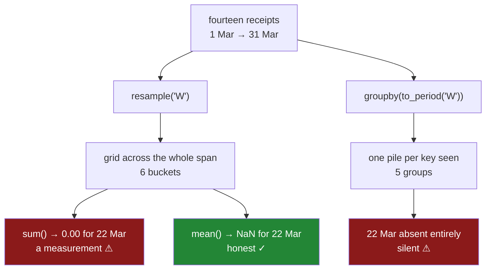

# 6.3 — The bucket that was empty

## One-line answer

`resample` makes a row for every period between the first timestamp and the last, whether anything
happened in it or not, and `groupby` makes a row only for the periods it actually saw — so the two
answer different questions, and `sum()` returning `0` for a silent week is a claim, not a fact.

---

## The story

Somebody in the flat looks at March and asks the obvious question: which week did we spend the least?

They get an answer, and the answer is a week in the middle of the month with a total of zero.

Which is true, in a sense. Nobody went shopping that week. Two of them were away, the fridge had
enough in it, and nobody typed a line into the file between the 14th and the 24th.

But "we spent nothing" and "nobody wrote anything down" are not the same claim, and the file cannot
tell them apart. Somebody could have gone to the shop and forgotten to type it. Somebody's phone
could have failed to save. The flat could genuinely have eaten nothing but what was already in the
cupboard.

The number `0` says the first thing with total confidence. And the same file, asked the same
question a slightly different way, does not produce that week at all — it just is not in the answer.

---

## The idea in plain language

Two operations that look alike do something genuinely different with a period that has no rows.

**`groupby` is a sorting exercise.** It looks at the keys that are *present* and makes one pile per
key it finds. A key that appears in no row produces no pile, because there is nothing to put in it.
That is [Day 31, 1.1](../../../day-31-groupby/parts/01-the-split/1.1-four-lines-three-aisles.md), and
it is the natural behaviour: you cannot sort something you do not have.

**`resample` is a grid.** It reads the first and last moment in the index, lays a row of buckets
across the whole span, and then fills them. A bucket with nothing to fill it stays in the result and
gets whatever the aggregation produces from nothing.

What an aggregation produces from nothing is the second half of this. `sum()` of no numbers is `0`,
because zero is the starting point you add to. `mean()` of no numbers is `NaN`, because there is
nothing to divide by. `count()` is `0`. `min()`, `max()`, `median()` and `std()` are all `NaN`.

`NaN` — *not a number* — is the float value pandas uses for "missing", and it is the subject of
[Day 30, 1.2](../../../day-30-missing-data/parts/01-what-missing-means/1.2-nan-the-number-not-equal-to-itself.md).
The useful thing about it here is that it is **honest**. `NaN` propagates: a chart skips it, a mean
of means excludes it, and anybody reading it knows something was not there.

`0` is not honest, and that is the whole problem. `0` is a measurement. It goes into an average and
drags it down. It plots as a point on the floor of a chart. Nothing downstream can tell it apart
from a week where four people went shopping and every item was free.

So the rule is not "`resample` is better" or "`groupby` is better". The rule is that an empty period
means one of two things, and **you** know which, and the code has to say it. If a silent week
genuinely means the flat spent nothing, `0` is correct and `resample().sum()` is the right call. If
a silent week means the file stopped being filled in, `0` is a lie and you want the empty bucket
present *and* marked as unknown. [Day 30, 5.1](../../../day-30-missing-data/parts/05-filling/5.1-fillna-is-a-claim.md)
makes the same argument about `fillna`, and it is the same argument: filling a blank is a claim
about the world, not a formatting step.

There is one more shape worth naming. `resample` groups by time and nothing else. The moment you
group by time **and** another column — week and item — you are back in `groupby` with a list of
keys, and the empty periods disappear again, because a combination that never occurred produces no
pile. That surprises people who assume the "creates empty buckets" behaviour follows the frequency
around. It follows `resample`, not the frequency.

---

## Why Setu needs it

- **[6.4](6.4-label-closed-and-the-edge.md)** changes which rows fall in which bucket, and one of
  the settings changes how many buckets there are — so this part's row-count reasoning is what makes
  that visible.
- **[6.5](6.5-rolling-is-not-resample.md)** shows a third operation whose row count is set by the
  input rather than the span, which is the clearest way to see what is unusual about `resample`.
- **[7.1](../07-the-module/7.1-the-textdate-module.md)**'s `by_period` makes the empty-period policy
  an argument the caller has to pass, precisely because there is no safe default.
- **Day 34**'s data-quality report is mostly this: a day with no rows is the interesting day, and a
  report built with `groupby` cannot show it.
- **Day 45** and Phase 6 build lag features, where a missing period silently shifts every lag by one
  and the model learns from a date that did not exist.
- **Day 111** onwards, monitoring: "no predictions yesterday" is the alert you most want, and it is
  exactly the row `groupby` will not give you.

---

## The mechanism

The flat's March file from [6.2](6.2-resample-the-groupby-you-did-not-write.md) — fourteen receipts,
with nobody shopping between the 14th and the 24th. The same question, asked two ways.

```python
import pandas as pd

rows = [
    ("2026-03-01 08:12:30", "milk", 1.15),
    ("2026-03-02 09:31:12", "bread", 1.40),
    ("2026-03-04 19:40:05", "milk", 1.15),
    ("2026-03-05 12:04:19", "eggs", 2.30),
    ("2026-03-08 11:05:00", "milk", 1.20),
    ("2026-03-09 17:58:40", "bread", 1.40),
    ("2026-03-10 20:11:03", "rice", 3.05),
    ("2026-03-11 18:22:47", "milk", 1.20),
    ("2026-03-13 08:47:55", "bread", 1.40),
    ("2026-03-14 10:19:02", "eggs", 2.30),
    ("2026-03-24 16:30:11", "milk", 1.25),
    ("2026-03-25 19:05:44", "bread", 1.45),
    ("2026-03-28 09:22:36", "eggs", 2.40),
    ("2026-03-31 18:40:09", "milk", 1.25),
]
march = pd.DataFrame(rows, columns=["paid_at", "item", "price"])
march["paid_at"] = pd.to_datetime(march["paid_at"], format="%Y-%m-%d %H:%M:%S")
price = march.set_index("paid_at")["price"]

by_resample = price.resample("W").sum()
by_groupby = price.groupby(price.index.to_period("W")).sum()

print(by_groupby)
print()
print("resample rows:", len(by_resample), " groupby rows:", len(by_groupby))
print("quietest week, resample:", by_resample.idxmin(), by_resample.min())
print("quietest week, groupby :", by_groupby.idxmin(), by_groupby.min())
print("mean weekly spend, resample:", round(by_resample.mean(), 4))
print("mean weekly spend, groupby :", round(by_groupby.mean(), 4))
```

**Line by line:**

- `march.set_index("paid_at")["price"]` gives a Series rather than a frame, because both sides of
  this comparison only ever look at one column and a Series prints in less space.
- `price.index.to_period("W")` converts each timestamp into the **period** it belongs to — the week
  as a thing in its own right, printed as `2026-03-02/2026-03-08`. That is the honest hand-written
  version of the manufactured key from [6.2](6.2-resample-the-groupby-you-did-not-write.md): a real
  value, computed per row, that `groupby` can then split on.
- `groupby` on that key is an ordinary group-by with an ordinary key. It has no idea the key means
  time, and that is exactly why it produces no row for a week nobody shopped in.
- `.idxmin()` returns the **label** of the smallest value, not the value —
  [Day 29, 5.3](../../../day-29-iteration-and-order/parts/05-ranking/5.3-nlargest-sorting-you-do-not-pay-for.md)
  covers the family. It is here because "which week was quietest" is the question a person actually
  asks, and it is the question that gets two different answers.
- `round(..., 4)` on the means so the two numbers can be compared on sight without a wall of digits.

```text
paid_at
2026-02-23/2026-03-01    1.15
2026-03-02/2026-03-08    6.05
2026-03-09/2026-03-15    9.35
2026-03-23/2026-03-29    5.10
2026-03-30/2026-04-05    1.25
Freq: W-SUN, Name: price, dtype: float64

resample rows: 6  groupby rows: 5
quietest week, resample: 2026-03-22 00:00:00 0.0
quietest week, groupby : 2026-02-23/2026-03-01 1.15
mean weekly spend, resample: 3.8167
mean weekly spend, groupby : 4.58
```

Read the `groupby` output first. Five weeks. Between `2026-03-09/2026-03-15` and
`2026-03-23/2026-03-29` there is simply nothing — no gap, no marker, no blank line. The week of
16 to 22 March did not shrink to zero; it never existed as far as this table is concerned. Somebody
reading down the left-hand column has to notice the dates jump, and nobody notices.

Then the two answers to "which week was quietest". `resample` says the week ending 22 March, at
`0.0`. `groupby` says the week ending 1 March, at `1.15`. Both are computed correctly from the same
fourteen rows.

And then the number that should worry you: **the mean weekly spend is `3.8167` or `4.58` depending
on which one you ran.** That is a twenty per cent difference produced by one row that either exists
or does not, and neither call warned about anything.

Now what the empty bucket does under each aggregation.

```python
print(
    march.set_index("paid_at")
    .resample("W")["price"]
    .agg(["count", "sum", "mean", "min", "max", "median", "std"])
)
```

**Line by line:**

- `.agg([...])` with a list of names runs each aggregation over the same buckets and puts them
  side by side as columns —
  [Day 31, 2.3](../../../day-31-groupby/parts/02-aggregating/2.3-agg-several-answers-at-once.md).
  Running them one at a time would give the same numbers; putting them in one table is what makes
  the empty row's behaviour readable across the row.
- `count` is first on purpose. It is the column that tells you a bucket was empty, and it is the
  only one in this table that cannot itself be `NaN`.
- `std` is included because it is `NaN` for a bucket with **one** row as well as for a bucket with
  none — a second, quieter version of the same trap, and one that catches people plotting error
  bars.

```text
            count   sum    mean   min   max  median       std
paid_at
2026-03-01      1  1.15  1.1500  1.15  1.15    1.15       NaN
2026-03-08      4  6.05  1.5125  1.15  2.30    1.30  0.535996
2026-03-15      5  9.35  1.8700  1.20  3.05    1.40  0.785493
2026-03-22      0  0.00     NaN   NaN   NaN     NaN       NaN
2026-03-29      3  5.10  1.7000  1.25  2.40    1.45  0.614410
2026-04-05      1  1.25  1.2500  1.25  1.25    1.25       NaN
```

The row for `2026-03-22` is the whole part in one line. `count` is `0` and every other column is
`NaN` — **except `sum`, which is `0.00`**. Six aggregations tell you the truth and one of them
invents a measurement, and the one that invents it is the one everybody reaches for first.

That is not a pandas quirk. The sum of an empty set is zero by definition; you add nothing to the
starting point and the starting point is zero. It is arithmetically right and, as a claim about the
flat's shopping, unsupported.

Finally, the shape that surprises people:

```python
print(march.set_index("paid_at").groupby([pd.Grouper(freq="W"), "item"])["price"].sum())
```

**Line by line:**

- `pd.Grouper(freq="W")` is the manufactured week key from
  [6.2](6.2-resample-the-groupby-you-did-not-write.md), and the second key is an ordinary column.
- Passing a **list** of keys makes this an ordinary two-key `groupby`, producing a MultiIndex of
  week and item ([Day 31, 4.4](../../../day-31-groupby/parts/04-the-keys/4.4-two-keys-and-the-multiindex.md)).
- The frequency is identical to every other block in this part. Only the operation changed.

```text
paid_at     item
2026-03-01  milk     1.15
2026-03-08  bread    1.40
            eggs     2.30
            milk     2.35
2026-03-15  bread    2.80
            eggs     2.30
            milk     1.20
            rice     3.05
2026-03-29  bread    1.45
            eggs     2.40
            milk     1.25
2026-04-05  milk     1.25
Name: price, dtype: float64
```

`2026-03-22` is gone. Adding a second key turned the empty-bucket behaviour off, without a word.
The related knob is `observed=` on a categorical key, which
[Day 31, 4.5](../../../day-31-groupby/parts/04-the-keys/4.5-observed-and-the-aisle-nobody-visited.md)
covers — and note that it can bring back an unused *category*, but there is no category for "a week
in the middle" to bring back.



---

## When it breaks

**The grid is built from the span, not from the rows.** Ask for buckets finer than the data and
`resample` will happily build every one of them:

```text
$ uv run python -c "
import pandas as pd
sparse = pd.Series([1.0, 2.0], index=pd.to_datetime(['2020-01-01', '2030-01-01']))
out = sparse.resample('min').sum()
print(len(out), 'rows;', round(out.memory_usage(deep=True) / 1e6, 1), 'MB')
print('non-zero buckets:', int((out != 0).sum()))
"
5260321 rows; 84.2 MB
non-zero buckets: 2
```

**What it means.** Two rows in, five million rows out, and only two of them carry a number anybody
typed. Nothing raised, because nothing is wrong: `"min"` over ten years is 5 260 321 one-minute buckets, and
`resample` was asked for all of them. The output row count of a resample is set by **the span
divided by the frequency**, and has no relationship at all to how many rows went in.

Push it one step further and it stops being merely wasteful:

```text
$ uv run python -c "
import pandas as pd
idx = pd.date_range('2026-01-01', periods=400, freq='D')
s = pd.Series(range(400), index=idx, dtype='float64')
s.resample('ms').sum()
"
MemoryError: Unable to allocate 257. GiB for an array with shape (34473600002,) and data type int64
```

**What it means.** Four hundred daily rows, asked for millisecond buckets over the year they span,
needs an index of 34 473 600 002 labels. `MemoryError` is the honest failure here and it arrives
before any aggregation happens — the message is about building the *index*, not the values. The
smallest fix is to ask whether the frequency is finer than the data's own spacing, which is the
`guard_freq` rep left unsolved in [7.1](../07-the-module/7.1-the-textdate-module.md).

**The empty bucket that reached a dashboard.** No traceback for this one, which is the point:

```text
$ uv run python -c "
import pandas as pd
price = pd.Series(
    [1.15, 9.35, 5.10],
    index=pd.to_datetime(['2026-03-01', '2026-03-15', '2026-03-29']),
)
weekly = price.resample('W').sum()
print(weekly.tolist())
print('mean  :', round(weekly.mean(), 4))
print('lowest:', weekly.idxmin().date())
"
[1.15, 0.0, 9.35, 0.0, 5.1, 0.0]
mean  : 2.6
lowest: 2026-03-08
```

Three receipts became six weekly numbers, three of which are `0.0` and none of which anybody
measured. The mean is `2.6` — a number with no meaning at all — and "the lowest week" is a week
chosen arbitrarily from three tied zeros. Every value here is arithmetically correct and the whole
answer is nonsense.

---

## In production

**What a professional writes instead of the teaching version.** The empty-period policy is named at
the call site, because there is no correct default:

```python
import pandas as pd


def weekly_spend(price: pd.Series, freq: str, empty: str) -> pd.Series:
    """Total `price` per period. `empty` says what a period with no receipts means."""
    if empty not in {"zero", "unknown"}:
        raise ValueError(f"empty={empty!r}; say 'zero' (nobody spent) or 'unknown' (no data)")
    buckets = price.resample(freq)
    if empty == "zero":
        return buckets.sum()
    total = buckets.sum()
    return total.where(buckets.count() > 0)
```

**Line by line:**

- `empty` has **no default value**. A caller cannot get a total per period out of this function
  without stating what a silent period means, which is the only way to stop the question being
  skipped.
- The two words are `"zero"` and `"unknown"` rather than a boolean, because `fill_empty=True` gives
  a reader no way to guess what `True` means and a reviewer no way to check it.
- `buckets = price.resample(freq)` is computed **once** and used twice. The resampler is the lazy
  plan object from [6.2](6.2-resample-the-groupby-you-did-not-write.md), so holding it costs
  nothing, and reusing it guarantees `sum()` and `count()` are cut on the identical grid.
- `total.where(buckets.count() > 0)` keeps a value where the condition is true and puts `NaN`
  everywhere else ([Day 28, 3.3](../../../day-28-selection-and-alignment/parts/03-writing/3.3-where-mask-and-the-write-that-was-not.md)).
  The empty rows stay in the result — the grid is still complete — but they now say *unknown*
  instead of *zero*.
- `buckets.count() > 0` and not `total != 0`, because a week where the flat genuinely spent nothing
  and a week where nobody wrote anything down both give a `sum()` of `0`. Only `count()` separates
  them.

**What degrades at scale.** Not speed. On five million receipts spanning five years,
`resample("D").sum()` takes `0.151 s` and returns 1 825 rows — the output is tiny however large the
input is. What degrades is the **relationship** between the two numbers, and it degrades in both
directions. A frequency finer than the data explodes the output, as the `MemoryError` above shows.
A frequency coarser than the data collapses it, and a monthly chart of a five-year table has sixty
points, three of which are zeros nobody can explain because the raw rows are no longer in front of
them. Neither is a performance problem. Both are correctness problems that only become visible when
you print the row count, which is why
[Day 32, 3.1](../../../day-32-joining-and-reshaping/parts/03-the-row-count/3.1-count-the-rows-before-and-after.md)
makes counting rows before and after a habit.

**The failure that only appears with real data.** A daily job resampled events to `"D"` and summed
them, and the chart was flat and correct for a year. Then an upstream feed broke on a Sunday and
sent nothing. The resample produced a row with `0`, the chart plotted a point on the floor, the
alerting rule was *"warn if the count drops by more than half"* — and the count had not dropped, it
had been *replaced* by a confident zero that looked like a real quiet Sunday. The outage was found
three days later by a person, not by the monitor. Had the job used `mean()`, or had it applied the
`.where(count > 0)` above, the `NaN` would have failed the rule on the first evening.

**The review comment a senior engineer leaves.** *"`resample('D').sum()` feeding the availability
metric — for this data a missing day means the exporter fell over, not that usage was zero, so this
is manufacturing a real-looking data point out of an outage. Either return `NaN` for empty days or
emit the day's `count` alongside the sum so the alert can see the difference. Also print the output
row count in the job log; it is the cheapest possible check that the span is what you think."*

**The interview question.** *"You resample to weekly and get more rows than a `groupby` on the same
week key. Why?"* Because `resample` builds a grid over the whole span and keeps every bucket,
whereas `groupby` only creates a group per key it actually observed. Then the follow-up that finds
out whether you have been burnt by it: **what does `sum()` return for an empty bucket, what does
`mean()` return, and which of those do you want?** `sum()` gives `0`, `mean()` gives `NaN`, and the
right answer depends entirely on whether an empty period means "nothing happened" or "we have no
data" — the second one must not be reported as a zero, because everything downstream will treat it
as a measurement.

---

## Check yourself

```bash
uv run python -c "
import pandas as pd
price = pd.Series(
    [1.15, 1.40, 9.35, 5.10],
    index=pd.to_datetime(['2026-03-01', '2026-03-05', '2026-03-13', '2026-03-28']),
    name='price',
)
r = price.resample('W')
g = price.groupby(price.index.to_period('W')).sum()
print('resample rows:', len(r.sum()), '| groupby rows:', len(g))
print('sum   :', r.sum().tolist())
print('mean  :', r.mean().tolist())
print('count :', r.count().tolist())
print('honest:', r.sum().where(r.count() > 0).tolist())
print('quietest by resample:', r.sum().idxmin().date())
print('quietest by groupby :', g.idxmin())
"
```

Run it. Say which of the four printed lists a weekly spending chart should be built from, and why
the two "quietest" lines disagree.

**Answer out loud, without scrolling up:**

> Why does `resample` produce a row for a week nobody shopped in when `groupby` does not? Then say
> what `sum()` and `mean()` each return for that row, and which of the two is safe to put in front
> of somebody who will act on it.

---

**Next:** [6.4 — label, closed, and which side the edge belongs to](6.4-label-closed-and-the-edge.md).
