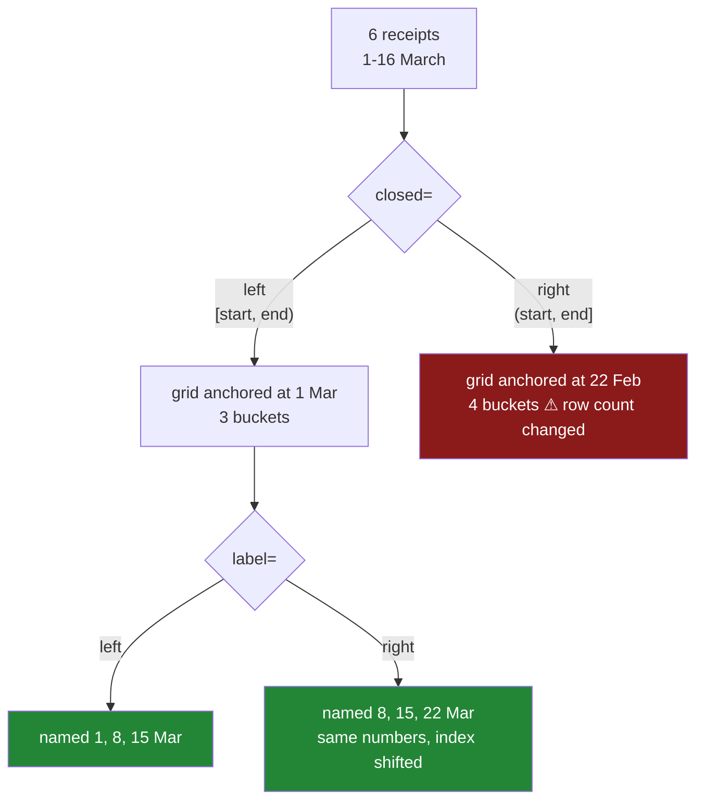

# 6.4 — `label`, `closed`, and which side the edge belongs to

## One-line answer

`closed` decides which end of a bucket owns a value landing exactly on the boundary — and so changes
how many buckets there are — while `label` only decides which end the bucket is *named* after; both
have defaults that **differ between frequencies**, so moving a chart from daily to weekly silently
changes the convention.

---

## The story

The flat's weekly spending chart has been on the fridge for a month and nobody has questioned it.

Then somebody wants the same thing per day, to settle whether the expensive trips really are the
weekday evening ones. It is a one-character change — `"W"` becomes `"D"` — and the daily chart
appears, and it looks fine.

The argument starts when they put the two side by side. The weekly chart's first bar is labelled the
eighth of March. The daily chart's first bar is labelled the first of March. Same file, same first
receipt, and the two charts disagree about when the data starts by a week.

Neither is wrong. The weekly buckets are named after the day they **end**, and the daily buckets are
named after the day they **begin** — because those are the defaults, and the defaults are not the same
for the two frequencies. Nobody chose either of them. Nobody was told.

And there is a worse version of this waiting, which the flat has not hit yet. A receipt typed at
exactly midnight, on a boundary between two buckets, belongs to one of them, and which one is a
separate setting that nobody has looked at either.

---

## The idea in plain language

Resampling lays a grid of buckets over a span of time
([6.2](6.2-resample-the-groupby-you-did-not-write.md)). A bucket is an interval, and an interval has
two ends, which raises two questions that people never ask out loud.

**Question one: who owns the edge?** A weekly bucket runs from one Sunday to the next. A receipt at
exactly midnight on Sunday is on the boundary. Does it belong to the week that is ending or the week
that is starting? It cannot be both, and it must be one.

That is `closed`. `closed="left"` means the interval includes its start and excludes its end — the
value at the boundary goes to the **later** bucket. `closed="right"` means it excludes its start and
includes its end — the boundary value goes to the **earlier** bucket.

**Question two: what do we call the bucket?** A bucket covering 2 to 8 March can be named `2 March` or
`8 March`. Both are reasonable and both are used in the wild — "week commencing" and "week ending" are
both ordinary phrases in ordinary reports.

That is `label`. `label="left"` names the bucket after its start, `label="right"` after its end.

**These two do very different amounts of damage, and it is worth being precise about which.**

`label` is **cosmetic**. It changes the index of the result and nothing else. Every number stays with
the same rows; only the name on the row changes. A chart with the wrong `label` is a chart whose bars
are correct and whose axis is offset by one period — which is a real and serious bug in a report, but
it is not a change to any total.

`closed` is **not cosmetic**. It moves rows between buckets, so the numbers change. And because it
decides where the grid starts, it can change **how many buckets there are** — which means the same
data resampled two ways gives two different row counts, and neither is wrong.

Then the part that makes this a production subject rather than a pair of arguments to memorise:

**The defaults depend on the frequency.** For `"D"` — daily — the default is `closed="left"`,
`label="left"`. For `"W"` and `"ME"` — weekly, month-end — the default is `closed="right"`,
`label="right"`. There is a reason for it: a frequency that is *anchored to the end* of a period
naturally names itself after that end. It is defensible, it is documented, and it means that changing
one character in a frequency string changes the convention underneath your chart.

The rule that follows is the same one this curriculum applies to every framework default (Principle 4):
**pass `label` and `closed` explicitly on every `resample` that produces a number anybody reads.**
Not because the defaults are wrong, but because a line that does not say cannot be checked.

---

## Why Setu needs it

- **[6.3](6.3-the-bucket-that-was-empty.md)** showed `resample` and `groupby` giving different row
  counts. This part shows `resample` giving different row counts *against itself*, which is the
  version people do not expect.
- **[6.2](6.2-resample-the-groupby-you-did-not-write.md)** introduced the frequency aliases, and this
  is where the alias turns out to carry a convention as well as a length.
- **[6.5](6.5-rolling-is-not-resample.md)** is a third operation with a third row count, and the three
  together are the reason a metric definition has to name its operation.
- **[5.3](../05-arithmetic-on-time/5.3-offsets-and-the-month-that-is-not-thirty-days.md)** built the
  offsets that produce these bucket edges — `"ME"` is `MonthEnd`, and the clamping rules there decide
  where the boundaries fall here.
- **[4.5](../04-the-dt-accessor/4.5-naive-aware-and-the-hour-that-moved.md)** matters here twice a
  year: a daily bucket in a local timezone is not always a full twenty-four hours, so the edges themselves move.
- **Day 111** onward, every dashboard and every alert threshold is computed on buckets like these, and
  two teams computing "daily active users" with different `closed` settings will disagree by exactly
  the midnight rows and blame each other's SQL.

---

## The mechanism

Six receipts across three weeks, and all four combinations of the two settings.

```python
import pandas as pd

rows = [
    ("2026-03-01 08:12:30", 1.15),
    ("2026-03-02 09:31:12", 1.40),
    ("2026-03-08 11:05:00", 1.20),
    ("2026-03-09 17:58:40", 1.40),
    ("2026-03-15 08:00:00", 2.30),
    ("2026-03-16 09:00:00", 3.05),
]
march = pd.DataFrame(rows, columns=["paid_at", "price"])
march["paid_at"] = pd.to_datetime(march["paid_at"], format="%Y-%m-%d %H:%M:%S")
price = march.set_index("paid_at")["price"]

for label in ["left", "right"]:
    for closed in ["left", "right"]:
        out = price.resample("W", label=label, closed=closed).sum()
        named = [(str(i.date()), round(v, 2)) for i, v in out.items()]
        print(f"label={label:<5} closed={closed:<5} rows={len(out)}  {named}")
```

**Line by line:**

- The six dates are chosen so that three of them — the 1st, the 8th and the 15th — are Sundays, which
  is where a `"W"` bucket boundary falls. Data that never touches a boundary cannot show any of this,
  which is why the flat's chart looked fine for a month.
- The nested loop runs all four combinations rather than describing them, because the four row counts
  are the argument.
- `round(v, 2)` because summing floats produces the long tail from
  [Day 23, 2.6](../../../day-23-ufuncs-and-statistics/parts/02-statistics/2.6-float-summation-and-the-drift.md), and this
  part is about which bucket a number is in rather than about its last digit.
- `len(out)` is printed on every line. It is the number nobody expects to move.

```text
label=left  closed=left  rows=3  [('2026-03-01', 2.55), ('2026-03-08', 2.6), ('2026-03-15', 5.35)]
label=left  closed=right rows=4  [('2026-02-22', 1.15), ('2026-03-01', 2.6), ('2026-03-08', 3.7), ('2026-03-15', 3.05)]
label=right closed=left  rows=3  [('2026-03-08', 2.55), ('2026-03-15', 2.6), ('2026-03-22', 5.35)]
label=right closed=right rows=4  [('2026-03-01', 1.15), ('2026-03-08', 2.6), ('2026-03-15', 3.7), ('2026-03-22', 3.05)]
```

Four answers from one file. Read them in pairs.

**Compare rows 1 and 3** — same `closed`, different `label`. The **values are identical**: `2.55`,
`2.6`, `5.35` in both. Only the index moved, by exactly one week. That is `label` being cosmetic: no
row changed bucket, three buckets in both, and the same money in each.

**Compare rows 1 and 2** — same `label`, different `closed`. Now everything moves. Three buckets
become **four**, a bucket appears for the week of 22 February that did not exist before, and the
totals are different in every row. `closed="right"` means a Sunday-midnight boundary belongs to the
week that is *ending*, so the receipt on Sunday 1 March at 08:12 — wait, that is not on the boundary
at all, and this is the detail worth slowing down for.

The boundary is Sunday at **00:00:00**. The receipt on 1 March is at 08:12:30, safely inside the day.
What `closed="right"` changes is where the *grid* starts: with the right edge included, the bucket
containing 1 March must be one whose right edge is on or after it, and the first such bucket ends on
1 March — so it begins on 22 February, and a fourth bucket exists to hold that single receipt.

So `closed` does two things at once: it decides the tie for boundary values, and it decides where the
grid is anchored. The second effect is the one that changes the row count, and it applies whether or
not any value sits exactly on an edge.

Now the defaults, which is what the story is about:

```python
weekly = price.resample("W").sum()
daily = price.resample("D").sum()
print("W default rows :", len(weekly), " first label:", weekly.index[0].date())
print("D default rows :", len(daily), " first label:", daily.index[0].date())
print("W == right/right:", weekly.equals(price.resample("W", label="right", closed="right").sum()))
print("D == left/left  :", daily.equals(price.resample("D", label="left", closed="left").sum()))
```

**Line by line:**

- Two resamples with **no** `label` or `closed` given — the line everybody writes.
- `.index[0].date()` is the first bucket's name, which is the number on the left-hand end of the chart
  axis and the thing the two charts in the story disagreed about.
- `.equals(...)` compares the whole result against an explicit spelling, which is how you find out what
  a default is without trusting anybody's documentation, this document included.

```text
W default rows : 4  first label: 2026-03-01
D default rows : 16  first label: 2026-03-01
W == right/right: True
D == left/left  : True
```

**`"W"` defaults to right/right and `"D"` defaults to left/left.** Confirmed by comparison rather than
asserted.

Both first labels happen to read `2026-03-01` here, which is a coincidence of this data — the weekly
bucket is named after the Sunday it *ends* on, and the daily bucket after the day it *starts* on, and
1 March is both. Change the first receipt to the 2nd and the two charts start a week apart, which is
what the flat saw.

That is the whole trap. One character in the frequency string, and the meaning of every label
underneath flips, with nothing in the code recording that a decision was made.



---

## When it breaks

**The receipt that sat exactly on the boundary:**

```text
$ uv run python -c "
import pandas as pd
p = pd.Series(
    [10.0, 20.0],
    index=pd.to_datetime(['2026-03-08 00:00:00', '2026-03-09 12:00:00']),
)
print('closed=left :', [(str(i.date()), v) for i, v in p.resample('W', closed='left').sum().items()])
print('closed=right:', [(str(i.date()), v) for i, v in p.resample('W', closed='right').sum().items()])
"
closed=left : [('2026-03-15', 30.0)]
closed=right: [('2026-03-08', 10.0), ('2026-03-15', 20.0)]
```

**Nothing raised, and the £10 moved — taking a whole bucket with it.** The first receipt is at
midnight on Sunday 8 March, exactly on a weekly boundary. Under `closed="left"` the boundary belongs
to the week *starting* there, so both receipts fall in the same bucket and the result has **one** row.
Under `closed="right"` the boundary belongs to the week *ending* there, so the two receipts split into
**two** rows.

One row, on one instant, and the report goes from one week to two.

One row, on one instant, in two different weeks depending on a setting nobody passed. Midnight
timestamps are not rare — they are what you get from any date-only column, because a date parses to
midnight ([4.3](../04-the-dt-accessor/4.3-the-fields-inside-a-timestamp.md)). So on a column of dates
rather than times, **every single row sits on a boundary**, and `closed` decides the whole answer.

**The frequency change that moved the axis:**

```text
$ uv run python -c "
import pandas as pd
p = pd.Series([1.0] * 4, index=pd.to_datetime(['2026-03-02', '2026-03-04', '2026-03-09', '2026-03-11']))
print('daily  first label:', p.resample('D').sum().index[0].date())
print('weekly first label:', p.resample('W').sum().index[0].date())
print('weekly, forced left:', p.resample('W', label='left', closed='left').sum().index[0].date())
"
daily  first label: 2026-03-02
weekly first label: 2026-03-08
weekly, forced left: 2026-03-01
```

**The story, reproduced in three lines.** The daily chart starts on 2 March and the weekly chart
starts on 8 March, from the same four receipts — six days apart, from one character in a frequency
string. Neither is wrong; they are naming different ends of their buckets because their frequencies
have different defaults.

The third line shows the fix, and shows that it is a *choice* rather than a correction: forced to
`left`, the weekly bucket is named `2026-03-01`, the Sunday its week begins on. Note that this is
still not the daily chart's `2026-03-02` — a week containing the 2nd starts on the 1st, and no setting
makes a weekly label equal a daily one. What `label="left"` buys is that both charts now mean *the
period beginning here*, so a reader can line them up. Whether the report says "week of 1 March" or
"week ending 8 March" is a decision somebody has to make and write down; the only wrong answer is not
making it.

**The two teams who disagreed:**

```text
$ uv run python -c "
import pandas as pd
import numpy as np
rng = np.random.default_rng(33)
idx = pd.to_datetime('2026-01-01') + pd.to_timedelta(rng.integers(0, 90 * 24 * 60, 20000), unit='m')
events = pd.Series(1.0, index=idx.sort_values())
a = events.resample('W', closed='left', label='left').sum()
b = events.resample('W', closed='right', label='left').sum()
print('closed=left  buckets:', len(a), ' total:', a.sum())
print('closed=right buckets:', len(b), ' total:', b.sum())
print('weeks where they differ:', int((a != b).sum()), 'of', len(a))
print('largest single-week gap:', float((a - b).abs().max()))
"
closed=left  buckets: 14  total: 20000.0
closed=right buckets: 14  total: 20000.0
weeks where they differ: 14 of 14
largest single-week gap: 242.0
```

**Everything that gets checked agrees, and every number that gets read is different.** Both settings
account for all twenty thousand events, and both produce fourteen buckets — so a total check passes,
a row-count check passes, and a schema check passes.

Then look at the last two lines. **All fourteen weeks differ**, by as much as 242 events in one week.
Not one boundary row: the whole grid is shifted by a week's worth of ownership, so every bucket
borrows from its neighbour.

This is what two teams reporting "weekly active users" from the same table look like when one wrote
`resample("W")` and the other wrote `closed="left"`. The totals reconcile to the event, so nobody
suspects the bucketing; every weekly figure disagrees, so each team believes the other's query has a
filter bug. There is no check in the usual set that separates these two, because the disagreement is
not an error in either — it is two different definitions of "week" with nothing in either codebase
naming which one it uses.

---

## In production

**What a professional writes instead of the teaching version.** Never a bare `resample`, and the
convention travels with the result rather than living in somebody's memory:

```python
import pandas as pd


def periodic(
    values: pd.Series, freq: str, *, label: str = "left", closed: str = "left"
) -> pd.Series:
    """Sum `values` per period with the bucket convention stated, not inherited from `freq`."""
    if label not in {"left", "right"} or closed not in {"left", "right"}:
        raise ValueError(f"label={label!r} closed={closed!r}; both must be 'left' or 'right'")
    out = values.resample(freq, label=label, closed=closed).sum()
    out.index.name = f"{freq}_{label}_edge"
    print(f"{freq}: {len(values)} rows -> {len(out)} buckets, label={label}, closed={closed}")
    return out
```

**Line by line:**

- Both settings are **keyword-only** and both have an explicit default, so the function has one
  convention regardless of the frequency it is handed. That is the fix for the story: `"D"` and `"W"`
  now behave the same way, because this function overrides both of pandas' frequency-dependent
  defaults with one of its own.
- `left`/`left` as the house default because it matches how people say dates out loud — "the week of
  2 March" — and because it is what `"D"` already does, so daily and weekly charts agree. The choice
  matters far less than making one and writing it down.
- The validation raises on anything else. `closed="both"` is not a thing, and a typo like
  `closed="Left"` would otherwise be passed to pandas and produce a less obvious error further in.
- `out.index.name` **carries the convention into the data**. When this Series is written to a file or
  handed to a chart, the axis is called `W_left_edge` rather than `paid_at`, and the next person can
  see which end the labels refer to without finding the code. That is the cheapest documentation
  available.
- The printed line pairs the input row count with the output bucket count, which is
  [6.3](6.3-the-bucket-that-was-empty.md)'s habit and the thing that makes a changed `closed` visible
  the day it changes rather than a quarter later.

**What degrades at scale.** Neither setting costs anything — they change where edges fall, not how
much work is done. What degrades is **agreement**:

```text
5 000 000 events over 5 years, np.random.default_rng(33)
  resample('W')                 defaults right/right    262 buckets   0.096 s
  resample('W', closed='left')                          262 buckets   0.063 s
  resample('D')                 defaults left/left     1825 buckets   0.056 s
  resample('D', closed='right')                        1826 buckets   0.057 s
  events landing exactly on a midnight boundary          3 410
```

**Line by line:**

- The timings are all within a rounding error of each other, so there is no performance argument on
  either side. This is a correctness decision only.
- The daily resample gains **one bucket** when `closed` flips, because the grid anchor moves. The
  weekly one happens not to here — whether it does depends on where the first and last events fall
  relative to a boundary, which is a property of the data rather than of the setting. That is worse
  than a consistent off-by-one: the row count sometimes moves and sometimes does not, so a row-count
  check that passes today proves nothing about tomorrow's file.
- The last line is the one that matters at scale: **three and a half thousand events sit exactly on a
  midnight**, and every one changes bucket when `closed` flips. These are random times to the minute;
  on a **date-only** column, where every value parses to midnight, that figure would be all five
  million rows.

The organisational failure is the one to plan for. At six rows you can read the buckets and see which
end they are named after. At five million the only thing anybody looks at is the chart, and a chart
labelled with the wrong edge is indistinguishable from a chart labelled with the right one unless you
already know which convention was used — which is precisely why the convention belongs in the index
name, in the column name, or in the metric's written definition.

**The failure that only appears with real data.** A marketplace computed a "week ending" revenue
report with `resample("W")` and a "daily" operational report with `resample("D")`, both with the
defaults. For two years nobody compared them, because they served different audiences. Then a
finance query summed the daily report over a week and got a different number from the weekly report
for the same week — every week, by roughly one day's revenue. The cause was that the weekly buckets
were right-closed and the daily ones left-closed, so midnight transactions were counted in the
previous week and the following day. Three weeks of an audit went into "missing transactions" before
anybody looked at the resample calls, because the yearly totals had always matched exactly and that
was taken as proof the bucketing was sound.

**The review comment a senior engineer leaves.** *"`resample('W')` with no `label` or `closed`. That
is right/right for weekly and left/left for daily, so this chart and the daily one next to it name
opposite ends of their buckets — and if anyone changes the frequency string, the convention changes
with it. Pass both explicitly, and put the convention in the index name so the CSV we hand to finance
says which edge it means."*

**The interview question.** *"What is the difference between `label` and `closed` in a resample?"*
`label` names the bucket and moves nothing — same values, shifted index. `closed` decides which side
of the interval is inclusive, so it moves boundary rows between buckets and changes the totals; and
because it anchors the grid, it can change the number of buckets too. Then the follow-up that finds
out whether you have been bitten: **what are the defaults?** They depend on the frequency —
left/left for `"D"`, right/right for `"W"` and `"ME"` — so changing a frequency string changes the
convention underneath a chart without touching another character. That is why both should always be
passed explicitly on any resample whose output a person reads.

---

## Check yourself

```bash
uv run python -c "
import pandas as pd
p = pd.Series(
    [1.15, 1.40, 1.20, 1.40, 2.30, 3.05],
    index=pd.to_datetime(['2026-03-01 08:12', '2026-03-02 09:31', '2026-03-08 11:05',
                          '2026-03-09 17:58', '2026-03-15 08:00', '2026-03-16 09:00']),
)
for lab in ['left', 'right']:
    for cl in ['left', 'right']:
        out = p.resample('W', label=lab, closed=cl).sum()
        print(f'label={lab:<5} closed={cl:<5} rows={len(out)}', [str(i.date()) for i in out.index])
print('W default first label:', p.resample('W').sum().index[0].date())
print('D default first label:', p.resample('D').sum().index[0].date())
"
```

Run it. Two of the four lines have the same values in a different order of labels, and two have a
different number of buckets. Say which setting caused which, and then say why the last two lines
disagree about where the data starts.

**Answer out loud, without scrolling up:**

> Which of `label` and `closed` can change a total, and which can only change an axis? Then say what
> the defaults are for `"D"` and for `"W"`, and why that difference is a trap.

---

**Next:** [6.5 — rolling is not resample](6.5-rolling-is-not-resample.md).
