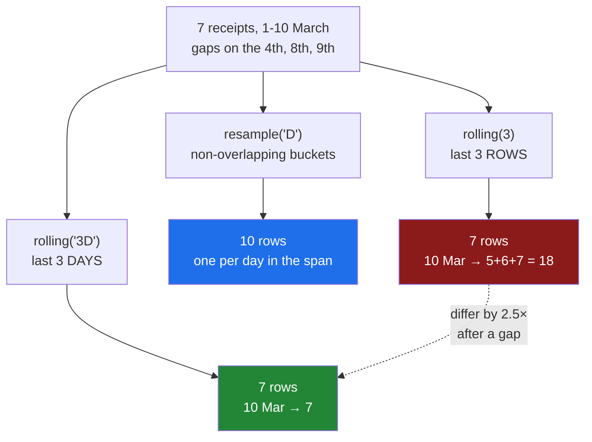

# 6.5 — `rolling` is not `resample`

## One-line answer

`resample` cuts time into non-overlapping buckets and returns **one row per bucket**; `rolling` slides
an overlapping window along and returns **one row per input row** — and `rolling(3)` counts three
*rows* while `rolling("3D")` counts three *days*, which are different answers whenever the data has a
gap in it.

---

## The story

The flat's weekly chart is spiky. Some weeks are twice others, because somebody bought a big bag of
rice, and it makes the trend impossible to see.

Somebody suggests smoothing it — a running average, the way a weather app shows temperature. The line
should show roughly what a typical few days cost, without every bulk purchase making a mountain.

So they ask for a rolling three-day average, and they get a line. It is smooth. It looks exactly like
what they wanted.

Then somebody who has done this before asks a question: *three days, or three shopping trips?*

Nobody had thought there was a difference. But the flat does not shop every day. There are stretches
of four or five days when nobody goes near a shop. So "the last three receipts" might span a week,
while "the last three days" might contain one receipt or none at all.

They run it both ways. The two lines are not similar. On the days after a gap they disagree by more
than the spikes they were smoothing out.

---

## The idea in plain language

Three operations in this day now produce a number per period, and they answer three different
questions with three different row counts. That is the thing worth carrying away.

**`groupby` on a time key** — one row per key that actually occurred
([6.3](6.3-the-bucket-that-was-empty.md)). Periods with no data do not appear.

**`resample`** — one row per period across the whole span, whether anything happened or not. The
buckets are **non-overlapping**: every input row belongs to exactly one. The output row count is set
by the span and the frequency, and has nothing to do with the input row count.

**`rolling`** — one row per **input row**. For each row, look back over a window ending at that row,
and aggregate whatever falls inside it. The windows **overlap**: a single input row contributes to
many output rows. The output row count is exactly the input row count.

That last property is the cleanest way to tell them apart. Resample down-samples — it usually returns
fewer rows than it got. Rolling returns exactly as many rows as it got, which means it is a
*transformation* of the series rather than a summary of it. You can put a rolling result next to the
original column in the same frame; you cannot do that with a resample.

Then the distinction the story turns on, and it is the one that catches people who already know all
of the above:

**`rolling(3)` and `rolling("3D")` are different operations.**

- **`rolling(3)`** — an integer. The window is the last **three rows**, whenever they happened. If the
  flat shopped on the 1st, the 2nd and then not again until the 10th, the window at the 10th covers
  nine days. The window is a count of observations and knows nothing about time.
- **`rolling("3D")`** — a string. The window is the last **three days** of calendar time, however many
  rows that contains. It might contain five rows, or one, or — no, never zero, because the current
  row is always in its own window.

On evenly spaced data, with a row for every period and no gaps, these two agree exactly. That is why
the difference is so rarely noticed: it is invisible on the tidy example and appears the moment real
data has a gap.

Two more things that decide whether a rolling result is honest.

**The first rows are blank.** `rolling(3)` cannot fill a three-row window until the third row, so the
first two results are missing. That is correct — it is refusing to average a window that is not there
— and `min_periods=1` overrides it, which trades honesty for a full column. Use `min_periods` when you
know what you are asking for and not to make blanks go away.

**A time-based window needs a sorted time index.** `rolling("3D")` looks backwards in time, so the
rows must be in time order. Out of order, it raises, which is the friendly outcome.

---

## Why Setu needs it

- **[6.2](6.2-resample-the-groupby-you-did-not-write.md)** and
  **[6.3](6.3-the-bucket-that-was-empty.md)** established the resample row count. This part is the
  contrast that makes it memorable — the same file, three operations, three different lengths.
- **[6.4](6.4-label-closed-and-the-edge.md)** showed a bucket edge being a decision. A rolling window
  has the same decision in a different shape: which end of the window the answer is attached to.
- **[7.1](../07-the-module/7.1-the-textdate-module.md)**'s `by_period` is a resample, and the module's
  docstring has to say so, because "weekly spend" is ambiguous between this part's three answers.
- **Day 34**'s quality report uses a rolling count to find stretches where a feed went quiet, which is
  a question resample cannot ask.
- **Phase 6**'s feature engineering is built on rolling windows, and this is where the leakage rule
  first has teeth: a window that includes the current row uses information the model would not have
  had at prediction time.
- **Day 111** onward, nearly every alert is a rolling statistic — "the seven-day average dropped" —
  and the difference between seven rows and seven days is the difference between an alert that fires
  on an outage and one that does not.

---

## The mechanism

Seven receipts with a deliberate gap: nothing on the 4th, 8th or 9th.

```python
import pandas as pd

idx = pd.to_datetime(
    [
        "2026-03-01",
        "2026-03-02",
        "2026-03-03",
        "2026-03-05",
        "2026-03-06",
        "2026-03-07",
        "2026-03-10",
    ]
)
price = pd.Series([1.0, 2.0, 3.0, 4.0, 5.0, 6.0, 7.0], index=idx, name="price")
print("input rows          :", len(price))
print("resample('D').sum() :", len(price.resample("D").sum()), "rows")
print("rolling(3).sum()    :", len(price.rolling(3).sum()), "rows")
```

**Line by line:**

- The prices are `1.0` to `7.0` rather than realistic amounts, because this part is about *which rows
  are in a window* and round numbers let you check the sums in your head.
- The gaps are the point: the 4th is missing, and so are the 8th and 9th. Evenly spaced data would
  make every comparison in this document come out the same.
- The three row counts are printed together, because that single line is the summary of the part.

```text
input rows          : 7
resample('D').sum() : 10 rows
rolling(3).sum()    : 7 rows
```

**Seven rows in. Ten out of one, seven out of the other.** `resample` built a bucket for every day
from the 1st to the 10th, including the three nobody shopped on
([6.3](6.3-the-bucket-that-was-empty.md)). `rolling` returned one row per receipt, because that is
what it does — the length is a property of the input, not of the calendar.

Now the two windows, which is the story:

```python
by_rows = price.rolling(3).sum()
by_days = price.rolling("3D").sum()
compare = pd.DataFrame({"price": price, "rolling(3)": by_rows, "rolling('3D')": by_days})
print(compare)
```

**Line by line:**

- `rolling(3)` takes an integer: three **rows**, whatever dates they carry.
- `rolling("3D")` takes a string: three **days** of calendar time, however many rows fall inside.
  Because it is measured against the index, this form only works on a time index.
- Putting both in a frame beside the original column is possible **only** because rolling preserves
  the row count. A resample could not be added to this table without reindexing, and that is the
  practical face of the difference.

```text
            price  rolling(3)  rolling('3D')
2026-03-01    1.0         NaN            1.0
2026-03-02    2.0         NaN            3.0
2026-03-03    3.0         6.0            6.0
2026-03-05    4.0         9.0            7.0
2026-03-06    5.0        12.0            9.0
2026-03-07    6.0        15.0           15.0
2026-03-10    7.0        18.0            7.0
```

Read the last row first, because it is the whole part in one line. **`18.0` against `7.0`.**

On 10 March, `rolling(3)` looked back three *rows* — the 6th, the 7th and the 10th — and added
`5 + 6 + 7 = 18`. `rolling("3D")` looked back three *days*, to the 8th, found that the only receipt in
that window is the one on the 10th itself, and returned `7`.

Both are correct. They answer different questions, and after a three-day gap they differ by a factor
of two and a half.

Look at 5 March too: `9.0` against `7.0`. `rolling(3)` took the 2nd, 3rd and 5th; `rolling("3D")` took
only the 3rd and 5th, because the 2nd is more than three days back. The disagreement starts at the
first gap and never fully recovers.

And the two `NaN`s in the `rolling(3)` column are the honest refusal: there are not three rows yet, so
there is no three-row answer. The time window has no such problem — one day of data is a legitimate
three-day window that happens to contain one row — which is why its first two values are filled.

The knob that removes the blanks, and what it costs:

```python
print("min_periods=1:", price.rolling(3, min_periods=1).sum().tolist())
print("default      :", price.rolling(3).sum().tolist())
```

**Line by line:**

- `min_periods=1` says *give me an answer as soon as there is at least one value*, so the first row
  averages one number, the second averages two, and only from the third is it a genuine three-row
  window.
- The default is `min_periods=3` for `rolling(3)` — the window size — which is why the first two are
  blank.
- Printing both as lists puts the difference where it is easiest to see: the first two positions.

```text
min_periods=1: [1.0, 3.0, 6.0, 9.0, 12.0, 15.0, 18.0]
default      : [nan, nan, 6.0, 9.0, 12.0, 15.0, 18.0]
```

The first two values are now `1.0` and `3.0`, which are a one-row sum and a two-row sum sitting in a
column whose header says three. On a **sum** that is visibly odd — the line starts low and ramps up.
On a **mean** it is invisible, because the average of one number looks exactly like the average of
three, and the first points of the chart are noisier than the rest with nothing to say so.



---

## When it breaks

**The time window on an unsorted index:**

```text
$ uv run python -c "
import pandas as pd
idx = pd.to_datetime(['2026-03-03', '2026-03-01', '2026-03-02'])
p = pd.Series([3.0, 1.0, 2.0], index=idx)
print('rolling(2) works :', p.rolling(2).sum().tolist())
print(p.rolling('2D').sum())
"
rolling(2) works : [nan, 4.0, 3.0]
ValueError: index values must be monotonic
```

**Two behaviours from one unsorted index, and the loud one is the safe one.** The integer window
happily added row 1 to row 2 — `3.0 + 1.0 = 4.0` — which is a sum of March 3rd and March 1st,
described in the output as belonging to March 1st. Nothing raised, and the number is meaningless.

The time window refuses, because looking back three days from a row is only defined if the rows are
in time order. `index values must be monotonic` is a short message for a real problem, and the fix is
`.sort_index()` before rolling — which you should be doing for the integer window too, where nothing
will tell you.

**The window that included the row it was predicting:**

```text
$ uv run python -c "
import pandas as pd
p = pd.Series([1.0, 2.0, 3.0, 100.0], index=pd.to_datetime(['2026-03-01', '2026-03-02', '2026-03-03', '2026-03-04']))
print('mean incl. today:', p.rolling(3).mean().tolist())
print('mean excl. today:', p.shift(1).rolling(3).mean().tolist())
"
mean incl. today: [nan, nan, 2.0, 35.0]
mean excl. today: [nan, nan, nan, 2.0]
```

**Nothing raised, and the first line is leakage.** On 4 March the value is `100.0` — a spike. The
first line's rolling mean for that day is `35.0`, and `35.0` already contains the `100.0`. If that
column is a feature used to predict the 4th, the model is being handed the answer.

The second line shifts the series by one row first, so each day's window ends the day *before*. On
4 March it reports `2.0` — the mean of the 1st to the 3rd — which is what was actually knowable that
morning.

This is Principle 8's leakage rule arriving in a time-series shape, and it is the single most common
way a model looks brilliant in a notebook and useless in production. Every rolling feature needs an
explicit answer to *does this window include the row it describes?*

**The two smoothings that were both called "3-day":**

```text
$ uv run python -c "
import pandas as pd
import numpy as np
rng = np.random.default_rng(33)
days = pd.to_datetime('2026-01-01') + pd.to_timedelta(np.sort(rng.choice(180, 60, replace=False)), unit='D')
p = pd.Series(rng.uniform(1, 10, 60).round(2), index=days)
by_rows = p.rolling(7).mean()
by_time = p.rolling('7D').mean()
print('rows        :', len(p))
print('both lengths:', len(by_rows), len(by_time))
print('max gap     :', float((by_rows - by_time).abs().max()))
print('rows differ :', int((by_rows.round(6) != by_time.round(6)).sum()), 'of', len(p))
"
rows        : 60
both lengths: 60 60
max gap     : 3.4642857142857144
rows differ : 60 of 60
```

**Same length, same name, and every one of the sixty values disagrees.** On sixty receipts scattered over
180 days, "the last seven rows" and "the last seven days" are almost never the same set — the
seven-row window spans about three weeks, and the seven-day window usually holds two or three rows.

The largest single disagreement is `3.46` on a scale where the values run from 1 to 10, so this is not
a rounding difference: it is a different metric wearing the same name. Both columns have the right
length and no nulls after the warm-up, so every structural check passes.

---

## In production

**What a professional writes instead of the teaching version.** The window's meaning, its warm-up
policy and whether it includes the current row are all stated, because all three change the numbers:

```python
import pandas as pd


def trailing(
    values: pd.Series, window: str, *, min_periods: int, include_current: bool
) -> pd.Series:
    """Rolling mean over a time-based `window` such as '7D'. Both policies are explicit."""
    if not values.index.is_monotonic_increasing:
        raise ValueError("index is not sorted; a time window needs rows in time order")
    if not isinstance(window, str):
        raise TypeError(f"window={window!r}; pass a time string like '7D', not a row count")
    source = values if include_current else values.shift(1)
    return source.rolling(window, min_periods=min_periods).mean()
```

**Line by line:**

- The sort check runs **first** and raises. `rolling` with a time string would raise anyway, but with
  `index values must be monotonic` rather than a message naming this function's contract — and if somebody
  later changes the window to an integer, the raise disappears entirely and the wrong-answer path from
  §*When it breaks* opens up. This check closes it for good.
- `isinstance(window, str)` **refuses an integer window** outright. That is opinionated and
  deliberate: on irregular data a row-count window is almost never what a business metric means, and
  making it unavailable here forces anybody who genuinely wants one to write a different function with
  a different name.
- `min_periods` is keyword-only with **no default**, so the warm-up policy is a decision at every call
  site. Its default in pandas for a time window is `1`, which silently fills the first rows with
  under-populated averages — the invisible version of the failure above.
- `include_current` is keyword-only with **no default** either, and it is the leakage switch. A
  feature for a model gets `False`; a dashboard showing "average over the last week including today"
  gets `True`. Naming it forces the question that Principle 8 exists to make unavoidable.
- `values.shift(1)` and not `.shift(freq=...)`: shifting by one **row** moves each value to the next
  observation, which is what "the most recent information available before this row" means on
  irregular data. Shifting by a fixed period would leave gaps where nothing was observed.

**What degrades at scale.** Rolling is a genuine cost, unlike resample:

```text
1 000 000 rows, one per minute
  resample('D').mean()          0.016 s   ->       695 rows
  rolling(7).mean()             0.022 s   -> 1 000 000 rows
  rolling('7D').mean()          0.028 s   -> 1 000 000 rows
on 100 000 rows
  rolling(7).mean()             0.0023 s
  rolling(7).apply(np.mean)     4.400 s     1943x slower
memory of the result, 1 000 000 float64
  resample('D')                 5.6 KB
  rolling(7)                    8.0 MB
```

**Line by line:**

- Both rolling forms are **cheap**, and the time-based window costs only about a quarter more than the
  integer one here. pandas computes both incrementally — adding the entering value, subtracting the
  leaving one — so the cost per row barely grows with the window size. On *irregular* data the gap
  widens, because the window boundaries have to be located in the index rather than advanced by one;
  it is still not the thing that will hurt you.
- `.apply(np.mean)` is the thing that will hurt you: **nearly two thousand times** slower than the
  built-in `.mean()` on the same windows, because it drops to a Python function call per window
  instead of running compiled incremental code. Four and a half seconds for a tenth of the data. This
  is the single biggest performance trap in rolling code, and it is easy to write by accident, because
  `apply(np.mean)` looks like a harmless spelling of `mean()`. Use `apply` only when no built-in
  exists, and expect the bill.
- The memory lines restate the structural difference in bytes. Resample gives back something you could
  paste into a message; rolling gives back a column the size of the input — **1 400 times** larger
  here — so a pipeline that adds six rolling features has multiplied its memory footprint by seven.

**The failure that only appears with real data.** A monitoring system alerted when the seven-day
average of successful requests fell below a threshold, implemented as `rolling(7)`. The data had one
row per hour, so `rolling(7)` was a seven-*hour* window that everybody described and documented as
seven days. It behaved acceptably for a year because seven hours of smoothing was enough to suppress
ordinary noise. Then an exporter failure produced a gap: rows stopped arriving, and with no rows the
window stopped advancing, so the last computed average simply persisted — flat, healthy, and stale.
The outage ran for six hours under a green dashboard. `rolling("7D")` would have kept sliding with the
clock, dropped the stale values out of the window as time passed, and gone red. The lesson is that a
row-count window measures *data*, and a monitoring window has to measure *time*, because the thing
most worth alerting on is data not arriving.

**The review comment a senior engineer leaves.** *"`rolling(7)` on an irregular index is seven rows,
not seven days — this series averages about one row every three days, so the label on this chart is
wrong by a factor of three. Use `rolling('7D')`. And this feeds a model: shift by one first, or the
window contains the row you are predicting."*

**The interview question.** *"When would you use `rolling` instead of `resample`?"* When you want a
value for every original row rather than a summary per period — smoothing, trailing averages, anything
that stays alongside the raw data. Resample down-samples to one row per bucket with no overlap;
rolling keeps the row count and the windows overlap. Then the follow-up that finds out whether you
have used it on real data: **what is the difference between `rolling(7)` and `rolling("7D")`?** The
first is seven observations, the second is seven days of clock time. They agree exactly on evenly
spaced data and diverge as soon as there is a gap — which means the bug is invisible in every test
fixture and appears in production, where a row-count window quietly stops advancing when data stops
arriving.

---

## Check yourself

```bash
uv run python -c "
import pandas as pd
idx = pd.to_datetime(['2026-03-01', '2026-03-02', '2026-03-03', '2026-03-05', '2026-03-06', '2026-03-07', '2026-03-10'])
p = pd.Series([1.0, 2.0, 3.0, 4.0, 5.0, 6.0, 7.0], index=idx, name='price')
print('input rows   :', len(p))
print('resample rows:', len(p.resample('D').sum()))
print('rolling rows :', len(p.rolling(3).sum()))
print(pd.DataFrame({'price': p, 'rows3': p.rolling(3).sum(), 'days3': p.rolling('3D').sum()}))
print('min_periods=1:', p.rolling(3, min_periods=1).sum().tolist())
print('shifted      :', p.shift(1).rolling(3).sum().tolist())
"
```

Run it. Three operations give 10, 7 and 7 rows from 7 receipts — say which gives which and why. Then
explain the last row of the table, where the two windows differ by more than a factor of two, and say
which of the two you would feed to a model.

**Answer out loud, without scrolling up:**

> How many rows does `rolling` return, compared with `resample`? Then say what `rolling(3)` counts
> that `rolling("3D")` does not, and when the two give the same answer.

---

**Next:** [7.1 — the `textdate` module](../07-the-module/7.1-the-textdate-module.md).
