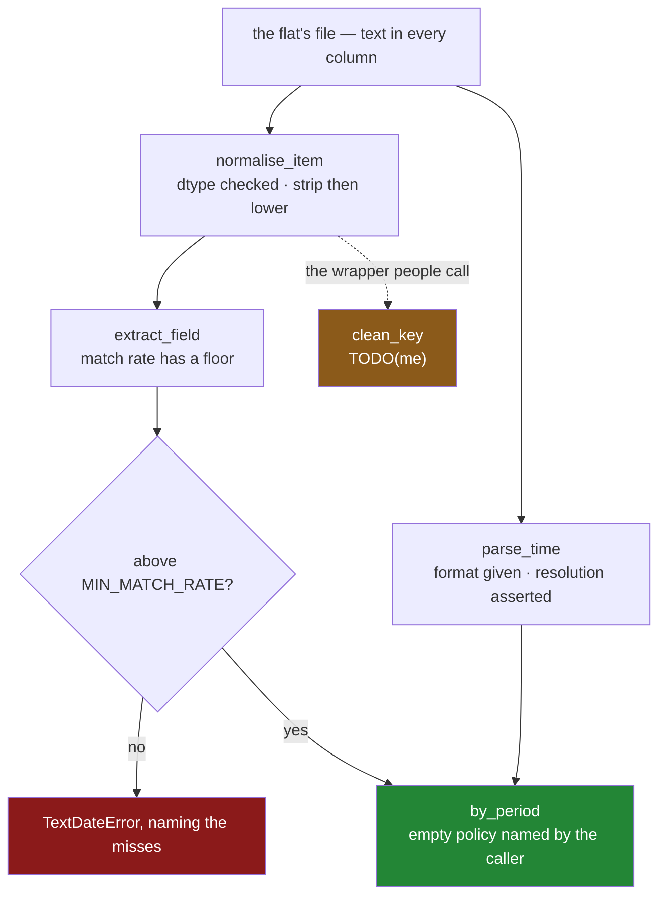

# 7.1 — `src/setu/textdate.py`: the day's module

## One-line answer

The day's module keeps three promises — **text is cleaned once, at the boundary**, **a timestamp is
never guessed at**, and **an empty bucket means whatever the caller said it means** — and where a
promise cannot be kept by the code, it is kept by a check that refuses.

---

## The story

By the end of the day the flat has a set of habits. Trim before you lower-case. Say the format you
expect. Say what an empty week means before you draw the chart. Check that the pattern matched
something.

Habits are private, and the next person to open this file has not had the day.

`.str.strip()` looks redundant next to `.str.lower()`, because on today's data both spellings of milk
are already lower case. `format="%Y-%m-%d %H:%M:%S"` looks like typing that `pd.to_datetime` can do
for you. The line counting how many rows a pattern matched looks like it can only ever be in the way.
And `empty="blank"` is one more argument on a call that would run without it.

Every one of those edits passes review and keeps the tests green. Three of the four make a currently
noisy thing quiet, which is the most dangerous kind of edit there is.

So the habits go into one file, with the reasons attached, and where the code cannot enforce a rule a
check refuses instead.

---

## The idea in plain language

`src/setu/textdate.py` holds the day's operations. Each one carries a decision the day argued for.

| the function | the rule it keeps | how it keeps it |
|---|---|---|
| `TextDateError` | a text-or-time failure is its own kind | one exception, imported by callers |
| `normalise_item` | text is cleaned once, at the boundary | dtype checked, then strip then lower ([2.1](../02-cleaning-names/2.1-four-spellings-of-milk.md)) |
| `extract_field` | a pattern that matched nothing is a failure | the match rate has a floor ([3.4](../03-pulling-text-apart/3.4-the-pattern-that-matched-nothing.md)) |
| `parse_time` | a timestamp is never guessed at | `format=` given, errors surfaced, resolution asserted ([4.2](../04-the-dt-accessor/4.2-to-datetime-format-and-errors.md)) |
| `by_period` | an empty bucket has a meaning | the caller names the policy ([6.3](../06-resampling/6.3-the-bucket-that-was-empty.md)) |
| `clean_key` | the join key is one value per thing | **not yet** — it lower-cases and nothing else; yours to fix |

Three of those are worth calling out.

**`parse_time` states the format and asserts the result's resolution.** The resolution is the
smallest unit of time a column can hold. pandas 3 picks microseconds where pandas 1 and 2 picked
nanoseconds, and a column whose resolution changes halfway through a pipeline breaks a `concat`, a
`merge` and a Parquet round trip ([4.4](../04-the-dt-accessor/4.4-the-resolution-pandas-3-picks.md)).

**`by_period` makes the caller name the empty-bucket policy.** Resampling manufactures rows for
periods with no data ([6.3](../06-resampling/6.3-the-bucket-that-was-empty.md)), and "nobody shopped"
and "we do not know" are different claims about the same blank
([Day 30, 3.1](../../../day-30-missing-data/parts/03-why-it-is-missing/3.1-three-reasons-a-line-is-blank.md)).
The argument has no default, so no caller can avoid deciding.

**`clean_key` is deliberately incomplete.** It is the wrapper the rest of the pipeline calls before a
join, and as written it does `.str.lower()` and nothing else — no trim, no dtype check. So `'milk '`
with its invisible trailing space stays a different key from `'milk'`, and the join quietly loses
those rows ([2.4](../02-cleaning-names/2.4-the-mismatch-that-costs-rows.md)). *When it breaks*
measures the damage, and the build brief asks you to fix it.

The module builds on the days before it. It imports `SelectionError` from
[Day 28's module](../../../day-28-selection-and-alignment/parts/06-the-module/6.1-the-select-module.md)
rather than inventing another exception meaning "that column is not there", and callers already
catching `GroupingError` from [Day 31](../../../day-31-groupby/parts/06-the-module/6.1-the-grouping-module.md)
or `JoinError` from [Day 32](../../../day-32-joining-and-reshaping/parts/06-the-module/6.1-the-joining-module.md)
keep working, because an `except` clause catches subclasses and every one of these is a `ValueError`
([Day 18, 2.1](../../../day-18-exceptions/parts/02-the-hierarchy/2.1-catching-catches-subclasses.md)).

---

## Why Setu needs it

- **[7.2](7.2-the-test-that-can-go-red.md)** tests every promise on this page, and finds one that no
  correctness test can defend.
- **Sections 1 to 3** argued about text, **4 and 5** about time, **6** about buckets. This is where
  all three stop being advice.
- **Day 34** builds a data-quality report, and every number in it — distinct values, blank share,
  earliest and latest — is wrong until text is normalised and time is parsed.
- **Day 45** is the Phase 4 gate, whose deliverable is a clean, typed, joined dataset. "Typed" is
  `parse_time`; "clean" is `normalise_item`. **Day 111** and **Day 162** begin with the same two
  operations on far more rows.

---

## The mechanism

The head of the file — the day's policy, readable without opening a function:

```python
"""Clean the flat's text and turn its timestamps into time — without guessing at either."""

from __future__ import annotations

import logging

import pandas as pd

from setu.select import SelectionError

log = logging.getLogger(__name__)

TEXT_DTYPE = "str"
TIME_FORMAT = "%Y-%m-%d %H:%M:%S"
TIME_RESOLUTION = "datetime64[us]"
MIN_MATCH_RATE = 0.95
EMPTY_POLICIES = frozenset({"zero", "blank", "drop"})


class TextDateError(ValueError):
    """Text or time arrived in a shape this module refuses to guess at."""
```

**Line by line:**

- Five constants, because these are the five decisions the day made, and a reader should find them
  without reading any code.
- `TEXT_DTYPE = "str"` names pandas 3's inferred dtype for text
  ([1.3](../01-the-str-accessor/1.3-the-dtype-under-the-text.md)). A constant rather than a literal,
  so the day a column arrives as `object` there is one place to argue about it.
- `TIME_RESOLUTION = "datetime64[us]"` is an **assertion about pandas**, not a request. Nothing here
  sets the resolution; the constant exists so a future pandas changing its default is a loud failure
  rather than a silent re-typing.
- `MIN_MATCH_RATE = 0.95` is a **policy**, not a fact, which makes it the one thing here no
  correctness test can defend ([7.2](7.2-the-test-that-can-go-red.md)).
- `SelectionError` is **imported**, not redefined. `TextDateError` is genuinely different: the column
  is present and its *contents* are not what the caller promised.

Cleaning the text, and pulling a field out of it:

```python
def normalise_item(frame: pd.DataFrame, column: str) -> pd.DataFrame:
    """Return a new frame whose `column` is trimmed and lower-cased.

    Two spellings that differ only in case or in surrounding space become one key.
    """
    if column not in frame.columns:
        raise SelectionError(f"no column {column!r}; frame has {list(frame.columns)}")
    if frame[column].dtype != TEXT_DTYPE:
        raise TextDateError(
            f"{column!r} is {frame[column].dtype}, not {TEXT_DTYPE}; "
            "fix the dtype at the read rather than casting here"
        )

    cleaned = frame[column].str.strip().str.lower()
    log.info("normalise_item(%s): %d -> %d", column, frame[column].nunique(), cleaned.nunique())
    return frame.assign(**{column: cleaned})


def extract_field(
    series: pd.Series,
    pattern: str,
    name: str,
    min_match_rate: float = MIN_MATCH_RATE,
) -> pd.Series:
    """Pull one named group out of every value, refusing when too few rows matched."""
    if series.dtype != TEXT_DTYPE:
        raise TextDateError(f"{series.name!r} is {series.dtype}, not {TEXT_DTYPE}")
    if f"(?P<{name}>" not in pattern:
        raise TextDateError(f"pattern {pattern!r} has no named group (?P<{name}>...)")

    pulled = series.str.extract(pattern)[name]
    rate = float(pulled.notna().mean()) if len(pulled) else 0.0
    log.info("extract_field(%s): %.1f%% of %d rows matched", name, rate * 100, len(series))

    if rate < min_match_rate:
        misses = series[pulled.isna()].head(5).tolist()
        raise TextDateError(
            f"pattern {pattern!r} matched {rate:.1%} of rows for {name!r} "
            f"(floor {min_match_rate:.1%}); first misses: {misses}"
        )
    return pulled.rename(name)
```

**Line by line:**

- `normalise_item` takes the **frame and a column name**, not a Series, so the error can list the
  frame's other columns — what a caller who typed `"items"` actually needs. The message says *"fix
  the dtype at the read"* rather than casting silently, because a price column arriving here is a bug
  somewhere else and `astype("str")` hides it for another month
  ([Day 27, 1.4](../../../day-27-reading-and-writing/parts/01-the-csv/1.4-dtype-at-read-time.md)).
- `.str.strip().str.lower()` in that order, and both of them. Either alone fixes only part of the
  flat's four spellings ([2.1](../02-cleaning-names/2.1-four-spellings-of-milk.md)).
- The log line reports the **distinct count before and after**, the one number that says whether the
  call did anything. It is also the most expensive line here — see *In production*.
- `frame.assign(...)` returns a new frame and leaves the caller's alone, the rule every pandas
  operation has followed since Copy-on-Write became the only mode
  ([Day 26, 3.1](../../../day-26-frames-and-copy-on-write/parts/03-copy-on-write/3.1-every-result-behaves-like-a-copy.md)).
  `**{column: cleaned}` is how `assign` takes a column name held in a variable.
- `extract_field` refuses a pattern with **no named group**, before running it. A positional group
  works and produces a column called `0`, a name nobody can search for
  ([3.3](../03-pulling-text-apart/3.3-extract-and-the-capture-group.md)).
- `pulled.notna().mean()` is the match rate. `.str.extract` returns a blank for every row the pattern
  missed and **raises nothing**, so this ratio is the only evidence the call went wrong
  ([3.4](../03-pulling-text-apart/3.4-the-pattern-that-matched-nothing.md)). The `if len(pulled)`
  guard matters, because on an empty frame the mean is `NaN` and `NaN < 0.95` is `False`
  ([Day 30, 1.2](../../../day-30-missing-data/parts/01-what-missing-means/1.2-nan-the-number-not-equal-to-itself.md)).
- The error carries **five example misses**, because "75% matched" says there is a problem and
  `['eggs']` says what it is.

Time, and the buckets made out of it:

```python
def parse_time(
    frame: pd.DataFrame,
    column: str,
    fmt: str = TIME_FORMAT,
    tz: str = "UTC",
) -> pd.DataFrame:
    """Return a new frame whose `column` is aware timestamps at a named resolution."""
    if column not in frame.columns:
        raise SelectionError(f"no column {column!r}; frame has {list(frame.columns)}")

    try:
        stamps = pd.to_datetime(frame[column], format=fmt, errors="raise")
    except ValueError as error:
        raise TextDateError(f"{column!r} does not match format {fmt!r}: {error}") from error

    if str(stamps.dtype) != TIME_RESOLUTION:
        raise TextDateError(f"{column!r} parsed to {stamps.dtype}, not {TIME_RESOLUTION}")

    log.info("parse_time(%s): %s -> %s at %s", column, frame[column].dtype, stamps.dtype, tz)
    return frame.assign(**{column: stamps.dt.tz_localize(tz)})


def by_period(
    frame: pd.DataFrame,
    time_column: str,
    freq: str,
    value: str,
    how: str,
    *,
    empty: str,
) -> pd.DataFrame:
    """Resample `value` into `freq` buckets; the caller says what an empty bucket means."""
    if empty not in EMPTY_POLICIES:
        raise TextDateError(f"empty must be one of {sorted(EMPTY_POLICIES)}, not {empty!r}")
    if not pd.api.types.is_datetime64_any_dtype(frame[time_column]):
        raise TextDateError(
            f"{time_column!r} is {frame[time_column].dtype}, not a timestamp; "
            "call parse_time before resampling"
        )

    buckets = frame.resample(freq, on=time_column)[value]
    out = buckets.agg(how).to_frame(value).assign(rows=buckets.size())
    log.info("by_period(%s, %s): %d rows -> %d buckets", time_column, freq, len(frame), len(out))

    if empty == "drop":
        return out[out["rows"] > 0]
    if empty == "blank":
        return out.assign(**{value: out[value].where(out["rows"] > 0)})
    return out.assign(**{value: out[value].fillna(0.0)})
```

**Line by line:**

- `fmt: str = TIME_FORMAT` — a default, not an absence. `pd.to_datetime` with no format infers one
  from the first value and applies it to the rest, which is right until a source changes
  ([4.2](../04-the-dt-accessor/4.2-to-datetime-format-and-errors.md)).
- `errors="raise"` and not `errors="coerce"`. Coercing turns an unreadable date into a blank, and a
  blank timestamp is indistinguishable from a shop nobody recorded.
- `raise ... from error` keeps pandas' own message inside the new one and the original attached as
  the cause, so the reader sees both which column failed and which value did
  ([Day 18, 3.4](../../../day-18-exceptions/parts/03-your-own/3.4-translate-at-the-boundary.md)).
- The resolution check runs **before** `tz_localize`, because localising changes the dtype to
  `datetime64[us, UTC]` and the comparison would never match again. `tz` defaults to `"UTC"` and the
  localising happens here, at the edge, so everything downstream compares aware with aware
  ([4.5](../04-the-dt-accessor/4.5-naive-aware-and-the-hour-that-moved.md)).
- `by_period` takes `on=time_column` rather than requiring a `DatetimeIndex`, so the caller's frame
  keeps its own index ([6.1](../06-resampling/6.1-the-index-that-has-to-be-time.md)).
- `empty` is **keyword-only and has no default** — that is what the bare `*` in the signature does.
  There is no way to call this without saying what an empty week means.
- `.assign(rows=buckets.size())` carries each bucket's row count into the result. Without it, a `0.0`
  from `sum` and a `0.0` from a policy are the same number with two meanings
  ([6.3](../06-resampling/6.3-the-bucket-that-was-empty.md)).
- The three branches are the three honest answers: `drop` gives what `groupby` would have given,
  `blank` says we do not know, `zero` says nobody shopped.



And the unfinished parts, which are the day's three reps:

```python
def clean_key(frame: pd.DataFrame, column: str) -> pd.DataFrame:
    """Lower-case a key column before it is used as a join key.

    TODO(me): every join in the pipeline calls this, and it guarantees nothing.
      1. No `.str.strip()`, so 'milk ' stays a different key from 'milk' and the join
         silently loses those rows — the failure measured in 2.4.
      2. No dtype assertion, so an `object` column from a JSON read reaches the accessor
         and fails from inside pandas instead of naming this column.
      3. No before/after distinct count, so neither fault leaves a trace in the log.
    Fix it, and say in the docstring what the result is guaranteed to be: one key per
    thing, or something weaker.
    """
    return frame.assign(**{column: frame[column].str.lower()})
```

**Line by line:**

- `frame[column].str.lower()` is the line most people write, and it is correct about the only thing
  it promises: `MILK` and `Milk` become the same key.
- What it does **not** promise is *one key per thing*, because a trailing space survives every case
  change there is — the trap "I lower-cased it, so the keys match" walks into.
- The docstring names all three faults rather than saying "improve this", so the task is checkable.

Two more reps go in the same file, and neither is written for you. **`time_report(frame, column)`**
returns the span, the resolution, the time zone and the share of values that failed to parse — with a
comment saying why the failed share is the number to alert on, since a row that would not parse is a
row in no bucket at all and every total downstream is quietly short by it. **`guard_freq`** goes
inside `by_period` and refuses a frequency finer than the data's own spacing, with a comment on why
the input row count does not predict the output row count. *When it breaks* is where eight rows
become fourteen thousand buckets.

---

## When it breaks

**The unfinished `clean_key`, measured against the flat's price sheet:**

```text
$ uv run python -c "
import pandas as pd
from setu.textdate import clean_key, normalise_item
items = ['Milk', 'milk ', 'MILK', 'milk', 'Bread', 'bread ', 'Eggs', 'rice']
prices = [1.15, 1.15, 1.20, 1.20, 1.40, 1.40, 2.30, 3.05]
receipts = pd.DataFrame({'item': pd.Series(items, dtype='str'), 'price': prices})
sheet = pd.DataFrame({'item': pd.Series(['milk', 'bread', 'eggs', 'tea'], dtype='str')}).assign(known=True)
for name, fn in [('clean_key', clean_key), ('normalise_item', normalise_item)]:
    out = fn(receipts, 'item')
    missed = out.merge(sheet, on='item', how='left')['known'].isna()
    print(name, out['item'].nunique(), 'keys,', int(missed.sum()), 'rows and',
          round(receipts.loc[missed, 'price'].sum(), 2), 'unmatched')
"
```

```text
clean_key 6 keys, 3 rows and 5.6 unmatched
normalise_item 4 keys, 1 rows and 3.05 unmatched
```

**What it means.** `clean_key` leaves six keys where there are four things, so three of the eight
rows find nothing on the price sheet and £5.60 of £12.85 goes missing. `normalise_item` leaves one
unmatched row, and that one is honest: `rice` is genuinely not on the sheet. **Nothing raised in
either case** — a left join keeps every row, so the row count does not move and the loss shows only
in the column that came from the right-hand side
([Day 32, 3.4](../../../day-32-joining-and-reshaping/parts/03-the-row-count/3.4-the-join-that-dropped-forty-per-cent.md)).
This is the `TODO(me)`.

**`parse_time` refusing a date a person typed:**

```text
$ uv run python -c "
import pandas as pd
from setu.textdate import parse_time
frame = pd.DataFrame({'paid_at': pd.Series(['2026-03-01 08:12:30', '9th March 2026'], dtype='str')})
try:
    parse_time(frame, 'paid_at')
except Exception as error:
    print(type(error).__name__, '->', str(error).splitlines()[0])
    print('caused by', type(error.__cause__).__name__, '->', str(error.__cause__).splitlines()[0])
"
```

```text
TextDateError -> 'paid_at' does not match format '%Y-%m-%d %H:%M:%S': time data "9th March 2026" doesn't match format "%Y-%m-%d %H:%M:%S". You might want to try:
caused by ValueError -> time data "9th March 2026" doesn't match format "%Y-%m-%d %H:%M:%S". You might want to try:
```

**What it means.** Two errors, chained. `raise ... from error` set `__cause__`, so the original
`ValueError` is still reachable and an uncaught version prints both tracebacks joined by *"The above
exception was the direct cause of the following exception"*. The lower one names the column, the
upper one names the value. pandas then offers three suggestions, and one of them — `format='mixed'` —
is exactly the wrong advice here, because inferring per value is how `1/3/2026` becomes January.

**A number column asked to be text**, `normalise_item(pd.DataFrame({'price': [1.15, 1.40]}), 'price')`:

```text
setu.textdate.TextDateError: 'price' is float64, not str; fix the dtype at the read rather than casting here
```

**What it means.** The check fired before the accessor did, so the message names the column and the
remedy. Without it the reader gets pandas' own version — *"Can only use .str accessor with string
values, not floating"* — which is true, does not say which column, and arrives several frames deep
([1.1](../01-the-str-accessor/1.1-the-column-that-has-no-lower.md)).

**The resample nobody bounded:**

```text
$ uv run python -c "
import pandas as pd
from setu.textdate import by_period, parse_time
stamps = pd.date_range('2026-03-01 08:12:30', periods=8, freq='34h11min')
frame = pd.DataFrame({'paid_at': pd.Series(stamps.strftime('%Y-%m-%d %H:%M:%S'), dtype='str'),
                      'price': [1.15] * 8})
parsed = parse_time(frame, 'paid_at')
for freq in ('W', 'D', 'h', 'min'):
    out = by_period(parsed, 'paid_at', freq, 'price', 'sum', empty='blank')
    print(freq, '8 rows ->', len(out), 'buckets,', int((out['rows'] == 0).sum()), 'empty')
"
```

```text
W 8 rows -> 3 buckets, 0 empty
D 8 rows -> 11 buckets, 3 empty
h 8 rows -> 240 buckets, 232 empty
min 8 rows -> 14358 buckets, 14350 empty
```

**What it means.** Eight rows spread over eleven days, one argument changed, and the output grows
from three rows to fourteen thousand — of which all but eight are empty. **The input row count does
not predict the output row count**, because resample's output is the *span* of the data divided by
the frequency ([6.2](../06-resampling/6.2-resample-the-groupby-you-did-not-write.md)). On a table
covering three years, a `freq="s"` typed instead of `freq="D"` is a memory error rather than a wrong
number. That is the `guard_freq` rep.

---

## In production

**The log line stops computing.** `normalise_item` logs the distinct count before and after, which is
the most useful line in the function and, measured, the most expensive:

```text
$ uv run python -c "
import time
import numpy as np
import pandas as pd
rng = np.random.default_rng(33)
words = np.array(['Milk', 'milk ', 'MILK', 'milk', 'Bread', 'bread ', 'Eggs', 'rice'])
item = pd.Series(words[rng.integers(0, 8, 1_000_000)], dtype='str')
def ms(fn):
    fn()
    t = time.perf_counter()
    for _ in range(5):
        fn()
    return round((time.perf_counter() - t) * 200, 1)
print('the work    :', ms(lambda: item.str.strip().str.lower()), 'ms')
print('the log line:', ms(lambda: (item.nunique(), item.str.strip().str.lower().nunique())), 'ms')
"
```

```text
the work    : 105.1 ms
the log line: 186.4 ms
```

The two `nunique()` calls cost **more than the work they describe**, because each hashes every value
in the column. On eight rows that is free; on a million it nearly doubles the function. The
production shape is to compute them under `if log.isEnabledFor(logging.INFO)`, or to log `len(frame)`
always and the distinct counts only in a profiling run.

**The constants leave the code, and the counts become metrics.** `TIME_FORMAT` and `MIN_MATCH_RATE`
become per-source configuration, because two feeds have two formats and two acceptable match rates,
and the people who know them are not the people who edit this file. In the same move `match_rate`,
`unparsed_share` and `empty_buckets` stop being thresholds that raise and become structured events
emitted on every call, so a slow decay is visible weeks before it trips the floor. The numbers are
already computed; only the emission changes. The intermediate step, and a good one, is to keep the
constants and have the test assert their values, so a change of policy shows up as a deliberate
two-file diff ([7.2](7.2-the-test-that-can-go-red.md)).

**Parsing moves to the boundary and happens once** — `parse_time` in the loader, not in the report.
The rule is the one [2.1](../02-cleaning-names/2.1-four-spellings-of-milk.md) reached for text: a
pipeline that parses in four places has four definitions of what a timestamp is, and the day one of
them gains `dayfirst=True` the other three quietly disagree.

**What changes at scale.** `normalise_item` and `parse_time` are single passes over a column and stay
cheap; the vectorised-versus-loop gap is the one measured in
[Day 29, 2.1](../../../day-29-iteration-and-order/parts/02-vectorised/2.1-one-operation-every-row.md).
The operation that hurts is `by_period` on a fine frequency, whose output size has nothing to do with
the input size. Past a few million rows the whole module is `LOWER`, `TRIM`, `REGEXP_EXTRACT`, `CAST`
and `DATE_TRUNC ... GROUP BY` in SQL, and Day 35's DuckDB runs them without building the
intermediates. **The design does not change; the executor does** — the guards transfer unchanged,
because the failures are in the data rather than in the tool.

**The failure mode that only appears with real data.** A phone spends a week on holiday time, one
shopper starts typing `milk (2l)`, and a supplier's export switches to day-first dates. Three guards
fire at once in three different jobs, every one correct, and together they look like the module is
broken. The production shape is that the guards report into one place with counts, so that "the item
column lost 4% of its match rate and paid_at gained a time zone on Tuesday" is one legible line, not
three incidents.

**The review comment a senior engineer leaves.** *"`clean_key` is called in five places before joins
and only lower-cases, so every one of those joins is losing the rows with trailing spaces — please
make it delegate to `normalise_item`. And `by_period`'s frequency comes straight from a config file
with no bound on it; one typo there turns eight rows into fourteen thousand."*

**The interview question.** *"Where in a pipeline do you clean text and parse dates?"* Once, at the
boundary, in one named function per operation, with the format stated rather than inferred and the
result's dtype asserted. The follow-up worth being ready for: *"what do you do when the parse starts
failing on 2% of rows?"* Find out which 2%, and do not reach for `errors="coerce"`. Coercing turns a
readable failure into a blank, and a blank timestamp drops out of every bucket without appearing
anywhere as a loss.

---

## Check yourself

```bash
uv run python -c "
import pandas as pd
from setu.textdate import clean_key, normalise_item
items = ['Milk', 'milk ', 'MILK', 'milk', 'Bread', 'bread ', 'Eggs', 'rice']
receipts = pd.DataFrame({'item': pd.Series(items, dtype='str')})
print('clean_key      :', clean_key(receipts, 'item')['item'].nunique(), 'keys')
print('normalise_item :', normalise_item(receipts, 'item')['item'].nunique(), 'keys')
print('actual things  : 4')
"
```

Then open `src/setu/textdate.py` and read `clean_key`'s docstring. Say which of its three listed
faults would show up on the flat's own eight rows, and which one would take a year to notice.

**Answer out loud, without scrolling up:**

> Name the three promises this module makes. Then say why `by_period` refuses to have a default for
> `empty`, and what a caller would silently get wrong if the default were `"zero"`.

---

**Next:** [7.2 — `tests/test_textdate.py`, the test that can go red](7.2-the-test-that-can-go-red.md).
