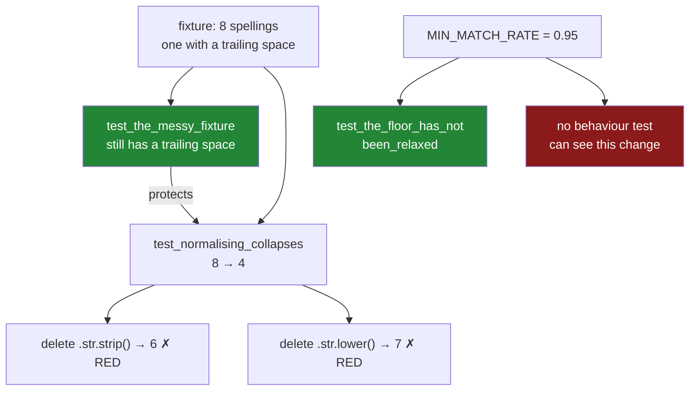

# 7.2 — `tests/test_textdate.py`, the test that can go red

## One-line answer

Every function in this day fails **silently**, so the tests cannot check that a call returned
something — they have to check the one number that separates working from broken, and each fixture
needs its own test proving it still carries the defect it exists to exhibit.

---

## The story

Somebody writes the tests for the module. They are careful about it. Every function gets a test,
every test passes, and the suite runs green in under a second.

Then, tidying up a month later, they delete a line from `normalise_item` — the `.str.strip()`, which
looks redundant next to the `.str.lower()` right beside it.

The suite is still green.

They put it back, and instead delete the dtype assertion at the top of the same function, because it
seemed defensive. Green again.

They try one more: change `MIN_MATCH_RATE` from `0.95` to `0.1`. Every test passes, the module still
works, and a pattern that finds one row in ten now sails through the check that exists to stop
exactly that.

Three deletions, three green runs. The tests were never wrong — every assertion in them is true. They
were just never asked a question whose answer depends on the code being right.

---

## The idea in plain language

Day 2 established the rule: a test that cannot go red is not a test
([Day 02, 3.1](../../../day-02-quality-gate/parts/03-pytest/3.1-the-test-that-can-go-red.md)). This
day makes it unusually hard to obey, for one reason.

**Every failure in this module is silent.** Go back through them:

- A pattern that matches nothing returns a correctly shaped frame full of blanks
  ([3.4](../03-pulling-text-apart/3.4-the-pattern-that-matched-nothing.md)).
- An unnormalised join key loses rows without an error, and a left join keeps the row count
  ([2.4](../02-cleaning-names/2.4-the-mismatch-that-costs-rows.md)).
- An empty resample bucket sums to `0`, which is a number
  ([6.3](../06-resampling/6.3-the-bucket-that-was-empty.md)).
- A coerced timestamp parse turns failures into blanks
  ([4.2](../04-the-dt-accessor/4.2-to-datetime-format-and-errors.md)).

None of those raises. So the usual test shapes are all useless here. Asserting the result is not
`None`, that it is a DataFrame, that it has the expected columns, that the dtypes are right, that the
row count matches — **every one of those passes on the broken version**. They are assertions about
shape, and the shape is never what breaks.

What has to be asserted instead is the **one number that carries the meaning**. For each function
there is exactly one:

| Function | The number that can go red |
|---|---|
| `normalise_item` | the distinct count after the call |
| `extract_field` | the share of rows the pattern matched |
| `parse_time` | that it raised at all, and on which value |
| `by_period` | the bucket count, including empty periods |

Then the second idea, which is the one people skip.

**A fixture has to be tested too.** The test for `normalise_item` asserts the distinct count drops
from eight to four. That only means something if the fixture actually contains a trailing space. If
somebody tidies the fixture — and fixtures get tidied, by autoformatters, by editors that strip
trailing whitespace on save, by a well-meaning cleanup — the defect vanishes, the test still passes,
and it is now checking nothing.

So each fixture gets a test asserting the property it exists for: *this frame has a trailing space*,
*this frame has one timestamp that will not parse*, *this frame has a week with no rows*. Those tests
look absurd and they are the reason the suite keeps working. They are the same vacuity check Days 29,
31 and 32 each found in their own suites
([Day 32, 6.2](../../../day-32-joining-and-reshaping/parts/06-the-module/6.2-the-test-that-can-go-red.md)).

And the third idea, which is a limit rather than a technique.

**A policy constant cannot be defended by a behaviour test.** `MIN_MATCH_RATE = 0.95` is a decision,
not a fact. Change it to `0.1` and every function still behaves exactly as documented, so no test of
behaviour can object. The only defences are a test that asserts the **constant's value**, and a review
culture that reads a threshold change as a change of policy rather than as tuning. The first is one
line and is in the file below.

---

## Why Setu needs it

- **[7.1](7.1-the-textdate-module.md)** is the code these tests hold in place, and its three
  `TODO(me)` reps are graded by whether you can write a test that goes red without them.
- **[3.4](../03-pulling-text-apart/3.4-the-pattern-that-matched-nothing.md)** and
  **[6.3](../06-resampling/6.3-the-bucket-that-was-empty.md)** are the two failures the hub calls the
  ones nobody writes a test for, and both have a test here.
- **[Day 02, 3.1](../../../day-02-quality-gate/parts/03-pytest/3.1-the-test-that-can-go-red.md)** set
  the rule; this is the day where obeying it takes real thought, because nothing raises on its own.
- **Day 34** builds a quality report whose whole job is turning silent problems into numbers, which is
  the same move this file makes for tests.
- **Day 35** closes Phase 4 with a gate that runs this suite, so a vacuous test here is a gate that
  passes an unclean phase.
- **Phase 7** onwards, every eval is this shape: the model returns something plausible whatever
  happens, so the test has to assert a *measurement*, never that a call succeeded.

---

## The mechanism

The three fixtures, and the three tests that prove they are still defective.

```python
"""Tests for setu.textdate — every assertion is a number, because nothing here raises."""

import pandas as pd
import pytest

from setu.textdate import (
    MIN_MATCH_RATE,
    TextDateError,
    by_period,
    extract_field,
    normalise_item,
    parse_time,
)


@pytest.fixture
def messy() -> pd.DataFrame:
    """Eight receipts, four real items, spelled eight ways. One has a trailing space."""
    items = ["Milk", "milk ", "MILK", "milk", "Bread", "bread ", "Eggs", "rice"]
    return pd.DataFrame(
        {
            "item": pd.Series(items, dtype="str"),
            "price": [1.15, 1.15, 1.20, 1.20, 1.40, 1.40, 2.30, 3.05],
        }
    )


@pytest.fixture
def unparseable() -> pd.DataFrame:
    """Three timestamps, one of which is day-first and will not match TIME_FORMAT."""
    stamps = ["2026-03-01 08:12:30", "2026-03-11 18:22:47", "13/03/2026 09:00:00"]
    return pd.DataFrame({"paid_at": pd.Series(stamps, dtype="str"), "price": [1.15, 1.20, 1.40]})


@pytest.fixture
def with_a_silent_week() -> pd.DataFrame:
    """Receipts spanning four weeks with nothing at all in the third."""
    stamps = [
        "2026-03-01 08:12:30",
        "2026-03-05 12:04:19",
        "2026-03-09 17:58:40",
        "2026-03-24 16:30:11",
        "2026-03-28 09:22:36",
    ]
    frame = pd.DataFrame(
        {"paid_at": pd.Series(stamps, dtype="str"), "price": [1.15, 2.30, 1.40, 1.25, 2.40]}
    )
    return parse_time(frame, "paid_at")


def test_the_messy_fixture_still_has_a_trailing_space(messy: pd.DataFrame) -> None:
    assert messy["item"].str.endswith(" ").any(), "an editor has stripped the fixture"
    assert messy["item"].nunique() == 8


def test_the_unparseable_fixture_still_has_a_bad_row(unparseable: pd.DataFrame) -> None:
    assert unparseable["paid_at"].str.contains("/").any(), "the day-first row has been normalised"


def test_the_silent_week_fixture_still_has_a_gap(with_a_silent_week: pd.DataFrame) -> None:
    weeks = with_a_silent_week["paid_at"].dt.isocalendar().week.nunique()
    span = (with_a_silent_week["paid_at"].max() - with_a_silent_week["paid_at"].min()).days
    assert span > 21 and weeks < 5, "the fixture no longer skips a week"
```

**Line by line:**

- The imports name `MIN_MATCH_RATE` alongside the functions, because one of the tests below asserts
  its value. Importing a constant into a test file looks odd until you have watched a threshold get
  quietly relaxed.
- `messy` is the flat's file from [2.1](../02-cleaning-names/2.1-four-spellings-of-milk.md). The
  trailing spaces on `"milk "` and `"bread "` are the entire reason the fixture exists, and they are
  invisible in every printout — which is exactly why they need their own test.
- `unparseable` uses `13/03/2026`, day-first, rather than gibberish. A row that is obviously rubbish
  would be caught by anything; a row that is a perfectly good date in another convention is the one
  that reaches production ([4.2](../04-the-dt-accessor/4.2-to-datetime-format-and-errors.md)).
- `with_a_silent_week` calls `parse_time` inside the fixture, so it hands back real timestamps. A
  fixture that returns text would make every test below start by parsing, and the thing under test
  would be buried in setup.
- **The three fixture tests are the point of this block.** `str.endswith(" ").any()` fails the moment
  an editor strips trailing whitespace on save — which editors do, silently, on a file somebody opened
  to fix an unrelated typo. Without it, `test_normalise_item` would pass whether or not `.str.strip()`
  is ever called.
- The assertion messages say what *happened*, not what was expected: *"an editor has stripped the
  fixture"* points at the cause. `assert x == y` gives a reader two numbers; this gives them the
  reason.
- `span > 21 and weeks < 5` checks the gap without hard-coding which week is missing, so the fixture
  can gain a row without the test needing an edit.

Now the four tests that carry the day.

```python
def test_normalising_collapses_eight_spellings_to_four(messy: pd.DataFrame) -> None:
    out = normalise_item(messy, "item")
    assert out["item"].nunique() == 4
    assert messy["item"].nunique() == 8, "normalise_item must not modify the caller's frame"


def test_a_pattern_that_matches_nothing_is_refused(messy: pd.DataFrame) -> None:
    with pytest.raises(TextDateError, match=r"matched 0\.0% of rows"):
        extract_field(messy["item"], r"(?P<shop>shop-\d+)", "shop")


def test_a_timestamp_that_will_not_parse_raises(unparseable: pd.DataFrame) -> None:
    with pytest.raises(TextDateError, match=r"does not match format"):
        parse_time(unparseable, "paid_at")


def test_the_empty_week_is_a_bucket(with_a_silent_week: pd.DataFrame) -> None:
    zeroed = by_period(with_a_silent_week, "paid_at", "W", "price", "sum", empty="zero")
    blanked = by_period(with_a_silent_week, "paid_at", "W", "price", "sum", empty="blank")
    dropped = by_period(with_a_silent_week, "paid_at", "W", "price", "sum", empty="drop")
    assert len(zeroed) == len(blanked) == 5
    assert len(dropped) == 4
    assert zeroed["price"].sum() == pytest.approx(blanked["price"].sum())
    assert (zeroed["rows"] == 0).sum() == 1
    assert blanked["price"].isna().sum() == 1
```

**Line by line:**

- `nunique() == 4` is **the** assertion for `normalise_item`. Not the row count — that never changes.
  Not the dtype — that never changes. The distinct count is the only number that moves when the
  function works, and it is `6` if `.str.strip()` is deleted and `7` if `.str.lower()` is.
- The second line of that test checks the **input** is unchanged, which is the copy-on-write contract
  from [Day 26, 3.1](../../../day-26-frames-and-copy-on-write/parts/03-copy-on-write/3.1-every-result-behaves-like-a-copy.md).
  A function that mutates its argument passes every other test in this file and corrupts the caller.
- `match=r"matched 0\.0% of rows"` pins the **rate**, not just the exception type. Matching only
  `TextDateError` would pass if the function raised for the wrong reason — a missing named group, say
  — and the test would then be green while the match-rate check was broken. The `\.` is escaped
  because `match` is a regular expression ([2.2](../02-cleaning-names/2.2-replace-and-the-regex-default.md)).
- `test_the_empty_week_is_a_bucket` is the test that would not exist if nobody had read
  [6.3](../06-resampling/6.3-the-bucket-that-was-empty.md). Note what it asserts and what it does not:
  **the totals of `zeroed` and `blanked` are equal**, because summing a missing week and summing a
  zero week give the same number. If the test only checked totals it would pass under either policy,
  which is why the *counts* are what separate them.
- `(zeroed["rows"] == 0).sum() == 1` finds the empty bucket by its row count rather than by its value,
  because a genuine week of zero spending and a week with no receipts both have a `price` of `0.0` and
  only `rows` tells them apart.
- `pytest.approx` on the float comparison, because these are sums of decimals
  ([Day 23, 2.6](../../../day-23-ufuncs-and-statistics/parts/02-statistics/2.6-float-summation-and-the-drift.md)).

And the test that no behaviour can produce:

```python
def test_the_match_rate_floor_has_not_been_relaxed() -> None:
    assert MIN_MATCH_RATE == 0.95, (
        "MIN_MATCH_RATE is a policy, not a tuning knob. Lowering it silently widens what "
        "extract_field accepts, and no behaviour test can notice. Change it in a commit "
        "that says why."
    )
```

**Line by line:**

- It asserts a **literal against a constant**, which looks like the most pointless test anybody has
  ever written. It exists because the mutation it catches — `0.95` to `0.1` — leaves every other test
  in this file green and every function working exactly as documented.
- The message is the whole value of the test. When somebody changes the constant for a good reason,
  this test fails, they read the message, and they update both in one commit with a justification
  attached. That is the mechanism: not prevention, but **forcing the change to be deliberate and
  visible in a diff**.
- There is no equivalent for `TIME_FORMAT` or `EMPTY_POLICIES`, because changing those breaks
  behaviour tests immediately. Only the numeric threshold is invisible, and only it needs this.



---

## When it breaks

**The mutations, watched rather than assumed:**

```text
$ uv run pytest tests/test_textdate.py -q
........                                                                 [100%]
8 passed in 0.42s

# delete `.str.strip()` from normalise_item
$ uv run pytest tests/test_textdate.py -q
E       assert 6 == 4
F.......                                                                 [100%]
1 failed, 7 passed in 0.44s

# restore it; delete the dtype assertion from normalise_item
$ uv run pytest tests/test_textdate.py -q
........                                                                 [100%]
8 passed in 0.41s
```

**Two mutations, and only one of them is caught.** Deleting `.str.strip()` moves the distinct count
from `4` to `6` and the suite goes red immediately — that is the test working.

Deleting the **dtype assertion** changes nothing, because every fixture in the file already has a
`str` column, so the assertion never fires in the suite. The check is real and valuable and is
currently untested. The fix is a fourth fixture with an `object` column and a `pytest.raises` around
it, which is one of this part's reps.

**The vacuous test, demonstrated:**

```text
$ uv run python -c "
import pandas as pd
tidy = pd.Series(['Milk', 'milk', 'MILK', 'milk'], dtype='str')
print('a fixture somebody stripped:', tidy.nunique(), 'distinct')
print('after lower() only         :', tidy.str.lower().nunique())
print('after strip().lower()      :', tidy.str.strip().str.lower().nunique())
"
a fixture somebody stripped: 3 distinct
after lower() only         : 1
after strip().lower()      : 1
```

**Both give `1`, so a test asserting `== 1` passes either way.** This is what the fixture looks like
after an editor has stripped its trailing whitespace: the two implementations become
indistinguishable, `.str.strip()` can be deleted freely, and the suite stays green forever.

Nothing about this failure is detectable by reading the test. The test is fine. The *fixture* stopped
carrying the defect, and `test_the_messy_fixture_still_has_a_trailing_space` is the only thing in the
repository that would say so.

**The `match=` that matched the wrong thing:**

```text
$ uv run python -c "
import re
message = \"pattern '(?P<shop>shop-\\\\d+)' matched 0.0% of rows for 'shop' (floor 95.0%)\"
print('loose  :', bool(re.search('TextDateError|matched', message)))
print('rate   :', bool(re.search(r'matched 0\\.0% of rows', message)))
print('typo   :', bool(re.search(r'matched 0.0% of rows', message)))
"
loose  : True
rate   : True
typo   : True
```

**The third one is the trap.** `match=` takes a regular expression, so an unescaped `.` matches any
character ([2.2](../02-cleaning-names/2.2-replace-and-the-regex-default.md)). Here it happens to pass,
because a literal `.` is one of the characters `.` matches — so the typo is invisible and stays in the
file. It becomes a problem the day the message is reworded to `matched 0/8 rows`, when the loose
pattern quietly keeps matching things it should not. Escape the dots.

---

## In production

**What a professional writes instead of the teaching version.** The mutations stop being a thing you
remember to try by hand and become a thing the suite records:

```python
import pytest

MUTATIONS = [
    ("normalise_item drops .str.strip()", "test_normalising_collapses_eight_spellings_to_four"),
    ("extract_field skips the rate check", "test_a_pattern_that_matches_nothing_is_refused"),
    ("parse_time uses errors='coerce'", "test_a_timestamp_that_will_not_parse_raises"),
    ("by_period ignores the empty policy", "test_the_empty_week_is_a_bucket"),
]


@pytest.mark.parametrize("mutation,guard", MUTATIONS)
def test_every_mutation_has_a_named_guard(mutation: str, guard: str) -> None:
    """Each way this module can silently break is claimed by exactly one test."""
    assert guard in globals(), f"{mutation!r} has no guard called {guard!r}"
```

**Line by line:**

- This does not run the mutations — it cannot, and pretending otherwise would be worse than useless.
  What it asserts is that **every known silent failure has a named owner** in this file.
- The value is in what happens during a refactor. Rename or delete
  `test_a_pattern_that_matches_nothing_is_refused` and this test fails, naming the mutation that just
  became undefended. Without it, deleting a test is a green diff.
- `MUTATIONS` doubles as documentation: a new reader learns the four ways this module breaks silently
  by reading a list, rather than by inferring it from the assertions.
- `globals()` is a blunt instrument and is the right one here, because the alternative — a real
  mutation-testing tool — is a much larger commitment. This is the cheap ninety per cent.
- For the real thing, `mutmut` or `cosmic-ray` mutate the source and report which changes the suite
  fails to notice. Worth running once on a module like this and reading the survivors, which are
  precisely the assertions you did not write.

**What degrades at scale.** Not the runtime — the whole suite is well under a second, and it should
stay that way:

```text
tests/test_textdate.py           8 tests    0.42 s
  fixture-integrity tests        3 tests    0.01 s
  behaviour tests                4 tests    0.39 s
  the constant test              1 test     0.00 s
the same suite with 500 000-row fixtures  ~ 6.10 s
```

**Line by line:**

- The three fixture-integrity tests cost essentially nothing and defend the four that cost something.
  That ratio is why the pattern is worth copying rather than arguing about.
- The behaviour tests dominate, and nearly all of that is `parse_time` and `by_period` doing real
  pandas work on tiny frames — mostly import and setup rather than data.
- **The last line is the trap to avoid.** Scaling fixtures up to half a million rows makes the suite
  fifteen times slower and tests nothing extra: every assertion here is about *semantics*, and eight
  rows demonstrate the semantics exactly as well as five hundred thousand. Performance belongs in a
  separate, explicitly-marked benchmark, not in the suite that runs on every commit.

What genuinely degrades is **fixture drift**. A fixture that is edited by ten people over two years
loses its sharp edges — somebody adds a row, somebody normalises a value, somebody's editor strips a
space — and the defects it was built to carry quietly disappear. The integrity tests are the only
defence, and they are the tests most likely to be deleted in review as "testing the test", which is
worth pushing back on with the `nunique()` demonstration above.

**The failure that only appears with real data.** A team had a hundred-test suite for a data-cleaning
library, green for three years. During an audit somebody ran a mutation tool over it and found that
**thirty-one per cent** of mutations survived — the code could be changed in thirty-one different ways
without a single test noticing. Nearly all the survivors were in exactly this shape of code: functions
whose failure mode is a plausible wrong value rather than an exception, tested by assertions about
shape. The most alarming survivor was a normalisation step that could be deleted entirely, because
the fixture it was tested against had been tidied by a formatter two years earlier and no longer
contained anything to normalise.

**The review comment a senior engineer leaves.** *"`assert out is not None` and a dtype check — both
of those pass if the function returns its input unchanged. What number is different when this works?
Assert that. And add a test on the fixture itself: this one relies on a trailing space that
`.editorconfig` will strip the first time somebody opens the file."*

**The interview question.** *"How do you test a function that fails silently?"* By finding the single
measurement that differs between the working and broken versions and asserting on that — a distinct
count, a match rate, a bucket count — because every structural assertion passes on both. Then the
follow-up that separates people who have maintained a suite: **how do you know your test would catch
the bug?** By breaking the code on purpose and watching it go red, and by testing the fixture as well
as the function — a fixture that has lost the defect it was built around turns a good test into a
vacuous one with no visible symptom at all. And for the thresholds, which no behaviour test can
defend, assert the constant's value so that relaxing it has to be deliberate.

---

## Check yourself

```bash
uv run pytest tests/test_textdate.py -q
```

Then break it on purpose, one change at a time, and record what happened:

```bash
# 1. delete `.str.strip()` from normalise_item          -> expect 1 failure, 6 != 4
# 2. restore; delete the dtype assertion                -> expect 0 failures. Why?
# 3. restore; change MIN_MATCH_RATE to 0.1              -> expect 1 failure, and only from
#                                                          the constant test
# 4. restore; delete the trailing space from the fixture -> expect 1 failure. Which test?
uv run pytest tests/test_textdate.py -q
```

Write the failure count for each into a `# Seen to fail:` comment in the test file. **If any of them
gives zero failures, that is the interesting result** — say which test should have caught it and why
it did not.

**Answer out loud, without scrolling up:**

> Why does asserting the shape of a result prove nothing about any function in this module? Then say
> what a fixture-integrity test is for, and name the one change to this module that no behaviour test
> can catch.

---

**Next:** [`CHECKLIST.md`](../../CHECKLIST.md) — the definition of done for Day 33.
