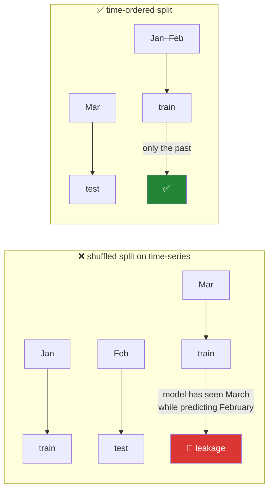

# Day 33 — The `.str` and `.dt` accessors, and resampling

**Phase 4 · Module 4** · IDs: **PD-11** (working with text data), **PD-12** (date, time, timedelta)

> **Yesterday:** merge, join, and the wide/long reshape.
> **Today:** the two accessors that turn a column of text or timestamps into something you can
> compute with — and the time-series operations where the leakage rule gets sharpest teeth.
> **Tomorrow:** categoricals and `describe()` as a data-quality report.

```bash
./m start 33 && ./m scaffold 33
```

**Time:** 110 minutes. **Request budget:** 0 model calls.

---

## §1 The story

A pandas Series of strings has no `.upper()`. Neither does a Series of timestamps have `.year`. They
would collide with the hundred methods a Series already has, so pandas puts them behind
**accessors** — namespaces you reach through:

```python
frame["title"].str.lower()
frame["published"].dt.year
```

`.str` and `.dt` are the two you will use constantly. There is a third, `.cat`, which is tomorrow.

Two things make today matter more than "here are some string methods".

**First, pandas 3.0 made `.str` fast.** Text columns are now Arrow-backed `str` rather than boxed
Python objects (Day 26), so `.str.contains(...)` runs a vectorised Arrow kernel over contiguous
memory instead of a per-object Python loop. The same code you would have written in 2024 is now
several times quicker, and it hands off to Polars and DuckDB without a copy — which is Day 35's
whole argument.

**Second, time is where leakage hides.** Every other feature you build leaks by mixing rows. Time
features leak by mixing *moments*:



A rolling mean that includes the current row, a `resample` that looks forward, a random split on
dated data — all three are the same mistake, and all three produce a model that scores beautifully
and fails in production. Day 89's stock-price case study and Day 97's `TimeSeriesSplit` are where
this is treated in full; today you build the primitives so they are already correct.

---

## §2 Setup — run this

```bash
mkdir -p days/day-33/lab
touch days/day-33/lab/accessors.py
```

`src/setu/frames.py` and `tests/test_frames.py` grow today. No new packages.

---

## §3 PD-11 — the `.str` accessor

`days/day-33/lab/accessors.py`:

```python
"""PD-11 / PD-12: the .str and .dt accessors, and time-aware aggregation."""

from __future__ import annotations

import time

import numpy as np
import pandas as pd


def papers() -> pd.DataFrame:
    return pd.DataFrame(
        {
            "title": ["  Attention Is All You Need ", "BERT: pre-training", None, "GPT-3"],
            "venue": ["NeurIPS 2017", "NAACL 2019", "ICML 2020", "NeurIPS 2020"],
            "published": ["2017-06-12", "2019-06-02", "2020-07-13", "2020-05-28"],
        }
    )


def the_accessor_exists_because() -> None:
    titles = papers()["title"]
    try:
        titles.lower()
    except AttributeError as exc:
        print(f"\n  {exc}")
        print("  ^ Series has no .lower(); it would collide. Hence the .str namespace.")
    print(f"{titles.str.lower().tolist()=}")


def string_basics() -> None:
    frame = papers()
    title = frame["title"]

    print(f"\n{title.dtype=}   <- str, Arrow-backed (pandas 3.0)")
    print(f"{title.str.strip().tolist()=}")
    print(f"{title.str.len().tolist()=}     <- NaN stays NaN, not 0")
    print(f"{title.str.contains('BERT', na=False).tolist()=}")
    print(f"{title.str.startswith('GPT', na=False).tolist()=}")

    print(f"\n{title.str.contains('BERT').tolist()=}   <- WITHOUT na=: <NA> propagates")
    print("  ^ and then boolean indexing raises. Always pass na= on a predicate.")

    print(f"\n{frame['venue'].str.split(' ').tolist()=}")
    print(f"{frame['venue'].str.split(' ', expand=True).shape=}   <- expand gives COLUMNS")
    print(f"{frame['venue'].str.split(' ', n=1).str[0].tolist()=}   <- .str[0] indexes each list")


def extraction() -> None:
    venue = papers()["venue"]

    extracted = venue.str.extract(r"^(?P<name>\D+)\s+(?P<year>\d{4})$")
    print(f"\n{extracted.to_dict('list')=}")
    print(f"{extracted.dtypes.to_dict()=}   <- extract returns STRINGS; cast yourself")

    print(f"\n{venue.str.replace(r'\s+\d{4}$', '', regex=True).tolist()=}")
    print(f"{venue.str.replace('NeurIPS', 'NIPS', regex=False).tolist()=}")
    print("  ^ regex= is explicit in pandas 3.0. State which you meant.")

    print(f"\n{venue.str.findall(r'\d').tolist()=}")
    print(f"{venue.str.count('e')=}".replace("\n", " "))


def why_it_is_fast_now() -> None:
    rng = np.random.default_rng(0)
    words = pd.Series(rng.choice(["alpha", "beta", "gamma", "delta"], size=500_000))

    arrow = words.astype("str")
    boxed = words.astype("object")

    start = time.perf_counter()
    arrow.str.upper()
    arrow_time = time.perf_counter() - start

    start = time.perf_counter()
    boxed.str.upper()
    boxed_time = time.perf_counter() - start

    print(f"\n.str.upper() on {len(words):,} values")
    print(f"  str dtype (Arrow) : {arrow_time:.4f}s")
    print(f"  object dtype      : {boxed_time:.4f}s")
    print(f"  ~{boxed_time / arrow_time:.1f}x")
    print(f"\n  memory: {arrow.memory_usage(deep=True):,} vs {boxed.memory_usage(deep=True):,} bytes")
    print("  ^ this is the pandas 3.0 dividend. You get it by doing nothing.")


def the_apply_temptation() -> None:
    titles = pd.Series(["a b", "c d"] * 100_000)

    start = time.perf_counter()
    titles.apply(lambda s: s.upper())
    slow = time.perf_counter() - start

    start = time.perf_counter()
    titles.str.upper()
    fast = time.perf_counter() - start

    print(f"\n.apply(lambda): {slow:.4f}s")
    print(f".str.upper():   {fast:.4f}s   ~{slow / fast:.1f}x")
    print("  Day 29's rule, restated: if there is an accessor method, use it.")
```

**Line by line:**

- `titles.lower()` raises `AttributeError` — **this is why accessors exist.** A Series already has a
  hundred methods; adding every string method would collide (`Series.count` and `str.count` mean
  different things). The namespace keeps them apart.
- `title.str.len()` returns `<NA>` for the missing row, not `0`. **Every `.str` method propagates
  missing values** rather than treating them as empty strings — which is correct and occasionally
  surprising.
- `title.str.contains('BERT')` **without `na=`** returns `<NA>` for the missing row, and a boolean
  mask containing `<NA>` raises when you index with it. `na=False` says "treat missing as not
  matching". **Always pass `na=` on a predicate.** This single argument accounts for a large share of
  "why does my filter raise" questions.
- `.str.split(' ', expand=True)` — returns a **DataFrame** of columns instead of a Series of lists.
  The `expand` argument is how you split one column into several in one step.
- `.str[0]` — indexes into each element. Works on a Series of lists (from `split`) and on a Series of
  strings (first character). Compact, and worth recognising.
- `str.extract(r"...")` with **named groups** — returns a DataFrame with the group names as columns.
  This is the workhorse for pulling structure out of semi-structured text, and Day 229's Reader agent
  uses exactly this shape. Note it returns **strings**: cast the year yourself.
- `regex=False` versus `regex=True` — pandas 3.0 wants this stated. A literal replacement of `"a.b"`
  behaves very differently under the two, and being explicit removes a class of silent bug.
- `why_it_is_fast_now` — **run this and record the ratio.** The Arrow-backed `str` dtype is typically
  several times faster and uses substantially less memory than `object`. You did nothing to earn it;
  it arrived with pandas 3.0 (Day 26).
- `the_apply_temptation` — `.apply(lambda s: s.upper())` is a Python-level loop. `.str.upper()` is an
  Arrow kernel. Day 29 established the ladder; today it applies to text.

---

## §4 PD-12 — the `.dt` accessor and time

Add to the same file:

```python
def parsing_and_resolution() -> None:
    frame = papers()
    frame["published"] = pd.to_datetime(frame["published"])
    print(f"\n{frame['published'].dtype=}   <- MICROSECONDS in pandas 3.0, not nanoseconds")

    old = pd.to_datetime(pd.Series(["1500-01-01"]))
    print(f"{old.iloc[0]=}   <- would have overflowed under nanosecond resolution")

    print(f"\n{pd.to_datetime(pd.Series(['12/06/2017']), dayfirst=True).iloc[0]=}")
    print(f"{pd.to_datetime(pd.Series(['12/06/2017']), dayfirst=False).iloc[0]=}")
    print("  ^ ambiguous formats: state dayfirst=, or pass format= explicitly")

    messy = pd.to_datetime(pd.Series(["2017-06-12", "not a date"]), errors="coerce")
    print(f"\n{messy.tolist()=}   <- errors='coerce' gives NaT, not an exception")
    print(f"{messy.isna().sum()=}   <- COUNT the coercions; never coerce silently")


def dt_components() -> None:
    dates = pd.to_datetime(papers()["published"])
    print(f"\n{dates.dt.year.tolist()=}")
    print(f"{dates.dt.month.tolist()=} {dates.dt.day.tolist()=}")
    print(f"{dates.dt.day_name().tolist()=}")
    print(f"{dates.dt.quarter.tolist()=} {dates.dt.dayofweek.tolist()=}")
    print(f"{dates.dt.is_month_end.tolist()=}")
    print(f"{dates.dt.to_period('M').astype(str).tolist()=}   <- Period: a SPAN, not an instant")


def timedeltas() -> None:
    dates = pd.to_datetime(papers()["published"])
    gaps = dates.diff()
    print(f"\n{gaps.dt.days.tolist()=}   <- first is NaN: nothing before it")
    print(f"{(dates.max() - dates.min())=}")
    print(f"{(dates + pd.Timedelta(days=30)).dt.date.tolist()=}")
    print(f"{(dates + pd.DateOffset(months=1)).dt.date.tolist()=}   <- calendar-aware")
    print("  ^ Timedelta is a fixed duration; DateOffset respects month lengths.")


def timezones() -> None:
    naive = pd.to_datetime(pd.Series(["2017-06-12 09:00"]))
    aware = naive.dt.tz_localize("Asia/Kolkata")
    print(f"\n{naive.iloc[0]=}")
    print(f"{aware.iloc[0]=}")
    print(f"{aware.dt.tz_convert('UTC').iloc[0]=}")
    try:
        naive.iloc[0] < aware.iloc[0]
    except TypeError as exc:
        print(f"  comparing naive with aware: {exc}")
    print("  Rule: store UTC, localise only for display.")


def resampling() -> None:
    rng = np.random.default_rng(0)
    index = pd.date_range("2020-01-01", periods=180, freq="D")
    series = pd.Series(rng.normal(100, 10, size=180).cumsum(), index=index)

    print(f"\n{series.resample('ME').mean().head(3).round(1).to_dict()=}")
    print(f"{series.resample('W').agg(['mean', 'max']).shape=}")
    print("  ^ resample is groupby for a DatetimeIndex. ME = month end, W = week.")

    hourly = series.resample("12h").asfreq()
    print(f"\n{hourly.isna().sum()=} of {len(hourly)} are NaN   <- upsampling CREATES gaps")
    print(f"{hourly.ffill().isna().sum()=}   <- ffill carries the last known value FORWARD")
    print("  NEVER bfill a time series for modelling: it carries the future backwards.")


def rolling_and_the_leak() -> None:
    values = pd.Series([1.0, 2.0, 3.0, 4.0, 5.0])

    leaky = values.rolling(3, center=True).mean()
    causal = values.rolling(3).mean()
    lagged = values.rolling(3).mean().shift(1)

    print(f"\n{values.tolist()=}")
    print(f"{leaky.tolist()=}   <- center=True: row 1 uses rows 0,1,2 - it SEES THE FUTURE")
    print(f"{causal.tolist()=}   <- trailing window: uses the current row and before")
    print(f"{lagged.tolist()=}   <- shift(1): strictly the PAST. Safe as a feature.")

    print("\n  For a feature predicting row i, only rows < i may contribute.")
    print("  rolling().shift(1) is the safe shape. center=True never is.")
    print("  Day 97's TimeSeriesSplit enforces the same rule at the split level.")


if __name__ == "__main__":
    the_accessor_exists_because()
    string_basics()
    extraction()
    why_it_is_fast_now()
    the_apply_temptation()
    parsing_and_resolution()
    dt_components()
    timedeltas()
    timezones()
    resampling()
    rolling_and_the_leak()
```

**Line by line:**

- `dtype` shows **microsecond** resolution — the pandas 3.0 change from Day 26 §5. It is why
  `1500-01-01` parses instead of raising an out-of-bounds error.
- `dayfirst=True` — `12/06/2017` is either 12 June or 6 December. pandas guesses, and guesses
  differently depending on the rest of the column. **Pass `format=` when you know it**; parsing is
  also dramatically faster with an explicit format.
- `errors="coerce"` — unparseable values become `NaT` (Not a Time) instead of raising. Useful, and
  dangerous if unmeasured: **always count the coercions.** Silently turning 40% of a column into
  `NaT` is a real incident.
- `.dt.to_period('M')` — a `Period` is a **span** (June 2017), not an instant. Grouping by month is
  cleaner with periods than with truncated timestamps.
- `.diff()` gives a `Timedelta` Series; `.dt.days` extracts the number. The first value is `NaN`
  because there is nothing before it — the same "no previous row" shape as `shift`.
- `pd.Timedelta(days=30)` versus `pd.DateOffset(months=1)` — a fixed duration versus a calendar-aware
  one. Adding "one month" to 31 January is a calendar question, not an arithmetic one.
- `tz_localize` attaches a timezone to a naive timestamp; `tz_convert` moves an aware one. **Comparing
  naive with aware raises.** The rule that avoids all of it: store UTC, localise for display only.
- `resample('ME')` — `groupby` for a `DatetimeIndex`. Note the modern frequency aliases: `ME` (month
  end), `YE`, `h`, `min`. The older `M` and `H` spellings are deprecated — check the docs for your
  pinned version.
- **Upsampling creates gaps.** `ffill` carries the last known value forward, which is legitimate.
  `bfill` carries a *future* value backwards, which for modelling is leakage in one method call.
- `rolling(3, center=True)` — **the leak.** A centred window at row 1 includes row 2. If that value
  becomes a feature for predicting row 1, your model has seen the future. `rolling(3).mean().shift(1)`
  uses strictly earlier rows and is the safe shape. Print all three and read the numbers.

---

## §5 Build brief

Extend `src/setu/frames.py`:

```python
def extract_pattern(
    frame: pd.DataFrame,
    column: str,
    pattern: str,
    *,
    dtypes: dict[str, str] | None = None,
) -> pd.DataFrame:
    """TODO(me): str.extract with named groups, returning a NEW frame with the groups added.

    - raise DataError if `pattern` has no named groups (an unnamed extract is unreadable)
    - raise DataError if a group name collides with an existing column
    - apply `dtypes` to the extracted columns (extract always returns strings)
    - report how many rows failed to match, and raise DataError if ALL of them did
    - must not mutate the caller's frame (ADR-001)
    """
    raise NotImplementedError


def parse_dates_strictly(
    frame: pd.DataFrame,
    columns: list[str],
    *,
    fmt: str | None = None,
    max_coercion: float = 0.0,
) -> pd.DataFrame:
    """TODO(me): parse to datetime with errors='coerce', but REFUSE quiet data loss.

    - raise DataError if the coerced fraction of any column exceeds `max_coercion`
    - the message must name the column, the fraction, and up to 3 example bad values
    - default max_coercion=0.0 means "nothing may fail silently"
    - returns a new frame
    """
    raise NotImplementedError


def add_time_parts(frame: pd.DataFrame, column: str, *, parts: list[str]) -> pd.DataFrame:
    """TODO(me): add {column}_{part} columns for parts like year, month, quarter, dayofweek.

    - raise DataError on an unknown part or a name collision
    - raise DataError if `column` is not a datetime dtype (do NOT silently parse it)
    """
    raise NotImplementedError


def causal_rolling(
    frame: pd.DataFrame,
    column: str,
    *,
    window: int,
    stat: str = "mean",
    by: str | None = None,
) -> pd.Series:
    """TODO(me): a LEAK-FREE rolling statistic: trailing window, then shift(1).

    - the value at row i must use ONLY rows strictly before i
    - `by` groups first (per-venue rolling mean), and must not bleed across groups
    - the first `window` rows of each group are NaN - that is correct, not a bug to fill
    - raise DataError if window < 1, or if the frame is not sorted by its index
    - this function must make the leaky version IMPOSSIBLE to ask for: no center= parameter
    """
    raise NotImplementedError
```

- `parse_dates_strictly` defaulting to `max_coercion=0.0` is the day's design opinion: **silent data
  loss requires an explicit allowance.** If 3% of your dates are junk, you say so in the call.
- `causal_rolling` deliberately offers **no** `center=` parameter. The safest API is one where the
  dangerous thing cannot be expressed. That is Principle 11 applied to a function signature.

---

## §6 The eval that must be able to fail

Add to `tests/test_frames.py`:

```python
def test_extract_adds_named_groups(sample):
    out = extract_pattern(sample, "venue", r"^(?P<venue_name>\D+)\s+(?P<venue_year>\d{4})$",
                          dtypes={"venue_year": "Int64"})
    assert out["venue_name"].str.strip().tolist()[0] == "NeurIPS"
    assert str(out["venue_year"].dtype) == "Int64"


def test_extract_rejects_unnamed_groups(sample):
    with pytest.raises(DataError):
        extract_pattern(sample, "venue", r"(\D+)\s+(\d{4})")


def test_extract_rejects_a_column_collision(sample):
    with pytest.raises(DataError):
        extract_pattern(sample, "venue", r"(?P<venue>\D+)")


def test_extract_does_not_mutate(sample):
    before = sample.copy()
    extract_pattern(sample, "venue", r"(?P<v>\D+)")
    pd.testing.assert_frame_equal(sample, before)


def test_extract_raises_when_nothing_matches(sample):
    with pytest.raises(DataError):
        extract_pattern(sample, "venue", r"(?P<z>ZZZZ\d+)")


def test_parse_dates_refuses_silent_coercion():
    frame = pd.DataFrame({"d": ["2017-06-12", "not a date", "2018-01-01"]})
    with pytest.raises(DataError) as info:
        parse_dates_strictly(frame, ["d"])
    assert "not a date" in str(info.value), "the bad value was not named in the message"


def test_parse_dates_allows_an_explicit_tolerance():
    frame = pd.DataFrame({"d": ["2017-06-12", "junk", "2018-01-01"]})
    out = parse_dates_strictly(frame, ["d"], max_coercion=0.5)
    assert out["d"].isna().sum() == 1
    assert str(out["d"].dtype).startswith("datetime64")


def test_parse_dates_clean_input_passes():
    frame = pd.DataFrame({"d": ["2017-06-12", "2018-01-01"]})
    assert parse_dates_strictly(frame, ["d"])["d"].isna().sum() == 0


def test_time_parts_added(sample_dated):
    out = add_time_parts(sample_dated, "published", parts=["year", "quarter"])
    assert out["published_year"].tolist()[0] == 2017
    assert "published_quarter" in out.columns


def test_time_parts_refuses_a_non_datetime_column():
    frame = pd.DataFrame({"d": ["2017-06-12"]})
    with pytest.raises(DataError):
        add_time_parts(frame, "d", parts=["year"])


def test_time_parts_rejects_an_unknown_part(sample_dated):
    with pytest.raises(DataError):
        add_time_parts(sample_dated, "published", parts=["moon_phase"])


def test_causal_rolling_never_sees_the_current_row():
    frame = pd.DataFrame({"x": [1.0, 2.0, 3.0, 4.0, 5.0]})
    out = causal_rolling(frame, "x", window=2)
    assert out.iloc[2] == pytest.approx(1.5), "row 2 must average rows 0 and 1 only"
    assert pd.isna(out.iloc[0]) and pd.isna(out.iloc[1])


def test_causal_rolling_matches_a_hand_computed_window():
    frame = pd.DataFrame({"x": [10.0, 20.0, 30.0, 40.0]})
    out = causal_rolling(frame, "x", window=3)
    assert pd.isna(out.iloc[2])
    assert out.iloc[3] == pytest.approx(20.0)


def test_causal_rolling_does_not_bleed_across_groups():
    frame = pd.DataFrame({"g": ["a", "a", "b", "b"], "x": [1.0, 2.0, 100.0, 200.0]})
    out = causal_rolling(frame, "x", window=1, by="g")
    assert pd.isna(out.iloc[2]), "group b's first row used group a's data"
    assert out.iloc[3] == pytest.approx(100.0)


def test_causal_rolling_has_no_center_parameter():
    import inspect

    assert "center" not in inspect.signature(causal_rolling).parameters, (
        "a center= parameter makes the leaky version expressible"
    )


def test_causal_rolling_rejects_a_bad_window():
    with pytest.raises(DataError):
        causal_rolling(pd.DataFrame({"x": [1.0]}), "x", window=0)


def test_no_bfill_on_time_columns_in_src():
    """bfill carries the future backwards - never legitimate for a modelling feature."""
    from pathlib import Path

    offenders = [
        f"{p.name}:{i}"
        for p in Path("src/setu").rglob("*.py")
        for i, line in enumerate(p.read_text(encoding="utf-8").splitlines(), 1)
        if (".bfill(" in line or "backfill" in line) and "noqa" not in line
    ]
    assert not offenders, f"backward fill found: {offenders}"
```

**Line by line:**

- `test_extract_raises_when_nothing_matches` — a pattern that matches zero rows returns a column of
  all-`<NA>` and looks like it worked. Raising instead means a broken regex is found in seconds
  rather than in Phase 11.
- `test_parse_dates_refuses_silent_coercion` — asserts the **bad value appears in the message**.
  "3 values failed to parse" sends you looking; "failed on: 'not a date'" ends it.
- `test_causal_rolling_never_sees_the_current_row` — **the day's real assessment.** Row 2's value must
  be 1.5, the mean of rows 0 and 1. A plain `rolling(2).mean()` gives 2.5 (rows 1 and 2) and fails
  here. The difference is one `.shift(1)` and an entire class of overfitted model.
- `test_causal_rolling_does_not_bleed_across_groups` — group `b`'s first row must be `NaN`, not
  informed by group `a`. A `rolling` applied before the `groupby` passes every other test and fails
  this one.
- `test_causal_rolling_has_no_center_parameter` — an **API-shape test**, using `inspect.signature`.
  It asserts a design decision rather than a behaviour: the leaky option is not merely discouraged, it
  is unavailable. Same family as Day 17's layering test.
- `test_no_bfill_on_time_columns_in_src` — the sixth repo-wide guard. `noqa` is permitted, so a
  legitimate use becomes a written decision.

```bash
uv run python -m pytest tests/test_frames.py -v
```

---

## §7 Request budget

| Resource | Spent today |
|---|---|
| LLM calls | **0** |

---

## §8 Traps

- **`.str.contains()` without `na=`.** `<NA>` propagates and boolean indexing then raises.
- **Expecting `.str.len()` to give 0 for missing.** It gives `<NA>`.
- **`.apply(lambda s: ...)` for string work.** There is an accessor method; it is far faster.
- **`str.extract` without named groups.** Unreadable columns, and it returns strings regardless.
- **Forgetting `regex=` on `replace`.** Different behaviour, no warning.
- **Ambiguous date formats.** Pass `format=` or `dayfirst=`; it is also much faster.
- **`errors="coerce"` without counting the coercions.** Silent data loss.
- **Mixing naive and aware timestamps.** Comparison raises. Store UTC.
- **`bfill` on a time series.** Carries the future backwards. Leakage in one call.
- **`rolling(center=True)` as a feature.** Sees the future.
- **`rolling` before `groupby`.** Windows bleed across groups.
- **Filling the leading NaNs of a rolling feature.** They are correct: there is no history yet.

---

## §9 Verify before you code

Written **2026-08-21**:

- <https://pandas.pydata.org/docs/user_guide/text.html> — the `.str` surface on the new `str` dtype.
- <https://pandas.pydata.org/docs/user_guide/timeseries.html> — and check the current **frequency
  aliases**; `M`/`H` were deprecated in favour of `ME`/`h`.
- <https://pandas.pydata.org/docs/reference/api/pandas.to_datetime.html> — `format`, `dayfirst`, `errors`.
- <https://pandas.pydata.org/docs/user_guide/window.html> — `rolling`, `closed`, and what `center` does.

---

## §10 Say it in an interview

> "The two accessors do most of the work — and in pandas 3.0 `.str` got substantially faster for free,
> because text is Arrow-backed now rather than boxed Python objects. The detail I'd flag on `.str` is
> that predicates propagate missing values, so `contains` without `na=False` gives you a mask
> containing `<NA>` that raises when you index with it. On the time side, my rolling-feature helper
> deliberately has no `center` parameter and always applies `shift(1)`, so the value at a row can only
> come from strictly earlier rows. There's a test asserting the parameter doesn't exist — because a
> centred rolling mean as a feature is leakage that produces a model with a beautiful validation score
> and no predictive power, and the safest API is one where you can't ask for the dangerous thing."

---

## §11 Done when

Tick [`CHECKLIST.md`](CHECKLIST.md), then `./m check && ./m done 33`.
