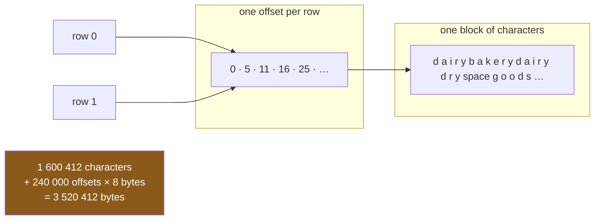

# 1.1 — The same short word, over and over

## One-line answer

A column that holds a handful of short words repeated many times is storing the **same characters
again and again**, once per row, and the cost of that is a number you can measure rather than guess.

---

## The story

The flat has kept its shopping list for a year.

It started as four lines on the back of an envelope — milk, bread, eggs, rice — with a note next to
each one saying which part of the shop it comes from. Milk is dairy. Bread is bakery. Rice is dry
goods. Somebody typed it up, and then kept typing it up, week after week, and now there is a file with
a couple of hundred thousand lines in it.

Somebody opens the file to add up the year's spending, and their laptop takes a noticeable moment to
do it. That is odd. The numbers are only prices, and there are not that many.

So they look at the file. Four columns. One of them is the item. One is the price. One is the part of
the shop. One is the pack size — small, medium, large.

And then the thing that is obvious once you have seen it: **the shop-part column contains three
different words.** Only three. "dairy", "bakery", "dry goods". Written out, in full, two hundred and
forty thousand times.

Nobody would do that on paper. On paper you would write the three words down once at the top and put a
tick in a column. The file writes out "dry goods" — nine letters — eighty thousand separate times,
because nothing ever told it not to.

---

## The idea in plain language

A column in pandas holds one value per row, and it holds them as **actual data**, not as a note saying
where to look. If eighty thousand rows say "dry goods", then the letters d, r, y, space, g, o, o, d, s
are physically present in memory eighty thousand times over.

Two words need defining here, and both matter for the rest of the day.

**Memory** is the working space a program has while it runs — the place a table lives once it has been
read off disk. It is finite, it is much smaller than a disk, and when a program runs out of it the
operating system starts moving pages to disk, at which point everything gets slow in a way that has
nothing to do with your arithmetic.

**Cardinality** is the number of *different* values a column contains, as opposed to the number of
rows. A column of two hundred and forty thousand rows holding only "dairy", "bakery" and "dry goods"
has two hundred and forty thousand rows and a cardinality of three. That gap — many rows, few distinct
values — is the whole subject of this section, and it has a name because it comes up constantly. Real
tables are full of columns like this: a country, a status, a payment method, a department, a sensor
identifier, a day of the week.

pandas 3.0 stores text well. A text column has the `str` dtype, backed by PyArrow, which lays every
value's characters end to end in one block and keeps a second array recording where each value starts
([Day 26, 2.2](../../../day-26-frames-and-copy-on-write/parts/02-the-str-dtype/2.2-str-the-dtype-pandas-3-infers.md)).
That is a great deal better than the `object` dtype pandas 2 used, which stored one pointer per row and
one separate Python string object behind each pointer
([Day 26, 2.1](../../../day-26-frames-and-copy-on-write/parts/02-the-str-dtype/2.1-text-used-to-be-object.md)).

But "stores text well" is not the same as "notices the text is the same text". The Arrow layout is
still writing "dry goods" out once per row. It is compact, and it is repetitive, and those are separate
properties.

**This part does not fix anything.** It measures the problem honestly, so that the fix in
[2.2](../02-the-category-dtype/2.2-astype-category-and-the-saving-measured.md) is a number you watched
change rather than a claim you were asked to believe. The tool for the measurement is
`memory_usage`, and [1.2](1.2-what-memory-usage-actually-counts.md) is about what it does and does not
count.

---

## Why Setu needs it

- **[1.2](1.2-what-memory-usage-actually-counts.md), next**, is the measuring instrument. This part is
  the thing being measured.
- **[2.2](../02-the-category-dtype/2.2-astype-category-and-the-saving-measured.md)** converts this
  column and prints the same numbers again. Without a before, there is no after.
- **[2.3](../02-the-category-dtype/2.3-the-code-width-and-where-the-saving-stops.md)** is the honest
  half: the same conversion applied to a column where every value is different makes things *worse*.
  Cardinality is what tells the two cases apart, which is why it is defined here.
- **Day 35**'s comparison of pandas against another dataframe library is a comparison of memory
  layouts, and a column whose layout you have already measured is the one you can reason about.
- **Day 162**'s document store keeps a `source` column naming which corpus each chunk came from. There
  are perhaps a dozen sources and millions of chunks. It is this column, at a scale where the
  difference is the difference between fitting in memory and not.

---

## The mechanism

Start where the story starts — the four lines on the envelope.

```python
import pandas as pd

shop = pd.DataFrame(
    {
        "item": pd.Series(["milk", "bread", "eggs", "rice"], dtype="str"),
        "aisle": pd.Series(["dairy", "bakery", "dairy", "dry goods"], dtype="str"),
        "size": pd.Series(["large", "small", "medium", "large"], dtype="str"),
        "price": [1.15, 1.40, 2.60, 3.05],
        "need": [2, 1, 1, 1],
    }
)
print(shop)
print()
print(shop["aisle"].memory_usage(deep=True), "bytes for four aisles")
print(shop["aisle"].nunique(), "distinct out of", len(shop))
```

**Line by line:**

- `dtype="str"` written out on each text column. pandas 3.0 would infer `str` anyway, but stating it is
  the pin (Principle 4): a frame built on a machine without PyArrow installed would infer a `str` dtype
  with slower storage behind it, and a stated dtype is the line that makes a bug report reproducible
  ([Day 26, 2.3](../../../day-26-frames-and-copy-on-write/parts/02-the-str-dtype/2.3-the-storage-behind-it.md)).
- `aisle` holds `dairy` twice. **Four rows, three distinct words** — the pattern the whole day is about,
  small enough to see at a glance.
- `price` and `need` get no `dtype=`, because numbers infer to `float64` and `int64` and there is no
  storage question hiding behind them
  ([Day 26, 1.4](../../../day-26-frames-and-copy-on-write/parts/01-the-two-objects/1.4-one-dtype-per-column.md)).
- `memory_usage(deep=True)` — the bytes this column occupies. `deep=True` is the argument that says
  *follow anything the column points at rather than counting the pointer*, and
  [1.2](1.2-what-memory-usage-actually-counts.md) is entirely about when that matters.
- `nunique()` — the cardinality. It counts distinct values and skips blanks by default.

```text
    item      aisle    size  price  need
0   milk      dairy   large   1.15     2
1  bread     bakery   small   1.40     1
2   eggs      dairy  medium   2.60     1
3   rice  dry goods   large   3.05     1

189 bytes for four aisles
3 distinct out of 4
```

189 bytes is nothing. Four rows never cost anything, and that is exactly why this problem is invisible
while you are developing and expensive once the file is real.

Now the same four rows, a year's worth of them:

```python
import numpy as np
import pandas as pd

ITEMS = ["milk", "bread", "eggs", "rice"]
AISLES = ["bakery", "dairy", "dry goods"]
SIZES = ["small", "medium", "large"]


def a_year(n: int = 240_000) -> pd.DataFrame:
    """A year of the flat's shopping: the same few words, over and over."""
    rng = np.random.default_rng(34)
    return pd.DataFrame(
        {
            "item": pd.Series(rng.choice(ITEMS, n), dtype="str"),
            "aisle": pd.Series(rng.choice(AISLES, n), dtype="str"),
            "size": pd.Series(rng.choice(SIZES, n), dtype="str"),
            "price": np.round(rng.uniform(0.40, 6.00, n), 2),
        }
    )


year = a_year()
print(year.head(4))
print()
print("rows           :", len(year))
print("distinct aisles:", year["aisle"].nunique())
print("aisle bytes    :", year.memory_usage(deep=True)["aisle"])
print("bytes per row  :", year.memory_usage(deep=True)["aisle"] / len(year))
```

**Line by line:**

- `ITEMS`, `AISLES`, `SIZES` as module-level constants, sorted, written once. Every part of this day
  reuses them, and a category list that is defined in one place is the thing
  [3.2](../03-order/3.2-categoricaldtype-the-order-written-down.md) turns into a dtype.
- `np.random.default_rng(34)` — the day number as the seed. The generator object rather than the old
  global `np.random` functions, so the numbers here are reproducible on your machine
  ([Day 20, 4.2](../../../day-20-arrays-and-dtypes/parts/04-random/4.2-the-seed-is-part-of-the-result.md)).
  **The draws happen in the order the columns are written**, so moving one column up changes every
  column after it. That is why `a_year` is a function with a fixed body rather than four loose lines.
- `rng.choice(AISLES, n)` — `n` picks from three words. This is what "the same short word over and over"
  looks like in code.
- `np.round(..., 2)` on the price, because a price with fifteen decimal places is not a price, and
  rounding at the point of creation beats rounding at the point of printing
  ([Day 20, 2.3](../../../day-20-arrays-and-dtypes/parts/02-dtypes/2.3-floats-nan-and-precision.md)).
- `n: int = 240_000` — a couple of hundred thousand rows. Big enough that the bytes are real, small
  enough that the whole day runs on a laptop with nothing else closed.
- `year.memory_usage(deep=True)["aisle"]` — the frame's per-column report, indexed by column name.
  Asking the frame rather than the Series matters by exactly 132 bytes, and
  [1.2](1.2-what-memory-usage-actually-counts.md) says why.

```text
   item      aisle    size  price
0  milk  dry goods  medium   2.75
1  milk      dairy   small   1.86
2  milk      dairy   large   5.96
3  rice     bakery   small   4.94

rows           : 240000
distinct aisles: 3
aisle bytes    : 3520412
bytes per row  : 14.668383333333333

```

**Three words. Three and a half million bytes.** About fourteen and a half bytes per row, to record one
of three possibilities — a thing that needs two bits.

Where does 3 520 412 come from? It is not mysterious, and pulling it apart is the point of the exercise:

```python
aisle = a_year()["aisle"]
characters = int(aisle.str.len().sum())
print("characters in the column :", characters)
print("bytes reported           :", a_year().memory_usage(deep=True)["aisle"])
print("difference               :", a_year().memory_usage(deep=True)["aisle"] - characters)
print("rows x 8                 :", len(aisle) * 8)
```

**Line by line:**

- `aisle.str.len()` — the length of each value, as a column of integers. `.str` is the text accessor;
  it applies a string operation to every element without a Python loop
  ([Day 29, 2.1](../../../day-29-iteration-and-order/parts/02-vectorised/2.1-one-operation-every-row.md)).
- `.sum()` then adds them, giving **the total number of characters actually stored**.
- The subtraction is the whole point: whatever is left over after the characters is the bookkeeping.
- `len(aisle) * 8` is the guess being tested — one eight-byte number per row.

```text
characters in the column : 1600412
bytes reported           : 3520412
difference               : 1920000
rows x 8                 : 1920000
```

**The difference is exactly eight bytes a row.** That is the offsets array: for each value, a number
saying where its characters start in the block. The Arrow layout is characters plus offsets, and
nothing else — no per-row Python object, no pointer chasing.



**The layout is efficient and the data is repetitive**, and those are two different facts. Arrow is
doing its job perfectly; it is being asked to store nine letters eighty thousand times, and it does.

---

## When it breaks

The measurement that says nothing, because it was taken on the fixture:

```text
$ uv run python -c "
import pandas as pd
for label, vals in [
    ('aisle  ', ['dairy', 'bakery', 'dairy', 'dry goods']),
    ('item   ', ['milk', 'bread', 'eggs', 'rice']),
    ('size   ', ['large', 'small', 'medium', 'large']),
]:
    s = pd.Series(vals, dtype='str')
    c = s.astype('category')
    saving = s.memory_usage(deep=True) - c.memory_usage(deep=True)
    print(f'{label} str {s.memory_usage(deep=True):4d}  category {c.memory_usage(deep=True):4d}  saving {saving:4d}')
"
```

```text
aisle   str  189  category  181  saving    8
item    str  181  category  186  saving   -5
size    str  185  category  177  saving    8
```

**What it means.** On four rows the fix this whole day is about saves eight bytes on two columns and
**costs five on the third**. A developer who tested it here would conclude, correctly and uselessly,
that it does not work.

Nothing raised. Every number is right. They are right about four rows, which is not the question
anybody was asking — and `item` loses because all four of its values are distinct, so the category has
to store the words *and* a code for every row. This is the same trap Day 29 met with timings: a
benchmark run on a fixture-sized frame measures the fixture
([Day 29, 3.1](../../../day-29-iteration-and-order/parts/03-the-measurement/3.1-what-a-million-rows-is-for.md)).
The fix is the same too — **measure at a size where the answer could matter** — and
[2.3](../02-the-category-dtype/2.3-the-code-width-and-where-the-saving-stops.md) shows that the `item`
result here is not just noise; it is a real effect that survives at scale when every value is different.

The other way this measurement goes wrong is asking the wrong object:

```text
$ uv run python -c "
import numpy as np
import pandas as pd
rng = np.random.default_rng(34)
year = pd.DataFrame({'aisle': pd.Series(rng.choice(['bakery','dairy','dry goods'], 240_000), dtype='str')})
print('the whole frame  :', year.memory_usage(deep=True))
print()
print('sum of the frame :', year.memory_usage(deep=True).sum())
print('just the column  :', year['aisle'].memory_usage(deep=True))
"
```

```text
the whole frame  : Index        132
aisle    3520340
dtype: int64

sum of the frame : 3520472
just the column  : 3520472
```

**What it means.** `frame.memory_usage(deep=True)` returns **a Series with one row per column plus a
row for the index**, not a single number. Printing it without summing gives a table, and a script that
expects a number and gets a Series will fail somewhere later with a message about alignment rather than
about memory.

The `Index` row is why the frame's `aisle` figure and the Series' figure differ by 132 bytes: the
Series carries the index with it, the frame reports it separately. Neither is wrong; they are answers
to slightly different questions, and [1.2](1.2-what-memory-usage-actually-counts.md) is where that gets
pinned down. Note also that this one-column frame's `aisle` figure is not the `a_year()` figure above:
the random generator is being asked for different draws in a different order, so the words land
differently and the character count moves. **The seed pins the numbers only when the code around it is
identical** ([Day 20,
4.2](../../../day-20-arrays-and-dtypes/parts/04-random/4.2-the-seed-is-part-of-the-result.md)).

---

## In production

**What a professional writes instead of the teaching version.** Not `print`. A memory measurement that
matters gets recorded next to the thing it describes, in a function that can be called on any frame:

```python
import pandas as pd


def repeated_text_columns(frame: pd.DataFrame, *, ratio: float = 0.5) -> pd.DataFrame:
    """Text columns whose distinct-value count is a small fraction of their row count."""
    rows = len(frame)
    if rows == 0:
        return pd.DataFrame(columns=["column", "rows", "distinct", "ratio", "bytes"])
    found = []
    for name in frame.columns:
        column = frame[name]
        if not isinstance(column.dtype, pd.StringDtype):
            continue
        distinct = int(column.nunique(dropna=True))
        if distinct / rows <= ratio:
            found.append(
                {
                    "column": name,
                    "rows": rows,
                    "distinct": distinct,
                    "ratio": round(distinct / rows, 6),
                    "bytes": int(frame.memory_usage(deep=True)[name]),
                }
            )
    return pd.DataFrame(found)
```

**Line by line:**

- `isinstance(column.dtype, pd.StringDtype)` rather than `column.dtype == "object"`. In pandas 3.0 text
  infers to `str`, so the old test finds nothing at all
  ([Day 26, 2.4](../../../day-26-frames-and-copy-on-write/parts/02-the-str-dtype/2.4-dtypes-equals-object-finds-nothing.md)).
  An `isinstance` check against the dtype class survives both the PyArrow and the Python storage
  ([Day 26, 2.3](../../../day-26-frames-and-copy-on-write/parts/02-the-str-dtype/2.3-the-storage-behind-it.md)).
- `ratio: float = 0.5` as a **keyword-only** argument, after the `*`. It is a threshold, and a threshold
  passed positionally is a number nobody can read at the call site.
- `nunique(dropna=True)` stated rather than left to the default, because "is a blank a distinct value?"
  is a real question with a real answer and the code should say which one it picked.
- The early return on an empty frame, with the columns spelled out. A caller that unconditionally does
  `result["ratio"].max()` should get an empty frame with the right shape, not a `KeyError`.
- `int(...)` around `nunique` and the byte count, because NumPy integers leak into JSON serialisation
  and logs in ways that are annoying to debug later.
- It returns a **frame of findings**, not a printed report. That is the same shape
  [7.1](../07-the-module/7.1-the-audit-module.md) uses for the day's module, and it is why the result
  can be asserted on in a test.

**What changes at scale.** `nunique()` is a full pass over the column, and on a very wide frame — a few
hundred columns — running it on every text column is not free. The professional version samples: take
the first fifty thousand rows, count distinct values there, and only do the full count on the columns
that look promising. A sampled cardinality can be wrong in one direction only, which is the direction
that matters: a column that looks low-cardinality in a sample might not be, so the full count is still
the thing that decides.

**The failure that only shows with real data.** A pipeline read a hundred million rows of event data,
of which one column was a status with six possible values. Nobody looked at it, because the pipeline
worked. Then the input grew, the job started swapping to disk, and its running time went from a few
seconds to most of an hour with no code change at all. The column was three gigabytes of the word
`completed`. That is the plan's named example for `PD-13` — *8 GB down to 300 MB on one column* — and it
is not an exaggeration, it is arithmetic:
[2.2](../02-the-category-dtype/2.2-astype-category-and-the-saving-measured.md) does it.

**The review comment a senior engineer leaves.** *"This frame is read from Parquet and immediately
grouped. Before you merge, print `df.memory_usage(deep=True)` and `df.nunique()` side by side — I
suspect three of those text columns have fewer than ten distinct values, and if so they should be
converted at read time rather than after."*

**The interview question.** *"How much memory does a text column take in pandas?"* The honest answer
starts with a question of its own: which dtype, and how repetitive is it? In pandas 3.0 a `str` column
backed by PyArrow costs the characters plus eight bytes an offset per row, so a column of nine-letter
words is about seventeen bytes a row. The same data as `object` costs a pointer per row plus a whole
Python string object behind each pointer, which is several times more. And **neither layout notices
that the values repeat** — that is a third thing, and it is what the categorical dtype is for. The
number that decides is distinct values over rows.

---

## Check yourself

```bash
uv run python -c "
import numpy as np
import pandas as pd
rng = np.random.default_rng(34)
n = 240_000
few = pd.Series(rng.choice(['bakery', 'dairy', 'dry goods'], n), dtype='str')
many = pd.Series([f'receipt-{i:07d}' for i in range(n)], dtype='str')
for name, s in [('three words', few), ('all different', many)]:
    print(f'{name:14s} rows {len(s):7d}  distinct {s.nunique():7d}  bytes {s.memory_usage(deep=True):9d}')
"
```

Two columns, the same number of rows, and byte counts within a factor of two of each other. Say which
one is wasting space and which one is not, and say what number in the printout tells you.

**Answer out loud, without scrolling up:**

> A column has two hundred and forty thousand rows and three distinct values. Say roughly how many
> bytes it takes and where they go, then say why the fact that only three values exist does not reduce
> that number at all.

---

**Next:** [1.2 — What `memory_usage` actually counts](1.2-what-memory-usage-actually-counts.md).
