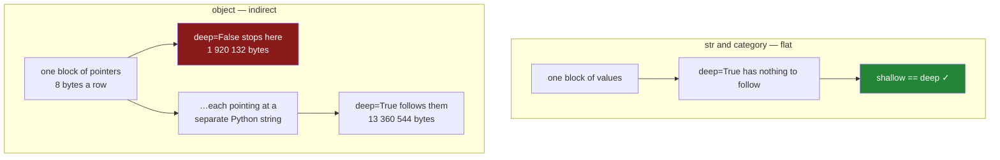

# 1.2 — What `memory_usage` actually counts

## One-line answer

`memory_usage` reports the bytes pandas can see, and `deep=True` is the flag that makes it follow
anything the column merely points at — which used to change the answer by a factor of seven and, in
pandas 3.0, changes nothing at all for a `str` column.

---

## The story

Somebody in the flat is packing to move.

They go round with a notepad and write down what each box weighs. Books, four kilos. Plates, three
kilos. Coats, two kilos. They add it up, get thirty-one kilos, and book the smallest van.

On the day, the van will not take it. The thing they weighed was the boxes. What they forgot is that
three of those boxes are not really boxes — they are boxes of keys, and each key opens a cupboard
somewhere else in the flat that also has to come. The notepad said "keys: 200 grams", which was true,
and completely the wrong number.

The person who packed the books did not have this problem. A box of books is a box of books. What is
in the box is the whole of what is in the box.

---

## The idea in plain language

The same distinction exists inside a table, and it has a name.

A column is either **flat** or **indirect**.

A flat column is one block of memory with the values in it, end to end. A column of a quarter of a
million prices is a quarter of a million eight-byte numbers laid out in a row, and its size is
multiplication. Nothing points anywhere.

An indirect column is a block of *addresses*. Each entry says "the value is over there", and the value
itself lives somewhere else. The block of addresses is small. The things it points at are not, and they
are not next to each other either.

pandas has a method that reports a column's size, `memory_usage`, and it takes an argument called
`deep`. With `deep=False` — which is the **default** — it measures the box. With `deep=True` it follows
every address and measures what is on the other end too.

For a flat column the two answers are the same, because there is nothing to follow.

For the old `object` dtype, which pandas 2 used for text
([Day 26, 2.1](../../../day-26-frames-and-copy-on-write/parts/02-the-str-dtype/2.1-text-used-to-be-object.md)),
the two answers differ enormously — the shallow one counts eight bytes a row for the pointer and misses
the entire string sitting behind it.

And in pandas 3.0 the interesting case is the new one. Text infers to `str`, backed by PyArrow, which
is **flat**: the characters are in one block and the offsets are in another
([Day 26, 2.2](../../../day-26-frames-and-copy-on-write/parts/02-the-str-dtype/2.2-str-the-dtype-pandas-3-infers.md)).
So `deep=True` on a modern text column changes nothing. The flag has not stopped being important; the
dtype it was important for has stopped being the default.

**Write `deep=True` anyway.** Two reasons, and neither is superstition. First, `object` columns still
turn up — from `read_json`, from a column of lists, from `.str` operations, from a library that
constructs frames the old way — and a script that measures memory needs to be right about those.
Second, the default is the one that lies, and a number that is silently an underestimate is worse than
no number.

One more thing this method counts that people forget: **the index**. A Series carries its index, so
`series.memory_usage()` includes it. A frame reports the index as its own row, separately from the
columns. That is the 132-byte discrepancy [1.1](1.1-the-same-short-word-over-and-over.md) ran into.

---

## Why Setu needs it

- **[1.1](1.1-the-same-short-word-over-and-over.md)** measured the repeated-word problem with this
  method and got a 132-byte mismatch between two ways of asking. This is the explanation.
- **[2.2](../02-the-category-dtype/2.2-astype-category-and-the-saving-measured.md)** is the day's
  headline measurement — the before and after of the categorical dtype. A measurement is only as
  trustworthy as the instrument, so the instrument gets its own part.
- **[2.3](../02-the-category-dtype/2.3-the-code-width-and-where-the-saving-stops.md)** decomposes a
  categorical column into codes plus categories and checks the arithmetic against this method. It only
  works because `deep=True` and `deep=False` agree there.
- **[6.4](../06-the-quality-report/6.4-the-column-that-never-changes.md)** reads a summary table as
  evidence. `info()`, which is this method with a nicer face on it, is the other half of that habit.
- **Day 35**'s comparison against another dataframe library is a memory comparison, and comparing two
  libraries with an instrument you have not calibrated produces a plausible wrong answer.

---

## The mechanism

Ask the frame from [1.1](1.1-the-same-short-word-over-and-over.md) both ways:

```python
import numpy as np
import pandas as pd

ITEMS = ["milk", "bread", "eggs", "rice"]
AISLES = ["bakery", "dairy", "dry goods"]
SIZES = ["small", "medium", "large"]


def a_year(n: int = 240_000) -> pd.DataFrame:
    """A year of the flat's shopping: the same few words, over and over."""
    rng = np.random.default_rng(34)
    return pd.DataFrame(
        {
            "item": pd.Series(rng.choice(ITEMS, n), dtype="str"),
            "aisle": pd.Series(rng.choice(AISLES, n), dtype="str"),
            "size": pd.Series(rng.choice(SIZES, n), dtype="str"),
            "price": np.round(rng.uniform(0.40, 6.00, n), 2),
        }
    )


year = a_year()
print(year.memory_usage(deep=True))
print("total:", year.memory_usage(deep=True).sum())
```

**Line by line:**

- `a_year` is the same function [1.1](1.1-the-same-short-word-over-and-over.md) defined, repeated in
  full rather than referred to, because a part must be readable on its own.
- `memory_usage(deep=True)` on a **frame** returns a Series indexed by column name, with an extra
  `Index` row at the top. It is a table, not a total.
- `.sum()` is how you get one number, and it includes the index row. Whether you want it to is a
  decision, not a default.

```text
Index        132
item     2939937
aisle    3520412
size     3199894
price    1920000
dtype: int64
total: 11580375
```

The `price` column is the flat one: 240 000 rows × 8 bytes = 1 920 000 bytes, exactly. The three text
columns are the ones this day is about. `Index` is 132 bytes because a `RangeIndex` stores a start, a
stop and a step rather than the numbers themselves — a quarter of a million row labels that were never
written down.

Now the same frame with the flag off:

```python
print(year.memory_usage(deep=False))
print("total:", year.memory_usage(deep=False).sum())
```

**Line by line:**

- `deep=False` is the **default**, so this is what you get from a bare `memory_usage()`.
- Nothing else changed. The only difference between this call and the last one is the flag.

```text
Index        132
item     2939937
aisle    3520412
size     3199894
price    1920000
dtype: int64
total: 11580375
```

**Identical, byte for byte.** Every column in this frame is flat, so there is nothing for `deep=True` to
follow. That is a fact about pandas 3.0, not a fact about `memory_usage`, and the way to see the
difference is to build the same column the old way:

```python
aisle = a_year()["aisle"]
for name, column in [
    ("str", aisle),
    ("object", aisle.astype("object")),
    ("category", aisle.astype("category")),
]:
    shallow = column.memory_usage(deep=False)
    deep = column.memory_usage(deep=True)
    print(f"{name:9s} shallow {shallow:>9d}   deep {deep:>9d}   ratio {deep / shallow:5.2f}x")
```

**Line by line:**

- `aisle.astype("object")` deliberately builds the pandas-2 layout: one pointer per row, one Python
  string object behind each pointer. Nobody writes this on purpose; it arrives from a JSON read or a
  legacy pickle, and you need to recognise it.
- `astype("category")` is the day's subject, included here only so the three layouts sit side by side.
  [2.1](../02-the-category-dtype/2.1-two-arrays-instead-of-one.md) explains what it is.
- The f-string widths (`:>9d`, `:5.2f`) so the columns line up. A memory report you cannot scan is a
  memory report nobody reads.
- `deep / shallow` — the ratio is the point. Anything above `1.00x` is a column where the default
  answer is an underestimate.

```text
str       shallow   3520544   deep   3520544   ratio  1.00x
object    shallow   1920132   deep  13360544   ratio  6.96x
category  shallow    240177   deep    240177   ratio  1.00x
```

**The `object` row is the whole reason this flag exists.** The shallow answer, 1 920 132 bytes, is
240 000 pointers at eight bytes each plus the 132-byte index. It is a true measurement of the box. The
real cost is nearly seven times that, and pandas 2 code that trusted the default was routinely out by
that factor.



`info()` is the same information with a nicer face, and it has a tell built in:

```python
old = a_year()[["aisle"]].astype({"aisle": "object"})
old.info()
print()
old.info(memory_usage="deep")
```

**Line by line:**

- `a_year()[["aisle"]]` — **double brackets**, so the result is a one-column frame rather than a Series.
  `info()` is a frame method ([Day 28,
  1.4](../../../day-28-selection-and-alignment/parts/01-label-and-position/1.4-rows-and-columns-at-once.md)).
- `.astype({"aisle": "object"})` with a dict, naming the column, rather than a bare `astype("object")`
  that would convert everything. On a one-column frame it makes no difference; as a habit it makes all
  the difference.
- `info()` prints the row count, the per-column non-null counts, the dtypes and one memory figure. It
  is the first thing to run on a frame you did not build.
- `memory_usage="deep"` — the same flag, spelled as a string here rather than as a boolean, because
  `info` also accepts `memory_usage=False` to skip the line entirely.

```text
<class 'pandas.DataFrame'>
RangeIndex: 240000 entries, 0 to 239999
Data columns (total 1 columns):
 #   Column  Non-Null Count   Dtype
---  ------  --------------   -----
 0   aisle   240000 non-null  object
dtypes: object(1)
memory usage: 1.8+ MB

<class 'pandas.DataFrame'>
RangeIndex: 240000 entries, 0 to 239999
Data columns (total 1 columns):
 #   Column  Non-Null Count   Dtype
---  ------  --------------   -----
 0   aisle   240000 non-null  object
dtypes: object(1)
memory usage: 12.7 MB
```

**Look at the plus sign.** `1.8+ MB` is pandas telling you, in one character, that the number is a
floor and the real figure is higher. It only appears when the frame contains something indirect. On the
`str` frame there is no plus sign, because there is nothing being left out.

---

## When it breaks

The report that is a table when the caller wanted a number:

```text
$ uv run python -c "
import numpy as np
import pandas as pd
rng = np.random.default_rng(34)
year = pd.DataFrame({'aisle': pd.Series(rng.choice(['bakery','dairy','dry goods'], 240_000), dtype='str')})
budget = 1_000_000
if year.memory_usage(deep=True) > budget:
    print('too big')
"
```

```text
Traceback (most recent call last):
  File "<string>", line 7, in <module>
  File ".venv\Lib\site-packages\pandas\core\generic.py", line 1501, in __bool__
    raise ValueError(
ValueError: The truth value of a Series is ambiguous. Use a.empty, a.bool(), a.item(), a.any() or a.all().
```

**What it means.** `frame.memory_usage(...)` returned a Series. Comparing a Series with a number gives
a Series of booleans, and `if` cannot decide what a column of `True` and `False` means
([Day 28, 2.3](../../../day-28-selection-and-alignment/parts/02-masks/2.3-and-or-not-and-the-brackets.md)).

The smallest fix is `.sum()`, and the decision hiding inside it is whether the index counts. Write
`year.memory_usage(deep=True).sum()` when you want the whole object, and
`year.memory_usage(index=False, deep=True).sum()` when you want just the data.

The measurement that is quietly a floor:

```text
$ uv run python -c "
import numpy as np
import pandas as pd
rng = np.random.default_rng(34)
aisle = pd.Series(rng.choice(['bakery','dairy','dry goods'], 240_000), dtype='str').astype('category')
loud = aisle.str.upper()
print('the category      :', aisle.dtype, aisle.memory_usage())
print('after .str.upper  :', loud.dtype, loud.memory_usage())
print('the honest figure :', loud.memory_usage(deep=True))
"
```

```text
the category      : category 240177
after .str.upper  : object 1920132
the honest figure : 13360472
```

**What it means.** Nothing raised, and the default measurement says the column grew about eightfold. It
grew **fifty-five**-fold. One text operation turned a flat categorical column into an indirect `object`
one, and the default `memory_usage()` then counted only the pointers.

This is the trap [2.4](../02-the-category-dtype/2.4-a-category-is-not-a-text-column.md) is about, met
here from the measurement side. **The lesson in this part is the flag, not the operation.**
`memory_usage()` with no argument is the one call in this area that can hand you a number off by an
order of magnitude and never say so, and it does it at exactly the moment you were checking whether
something had got worse.

---

## In production

**What a professional writes instead of the teaching version.** A byte count in a log is useless
without the shape it came from, so the real function reports both and is honest about the flag:

```python
import pandas as pd


def footprint(frame: pd.DataFrame) -> pd.DataFrame:
    """Per-column memory, with the shallow figure kept so an indirect column is visible."""
    deep = frame.memory_usage(index=False, deep=True)
    shallow = frame.memory_usage(index=False, deep=False)
    return (
        pd.DataFrame(
            {
                "dtype": frame.dtypes.astype("str"),
                "bytes": deep,
                "bytes_per_row": (deep / max(len(frame), 1)).round(2),
                "indirect": deep > shallow,
            }
        )
        .sort_values("bytes", ascending=False)
        .rename_axis("column")
    )
```

**Line by line:**

- Both calls use `index=False`, so the result is one row per column and the index does not sneak into a
  per-column table as a fake column.
- `frame.dtypes.astype("str")` — `dtypes` is a Series of dtype *objects*, and putting those in a frame
  gives a column that prints fine and compares strangely. Converting to text at the boundary is the fix
  ([Day 26, 2.4](../../../day-26-frames-and-copy-on-write/parts/02-the-str-dtype/2.4-dtypes-equals-object-finds-nothing.md)).
- `max(len(frame), 1)` so an empty frame divides by one rather than raising or producing `inf`.
- `indirect = deep > shallow` — a boolean column that says, per column, whether the default measurement
  would have lied. **That is the column a reviewer looks at**, and it is the reason this function keeps
  the shallow number rather than throwing it away.
- `.sort_values("bytes", ascending=False)` so the expensive column is the first line of the report
  ([Day 29, 4.1](../../../day-29-iteration-and-order/parts/04-sorting/4.1-sort-values-the-order-you-asked-for.md)).
- `.rename_axis("column")` so the printed table says what its row labels are.

**What changes at scale.** `deep=True` on an `object` column is not free — it walks every element and
asks each Python object its size. On tens of millions of rows that is a real pass over the data, and it
is why `info()` defaults to the cheap answer with a plus sign rather than the expensive true one. In a
long-running job, measure once after the read and once after the conversion, not on every batch.

There is also a limit worth stating plainly: **this method measures the arrays, not the process.**
Copies made during an operation, the memory the allocator is holding on to but not using, and anything
a C library allocated behind pandas' back are all invisible here. A frame reporting 11 MB in a process
using 400 MB is normal, and chasing the gap with `memory_usage` is chasing the wrong number. The tools
for that question are the operating system's, not pandas'.

**The failure that only appears with real data.** A service sized its container by summing
`df.memory_usage()` over the frames it kept in memory, arrived at 600 MB, and asked for a 1 GB limit.
It was killed in production several times a day. Two of its columns held lists of tags, which are
`object` columns of Python list objects, and the default measurement had counted eight bytes each for
them. The deep figure was 3.4 GB. **The bug was a missing keyword argument**, and it looked like a
capacity problem for a month.

**The review comment a senior engineer leaves.** *"`df.memory_usage().sum()` here — that is the shallow
figure, and this frame comes out of `read_json`, so at least two of these columns are `object`. Pass
`deep=True`, and while you are there decide whether you meant `index=False`; right now the RangeIndex
is in the total for no reason."*

**The interview question.** *"What does `deep=True` do in `memory_usage`, and when does it matter?"* It
makes pandas follow pointers instead of counting them, so it matters exactly when a column is indirect
— `object` columns, which in pandas 2 meant every text column and in pandas 3 mean columns of lists,
dicts, or anything a library handed you unconverted. For a `str` column backed by PyArrow, or a
numeric column, or a categorical one, the two answers are identical because there is nothing to follow.
The follow-up worth pre-empting: `info()` prints a `+` after the size when the figure is a floor, and
that single character is the fastest way to spot an indirect column in a frame you did not build.

---

## Check yourself

```bash
uv run python -c "
import numpy as np
import pandas as pd
rng = np.random.default_rng(34)
n = 240_000
aisle = pd.Series(rng.choice(['bakery', 'dairy', 'dry goods'], n), dtype='str')
frame = pd.DataFrame({'aisle': aisle, 'old': aisle.astype('object')})
print(frame.memory_usage())
print()
print(frame.memory_usage(deep=True))
print()
frame.info()
"
```

Two columns holding exactly the same three words. Exactly one of the four printed byte counts is not
true — say which one, say what it measured instead, and point at the single character in the `info()`
output that warns you it is there.

**Answer out loud, without scrolling up:**

> Say what `deep=True` follows, and name the one dtype in this project where leaving it off gives an
> answer that is wrong by a factor of seven. Then say why the same flag makes no difference at all to a
> pandas 3.0 text column.

---

**Next:** [2.1 — Two arrays instead of
one](../02-the-category-dtype/2.1-two-arrays-instead-of-one.md).
