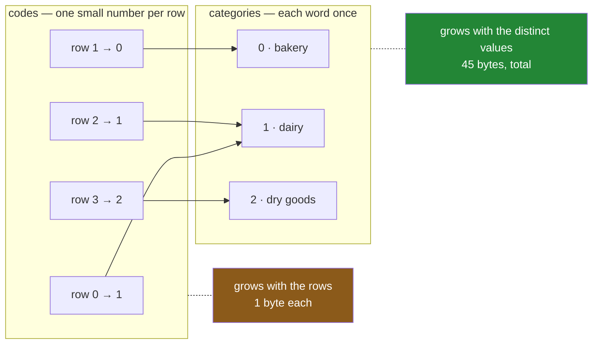

# 2.1 — Two arrays instead of one

## One-line answer

A **categorical** column is stored as two things rather than one — a short list of the distinct values,
and a whole number per row saying which of them that row holds — so the words are written down once and
the rows point at them.

---

## The story

The flat has a whiteboard by the door for the shopping.

For a while somebody wrote the whole thing out every week: milk, dairy; bread, bakery; eggs, dairy;
rice, dry goods. Then somebody else got tired of writing "dry goods" and did what people do. They wrote
a key in the corner of the board — 1 is bakery, 2 is dairy, 3 is dry goods — and then the list just
says milk 2, bread 1, eggs 2, rice 3.

Nobody was taught to do this. It is what everybody does when they have to write the same word down
often enough: a key at the top, and short marks underneath.

Two things happened, and only one of them was the point.

The board got shorter, which is what they wanted.

And the board also got an **order**. The key has bakery first and dry goods last, and that is now a
fact written on the whiteboard whether anybody meant it or not. When the flatmate who does the shop
reads the list, they walk the shop in key order, because that is the order the key is in.

---

## The idea in plain language

pandas has this as a dtype, and it is called **categorical**.

A **dtype** is the promise a column makes about every value in it — that they are all whole numbers, or
all text, or all dates
([Day 26, 1.4](../../../day-26-frames-and-copy-on-write/parts/01-the-two-objects/1.4-one-dtype-per-column.md)).
A categorical column's promise is narrower and stranger: *every value in this column is one of these
particular values, and here they are.*

That promise lets it be stored as two arrays instead of one.

**The categories.** The distinct values, each written once, in a fixed order. For the aisle column that
is `['bakery', 'dairy', 'dry goods']` — three words, forty-five bytes, and that is all the text there
will ever be in this column.

**The codes.** One whole number per row, saying which position in the categories list that row's value
sits at. `dairy` is at position 1, so every dairy row holds the number 1. The codes array is as long as
the frame, and each entry is as small as pandas can get away with — one byte, when there are fewer than
128 categories.

The word for the values-written-once list is **categories**, and the word for the numbers is **codes**.
Both are worth learning as words, because both are attributes you can read, and reading them is how you
debug anything to do with this dtype.

Notice what the two arrays are made of. The categories are text, and they are tiny. The codes are
numbers, and they are the ones that grow with the data. **The size of the column stopped depending on
how long the words are.** That is the entire trick, and everything else on this day — the memory saving,
the ordering, the traps, the `groupby` behaviour — falls out of it.

Two consequences follow immediately, and they matter:

**A categorical column is not a text column.** It is a column of small integers with a lookup table
attached. It happens to *display* as text and it answers `==` as text, but the dtype is `category`, not
`str`, and code that selects columns by dtype will not find it unless it asks for the right one.
[2.4](2.4-a-category-is-not-a-text-column.md) is that idea in full.

**The categories are a fixed list, and the codes can only point inside it.** There is no code for a
value that is not in the list, which is why writing a new value into a categorical column raises rather
than growing the list — [4.1](../04-the-traps/4.1-the-value-that-is-not-a-category.md).

---

## Why Setu needs it

- **[2.2](2.2-astype-category-and-the-saving-measured.md), next**, measures the saving this layout
  produces. It is arithmetic on the two arrays described here, and the arithmetic is worth having in
  your head before you see the number.
- **[2.3](2.3-the-code-width-and-where-the-saving-stops.md)** is about the width of one code, which is
  a sentence in this part and a decision procedure there.
- **[3.2](../03-order/3.2-categoricaldtype-the-order-written-down.md)** is the whiteboard's accidental
  order made deliberate. The categories list has an order whether you meant one or not; declaring
  `ordered=True` is how you tell pandas the order means something.
- **[4.1](../04-the-traps/4.1-the-value-that-is-not-a-category.md)** is what happens when a row wants a
  value the key does not have.
- **Day 45**'s one-hot encoding is this idea with the codes expanded into columns, and a model that
  encodes a categorical column gets the category list for free instead of rediscovering it.
- **Day 162**'s retriever stores a `source` column naming which corpus a chunk came from. Ten sources,
  millions of chunks, one byte a row.

---

## The mechanism

Take the four-line shopping list and convert one column:

```python
import pandas as pd

shop = pd.DataFrame(
    {
        "item": pd.Series(["milk", "bread", "eggs", "rice"], dtype="str"),
        "aisle": pd.Series(["dairy", "bakery", "dairy", "dry goods"], dtype="str"),
        "size": pd.Series(["large", "small", "medium", "large"], dtype="str"),
        "price": [1.15, 1.40, 2.60, 3.05],
        "need": [2, 1, 1, 1],
    }
)
aisle = shop["aisle"].astype("category")
print(aisle)
print()
print("categories :", aisle.cat.categories.tolist())
print("codes      :", aisle.cat.codes.tolist())
print("codes dtype:", aisle.cat.codes.dtype)
print("dtype      :", repr(aisle.dtype))
print("ordered    :", aisle.cat.ordered)
```

**Line by line:**

- `astype("category")` — the conversion, spelled as a dtype name in a string. It returns a **new**
  Series; the original `shop` is untouched, because pandas 3.0 never changes an object in place from an
  expression like this
  ([Day 26, 3.1](../../../day-26-frames-and-copy-on-write/parts/03-copy-on-write/3.1-every-result-behaves-like-a-copy.md)).
- `.cat` — the **categorical accessor**, the way to reach the two arrays. It exists on a Series whose
  dtype is `category` and raises on any other, in the same way `.str` exists only on text.
- `.cat.categories` returns an **Index** — the same object pandas uses for row labels — because the
  categories are a labelled, ordered, unique collection, which is exactly what an Index is.
  `.tolist()` turns it into an ordinary Python list so the print is readable.
- `.cat.codes` returns a Series of integers. **These are positions, not identifiers.** Position 1 means
  "the second entry in `categories`", and it means a different word the moment the category list
  changes.
- `repr(aisle.dtype)` rather than `str(aisle.dtype)`. The short form prints just `category`; the `repr`
  prints the whole dtype including the category list and the `ordered` flag, and that is the thing you
  need when debugging.
- `.cat.ordered` — `False` here, because `astype("category")` never assumes an order means anything.
  [3.2](../03-order/3.2-categoricaldtype-the-order-written-down.md) is how to say otherwise.

```text
0        dairy
1       bakery
2        dairy
3    dry goods
Name: aisle, dtype: category
Categories (3, str): ['bakery', 'dairy', 'dry goods']

categories : ['bakery', 'dairy', 'dry goods']
codes      : [1, 0, 1, 2]
codes dtype: int8
dtype      : CategoricalDtype(categories=['bakery', 'dairy', 'dry goods'], ordered=False, categories_dtype=str)
ordered    : False
```

**Read the printed Series carefully.** It shows the words, because that is what the column means. The
last line — `Categories (3, str)` — is pandas showing you the other array, and it is the line people
skim past for years.

The codes are `[1, 0, 1, 2]`. The values were `dairy, bakery, dairy, dry goods`. `dairy` is the second
category, so its code is `1`. **The categories came out alphabetically sorted**, not in the order the
values appeared, because `astype("category")` sorts them. That is a default worth knowing about and it
is the reason [3.2](../03-order/3.2-categoricaldtype-the-order-written-down.md) exists.

Here is the shape of it:



Because the two arrays are the whole story, a column can be rebuilt from them:

```python
rebuilt = pd.Categorical.from_codes([1, 0, 1, 2], categories=["bakery", "dairy", "dry goods"])
print(list(rebuilt))
print("same as the original?", (pd.Series(rebuilt) == aisle).all())
```

**Line by line:**

- `pd.Categorical.from_codes` — the constructor that takes the two arrays directly, with no values to
  infer from. It is the proof that nothing else is being stored.
- `[1, 0, 1, 2]` typed out by hand, matching what `.cat.codes` printed. Change one number here and a
  different word comes out.
- `categories=` must be given, and must be unique. `from_codes` will not guess a category list from
  codes, because codes without a category list mean nothing at all.
- `(… == aisle).all()` — an elementwise comparison producing a column of booleans, then `.all()` to
  reduce it to one answer
  ([Day 28, 2.1](../../../day-28-selection-and-alignment/parts/02-masks/2.1-a-comparison-makes-a-column.md)).

```text
['dairy', 'bakery', 'dairy', 'dry goods']
same as the original? True
```

And the byte count is exactly the two arrays plus the index:

```python
import numpy as np

rng = np.random.default_rng(34)
big = pd.Series(rng.choice(["bakery", "dairy", "dry goods"], 240_000), dtype="str").astype(
    "category"
)
codes = big.cat.codes.to_numpy().nbytes
cats = big.cat.categories.memory_usage(deep=True)
index = big.index.memory_usage(deep=True)
print("codes      :", codes)
print("categories :", cats)
print("index      :", index)
print("sum        :", codes + cats + index)
print("reported   :", big.memory_usage(deep=True))
```

**Line by line:**

- `.to_numpy().nbytes` on the codes — `nbytes` is NumPy's own size, so this is the codes array measured
  without pandas in the way ([Day 20,
  1.2](../../../day-20-arrays-and-dtypes/parts/01-the-block/1.2-shape-dtype-and-the-rest.md)).
- `.cat.categories.memory_usage(deep=True)` — the categories are an Index, and an Index answers the same
  memory question a Series does ([1.2](../01-the-repeated-word/1.2-what-memory-usage-actually-counts.md)).
- `big.index.memory_usage(deep=True)` — the 132-byte `RangeIndex`, kept separate so the arithmetic is
  visible rather than approximate.
- The last two lines are the check: if the sum does not equal the reported figure, one of the three
  pieces is not what this part claims it is.

```text
codes      : 240000
categories : 45
index      : 132
sum        : 240177
reported   : 240177
```

**Exactly.** One byte a row for a quarter of a million rows, forty-five bytes of text, and a
hundred-and-thirty-two-byte index. There is nothing else in there.

---

## When it breaks

The accessor on the wrong dtype:

```text
$ uv run python -c "
import pandas as pd
plain = pd.Series(['dairy', 'bakery', 'dairy'], dtype='str')
print(plain.cat.categories)
"
```

```text
Traceback (most recent call last):
  File "<string>", line 3, in <module>
  File ".venv\Lib\site-packages\pandas\core\generic.py", line 6392, in __getattr__
    return object.__getattribute__(self, name)
           ~~~~~~~~~~~~~~~~~~~~~~~^^^^^^^^^^^^
  File ".venv\Lib\site-packages\pandas\core\accessor.py", line 224, in __get__
    accessor_obj = self._accessor(obj)
  File ".venv\Lib\site-packages\pandas\core\arrays\categorical.py", line 2907, in __init__
    self._validate(data)
    ~~~~~~~~~~~~~~^^^^^^
  File ".venv\Lib\site-packages\pandas\core\arrays\categorical.py", line 2916, in _validate
    raise AttributeError("Can only use .cat accessor with a 'category' dtype")
AttributeError: Can only use .cat accessor with a 'category' dtype
```

**What it means.** The column is `str`, not `category`, so there are no two arrays to reach into. This
is almost always a conversion that did not happen — a frame rebuilt by `concat`
([4.4](../04-the-traps/4.4-concat-and-the-dtype-that-went-back-to-text.md)), a column read from CSV
without a dtype, a copy made before the `astype` line rather than after it.

The smallest fix is to check rather than assume: `isinstance(column.dtype, pd.CategoricalDtype)`
returns `True` or `False` and never raises.

Codes read as if they meant something:

```text
$ uv run python -c "
import pandas as pd
week1 = pd.Series(['dairy', 'bakery', 'dairy'], dtype='str').astype('category')
week2 = pd.Series(['dairy', 'frozen', 'dairy'], dtype='str').astype('category')
print('week 1 categories:', week1.cat.categories.tolist())
print('week 1 codes     :', week1.cat.codes.tolist())
print('week 2 categories:', week2.cat.categories.tolist())
print('week 2 codes     :', week2.cat.codes.tolist())
print('code 1 in week 1 :', week1.cat.categories[1])
print('code 1 in week 2 :', week2.cat.categories[1])
"
```

```text
week 1 categories: ['bakery', 'dairy']
week 1 codes     : [1, 0, 1]
week 2 categories: ['dairy', 'frozen']
week 2 codes     : [1, 0, 1]
print('code 1 in week 1 :', 'dairy')
code 1 in week 1 : dairy
code 1 in week 2 : frozen
```

**What it means.** Two columns with **identical codes** and completely different data. Nothing raised,
because nothing is wrong: a code is a position in *its own* category list, and the two lists are not the
same list.

This is the single most expensive misunderstanding of this dtype. Codes are not identifiers. They are
not stable across frames, across files, across runs of a program that read the categories in a
different order, or across a filter that removed a category. Anything that stores or compares
`.cat.codes` across two objects is storing a number whose meaning lives somewhere else.

The safe habit is to store or compare the **values**, and to reach for codes only inside one frame,
inside one operation, where the category list cannot change underneath you. When two frames genuinely
must share codes, the way to do it is to give them the same `CategoricalDtype`
([3.2](../03-order/3.2-categoricaldtype-the-order-written-down.md)), not to hope they line up.

---

## In production

**What a professional writes instead of the teaching version.** Not `astype("category")` on the way
past. The category list is part of the data's contract, so it is written down and applied:

```python
import pandas as pd

AISLE = pd.CategoricalDtype(categories=["bakery", "dairy", "dry goods"], ordered=False)


def with_aisle_dtype(frame: pd.DataFrame) -> pd.DataFrame:
    """Apply the project's aisle category list, refusing any value it does not contain."""
    unknown = sorted(set(frame["aisle"].dropna().unique()) - set(AISLE.categories))
    if unknown:
        raise ValueError(f"aisle values outside the declared categories: {unknown}")
    return frame.astype({"aisle": AISLE})
```

**Line by line:**

- `AISLE` is a module-level constant, so every frame in the project gets the **same** category list in
  the **same** order. That is what makes two frames' codes mean the same thing, and it is what stops
  `concat` from silently widening the dtype
  ([4.4](../04-the-traps/4.4-concat-and-the-dtype-that-went-back-to-text.md)).
- `ordered=False` stated rather than omitted. Aisles have no natural order, and saying so out loud is
  the difference between a decision and a default
  ([3.2](../03-order/3.2-categoricaldtype-the-order-written-down.md)).
- `set(...unique()) - set(AISLE.categories)` — the values present that the contract does not allow. This
  is the check `astype` will not do for you: a value outside the list becomes a **blank**, silently, and
  that is the failure mode [4.1](../04-the-traps/4.1-the-value-that-is-not-a-category.md) is about.
- `.dropna()` first, so a genuinely missing value is not reported as an unknown category.
- `sorted(...)` on the message, so the error text is the same every run and a test can assert on it
  ([Day 18, 3.3](../../../day-18-exceptions/parts/03-your-own/3.3-the-message-is-an-interface.md)).
- `frame.astype({"aisle": AISLE})` with a dict, naming the column. A bare `astype(AISLE)` would try to
  convert every column in the frame.

**What changes at scale.** `astype("category")` has to find the distinct values, which means a full pass
and a sort. On a large frame that is not free, and doing it after the read means the expensive `str`
column existed in memory first — which is the memory you were trying not to spend. The professional
answer is to convert at the boundary: `read_csv(..., dtype={"aisle": AISLE})` and Parquet's own
dictionary encoding both hand pandas a categorical column without ever building the wide one
([Day 27, 1.4](../../../day-27-reading-and-writing/parts/01-the-csv/1.4-dtype-at-read-time.md)).

**The failure that only appears with real data.** A team cached feature frames to disk with the codes
extracted as plain integers, to save space. It worked for months. Then an upstream file arrived with one
new value in it, the category list gained an entry, every code shifted by one, and a model began
scoring dairy products as if they were frozen. **Nothing raised, no test failed, and the metric moved by
about a percent** — small enough to be blamed on drift for three weeks. Codes are positions.

**The review comment a senior engineer leaves.** *"`astype('category')` here infers the category list
from whatever this particular file happened to contain, so two runs can produce two different orderings
and the codes will not match. Declare a `CategoricalDtype` constant and apply that, and add the check
that refuses a value outside it."*

**The interview question.** *"How is a categorical column stored, and when is it worth it?"* Two arrays:
the distinct values written once, and one small integer per row indexing into them. It is worth it when
the number of distinct values is small compared with the number of rows, because the per-row cost stops
depending on how long the values are. The follow-up that separates people who have used it from people
who have read about it: **the codes are positions in that particular column's category list**, so they
are meaningless outside it, and the way to make two frames agree is to give them the same
`CategoricalDtype` rather than to compare codes and hope.

---

## Check yourself

```bash
uv run python -c "
import pandas as pd
aisle = pd.Series(['dairy', 'bakery', 'dairy', 'dry goods'], dtype='str').astype('category')
print('values     :', aisle.tolist())
print('categories :', aisle.cat.categories.tolist())
print('codes      :', aisle.cat.codes.tolist())
print()
flipped = aisle.cat.reorder_categories(['dry goods', 'dairy', 'bakery'])
print('values     :', flipped.tolist())
print('categories :', flipped.cat.categories.tolist())
print('codes      :', flipped.cat.codes.tolist())
"
```

The same four values printed twice, with different codes underneath. Say what changed, say what did
not, and say what would have happened to a file that had stored the first set of codes.

**Answer out loud, without scrolling up:**

> Name the two arrays a categorical column is made of, and say which one grows when you add a million
> rows. Then say why a code of `1` in one frame and a code of `1` in another frame are not necessarily
> the same thing.

---

**Next:** [2.2 — `astype("category")` and the saving,
measured](2.2-astype-category-and-the-saving-measured.md).
