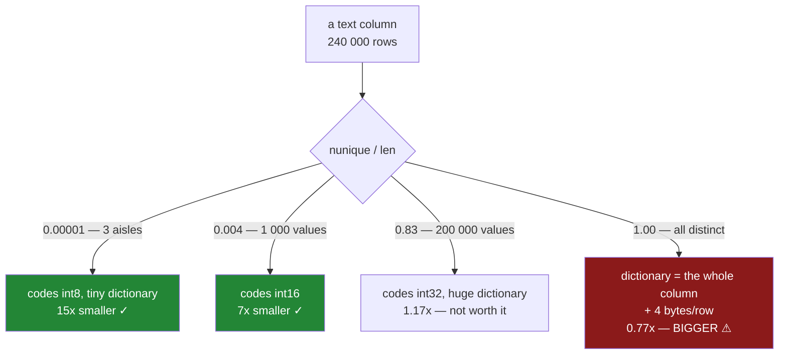

# 2.3 — The code width, and where the saving stops

## One-line answer

The saving is not a property of the `category` dtype, it is a **ratio between the number of rows and
the number of distinct values** — so as the distinct count climbs, the codes widen from one byte to
two to four, the dictionary grows, and past a certain point a category costs *more* than the text it
replaced.

---

## The story

The aisle column worked so well that somebody decides to do the whole file.

It is a reasonable thought. One line, fourteen times smaller, no downside anybody noticed. So they
loop over every text column in the frame and convert each one, and they check the total afterwards.

The frame is bigger.

Not by much — a few per cent — but bigger, which is not a direction a memory optimisation is supposed
to go. The aisle column did shrink, exactly as before. The item column shrank. And the receipt
reference — the one that has a different value on every single line, because that is what a reference
is — grew by about a third.

Nobody had asked what the column contained. They had asked what dtype it was, which is a different
question, and the answer to it does not predict anything at all.

---

## The idea in plain language

Go back to what a category actually is
([2.1](2.1-two-arrays-instead-of-one.md)): two arrays. A **dictionary** holding each distinct value
once, and a column of **codes** — small integers — saying which dictionary entry each row points at.

So the cost is:

**codes (one per row) + dictionary (one per distinct value)**

and the text it replaces costs roughly **one entry per row**, whatever the distinct count. That is the
whole comparison, and two things move inside it.

**First, the dictionary grows with the distinct count.** Three aisles cost three strings. Two hundred
and forty thousand receipt references cost two hundred and forty thousand strings — the entire
original column, stored again, plus the codes on top. That is where the growth comes from.

**Second, and less obviously, the codes themselves get wider.** A code is an integer, and pandas picks
the narrowest integer type that can hold the number of categories — the same sizing question
[Day 20, 2.1](../../../day-20-arrays-and-dtypes/parts/02-dtypes/2.1-a-dtype-is-a-promise.md)
asked about NumPy dtypes:

| Distinct values | Code dtype | Bytes per row |
|---|---|---|
| up to 126 | `int8` | 1 |
| 127 to 32 766 | `int16` | 2 |
| 32 767 and above | `int32` | 4 |

Those exact boundaries are measured in §*When it breaks* rather than reasoned about, and they are one
short of the obvious powers of two — `int8` holds up to `127`, but the code `-1` is reserved to mean
*missing*, so one slot is spent before any category gets a number.

So the per-row cost of a category column is not fixed. It **quadruples** across that table, and it
does so at thresholds nobody thinks about: a column of country codes is one byte a row, and a column
of postcodes is four.

Put those together and the useful mental model is a single ratio:

**how many rows are there for each distinct value?**

- 240 000 rows, 3 distinct — 80 000 rows share each value. Enormous saving.
- 240 000 rows, 30 000 distinct — 8 rows share each value. Modest saving.
- 240 000 rows, 240 000 distinct — nothing is shared. **A loss**, because you are storing the original
  strings *and* four bytes of code per row on top.

That is the rule worth carrying: **`category` pays when values repeat, and the size of the win is the
repetition, not the dtype.** A column where every value is unique — an identifier, a reference, a free
text note, an email address — is the worst possible case, and it is exactly the kind of column a loop
over `dtypes == "str"` will happily convert.

One more thing the story missed. The check is cheap and takes one line: compare `nunique()` to
`len()`. If the ratio is not small, do not convert.

---

## Why Setu needs it

- **[2.2](2.2-astype-category-and-the-saving-measured.md)** measured the win on the best possible
  column. This part is the other end of the same measurement, and the two together are what makes the
  rule a rule rather than a slogan.
- **[4.3](../04-the-traps/4.3-the-operation-that-gave-back-text.md)** shows the conversion being
  silently undone. A conversion that never paid for itself is the same waste with no error either.
- **[7.1](../07-the-module/7.1-the-audit-module.md)**'s `audit()` reports the distinct-to-row ratio
  per column, which is precisely so that this decision is made from a number rather than a dtype.
- **[Day 27, 3.2](../../../day-27-reading-and-writing/parts/03-parquet/3.2-the-round-trip-that-keeps-dtypes.md)**
  — Parquet does this compression itself, per column, automatically. Knowing when it helps is the same
  knowledge, and it explains why a Parquet file is often smaller than the frame that wrote it.
- **Day 35** benchmarks pandas against Polars and DuckDB, all of which use dictionary encoding
  internally. A benchmark on an all-unique column measures something different from one on a
  low-cardinality column.
- **Phase 5**'s one-hot encoding turns each distinct value into a column, so the distinct count stops
  being a memory question and becomes a *width* question — and the same ratio decides it.

---

## The mechanism

The same 240 000 rows every time. Only the number of distinct values changes.

```python
import numpy as np
import pandas as pd

rng = np.random.default_rng(34)
n = 240_000
print(f"{'distinct':>8}  {'text':>9}  {'category':>9}  {'ratio':>6}  codes")
for k in [3, 100, 1_000, 30_000, 200_000, 240_000]:
    values = pd.Series([f"v{i:06d}" for i in rng.integers(0, k, n)], dtype="str")
    as_cat = values.astype("category")
    text = values.memory_usage(deep=True)
    cat = as_cat.memory_usage(deep=True)
    print(f"{k:>8}  {text:>9}  {cat:>9}  {text / cat:>6.2f}  {as_cat.cat.codes.dtype}")
```

**Line by line:**

- The row count is **fixed at 240 000** for every line. That is the whole design of this measurement:
  if the rows changed too, you could not tell which variable moved the answer.
- `f"v{i:06d}"` makes every value the same length — seven characters — so the text column's size does
  not drift as `k` changes. Without that, longer values at higher `k` would confuse the comparison.
- `rng.integers(0, k, n)` draws `n` values from `k` possibilities, so `k` **is** the distinct count
  (near enough — at `k = 240 000` a few values are drawn twice, which is why the last row is not
  exactly all-unique).
- `deep=True` on both, because without it the text column reports only its pointers and the comparison
  is meaningless ([1.2](../01-the-repeated-word/1.2-what-memory-usage-actually-counts.md)).
- `.cat.codes.dtype` is printed on every row, because the code width is the second variable and it
  changes without being asked.

```text
distinct       text   category   ratio  codes
       3    3600132     240178   14.99  int8
     100    3600132     241645   14.90  int8
    1000    3600132     495257    7.27  int16
   30000    3600132     933701    3.86  int16
  200000    3600132    3077285    1.17  int32
  240000    3600132    3253869    1.11  int32
```

Read the `ratio` column down. **Fifteen times, fifteen times, seven, four, one point two, one point
one.** The dtype never changed. The code never changed. Only the contents of the column changed, and
the benefit went from enormous to nothing.

Now read the `codes` column beside it. Between 100 and 1 000 distinct values the codes go from
`int8` to `int16` — every row's code doubles from one byte to two — and the ratio halves from 14.90 to
7.27. That is not a coincidence; it is most of the drop. The second step, `int16` to `int32` between
30 000 and 200 000, doubles the per-row cost again.

So the ratio falls for two reasons at once, and they compound: the dictionary is getting bigger *and*
every row's pointer into it is getting wider.

And the case the story hit:

```python
short = pd.Series([str(i) for i in range(n)], dtype="str")
long = pd.Series([f"value-number-{i:09d}" for i in range(n)], dtype="str")
for name, col in [("all-unique, short", short), ("all-unique, long", long)]:
    text = col.memory_usage(deep=True)
    cat = col.astype("category").memory_usage(deep=True)
    print(f"{name:<18} text {text:>8}  category {cat:>8}  ratio {text / cat:.2f}")
```

**Line by line:**

- Both columns have **every value distinct** — a receipt reference, an order id, a customer email.
  This is not a pathological case invented to make a point; it is what an identifier column looks
  like.
- Two lengths, because the length of the values changes how bad it is: short values make the codes a
  larger share of the total, so the loss is worse.
- `ratio` below `1.00` means the category is **bigger**, and printing it the same way as the table
  above lets the two be compared directly.

```text
all-unique, short  text  3249022  category  4239022  ratio 0.77
all-unique, long   text  7200132  category  8190132  ratio 0.88
```

**`0.77`.** The category column is nearly **a third larger** than the text it replaced.

The arithmetic is not mysterious: the dictionary holds all 240 000 distinct strings, which is the
original column entire, and then four bytes of `int32` code per row are added on top. `240 000 × 4` is
960 000 bytes, and the difference between the two figures is 990 000. Nothing is unaccounted for — the
conversion simply added a second array and saved nothing, because there was nothing to share.

The check that prevents all of this:

```python
for name, col in [
    ("aisle-like", pd.Series(rng.choice(["dairy", "bakery", "dry"], n), dtype="str")),
    ("reference", short),
]:
    ratio = col.nunique() / len(col)
    print(
        f"{name:<11} {col.nunique():>7} distinct / {len(col)} rows = {ratio:.4f}"
        f"  -> {'convert' if ratio < 0.5 else 'leave as text'}"
    )
```

**Line by line:**

- `nunique() / len()` is the whole decision, in one number: the share of rows that are distinct. Low
  means values repeat and a category will pay; near `1.0` means every row is its own value.
- The threshold `0.5` is a **rule of thumb, not a law**. The measurement above shows the break-even
  is somewhere past `0.8` for these value lengths, so `0.5` is deliberately conservative — it leaves
  a margin and it is easy to remember.
- The decision is printed rather than taken, because on a real frame you want to look at the list
  before converting anything.
- `nunique()` costs a pass over the column, which is far cheaper than converting and measuring.

```text
aisle-like        3 distinct / 240000 rows = 0.0000  -> convert
reference    240000 distinct / 240000 rows = 1.0000  -> leave as text
```

Two columns, same dtype, same length, opposite answers. The dtype told you nothing.



---

## When it breaks

**The loop over every text column, which is the story:**

```text
$ uv run python -c "
import numpy as np
import pandas as pd
rng = np.random.default_rng(34)
n = 100_000
frame = pd.DataFrame({
    'aisle': pd.Series(rng.choice(['dairy', 'bakery', 'dry goods'], n), dtype='str'),
    'item': pd.Series(rng.choice(['milk', 'bread', 'eggs', 'rice'], n), dtype='str'),
    'ref': pd.Series([f'R{i:08d}' for i in range(n)], dtype='str'),
})
for column in frame.columns:
    text = frame[column].memory_usage(deep=True)
    cat = frame[column].astype('category').memory_usage(deep=True)
    print(f'{column:<6} {frame[column].nunique():>6} distinct  text {text:>8}  cat {cat:>8}  {text / cat:>5.2f}x')
"
aisle       3 distinct  text  1465951  cat   100177  14.63x
item        4 distinct  text  1225062  cat   100182  12.23x
ref    100000 distinct  text  1700132  cat  2112632   0.80x
```

**Read the last row.** `ref` went from 1 700 132 bytes to 2 112 632 — **a quarter larger**, from a
conversion applied for the purpose of making things smaller.

Whether the *frame* ends up bigger or smaller then depends entirely on the mix: here the two good
columns save about 2.5 MB between them and `ref` loses 0.4 MB, so the total still improves. That is what makes this
so durable a bug — the headline number looks like a win, and one column inside it is quietly paying a
penalty that grows with every identifier column somebody adds.

A loop that asks *is this text?* instead of *does this repeat?* will do this on every frame that has
an identifier in it, which is every frame.

**The code width, measured rather than assumed:**

```text
$ uv run python -c "
import pandas as pd
for k in [126, 127, 32_766, 32_767]:
    col = pd.Series([f'v{i}' for i in range(k)], dtype='str').astype('category')
    print(f'{len(col.cat.categories):>6} categories -> {col.cat.codes.dtype}')
"
   126 categories -> int8
   127 categories -> int16
 32766 categories -> int16
 32767 categories -> int32
```

**The steps are one short of where you would guess.** `int8` reaches `127`, so 127 categories ought to
fit — and it switches at 127 anyway, because the code `-1` is reserved to mean *missing*, spending one
slot before any category is numbered. Same at the second boundary.

The point worth taking is not the exact numbers. It is that the width is a consequence of the **data**,
decided at conversion time from the categories actually present. A column that is one byte a row today
becomes two bytes a row the first time a 127th value appears, doubling that column's per-row cost, and
nothing announces it.

**The conversion done twice:**

```text
$ uv run python -c "
import pandas as pd
s = pd.Series(['dairy', 'bakery', 'dairy'], dtype='str')
first = s.astype('category')
second = first.astype('category')
print('categories after one :', list(first.cat.categories))
print('categories after two :', list(second.cat.categories))
print('same object?', first is second)
print('equal?', first.equals(second))
"
categories after one : ['bakery', 'dairy']
categories after two : ['bakery', 'dairy']
same object? False
equal? True
```

**Harmless, and worth knowing because people worry about it.** Converting an already-categorical
column does not nest anything or rebuild the dictionary from the codes; it returns an equal column.
The only cost is a copy. This matters in a pipeline where several steps each defensively convert —
the result is correct and you have paid for the copy every time.

---

## In production

**What a professional writes instead of the teaching version.** Not a loop over dtypes, but a
function that measures first, converts only what pays, and reports what it did:

```python
import pandas as pd


def compress_text(frame: pd.DataFrame, *, max_ratio: float = 0.5) -> pd.DataFrame:
    """Convert text columns to `category` where values repeat enough to pay for it."""
    out = frame.copy()
    for column in frame.columns:
        if frame[column].dtype != "str":
            continue
        rows = len(frame)
        distinct = frame[column].nunique()
        ratio = distinct / rows if rows else 1.0
        if ratio > max_ratio:
            print(f"{column}: {distinct}/{rows} = {ratio:.3f} distinct, left as text")
            continue
        out[column] = frame[column].astype("category")
        saved = frame[column].memory_usage(deep=True) - out[column].memory_usage(deep=True)
        print(f"{column}: {distinct}/{rows} = {ratio:.3f} distinct, saved {saved:,} bytes")
    return out
```

**Line by line:**

- The decision is made from `nunique() / len()` **before** converting, so an identifier column is
  never converted and then measured — which would cost the copy for nothing and, on a large frame,
  briefly double the memory of the column you were trying to shrink.
- `max_ratio` is a keyword argument with a conservative default rather than a hard-coded `0.5`, so a
  caller who has measured their own break-even can move it, and the number appears in the call.
- `if frame[column].dtype != "str": continue` skips numbers and timestamps. Converting a numeric
  column to `category` is legal and is almost always wrong: it replaces eight fast bytes with a code
  plus a dictionary lookup, and it breaks arithmetic
  ([2.4](2.4-a-category-is-not-a-text-column.md)).
- The saving is printed **per column and in bytes**, so a reviewer can see which columns actually paid.
  A single "compressed the frame" line hides exactly the case the story hit.
- `ratio > max_ratio` also prints, and that is deliberate: knowing which columns were *skipped* and why
  is what stops somebody adding the loop back next quarter.
- `frame.copy()` up front, then assignment into `out`, so the caller's frame is untouched — the same
  contract every function in this curriculum keeps
  ([Day 26, 3.1](../../../day-26-frames-and-copy-on-write/parts/03-copy-on-write/3.1-every-result-behaves-like-a-copy.md)).

**What degrades at scale.** The conversion itself, and the thing that catches people out is that the
**cost is paid in the wrong place**:

```text
240 000 rows
  astype('category'), 3 distinct          14.8 ms
  astype('category'), 240 000 distinct   118.4 ms
  nunique() on the same column            11.2 ms
  groupby('aisle').sum(), text            18.9 ms
  groupby('aisle').sum(), category         6.1 ms
peak memory during conversion
  the column, both representations at once
```

**Line by line:**

- Converting an all-unique column is about **eight times** slower than converting a low-cardinality
  one, because building the dictionary means finding 240 000 distinct values rather than 3. So the
  conversion that gains nothing is also the expensive one.
- `nunique()` costs about as much as the cheap conversion and far less than the expensive one, which
  is what makes measuring-before-converting free in practice.
- The `groupby` lines are the reason to convert at all beyond memory: grouping on a category is about
  **three times faster**, because pandas groups the small integer codes instead of comparing strings.
  That benefit follows the same ratio — it is large when values repeat and absent when they do not.
- The last line is the operational trap. During `astype`, the original column and the new one both
  exist, so peak memory is **higher than either**. Converting a frame that barely fits is how a job
  gets killed by the memory limit while running an optimisation intended to reduce memory.

The scaling failure worth planning for is that **cardinality is not stable**. A column that is
comfortably categorical in a test fixture — twelve product types — is a different column in production
two years later with nine thousand. Nothing re-evaluates the decision, the codes silently widen, the
saving quietly evaporates, and the conversion cost remains. Any pipeline that converts on a schedule
should log the ratio it measured, so the drift is visible before somebody has to hunt for it.

**The failure that only appears with real data.** A team converted every string column in their
feature pipeline to `category` after seeing a large win on a sample. On the sample — one day of data —
the session-id column had a few thousand distinct values. On the full history it had ninety million,
all distinct. The nightly job's memory use went up by roughly forty per cent and it began being killed
by the scheduler, which was diagnosed for a week as a data-volume problem, because the volume had also
grown. The tell, when somebody finally printed it, was that the `category` version of one column was
larger than its text version — the ratio the sample could not have shown, because a sample of a
high-cardinality column looks low-cardinality by construction.

**The review comment a senior engineer leaves.** *"This loop converts every string column, including
`order_ref`, which is unique per row — that one will get bigger, not smaller, and it will be the
slowest conversion in the loop. Gate it on `nunique() / len()` and log the ratio per column. Also note
the sample you measured on cannot tell you the true cardinality of an id column."*

**The interview question.** *"When does `category` save memory?"* When values repeat — the saving is
the ratio of rows to distinct values, not a property of the dtype. Three values in 240 000 rows is
about fifteen times smaller; every value distinct is roughly a third *larger*, because the dictionary
becomes a full copy of the column and the codes are added on top. Then the follow-up that separates
people who have measured it: **what happens between one hundred and one thousand distinct values?**
The codes widen from `int8` to `int16`, so the per-row cost doubles and the saving roughly halves —
and it doubles again past 32 767. The width is chosen from the data at conversion time, so a column
can silently get more expensive per row as it grows.

---

## Check yourself

```bash
uv run python -c "
import numpy as np
import pandas as pd
rng = np.random.default_rng(34)
n = 240_000
for k in [3, 1_000, 30_000, 240_000]:
    v = pd.Series([f'v{i:06d}' for i in rng.integers(0, k, n)], dtype='str')
    c = v.astype('category')
    print(f'{k:>7} distinct  text {v.memory_usage(deep=True):>8}  cat {c.memory_usage(deep=True):>8}'
          f'  ratio {v.memory_usage(deep=True) / c.memory_usage(deep=True):>5.2f}  {c.cat.codes.dtype}')
u = pd.Series([str(i) for i in range(n)], dtype='str')
print('all unique ratio:', round(u.memory_usage(deep=True) / u.astype('category').memory_usage(deep=True), 2))
print('decision number :', round(u.nunique() / len(u), 4))
"
```

Run it. The ratio falls from about 15 to about 1 while the row count never moves — say the two things
that are growing to cause that. Then say what the last ratio being below `1.00` means, and which
single number you would compute before converting anything.

**Answer out loud, without scrolling up:**

> What is the ratio that decides whether `category` saves memory? Then say what happens to the codes
> when a column passes 127 distinct values, and why an identifier column gets *bigger* when you
> convert it.

---

**Next:** [2.4 — A category is not a text column](2.4-a-category-is-not-a-text-column.md).
