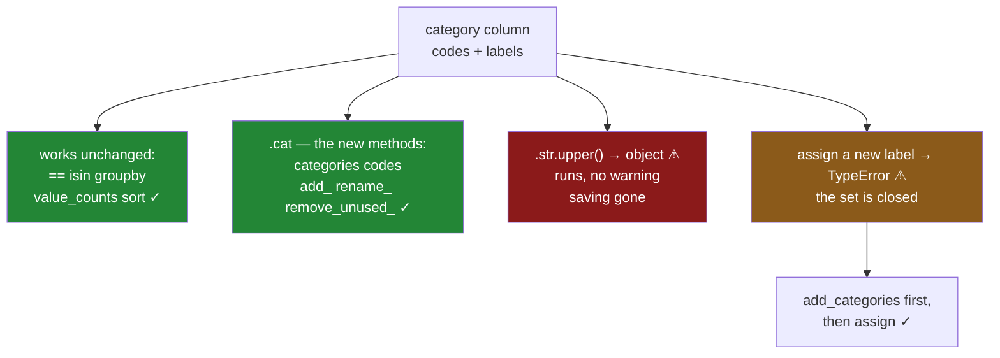

# 2.4 — A category is not a text column

## One-line answer

A `category` column is a column of **codes** with a list of labels attached, so it keeps the methods
that ask questions about values and loses the ones that assume free text — `.str` still works but
hands back an ordinary text column, `.cat` is where the new methods live, and writing a label that is
not in the list raises.

---

## The story

The aisle column is a category now and everything still works, which is the pleasant surprise.
Grouping works. Counting works. Filtering by `== "dairy"` works. Somebody was braced for a rewrite and
there was not one.

Then the shop adds a freezer, and a new aisle with it.

Somebody goes to fix the three rows that were miscoded — they should say `frozen` — and writes the
obvious line. And it stops, with an error, which is the first error this column has produced since it
was converted.

It says it cannot put `frozen` into this column because `frozen` is not one of its categories, and
that the categories have to be set first.

The reaction in the room is that the optimisation has broken something. It has not. The column was
told, at conversion time, that it holds one of three labels, and it is holding them to that. Which is
either a nuisance or the most useful thing in the file, depending on whether the next new value is a
freezer aisle or a typo.

---

## The idea in plain language

The conversion changed what the column **is**, and the consequences fall into three groups.

**What still works, unchanged.** Anything that asks a question about the values rather than about
their characters: `==` and `!=`, `.isin()`, `value_counts()`, `groupby`, `sort_values()`, `isna()`,
indexing and filtering. These all work on the codes, which is why they are *faster* than on text —
comparing small integers beats comparing strings.

**What is new, and lives behind `.cat`.** The column now has a second thing in it — the list of labels
— and `.cat` is the accessor for that list, exactly as `.str` is the accessor for text methods and
`.dt` for timestamp fields ([Day 33, 1.1](../../../day-33-text-and-time/parts/01-the-str-accessor/1.1-the-column-that-has-no-lower.md)).
The ones worth knowing now:

- `.cat.categories` — the labels, in order.
- `.cat.codes` — the integers, one per row. `-1` means missing.
- `.cat.add_categories([...])` — extend the list. This is the fix for the story.
- `.cat.remove_unused_categories()` — drop labels no row uses ([4.2](../04-the-traps/4.2-the-category-that-nobody-used.md)).
- `.cat.rename_categories({...})` — change a label without touching a single row's code.

That last one is worth pausing on. Renaming a category rewrites **one entry in the dictionary**, and
every row that pointed at it now reads differently. On 240 000 rows that is one string replaced rather
than 240 000, and it is the cheapest bulk edit in pandas.

**What is different in a way that will surprise you.** Two things.

First: **`.str` still works, and quietly gives you back a text column.** `aisle.str.upper()` runs, and
the result is not a category — it is `object` dtype, the conversion undone, the memory saving gone.
Nothing warns. That is the subject of [4.3](../04-the-traps/4.3-the-operation-that-gave-back-text.md)
and it is the single most common way a category evaporates.

Second: **the set of labels is closed.** Assigning a value that is not in `.cat.categories` raises.
That is not pandas being difficult; it is the *point* of the dtype. A text column accepts `dary` as
happily as `dairy`, and you find out three months later during a `groupby`. A category refuses it at
the moment somebody types it.

So the closed set is a **validation feature wearing the costume of a memory optimisation**. On a
column of aisles, statuses, country codes or plan tiers, that refusal is worth more than the bytes.

One more difference, saved for [3.3](../03-order/3.3-comparing-and-sorting-an-ordered-category.md):
by default a category is **unordered**, so `<` and `>` raise even though `==` works. Sorting still
works, alphabetically. Section 3 is about saying that the labels have an order and what changes when
you do.

---

## Why Setu needs it

- **[4.1](../04-the-traps/4.1-the-value-that-is-not-a-category.md)** is the closed set met head-on:
  what to do when a genuinely new label arrives, and how to tell it from a typo.
- **[4.3](../04-the-traps/4.3-the-operation-that-gave-back-text.md)** measures six operations that
  silently return text, of which `.str` is the first.
- **[3.1](../03-order/3.1-nominal-and-ordinal.md)** picks up the unordered default and shows what it
  costs when the labels are sizes rather than aisles.
- **[Day 33, 1.1](../../../day-33-text-and-time/parts/01-the-str-accessor/1.1-the-column-that-has-no-lower.md)**
  introduced the accessor idea. `.cat` is the third one, and the pattern — a doorway to methods that
  only make sense for one dtype — is now worth naming as a pattern.
- **[7.1](../07-the-module/7.1-the-audit-module.md)**'s `audit()` reports categories that no row uses
  and values that fall outside a declared set, both of which are `.cat` questions.
- **Phase 5**'s encoders take a declared category list so that a value unseen in training is an error
  rather than a silent zero, which is this same closed set doing the same job one phase later.

---

## The mechanism

The flat's aisle column, converted, and what it now is.

```python
import pandas as pd

aisle = pd.Series(["dairy", "bakery", "dry goods", "dairy"], dtype="str").astype("category")
print("dtype      :", aisle.dtype)
print("categories :", list(aisle.cat.categories))
print("codes      :", aisle.cat.codes.tolist())
print("value_counts:")
print(aisle.value_counts())
```

**Line by line:**

- `.astype("category")` is [2.2](2.2-astype-category-and-the-saving-measured.md)'s conversion, on four
  rows so the codes can be read individually.
- `.cat.categories` comes back **sorted alphabetically**, not in the order the values appeared. That is
  the default and it is the whole reason section 3 exists — for `dairy`/`bakery` it does not matter,
  and for `small`/`medium`/`large` it is wrong.
- `.cat.codes` is the second array from [2.1](2.1-two-arrays-instead-of-one.md), printed. Row 0 is
  `dairy`, which is category `1`, because `bakery` sorts first.
- `value_counts()` works exactly as it does on text, which is the reassurance the story opens with.

```text
dtype      : category
categories : ['bakery', 'dairy', 'dry goods']
codes      : [1, 0, 2, 1]
value_counts:
dairy        2
bakery       1
dry goods    1
Name: count, dtype: int64
```

The codes `[1, 0, 2, 1]` are the column. Everything else is the three-entry dictionary above them.

Now the three groups. What still works:

```python
print("equality :", (aisle == "dairy").tolist())
print("isin     :", aisle.isin(["dairy", "frozen"]).tolist())
print("sorted   :", aisle.sort_values().tolist())
print("filtered :", aisle[aisle == "dairy"].dtype)
```

**Line by line:**

- `== "dairy"` compares against a **label**, not a code, so nothing about the calling code changes when
  a column is converted. Underneath, pandas looks up `dairy`'s code once and compares integers.
- `isin` with `"frozen"` — a label that is not a category — does **not** raise. Asking whether a value
  is present is always answerable; the answer is just `False` everywhere. That asymmetry with
  assignment is worth noticing.
- `sort_values()` sorts by the category order, which for an unordered category is the alphabetical
  order of the labels.
- The filtered result is still `category`, and it keeps **all three** categories even though only
  `dairy` survives — the subject of [4.2](../04-the-traps/4.2-the-category-that-nobody-used.md).

```text
equality : [True, False, False, True]
isin     : [True, False, False, True]
sorted   : ['bakery', 'dairy', 'dairy', 'dry goods']
filtered : category
```

What is new:

```python
renamed = aisle.cat.rename_categories({"dry goods": "dry"})
extended = aisle.cat.add_categories(["frozen"])
print("renamed labels :", list(renamed.cat.categories))
print("renamed codes  :", renamed.cat.codes.tolist())
print("extended labels:", list(extended.cat.categories))
print("extended codes :", extended.cat.codes.tolist())
```

**Line by line:**

- `rename_categories` takes a mapping and rewrites the **dictionary**. Compare the two `codes` lines:
  they are identical. Not one row was touched, and every row that said `dry goods` now says `dry`.
- On 240 000 rows that is the difference between replacing one string and replacing 240 000. It is the
  reason a category column is the right home for a label that might get renamed.
- `add_categories` extends the list and leaves every code alone, because nothing yet points at the new
  label. This is the fix for the story: add first, then assign.
- Both return **new** columns rather than editing in place, like every other pandas operation
  ([Day 26, 3.1](../../../day-26-frames-and-copy-on-write/parts/03-copy-on-write/3.1-every-result-behaves-like-a-copy.md)).

```text
renamed labels : ['bakery', 'dairy', 'dry']
renamed codes  : [1, 0, 2, 1]
extended labels: ['bakery', 'dairy', 'dry goods', 'frozen']
extended codes : [1, 0, 2, 1]
```

And what is different:

```python
upper = aisle.str.upper()
print("str.upper values:", upper.tolist())
print("str.upper dtype :", upper.dtype)
print("still a category?", upper.dtype == "category")
```

**Line by line:**

- `.str.upper()` on a category **runs**. There is no error and no warning, and the values are correct.
- The dtype of the result is `object` — not `category`, and not even the `str` dtype from
  [Day 33, 1.3](../../../day-33-text-and-time/parts/01-the-str-accessor/1.3-the-dtype-under-the-text.md).
  The conversion has been undone and the memory saving with it.
- The last line is the check nobody runs, printed here so the silence is visible.

```text
str.upper values: ['DAIRY', 'BAKERY', 'DRY GOODS', 'DAIRY']
str.upper dtype : object
still a category? False
```

**Correct values, wrong dtype, no warning.** One `.str` call in a pipeline and the column that was
fifteen times smaller is now larger than it ever was as text.



---

## When it breaks

**The story's error, in full:**

```text
$ uv run python -c "
import pandas as pd
aisle = pd.Series(['dairy', 'bakery', 'dry goods'], dtype='str').astype('category')
aisle.iloc[0] = 'frozen'
"
TypeError: Cannot setitem on a Categorical with a new category (frozen), set the categories first
```

**Read the message; it contains the fix.** *"set the categories first"* is `cat.add_categories`. The
sequence is `aisle = aisle.cat.add_categories(["frozen"])` and then the assignment, and it works.

This is the dtype doing its job. The same line on a text column succeeds silently, and so does the
same line with `frozn` — which is the case this error exists to catch. Every time you meet it, the
question to ask is *is this a new label or a typo?*, and only a person can answer that.

**The comparison that raises even though equality works:**

```text
$ uv run python -c "
import pandas as pd
aisle = pd.Series(['dairy', 'bakery'], dtype='str').astype('category')
print('equality works:', (aisle == 'dairy').tolist())
print(aisle > 'bakery')
"
equality works: [True, False]
TypeError: Unordered Categoricals can only compare equality or not
```

**What it means.** By default a category has labels with no ranking, so *greater than* is a question
with no answer, and pandas refuses rather than falling back to alphabetical order — which would give a
confident wrong answer for `small` and `large`. That refusal is the whole argument for
[3.1](../03-order/3.1-nominal-and-ordinal.md), and `ordered=True` is how you say the ranking is real.

**The comparison against a label that does not exist:**

```text
$ uv run python -c "
import pandas as pd
from pandas.api.types import CategoricalDtype
size = CategoricalDtype(['small', 'medium', 'large'], ordered=True)
s = pd.Series(['large', 'small'], dtype='str').astype(size)
print('in the list    :', (s > 'small').tolist())
print(s > 'huge')
"
in the list    : [True, False]
TypeError: Invalid comparison between dtype=category and str
```

**What it means.** Even on an *ordered* category, comparing against a label outside the list raises —
because `huge` has no position in the ranking, so the comparison is undefined. The message is less
helpful than the assignment one: it says the types cannot be compared, when the real cause is that one
particular value is not a member. If you meet it, print `.cat.categories` and look for a typo in the
literal.

**The category of numbers:**

```text
$ uv run python -c "
import pandas as pd
qty = pd.Series([1, 2, 3, 2]).astype('category')
print('dtype :', qty.dtype)
print('sum   :', qty.sum())
"
dtype : category
TypeError: 'Categorical' with dtype category does not support operation 'sum'
```

**Nothing stopped the conversion, and the arithmetic is gone.** Converting a numeric column to
`category` is legal and almost always wrong: the values became labels, and labels do not add up. A
loop that converts columns by cardinality rather than by dtype
([2.3](2.3-the-code-width-and-where-the-saving-stops.md)) will do this to a quantity column, because a
quantity of 1, 2 or 3 has beautifully low cardinality. Gate on the dtype as well as the ratio.

---

## In production

**What a professional writes instead of the teaching version.** New labels are added deliberately,
against a declared list, so a typo and a genuine new value take different paths:

```python
import pandas as pd

KNOWN_AISLES = ("bakery", "dairy", "dry goods", "frozen")


def as_aisle(values: pd.Series, *, allowed: tuple[str, ...] = KNOWN_AISLES) -> pd.Series:
    """Convert to a category over a declared label set, naming anything outside it."""
    unknown = sorted(set(values.dropna().unique()) - set(allowed))
    if unknown:
        raise ValueError(f"{len(unknown)} labels not in the declared set: {unknown[:5]}")
    return values.astype(pd.CategoricalDtype(categories=allowed))
```

**Line by line:**

- `KNOWN_AISLES` is a module constant, so the set of valid labels is written down in one place a
  reviewer can find, rather than being whatever happened to be in the file the day it was converted.
  That is the difference between a validated column and a coincidentally-correct one.
- It is a **tuple**, not a list, so it cannot be appended to by accident from somewhere else.
- The set difference is computed **before** converting, so the error names every offending label at
  once. Converting first and catching the `TypeError` would report them one at a time, over as many
  runs as there are typos.
- `.dropna()` first, because a missing value is not a label and should not be reported as an unknown
  one — missingness is [6.1](../06-the-quality-report/6.1-count-is-a-missing-value-report.md)'s
  subject and a separate finding.
- `unknown[:5]` caps the message. A file with a broken encoding can produce thousands of "labels", and
  an error that prints all of them is its own incident.
- `pd.CategoricalDtype(categories=allowed)` rather than `astype("category")` — the declared form. It
  fixes the label list *and its order* to what you wrote, so two frames converted through this function
  are guaranteed to share a dtype and will survive a `concat`
  ([4.4](../04-the-traps/4.4-concat-and-the-dtype-that-went-back-to-text.md)). Inferring the list from
  the data gives a different dtype for every file.

**What degrades at scale.** The category wins on every operation that touches values, and loses on
anything that touches characters:

```text
240 000 rows, 3 distinct labels
  groupby('aisle').size(), text          18.9 ms
  groupby('aisle').size(), category       6.1 ms
  (col == 'dairy'), text                  2.1 ms
  (col == 'dairy'), category              0.4 ms
  col.str.upper(), text                  22.4 ms
  col.str.upper(), category              24.8 ms   -> and the result is object
  cat.rename_categories({...})            0.1 ms
  str.replace on text, same rename       28.6 ms
```

**Line by line:**

- Grouping is about **three times faster** on a category, because pandas groups 240 000 one-byte codes
  instead of comparing 240 000 strings. Equality is about **five times faster** for the same reason.
  These are the wins nobody mentions when they describe `category` as a memory optimisation.
- `.str.upper()` is **slower** on the category than on text, which is the worst possible combination:
  it costs more, and it hands back an `object` column that has lost the saving. Internally it has to
  expand the codes back to strings before it can do anything.
- `rename_categories` against `str.replace` is the headline: **0.1 ms against 28.6 ms**, because one
  rewrites three dictionary entries and the other rewrites 240 000 values. That gap grows linearly
  with the row count and never closes.

The scaling failure is a pipeline that converts early and then does text work later. Each `.str` call
silently returns to `object`, so the frame's memory climbs step by step through a pipeline that was
written to reduce it — and because each individual step is correct, nothing in a code review looks
wrong. The defence is a dtype assertion at the end of the pipeline, not care at each step.

**The failure that only appears with real data.** A team converted a `status` column to `category` and
saw grouping speed up nicely. Six months later a product change added a new status. The write path
raised `TypeError: Cannot setitem on a Categorical with a new category` in production, and the
on-call fix — under pressure, at night — was to remove the `astype("category")` line. That restored
service and silently removed the validation, so over the following year four typo'd statuses entered
the table and were still there when somebody built a funnel report on it. The dtype had been doing two
jobs and only one of them was documented; nobody removing it at 2 a.m. knew the second existed. The
lesson is to write the declared label set down as a constant with a comment saying it is validation,
so the thing being deleted announces what it was for.

**The review comment a senior engineer leaves.** *"`.str.strip()` on a category column — that returns
`object` and undoes the conversion three lines after you made it. Do the text cleaning before the
`astype`, and assert the dtype at the end of the function. Also this is inferring its categories from
whatever is in today's file, so two files give two dtypes and a `concat` will fall back to text; pass
an explicit `CategoricalDtype`."*

**The interview question.** *"What can you not do with a `category` column that you can do with a text
column?"* Assign a value outside its category list — that raises, and it is a feature rather than a
limitation, because the same assignment on text accepts a typo silently. Also `<` and `>` raise unless
the category is declared ordered. Then the follow-up that shows whether you have used it in anger:
**what happens when you call `.str.upper()` on a category?** It works, and it returns an `object`
column — the conversion undone, the memory saving gone, no warning. Text operations on a category are
the standard way the dtype quietly disappears from a pipeline, so the text cleaning belongs before the
conversion and the dtype belongs in an assertion afterwards.

---

## Check yourself

```bash
uv run python -c "
import pandas as pd
aisle = pd.Series(['dairy', 'bakery', 'dry goods', 'dairy'], dtype='str').astype('category')
print('categories:', list(aisle.cat.categories))
print('codes     :', aisle.cat.codes.tolist())
print('renamed   :', aisle.cat.rename_categories({'dry goods': 'dry'}).cat.codes.tolist())
print('upper dtype:', aisle.str.upper().dtype)
try:
    aisle.iloc[0] = 'frozen'
except TypeError as e:
    print('assign :', e)
try:
    aisle > 'bakery'
except TypeError as e:
    print('compare:', e)
"
```

Run it. The `codes` and `renamed` lines are identical — say what that proves about how a rename is
done. Then say why `upper dtype` is not `category`, and which of the two errors you would be glad to
see in production.

**Answer out loud, without scrolling up:**

> Name one thing that works exactly the same on a category as on text, one thing that only exists on a
> category, and one thing that raises. Then say what `.str.upper()` returns and why that is a problem.

---

**Next:** [3.1 — Nominal and ordinal: two kinds of label](../03-order/3.1-nominal-and-ordinal.md).
