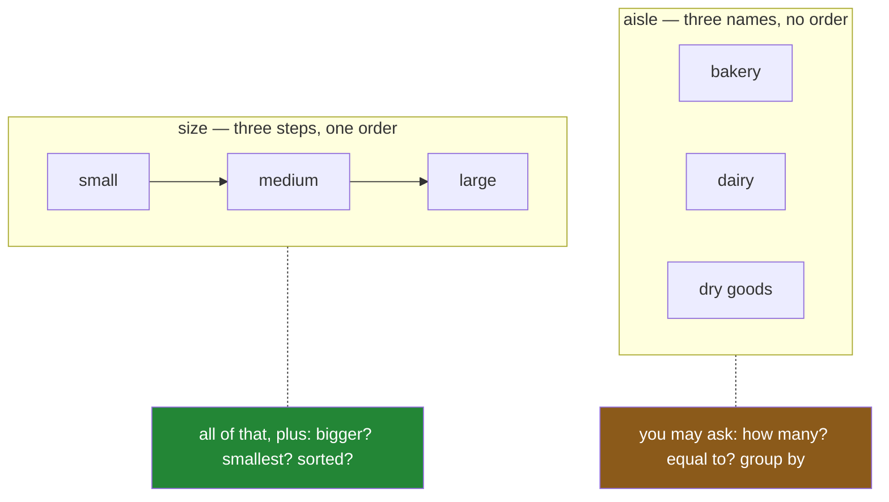

# 3.1 — Nominal and ordinal — two kinds of label

## One-line answer

Some columns of short words have a real order in them and some do not, and **nothing in the values
themselves says which** — so pandas puts both in alphabetical order and is right about one of them by
accident.

---

## The story

The flat's shopping list has a column for the pack size: small, medium, large.

The flatmate who does the shop asked for the list sorted by pack size, so that the big heavy packs
come out at the top and go in the bottom of the bag. That is the whole request. It is not a clever
request; it is the request anybody would make.

The printout came back like this:

```text
    item    size
0   milk   large
3   rice   large
2   eggs  medium
1  bread   small
```

Large first. Which is what was asked for, except that nobody asked for it and it is a coincidence.
The next week somebody added a bigger pack to the file and the printout came back with the biggest
pack in the *middle*, and that is when the flat worked out what had happened.

The computer had put the words in alphabetical order. `large` starts with an l, `medium` with an m,
`small` with an s. l, m, s. The list came out large, medium, small because that is the alphabet, and
the alphabet agreed with the pack sizes by pure luck.

The interesting part is the other column. The shop-part column — dairy, bakery, dry goods — came out
alphabetical too: bakery, dairy, dry goods. Nobody complained about that one, and nobody ever will,
because there is no order those three are *supposed* to be in. Alphabetical is as good as anything.

So the same rule was applied to both columns. It was harmless in one and wrong in the other, and the
file gives you no way at all to tell them apart.

---

## The idea in plain language

Both of those columns hold short words drawn from a small fixed list. In every other respect they
are different kinds of thing, and the difference has names.

A column whose values are simply **names for separate boxes** is called **nominal** — from the Latin
word for *name*. Dairy, bakery and dry goods are three names. No one of them is more than another.
You can count them, group by them, and ask whether a row equals one of them. You cannot ask which is
bigger, because the question has no answer.

A column whose values are **steps on a scale** is called **ordinal** — from the Latin for *order*.
Small, medium and large are three steps, and they come in that order whether anybody writes it down
or not. Everything you can do with a nominal column you can also do with this one, and on top of
that you can ask which is bigger, which is smallest, and what the list looks like sorted properly.

Those two words — nominal and ordinal — are the ones this section is named after, and they are worth
learning because they turn a vague feeling ("that report looks wrong") into a precise statement
("`size` is ordinal and it was sorted as text"). They come from *On the Theory of Scales of
Measurement* (1946, DOI 10.1126/science.103.2684.677,
<https://doi.org/10.1126/science.103.2684.677>), which set out four levels a measurement can sit at;
the two above are the bottom two, and they are the two that a column of words can be.

Three things follow, and each one matters later today.

**The difference is not in the data.** It is in what the words mean, and that meaning lives in a
person's head or in a written-down rule. A file of the letters s-m-a-l-l carries no hint that small
is less than medium. This is why the fix in
[3.2](3.2-categoricaldtype-the-order-written-down.md) is a *declaration* — somebody has to say it —
and not something pandas could work out for itself if it tried harder.

**An ordinal column tells you the order and not the gaps.** Small to medium is a step, and medium to
large is a step, and there is nothing in the words to say the two steps are the same size. So you
can sort these values and take the smallest and the largest, and you cannot take an average of them.
"The average pack size was 2.04" is a sentence with no meaning, and it is a sentence that a program
will happily produce if you map the words to 1, 2, 3 and stop thinking.

**Turning a categorical column into text throws the answer away.** A **categorical** column is one
stored as a short list of the distinct values plus one small number per row saying which of them that
row holds ([2.1](../02-the-category-dtype/2.1-two-arrays-instead-of-one.md)). That list of distinct
values has an order — it has to, it is a list — but by default the order is alphabetical and means
nothing. The **dtype**, which is the promise a column makes about every value in it
([Day 26, 1.4](../../../day-26-frames-and-copy-on-write/parts/01-the-two-objects/1.4-one-dtype-per-column.md)),
carries a flag for exactly this question, and until somebody sets it the answer is "no order here".

This part does not set that flag. It shows you why it exists.

---

## Why Setu needs it

- **[3.2](3.2-categoricaldtype-the-order-written-down.md), next**, is how the order gets written down
  so that pandas can use it. This part is the reason there is anything to write down.
- **[3.3](3.3-comparing-and-sorting-an-ordered-category.md)** is what the declared order buys you:
  `<`, `min`, `max`, a `sort_values` that is right, and a `groupby` whose rows come out in the order a
  human would put them in.
- **[6.5](../06-the-quality-report/6.5-built-in-plotting-the-fastest-look.md)** draws a bar chart
  straight off a grouped column. The bars come out in whatever order the column is in, so a chart of
  an ordinal column that nobody declared is a chart with a scrambled x axis.
- **Day 39**'s work on distributions (`VIZ-05`) assumes the buckets along the bottom of a chart are in
  order. For a numeric column they are; for a word column they are only in order if somebody said so.
- **Day 45**'s encoding of categorical columns for a model is exactly this distinction, and getting it
  wrong costs accuracy in two opposite ways. Encode a nominal column as 1, 2, 3 and the model is told
  that dry goods is three times bakery, which is not a fact. Encode an ordinal column as separate
  yes/no columns and the model is never told that large is more than medium, which is a fact you had
  and threw away.
- **Day 176**'s evaluation of a retriever grades each returned passage — not relevant, partly
  relevant, relevant. Those grades are ordinal, and a scoring script that sorts them as text ranks the
  partly relevant results above the relevant ones.

---

## The mechanism

Start from the four lines on the envelope, and ask for the sort that the story asked for.

```python
import pandas as pd

shop = pd.DataFrame(
    {
        "item": pd.Series(["milk", "bread", "eggs", "rice"], dtype="str"),
        "aisle": pd.Series(["dairy", "bakery", "dairy", "dry goods"], dtype="str"),
        "size": pd.Series(["large", "small", "medium", "large"], dtype="str"),
        "price": [1.15, 1.40, 2.60, 3.05],
        "need": [2, 1, 1, 1],
    }
)
print(shop.sort_values("size")[["item", "size"]])
print()
print("smallest pack:", shop["size"].min())
print("largest pack :", shop["size"].max())
```

**Line by line:**

- `dtype="str"` written out on each text column rather than left to inference. pandas 3.0 would infer
  `str` anyway, but a stated dtype is what makes the result the same on a machine whose PyArrow
  install is different
  ([Day 26, 2.2](../../../day-26-frames-and-copy-on-write/parts/02-the-str-dtype/2.2-str-the-dtype-pandas-3-infers.md)).
- `sort_values("size")` — sort the rows by one column, ascending by default, returning a new frame
  ([Day 29, 4.1](../../../day-29-iteration-and-order/parts/04-sorting/4.1-sort-values-the-order-you-asked-for.md)).
  Nothing here is unusual or wrong; this is the ordinary call.
- `[["item", "size"]]` after the sort, so the printout is two columns wide and the order is the thing
  you look at. The double brackets select a list of columns and give back a frame.
- `.min()` and `.max()` on a text column compare the values the way Python compares strings — letter
  by letter, using each character's code point
  ([Day 05, 1.3](../../../day-05-operators-and-conditionals/parts/01-operators/1.3-comparison-and-chaining.md)).
  They are printed here because they are the shortest possible demonstration of what the column
  believes about itself.

```text
    item    size
0   milk   large
3   rice   large
2   eggs  medium
1  bread   small

smallest pack: large
largest pack : small
```

**`smallest pack: large`.** No error, no warning, no hint. The column was asked a question it has no
way of answering correctly and it answered anyway, because as far as it knows these are four pieces
of text and text has a well-defined order.

Now put the two columns side by side, and add the conversion from
[2.1](../02-the-category-dtype/2.1-two-arrays-instead-of-one.md) to show that it changes nothing here:

```python
import pandas as pd

aisle = pd.Series(["dairy", "bakery", "dairy", "dry goods"], dtype="str")
size = pd.Series(["large", "small", "medium", "large"], dtype="str")
print("aisle sorted:", aisle.sort_values().tolist())
print("size  sorted:", size.sort_values().tolist())
print()
print("aisle as category:", aisle.astype("category").cat.categories.tolist())
print("size  as category:", size.astype("category").cat.categories.tolist())
```

**Line by line:**

- Two Series rather than a frame, because the question is about one column at a time and a frame would
  put an index column in the way.
- `.sort_values()` with no argument — on a Series there is only one column to sort by, so it takes none.
- `.tolist()` turns the sorted Series into an ordinary Python list, so the printout is one short line
  instead of four numbered ones.
- `.astype("category")` — the conversion to the categorical dtype. It is here to make a point, not to
  fix anything.
- `.cat.categories` — the list of distinct values that the categorical dtype keeps. `.cat` is the
  categorical accessor, the way to reach inside the dtype
  ([2.1](../02-the-category-dtype/2.1-two-arrays-instead-of-one.md)).

```text
aisle sorted: ['bakery', 'dairy', 'dairy', 'dry goods']
size  sorted: ['large', 'large', 'medium', 'small']

aisle as category: ['bakery', 'dairy', 'dry goods']
size  as category: ['large', 'medium', 'small']
```

Read the last two lines again. **Converting to a categorical column did not help.** The category list
for `size` came out `['large', 'medium', 'small']`, which is the alphabet, because `astype("category")`
finds the distinct values and sorts them and has no more idea than you do which kind of column this is.
The categorical dtype is where the fix will live, but it is not itself the fix.

Here are the two kinds of column, drawn:



The arrows are the whole difference, and the arrows are not in the file.

Finally, the scale at which this stops being a curiosity. The year's file is the same four items,
three aisles and three sizes, two hundred and forty thousand times over, built with a seeded
generator so the numbers below are reproducible
([Day 20, 4.2](../../../day-20-arrays-and-dtypes/parts/04-random/4.2-the-seed-is-part-of-the-result.md)):

```python
import numpy as np
import pandas as pd

ITEMS = ["milk", "bread", "eggs", "rice"]
AISLES = ["bakery", "dairy", "dry goods"]
SIZES = ["small", "medium", "large"]


def a_year(n: int = 240_000) -> pd.DataFrame:
    """A year of the flat's shopping: the same few words, over and over."""
    rng = np.random.default_rng(34)
    return pd.DataFrame(
        {
            "item": pd.Series(rng.choice(ITEMS, n), dtype="str"),
            "aisle": pd.Series(rng.choice(AISLES, n), dtype="str"),
            "size": pd.Series(rng.choice(SIZES, n), dtype="str"),
            "price": np.round(rng.uniform(0.40, 6.00, n), 2),
        }
    )


year = a_year()
print(year.groupby("size", observed=True)["price"].agg(["count", "mean"]).round(2))
```

**Line by line:**

- `SIZES = ["small", "medium", "large"]` is written in the *real* order, not alphabetically, even
  though at this point nothing uses that fact. It is the order a human would say them in, and
  [3.2](3.2-categoricaldtype-the-order-written-down.md) is about turning that list into something
  pandas obeys.
- `np.random.default_rng(34)` — the day number as the seed, and the generator object rather than the
  older global functions, so this frame is the same frame every run. **The draws happen in the order
  the columns are written**, so this must stay one function with a fixed body or the numbers move.
- `rng.choice(SIZES, n)` picks `n` values from the three words, with replacement.
- `groupby("size", observed=True)` — split the rows into one group per distinct size and compute
  something for each ([Day 31, 2.1](../../../day-31-groupby/parts/02-aggregating/2.1-one-number-for-each-group.md)).
  `observed=True` is stated because on a categorical column the default would also produce groups for
  categories that no row uses, which is a whole subject of its own
  ([Day 31, 4.5](../../../day-31-groupby/parts/04-the-keys/4.5-observed-and-the-aisle-nobody-visited.md)).
- `.agg(["count", "mean"])` asks for two numbers per group in one pass, giving a two-column frame.
- `.round(2)` on the result rather than on the prices, because this is a printout and two decimal
  places is what a price looks like.

```text
        count  mean
size
large   79985   3.2
medium  79894   3.2
small   80121   3.2
```

**A report about pack sizes that reads large, medium, small.** Nobody wrote that order down and
nobody wanted it. The rows come out in the order the group keys sort in
([Day 31, 4.2](../../../day-31-groupby/parts/04-the-keys/4.2-sort-and-the-order-of-the-groups.md)), and
the group keys are text, so they sort as text. Every table, every chart and every export downstream of
this line inherits the same backwards order.

---

## When it breaks

The honest first answer is that **it does not break**. There is no error anywhere above. A report came
out in a misleading order and every function involved did exactly what it promised. That is the
failure mode of this whole subject, and it is why the section exists.

What does break is the first thing people reach for to fix it. If you have sorted a Python list with
a custom rule before, you reach for the `key=` argument
([Day 08, 1.5](../../../day-08-containers/parts/01-sequences/1.5-sort-sorted-and-key.md)):

```text
$ uv run python -c "
import pandas as pd
SIZES = ['small', 'medium', 'large']
shop = pd.DataFrame({
    'item': pd.Series(['milk', 'bread', 'eggs', 'rice'], dtype='str'),
    'size': pd.Series(['large', 'small', 'medium', 'large'], dtype='str'),
})
print(shop.sort_values('size', key=lambda value: SIZES.index(value)))
"
```

```text
  File "<string>", line 5, in <module>
  File ".venv\Lib\site-packages\pandas\core\frame.py", line 8372, in sort_values
    indexer = nargsort(
              ^^^^^^^^^
  File ".venv\Lib\site-packages\pandas\core\sorting.py", line 404, in nargsort
    items = ensure_key_mapped(items, key)
            ^^^^^^^^^^^^^^^^^^^^^^^^^^^^^
  File ".venv\Lib\site-packages\pandas\core\sorting.py", line 574, in ensure_key_mapped
    result = key(values.copy())
             ^^^^^^^^^^^^^^^^^^
  File "<string>", line 5, in <lambda>
  File ".venv\Lib\site-packages\pandas\core\generic.py", line 1501, in __bool__
    raise ValueError(
ValueError: The truth value of a Series is ambiguous. Use a.empty, a.bool(), a.item(), a.any() or a.all().
```

**What it means.** `sorted`'s `key=` is handed one element at a time. `sort_values`' `key=` is handed
the **whole column at once**, as a Series, and is expected to return a whole column back. So
`SIZES.index(value)` was called with a four-row Series instead of the word `large`. `list.index` looks
for its argument by comparing it with `==`, the comparison produced a column of four booleans, and
`list.index` then tried to treat that column as a single yes-or-no answer. A Series refuses to be one,
because four answers are not one answer, and the message you get is about truth values rather than
about sorting.

The smallest fix that gets past this error is to make the key vectorised — `key=lambda column:
column.map({"small": 0, "medium": 1, "large": 2})` returns a whole column and works. It is also the
wrong fix, and it is worth seeing why before
[3.2](3.2-categoricaldtype-the-order-written-down.md) offers the right one. That lambda states the
order at the one call site that needed it. The next `sort_values`, the next `groupby`, the next
`min()` and the next chart each need their own copy of the same three-line map, and the first one
that gets it wrong or forgets a value is a bug that nothing detects. **The order belongs to the
column, not to the sort.**

---

## In production

**What a professional does instead of the teaching version.** Which columns are ordinal is written
down once, in the place that describes the data — a schema file, a data dictionary, the docstring of
the loader — before anybody sorts anything. It is not rediscovered by whoever is looking at the
report. On this day that written-down place is the module-level `SIZES` list, which
[3.2](3.2-categoricaldtype-the-order-written-down.md) turns into a dtype and
[7.1](../07-the-module/7.1-the-audit-module.md) puts into `src/setu/audit.py`.

**The failure that only shows with real data.** The alphabetical answer was wrong from the first day,
but it *looked* right, because with these three particular English words the alphabet runs large,
medium, small — a clean reverse of the truth. Anyone glancing at the report saw a sensible descending
order. Then the flat started buying a bigger pack:

```python
import pandas as pd

three = pd.Series(["large", "small", "medium", "large"], dtype="str")
four = pd.Series(["large", "small", "medium", "extra large"], dtype="str")
print("three sizes sorted:", three.sort_values().unique().tolist())
print("four  sizes sorted:", four.sort_values().unique().tolist())
print()
print("three: max is", three.max())
print("four : max is", four.max())
```

**Line by line:**

- Two Series holding the same kind of value, one of which has met a fourth word. This is what an
  upstream change looks like from inside your code: nothing is announced, a new value simply appears.
- `.sort_values().unique()` — sort first, then take the distinct values **in the order they now
  appear**. `unique` keeps first-seen order rather than sorting, so doing it after the sort is what
  makes the printout show the sort's opinion.
- `.max()` on both, because the reduction is the shortest way to show that the column's idea of
  "biggest" did not improve when the data got richer.

```text
three sizes sorted: ['large', 'medium', 'small']
four  sizes sorted: ['extra large', 'large', 'medium', 'small']

three: max is small
four : max is small
```

**The biggest pack in the shop now sorts first, and `max` still says `small`.** One new value moved
the report's shape without moving anything anybody would have thought to test. A test that asserted
the old three-row order would now fail for the right reason by luck; a test that asserted `max()` was
`small` would still pass, and it was always asserting nonsense.

**What changes at scale.** Nothing about the ordering, which is the point worth making. This is not a
bug that appears at ten million rows and hides at four; it is present and equally wrong at every size.
What scale changes is your ability to *notice*. On four rows you read the printout and see the order.
On two hundred and forty thousand rows you read a three-row grouped summary, and a three-row summary
in the wrong order looks exactly like a three-row summary in the right order.

**The review comment a senior engineer leaves.** *"`size` is ordinal — small, medium, large — and this
`sort_values` is putting it in alphabetical order, so the report reads backwards. Do not fix it at
this call site; declare the order on the column where it is read, so that every later `sort`,
`groupby` and chart gets it for free."*

**The interview question.** *"What is the difference between a nominal and an ordinal column, and why
does it matter to your code?"* Nominal values are names for boxes and only support counting, grouping
and equality. Ordinal values are steps on a scale and additionally support comparison, `min`, `max`
and a meaningful sort. The part that separates people who have hit this from people who have read
about it is the follow-up: **the distinction is not in the data**, so a program that is not told will
sort alphabetically and never raise — and an ordinal column tells you the order but not the size of
the gaps, so a mean of small, medium and large is not a number that means anything, however cleanly it
computes.

---

## Check yourself

```bash
uv run python -c "
import pandas as pd
aisle = pd.Series(['dairy', 'bakery', 'dairy', 'dry goods'], dtype='str')
size = pd.Series(['large', 'small', 'medium', 'large'], dtype='str')
for name, column in [('aisle', aisle), ('size ', size)]:
    print(name, 'sorted:', column.sort_values().unique().tolist(), ' max:', column.max())
"
```

Two columns, the same call, two sorted lists. One of those lists is fine and one of them is wrong. Say
which, say how you know, and say what in the printed output could have told a program the difference.

**Answer out loud, without scrolling up:**

> Say what makes a column ordinal rather than nominal, using the shopping list to make it concrete.
> Then say why `sort_values` cannot work it out for itself, and name one thing you are allowed to do
> with an ordinal column that you are not allowed to do with a nominal one — and one thing you are
> not allowed to do with either.

---

**Next:** [3.2 — `CategoricalDtype`, the order written
down](3.2-categoricaldtype-the-order-written-down.md).
