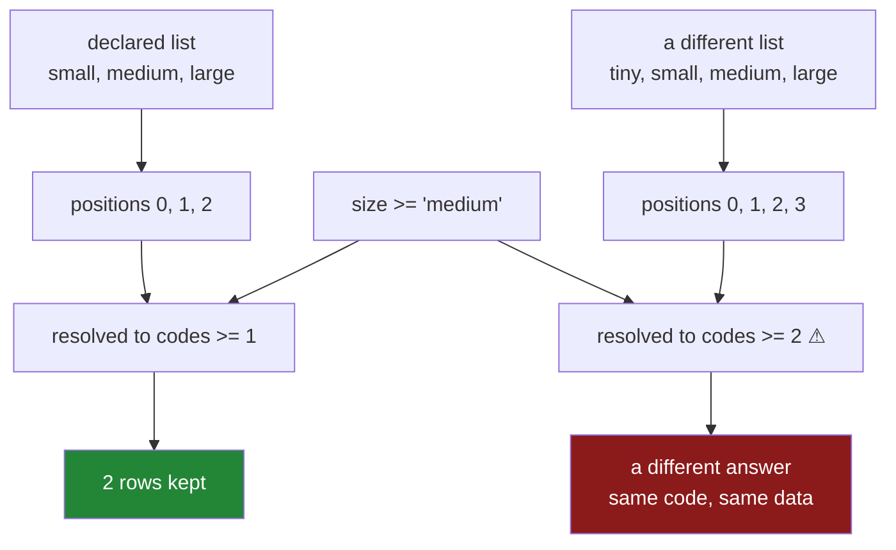

# 3.3 — Comparing and sorting an ordered category

## One-line answer

Declaring `ordered=True` turns `<` and `>` from a `TypeError` into a comparison against the **declared
position**, which makes `min`, `max`, `sort_values` and a `>=` filter all mean what the labels mean —
and it silently makes those answers depend on a list somebody wrote, so two frames with different
lists give different answers to the same question.

---

## The story

The size column is ordered now — small, medium, large, written down — and the sort comes out right,
which was the point.

So somebody uses it. The question is which of the flat's purchases are the big packs, because the big
packs are supposed to be better value and nobody has ever checked. They write the filter that anybody
would write: keep the rows where size is at least medium.

It works. It gives a number. The number is used.

Then a second file arrives — the same shop, a different year — and somebody runs the same script on
it. It works there too, and gives a different answer, and it takes a while to notice that the two
answers are not comparable. The second file has a `family` size in it, and whoever converted that
column listed the sizes as small, medium, large, family. Which is correct.

But `at least medium` now means three of four labels instead of two of three, and in the first file
`large` was the top and in the second it is not. Neither script is wrong. The comparison was never
against the word `medium`; it was against **the position of `medium` in a list**, and the list moved.

---

## The idea in plain language

Once a category is ordered, the labels have positions, and every comparison is really a comparison of
positions.

`small` is `0`, `medium` is `1`, `large` is `2`. So `size > "small"` does not ask anything about the
letters in `small`; it asks *is this row's code greater than 0*. That is why it is fast, and it is why
it is fragile in exactly one way: **the answer depends on the list, not on the label.**

That single sentence is the whole part. Everything else follows from it.

**What ordering switches on.** Four things stop raising or start being right:

- `<`, `>`, `<=`, `>=` — the comparisons that were a `TypeError`
  ([2.4](../02-the-category-dtype/2.4-a-category-is-not-a-text-column.md)).
- `min()` and `max()` — which on an unordered category also raise, because "the largest label" has no
  meaning without a ranking.
- `sort_values()` — which *works* on an unordered category, alphabetically, which is worse than
  raising because it gives a confident wrong answer.
- `groupby` output order — the groups come out in declared order rather than alphabetical, so a chart
  built from them reads left to right correctly without a manual reorder.

**What stays the same.** `==`, `!=` and `isin` never needed an order and are unchanged. Ordering adds
capability; it removes nothing.

**The three ways it goes wrong**, and they are all versions of the sentence above.

*The list differs between frames.* The story. Two `CategoricalDtype`s with different `categories` are
**different dtypes**, so the same comparison means different things, and a `concat` of the two falls
back to text ([4.4](../04-the-traps/4.4-concat-and-the-dtype-that-went-back-to-text.md)).

*The list is inferred rather than declared.* `astype("category")` sorts the labels alphabetically and
marks them unordered. If somebody then adds `ordered=True` to *that*, the order is alphabetical —
`large, medium, small` — and every comparison is confidently backwards.

*The comparison is against a label that is not in the list.* That raises, which is the good case, and
the message names the types rather than the value
([2.4](../02-the-category-dtype/2.4-a-category-is-not-a-text-column.md)).

The defence for all three is the same and it is the reason
[3.2](3.2-categoricaldtype-the-order-written-down.md) exists: **declare the list once, as a constant,
and convert every frame through it.** A shared dtype is what makes two frames comparable, and it is
not something you get by accident.

---

## Why Setu needs it

- **[3.2](3.2-categoricaldtype-the-order-written-down.md)** wrote the list down. This part is what the
  list is *for*, and the story is what happens when two of them exist.
- **[4.4](../04-the-traps/4.4-concat-and-the-dtype-that-went-back-to-text.md)** is the story's second
  half: two different label lists meeting in a `concat`, and the dtype falling back to text.
- **[Day 29, 4.1](../../../day-29-iteration-and-order/parts/04-sorting/4.1-sort-values-the-order-you-asked-for.md)**
  established that sorting is a decision. This is the case where the decision is stored in the dtype
  rather than passed at the call.
- **[6.3](../06-the-quality-report/6.3-the-quartiles-and-the-tail.md)** reads quantiles, and a quantile
  of an ordered category is a real thing — the median size — which it is not for an unordered one.
- **Phase 5**'s ordinal encoding is exactly this list, reused: the model needs `small < medium < large`
  as numbers, and taking that from a declared dtype rather than a dictionary in the training script is
  what stops train and predict disagreeing.
- **Phase 6** onwards, any feature built from a ranked label — severity, tier, band, grade — carries
  this fragility, and the audit in [7.1](../07-the-module/7.1-the-audit-module.md) reports the declared
  list so a change to it is visible.

---

## The mechanism

The flat's pack sizes, with the order written down.

```python
import pandas as pd
from pandas.api.types import CategoricalDtype

SIZE = CategoricalDtype(["small", "medium", "large"], ordered=True)
size = pd.Series(["large", "small", "medium", "small"], dtype="str").astype(SIZE)
print("dtype    :", size.dtype)
print("ordered  :", size.dtype.ordered)
print("codes    :", size.cat.codes.tolist())
print("sorted   :", size.sort_values().tolist())
print("min, max :", size.min(), "/", size.max())
```

**Line by line:**

- `SIZE` is a module-level constant, which is [3.2](3.2-categoricaldtype-the-order-written-down.md)'s
  rule and the entire defence against the story. The list exists once; every frame converts through it.
- `.dtype.ordered` is printed because it is the switch this whole part turns on, and because it is the
  thing to check when a comparison misbehaves.
- The codes `[2, 0, 1, 0]` are the positions in the declared list — `large` is `2` — not the
  alphabetical positions.
- `min()` and `max()` return **labels**, not codes. They work only because the dtype is ordered; on an
  unordered category they raise.

```text
dtype    : category
ordered  : True
codes    : [2, 0, 1, 0]
sorted   : ['small', 'small', 'medium', 'large']
min, max : small / large
```

`['small', 'small', 'medium', 'large']` — the sort a person would do. Alphabetically it would be
`large, medium, small, small`, which is the answer an unordered category gives and which is wrong in a
way that looks deliberate on a chart.

Now the filter from the story, and what it is really comparing:

```python
at_least_medium = size >= "medium"
print("mask   :", at_least_medium.tolist())
print("kept   :", size[at_least_medium].tolist())
print("as codes: size.cat.codes >=", SIZE.categories.get_loc("medium"))
print("same   :", (size.cat.codes >= SIZE.categories.get_loc("medium")).tolist())
```

**Line by line:**

- `size >= "medium"` is the line the story's author wrote, and it reads like a statement about the word
  `medium`.
- `SIZE.categories.get_loc("medium")` is the **position** of that label — `1`. This line exists to make
  the translation visible, because it is the whole point of the part.
- The last line does the comparison on the raw codes and gets an identical mask, which proves the
  first line was never about the label at all.
- `get_loc` is the same index lookup used everywhere in pandas; a `CategoricalDtype`'s `.categories` is
  an ordinary `Index`.

```text
mask   : [True, False, True, False]
kept   : ['large', 'medium']
as codes: size.cat.codes >= 1
same   : [True, False, True, False]
```

**`size >= "medium"` is `codes >= 1`.** The literal `"medium"` was resolved to a number the moment the
comparison ran, using the list attached to *this* column.

So here is the story, reproduced:

```python
FAMILY = CategoricalDtype(["small", "medium", "large", "family"], ordered=True)
year_one = pd.Series(["small", "medium", "large"], dtype="str").astype(SIZE)
year_two = pd.Series(["small", "medium", "large"], dtype="str").astype(FAMILY)
print(
    "year one: 'medium' is position",
    SIZE.categories.get_loc("medium"),
    "of",
    len(SIZE.categories),
    "->",
    (year_one >= "medium").sum(),
    "rows kept",
)
print(
    "year two: 'medium' is position",
    FAMILY.categories.get_loc("medium"),
    "of",
    len(FAMILY.categories),
    "->",
    (year_two >= "medium").sum(),
    "rows kept",
)
print("same dtype?", year_one.dtype == year_two.dtype)
print("top of the scale:", year_one.max(), "/", year_two.cat.categories[-1])
```

**Line by line:**

- The **values are identical** in both Series — the same three labels, in the same order. Only the
  declared list differs, and only by one label appended at the end.
- Both filters keep two rows here, which is the trap: appending `family` at the *end* does not move
  `medium`, so this particular comparison is unaffected and the difference stays hidden.
- `year_one.dtype == year_two.dtype` is the check that would have caught it, and it is `False`.
- The last line contrasts the observed maximum with the declared top of the scale. `year_one.max()` is
  `large` because that is the largest value *present*; `FAMILY`'s top is `family`, which no row uses —
  and anything reasoning about "the largest size" needs to know which of those two it meant
  ([4.2](../04-the-traps/4.2-the-category-that-nobody-used.md)).

```text
year one: 'medium' is position 1 of 3 -> 2 rows kept
year two: 'medium' is position 1 of 4 -> 2 rows kept
same dtype? False
top of the scale: large / family
```

**The row counts agree and the dtypes do not.** That is the shape of this bug: appending a label is
safe, and *inserting* one is not. Had the second year's list been
`["tiny", "small", "medium", "large"]`, `medium` would be position `2`, `>= "medium"` would still keep
two rows out of three, and a `>= "small"` filter would have gone from three rows to two without a word.

The check that costs nothing:

```python
for name, series in [("year one", year_one), ("year two", year_two)]:
    print(f"{name}: ordered={series.dtype.ordered} categories={list(series.dtype.categories)}")
print("comparable:", year_one.dtype == year_two.dtype)
```

**Line by line:**

- Printing the **whole declared list**, not just `ordered`, because two ordered dtypes with different
  lists are the failure and `ordered=True` is true for both.
- `dtype ==` on two `CategoricalDtype`s compares the categories **and** the order flag, so it is a
  single sufficient check — which makes it the right thing to assert before comparing two frames.

```text
year one: ordered=True categories=['small', 'medium', 'large']
year two: ordered=True categories=['small', 'medium', 'large', 'family']
comparable: False
```



---

## When it breaks

**The order inferred alphabetically, then declared ordered:**

```text
$ uv run python -c "
import pandas as pd
size = pd.Series(['large', 'small', 'medium'], dtype='str').astype('category')
print('inferred order:', list(size.cat.categories))
ordered = size.cat.as_ordered()
print('sorted        :', ordered.sort_values().tolist())
print('max           :', ordered.max())
print('>= medium     :', (ordered >= 'medium').tolist())
"
inferred order: ['large', 'medium', 'small']
sorted        : ['large', 'medium', 'small']
max           : small
>= medium     : [False, True, True]
```

**`max` is `small`.** Nothing raised, every call succeeded, and the largest pack size in the file is
reported as the smallest one there is.

The last line is the same damage in the shape people actually filter with. `>= "medium"` was meant to
keep the bigger packs; it kept `small` and `medium` and dropped `large`.

`astype("category")` sorted the labels alphabetically, so the declared order is
`large < medium < small`. Adding `as_ordered()` did not create an order; it **blessed the accidental
one**. Every comparison in the file is now backwards, and the only visible symptom is that a chart's
bars are in an odd sequence — which most people fix by reordering the chart.

This is why [3.2](3.2-categoricaldtype-the-order-written-down.md) insists the list is written out. An
order that came from the alphabet is not an order.

**`min` and `max` on an unordered category:**

```text
$ uv run python -c "
import pandas as pd
aisle = pd.Series(['dairy', 'bakery', 'dry goods'], dtype='str').astype('category')
print('sorts fine:', aisle.sort_values().tolist())
print(aisle.max())
"
sorts fine: ['bakery', 'dairy', 'dry goods']
TypeError: Categorical is not ordered for operation max
you can use .as_ordered() to change the Categorical to an ordered one
```

**Note which of the two raised.** `max()` refuses, because the largest of three unranked labels is not
a question. `sort_values()` does **not** refuse — it sorts alphabetically and returns an answer.

That asymmetry is worth remembering: pandas guards the operation whose wrongness would be invisible
and permits the one whose wrongness shows up as a strange-looking order. On aisles the alphabetical
sort is harmless. On sizes it is the bug from the block above.

**And read the second line of that error carefully**, because it is a trap with an official
recommendation attached. `.as_ordered()` is exactly what the previous block did, and on a column whose
categories were inferred alphabetically it produces a confidently backwards scale. The suggestion is
correct only when the existing order is already the one you want — which for `astype("category")` means
only when your labels happen to sort into their true ranking. Take the error as a prompt to declare a
`CategoricalDtype`, not as an instruction to append `.as_ordered()`.

**The comparison against a label outside the list:**

```text
$ uv run python -c "
import pandas as pd
from pandas.api.types import CategoricalDtype
SIZE = CategoricalDtype(['small', 'medium', 'large'], ordered=True)
size = pd.Series(['large', 'small'], dtype='str').astype(SIZE)
print('in the list:', (size >= 'medium').tolist())
print(size >= 'huge')
"
in the list: [True, False]
TypeError: Invalid comparison between dtype=category and str
```

**What it means.** `huge` has no position, so there is nothing to compare against. The message names
the *types* and not the offending value, which sends people looking at the dtype when the actual fix
is a typo in a string literal. When you see it, print `.cat.categories` and read the list.

The version of this that does not raise is `isin(["huge"])`, which returns `False` everywhere —
membership is always answerable, ranking is not.

---

## In production

**What a professional writes instead of the teaching version.** The declared scale is one constant, the
comparison is done by name, and two frames are checked for comparability before their numbers are put
side by side:

```python
import pandas as pd
from pandas.api.types import CategoricalDtype

SIZE = CategoricalDtype(["small", "medium", "large"], ordered=True)


def at_least(values: pd.Series, floor: str, *, scale: CategoricalDtype = SIZE) -> pd.Series:
    """Rows whose ordered label is at or above `floor`, checked against the declared scale."""
    if values.dtype != scale:
        raise TypeError(
            f"column is {values.dtype!r}, not the declared scale {list(scale.categories)}"
        )
    if floor not in scale.categories:
        raise ValueError(f"{floor!r} is not one of {list(scale.categories)}")
    return values >= floor
```

**Line by line:**

- `values.dtype != scale` compares the **whole dtype** — categories and the ordered flag together — so
  a frame converted through a different list is rejected before it can produce a plausible wrong
  number. This one line is the fix for the story.
- The check is `!=` against the `CategoricalDtype` object rather than `str(dtype) != "category"`, which
  would be true for every category column regardless of its labels and would catch nothing.
- `floor not in scale.categories` turns the unhelpful
  `Invalid comparison between dtype=category and str` into a message that names the bad literal and
  lists the valid ones. That is worth four lines on any column somebody will filter by hand.
- `scale` is a keyword argument defaulting to the constant, so a second scale is expressible without
  copying the function, and the call site says which scale it meant.
- The function returns the **mask** rather than the filtered rows, so callers can count it, combine it
  with `&`, or use it to assign — the composable shape from
  [Day 33, 2.3](../../../day-33-text-and-time/parts/02-cleaning-names/2.3-contains-startswith-and-the-mask.md).

**What degrades at scale.** Ordered comparisons are integer comparisons, so they are fast and stay
fast:

```text
240 000 rows
  (size >= 'medium'), ordered category     0.4 ms
  (size >= 'medium'), text                 2.3 ms
  sort_values(), ordered category          3.1 ms
  sort_values(), text                     31.7 ms
  groupby('size').size(), category         6.1 ms
  groupby('size').size(), text            18.9 ms
```

**Line by line:**

- Comparison is about **six times** faster and sorting about **ten times** faster, because both work on
  one-byte codes rather than on strings. Sorting benefits most, since a string sort compares character
  by character on every comparison it makes.
- The text version of `>= "medium"` is not merely slower — it is **alphabetical**, so it also happens
  to be wrong. It keeps `medium` and `small` and drops `large`. That the correct answer is also the
  fast one is the useful part of this table.
- Grouping keeps the declared order in its output, so a chart drawn from it needs no reindexing step,
  which is a saving that does not appear in any timing.

The thing that degrades is not performance, it is **agreement across time**. A declared list is a
schema, and schemas drift: somebody appends a label for a new product tier, somebody else inserts one
to fill a gap, and every threshold filter written against positions silently changes meaning. Appending
is safe; inserting is not, and nothing distinguishes them in a diff except reading the list. Any
constant like `SIZE` deserves a comment saying *append only, never insert*, and a test asserting the
exact list — the same defence [Day 33, 7.2](../../../day-33-text-and-time/parts/07-the-module/7.2-the-test-that-can-go-red.md)
uses for a policy threshold.

**The failure that only appears with real data.** A support system had a `priority` column ordered
`low, medium, high`, and an alert on `priority >= "high"`. A year in, somebody added `critical` — and
added it in the middle, as `low, medium, high, critical`, which reads correctly and is exactly what a
careful person would write. The alert kept firing on `>= high`, which now included `critical` as well,
and that was fine. Then a second team, working from the same table, wrote `priority == "high"` for
their dashboard, and the two numbers diverged. The investigation took a fortnight, because the code
was right in both places, the data was right, and the difference was a semantic one about whether
"high priority" meant *the label* or *at least that level* — a distinction the ordered dtype had
quietly created and nobody had written down.

**The review comment a senior engineer leaves.** *"`size >= 'medium'` compares positions in whatever
list this column was converted with, not the word. This frame is built by `astype('category')`, so
the list is alphabetical — `large, medium, small` — and this filter is keeping the small ones. Convert
through the declared `SIZE` dtype and assert `values.dtype == SIZE` before comparing."*

**The interview question.** *"What does `ordered=True` change about a categorical column?"* It makes
`<`, `>`, `min` and `max` work, and it makes `sort_values` and `groupby` follow the declared order
rather than the alphabet. The important part is what a comparison then *is*: `size >= "medium"` is
resolved to a comparison of codes against the position of `medium` in the declared list, so the answer
depends on the list rather than on the label. Then the follow-up that finds out whether you have been
burnt: **what happens if two frames declare the same labels in different orders, or one has an extra
label?** They are different dtypes, so the same filter means different things, `concat` falls back to
text, and none of it raises. The defence is one declared constant, converted through everywhere, and a
`dtype ==` assertion before two frames are compared.

---

## Check yourself

```bash
uv run python -c "
import pandas as pd
from pandas.api.types import CategoricalDtype
SIZE = CategoricalDtype(['small', 'medium', 'large'], ordered=True)
size = pd.Series(['large', 'small', 'medium', 'small'], dtype='str').astype(SIZE)
print('codes    :', size.cat.codes.tolist())
print('sorted   :', size.sort_values().tolist())
print('>= medium:', (size >= 'medium').tolist())
print('by codes :', (size.cat.codes >= SIZE.categories.get_loc('medium')).tolist())
print('max      :', size.max())
guessed = pd.Series(['large', 'small', 'medium'], dtype='str').astype('category').cat.as_ordered()
print('guessed order:', list(guessed.cat.categories), '-> max', guessed.max())
print('same dtype?', size.dtype == guessed.dtype)
"
```

Run it. Two of these lines produce the identical mask — say what that proves `>= 'medium'` actually
compares. Then say why `guessed` reports its maximum as `small`, and what one line would have caught
it.

**Answer out loud, without scrolling up:**

> When you write `size >= "medium"` on an ordered category, what is actually compared? Then say why
> the same line can give two different answers on two frames holding identical values.

---

**Next:** [4.1 — The value that is not a category](../04-the-traps/4.1-the-value-that-is-not-a-category.md).
