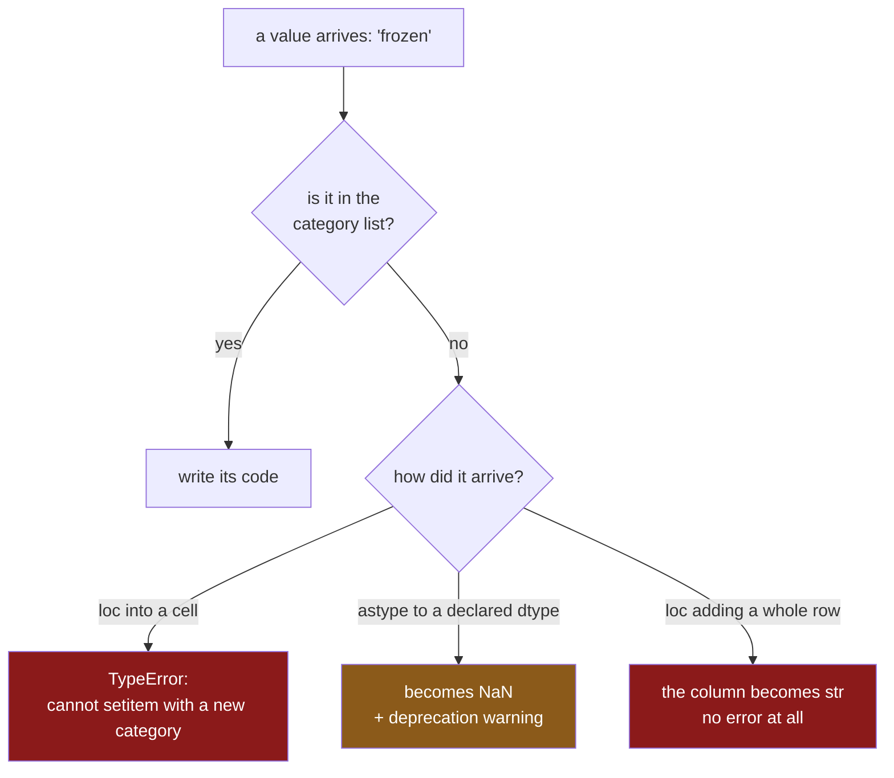

# 4.1 — The value that is not a category

## One-line answer

A categorical column has a **fixed list of allowed values**, and writing a value that is not on that
list either stops the program with a `TypeError` or quietly turns the whole column back into text —
so the list has to come from what the shop actually sells, not from the four rows you happened to
load.

---

## The story

The flat buys frozen peas.

This is new. For a year the list has had four things on it — milk, bread, eggs, rice — and three
places they come from: dairy, bakery, dry goods. Somebody wrote those three words down once, told
the file that those are the three, and everything has been fine.

Now there is a fifth thing on the list, and it comes from the freezer.

So they open the file, find the row, and type `frozen` into the shop-part column. And the program
stops. Not with a warning at the bottom, not with a wrong number three steps later — it stops,
saying it cannot put `frozen` there because `frozen` is not one of the allowed words.

The first reaction is annoyance. It is a word, it is the right word, and a shopping list should not
be arguing about it.

The second reaction, which takes longer, is the useful one. The file was told there are exactly
three places things come from. That was true when it was written and it is not true now. The fix is
to change the promise on purpose rather than to sneak a fourth word past it.

---

## The idea in plain language

A **categorical column** stores its values in two pieces
([2.1](../02-the-category-dtype/2.1-two-arrays-instead-of-one.md)). One is the **category list** —
every distinct value the column is allowed to hold, written out once. The other is the **codes
array** — one small whole number per row, saying which entry of the list that row means. Row zero
holding code `1` means "the value at position 1 of the list".

That is where the memory saving comes from, and it is also where the rule comes from. A code is a
position in a list. If a value has no position in the list, there is no number to store. `frozen`
is not the eighth word or the ninetieth word; it is not a word in that list at all, so there is
nothing pandas can write into the codes array to mean it.

Two ways out exist, and they are different decisions, not two spellings of the same one.

**Widen the list.** Add `frozen` to the category list, which gives it a position and makes the code
writable. The column stays categorical. This is right when the new value is genuinely legitimate —
the shop opened a freezer aisle.

**Refuse the value.** Decide that `frozen` is not allowed, and that a row carrying it is a row with
a problem. This is right when the new value is a typo, a rename nobody announced, or data from a
source that was never supposed to be in this file.

You cannot pick between those two without knowing where the list came from, and that is the real
lesson here: **a category list built by looking at your data can only ever describe your data.** If
the four rows in front of you say dairy, bakery and dry goods, then a list built from them claims
there are three aisles in the world. Nobody decided that. It is an accident of which rows arrived
first, and it will be wrong the first time a fifth row arrives.

A list built from an **authoritative source** — the shop's own aisle signage, the schema the
upstream team publishes, a constant at the top of your module — is a claim you can defend. It says
"these are the aisles, and anything else is a finding". That is why
[3.2](../03-order/3.2-categoricaldtype-the-order-written-down.md) put `SIZES` in a module-level list
before building a dtype from it.

One more term, because it shows up in the output below. A **blank**, written `NaN` when it prints,
is pandas' marker for "no value here"
([Day 30, 2.1](../../../day-30-missing-data/parts/02-finding-it/2.1-isna-and-notna.md)). A
categorical column can hold blanks: a blank is stored as the code `-1`, which means "no position",
and that is a legal code. So a value that is not in the list has exactly one place it can go
without raising — into the blanks.

---

## Why Setu needs it

- **[4.2](4.2-the-category-that-nobody-used.md), next**, is the mirror image. Here a value exists in
  the data and not in the list; there a value exists in the list and not in the data.
- **[4.4](4.4-concat-and-the-dtype-that-went-back-to-text.md)** depends entirely on this part: two
  frames whose category lists were each built from their own data will never match, so a `concat`
  between them cannot stay categorical.
- **[7.1](../07-the-module/7.1-the-audit-module.md)** builds `SIZE_DTYPE` from a module-level
  `SIZES` constant precisely because of this part, and `categorise()` asserts the resulting dtype
  rather than hoping. **Day 35** closes Phase 4 on that module, so a `categorise()` that quietly
  writes blanks instead of raising is the phase gate failing in the least visible way available.
- **Day 162**'s document store tags every chunk with the corpus it came from. When a new corpus is
  added and nobody updates the tag list, this exact `TypeError` is what tells you — and if it does
  not raise, the retriever will happily search a corpus whose name became a blank.

---

## The mechanism

Start with the four rows and make `aisle` categorical.

```python
import pandas as pd

shop = pd.DataFrame(
    {
        "item": pd.Series(["milk", "bread", "eggs", "rice"], dtype="str"),
        "aisle": pd.Series(["dairy", "bakery", "dairy", "dry goods"], dtype="str"),
        "size": pd.Series(["large", "small", "medium", "large"], dtype="str"),
        "price": [1.15, 1.40, 2.60, 3.05],
        "need": [2, 1, 1, 1],
    }
)
shop["aisle"] = shop["aisle"].astype("category")
print(shop.dtypes)
print(shop["aisle"].cat.categories)
```

**Line by line:**

- `dtype="str"` on each text column, stated rather than inferred. pandas 3.0 infers `str` for text
  anyway, but writing it is the pin (Principle 4) and it is what makes this snippet reproduce the
  same bytes on another machine
  ([Day 26, 2.2](../../../day-26-frames-and-copy-on-write/parts/02-the-str-dtype/2.2-str-the-dtype-pandas-3-infers.md)).
- `astype("category")` with no arguments. **This is the version that builds the list from the
  data** — it looks at the four values present, finds three distinct ones, sorts them, and calls
  that the category list. Nobody stated those three; the frame did.
- `.cat` is the accessor for categorical operations, the way `.str` is the accessor for text
  operations ([Day 33, 1.1](../../../day-33-text-and-time/parts/01-the-str-accessor/1.1-the-column-that-has-no-lower.md)).
  `.cat.categories` is the list itself.

```text
item          str
aisle    category
size          str
price     float64
need        int64
dtype: object
Index(['bakery', 'dairy', 'dry goods'], dtype='str')
```

Three categories, alphabetical, derived from four rows. Now write the new word into row zero.

```python
shop.loc[0, "aisle"] = "frozen"
```

**Line by line:**

- `.loc[0, "aisle"]` is the single-step assignment: one call, row label and column name together, so
  pandas writes into the frame rather than into a temporary copy
  ([Day 26, 4.3](../../../day-26-frames-and-copy-on-write/parts/04-chained-assignment/4.3-loc-the-single-step.md)).
  Nothing is wrong with the mechanics here; the problem is the value.
- `"frozen"` is a perfectly good string. It is simply not one of `bakery`, `dairy`, `dry goods`, so
  no code means it.

That raises; the traceback is in *When it breaks*. The fix, when the new value is a real one, is to
give it a position first.

```python
shop["aisle"] = shop["aisle"].cat.add_categories(["frozen"])
shop.loc[0, "aisle"] = "frozen"
print(shop["aisle"])
```

**Line by line:**

- `.cat.add_categories(["frozen"])` returns a **new Series** with a widened category list. It
  changes no values; it only makes one more value writable in future.
- The result is assigned back to `shop["aisle"]`. `.cat` methods do not modify in place — like
  nearly everything in pandas 3.0, they hand you a new object and leave the old one alone
  ([Day 26, 3.1](../../../day-26-frames-and-copy-on-write/parts/03-copy-on-write/3.1-every-result-behaves-like-a-copy.md)).
  Forgetting the assignment is the most common way this "fix" fixes nothing.
- The argument is a **list**, `["frozen"]`, not the bare string, which makes the intent unmistakable.
- Only now does the `.loc` assignment succeed.

```text
0       frozen
1       bakery
2        dairy
3    dry goods
Name: aisle, dtype: category
Categories (4, str): ['bakery', 'dairy', 'dry goods', 'frozen']
```

The column is still `category`, and the list now has four entries. Note that `frozen` went on the
end rather than into alphabetical position — `add_categories` appends. For an unordered column that
is irrelevant; for an ordered one it matters, which is
[3.3](../03-order/3.3-comparing-and-sorting-an-ordered-category.md)'s subject.

### The honest version: declare the list, then convert

`add_categories` patches a list that was wrong. The better move is not to build a wrong list. Write
the aisles down once, as a constant, and convert against that.

```python
import pandas as pd

AISLES = ["bakery", "dairy", "dry goods", "frozen"]
AISLE_DTYPE = pd.CategoricalDtype(categories=AISLES)

values = pd.Series(["dairy", "bakery", "frozen", "deli"], dtype="str")
unknown = sorted(set(values.dropna().unique()) - set(AISLE_DTYPE.categories))
print("unknown values:", unknown)

known = values.where(values.isin(AISLE_DTYPE.categories))
converted = known.astype(AISLE_DTYPE)
print(converted)
print("blanks introduced:", int(converted.isna().sum()))
```

**Line by line:**

- `AISLES` is sorted and module-level: the authoritative list of the four places the shop actually
  has, existing whether or not any row uses all four. It is the same constant
  [7.1](../07-the-module/7.1-the-audit-module.md) puts at the top of `src/setu/audit.py`.
- `pd.CategoricalDtype(categories=AISLES)` builds the dtype object separately from any data. A dtype
  you can name is a dtype you can assert against later, which is what
  [4.3](4.3-the-operation-that-gave-back-text.md) needs.
- `values.dropna().unique()` gives the distinct non-blank values present. Blanks are dropped first
  because a blank is not an unknown value; it is a known absence
  ([Day 26, 2.5](../../../day-26-frames-and-copy-on-write/parts/02-the-str-dtype/2.5-the-missing-value-in-a-text-column.md)).
- `set(...) - set(...)` is the set difference: everything in the data the declared list does not
  cover. **This line is the whole check**, and it runs before the conversion, while you can still do
  something about the answer.
- `.where(values.isin(...))` replaces anything not on the list with a blank, **explicitly**. Doing
  it yourself rather than letting `astype` do it silently is the difference between a decision and
  an accident — and pandas agrees, because the silent version warns, as *When it breaks* shows.
- `int(converted.isna().sum())` counts what the conversion cost, as a Python `int` because a NumPy
  integer in a log line or a JSON payload is an annoyance you pay for later.

```text
unknown values: ['deli']
0     dairy
1    bakery
2    frozen
3       NaN
dtype: category
Categories (4, str): ['bakery', 'dairy', 'dry goods', 'frozen']
blanks introduced: 1
```

`deli` was not on the list, so its row is now blank — and the printout says so, before the frame
goes anywhere else. The unknown value is a **finding**, named and counted, not a silent hole.

### The three neighbouring methods

```python
import pandas as pd

s = pd.Series(["dairy", "bakery", "dairy", "dry goods"], dtype="str").astype("category")
print("start :", list(s.cat.categories))
print("add   :", list(s.cat.add_categories(["frozen"]).cat.categories))
print(
    "set   :", list(s.cat.set_categories(["bakery", "dairy", "dry goods", "frozen"]).cat.categories)
)
print()
print(s.cat.set_categories(["bakery", "dairy"]))
```

**Line by line:**

- `add_categories` widens the list and can never change a value. It refuses to add something already
  present, which is a guard rail rather than an inconvenience.
- `set_categories` **replaces** the list outright. Widening with it gives the same categories as
  `add_categories`, in the order you wrote rather than appended — the reason to prefer it when order
  matters.
- `set_categories` with a **shorter** list is the dangerous one. Any row whose value is no longer on
  the list becomes a blank, with no error and no warning, because narrowing a list is a thing people
  legitimately want to do. `remove_categories` is the same operation stated the other way round.

```text
start : ['bakery', 'dairy', 'dry goods']
add   : ['bakery', 'dairy', 'dry goods', 'frozen']
set   : ['bakery', 'dairy', 'dry goods', 'frozen']

0     dairy
1    bakery
2     dairy
3       NaN
dtype: category
Categories (2, str): ['bakery', 'dairy']
```

Row three said `dry goods`. It now says nothing. **Narrowing a category list deletes data**, quietly,
one blank per affected row.



---

## When it breaks

The assignment that stops the program:

```text
$ uv run python -c "
import pandas as pd
shop = pd.DataFrame({'aisle': pd.Series(['dairy','bakery','dairy','dry goods'], dtype='str')})
shop['aisle'] = shop['aisle'].astype('category')
shop.loc[0, 'aisle'] = 'frozen'
"
```

```text
Traceback (most recent call last):
  File "<string>", line 5, in <module>
  File "...\pandas\core\indexing.py", line 938, in __setitem__
    iloc._setitem_with_indexer(indexer, value, self.name)
  File "...\pandas\core\indexing.py", line 2219, in _setitem_single_block
    self.obj._mgr = self.obj._mgr.setitem(indexer=indexer, value=value)
  File "...\pandas\core\internals\blocks.py", line 1669, in setitem
    values[indexer] = value
    ~~~~~~^^^^^^^^^
  File "...\pandas\core\arrays\_mixins.py", line 272, in __setitem__
    value = self._validate_setitem_value(value)
            ^^^^^^^^^^^^^^^^^^^^^^^^^^^^^^^^^^^
  File "...\pandas\core\arrays\categorical.py", line 1678, in _validate_scalar
    raise TypeError(
TypeError: Cannot setitem on a Categorical with a new category (frozen), set the categories first
```

**What it means.** Read the last line, then the frame above it. `_validate_scalar` is pandas
checking one value against the category list before it writes anything, and the message names the
offending value in brackets. `set the categories first` is not advice about `set_categories`
specifically; it means "widen the list, then write". This is the **good** failure: loud, immediate,
and it names the value.

The same value, arriving as a whole new row, is the bad failure:

```text
$ uv run python -c "
import pandas as pd
shop = pd.DataFrame({
    'item': pd.Series(['milk','bread','eggs','rice'], dtype='str'),
    'aisle': pd.Series(['dairy','bakery','dairy','dry goods'], dtype='str'),
    'price': [1.15, 1.40, 2.60, 3.05],
})
shop['aisle'] = shop['aisle'].astype('category')
print('before:', shop['aisle'].dtype)
shop.loc[4] = ['peas', 'frozen', 1.10]
print('after :', shop['aisle'].dtype)
print(shop)
"
```

```text
before: category
after : str
    item      aisle  price
0   milk      dairy   1.15
1  bread     bakery   1.40
2   eggs      dairy   2.60
3   rice  dry goods   3.05
4   peas     frozen   1.10
```

**What it means.** No traceback, no warning. The frame is correct, the new row is there, and the
column is no longer categorical — pandas widened the frame by one row, found it could not fit
`frozen` into the codes, and rebuilt the whole column as text. Every byte the conversion saved is
gone, and nothing said so. On four rows nobody notices; on the year file the same line takes the
column from 240 045 bytes to 3 520 426. That is the pattern this whole section is about, and it is
why [4.3](4.3-the-operation-that-gave-back-text.md) measures the cost rather than describing it.

The third variant is the silent one that pandas has decided to stop being silent about:

```text
$ uv run python -c "
import pandas as pd
AUTH = pd.CategoricalDtype(categories=['bakery', 'dairy', 'dry goods', 'frozen'])
raw = pd.Series(['dairy', 'frozen', 'deli', 'bakery'], dtype='str')
out = raw.astype(AUTH)
print(out.isna().sum(), 'blank(s)')
"
```

```text
<string>:5: Pandas4Warning: Constructing a Categorical with a dtype and values containing non-null
entries not in that dtype's categories is deprecated and will raise in a future version.
1 blank(s)
```

**What it means.** `astype` to a declared dtype currently turns unknown values into blanks and warns
that it will stop doing so. Treat the warning as the specification: **in pandas 4 this raises**, so
code that relies on the silent blank breaks on an upgrade. Write the `.where(values.isin(...))` mask
yourself, as the mechanism above does, and the behaviour is the same today and tomorrow.

Finally, `s.cat.add_categories(['dairy'])` on a column that already has `dairy` gives
`ValueError: new categories must not include old categories: {'dairy'}`. A loop that adds whatever
it saw in the latest batch hits that on the second batch; use `set_categories` with the full
intended list, which is idempotent.

---

## In production

**What a professional writes instead of the teaching version.** Not `astype("category")`. A named
function that takes the declared dtype, names anything the declaration does not cover, and lets the
caller choose whether that is fatal:

```python
import pandas as pd


class AuditError(ValueError):
    """A frame failed a check the pipeline depends on."""


def to_declared_category(
    frame: pd.DataFrame,
    column: str,
    dtype: pd.CategoricalDtype,
    *,
    strict: bool = True,
) -> pd.DataFrame:
    """Convert one column to a declared categorical dtype, naming any value the list omits."""
    values = frame[column]
    unknown = sorted(set(values.dropna().unique()) - set(dtype.categories))
    if unknown and strict:
        raise AuditError(
            f"{column}: {len(unknown)} value(s) not in the declared categories: {unknown}"
        )
    out = frame.copy()
    out[column] = values.where(values.isin(dtype.categories)).astype(dtype)
    return out
```

**Line by line:**

- `AuditError(ValueError)` rather than a bare `ValueError`, so a caller can catch this specifically
  and let a genuine programming `ValueError` through.
  [7.1](../07-the-module/7.1-the-audit-module.md) reuses the exception the earlier days already
  defined rather than minting a new one per day, and says why.
- `dtype: pd.CategoricalDtype` is a **parameter**, not a global read inside the function. The
  authoritative list belongs to the caller's domain, and passing it makes the helper testable
  against a fixture dtype.
- `*` before `strict`, because `to_declared_category(f, "aisle", D, False)` is unreadable at a call
  site. `strict: bool = True` defaults to raising: a helper whose default is to silently blank rows
  will silently blank rows.
- The set difference happens **before** any conversion, so the message can name the values. An error
  that says "conversion failed" costs an hour; one that says `['deli']` costs a minute.
- `frame.copy()` then assign, returning a new frame. The function never modifies its argument, which
  is the contract [7.1](../07-the-module/7.1-the-audit-module.md)'s `categorise()` keeps.
- `values.where(values.isin(dtype.categories))` masks first, so the deprecated silent path is never
  taken and the code behaves identically under pandas 4.

Run on a frame whose `aisle` column contains `deli`, the strict path raises
`AuditError: aisle: 1 value(s) not in the declared categories: ['deli']`, and the lenient path
returns the frame with that one row's aisle blank and the count reported.

**What changes at scale.** `values.dropna().unique()` is a full pass over the column, once per
categorical column at every stage that re-asserts the dtype. That is affordable, and the wrong thing
to optimise away. What genuinely changes is the **shape of the error**: on ten rows `unknown` is one
word, on a hundred million rows it can be forty thousand words. Truncate the list in the message and
log the full set separately, or the exception itself becomes the incident.

**The failure that only shows with real data.** An upstream team renamed an aisle from `dry goods`
to `dry-goods`. One character. Every row from the new export failed the declared list, and the
loader was running with `strict=False` because somebody had turned it off during a backfill. For
eleven days about a third of the rows carried a blank aisle and nothing raised. The weekly totals
stayed right, because they did not group by aisle. The aisle report was wrong in the direction that
looks like a business change: dry goods appeared to have collapsed.

**The review comment a senior engineer leaves.** *"`astype('category')` here builds the list out of
whichever rows this batch happened to contain, so every batch gets a different list and tomorrow's
`concat` silently drops back to text. Put the aisles in a module constant, build a
`CategoricalDtype` from it, convert against that, and keep the strict path on in the loader. If a
new aisle appears I would rather the job fail than find out from the dashboard."*

**The interview question.** *"You convert a column to `category` and later an assignment raises
`TypeError: Cannot setitem on a Categorical with a new category`. What do you do?"* The answer that
shows experience does not start with `add_categories`. It starts with a question: where did the
category list come from? If it came from `astype("category")` on a sample, the bug is the list, and
the fix is to declare it from an authoritative source. If it came from a declared constant and a
genuinely new value has appeared, update the constant — deliberately, in a commit somebody reviews —
and only then widen the dtype. The answer that fails is "cast it back to `str`", which trades a loud
error for a silent memory regression and a category list nobody controls.

---

## Check yourself

```bash
uv run python -c "
import pandas as pd
DTYPE = pd.CategoricalDtype(categories=['bakery', 'dairy', 'dry goods', 'frozen'])
raw = pd.Series(['dairy', 'frozen', 'deli', 'bakery'], dtype='str')
print('declared :', list(DTYPE.categories))
print('present  :', sorted(raw.unique()))
print('unknown  :', sorted(set(raw.dropna().unique()) - set(DTYPE.categories)))
print('unused   :', sorted(set(DTYPE.categories) - set(raw.dropna().unique())))
out = raw.where(raw.isin(DTYPE.categories)).astype(DTYPE)
print('blanks   :', int(out.isna().sum()))
"
```

Two set differences, in opposite directions. One is this part, the other is
[4.2](4.2-the-category-that-nobody-used.md). Say which is which.

**Answer out loud, without scrolling up:**

> A column is `category`, and `df.loc[0, "aisle"] = "frozen"` raises. The same value arriving as
> `df.loc[4] = [...]` does not raise. Say what happened to the column in the second case, and say
> which of the two outcomes you would rather have in a nightly job.

---

**Next:** [4.2 — The category that nobody used](4.2-the-category-that-nobody-used.md).
