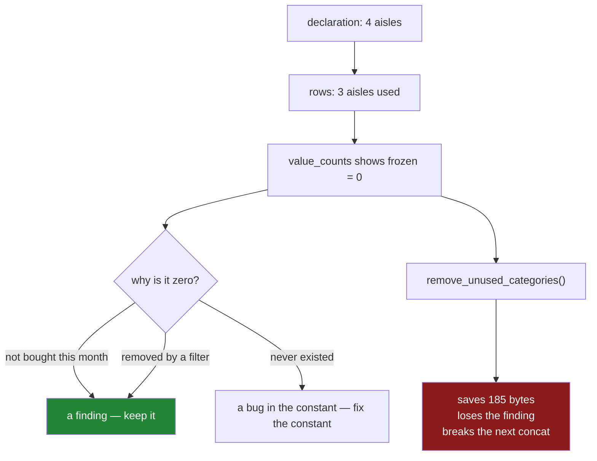

# 4.2 — The category that nobody used

## One-line answer

A category that is declared but appears in no row still shows up in `value_counts`, still produces a
group, and still survives every filter — and that zero is usually the most interesting number on the
report, so `remove_unused_categories()` is a decision you make on purpose rather than a tidy-up.

---

## The story

The flat did the freezer thing properly. Somebody wrote down all four places the shop is divided
into — dairy, bakery, dry goods, frozen — and the file has known about all four ever since.

Then February happened, and nobody bought anything frozen. Not once.

At the end of the month the spending report comes out, and there it is at the bottom:

```
frozen    0.00
```

One line, one zero. And somebody says the obvious thing, which is: why is that line there? Nothing
was bought. It is clutter. Take it out.

That is the moment worth stopping on, because the zero is doing something. Everyone in the flat
thought they had been buying frozen food. They had not, for a month. The line with the zero is the
only place in the whole report where that fact appears. Delete the line and the report becomes
tidier and stops saying anything about February.

And there is a second, quieter cost. If the line is deleted from February's report and March's
report is built the same way, the two reports no longer have the same rows. You cannot put them side
by side any more, because one has four aisles and the other has three, and every comparison between
them now needs a step that puts the missing row back.

---

## The idea in plain language

This part is the mirror of [4.1](4.1-the-value-that-is-not-a-category.md). There, a value existed in
the data and not in the category list — the list of allowed values a categorical column carries
alongside its codes ([2.1](../02-the-category-dtype/2.1-two-arrays-instead-of-one.md)). Here, a
value exists in the list and not in the data.

That is not an error, and pandas does not treat it as one. The category list is a **declaration of
what is possible**, and the rows are a record of what happened. The two are allowed to disagree, and
the shape of the disagreement is information.

An **unused category** is an entry in the list that no row currently uses. It arises in three
ordinary ways, and they mean different things.

**It was declared and has not happened yet.** The shop has a freezer aisle; the flat has not bought
from it this month. The zero is a real finding about February.

**It was filtered away.** You selected the cheap rows, and every frozen row cost more than two
pounds. The category survives the filter because filtering removes rows, not declarations. The zero
here is a fact about your filter, not about the shop.

**It never existed.** Somebody typed an aisle into the constant that the shop does not have. The
zero is a bug in the declaration, and it will stay a zero forever.

pandas gives you two switches for what to do about it. `value_counts()` always shows the unused
category with a count of zero. `groupby` takes an `observed=` argument that decides whether empty
groups appear in the result, and it is covered in full at
[Day 31, 4.5](../../../day-31-groupby/parts/04-the-keys/4.5-observed-and-the-aisle-nobody-visited.md).
This part is about the third thing: `remove_unused_categories()`, which changes the declaration
itself, and about the fact that changing a declaration to make a report look tidier is rarely a good
trade.

One term to define, because the output below uses it. `nunique()` counts the **distinct values
present in the rows**; `len(s.cat.categories)` counts the **entries in the declaration**. When those
two numbers differ, you have an unused category, and the difference is how many.

---

## Why Setu needs it

- **[4.4](4.4-concat-and-the-dtype-that-went-back-to-text.md)** is where trimming bites hardest.
  Two halves of one file, each tidied with `remove_unused_categories()`, end up with different
  declarations, and a `concat` between them silently drops back to text.
- **[6.1](../06-the-quality-report/6.1-count-is-a-missing-value-report.md)** reads `count` as a
  missing-value report. A zero in `value_counts` is the same reading applied to a label rather than
  to a number.
- **[7.1](../07-the-module/7.1-the-audit-module.md)**'s `audit()` returns a frame of findings, and
  "the declaration has an entry no row uses" is one of them.
- **Day 39** builds charts whose x axis is a category list. An axis that quietly loses a bar between
  Tuesday and Thursday because Wednesday had no rows is a chart that lies, and the fix is the
  declaration, not the chart.
- **Day 162**'s retriever filters chunks by corpus. When a corpus is configured but has not been
  indexed yet, the zero is exactly the signal you need — and it is the signal that disappears if
  somebody tidies the list.

---

## The mechanism

Declare four aisles, use three.

```python
import pandas as pd

AISLES = ["bakery", "dairy", "dry goods", "frozen"]
AISLE_DTYPE = pd.CategoricalDtype(categories=AISLES)

shop = pd.DataFrame(
    {
        "item": pd.Series(["milk", "bread", "eggs", "rice"], dtype="str"),
        "aisle": pd.Series(["dairy", "bakery", "dairy", "dry goods"], dtype="str").astype(
            AISLE_DTYPE
        ),
        "size": pd.Series(["large", "small", "medium", "large"], dtype="str"),
        "price": [1.15, 1.40, 2.60, 3.05],
        "need": [2, 1, 1, 1],
    }
)
print(shop["aisle"].value_counts())
print()
print("distinct in the rows :", shop["aisle"].nunique())
print("entries in the list  :", len(shop["aisle"].cat.categories))
```

**Line by line:**

- `AISLES` includes `frozen`, and no row does. That is the whole setup, and it is deliberate:
  the declaration comes from the shop, not from the four rows
  ([4.1](4.1-the-value-that-is-not-a-category.md)).
- `.astype(AISLE_DTYPE)` converts against the declared dtype rather than `astype("category")`, which
  would build a three-entry list from the data and make this part impossible to demonstrate.
- `value_counts()` counts rows per value, sorted by count descending.
- `nunique()` versus `len(...cat.categories)` is the two-number check described above. Print them
  together; a report that prints only one of them cannot show the gap.

```text
aisle
dairy        2
bakery       1
dry goods    1
frozen       0
Name: count, dtype: int64

distinct in the rows : 3
entries in the list  : 4
```

`frozen 0`. On a plain text column that row would not exist at all — `value_counts` on text can only
count values it has seen. **The declaration is what makes the zero visible**, and that is the single
most useful thing a categorical dtype does that has nothing to do with memory.

### The empty group

```python
print(shop.groupby("aisle", observed=False)["price"].agg(["sum", "count", "mean"]))
print()
print(shop.groupby("aisle", observed=True)["price"].sum())
```

**Line by line:**

- `observed=False` asks for a row per **declared** category, whether or not any row landed in it.
  `observed=True` asks for a row per category that actually occurs. Neither is the default you should
  rely on remembering; state it every time
  ([Day 31, 4.5](../../../day-31-groupby/parts/04-the-keys/4.5-observed-and-the-aisle-nobody-visited.md)).
- `.agg(["sum", "count", "mean"])` asks for three answers at once so that the empty group's three
  answers can be compared side by side. They are not the same kind of answer, and that is the point.

```text
            sum  count   mean
aisle
bakery     1.40      1  1.400
dairy      3.75      2  1.875
dry goods  3.05      1  3.050
frozen     0.00      0    NaN

aisle
bakery       1.40
dairy        3.75
dry goods    3.05
Name: price, dtype: float64
```

Look hard at the `frozen` row. `count` is `0`, which is true and readable. `mean` is `NaN`, which is
honest — there is no average of no numbers. And `sum` is **`0.00`**, which is arithmetically correct
and reads like a measurement. A person scanning that column sees a small number, not an absent one.

That is the trap in one cell. **`sum` of an empty group is `0`, and `0` looks like data.** If the
report divides by `count` to get a share, it produces `NaN`; if it divides by `sum` it produces
infinity or a `ZeroDivisionError` further downstream. The `count` column is what tells you which
zeros are real, which is why an aggregation that reports a sum without a count is an aggregation you
cannot check.

### The filter keeps the declaration

```python
cheap = shop[shop["price"] < 2.0]
print(cheap[["item", "aisle", "price"]])
print("categories after the filter:", list(cheap["aisle"].cat.categories))
print(cheap["aisle"].value_counts())
```

**Line by line:**

- `shop[shop["price"] < 2.0]` is boolean selection: build a column of `True`/`False`, keep the rows
  that are `True`. It removes rows and touches nothing else.
- `cheap["aisle"].cat.categories` is read after the filter to make the point explicit. **A filter
  cannot change a declaration**, because the declaration is a property of the column's dtype rather
  than of its values.

```text
    item   aisle  price
0   milk   dairy   1.15
1  bread  bakery   1.40
categories after the filter: ['bakery', 'dairy', 'dry goods', 'frozen']
aisle
bakery       1
dairy        1
dry goods    0
frozen       0
Name: count, dtype: int64
```

Two rows left, four categories, two zeros. Both zeros are true. One of them (`frozen`) was already
there; the other (`dry goods`) is a fact about the filter. Neither is a bug, and a report that hid
them would be less useful, not more.

### Trimming, and what it actually buys

```python
tidy = cheap.copy()
tidy["aisle"] = tidy["aisle"].cat.remove_unused_categories()
print("categories:", list(tidy["aisle"].cat.categories))
print("codes dtype:", tidy["aisle"].cat.codes.dtype)
```

**Line by line:**

- `.copy()` first. `cheap` is a filtered view-like result, and assigning into it without copying is
  the pattern Day 26 spends a whole section on
  ([Day 26, 4.5](../../../day-26-frames-and-copy-on-write/parts/04-chained-assignment/4.5-the-filtered-frame-that-warned-nobody.md)).
- `.cat.remove_unused_categories()` returns a new Series whose declaration contains only the values
  actually present. It changes no row's value.
- `.cat.codes.dtype` is printed because the usual argument for trimming is memory, and this is where
  that argument gets tested.

```text
categories: ['bakery', 'dairy']
codes dtype: int8
```

The codes are still `int8`, because they were `int8` with four categories too — the code width does
not narrow until the category count crosses a power-of-two boundary
([2.3](../02-the-category-dtype/2.3-the-code-width-and-where-the-saving-stops.md)). On the year file
the whole saving is visible in two numbers:

```text
bytes with 4 categories: 240230
bytes with 3 categories: 240045
```

**One hundred and eighty-five bytes**, on a quarter of a million rows. Trimming a category list is
not a memory optimisation. It is a change to what the column claims is possible, and it should be
justified as one.



---

## When it breaks

Trim first, then try to restore the declared order:

```text
$ uv run python -c "
import pandas as pd
AISLES = ['bakery', 'dairy', 'dry goods', 'frozen']
shop = pd.DataFrame({
    'aisle': pd.Series(['dairy','bakery','dairy','dry goods'], dtype='str').astype(
        pd.CategoricalDtype(categories=AISLES)),
    'price': [1.15, 1.40, 2.60, 3.05],
})
cheap = shop[shop['price'] < 2.0].copy()
cheap['aisle'] = cheap['aisle'].cat.remove_unused_categories()
cheap['aisle'].cat.reorder_categories(AISLES)
"
```

```text
Traceback (most recent call last):
  File "<string>", line 11, in <module>
  File "...\pandas\core\accessor.py", line 127, in f
    return self._delegate_method(name, *args, **kwargs)
           ^^^^^^^^^^^^^^^^^^^^^^^^^^^^^^^^^^^^^^^^^^^^
  File "...\pandas\core\arrays\categorical.py", line 3025, in _delegate_method
    res = method(*args, **kwargs)
          ^^^^^^^^^^^^^^^^^^^^^^^
  File "...\pandas\core\arrays\categorical.py", line 1338, in reorder_categories
    raise ValueError(
ValueError: items in new_categories are not the same as in old categories
```

**What it means.** `reorder_categories` is only allowed to permute a list, never to change its
membership — the message is comparing sets, not orders. The trim removed `dry goods` and `frozen`,
so `AISLES` is no longer the same set, and a line that has worked all week fails the moment a filter
happens to empty a category. That is the worst kind of bug: correct code that fails on Tuesday
because Tuesday's data had no frozen rows. The fix is `set_categories(AISLES)`, which is allowed to
change membership, or not trimming in the first place.

The second failure is quieter and costs more:

```text
$ uv run python -c "
import pandas as pd
AISLES = ['bakery', 'dairy', 'dry goods', 'frozen']
shop = pd.DataFrame({
    'aisle': pd.Series(['dairy','bakery','dairy','dry goods'], dtype='str').astype(
        pd.CategoricalDtype(categories=AISLES)),
    'price': [1.15, 1.40, 2.60, 3.05],
})
a = shop[shop['price'] < 2.0].copy()
a['aisle'] = a['aisle'].cat.remove_unused_categories()
b = shop[shop['price'] >= 2.0].copy()
b['aisle'] = b['aisle'].cat.remove_unused_categories()
print('a categories:', list(a['aisle'].cat.categories))
print('b categories:', list(b['aisle'].cat.categories))
print('concat dtype:', pd.concat([a, b])['aisle'].dtype)
"
```

```text
a categories: ['bakery', 'dairy']
b categories: ['dairy', 'dry goods']
concat dtype: str
```

**What it means.** Nothing raised. Each half was tidied, each half is individually sensible, and
putting them back together produced a text column. Two categoricals only stay categorical through a
`concat` when their declarations match exactly, which is
[4.4](4.4-concat-and-the-dtype-that-went-back-to-text.md)'s whole subject. `remove_unused_categories`
is the most common way to make two declarations that used to match stop matching, because it makes
the declaration depend on which rows each half happened to receive.

---

## In production

**What a professional writes instead of the teaching version.** Not a printed `value_counts`. A
function that reports the gap between declaration and data for every categorical column, as rows a
test can assert on:

```python
import pandas as pd


def unused_categories(frame: pd.DataFrame) -> pd.DataFrame:
    """One row per categorical column, naming the categories that no row uses."""
    rows = []
    for name in frame.columns:
        column = frame[name]
        if not isinstance(column.dtype, pd.CategoricalDtype):
            continue
        used = set(column.dropna().unique())
        missing = [c for c in column.cat.categories if c not in used]
        rows.append(
            {
                "column": name,
                "declared": len(column.cat.categories),
                "used": len(used),
                "unused": ", ".join(map(str, missing)),
            }
        )
    return pd.DataFrame(rows, columns=["column", "declared", "used", "unused"])
```

**Line by line:**

- `isinstance(column.dtype, pd.CategoricalDtype)` rather than `column.dtype == "category"`. Both are
  true for a categorical, but the `isinstance` form is also what you need when you go on to compare
  two dtypes, where `== "category"` is dangerously permissive — see
  [4.4](4.4-concat-and-the-dtype-that-went-back-to-text.md).
- `column.dropna().unique()` excludes blanks. A blank is not a used category; it is code `-1`.
- `missing` is built by iterating `column.cat.categories` rather than by a set difference, so the
  unused entries come out **in declaration order**. A report whose rows reorder themselves between
  runs is a report nobody diffs.
- The columns are named in `pd.DataFrame(rows, columns=[...])` so that an empty frame — no
  categorical columns at all — still has the right shape and a caller's `result["unused"]` does not
  raise `KeyError`.
- It returns findings rather than printing them, which is the shape
  [7.1](../07-the-module/7.1-the-audit-module.md) uses throughout.

On a frame whose `aisle` declares four and uses three:

```text
  column  declared  used     unused
0  aisle         4     3  dry goods
```

**What changes at scale.** `observed=False` stops being free the moment you group by more than one
categorical column, because the result is the **cross product of the declarations**, not the number
of distinct combinations in the data. Twenty thousand rows, a thousand product codes and three
hundred and thirty-six dates:

```text
rows in the data     : 20000
categories           : 1000 x 336 = 336000
rows, observed=True  : 19429
rows, observed=False : 336000
bytes, observed=True : 299316
bytes, observed=False: 4098168
blank share          : 0.9422
```

Seventeen times as many rows, thirteen times the memory, and **94% of the result is blank**. Add a
third categorical key and multiply again. The rule that follows is simple: `observed=False` is for
a small, fixed declaration you want a complete row for — the four aisles, the seven weekdays — and
never for an identifier.

**The failure that only shows with real data.** A daily job grouped orders by status with
`observed=False` and wrote the result to a dashboard. One status, `refunded`, was declared and
almost never occurred. Its `sum` came out as `0.00` every day, and the dashboard drew a flat line at
zero. Then the refund pipeline broke and stopped writing rows at all — and the line stayed flat at
zero, because a broken feed and a genuinely quiet day produce the same `sum`. Nobody noticed for
three weeks. The `count` column, which would have gone from a handful to exactly zero, was not on
the dashboard.

**The review comment a senior engineer leaves.** *"You call `remove_unused_categories()` right after
the filter. That makes the declaration depend on the filter, so the two halves you concat below will
not have matching dtypes and the column will come back as text. Drop the call, and if the empty
categories are noise in the report, filter them out at the display layer instead of changing the
data."*

**The interview question.** *"`value_counts()` on a categorical column shows a value with a count of
zero. Is that a bug?"* The answer that shows experience is: it is a fact, and which of three facts it
is depends on where the category list came from. If the list was declared from an authoritative
source, the zero says that possible thing did not happen, which is often the most valuable line in
the report. If the list came from an earlier, larger frame, the zero says your filter removed it. If
neither, the declaration itself is wrong. And the follow-up — *"so should you call
`remove_unused_categories()`?"* — is a trap: it saves almost nothing, it discards the finding, and it
is the fastest way to make two frames that used to concat cleanly stop doing so.

---

## Check yourself

```bash
uv run python -c "
import pandas as pd
D = pd.CategoricalDtype(categories=['bakery', 'dairy', 'dry goods', 'frozen'])
shop = pd.DataFrame({
    'aisle': pd.Series(['dairy','bakery','dairy','dry goods'], dtype='str').astype(D),
    'price': [1.15, 1.40, 2.60, 3.05],
})
print(shop.groupby('aisle', observed=False)['price'].agg(['sum', 'count', 'mean']))
print()
print('distinct in rows:', shop['aisle'].nunique())
print('entries in list :', len(shop['aisle'].cat.categories))
"
```

Three aggregations of the same empty group give `0.00`, `0` and `NaN`. Say which of the three you
would put on a dashboard, and why the other two are traps.

**Answer out loud, without scrolling up:**

> You filter a frame down to two rows and the filtered column still declares four categories. Say
> why the filter did not change the declaration, and say what `remove_unused_categories()` would cost
> you if you called it before a `concat`.

---

**Next:** [4.3 — The operation that gave back text](4.3-the-operation-that-gave-back-text.md).
